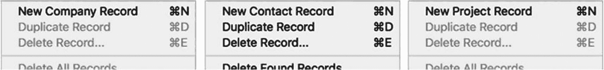
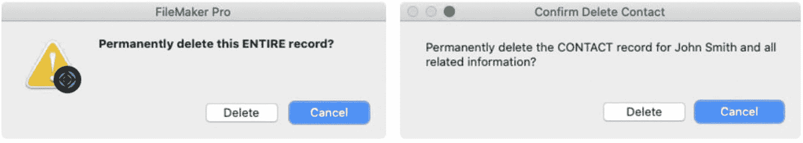

# 修改标准菜单项

让我们通过几个示例来学习自定义标准菜单项：`重命名`、`覆盖功能`和`条件性移除`。本节假设已按照前述方法，通过复制所有标准 FileMaker 菜单创建了一个自定义菜单集。

## 重命名菜单项

标准菜单项的名称是通用性的，用于描述`功能`，而不指定`上下文`。无论用户正在查看哪个布局，菜单项始终命名为`新建记录`、`删除记录`或`复制记录`。当用户在不同布局之间切换时，尤其是在打开多个窗口的情况下，这可能会造成混淆。当他们选择`新建记录`时，可能会在不相关的表中创建记录。使用自定义菜单，可以通过公式设置名称，该公式会查看当前布局上下文，将表名包含在菜单项中，例如，"新建联系人记录"或"新建项目记录"。

首先，打开`管理自定义菜单`对话框，单击`自定义菜单`标签页。双击`记录`菜单以打开`编辑自定义菜单`对话框。在列表中选择`新建记录`菜单项，并启用`Item Name`（项目名称）复选框以覆盖默认名称。单击`Specify`（指定）打开`指定计算`对话框（如果未自动打开）。然后输入一个名称公式。具体公式可能因数据表而异。如果它们的命名清晰，如我们之前使用的示例——`联系人`、`公司`和`项目`——则以下公式应能生成如图 23-13 所示的条件性菜单项。此过程可针对`记录`菜单中的许多项重复进行，不过让菜单中的第一个项指定数据表，即可为其余项提供良好的上下文定位，可能已经足够。



图 23-13  
条件性命名的"新建记录"菜单示例

```
"New " & Get ( LayoutTableName ) & " Record"
```

## 覆盖菜单项功能

可以为菜单项附加自定义脚本，以覆盖标准菜单的功能，或为自定义项提供功能。对于前者，请考虑以下事实：`删除记录`和`删除全部记录`功能都会显示相当模糊、通用的对话框消息。这两个对话框都要求用户确认删除过程，但都没有明确说明将要删除的具体内容。`删除记录`过程会询问"永久删除这整条记录？"默认用户明确知道自己将要删除哪条记录。然而，在列表视图或使用多个窗口时，用户可能会迷失方向，意外删除错误的记录。如上节所述重命名菜单项可以避免这种情况，但使用带有更清晰对话框的自定义脚本则能提供额外的保护。使用`显示自定义对话框`步骤（第 25 章）的脚本可以显示更具体的确认提示。例如，消息可以包含表名和代表该记录的字段内容（例如，联系人或项目名称），和/或同时自动删除相关材料的通知。一旦确定了所需的消息公式，创建一个脚本，执行询问用户、评估其响应并采取适当操作（或不操作）的步骤。以下示例脚本会显示一个包含你插入的任何消息公式的对话框。用户点击的按钮将被存入一个`$button`变量中，该变量在`If`语句中用于判断，如果用户点击`取消`则`退出脚本`。如果用户未取消，脚本继续执行，在不显示默认对话框的情况下执行`删除记录/请求`步骤。

```
Show Custom Dialog [ "Confirm Deletion Request" ; "" ]
Set Variable [ $button ; Get ( LastMessageChoice ) ]
If [ $button = 1 ] // 取消按钮
Exit Script
End If
Delete Record/Request [ with dialog:Off ]
```

编写并测试后，覆盖`删除记录`菜单项的`Action`（操作），使其指向自定义脚本。现在，默认消息应被自定义脚本对话框取代，如图 23-14 所示。



图 23-14  
默认删除对话框（左）与自定义示例（右）


