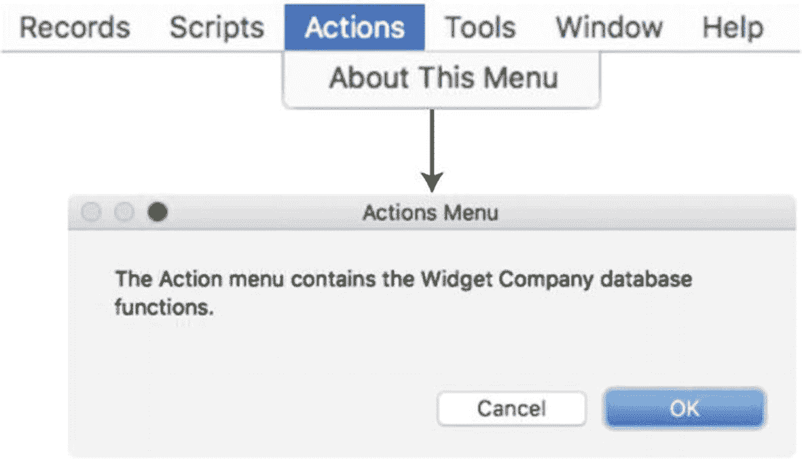
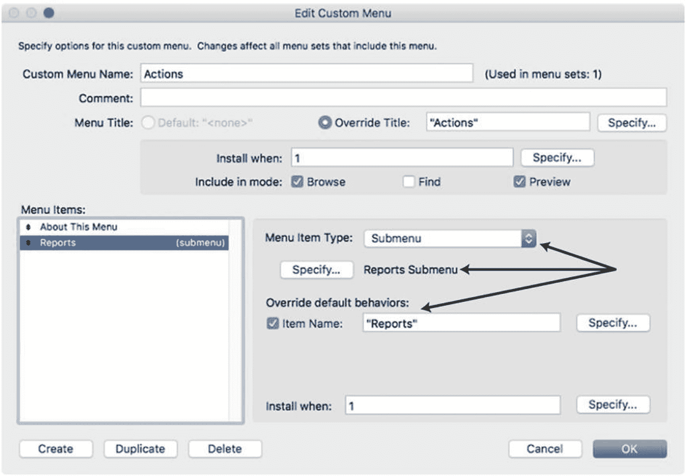
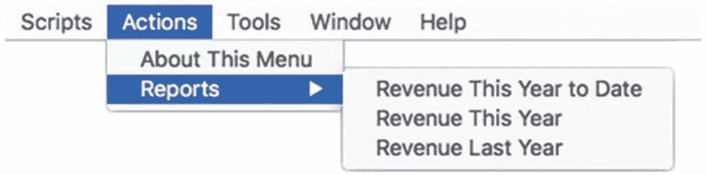

# 条件性移除菜单项

可以根据特定条件有条件地隐藏菜单。例如，`Delete All Records`菜单项对开发者和知识型用户很有用，但对某些其他用户来说可能存在危险。用户可能认为自己在删除一个小的找到记录集，却不小心删除了表中的每条记录。为避免这种情况，通过修改控制菜单项安装时机的公式来隐藏该菜单。点击菜单项`Install when`设置旁边的`Specify`按钮。然后输入一个公式，该公式对允许使用该功能的任何用户、权限集或扩展权限评估为`1`（真），对其他所有人评估为`0`（假）。例如，以下公式将仅为对文件拥有`full access privileges`的开发者用户安装该菜单项（第 30 章）：

```
Case (
Get ( AcccountPrivilegeSetName ) = "[Full Access]" ; 1 ;

)
```

当条件可能导致菜单功能引发错误或让用户困惑时，隐藏自定义菜单是个好主意。例如，某些自定义项不应在查找模式、查看空找到集或卡片式窗口打开时可访问（第 25 章）。

## 添加自定义菜单

添加一个全新的菜单可以为用户提供便捷访问自定义脚本的方式，而无需在布局上堆砌几十个按钮或在标准菜单中塞满大量项目。

一个包含几十个脚本的数据库，这些脚本可按状态或其他条件在不同表中查找记录组，可以将它们放在`Records`菜单下。类似地，针对发票和其他表的报表脚本可以放在`File`菜单下，靠近`Print`项。这样会将自定义功能集成到现有菜单中，在这些或类似情况下可能是可取的。然而，当添加大量此类项目时，会增加原本拥挤的菜单的混乱程度，并且需要用户了解访问这些自定义脚本的所有不同位置。相反，考虑让自定义菜单项的位置更加便捷。

`Scripts`菜单（第 24 章）可以用于此目的，因为它允许脚本选择性包含在基于文件夹的分层子菜单结构中。然而，有时创建完全自定义的菜单是有益或可取的，以提供更专业的品牌化界面。当菜单需要任何形式的编程可变性时，这一点尤其重要，因为默认的`Scripts`菜单项无法动态更改名称、拥有自定义快捷键或被条件性隐藏。

添加一个或多个全新的菜单可以解决这些问题，并提供真正的自定义应用体验。具体设置将根据需要在菜单中存在的功能数量和种类而变化。使用前面的例子，当面临大量搜索和报表脚本时，开发者可以添加两个菜单：`Searches`和`Reports`。然而，如果每个菜单中的项目数量很少，或者它们是需要的大量自定义菜单中的两个，则可以考虑添加一个名为`Actions`的菜单，并将每个类别作为子菜单。或者，一个以客户命名的自定义菜单是添加个性化自定义操作集合的好方法。

### 创建 Actions 菜单

要创建新的`Actions`菜单，打开`Manage Custom Menus`对话框，点击`Custom Menus`选项卡，然后点击`Create`按钮。接着按照以下步骤操作：


**图 23-15** 菜单栏中出现的新菜单

1.  选择`Start with an empty menu`并点击`OK`。
2.  在`Edit Custom Menu`对话框中，输入自定义名称（例如“Actions”），输入同名的覆盖标题，并仅将菜单包含在浏览模式中。然后点击`OK`。
3.  点击`Manage Custom Menus`对话框的`Custom Menu Sets`选项卡。
4.  选择`Learn FileMaker`菜单集并点击`Edit`。
5.  在`Edit Custom Menu Set`对话框中，点击`Add`。
6.  在打开的`Select Menu`对话框中，滚动到底部，选择`Actions`菜单，然后点击`Select`按钮。
7.  在`Edit Custom Menu Set`对话框中，将`Actions`菜单拖拽到菜单列表中的所需位置。
8.  点击`OK`关闭`Edit Custom Menu Set`对话框，然后点击`OK`关闭`Manage Custom Menus`对话框。如果自定义菜单集处于活动状态，菜单栏应显示一个新的`Actions`菜单，如图 23-15 所示。

### 向 Actions 菜单添加项目

将新的`Actions`菜单添加到菜单集后，根据需要添加菜单项。

#### 添加命令菜单项

要添加命令项，返回`Manage Custom Menus`对话框的`Custom Menus`选项卡，打开自定义`Actions`菜单。然后点击`Create`按钮添加新的菜单项。从一个简单示例开始，创建一个显示对话框的“About This Menu”项，步骤如下：

1.  启用`Item Name`复选框，并在相邻的文本区域中输入名称“About This Menu”。
2.  启用`Action`复选框。
3.  在`Specify Script Step`对话框中，选择`Show Custom Dialog`步骤（第 25 章），并将其配置为显示描述菜单用途和功能的消息。
4.  点击`OK`保存并返回所有对话框。

现在`Actions`菜单应有一个菜单项，显示描述其功能的对话框，如图 23-16 所示。



**图 23-16** 自定义菜单项及生成的对话框

#### 添加子菜单项

当菜单变得过于拥挤时，可以组织项目分组。使用分隔符可以帮助将一长串项目划分为不同的组。对于更复杂的情况，使用子菜单将项目组织成子类别，使用户更容易找到特定功能。例如，`Searches`子菜单可以列出所有可用的搜索功能，而`Reports`子菜单可以列出所有报表，将这两组项目从`Actions`菜单的主列表中移出。

提示

考虑使用“七法则”来决定何时使用分隔符或子菜单对菜单项进行分组。当一组项目接近或超过七个时，考虑将它们与其他组分开。

首先，创建一个包含一些项目的新自定义菜单。该菜单不会直接作为菜单添加到菜单集中，而是作为子菜单附加到另一个菜单的某个项目上。例如，创建一个名为`Reports Submenu`的新自定义菜单，并为每个你计划创建的报表脚本添加一个菜单项占位符，例如：`Revenue This Year to Date`、`Revenue This Year`和`Revenue Last Year`。目前，这些不会真正运行脚本，仅用于说明子菜单的设置。创建完成后，返回编辑`Actions`菜单，创建一个名为“Reports”的新项目，并将其配置为指向`Reports Submenu`的子菜单，如图 23-17 所示。



**图 23-17** 附加到`Actions`菜单中项目的子菜单示例

保存并退出所有对话框后，`Actions`菜单现在应显示一个`Reports`子菜单，如图 23-18 所示。



**图 23-18** 子菜单对用户显示的示例


