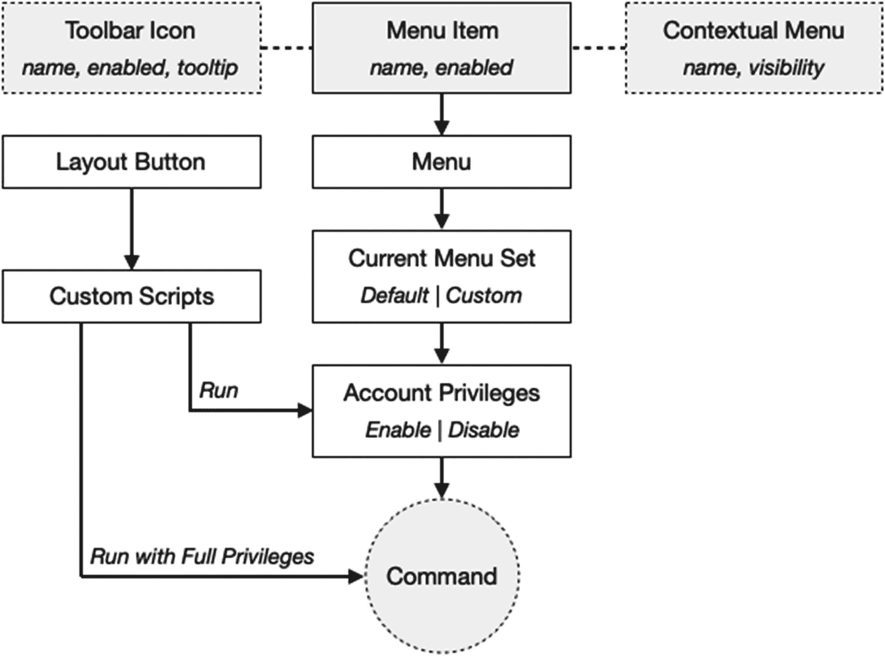
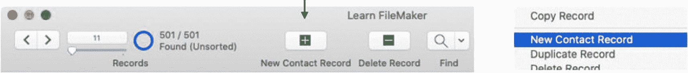
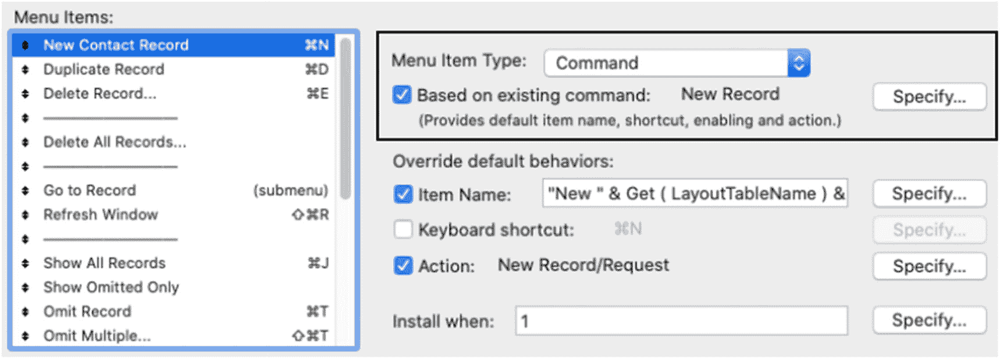

# 探索命令与菜单之间的关联

FileMaker Pro 应用程序界面中内置的某些元素为用户提供了对标准命令的访问权限，但未向开发者提供直接的自定义选项。例如，`新建记录`命令出现在多个位置：工具栏图标、记录右键菜单项以及表格视图中嵌入的某些控件。虽然菜单可以自定义，但工具栏和其他右键菜单无法直接修改。然而，FileMaker 通过将这些元素与命令*通过活动的菜单组*进行关联来解决这个问题，如图 23-19 所示。这些静态界面元素从*命令关联的菜单项*中提取其*名称*、*工具提示*和*启用状态*，并将点击操作通过菜单项路由至命令。这种设置使得在使用自定义菜单时，可以间接自定义这些标准界面元素。

图 23-19

命令与界面元素的集成

这方面的一个典型例子是`新建记录`命令，它出现在`记录`菜单以及前面提到的所有其他位置。核心的`新建记录`命令会根据用户账户权限被启用或禁用（第 30 章），不过这些权限可以被以完全权限运行的自定义脚本绕过（第 24 章）。默认菜单项与该命令关联，并根据用户的凭据自动启用或禁用。其他访问点（如工具栏图标）会基于`新建记录`命令在*菜单*中查找对应项，以确定其名称、工具提示和启用状态。点击这些界面元素中的任何一个，都相当于直接选择该菜单项。因此，命令关联的菜单项充当了该命令的中心枢纽，这使得用自定义菜单组替换默认菜单组成为可能，同时仍能控制这些不可自定义的界面元素。如果菜单项的名称被自定义，该命令的工具栏图标也会随之更新，如图 23-20 所示。如果为菜单项分配了一个自定义脚本，那么工具栏图标将运行该脚本，而非默认命令。与这些元素不同，布局上的按钮不通过命令-菜单结构进行关联，只能通过脚本来运行命令。

图 23-20

修改后的图标（左侧）和右键菜单（右侧）

当从活动的菜单组中移除一个标准的`新建记录`命令关联菜单项时，这些其他界面元素将被禁用。可以创建一个新的菜单项，为其命名并分配一个用于创建记录的脚本动作，但该菜单项不会自动代表该命令，除非在`编辑自定义菜单`对话框中通过`基于现有命令`设置将其与命令关联起来，如图 23-21 所示。

图 23-21

菜单项的命令链接允许基于权限启用和自定义标准界面元素

菜单项与标准命令之间的关系可以有三种形式。*如果菜单项仅与标准命令关联，没有*名称或脚本重写，那么它将正常显示并执行与该命令关联的标准功能，同时正常影响其他界面元素。*如果菜单项未与标准命令关联，并被赋予了自定义名称和脚本，*那么它将执行自定义脚本作为其功能，但其他与命令相关的界面元素将被禁用或隐藏。当这两种情况结合，即菜单项*与标准命令关联，但重写了名称或脚本*时，它将显示自定义名称，执行分配的自定义脚本，同时基于权限继续自动启用，并将这些能力扩展到标准界面元素。

