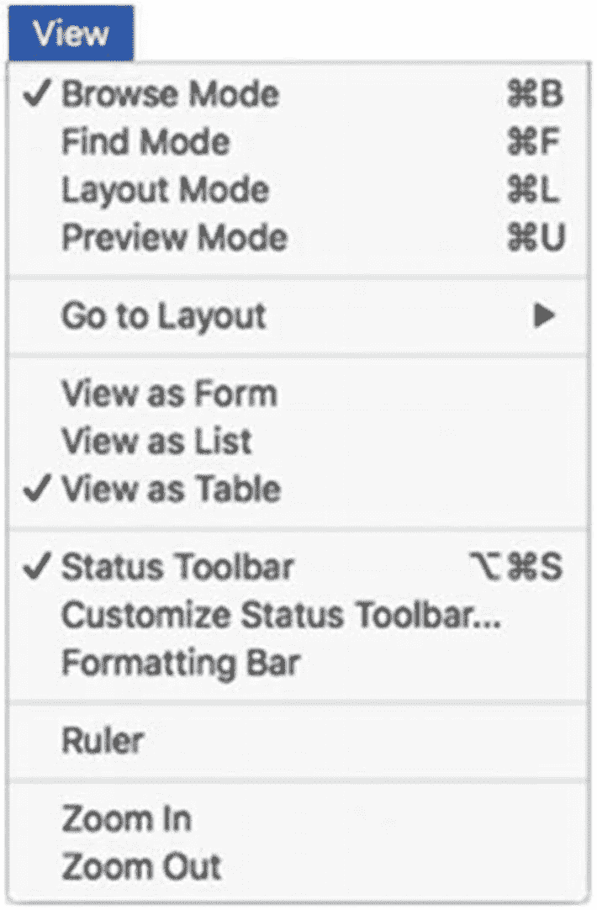

# 创建基于状态的自定义菜单

某些标准菜单项是基于状态的，也就是说，它们指示某种操作模式的状态。*视图*（View）菜单中就有几个这样的例子，如图 23-22 所示。一些基于状态的菜单是单个菜单项，用于切换某个开关设置。例如，*状态工具栏*（Status Toolbar）菜单项在工具栏可见时会显示一个复选标记，而在不可见时则不显示。选择这个菜单项可以来回切换该选项。其他例子则将菜单组合在一起，形成多选状态菜单，这种情况下选项超过两个。在*视图*菜单顶部的四种可用模式中，总有一种旁边会带有复选标记，表示它是当前的活动窗口模式。同样，在三个*视图方式*（View as）选项中，也会有一个被标记，指示当前为活动窗口选择的视图内容。



**图 23-22** – 基于状态的菜单在激活时以复选标记表示

当菜单项基于命令时，它们将继续以这种方式运行。除此之外，没有内置选项可以使一个或一组自定义菜单项变为基于状态，也没有办法在适当位置包含复选标记来模拟这种状态。然而，由于菜单项的名称可以是计算的结果，因此可以让单个菜单项的名称根据当前状态改变，从而在用户每次选择该项时产生类似的切换效果。例如，可以将一个菜单项配置为在两个名称之间交替，如“启用工具提示”和“禁用工具提示”。这可以通过创建一个存储当前状态值的全局变量，并用它来生成菜单项的名称来实现。分配给菜单操作的自定义脚本会查看变量的当前值，以确定如何切换到相反状态，进而修改菜单项的名称。

为了说明这种方法，让我们在*操作*（Actions）菜单下创建一个自定义菜单项，其*名称*（Name）公式如下例所示。首先，它使用一个*Let*语句来初始化 `$$Mode_Tooltips` 变量（如果尚未包含值）。这是通过一个*Case*语句完成的，该语句检查变量是否为空字符串，若是则将其设置为 0，若找到值则使用当前值。然后，它使用另一个*Case*语句来创建一个反映当前值所对应操作的菜单名称。如果变量值为 0，表示工具提示关闭，则名称为“启用工具提示”；如果全局变量值为 1，表示工具提示开启，则名称为“禁用工具提示”。

```
Let ( [
$$Mode_Tooltips = Case ( $$Mode_Tooltips = "" ; 0 ; $$Mode_Tooltips )
] ;
Case ( $$Mode_Tooltips = 1 ; "Disable Tooltips" ; "Enable Tooltips" )
)
```

该菜单项的*操作*（Action）应配置为运行一个脚本，该脚本使用*设置变量*（Set Variable）脚本步骤（第 25 章“设置变量”）通过以下*Case*语句来切换变量中的值。为了刷新当前布局的菜单名称，该脚本还需要执行*安装菜单集*（Install Menu Set）步骤来重置自定义集。

```
Case ( $$Mode_Tooltips = 1 ; 0 ; 1 )
```

一旦菜单就位，每个在检查器（Inspector）窗格的*定位*（Position）选项卡中分配了工具提示的布局对象，都可以使用以下公式来确定是否应显示工具提示：

```
Case ( $$Mode_Tooltips = 1 ; "" ; "" )
```

现在，当用户选择*启用工具提示*时，全局变量被赋值为 1，当光标悬停在对象上时工具提示开始出现，并且自定义菜单项的名称变为*禁用工具提示*，这将隐藏工具提示的显示。

## 总结

本章介绍了创建自定义菜单的选项，以便对应用程序界面进行完全控制。在接下来的章节中，我们将开始创建可以分配给菜单、按钮和事件触发的脚本，以自动执行一系列操作。

