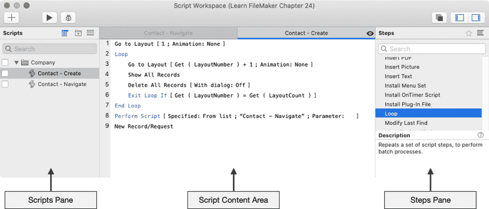
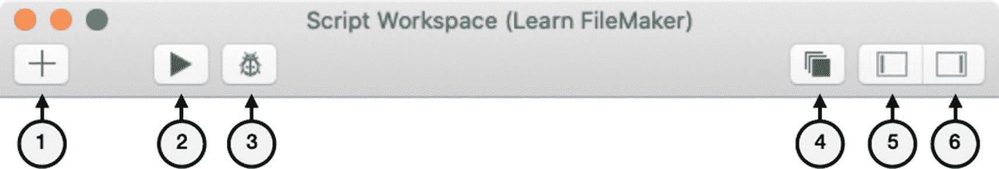
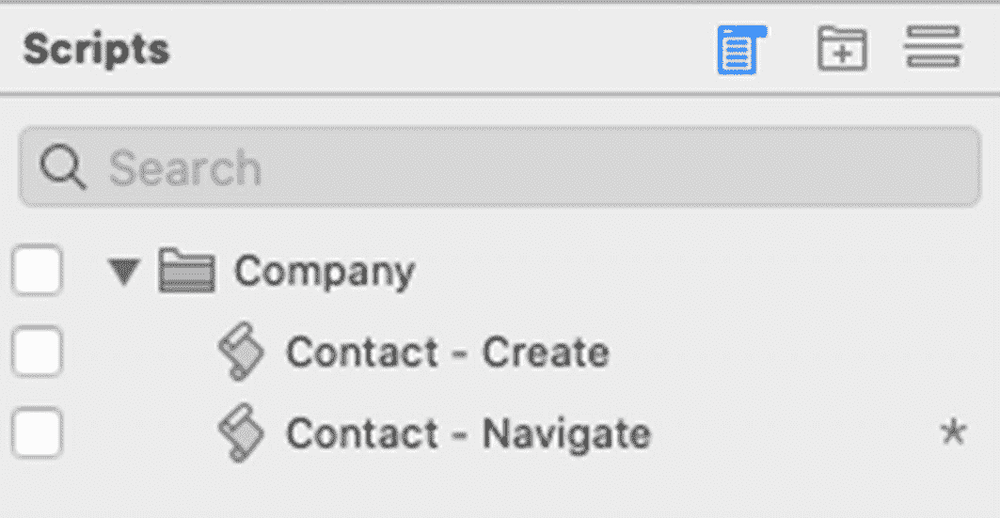
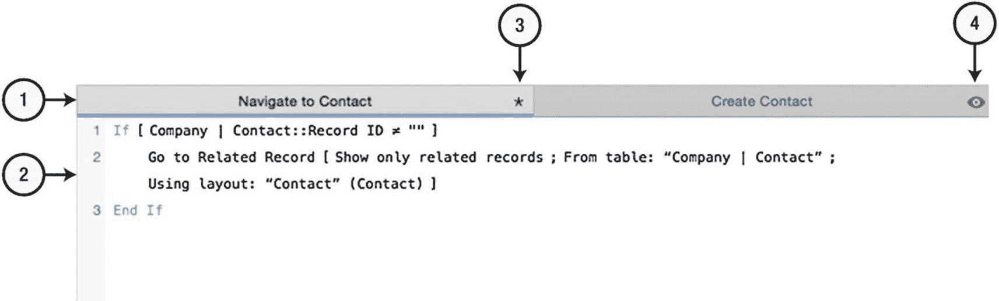
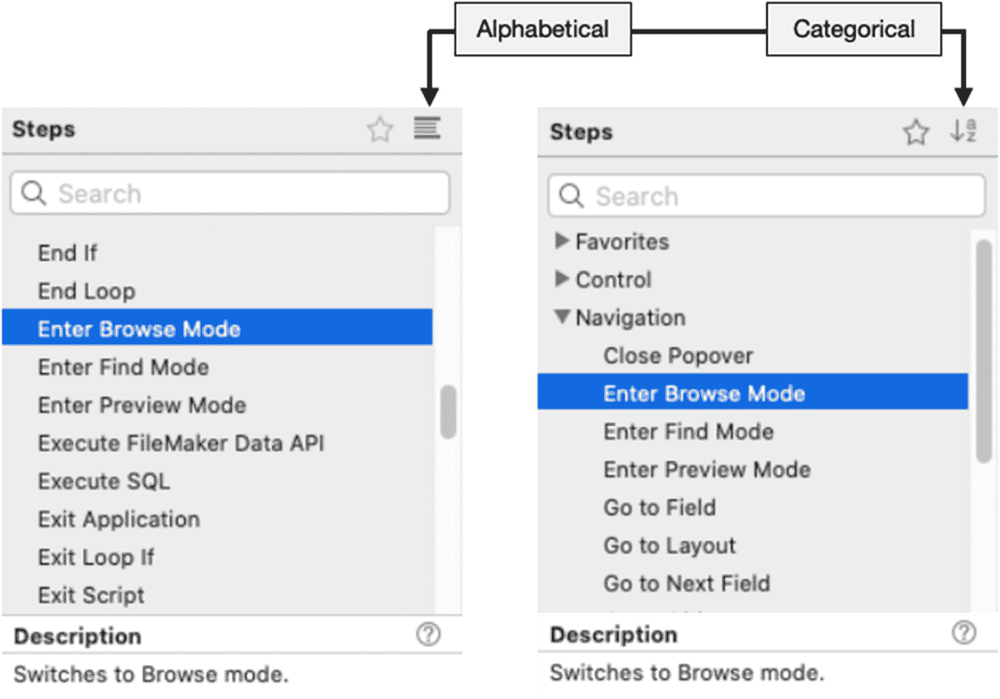
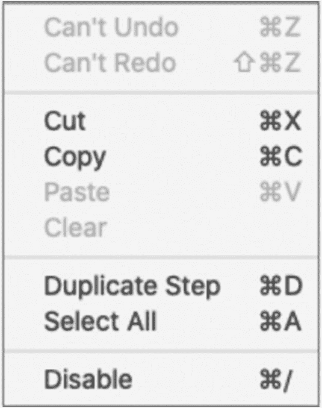
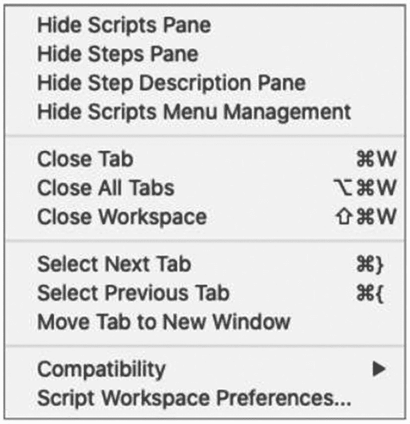

# 24. 脚本简介

脚本（有时称为宏）是开发者定义的、存储起来供以后执行的操作序列。创建后，脚本可以连接到界面对象（第 20 章）、菜单项（第 23 章）和界面事件触发（第 27 章）。它们也可以由其他脚本、外部脚本语言（如 macOS 上的 *AppleScript* 或 Windows 上的 *ActiveX*）运行。还有选项可以通过 URL（第 20 章）、Web 查看器 HTML 中的 JavaScript 代码（第 20 章）或基于 FileMaker Server 调度来运行脚本。通过一次点击执行复杂任务，脚本可以为用户节省大量时间，同时提高一致性、减少错误并提高生产力。脚本编程将数据库从花哨的电子表格转变为功能齐全的自定义应用程序。它使用户不必再手动执行繁琐的数据输入工作，从而能够将更多注意力集中在创造性工作和客户互动上。FileMaker 提供了许多即用型的脚本步骤，可以导航、搜索、排序、打印、导出、通信等（第 25 章）。插件可以向可用步骤库添加新功能（第 28 章）。本章介绍脚本编程，涵盖以下主题：

-   脚本工作区简介
-   编写脚本
-   执行其他脚本
-   强调上下文的重要性
-   管理脚本错误

## 脚本工作区简介

脚本在*脚本工作区*（Script Workspace）窗口中查看、编写和管理，如图 24-1 所示。可以通过选择*文件 ➤ 管理 ➤ 脚本*（File ➤ Manage ➤ Scripts）菜单项或*脚本 ➤ 脚本工作区*（Scripts ➤ Script Workspace）菜单项来打开此窗口。工作区分为四个部分：*工具栏*（toolbar）、*脚本窗格*（scripts pane）、*脚本内容区域*（script content area）和*步骤窗格*（steps pane）。

**注意：** 新数据库中的工作区会隐藏元素，直到创建第一个脚本。点击 + 按钮开始。

**图 24-1** – 用于定义脚本的工作区

### 探索工作区工具栏

`脚本工作区`窗口的`工具栏`，如图 24-2 所示，是一个专注于脚本设计与故障排查的静态控件工具栏。

*图 24-2*

工作区工具栏包含多个静态按钮。工具栏中提供了以下功能按钮：

1.  `创建脚本` – 创建一个新的脚本，并打开以供编辑。
2.  `运行脚本` – 使用其背后最前端窗口的上下文，直接从`脚本工作区`运行选定的脚本。
3.  `脚本调试器` – 打开`脚本调试器`窗口并运行选定的脚本（第 26 章）。
4.  `兼容性` – 根据与选定设备和软件平台的兼容性，减少`步骤`窗格和内容区域中的步骤。
5.  `脚本窗格` – 切换窗口左侧`脚本`窗格的可见性。
6.  `步骤窗格` – 切换窗口右侧`步骤`窗格的可见性。

### 探索脚本窗格

窗口左侧的`脚本窗格`显示文件中定义的每个脚本的列表。可以通过单击工具栏按钮来切换窗格的可见性。脚本以图标和名称的形式显示，如图 24-3 所示。在该窗格中，每个脚本都是一个交互区域，隐藏了多种功能。

*图 24-3*

工作区窗口左侧的脚本窗格。

- `单击`脚本名称将选中它并在内容区域中打开，以便查看和编辑。如果未修改，则在选中另一个脚本时自动关闭。
- `再次单击`已选中的脚本将导致其名称直接在列表中变为可编辑状态。编辑名称后按`回车键`。
- `双击`将在锁定标签页中打开脚本，该标签页将保持打开状态，直到明确关闭。
- `右击`打开一个上下文菜单，其中包含`脚本`菜单中也存在的功能。

可以使用`脚本文件夹`来组织脚本组。点击`脚本窗格`顶部的中间`+`图标创建新文件夹，然后输入名称并按`回车键`。创建后，可以将脚本从列表拖入文件夹。文件夹可以拖入其他文件夹以创建嵌套层次结构，该层次结构可以折叠或展开以隐藏或显示每个文件夹的内容。与脚本类似，对文件夹连续单击两次可以使其名称变为可编辑状态。

可以在列表中的任意位置插入`分隔线`，以在较长的文件夹或脚本列表之间创建视觉空间。只需单击窗格顶部右侧的线条图标即可。

当查看常规窗口时，复选框默认使脚本、文件夹或分隔线出现在`脚本`菜单中。如果复选框不可见，请单击顶部的第一个图标。包含在菜单中的文件夹会形成子菜单，脚本则成为用户可以选择运行脚本的菜单项。

列表中的脚本、分隔线和文件夹可以删除、复制等操作，可以使用上下文菜单中的命令以及仅在`脚本工作区`打开时才可见的`脚本`菜单中的命令。

### 探索脚本内容区域

`脚本工作区`窗口中央的`脚本内容区域`显示打开的脚本，并用于查看或编辑定义当前选定的操作步骤。如图 24-4 所示，脚本会自动在标签页中打开，方便在多个打开的脚本之间前后跳转。也可以使用标签页上的上下文菜单或`脚本`菜单中的功能将其移动到单独的窗口中。

*图 24-4*

工作区窗口的脚本内容区域。

1.  `脚本标签页` – 将光标悬停在标签页上可显示并单击关闭图标。右键单击可打开功能上下文菜单。水平拖动可重新排列标签页。
2.  `脚本步骤` – 交互式行的编号列表，每行代表脚本化过程中的一个步骤。
3.  `未保存更改指示符` – 此星号图标表示脚本自打开后已被修改。
4.  `预览模式指示符` – 表示脚本以临时状态打开，未做任何更改。

### 步骤窗格

`脚本工作区`窗口右侧的`步骤窗格`包含所有可用的操作步骤列表，如图 24-5 所示。这包括`内置`步骤和已安装`插件`中的步骤。窗格的可见性需要选中一个脚本，也可以通过单击工具栏按钮来切换打开或关闭。可以使用图中所示的顶部图标在字母顺序或分类排列之间切换列表。

*图 24-5*

步骤窗格可以按字母顺序（左）或层次结构（右）排列。

可以通过双击脚本步骤或右键单击并从上下文菜单中选择`插入到脚本`，将脚本步骤插入到当前打开的活跃脚本中。该菜单包含将步骤添加到`收藏夹`类别（仅当步骤以分类层次结构查看时可用）或从其中移除的选项，或者打开在线帮助指南中的步骤。底部的`描述窗格`提供所选步骤的简要描述，帮助图标按钮可打开在线文档。

### 菜单更改（脚本工作区）

在`脚本工作区`中工作时，菜单栏会发生根本性变化。任何活动的菜单集（标准或自定义）都会被专门用于处理脚本的菜单集所取代。许多不相关的标准菜单被完全移除，而`编辑`、`视图`和`脚本`菜单则发生了根本性变化。

#### 编辑菜单

工作区的`编辑`菜单包含一组修改后的功能，如图 24-6 所示。在诸如`剪切`、`复制`和`粘贴`等标准功能之下，新增了`复制步骤`项目以及用于`禁用/启用`选定脚本步骤的切换项目。

*图 24-6*

在脚本工作区中工作时的编辑菜单。

#### 视图菜单

工作区的`视图`菜单包含一套完全独特的功能，如图 24-7 所示。此菜单提供了用于切换窗格可见性、管理标签页和其他功能的基本工作区功能，其中包括许多可通过工作区内的各种按钮和上下文菜单访问的功能。

*图 24-7*

在脚本工作区中工作时的视图菜单。

