# 脚本菜单

在`脚本工作区`中工作时，`脚本`菜单会完全变换形态，如图 24-8 所示。它包含了`创建`、`导入`、`打开`、`重命名`、`复制`、`删除`、`保存`、`还原`和`运行`脚本的功能，其中许多功能也出现在工具栏或上下文菜单中。一个值得注意的功能是`授予/撤销完全访问权限`，它可以将选定的脚本配置为以`完全访问权限`运行，即使当前用户没有完全访问权限（第 30 章）。当脚本被授予完全访问权限后，其名称旁边会出现一个小人物图标。

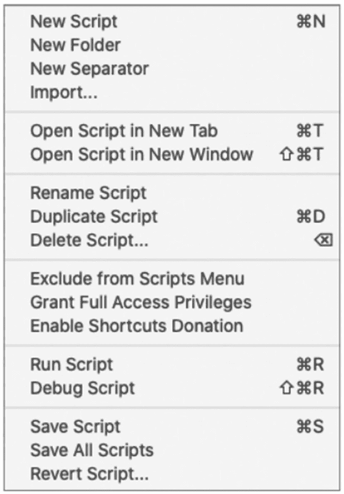

**图 24-8**

在脚本工作区中工作时的脚本菜单

**警告**

`脚本`菜单仅适用于 macOS。在 Windows 系统中，这些功能位于修改后的`文件`和`编辑`菜单中。

## 编写脚本

要创建脚本，请点击工具栏中的`+`按钮，或选择`脚本 ➤ 新建脚本`菜单项。新脚本将出现在`脚本窗格`中，并以选项卡形式打开，编辑焦点集中在标签上，等待输入自定义名称。输入名称后按`回车`键，或点击选项卡外部区域以确认。

### 探索脚本步骤基础

`脚本步骤`是插入到脚本工作流中的一条命令指令，它定义了一个作为整体事件序列一部分执行的特定操作。虽然步骤可以通过键盘输入`插入`到工作流中，但它们实际上是`基于对象`而非`基于文本`的。插入后，步骤可以被选中、拖拽、复制、剪切、粘贴或删除，但不能像在基于命令行的脚本环境中那样通过键盘输入进行编辑。某些步骤具有活动区域，允许直接输入公式或选择菜单选项。然而，大多数可配置选项是通过点击打开窗格或对话框来修改的。

#### 插入脚本步骤

可以通过直接键入时的自动补全功能或使用`步骤窗格`将步骤添加到脚本中。

##### 使用自动补全插入步骤

新脚本会有一个空白行。点击该行并开始键入步骤名称以激活自动补全建议界面。可用步骤列表会随着您的键入而出现和过滤，如图 24-9 所示。要选择一个步骤，可以直接点击该步骤、使用键盘方向键，或继续键入直到所需步骤位于列表顶部。选择步骤后，按`回车`键或双击它即可插入。插入后，该步骤会从可编辑文本变为交互式对象。

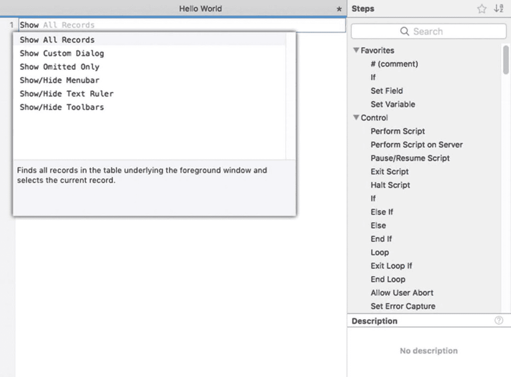

**图 24-9**

自动补全可用的建议

##### 从步骤窗格插入步骤

要使用`步骤`窗格插入，请通过滚动、使用方向键、键入所需步骤的几个字符或使用`搜索`字段过滤列表来找到所需的步骤。选择后，按`回车`键、双击该步骤，或右键点击它并从上下文菜单中选择`插入到脚本`功能，即可将步骤插入脚本工作流。

#### 配置脚本步骤

脚本步骤可分为两大类。`无可配置选项的步骤`将执行预定的功能，没有任何可变性。这些步骤在脚本工作流中仅以名称显示，没有任何交互选项，包括`新建记录/请求`、`转到下一个字段`、`显示所有记录`、`发出蜂鸣声`等命令。它们可以在工作流中拖拽定位，但功能上不能变化。相比之下，`有可配置选项的步骤`在命令名称后以方括号形式出现在工作流中。方括号内可能包含默认设置、值标签，或者为空，如下例所示。配置后，它们将显示全部或部分选定设置。配置步骤选项的方式因步骤而异，但大致可分为两类：`可直接内联配置的`步骤和`需通过选项对话框配置的`步骤。有些步骤则结合了这两种方式。

```
允许用户中止 [ 关闭 ]
进入浏览模式 [ 暂停: 关闭 ]
设置变量 [  ]
执行脚本 [  ]
```

##### 直接内联配置设置

具有`内联直接编辑`选项功能的步骤，其方括号区域之间有一个或多个可直接访问和编辑的界面组件，无需打开单独的窗格或窗口。您会遇到三种不同的内联编辑控件：`公式文本`、`切换按钮`和`菜单`。

###### 使用公式文本进行内联编辑

许多步骤允许进行`内联公式编辑`，即可以直接在脚本步骤中键入公式。这些步骤包括`如果`、`如果退出循环`和`退出脚本`。当内联编辑可用时，方括号之间会出现一个红色方框。当光标悬停时，该方框颜色加深并出现红色轮廓。点击它以展开一个扩大的公式文本区域，如图 24-10 所示。

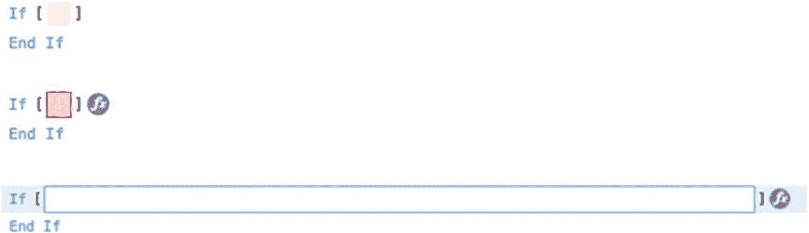

**图 24-10**

公式步骤的静止状态（顶部）、悬停状态（中间）和活动焦点状态（底部）

**注意**

内联公式编辑对于输入简短公式很方便，但不适用于较长公式。点击 `fx` 图标可打开全尺寸的`指定计算`对话框。

内联公式编辑器功能齐全，与`指定计算`对话框（第 12 章，“探索指定计算对话框”）类似。它包括自动补全建议，并支持多行公式输入和编辑，如图 24-11 所示。键入公式后，点击公式区域外部或按`回车`键即可编译并保存。如果检测到公式中存在语法错误，全尺寸的`指定计算`对话框将自动打开并显示错误通知对话框，强制您在保存前解决问题。

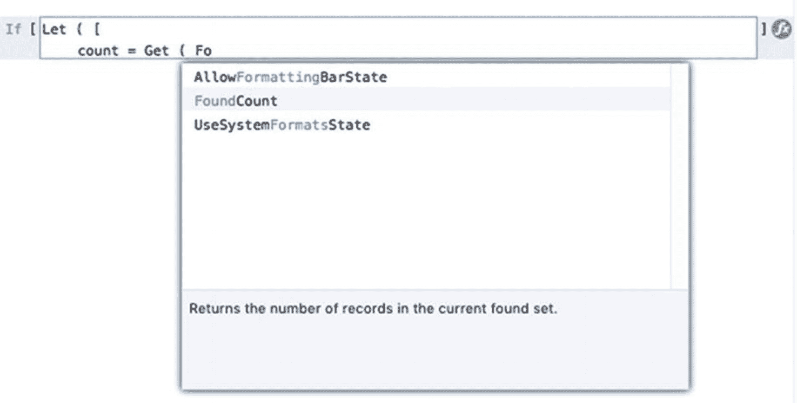

**图 24-11**

显示自动补全界面的内联多行公式

**提示**

要在内联公式中插入回车符，请在按住`Option`键（macOS）或`Alt`键（Windows）的同时按`回车`键。

###### 使用切换按钮进行内联编辑

具有`内联可编辑切换按钮`的步骤允许在两个选项之间进行选择。这些步骤可以通过方括号内带标签的值来识别，该值在逻辑上是二元的，并且当光标悬停时当前值周围会出现蓝色边框，如图 24-12 所示。要切换当前值，请点击它或在选中该步骤时按空格键。

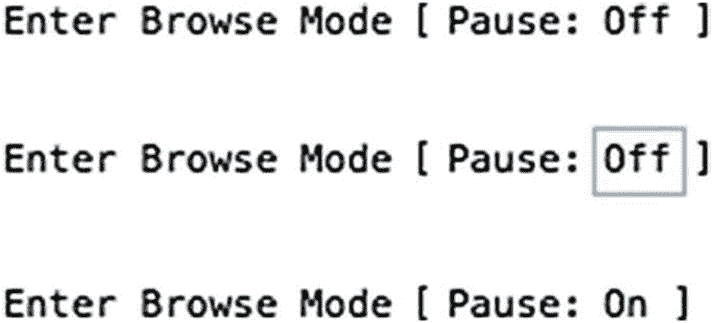

**图 24-12**

切换按钮的静止状态（顶部）、悬停状态（中间）和点击后状态（底部）

**提示**

当与配置选项对话框或弹出框结合使用时，切换设置通常仅可通过内联方式访问，而不会包含在其他选项的对话框中。


###### 带弹出菜单的内联编辑

带有*内联弹出菜单*的步骤允许在多个可选选项中进行选择。这些选项可通过方括号内的值以及光标悬停时勾勒出当前值的蓝色边框来识别。点击该值会显示一个包含其他选项的弹出菜单。每种状态如图 24-13 所示。

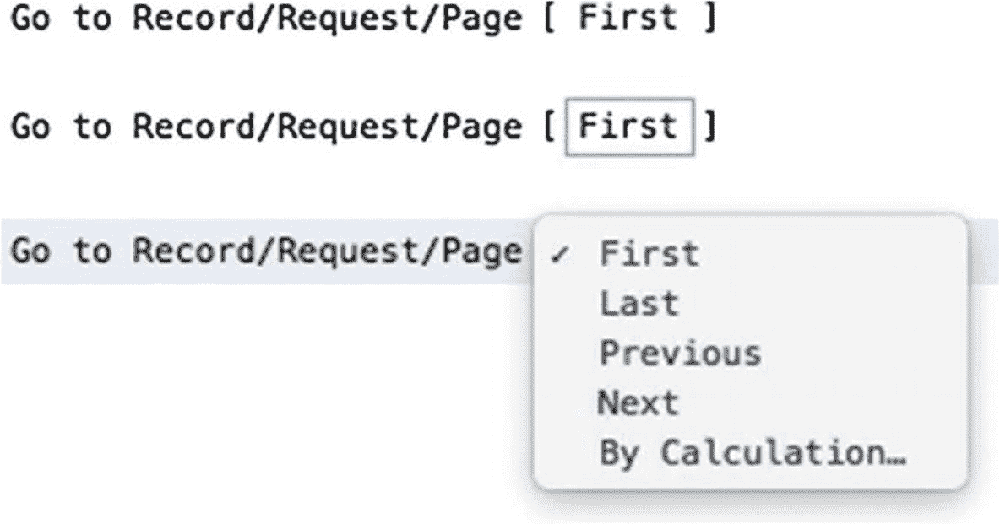

图 24-13

弹出菜单的三种状态：静止（上）、悬停（中）和活动聚焦（下）

##### 使用选项对话框配置步骤

当可用的配置选项过多或某种方式上不利于内联编辑时，步骤会使用*对话框或面板*。虽然许多对话框是步骤特有的，但有些会打开标准对话框，例如*指定字段*和*指定计算*。有些对话框只提供几个简单的选项，而另一些则在按钮旁边汇总设置，这些按钮可打开其他对话框。有些会打开独立的对话框窗口，其他则打开一个与步骤保持连接的弹出面板。打开选项界面的方法也因步骤而异。具有配置对话框的步骤，当光标悬停在语句上时，其右侧会显示一个齿轮图标。点击此图标将打开选项界面，例如图 24-14 中所示的*设置变量*对话框。

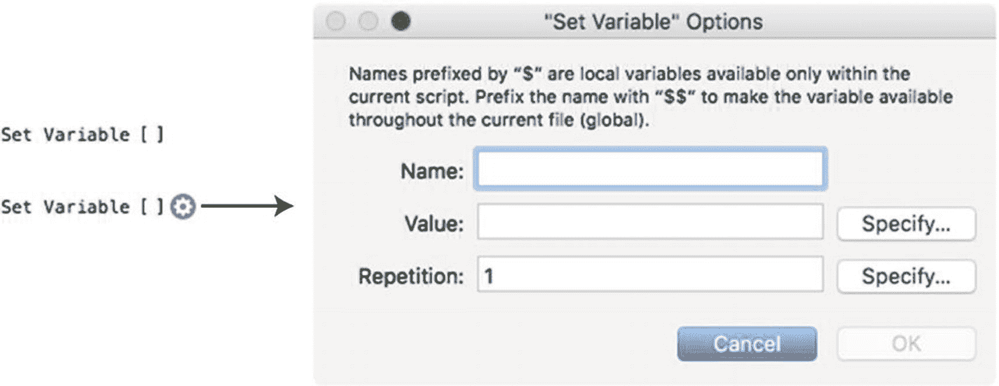

图 24-14

光标未悬停时的步骤（左上）、光标悬停时的步骤（左下）以及点击后打开的选项对话框（右）

在上例中，*设置变量*步骤将使用指定值初始化一个变量。*名称*可以直接输入到第一个字段中，该字段用于建立要更改其值的变量。要放入变量的*值*可以直接输入到字段中，或者通过点击旁边的*指定*按钮打开的完整*指定计算公式*对话框输入。*重复*选项也是如此。有关此步骤的更多详细信息，请参阅第 25 章“设置变量”。

有些步骤不打开完整的对话框，而是打开一个选项面板，如图 24-15 所示。与对话框一样，面板可能包含可直接编辑的设置和打开其他对话框的按钮。在本例中，*进入查找模式*步骤打开一个简单的面板，其中包含一个按钮，用于打开标准的*查找请求*对话框（第 4 章，“编辑查找请求”）。与通常具有“确定”和“取消”按钮的对话框不同，在此类面板中所做的更改会立即保存。可以通过点击面板边界外的脚本工作区或按下 Return 或 Enter 键来关闭弹出面板。


图 24-15

弹出面板简化了某些步骤的选项选择过程

> **提示**
>
> 许多步骤具有多个活动区域，它们结合了不同的配置风格。

##### 指定目标

许多脚本步骤要求您使用对话框指定目标。有些步骤需要变量，并会显示之前描述过的*设置变量选项*对话框的某个版本。少数步骤需要使用*指定字段*对话框（第 20 章，“探索指定字段对话框”）选择字段。许多步骤会显示*指定路径*对话框（本章后面描述）。除此之外，许多步骤还使用*指定目标*对话框，如图 24-16 所示，允许指定字段或变量。在最近的版本中，该对话框已取代许多脚本步骤中的*指定字段*选项。例如，大多数可用的*插入*步骤都已转换为使用此对话框，并且许多较新的*数据文件*步骤也使用它。此对话框允许选择字段或输入变量名，而打开它的脚本步骤还提供对*指定计算*对话框的访问，该对话框用于确定要插入到该目标的值。

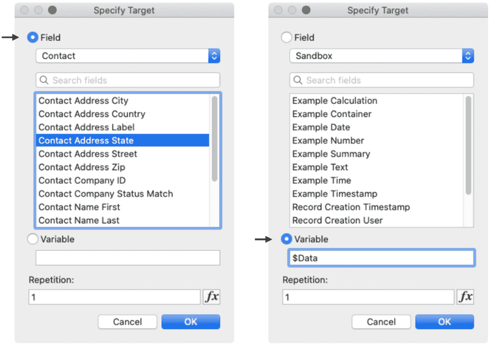

图 24-16

指定目标字段（左）和变量（右）

#### 脚本注释

*脚本注释*是作为非功能性步骤放入脚本中的文本注释。注释显示为前面带有井号或哈希符号的文本行。它们用于提供内联文档，描述脚本或一组步骤的功能。当与空注释结合使用时，它们有助于分隔脚本的不同部分并避免视觉混乱，如图 24-17 所示。当向脚本添加不包含任何内容的注释时，它会变成空行。

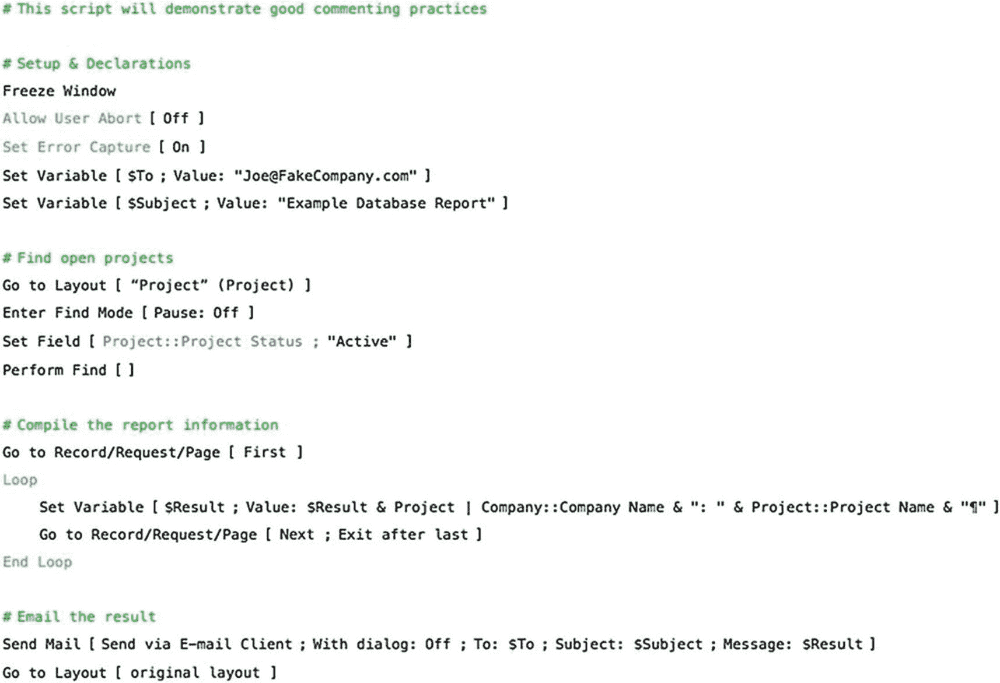

图 24-17

一个包含多个注释的脚本，用于记录和分隔步骤

> **提示**
>
> 可以通过在按住 Option 键 (macOS) 或 Alt 键 (Windows) 的同时按 Return 键来创建多行注释。

## 指定文件路径

在开发界面中，有许多实例需要指定文件路径。这在管理数据源（第 9 章）和脚本步骤（如*导入记录*、*导出记录*、*将记录另存为 Excel*、*将记录另存为 PDF*、*新建文件*、*打开文件*、*从数据文件读取*等）中都可以找到（第 25 章）。路径输入到*指定文件*对话框中，如图 24-18 所示。此对话框的*文件路径列表*文本区域可以包含一个或多个以回车分隔的路径。如果输入了多个路径，FileMaker 将按输入顺序检查每个路径，直到找到指向现有文件的有效路径为止。

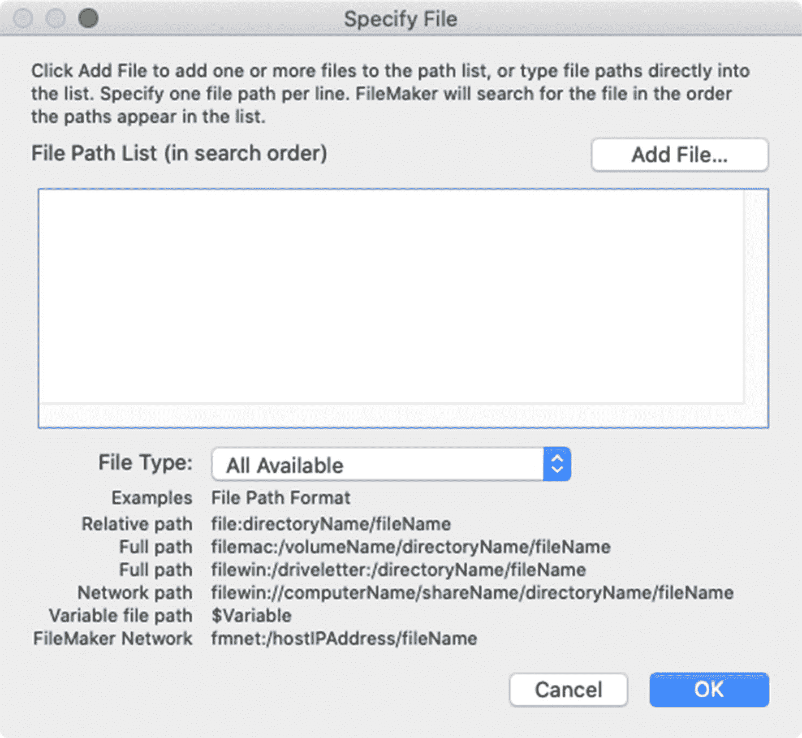

图 24-18

用于指定文件路径的对话框

### 格式化路径

正如对话框上显示的示例所示，可以使用多种格式输入路径，以指向本地目录、服务器文件夹目录或 FileMaker Server 网络地址中的文件。正确格式化路径可能比较棘手，尤其是在处理相对于数据库位置的本地目录中的文件时。有多种前缀可以与不同的路径格式类型混合搭配使用。如果路径输入错误，或者在定义路径后目标文件被移动，则当 FileMaker 尝试访问该文件时，将会出现文件缺失错误。为避免输错复杂路径，请使用*添加文件*按钮及其后的*打开文件*对话框来选择文件，并允许 FileMaker 自动制定最佳路径选项。如有必要，您可以随时进行编辑。

#### 路径前缀

*路径前缀*指示特定的文件类型和/或操作系统：

- `file`、`image`、`or` `movie` – 通用、跨平台的文件路径。
- `filemac`、`imagemac`、`moviemac` – 指向 macOS 计算机上项目的路径。
- `filewin`、`imagewin`、`moviewin` – 指向 Windows 计算机上项目的路径。
- `filenet` – 指向 FileMaker Server 上托管的数据库的路径，与主机的平台无关。如果源数据库和目标数据库都位于同一台服务器上，则使用 `file` 前缀即可，无需考虑服务器上的文件夹结构。

#### 路径类型

FileMaker 路径可以创建为*相对路径*、*完整路径*、*网络路径* (Windows) 和*网络地址路径* (FileMaker Server)。


### 相对路径

*相对路径*从当前数据库位置所在的上下文指定目标文件。此格式假设源数据库和目标数据库均未托管，且其部分目录位置相同。换句话说，它们都是在同一硬盘的同一文件夹中本地运行。尽管有时会令人困惑，但这些路径的优点是允许文件随父文件夹结构一起移动，只要两者之间的相对位置保持不变即可。相对路径的公式如下：

```
file:[pathDifferential]fileName
```

前缀和`fileName`是必需的，当包含它们的两个文件夹之间存在差异时，则需要包含`pathDifferential`。以下示例假设有两个文件：一个名为“Test Source”的当前数据库指向一个名为“Test Target”的数据库。如果这两个文件位于同一个目录文件夹中，则无需包含关于它们位置差异的任何信息，因此路径将只是前缀和目标文件的名字。

```
file:Test Target
```

如果源文件被移动到 macOS 的*桌面*，而目标文件被移动到用户的*文稿*文件夹，那么这两个文件将只有部分路径是共同的：

```
Macintosh HD/Users/john_doe/Desktop/Test Source
Macintosh HD/Users/john_doe/Documents/Test Target
```

在这种情况下，为了让源文件指向目标文件，它需要一个由两个句点和一个正斜杠组成的`pathDifferential`，表示我们必须先在目录层级中向上移动一级，然后向下进入*文稿*文件夹以定位文件，如下路径所示：

```
file:../Documents/Test Target
```

将源文件留在`Desktop`上，如果目标文件被移动到*文稿*中一个名为“Target Subfolder”的子文件夹内，则文件路径将更改为包括该子文件夹。

```
file:../Documents/Target Subfolder/Test Target
```

当源文件被放入`Desktop`上一个名为“Source Subfolder”的文件夹中时，`pathDifferential`必须更改，以表明在向下导航到目标文件的文件夹之前需要向上移动两级。例如，假设这两个文件位于以下文件夹中：

```
Macintosh HD/Users/john_doe/Desktop/Source Subfolder/Test Source
Macintosh HD/Users/john_doe/Documents/Target Subfolder/Test Target
```

因此，文件路径将需要两个*双句点-正斜杠*的层级指示符来向上指向两级，以到达共同的父文件夹，然后再向下进入文件夹结构以找到目标文件，如下路径所示：

```
file:../../Documents/Target Subfolder/Test Target
```

### 完整路径

*完整路径*是从包含它的磁盘卷的上下文指定的、指向目标数据库文件夹的路径。这会建立一个不会改变的绝对路径。只要目标文件保持在原位，无论源数据库位于何处，该路径都将有效。完整路径可用于本地启动硬盘、外置磁盘上的 macOS 目录以及 Windows 本地目录。绝对路径的公式根据用户计算机的操作系统略有不同。

```
filemac:/volume/directoryName/fileName
filewin:/driveLetter:/directoryName/fileName
```

例如，如果文件位于 macOS 计算机用户的*文稿*文件夹中，路径的格式应如下所示：

```
filemac:/Macintosh HD/Users/alex_smith/Documents/Test Target
```

通用的`file`前缀也适用于完整路径，并且完全跨平台。

```
file:/Macintosh HD/Users/alex_smith/Documents/Test Target
```

### 网络路径（仅限 Windows 共享目录）

*网络路径*是指向存储在 Windows 环境服务器目录中的目标数据库文件的路径。网络路径的公式是：

```
filewin:/computerName/shareName/directoryName/fileName
```

例如，路径可能是：

```
filewin:/Company_Server/Databases/Sales/Test_Target
```

### FileMaker Server 网络路径

*FileMaker 网络路径*是指向托管在 FileMaker Server 计算机上（而非任何形式的文件共享）的目标数据库文件的路径。网络路径的公式是：

```
fmnet:/addressOrName/fileName
```

例如：

```
fmnet:/192.100.50.10/Test Target
fmnet:/FileMaker-Server.local/Test Target
```

如果源数据库与目标数据库托管在同一个服务器上，则可以使用简单的相对路径，如下所示。使用这种方法将使数据库“面向未来”，因为即使服务器地址发生变化，它也能继续工作。

```
file:/Test Target
```

### 构建动态路径

与作为文本键入的字面路径不同，*动态路径*可以从一个用户的计算机自动更改为下一个用户。有几种技术可以帮助保持路径的动态性：*使用变量*、*使用函数*以及*排除文件扩展名*。

#### 在路径中使用变量

在“指定文件”对话框中输入的路径可以包含指定整个路径或路径一部分的变量。例如，一个使用*设置变量*步骤（第 [25] 章）的脚本可以将常用目标文件的网络地址和文件名存储在全局变量中，并在构建路径时使用它们。或者，可以将整个路径放入单个变量中。需要路径的脚本步骤也可以使用存储在局部变量中的路径。这些示例展示了路径如何使用变量作为路径的一部分或全部：

```
fmnet:/$$ServerAddress/$$FileName
file:$$PathToExport
$PathToImportFile
```

当向脚本步骤提供了无效路径时，它通常会报错并显示一条相当晦涩的消息。在变量中构建路径使得排查这些问题成为可能，因为在将其嵌入脚本步骤之前就可以访问该值。当路径跨多个脚本步骤动态构建，并且可能以一种不明显的方式不遵守正确的格式要求时，这一点尤其重要。一个*显示对话框*步骤可以在需要路径的步骤之前显示该变量以供检查。作为一个变量，它也可以在数据查看器（第 [26] 章，“探索数据查看器”）中进行监控。通常，只需查看路径就能立即揭示错误的根源。

#### 使用函数生成本地路径

FileMaker 的几个内置函数可以自动生成指向用户计算机上标准文件夹的路径。它们可以在公式中用于构建动态路径，无论启动磁盘或主目录的名称是什么，这些路径都能工作。

```
Get ( SystemDrive )     // result = /Macintosh HD/
Get ( DesktopPath )     // result = /Macintosh HD/Users/karen_camacho/Desktop/
Get ( DocumentsPath )   // result = /Macintosh HD/Users/karen_camacho/Documents/
Get ( PreferencesPath ) // result = /Macintosh HD/Users/karen_camacho/Library/Preferences/
```

这些函数返回指向 FileMaker 应用程序或当前数据库文件的路径。

```
Get ( FileMakerPath )
// result = /Macintosh HD/Applications/
Get ( FilePath )
// result = file:/Macintosh HD/Users/karen_camacho /Desktop/Learn FileMaker.fmp12
```

*临时文件夹*是一个自动生成的隐藏文件夹，仅在用户注销或计算机重新启动之前存在。由于这些文件夹不存储在可轻易访问的目录中，因此它们非常适合用作在发送电子邮件之前导出文件或存储临时数据文件时的暂存位置。

```
Get ( TemporaryPath )
// result = /Macintosh HD/var/folders/rt/n62fc5vd0hn7js2v4098ydkw0000gp/T/S10/
```


### 排除文件扩展名

当指定 FileMaker 数据库时，文件扩展名是完全可选的。由于 FileMaker 文件扩展名未来可能发生变化，建议在路径中省略扩展名（或将其存储在全局变量中），以便日后能轻松更新数据库，而无需查找并编辑每个路径。例如，以下所有路径都会定位到同一个文件（最后一个路径假设 `$$Extension` 变量包含 `.fmp12`）。

```
filemac:/Macintosh HD/Users/john_smith/Documents/Test Target
filemac:/Macintosh HD/Users/john_smith/Documents/Test Target.fmp12
filemac:/Macintosh HD/Users/john_smith/Documents/Test Target$$Extension
```

### 转换路径

在版本 19 中，新增了两个函数，可以更轻松地在操作系统路径格式和 FileMaker 路径之间进行转换。这免去了通过程序化解析公式来将路径转换为不同格式的繁琐工作。这两个函数都接受两个参数：一个*路径*和一个*格式*。两者的*格式*参数都可以是三个值之一，分别指示相应的源路径或目标路径格式：`PosixPath`、`URLPath` 或 `WinPath`。

```
ConvertToFileMakerPath ( "/Users/mmunro/Desktop/" ; PosixPath )
// 结果 (macOS) = file:/Macintosh HD/Users/mmunro/Desktop/
// 结果 (Windows) = file:/C:/Users/mmunro/Desktop/
ConvertFromFileMakerPath ( "file:/Macintosh HD/Users/mmunro/Desktop/" ; PosixPath)
// 结果 = /Users/mmunro/Desktop/
```

## 执行其他脚本

`执行脚本`步骤允许一个脚本运行另一个脚本。这使得构建执行离散任务的模块化脚本成为可能，然后让更高级别的脚本按顺序运行它们。脚本可以调用调用其他脚本的脚本，从而创建复杂的层次化调用堆栈。脚本甚至可以调用自身，创建递归调用堆栈。将该步骤添加到脚本后，它会显示为一个未指定的脚本规范，如图 24-19 所示。该步骤有两个活动区域。首先，*指定*值指示将定义对脚本的引用类型，这是一个由公式驱动的文本值，指示脚本的*名称*或从可用脚本列表中选择的*动态引用*。根据该选择，单击调用的脚本名称区域会打开相应的规范对话框，即*指定公式*或*指定脚本*对话框。

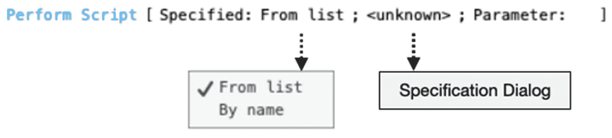

图 24-19

`执行脚本`步骤的选项

**提示**

按住 Command (macOS) 或 Windows (Windows) 键并单击`执行脚本`步骤的目标脚本，可在新标签页中自动打开已分配的脚本。

### 探索指定脚本对话框

*指定脚本*对话框用于选择对脚本的引用，该脚本将作为按钮、界面事件触发器（第 27 章）或前面提到的`执行脚本`步骤的*目标操作*。该对话框如图 24-20 所示，允许从当前文件或数据库中定义的任何 FileMaker 数据源（第 9 章）中选择脚本。可以定义一个可选的脚本参数，以伴随对所选脚本的调用。当将脚本分配给按钮或作为事件触发器时，此对话框包含三个按钮，可直接从对话框中添加、删除、编辑或复制脚本。

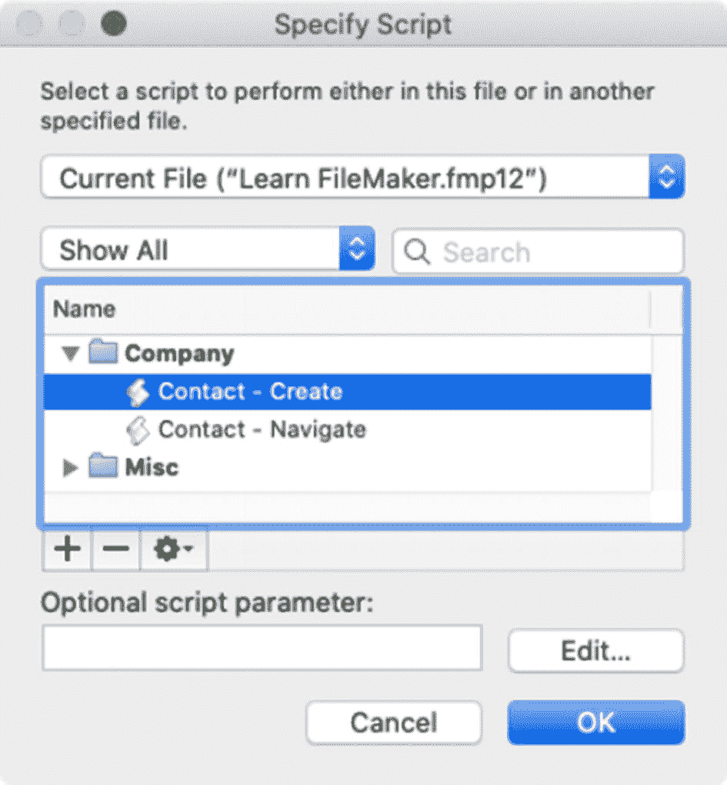

图 24-20

为按钮、脚本触发器或脚本步骤选择脚本

脚本能够运行其他脚本，这允许更模块化的脚本设计。不必构建一个执行数十或数百步骤的单一庞大脚本，可以将一个流程分解为单独的脚本，每个脚本专注于特定任务。这使得建立层次结构成为可能，其中一些脚本执行开放的、基础的任务，这些任务可以被许多其他脚本共享，无论上下文如何。但是，在创建共享脚本功能的网状结构时，请务必管理好命名、组织和使用规则，以避免造成混乱的交叉调用。

### 在脚本之间交换数据

脚本调用可以包含一个*参数*并接收一个*结果*，如图 24-21 所示，其中脚本 1 使用一个参数调用脚本 2，然后从该脚本的`退出脚本`步骤接收结果。

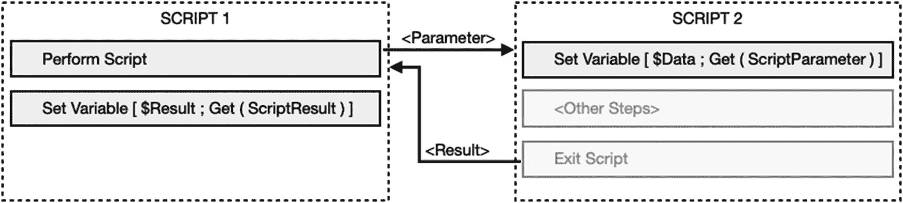

图 24-21

说明两个脚本之间的数据交换

**警告**

几十年前，全局字段和变量被用来在脚本调用前“暂存”数据，以促进过时的数据交换。在此之前，有些人为此目的使用剪贴板。然而，现在脚本之间的数据交换首选使用参数。

#### 发送参数

脚本参数是由触发对象发送给脚本的文本字符串。参数用于传输脚本可能因任何原因使用的任何信息。参数允许触发对象向脚本推送信息，这些信息可以在每次调用之间变化，而不是在脚本中硬编码字段引用或其他值。参数可以是单个单词、一个句子、一个值列表、一个字段名称、一个字段值，或包含复杂键值对数组的 JSON 对象。它们可以作为字面值键入，也可以使用公式构造。为了说明参数的用法，创建一个脚本，该脚本使用配置了以下公式的`显示自定义对话框`脚本步骤，在对话框中显示传入的参数：

```
Get ( ScriptParameter )
```

接下来，创建一个按钮或第二个脚本，该脚本使用`执行脚本`函数，并在“可选的脚本参数”字段中键入一条短消息。当单击按钮或运行脚本时，目标脚本应显示一个对话框，显示作为参数发送的消息。

#### 解析参数

脚本参数是一个单一的值。但是，它可以通过使用回车符分隔的值列表、对重复字段的引用或 JSON 对象，以包含多个值的方式进行组织。当接收到代表多个组件的结构化信息时，脚本将需要解析这些值以便分别处理它们。为此，请使用一个或多个`设置变量`或`插入计算结果`步骤，将数据解析并暂存到单独的变量中。这可以通过 `Let` 语句以及 `GetValue`、`GetRepetition` 或各种 JSON 函数来完成。以下示例演示了如何将包含三个值的值列表解析为单独的变量：

```
Let ( [
input = Get ( ScriptParameter ) ;
$id = GetValue ( input ; 1 ) ;
$name = GetValue ( input ; 2 ) ;
$status = GetValue ( input ; 3 )
] ;
""
)
```

此示例将使用 `GetRepetition` 函数，从包含对定义了四个重复项的字段的引用的脚本参数中解析值。

```
Let ( [
field = Get ( ScriptParameter ) ;
$id = GetRepetition ( field ; 1 ) ;
$name = GetRepetition ( field; 2 ) ;
$status = GetRepetition ( field; 3 ) ;
$task = GetRepetition ( field; 4 )
] ;
""
)
```

虽然这两个示例解析了参数中固定数量的值，但也可以创建更动态的解析功能。如果值的数量或字段重复项的数量发生变化，则可能需要使用 `While` 函数（第 13 章）语句或 `循环` 脚本步骤（第 25 章）来遍历它们。此外，递归自定义函数可以逐步处理每个值，并将其初始化到变量中。


#### 探索脚本结果

由另一个脚本运行的脚本可以使用 `退出脚本` 步骤传回结果值。该步骤只有一个参数：一个用于生成文本值的计算公式。与输入参数一样，结果可以是单个值，也可以是复杂的数据结构。此示例展示了一个简单的结果，返回单词“Success”，以告知调用脚本，目标脚本已成功执行完所有步骤，未发生任何失败。

```
退出脚本 [ 文本结果: "Success" ]
```

一个脚本可以有多个退出点，每个退出点返回不同的值。在以下示例中，在执行`执行查找`步骤后，一个条件性的`如果`语句可以在未找到记录时退出脚本，并返回一个告知调用脚本此情况的结果。当找到记录时，脚本会继续执行直到结束，并返回成功指示符。

```
执行查找 [ ]
如果 [ Get ( FoundCount ) = 0 ]
退出脚本 [ 文本结果: "No records found" ]
结束如果
循环

结束循环
退出脚本 [ 文本结果: "Success" ]
```

### 在服务器上执行脚本

当数据库托管在 FileMaker Server 上时（第 29 章），脚本既可以在当前用户的计算机上使用`执行脚本`步骤本地运行，也可以使用`在服务器上执行脚本`步骤卸载到服务器上运行。在服务器上运行复杂脚本通常速度更快，因为客户端和服务器之间无需通过网络交换大量信息。当本地脚本不需要响应或任何界面操作时，该任务可以完全交由服务器处理，从而立即释放用户计算机以执行其他脚本功能或手动工作。但是，在使用此功能之前，重要的是要意识到，在服务器运行脚本时，服务器*不会*知道或访问本地计算机数据库窗口的上下文。因此，被调用脚本所需的关于*当前表*、*布局*、*记录*、*找到集*、*排序顺序*或*窗口*的任何上下文信息都必须包含在脚本参数中，以便服务器在运行前能够复制该上下文。可以专门设计新的脚本来解决此问题。在将现有脚本转换为在服务器上运行时，可能需要将其拆分为两个：一个用于将上下文信息加载到脚本参数中，另一个用于接收该信息、在服务器上重置上下文，然后执行其他脚本功能。

脚本可以根据某些条件配置为本地运行或在服务器上运行。例如，当数据库因维护而脱机时，任何在启动时对数据库至关重要的脚本都必须能够在本地运行。对于这些脚本，应包含一个`条件`，允许脚本在托管时在服务器上运行，在非托管时在本地运行。以下示例展示了一个简单的`如果`步骤，借助`Get ( HostApplicationVersion )`和`LeftWords`函数，在本地运行脚本和在服务器上运行脚本之间进行选择。如果主机版本以单词“Server”开头，则表明是托管文件，并将使用`在服务器上执行脚本`步骤来执行调用。

```
如果 [ LeftWords ( Get ( HostApplicationVersion ) ; 1 ) = "Server" ]
在服务器上执行脚本 [  ]
否则
执行脚本 [  ]
结束如果
```

## 强调上下文的重要性

与计算一样，*脚本是上下文相关的*，在开发数据库时*认识到*这一点*很重要*。当执行脚本步骤时，它是在前端窗口当前布局的表出现上下文中运行的。这最初是脚本触发时的当前布局，但当脚本开始更改布局、执行查找或创建窗口时，可能会发生变化。一个复杂的数据库可能有脚本运行着运行其他脚本的脚本，其中任何一个都可能会更改当前上下文。如果脚本尝试从非当前上下文中访问字段，则会导致错误，使用户感到困惑，甚至可能具有破坏性。如果脚本在错误的上下文中创建、删除或复制记录，则可能是一场灾难。鉴于此，很显然，在设计脚本时，跟踪上下文是一项主要任务。在设计脚本时，要根据其包含的步骤来关注其预期的上下文。要了解不同步骤的期望。虽然所有脚本步骤*都是上下文操作*，但它们并非都具有相同类型的依赖关系。某些步骤是*布局表依赖的*，无论布局上可见什么，都直接访问表值。其他步骤是*布局对象依赖的*，需要与布局上的某些内容进行直接交互。在下一章中，我们将看到诸如`设置字段`（不需要字段存在于布局上）和`插入文本`（需要）之类的示例。此外，在相互关联的工作流复杂网络中调用其他脚本时，请尝试设计一个命名和组织标准，通过实施关于哪些脚本可以调用其他脚本以及哪些不能的规则来帮助您管理上下文。

## 管理脚本错误

发生错误时，脚本可能会打开一个对话框，告知用户问题所在。根据用户的知识水平和发生的错误类型，此消息对用户来说可能有意义，也可能没有意义。一个常见的示例是，当`设置字段`步骤尝试为当前上下文无法访问的表中的字段设置值时发生失败。例如，如果在浏览`公司`记录时，直接（而不是通过关系）设置`联系人`表中的字段，将导致显示错误消息：“无法完成此操作，因为目标不是相关表的一部分。”由于这是一个编程错误，用户不会知道这意味着什么，也不知道该采取什么措施来解决。因此，最好设计您的脚本来捕获错误，并提供更具信息性的对话框，以有效的方式通知用户。

要禁止显示错误，请使用`设置错误捕获`步骤，参数为`打开`。这将导致脚本完全忽略其遇到的任何错误并继续处理。在许多情况下，这并不理想，因为一个步骤中的错误可能导致工作流后续步骤中的重大问题。因此，可能需要使用自定义消息或其他步骤来检测和处理特定错误。`Get ( LastError )`函数可以在脚本中的不同位置使用，以确定在执行前一个（或多个）步骤时是否发生了错误。该函数将返回一个数字值，指示没有错误（`0`）或代表错误的数字。一个`如果`语句可以在检测到错误时根据条件采取行动。

为了说明此技术，以下简单示例尝试设置`Contact::Name Last`字段。如果从`Contact`表运行此脚本，则不会产生错误，也不会显示对话框。但是，在不同表中运行它会产生一个错误，并在自定义对话框中显示该事实。根据错误及其位置以及脚本的其他功能，`如果`语句可以包含其他步骤，例如向开发人员发送电子邮件、执行替代步骤、完全停止等。

```
设置错误捕获 [ 打开 ]
设置字段 [ "Contact::Name Last; "Smith" ]
如果 [ Get ( LastError ) = 103 ]
显示自定义对话框 [ "错误 103: 设置字段上下文错误" ]
结束如果
```

**提示**

有关完整错误列表，请在 Claris.com 上搜索“FileMaker Pro 错误代码参考指南”。

## 本章小结

本章介绍了脚本编写基础、在脚本工作区中工作以及各种步骤配置界面选项。我们探讨了指定文件路径的各种格式，并讨论了脚本运行其他脚本、传递参数、接收结果、上下文感知以及管理脚本错误的主题。在下一章中，我们将开始创建执行常见脚本编写任务的示例。


