# 25. 常见脚本任务

FileMaker 配备了超过 180 个内置脚本步骤，几乎可以执行你能想到的任何数据库任务。在本章中，我们将通过一些真实世界的示例来介绍基础知识，为你自行探索其余脚本步骤奠定基础。内容涵盖以下主题：

- 基本函数脚本
- 与字段交互
- 访问文件夹和文件
- 处理记录
- 使用条件语句
- 显示自定义对话框
- 搜索并处理找到的记录集
- 使用重复语句进行迭代
- 门户函数脚本
- 管理窗口
- 使用“从 URL 插入”

## 基本函数脚本

让我们首先探索几个执行常见功能的基本脚本步骤：控制用户中止脚本的能力、设置变量以及导航上下文更改。

### 允许用户中止

任何正在运行的脚本都可以随时通过按 `Esc` (Windows) 或按住 `Command` 键的同时按句点 (macOS) 来手动停止。虽然对于执行几个快速步骤、在用户尝试中止之前就已完成的脚本来说，这可能不是问题，但对于更复杂的脚本而言，这则会带来风险，并可能导致各种问题。如果没有编程干预，部分完成的过程可能很难重新开始。用户可能会困在并非设计为用户界面的临时布局上，或者有隐藏窗口保持打开状态，但可通过*窗口*菜单访问。一组记录可能只导入了一半但尚未处理，重复运行脚本可能会导致第二次重复导入。*允许用户中止*脚本步骤可以通过拒绝用户中止脚本的能力来避免这些以及无数其他灾难。该步骤有一个默认值为*开*的设置，允许中断脚本，以及一个将其设置为*关*以禁用该功能的选项。

此步骤可以放置在脚本的开头或工作流中的任何位置。可以在工作流中的不同点根据需要将其打开和关闭，以仅保护那些必须完成的敏感步骤。一旦配置完成，当前脚本中所有后续的脚本步骤以及执行堆栈中的任何子脚本都将继承该设置，除非被反转。如果父脚本将其关闭，则父脚本调用的所有后续子脚本都将继承该设置，除非或直到它们显式更改该设置。同样，如果子脚本更改了该设置，则当控制权交回给父脚本时，父脚本将继承该设置。

可以使用 *Get* 函数来检查中止状态的状态，如果禁止中止则返回 `0`（假），如果允许则返回 `1`（真）。以下两个示例显示了一个脚本步骤将中止状态设置为*关*和*开*，并在其下方有一个公式，用于检查每次更改后的当前状态：

```
允许用户中止 [ 关 ]
Get ( AllowAbortState ) // 结果 = 0
允许用户中止 [ 开 ]
Get ( AllowAbortState ) // 结果 = 1
```

注意

在测试时，建议始终保持允许用户中止，以避免陷入无限循环或其他需要通过强制退出才能摆脱编程错误的情况！

### 设置变量

*设置变量*步骤在脚本工作流的特定点设置局部变量或全局变量（第 12 章，“变量”）的值。变量可以在脚本中用于在一个步骤“暂存”值，以供另一个步骤使用。它们可以存储值以供以后使用，从多个上下文中汇编数据，跟踪控制脚本行为的迭代次数，以及更多用途。请记住，局部变量仅限于正在运行的脚本的上下文内。它们也*不会被*活动执行堆栈中的其他脚本继承，因此由脚本调用的子脚本或调用它的父脚本无法访问在其中设置的局部变量。将该步骤插入脚本中，然后双击该步骤或单击其旁边的齿轮图标，打开*设置变量选项*对话框，如图 25-1 所示。

*名称*字段用于指定目标变量的名称。这可以是一个新变量或一个现有变量。名称是变量在后续公式中的使用方式，因此请选择清晰且具有描述性的名称。单个美元符号前缀表示局部变量，两个美元符号前缀表示全局变量。如果未输入前缀，将自动添加一个符号。

在*值*字段中，键入步骤执行时要存储在变量中的信息，可以是静态值、字段引用或使用旁边的*指定*按钮输入的公式。

*重复次数*字段指定应为命名变量的哪个重复项接收指定的值。这允许单个变量包含多个单独的值，类似于重复字段（第 8 章）。默认值始终为 1。

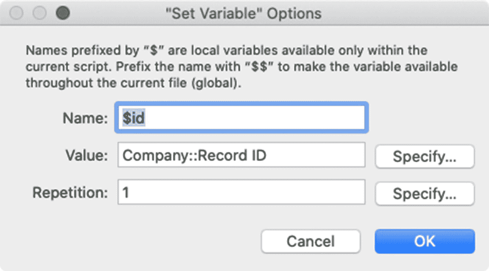

图 25-1

用于设置变量的对话框

提示

由于你可以创建许多具有不同名称的变量，因此重复功能应保留用于管理可通过编程方式确定的可扩展数量的值。

以下示例可由分配给*记录 ➤ 删除记录*自定义菜单项（第 22 章）或删除按钮的脚本使用。它在删除公司记录之前提供警告，尽管它可以扩展用于任何表。它使用了四次*设置变量*步骤。它首先将 `$name` 变量设置为当前*公司*记录的*公司名称*字段，并将 `$count` 变量设置为与之关联的*联系人*记录数量。接下来，它使用这些值将自定义警告值放入 `$message` 变量中，以供在*显示自定义对话框*步骤中使用。最后，它将用户的按钮选择放入 `$button` 变量中。末尾的 *If* 步骤将*删除记录/请求*步骤限制为仅在消息对话框中点击的按钮表示用户确认时才执行。

```
设置变量 [ $name ; 值: 公司::公司名称 ]
设置变量 [ $count ; 值: 计数 ( 公司 | 联系人::记录 ID ) ]
设置变量 [ $message ; 值:
"您确定要删除公司记录 " &
引用 ( $name ) &
" 吗？有 " & $count & " 条联系人记录与之关联！" ]
显示自定义对话框 [ "确认删除公司" ; $message ]
设置变量 [ $button ; 值: Get ( LastMessageChoice ) ]
如果 [ $button = 2 ]
删除记录/请求 [ 带对话框: 关 ]
结束如果
```

提示

由于 *Let* 和 *While* 函数也可以设置局部或全局变量，你可以使用任何包含公式组件的脚本步骤来设置变量。

### 创建导航脚本

脚本可以通过导航到不同的布局、记录或相关记录来更改窗口的上下文。


#### 转到布局

`Go to Layout`脚本步骤，如图 25-2 所示，将切换当前窗口中显示的布局。该步骤有两个活动区域。

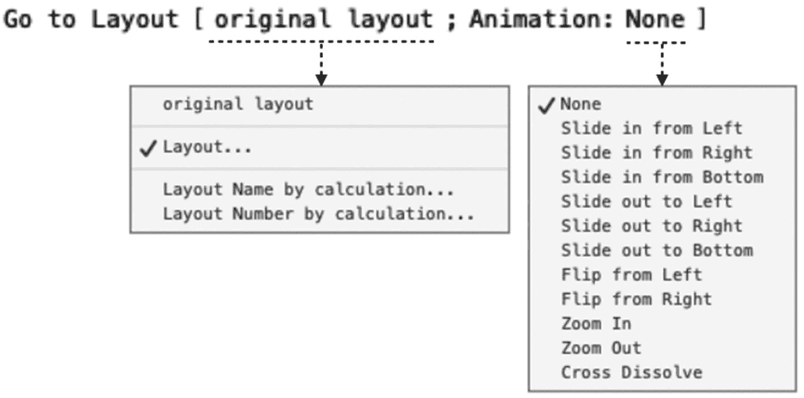

图 25-2

`Go to Layout`的配置选项

未标记的`layout specifier`会打开一个菜单，提供选择如何标识目标布局的选项。默认选项是`Original layout`，它指示脚本导航回脚本开始运行时的布局。这在脚本可以从数据库中的多个位置触发时节省开发时间，并自动跟踪和恢复用户的起始布局。选择`Layout`选项可打开`Specify Layout`对话框，并选择对特定目标布局的引用。`Layout Name by calculation`和`Layout Number by calculation`选项会打开`Specify Calculation`对话框，允许通过公式确定目标布局的名称或编号。

步骤中的`Animation`区域用于在`FileMaker Go`中指定布局切换的动画效果。在其他平台上运行脚本时，此设置将被忽略。

#### 转到记录/请求/页面

`Go to Record/Request/Page`步骤，如图 25-3 所示，用于根据模式在窗口内容中进行导航。它会根据模式导航到指定的项目：记录（浏览模式）、查找请求（查找模式）或页面（预览模式）。根据第一个设置中选择的选项，该步骤有一个或两个活动区域。

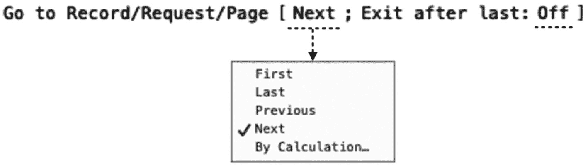

图 25-3

`Go to Record/Request/Page`的配置选项

未标记的`target specifier`会打开一个位置目标选项菜单。这些选项允许步骤跳转到`First`或`Last`项目，或移动到`Previous`或`Next`项目。底部的`By Calculation`选项允许通过公式确定一个数字，指示目标记录、请求或页面。当目标是`Previous`或`Next`时，会出现一个额外的`Exit after last`选项，可以切换为`On`或`Off`。当开启时，步骤在到达第一个参数指示方向上的最后一条可用记录后，会自动退出`Loop`语句。当开启时，`Previous`会在到达第一条记录/请求/页面后退出，而`Next`会在到达最后一条后退出。

#### 转到相关记录

`Go to Related Record`步骤作为一个单一步骤执行多项功能。它会查找并导航到另一布局上的一组相关记录，并可以选择在新窗口中打开结果。为了说明，想象一个用户正在查看一个`Contact`记录，并希望在一个新窗口中查看该联系人关联的父级`Company`记录。无需手动创建新窗口、更改布局和执行查找，按钮或脚本可以使用`Go to Related Record`步骤通过一次单击快速完成该任务。在这个例子中，`Contact`是起始的`source table`，而`Company`是目标的`target table`，它们各自位于表实例之间关系的一侧（第 9 章）。用于在联系人布局上`display`相关公司名称的同一关系将被此步骤用作我们`navigate`的通道。通过“穿过”该关系，用于形成关系的匹配字段就像显示在目标表中的记录的搜索条件。

一旦将步骤添加到脚本或分配给按钮，双击它，或单击齿轮图标以打开`Go to Related Record Options`对话框，如图 25-4 所示。

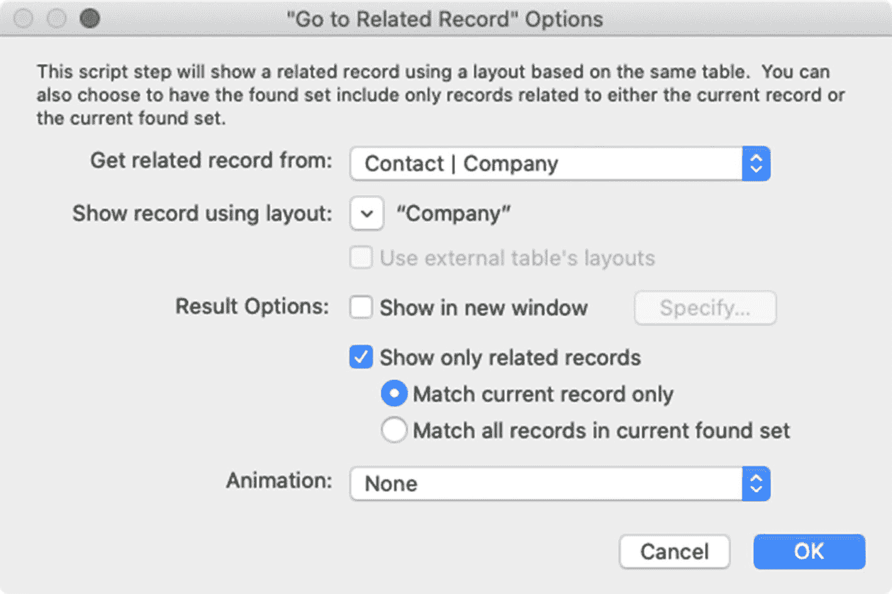

图 25-4

用于配置`Go to Related Record Options`的对话框

`Get related record from`弹出菜单列出了当前数据库文件的关系图中定义的每个表实例。选择与起始布局的表相关的任何实例。在我们的示例中，我们将从`Contact`表的布局开始。要到达`Company`表的布局，我们必须选择一个也同时与`Contact`表相关的`Company`表实例。因此，我们选择`Contact | Company`关系，以使用该关系的条件从`Contact`记录导航到其相关的`Company`。

`Show record using layout`选项指定了用于显示相关记录的目标布局。此设置打开一个菜单，提供与`Go to Layout`步骤类似的四个选项。`Current Layout`选项将用户留在当前布局上。这对于定位自联接关系非常有用，其中目标记录与源记录在同一表中。`Layout`选项打开`Specify Layout`对话框，用于选择对特定布局的引用。`Layout Name by calculation`和`Layout Number by calculation`选项打开`Specify Calculation`对话框，允许通过公式确定目标布局的编号或名称。`Specify Layout`对话框仅显示当前数据库文件中目标表的布局。如果目标表来自外部数据源，请选中`Use external table's layouts`复选框，以改为显示该外部文件中表的布局列表。

`Show in new window`复选框及相邻的`Specify`按钮允许在新窗口中显示结果，而不是起始窗口。这些设置与本章后面描述的`New Window`脚本步骤相同。

`Show only related records`选项控制目标布局/窗口中显示的找到集中包含哪些记录。当`disabled`时，该步骤将尝试保留目标表中已存在的找到集。如果相关记录存在于该集中，它将保留该集并将用户置于该记录上。如果不存在，该步骤将查找所有记录并将用户带到目标记录。当`enabled`时，将在目标表中建立不同的找到集，具体取决于选中的单选按钮选项。`Match current record only`选择将导致目标找到集仅包含与`starting record`相关条件匹配的记录。这类似于`one-to-one`或`one-to-many`搜索，其中使用当前起始记录查找目标表中的匹配记录。`Match all records in the current found set`选项将导致找到集包含目标表中与起始找到集中`any`记录匹配的每条记录。这相当于`many-to-many`搜索，其中使用当前找到集查找目标表中的匹配记录。

当此步骤因点击门户中的按钮而执行时，设置控制目标找到集，但用户点击的记录决定了该集中哪一条将成为当前活动记录。

## 与字段交互

有几个步骤允许与字段进行各种交互。这些包括将焦点移入字段、更改字段内容以及重置字段定义的序列化设置。


### 转到字段

三个脚本步骤允许将焦点导航到当前布局上的某个字段：`Go to Next Field`、`Go to Previous Field` 和 `Go to Field`。前两个步骤没有参数选项；它们会基于字段的 Tab 顺序，简单地将活动焦点移到当前布局上的*下一个*或*上一个*字段（第 21 章）。如果当前记录未打开且没有字段拥有焦点，这些步骤将打开该记录，并分别将焦点放在 Tab 顺序的第一个或最后一个字段上。`Go to Field` 步骤（如图 25-5 所示）将焦点移动到一个特定的字段。在将其插入脚本后，双击该步骤的任意位置以打开一个`Specify Field`对话框，并选择一个目标字段。齿轮图标会打开一个包含两个选项的面板。启用`Select/perform`复选框，以在进入该字段时自动选择字段内容，并/或打开界面元素（如下拉列表或日历）。`Go to target field`是另一种指定目标字段的方式。

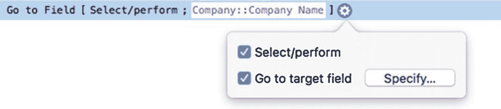

**图 25-5** 用于将焦点移动到特定字段的步骤

> **注意**：所选字段必须存在于当前布局上，并且用户必须拥有进入该字段的权限。如果在脚本中未选择目标字段或该字段无法访问，则此步骤将退出所有字段并提交记录。

### 设置字段

`Set Field` 步骤会用一个新值替换当前记录中指定字段的当前值。点击齿轮图标以打开配置面板（如图 25-6 所示）。`Specify target field`选项会打开一个`Specify Field`对话框，并允许选择目标字段引用。所选字段不必存在于布局上。如果未指定字段，则此步骤会向布局上拥有活动焦点的字段插入一个值。点击`Specify`按钮来定义一个`Calculated result`，该结果提供将被放入字段的值。

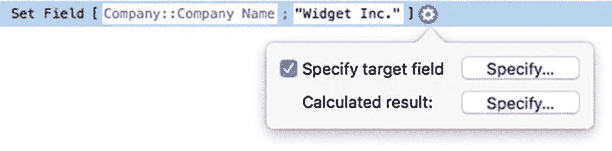

**图 25-6** 设置字段值的选项

### 按名称设置字段

`Set Field by Name` 步骤会更改窗口中显示的当前记录中*按名称*指定的字段的值。与`Set Field`步骤必须使用选定的*动态字段引用*作为目标不同，此步骤使用一个公式来建立一个*基于文本的字段引用*，该引用可以根据需要变化（第 12 章“字段引用”）。这些选项看起来完全相同，但当你点击指定目标字段时，会打开一个`Specify Calculation`对话框，并需要一个能得出目标字段名称的公式。结果必须包含一个表出现名称以提供定位字段所需的上下文。此示例针对当前`Contact`记录的`Contact Address State`字段。

```
Set Field By Name [ "Contact::Contact Address State" ; "NY" ]
```

由于字段引用是基于文本并通过公式创建的，它可以根据条件变化进行构建。此示例动态地为当前布局的表构建一个标准`Record Notes`字段的引用，这将在*任何*布局中有效，只要该布局分配的表包含该名称的字段。

```
Set Field By Name [ Get ( LayoutTableName ) & "::Record Notes" ; "Hello World" ]
```

### 设置选定范围

`Set Selection` 步骤（如图 25-7 所示）会在当前布局上可见的字段中选择一段文本。除非指定了另一个目标字段，否则该步骤将以拥有活动焦点的字段为目标。点击`Specify selection`以打开一个`Set Selection`对话框，并为`Start Position`和`End Position`输入两个数值。这些值可以是静态数字，也可以是动态计算表达式，用于分析字段内容并根据自定义条件进行选择。

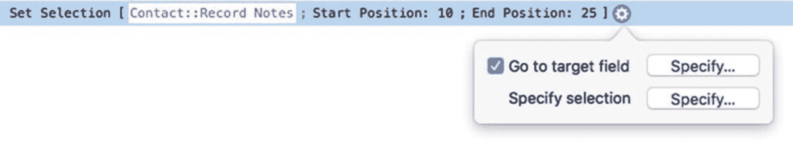

**图 25-7** 在字段内选择文本的选项

> **提示**：要选择当前字段的*全部*内容，请改用`Select All`步骤。

### 设置下一个序列值

`Set Next Serial Value` 步骤会更新字段自动输入定义中的下一个序列号值（第 8 章）。由于自动输入设置在每次创建新记录时会自动递增`Next Value`设置，因此此步骤不常使用。然而，当作为数据迁移的一部分导入记录，或为上线使用重置数据库的新测试副本时，序列号字段可能需要更新，以确保分配的下一个值是唯一的，且比迄今为止分配的最高值大 1。如果字段设置与记录数据不同步，可能会导致重复的序列号。在迁移包含数十个表的大型解决方案时，使用此脚本步骤来自动化此过程可以节省时间。更改是直接对字段定义进行的，因此指定的字段不必在当前布局上可见。事实上，当需要将其重置为静态数字而无需查看现有记录时，可以从*任意上下文*中对任意表运行此步骤。

配置选项与其他更改字段值的步骤类似。点击齿轮图标打开面板，然后选择一个目标字段并输入一个公式作为结果，该结果将成为新记录的下一个序列号。当迁移脚本将记录导入表后，添加这些步骤以确保主键的下一个序列号比当前最高值大 1。

```
Show All Records
Unsort Records
Go to Record [ Last ]
Set Next Serial Value [ Record ID ; Contact::Record ID + 1 ]
```

前面的示例执行`Show All Records`以确保我们不会错过最高值。接下来，它运行`Unsort Records`步骤，假定当按输入顺序排序时，主键是递增的。如果未排序列表中最后一条记录并不总是最高值，请考虑改用`Sort Records`步骤按序列字段对记录进行排序。`Go to Record`步骤跳转到最后一条记录，该记录现在应具有最高值。最后，`Set Next Serial Value`以当前记录的`Record ID`字段当前值加 1 作为目标，应用于`Record ID`字段。

如果目标键字段是带有前导零的文本字段，加 1 会将结果转换为一个不带前导字符的数字。要在字段中保持一致的字符数，公式需要向结果添加计算出的数量的零。如果该字段使用前导零以保持六位数字，以下公式通过在递增的 ID 左侧添加六个零，然后从右侧提取六位数字来确保得到合适的结果。

```
Right ( "000000" & ( Contact::Record ID + 1 ) ; 6 )
// result = 000015
```

### 访问文件夹和文件

在最近的版本中，FileMaker 添加并改进了多种可以访问文件夹和文件的脚本步骤。


```markdown
# 获取文件夹路径

`获取文件夹路径`步骤（原名`获取目录`）会向用户显示一个`选择文件夹`对话框。这允许用户选择一个文件夹，然后供其他导入、导出和保存各种资源的步骤使用。该步骤包含多个可配置选项，如图 25-8 所示。

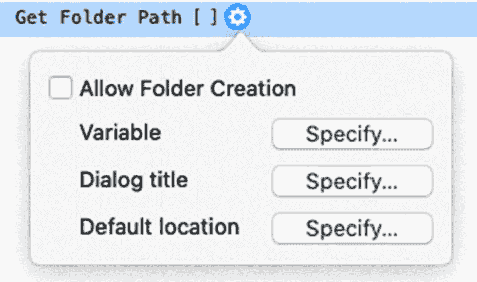

**图 25-8** 选择目录的选项

`允许创建文件夹`复选框可在`选择文件夹`对话框中启用`新建文件夹`按钮，使用户能够创建并选择新文件夹。`变量`按钮会打开一个受限的`设置变量选项`对话框，用于指定存储所选文件夹路径的变量名称。`对话框标题`和`默认位置`旁的按钮都会打开一个`指定计算`对话框，用于控制对话框的标题提示和默认起始文件夹路径。

当脚本执行此步骤时，对话框会打开并等待用户输入。一旦用户选择了一个文件夹并点击关闭对话框，该文件夹的路径便会存入指定的变量中。该路径可能需要转换为 FileMaker 格式（第 24 章，“转换路径”），或添加前缀，以便与其他脚本步骤配合使用。

以下示例使用`设置错误捕获`来抑制用户点击对话框中的`取消`时出现的警告对话框。默认路径设置为用户电脑的“文档”路径。在`获取文件夹路径`步骤之后，`If`语句会检查`LastError`。如果用户取消了对话框，`If`语句会使用`退出脚本`步骤来停止脚本。否则，脚本继续执行时，稍后便可使用`$pathToFolder`变量中用户选择的文件夹。

```
设置错误捕获 [ 开启 ]
设置变量 [ $pathToDefault ; 值: Get ( DocumentsPath ) ]
获取文件夹路径 [ $pathToFolder ; $pathToDefault ]
If [ Get ( LastError ) = 1 ]
退出脚本 [ 文本结果: "用户已取消" ]
End if
```

**警告**: 对话框的外观取决于操作系统。例如，macOS 不显示`对话框标题`。

## 操作数据文件

18 版本新增了一组可以操作数据文件的步骤。这些步骤可用于在用户电脑上*创建*、*关闭*、*删除*、*检测*、*打开*、*读取*、*重命名*和*写入*数据文件。

### 创建数据文件

`创建数据文件`步骤会创建一个新的空文件，并自动替换指定 FileMaker 路径下任何同名的现有文件。它接受一个文件路径参数，并具有自动创建文件夹以确保完整路径存在的选项。创建后，脚本可以打开该文件并写入数据。

```
设置变量 [ $filePath ; 值: "file:/Macintosh HD/Users/mmunro/Desktop/Hello.txt" ]
创建数据文件 [ "$filePath" ; 创建文件夹: 关闭 ]
```

### 打开和关闭数据文件

`打开数据文件`步骤会打开一个数据文件，并为其分配一个数字`文件 ID`，该 ID 将一直存在，直到文件被显式关闭。此数字充当文件的引用指针，其他数据文件步骤（例如`关闭数据文件`步骤）需要用它来代替路径。`关闭数据文件`步骤仅接受指向应关闭文件的`文件 ID`。在以下示例中，脚本假设前一个示例中创建的文件路径位于名为`$filePath`的变量中。使用此路径，它打开文件，将 ID 放入名为`$fileID`的目标变量中，然后立即使用该 ID 关闭文件。

```
打开数据文件 [ "$filePath" ; 目标: $fileID ]
关闭数据文件 [ 文件 ID: $fileID ]
```

### 读取数据文件

`从数据文件读取`步骤会从一个已打开的数据文件中读取数据，并将内容放入一个`目标`变量或字段中。它接受四个参数。`文件 ID`需要一个数字文件引用，通常是`打开数据文件`步骤的目标结果。`目标`允许选择字段或输入变量，文件内容将放入其中。`读取为`内联菜单允许选择字符编码，`数量`选项允许通过公式确定要读取的字节数（留空则读取全部内容）。延续上一个示例，此脚本在打开和关闭文件之间添加了一个步骤，它将内容读取为 UTF-8 编码，并放入名为`$fileContents`的变量中。最后，`显示自定义对话框`会显示该文本。

```
打开数据文件 [ "$filePath" ; 目标: $fileID ]
从数据文件读取 [ 文件 ID: $fileID ; 目标: $fileContents ; 读取为: UTF-8 ]
关闭数据文件 [ 文件 ID: $fileID ]
显示自定义对话框 [ $fileContents ]
```

### 确认数据文件是否存在

当引用的文件不存在时，如果脚本尝试打开它，将会产生错误。为避免这种情况，可以使用`获取文件是否存在`步骤先确认文件是否存在，并在未找到时采取替代操作。该步骤接受一个`源文件`路径，并将一个真 (1) 或假 (0) 值放入`目标`字段或变量。此示例将检查文件是否存在，如果不存在，则显示对话框并退出脚本。

```
设置变量 [ $filePath ; 值: "file:/Macintosh HD/Users/mmunro/Desktop/Hello.txt" ]
获取文件是否存在 [ "$filePath" ; 目标: $fileExists ]
If [ $fileExists = 0 ]
显示自定义对话框 [ "无法找到 Hello.txt 文件！" ]
退出脚本
End If
```

### 写入数据文件

`写入数据文件`步骤会将数据写入一个已打开的数据文件。它需要的参数与读取步骤类似，但将目标的标签反转为`数据源`，字符编码标签改为`写入为`。还有一个可选的`追加换行符`复选框，用于在写入数据后添加一个换行符。此示例将用“Hello, World.”替换之前文件中的数据。

```
设置变量 [ $filePath ; 值: "file:/Macintosh HD/Users/mmunro/Desktop/Hello.txt" ]
设置变量 [ $fileContents ; 值: "Hello, World" ]
打开数据文件 [ "$filePath" ; 目标: $fileID ]
写入数据文件 [ 文件 ID: $fileID ; 数据源: $fileContents ; 写入为: UTF-8 ]
关闭数据文件 [ 文件 ID: $fileID ]
```

要从现有数据的末尾开始写入，请使用`获取文件大小`和`设置数据文件位置`步骤来确定文件中的字节数，并从该位置之后开始写入。第一个步骤接受文件路径而不是文件 ID，因此文件不必为执行该步骤而打开。

```
设置变量 [ $filePath ; 值: "file:/Macintosh HD/Users/mmunro/Desktop/Hello.txt" ]
设置变量 [ $fileContents ; 值: "Hello, World" ]
获取文件大小 [ "$filePath" ; 目标: $fileSize ]
打开数据文件 [ "$filePath" ; 目标: $fileID ]
设置数据文件位置 [ 文件 ID: $fileID ; 新位置: $fileSize ]
写入数据文件 [ 文件 ID: $fileID ; 数据源: $fileContents ; 写入为: UTF-8 ]
关闭数据文件 [ 文件 ID: $fileID ]
```

或者，在写入之前读取文件，写入操作将自动在已有所有数据之后开始。

```
设置变量 [ $filePath ; 值: "file:/Macintosh HD/Users/mmunro/Desktop/Hello.txt" ]
设置变量 [ $fileContents ; 值: "Hello, World" ]
打开数据文件 [ "$filePath" ; 目标: $fileID ]
从数据文件读取 [ 文件 ID: $fileID ; 目标: $fileContents ; 读取为: UTF-8 ]
写入数据文件 [ 文件 ID: $fileID ; 数据源: $fileContents ; 写入为: UTF-8 ]
关闭数据文件 [ 文件 ID: $fileID ]
```


# 操作记录

众多脚本步骤都会与记录进行交互。`新建记录/请求`步骤会在当前窗口中创建一条新记录，而`复制记录/请求`步骤则会复制当前记录。这两个步骤没有可配置的选项。`删除记录/请求`步骤会在显示一个可选的确认对话框后，自动删除前端窗口中的当前记录。类似地，`删除全部记录`步骤会在显示一个可选的对话框后，删除找到集中的所有记录。还有一些步骤可以执行用户通过`记录`菜单和工具栏选项在界面中执行的许多记录操作。脚本可以打开、提交、复制和恢复记录。存在`将记录另存为 Excel`、`将记录另存为 PDF` 和`将记录另存为快照链接`等步骤。`清空表`步骤会删除指定表中的所有记录，无论当前找到集或当前布局上下文如何。此外，还有两个步骤用于将记录移入或移出表：`导入记录`和`导出记录`。

### 导入记录

`导入记录`步骤，如图 25-9 所示，用于将记录导入到表中，根据配置设置，可以带有人机交互或无人工干预。

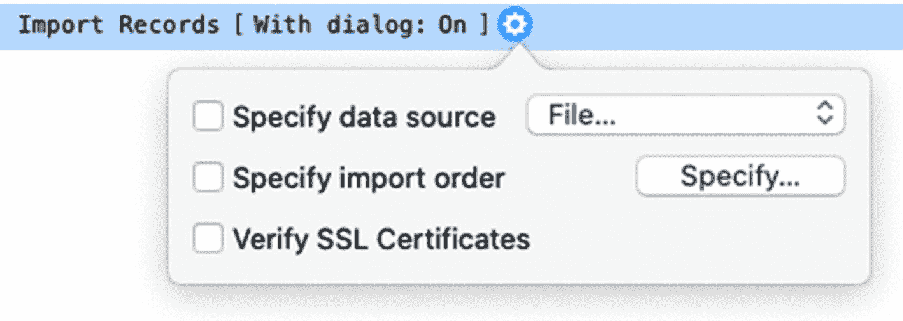

图 25-9

自动导入记录的配置选项

`显示对话框`选项可以设置为`关闭`，以在执行步骤时抑制对话框，从而实现真正的自主操作。但是，如果未定义`数据源`或`导入映射`，则会忽略此设置，并显示对话框，请求缺失的信息。`指定数据源`接受要导入文件的路径，而`指定导入映射`按钮会打开同名的对话框，用于将导入数据映射到字段（第 5 章）。当从通过 HTTP 请求指定的服务器导入 XML 数据时，请启用`验证 SSL 证书`。

### 导出记录

`导出记录`步骤，如图 25-10 所示，允许脚本根据配置设置自动导出记录，可以带有人机交互或无人工干预。`指定输出文件`和`指定导出映射`都会打开对话框，分别允许指定文件路径和字段顺序。在步骤行中可以直接访问两个额外的开关选项。`显示对话框`可以抑制对话框以实现自主操作，前提是两个面板选项都已配置。`创建文件夹`选项会自动创建文件夹，以确保整个目录路径存在。

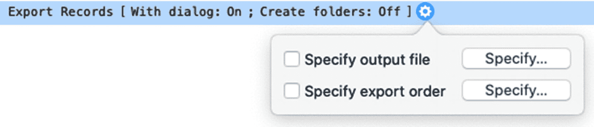

图 25-10

自动导出记录的配置选项

## 使用条件语句

一个`条件语句`由一个或多个脚本步骤组成，这些步骤仅在特定条件为真时执行。这些被称为`if-then 语句`，因为它们包含的条件可以理解为*如果此公式为真，则运行这些步骤*。FileMaker 有四个用于构建 if-then 脚本语句的脚本步骤：

* `If` – 必须在语句开头使用，用于定义一个公式，该公式控制何时执行其后的步骤
* `Else If` – 可选地放置在 `If` 步骤和 `End If` 步骤之间，用于基于一个新公式开始一组新的条件步骤
* `Else` – 可选地放置在 `End If` 之前，用于表示一组单独的条件步骤，这些步骤仅在所有前面的条件都为假时才执行
* `End If` – 必须用于终止由 `If` 步骤开始的条件语句

例如，假设一个`发票状态`字段有以下几个可能的值：`未发送`、`已发送`、`待付款`、`逾期`、`严重逾期`和`已付款`。一个用于通过电子邮件发送发票的脚本不适用于已发送的发票，而发送关于逾期状态的提醒也不适用于每条发票记录。此外，有些发票尚未发送，有些已发送但尚未逾期，等等。可以设置一个简单的 `If` 语句，以便仅在发票状态为已逾期时发送提醒，如下例所示：

```
If [ Invoice::Status = "Past Due" ]
Perform Script ["Email Invoice Past Due" ]
End If
```

这可以扩展成一个`复合条件语句`，其中包含多个条件，每个条件调用不同的脚本。如果发票尚未发送，则运行一个脚本来发送它。如果状态是逾期或严重逾期，则分别发送提醒或警告。语句中未包含的其他状态则不发送任何内容。

```
If [ Invoice::Status = "Unsent" ]
Perform Script ["Email Invoice" ]
Else If [ Invoice::Status = "Past Due" ]
Perform Script ["Email Invoice Past Due" ]
Else If [ Invoice::Status = "Delinquent" ]
Perform Script ["Email Invoice Collection Warning" ]
End If
```

一个条件语句可以放置在另一个条件语句内部，从而创建一个`嵌套语句`。语句的层次结构可以根据需要变得复杂，以实现必要的目标。在这个例子中，第一个外部语句包含并控制基于状态字段执行两个内部复合语句中的哪一个。

```
If [ Invoice::Status = "Past Due" ]
If [ Invoice::Days Past > 15  ]
Perform Script ["Email First Warning" ]
Else If [ Invoice::Days Past > 30  ]
Perform Script ["Email Second Warning" ]
Else If [ Invoice::Days Past > 45  ]
Perform Script ["Email Final Warning" ]
End If
Else If [ Invoice::Status = "Delinquent"]
If [ Invoice::Days Delinquent > 15  ]
Perform Script ["Email Collections Warning" ]
Else If [ Invoice::Days Delinquent > 30  ]
Perform Script ["Email Collections Notification" ]
End If
End If
```

提示

避免过度嵌套导致在滚动浏览步骤页面时难以跟踪脚本执行逻辑的情况。

## 显示自定义对话框

`显示自定义对话框`步骤用于向用户显示一条消息，并且还可以请求向三个字段或变量输入内容。对话框可以显示信息性通知、警告用户某个问题、确认某个操作、提供操作选择、请求输入、提供说明等。将该步骤添加到脚本后，齿轮图标会打开`显示自定义对话框选项`对话框，该对话框有两个选项卡：`常规`和`输入字段`。


### 配置对话框属性

*显示自定义对话框选项*对话框中的*常规*选项卡（如图 25-11 所示）用于配置自定义对话框的消息属性。*标题*和*消息*字段可以直接接收输入的静态文本，也可以通过点击相应的*指定*按钮输入公式来生成内容。这些内容将显示在对话框的标题栏和正文中，应清晰地传达信息或请求执行某个操作。

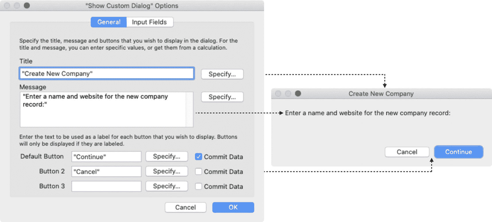

图 25-11

配置对话框属性的选项卡（左）与对话框示例（右）

最多可以为自定义对话框定义三个按钮的名称。这些按钮将在对话框中从右到左排列，其中*默认按钮*会高亮显示，并响应用户按下 Enter 键的操作。如果在显示对话框时，当前记录存在未提交的更改，则任何勾选了相应*提交数据*复选框的按钮，在用户于对话框中点击时都会导致该记录被提交。当对话框请求输入要放入字段的信息时，此功能非常有用。

**警告**

对话框不会自动调整大小，因此较长的消息可能会被遮挡。尽管用户可以调整大小，但请保持消息简洁，以避免沟通不畅。

### 配置对话框输入字段

对话框最多可以包含三个可编辑字段，每个字段都链接到一个目标字段或变量。这使得对话框可以向用户请求输入，并且在很多场景下都非常有用。脚本可以针对特定字段执行引导式搜索，在创建记录时通过提示必需输入来提供帮助，要求输入关键短语以确认删除操作，等等。*输入字段*选项卡为此包含了三组相同的控件，如图 25-12 所示。

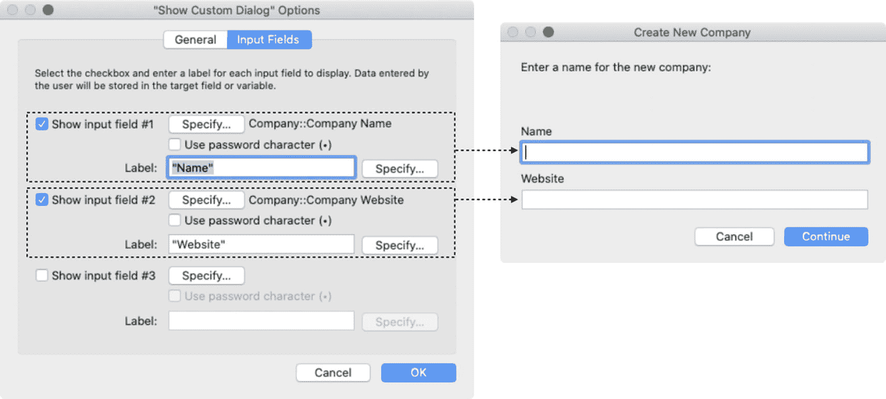

图 25-12

用于配置对话框输入字段的选项卡

要在对话框中包含一个字段，请启用相应的复选框。然后点击*指定*以选择一个目标字段或变量。该目标充当对话框中该文本区域的*源*和*目标*。当对话框打开时，目标中的任何值都会作为默认值显示在输入字段中，用户可以对其进行自定义。用户在对话框中的输入会更新目标的值，并且该值会在用户关闭对话框后保留。

*使用密码字符*复选框会使该字段在对话框中显示为隐藏值，每个字符都显示为项目符号。与字段的类似布局设置（第 20 章，“隐藏式编辑框”）一样，这仅是一个显示功能，不会更改或加密输入到该字段中的文本。除非该字段也被配置为以项目符号显示，否则该值在布局上可能仍然可见。无论如何，脚本都可以像处理任何其他文本字符串一样访问和操作该值。

*标签*字段允许在对话框中的字段上方显示一个字段标签。默认情况下，字段在对话框中是没有标签的。可以输入静态文本标签，或点击*指定*以通过公式生成标签。

**提示**

当对话框需要三个以上的按钮或字段选项，或者需要弹出菜单或复选框等其他控件时，可使用*新建窗口*步骤，通过自定义布局生成一个对话框窗口。

### 捕获对话框按钮点击

对话框自然会暂停脚本，直到用户点击某个按钮。对话框关闭后，脚本可以使用 `Get(LastMessageChoice)` 函数访问被点击按钮的索引位置。该数字对应于按钮的配置顺序，其在对话框上从右到左显示。此值可以立即使用，或存储在变量中供后续在工作流中使用，如下方示例所示：

```
Show Custom Dialog [ "选择" ; "请选择一个功能" ]
Set Variable [ $button ; Get ( LastMessageChoice )
```

如果定义了三个按钮——确定、取消和帮助——并且用户点击了确定，则 `$button` 变量将被设置为 1。以下示例展示了一个公式，该公式可在前面的 `Set Variable` 步骤中使用，通过 `Choose` 函数将数值转换为按钮名称。

```
Let (
number = Get ( LastMessageChoice )
;
Choose ( number ; "" ; "确定" ; "取消" ; "帮助" )
)
```

### 使用对话框创建相关记录

作为带输入选项的对话框的一个实用示例，我们来创建一个脚本，该脚本从一个*联系人*记录开始，然后逐步创建一个*公司*记录，并将其分配给该联系人。该脚本将自动执行一系列对于用户来说较为繁琐的操作：切换布局、新建公司记录、输入公司信息、获取新记录的 ID、返回原始布局，并将新 ID 输入到联系人用于公司关系的外键字段中。脚本化版本的具体顺序会略有不同。脚本不会创建记录并输入数据，而是通过一个对话框请求将新公司的名称存入变量，如果用户没有取消，则继续执行记录创建和分配步骤。

```
Show Custom Dialog [ "创建新公司" ; "输入新公司的名称:" ; $name ]
If [ Get ( LastMessageChoice ) = 2 ]
退出脚本
End If
冻结窗口
转到布局 [ "公司" (公司) ; 动画: 无 ]
新建记录/请求
设置字段 [ 公司::公司名称 ; $name ]
设置变量 [ $id ; 值: 公司::记录 ID ]
转到布局 [ 原始布局 ; 动画: 无 ]
设置字段 [ 联系人::联系人公司 ID ; $id ]
提交记录/请求 [ 带对话框: 关闭 ]
```

或者，如果已为关系的*公司*一侧启用了*允许创建记录*（第 9 章），则可以通过一个简单的对话框步骤来请求名称，并将其推入相关字段，从而自动创建两者之间的关联。

```
Show Custom Dialog [ "新公司" ; "输入名称:" ; 联系人 | 公司::公司名称 ]
```

### 确认对话框字段值

为避免对话框中出现空字段，请在允许脚本继续之前使用*循环*语句来确认值。当用户关闭包含缺失值的对话框时，脚本会循环回去，再次显示对话框，直到用户输入值或点击取消。以下示例将对话框的提示放入 `$message` 变量中，以便在需要后续循环时将其更改为警告。`Show Custom Dialog` 步骤被放置在*循环*语句内，并且带有一个 `Exit Loop If` 步骤，如果用户取消或已输入名称，则会跳出循环。如果 `$name` 变量为空，则在循环重复之前，`$message` 会被修改为措辞更严厉的请求。一旦用户输入了名称，脚本就可以继续执行放置在这些步骤下方的任何其他步骤。

```
设置变量 [ $message ; 值: "输入新公司的名称:"  ]
循环
Show Custom Dialog [ "创建新公司" ; $message ; $name ]
If [ Get ( LastMessageChoice ) = 2 ]
退出脚本
End If
如果 [ $name ≠ "" ] 则退出循环
发出蜂鸣声
设置变量 [ $message ; 值: "您必须输入新公司的名称:"  ]
结束循环
```


# 搜索与处理找到的记录集

执行搜索时可使用若干不同的步骤。这些步骤可以单独使用，也可以与执行导航、排序、编译及其他功能的步骤结合使用。`Perform Quick Find` 步骤使用公式的文本结果作为条件，在当前布局中启用了`快速查找`功能的任何字段内执行搜索（第 [19]章）。

`Enter Find Mode` 步骤将窗口置于查找模式，允许用户或脚本步骤在搜索前于字段中输入查找条件。它可以“指定查找请求”，建立默认的起始条件，并可以选择“暂停”以等待用户。由于该步骤本身并不实际执行查找，因此必须由用户或另一个脚本步骤来启动。

`Perform Find` 步骤可在查找模式中用于执行用户或脚本步骤输入的条件。或者，它也可以在浏览模式中作为一个独立的即时查找步骤使用，此时需使用其可选的“指定查找请求”对话框来定义搜索条件（第 [4]章，“使用已保存的查找”）。

一个查找脚本可以有多种形式。它可以基于静态不变的条件执行查找，基于变量构建条件，征求用户条件，或这些方式的某种组合。下面的示例使用了一个硬编码条件和一个用户输入条件。在进入查找模式后，它将`发票状态`字段设置为“已付款”，然后弹出一个对话框，允许用户在`发票日期`字段中输入一个日期范围。当对话框关闭后，搜索将继续，执行查找并显示一个找到的记录集，其中包含所有在指定日期范围内且已付清的发票。

```
转到布局 ["发票列表"]
进入查找模式 [ 暂停: 关闭 ]
设置字段 [ 发票::发票状态 ; "已付款" ]
显示自定义对话框 [
"搜索已付款发票" ;
"输入日期范围 (月/日/年...月/日/年):" ;
发票::发票日期 ]
执行查找
```

**提示：** 通过在`显示自定义对话框`步骤之前，在目标字段或变量中插入默认范围，来帮助用户输入日期范围。

## 使用重复语句进行迭代

*重复语句* 由一个或多个重复执行的步骤组成，直到某个步骤退出循环。FileMaker 有三个步骤用于构建重复语句：

- `Loop` – 必需，用于开始重复后续步骤，直到执行到终止步骤
- `Exit Loop If` – 当输入的公式为真时，立即终止循环，并跳转到下一个`End Loop`之后的步骤
- `End Loop` – 必需，用于标记重复语句的底部，在此处控制权返回到语句开头以进行下一次迭代

语句内的某些步骤也可以终止循环。例如，`Exit Script` 和 `Halt Script` 都会停止整个脚本，包括任何活动的循环。使用 `Go to Record/Request/Page` 的“下一个”或“上一个”选项中的“最后一个之后退出”选项，或 `Go to Portal Row` 步骤，可以在到达指定方向的最后一条记录后退出。只要`允许用户中止`为“打开”，用户也可以通过按 Esc（Windows）或 Command+句号（macOS）来终止脚本。

**注意：** 如果没有步骤导致循环终止，该语句将无限运行，直到强制退出，这可能导致文件损坏。

### 循环遍历找到的记录集

一个脚本可以逐步遍历一个找到的记录集，并对每条记录执行操作。下面的示例从导航到发票记录集中的第一条记录开始，然后启动一个`循环`。对于记录集中的每条记录，它调用另一个名为“发送发票电子邮件”的脚本来向客户发送发票。然后，一个`设置字段`步骤将`发票状态`字段从“未结”更改为“已发送”。最后，它转到下一条记录并重复这些步骤，直到到达找到的记录集的末尾并退出循环。

```
转到记录/请求/页面 [ 第一个 ]
循环
执行脚本 [ 指定: 从列表 ; "发送发票电子邮件" ; 参数: ]
设置字段 [ 发票::发票状态 ; "已发送" ]
转到记录/请求/页面 [ 下一个 ; 最后一个之后退出: 打开 ]
结束循环
```

另一个示例如下，循环遍历找到的未结发票记录集，并收集每条记录的多个字段的值。它会提取每条发票记录的 ID、日期、公司、金额，以及一个新的`发票逾期状态`字段，该字段通过计算自`发票日期`以来经过的 30 天增量次数，来得出状态为“已发送”的发票的逾期值。这些值被排列成一个列式列表，存储在名为 `$Body` 的变量中，稍后可用于创建报告电子邮件或保存到数据文件。

```
转到记录/请求/页面 [ 第一个 ]
循环
设置变量 [ $Body ; $Body &
发票::记录 ID & " " &
发票::发票日期 & " " &
发票::发票公司名称 & " " &
发票::发票金额 & " " &
发票::发票逾期状态 & "¶" ]
转到记录/请求/页面 [ 下一个 ; 最后一个之后退出: 打开 ]
结束循环
// 结果 =
1001 04/15/2021 Fantastic Client 1000 逾期超过 60 天
1001 04/15/2021 Fantastic Client 1000 逾期超过 60 天
1002 05/19/2021 Creative Company 3000 逾期超过 30 天
1003 06/1/2021 Fantastic Client 4500 未结
1003 06/15/2021 Fantastic Client 958 未结
```

当前面示例的结果用作电子邮件的正文时，可以对数据进行不同的格式化以使其更易读。下面的示例返回一个类似的报告，但通过将逾期状态作为发票组上方的标题（而不是为每张发票重复）来加以优化。从相同的已找到的未结发票记录集（按`发票逾期状态`排序）开始，脚本使用一个名为 `$Last.Status` 的变量来跟踪上一次迭代中记录的状态值。每当它在当前记录中遇到新的状态值时，就会执行一个条件步骤，将该状态值连同一些额外的段落回车符插入到 `$Body` 变量中。然后，它将当前状态存入 `$Last.Status` 变量，以便在后续每次迭代中都忽略该值，直到检测到不同的值。

```
设置变量 [ $Last.Group ; "" ]
转到记录/请求/页面 [ 第一个 ]
循环
设置变量 [ $Group ; 发票::发票逾期状态 ]
如果 [$Group ≠ $Last.Group ]
