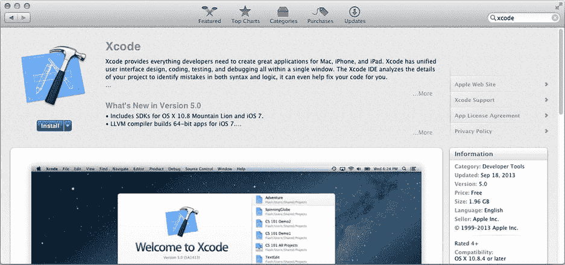
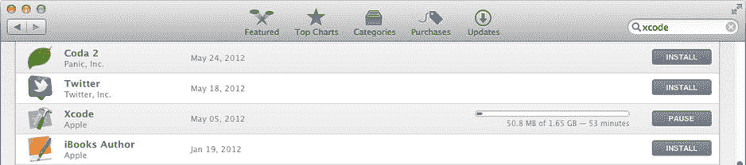

# 1. 准备好了吗？

## 摘要

如果你想构建什么东西，你可能需要一些工具：锤子、钉子、激光、起重机，以及宜家那套内六角扳手中的一个。构建 iOS 应用需要一套名为 `Xcode` 的工具。

本章将展示如何获取并安装 `Xcode`，并带你简要浏览其界面，以便你熟悉它。如果你已经安装并使用了 `Xcode`，请查看“要求”部分以确认你拥有所需的一切，但你可以跳过本章的大部分内容。

## 要求

在本书中，你将创建运行于 iOS 7 版本的应用。为 iOS 7 创建应用需要 `Xcode` 5 版本。`Xcode` 5 需要 OS X 10.8 版本（又名 Mountain Lion），而后者需要 Intel 架构的 Mac。都明白了吗？这是你的完整清单：

*   Intel 架构的 Mac
*   OS X 10.8（或更高版本）
*   几 GB 的可用磁盘空间
*   互联网连接
*   至少一个运行 iOS 7.0（或更高版本）的 iOS 设备（`iPod Touch`、`iPhone` 或 `iPad`）

请确保你拥有安装了 OS X 10.8（Mountain Lion）或更高版本的 Intel 架构 Mac 电脑、足够的磁盘空间以及互联网连接。你可以在 Mac 上完成所有初始应用开发，但某个时刻你会希望在真实的 iOS 设备（`iPhone`、`iPod Touch` 或 `iPad`）上运行你的应用，为此你需要一台这样的设备。

注意

通常来说，版本越新越好。本书中的示例是在 OS X 10.8.5（Mountain Lion）上，使用 `Xcode` 5.0 构建，针对 iOS 7.0 开发的。当你读到本书时，所有这些可能都有更新的版本，这没问题。

## 安装 Xcode

苹果公司已尽可能简化 `Xcode` 的安装过程。在你的 Mac 上，启动 App Store 应用并搜索 `Xcode`，如图 1-1 所示。

图 1-1. App Store 中的 Xcode

点击安装按钮开始下载 `Xcode`。这需要一些时间（见图 1-2）。你可以从 App Store 的“已购项目”标签页监控其进度。请耐心等待。`Xcode` 非常庞大，即使互联网连接很快，下载也需要一些时间。

图 1-2. 正在下载 Xcode

在 `Xcode` 下载的同时，让我们来聊聊它以及一些相关话题。

## 什么是 Xcode？

那么你正在下载的这个庞大应用到底是什么？

`Xcode` 是一个集成开发环境（IDE）。现代软件开发需要数量惊人的不同程序。为了构建和测试一个 iOS 应用，你将需要编辑器、编译器、链接器、语法检查器、加密签名器、资源编译器、调试器、模拟器、性能分析器等等。但你不必担心这些；`Xcode` 为你协调所有这些独立的工具。你只需使用 `Xcode` 界面来设计你的应用，`Xcode` 就会决定需要运行哪些工具，以及何时运行。换句话说，`Xcode` 让 IDE 名副其实。

除了包含你需要的所有工具，`Xcode` 还可以承载多个软件开发工具包（SDK）。一个 SDK 是一系列文件的集合，它为 `Xcode` 提供构建针对特定操作系统（如 iOS 7）的应用所需的内容。`Xcode` 自带了用于构建 iOS 应用和 OS X 应用的 SDK，分别对应两者的最新版本。你可以根据需要下载额外的 SDK。

一个 SDK 由一个或多个框架组成。一个框架精确地告诉 `Xcode` 你的应用如何使用某个 iOS 服务。这被称为应用程序编程接口（API）。虽然你可以编写代码让你的应用做任何事情，但应用大部分工作将是向 iOS 请求那些已经为你编写好的服务：显示一个警告、在字典中查找一个词、拍照、播放一首歌等等。本书的大部分内容将教你如何请求这些内置服务。

注意

框架是文件夹中的一组文件，很像你将在本书中创建的应用包。不过，框架不包含应用，而是包含你的应用使用操作系统特定部分所需的文件。例如，在屏幕上绘制内容所需的所有函数、常量、类和资源都位于 `Core Graphics` 框架中。`AVFoundation` 框架包含让你录制和播放音频的类。想知道你在哪里？你需要 `CoreLocation` 框架中的函数。这样的独立框架有几十个。

哇，缩写真多！让我们回顾一下：

*   IDE：集成开发环境。`Xcode` 就是一个 IDE。
*   SDK：软件开发工具包。支持文件集，让你能够为特定操作系统（如 iOS 7）构建应用。
*   API：应用程序编程接口。一组发布的函数、类和定义，描述你的应用如何使用特定服务。

你不需要记住这些。只是当你听到它们，或与其他程序员交流时，知道它们是什么意思会很有好处。

