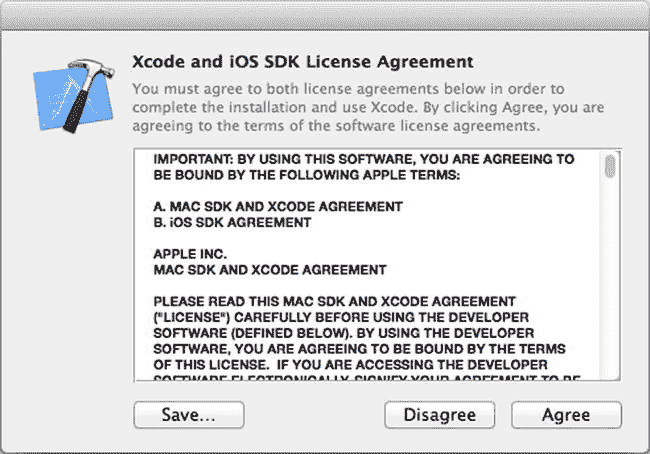
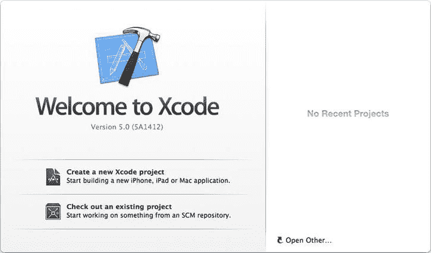
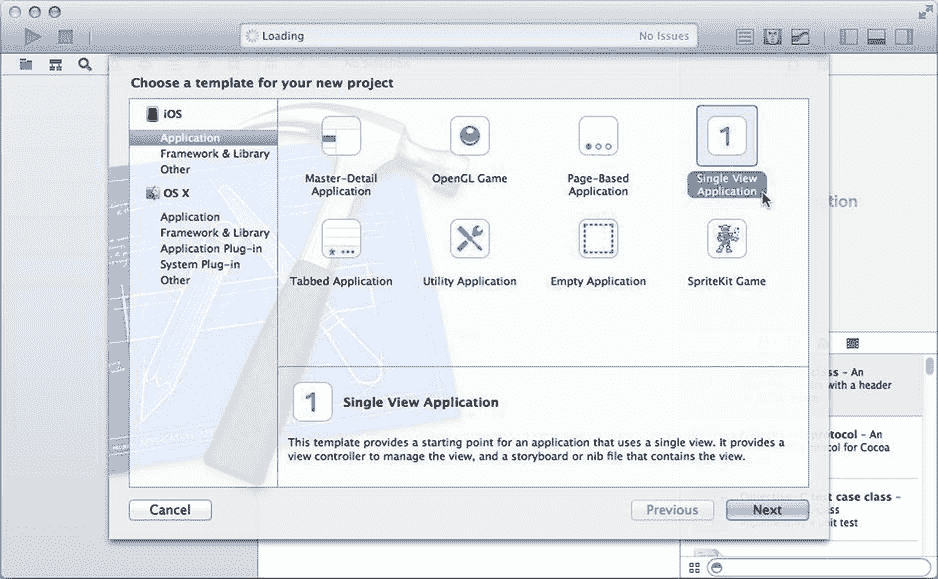
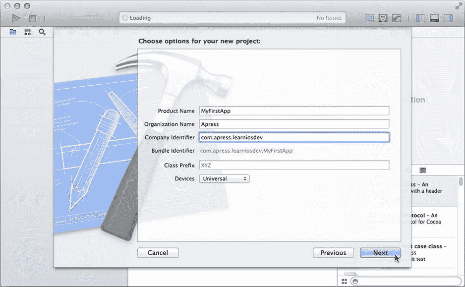
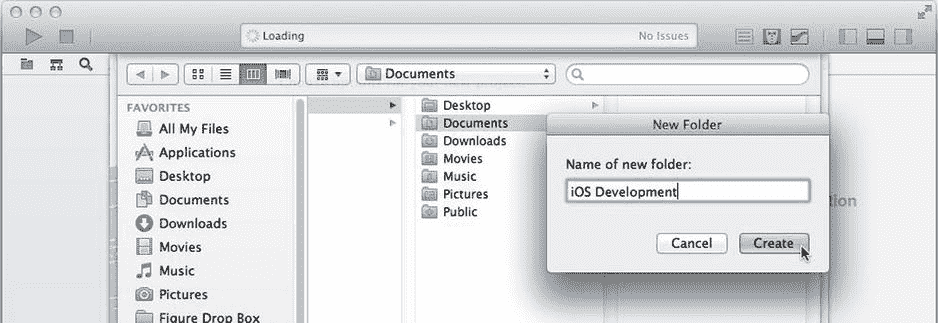

# 首次启动 Xcode

`Xcode` 应用下载完成后，你会在 `Applications` 文件夹中找到它。通过双击、使用 `Launchpad` 或任何你喜欢的方式打开 `Xcode` 应用。我建议将 `Xcode` 添加到 `Dock` 以便快速访问。

`Xcode` 将显示一份许可协议（见图 1-3），建议你至少浏览一遍，但必须同意后才能继续。

图 1-3. 许可协议

完成所有初始步骤后，你将看到 `Xcode` 的启动窗口，如图 1-4 所示。

图 1-4. Xcode 的启动窗口

启动窗口有几个自解释的按钮，可帮助你快速上手。它还列出了你最近打开的项目。

`Xcode` 的有趣功能只有在打开项目时才会显现，因此请先创建一个新项目。点击启动窗口中的 `Create a new Xcode project` 按钮（或从菜单中选择 `File` ➤ `New` ➤ `Project...`）。`Xcode` 首先会询问你想创建哪种类型的项目，如图 1-5 所示。

图 1-5. 项目模板浏览器

模板浏览器允许你选择一个项目模板。每个模板都会创建一个预配置的新项目，用于为特定平台（`iOS` 或 `OS X`）构建特定内容（应用、库、插件等）。虽然也可以手动配置任何项目以生成你想要的内容，但这既技术性强又繁琐；通过选择尽可能接近你应用最终“形态”的模板，可以省去大量工作。

在本书中，你只会创建 `iOS` 应用，因此选择 `iOS` 部分下的 `Application` 类别——但也可以随意查看其他部分。如你所见，`Xcode` 的用途远不止 `iOS` 开发。

选中 `Application` 部分后，点击 `Single View Application` 模板，然后点击 `Next` 按钮。在下一个界面中，`Xcode` 需要你提供新项目的详细信息，如图 1-6 所示。你在此处看到的选项会根据所选模板而有所不同。

图 1-6. 新项目选项

对于这个简单演示，请在 `Product Name` 字段中为新项目命名。名称可以任意——我在此示例中使用了 `MyFirstApp`——但我建议名称保持简洁。`Organization Name` 是可选项，但我建议填写你的名字（或你所在公司的名称，如果你将为其开发应用的话）。

`Company Identifier` 和 `Product Name` 共同构成一个唯一标识你应用的 `Bundle Identifier`。`Company Identifier` 是一个反向域名，应由你（或你公司）拥有。目前它并不重要，因为你仅为自己构建此应用，所以使用任何你喜欢的域名即可。当你构建计划通过 `App Store` 分发的应用时，这些值必须是合法的。

其余选项对于本演示无关紧要，因此点击 `Next` 按钮。`Xcode` 最后会询问新项目的存储位置（见图 1-7）。每个项目都会创建一个以项目命名的文件夹。用于创建应用的所有文档都将存储在该项目文件夹中。你可以将项目文件夹放在任何位置（甚至 `Desktop` 上）。在此示例中，我创建了一个新的 `iOS Development` 文件夹，以便将所有项目文件夹集中存放。

图 1-7. 创建新项目

