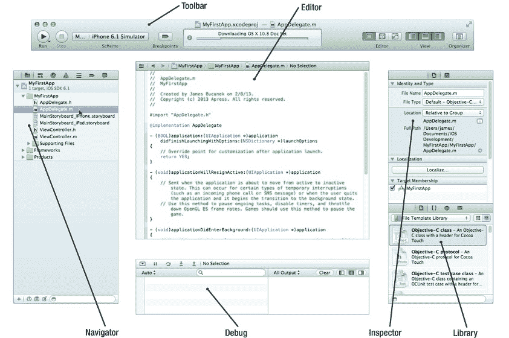
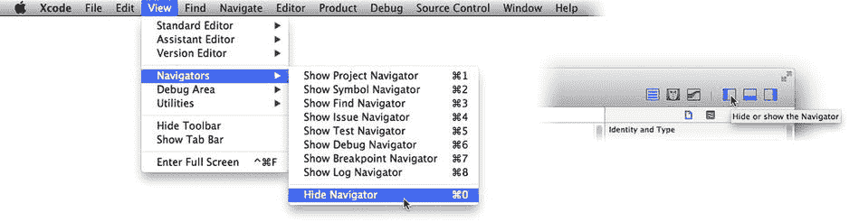
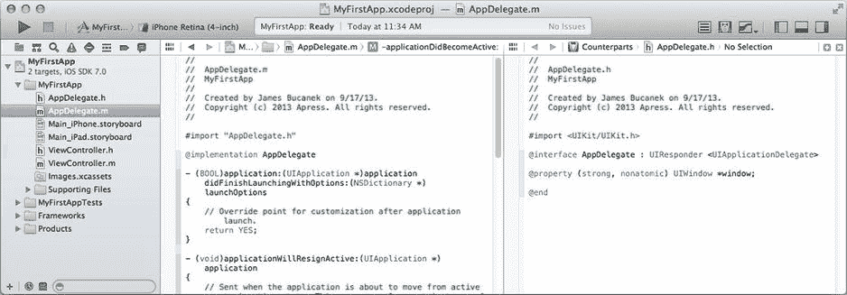
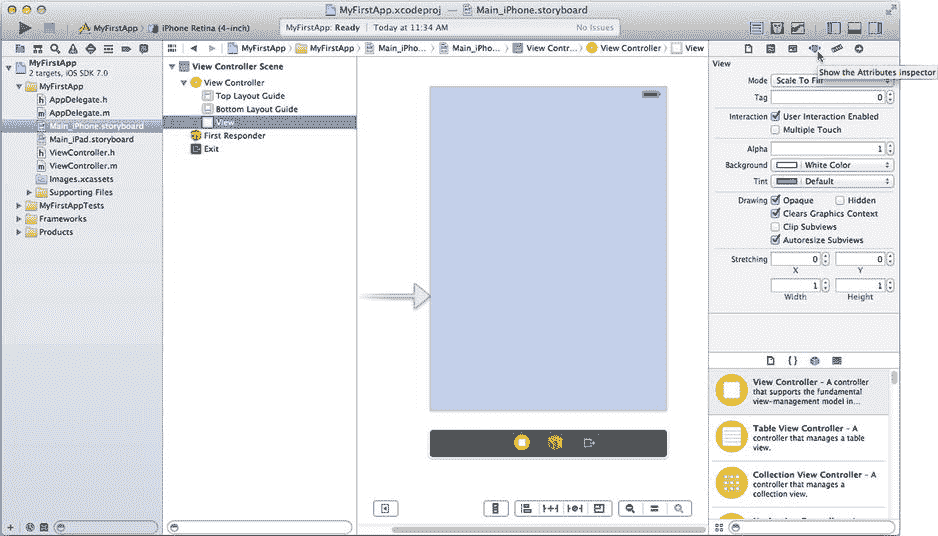
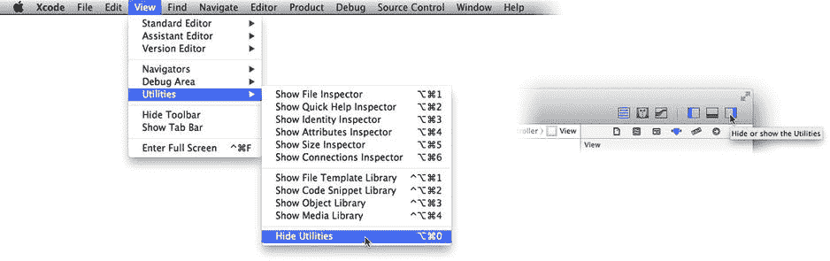
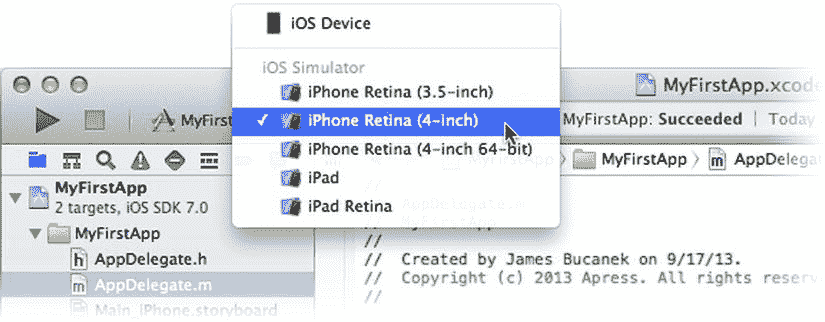
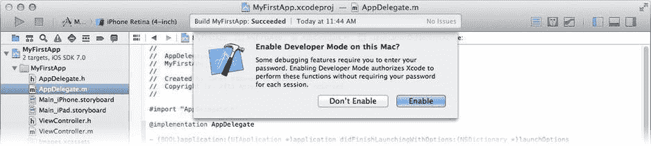
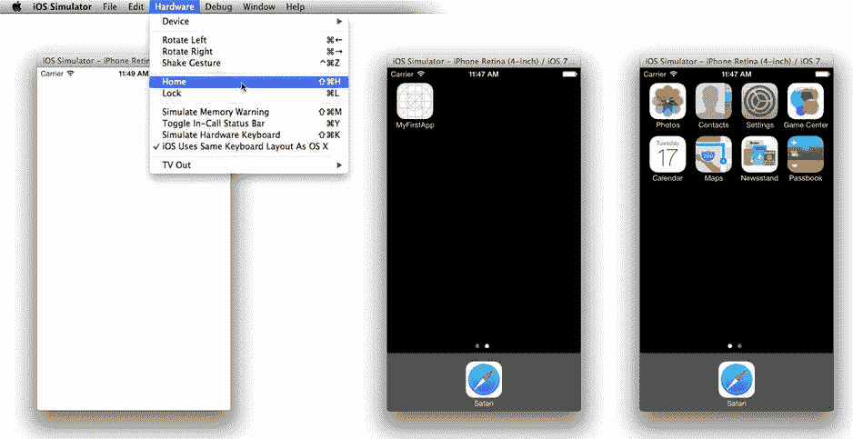

# 欢迎使用 Xcode

完成新项目的所有详细信息后，点击 `Create` 按钮。`Xcode` 将创建你的项目，并在工作区窗口中打开它。工作区窗口的展开视图如图 1-8 所示。这就是奇迹发生的地方，也是你在本书中绝大部分时间花费的地方。

图 1-8. Xcode 工作区窗口

工作区窗口有五个主要部分：

*   导航区（左侧）
*   编辑器区（中央）
*   工具区（右侧）
*   调试区（底部）
*   工具栏（顶部）

你可以有选择地隐藏除编辑器区之外的所有部分，因此你可能不会同时看到所有这些部分。让我们逐一简要浏览，以便你熟悉环境。

## 导航区

导航器位于工作区窗口的左侧。共有八个导航器：

*   项目
*   符号
*   查找
*   问题
*   测试
*   调试
*   断点
*   日志

通过点击窗格顶部的图标，或从 `View` ➤ `Navigator` 子菜单切换导航器。你可以使用 `View` ➤ `Navigator` ➤ `Hide Navigator` 命令（`Command+0`）或点击工具栏中 `View` 按钮的左侧（见图 1-9）来隐藏导航器。这将为编辑器腾出一点额外的屏幕空间。

图 1-9. 导航器视图控件

项目导航器（见图 1-8）是你的主基地，也是你使用最多的一个。项目中所有的源文件都组织在项目导航器中，并且通过它来选择要编辑的文件。

注意

源文件是创建应用时使用的任何原始文档。大多数项目都有多个源文件。该术语用于将它们与中间文件（在构建过程中创建的临时文件）和产品文件（最终应用的文件）区分开来。你的产品文件出现在项目导航器底部的 `Products` 文件夹中。

符号导航器会持续列出你在项目中定义的符号。搜索导航器可以在多个文件中查找文本。问题、调试、断点和日志导航器在你准备构建和测试应用时发挥作用。

### 编辑器区域

编辑器区域是您实际创建应用的地方——名副其实。在项目导航器中选择一个源文件，它就会出现在编辑器区域中。编辑器的外观取决于文件的类型。

**注意**：并非所有文件都能在 Xcode 中编辑。例如，图像和声音文件无法在 Xcode 中编辑，但 Xcode 会在编辑器区域中显示它们的预览。

您最常编辑的是程序源文件（您可以像编辑任何文本文件一样编辑它们，参见图 1-8）和 Interface Builder 文件（它们以对象图表的形式呈现，参见图 1-11），您可以对这些对象进行连接和配置。

编辑器区域有三种模式：

-   标准编辑器
-   助理编辑器
-   版本编辑器

标准编辑器用于编辑所选文件。助理编辑器会将编辑器区域分割开来，并（通常）在右侧加载一个对应的文件。例如，在编辑 Objective-C 源文件时（如图 1-10 所示），助理编辑器会自动在右侧加载其对应的文件——即包含该文件定义的头文件。当编辑 Interface Builder 文件时，它可能会显示正在编辑的对象所对应的 Objective-C 源文件，以此类推。

  
图 1-10. 助理编辑器

**提示**：助理编辑器非常灵活，可用于编辑您选择的几乎任何第二个文件。如果助理编辑器停止在右侧窗格中自动加载对应文件，请从右侧窗格上方的功能区中选择 `Counterparts` 以恢复该功能。

版本编辑器用于比较源文件与早期版本。Xcode 支持多种版本控制系统。您可以“签入”或为项目拍摄“快照”，稍后可以将您编写的内容与同一文件的早期版本进行比较。本书不会深入介绍版本控制。如果您感兴趣，请阅读 Xcode 用户指南中的*保存和还原项目更改*部分。

要更改编辑器模式，请点击工具栏中的编辑器控件，或使用 `View` 菜单中的命令。您无法隐藏编辑器区域。

### 实用工具区域

工作区窗口的右侧是实用工具区域。顾名思义，它提供了各种有用的工具，如图 1-11 所示。

  
图 1-11. 编辑 Interface Builder 文件

实用工具区域的顶部是检查器。这些检查器会根据正在编辑的文件类型以及您所选择的内容而变化。与导航器类似，您可以通过点击窗格顶部的图标，或通过 `View` ➤ `Utilities` 子菜单（参见图 1-12）在不同的检查器之间切换。您可以使用 `View` ➤ `Utilities` ➤ `Hide Utilities` 命令，或点击工具栏中视图控件右侧部分（参见图 1-12）来隐藏实用工具区域。

  
图 1-12. 实用工具视图控件

实用工具区域的底部是库。在这里您可以找到现成的对象、资源和代码片段，您可以将它们拖入到项目中。

### 调试区域

调试区域用于测试您的应用并解决任何问题。它通常直到您运行应用时才会出现。要显示或隐藏它，可以使用 `View` ➤ `Debug Area` ➤ `Show/Hide Debug Area` 命令。您也可以点击调试窗格左上角的关闭抽屉图标。

### 工具栏

工具栏包含许多有用的快捷键和状态信息，如图 1-13 所示。

  
图 1-13. 工作区窗口工具栏

您已经看到了右侧的编辑器和视图按钮。左侧是用于运行（测试）和停止应用的按钮。在开发过程中，您将使用这些按钮来启动和停止您的应用。

在运行和停止按钮旁边是方案控件。这个多部分弹出菜单允许您选择项目的构建方式（称为方案）以及应用的目标位置（模拟器、实际设备、App Store 等）。

工具栏的中间是项目的状态。它将显示当前正在进行的活动，或最近完成的活动，例如构建、索引等。如果您刚刚安装 Xcode，它可能正在后台下载额外的文档，状态会显示这一点。

如果您愿意，可以使用 `View` ➤ `Show/Hide Toolbar` 命令隐藏工具栏。工具栏中的所有按钮和控件都只是菜单命令的快捷方式，因此没有它也可以正常工作。不过，本书会假设该工具栏是可见的。

如果您想了解更多关于工作区窗口、导航器、编辑器和检查器的信息，可以在 `Help` 菜单下的 Xcode 概述中找到所有这些内容（以及更多）。

## 运行您的第一个应用

打开您的工作区窗口后，点击方案控件，并从子菜单中选择一个 iPhone 选项，如图 1-14 所示。这会告诉 Xcode，当您点击 `Run` 按钮时，希望此应用在何处运行。

  
图 1-14. 选择方案和目标

点击 `Run` 按钮。好的，可能还需要完成一道手续。在测试应用程序之前，Xcode 需要被授予一些特殊权限。当您第一次尝试运行应用时，Xcode 会询问是否可以（参见图 1-15）。点击 `Enable` 并提供您的账户名和密码。

  
图 1-15. 启用开发者模式

一旦您完成了这些初步步骤，Xcode 就会从您项目中的所有部件组装您的应用——这个过程称为构建——然后使用其内置的 iPhone 模拟器运行您的应用，如图 1-16 左侧所示。

  
图 1-16. iPhone 模拟器

模拟器正如其名。它是一个尽可能逼真地模拟真实 iPhone、iPad 或 iPod Touch 的程序。模拟器允许您直接在 Mac 上进行大部分 iOS 应用测试，而无需将应用加载到真实的 iOS 设备上。它还允许您在不同类型的设备上测试您的应用，因此您不必每种都买一个。

恭喜您，您刚刚在（模拟的）iPhone 上创建、构建并运行了一个 iOS 应用！之所以能成功，是因为 Xcode 项目模板总是创建一个可运行的项目；所缺少的是让您的应用实现某些精彩功能的部分。这正是本书其余部分要介绍的内容。

现在，您可以随意在 iPhone 模拟器中探索。虽然您创建的应用没有任何功能——除了一个拙劣的“手电筒”应用之外——但您会注意到，您可以使用 `Hardware` ➤ `Home` 命令模拟按下主页按钮，并返回到主屏幕（图 1-16 的中部和右侧）。在那里，您会找到您的应用、设置应用、Game Center 等，就好像这是一个真正的 iPhone 一样。抱歉，它不能拨打电话。

完成后，切换回工作区窗口，并点击工具栏中的 `Stop` 按钮。

## 总结

你现在已经掌握了开发并运行 iOS 应用所需的全部工具。你了解了 Xcode 的基本组织结构，以及如何在模拟器中运行你的应用。

下一步就是为你的应用添加一些内容。

