# 第二章：Boom！应用

## 摘要

在本章中，你将创建一个能够真正做些事情的 iOS 应用。虽然功能不多——毕竟还处于早期阶段——但足以称得上实用。在这个过程中，你将：

-   使用 Xcode 的 **Interface Builder** 设计你的应用
-   为你的应用添加对象
-   将对象连接在一起
-   自定义对象以提供内容
-   向项目添加资源文件
-   使用 **storyboard** 创建**转场**
-   使用**约束**控制视觉元素的布局

令人惊讶的是，你将在不编写一行代码的情况下创建这个应用。这并不常见，但这将展示 Xcode 的灵活性。

你将创建的这个应用会展示一些关于二十世纪女性超现实主义者的有趣事实。让我们开始吧。

### 设计

在启动 Xcode 并疯狂敲击键盘之前，你需要有一个计划。这是应用开发的设计阶段。在你的应用生命周期中，随着不断改进，你可能会多次修改设计，但在开始之前，你需要对应用的外观和工作方式有一个基本构想。

你的设计可以是正式写出来的，也可以是画在餐巾纸上的草图，甚至可以只是存在脑子里。只要你有设计就行，形式并不重要。你至少需要能够回答一些基本问题：你的应用将在哪些设备上运行（iPhone/iPod、iPad，还是两者都支持）？应用是竖屏运行、横屏运行，还是两者都支持？用户会看到什么？用户如何导航？他们将如何与应用互动？

本应用的一个粗略草图如图 2-1 所示。这个应用非常简单，因此初始设计不需要太多内容。这个超现实主义者应用将有一个包含著名女性超现实主义者肖像的启动画面。点击其中一张肖像，画面将过渡到第二个屏幕，该屏幕会展示一幅代表性画作以及一个包含艺术家生平信息的可滚动文本字段。你已决定此应用仅能在 iPhone 或 iPod Touch 上运行，并且仅支持竖屏方向。这将简化你的设计和开发工作。

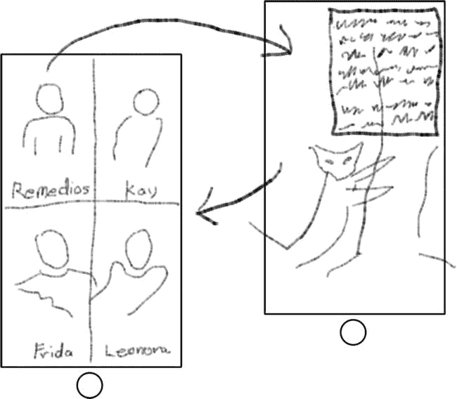

图 2-1. 超现实主义者应用草图

### 创建项目

第一步是创建你的项目。点击启动窗口上的 `New Project` 按钮，或选择 `New ➤ New Project…` 命令。查看可用的模板，如图 2-2 所示。

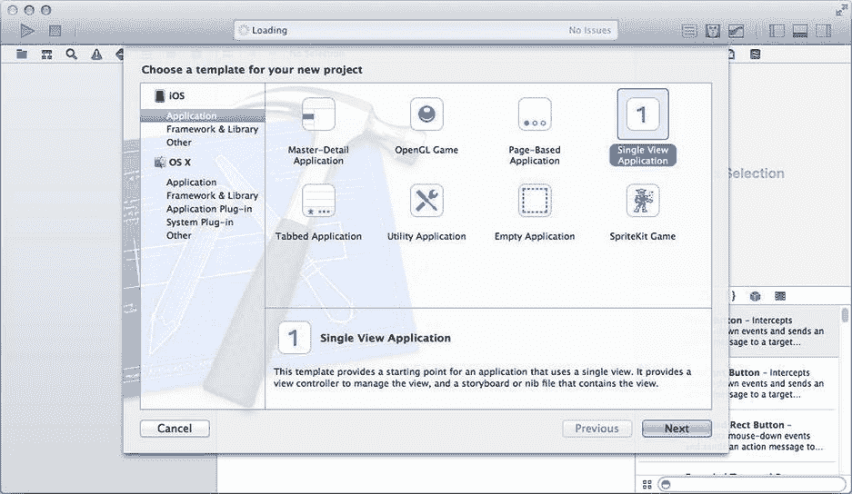

图 2-2. iOS 项目模板

你的设计为你提供了应用工作方式的基本概念，这应该能提示你选择哪个 Xcode 项目模板作为起点。你的应用设计与这些模板中的任何一个都不是完全吻合，因此选择 `Single View Application` 模板——这是最简单的模板，并且已经包含了一个视图。点击 `Next` 按钮。

下一步是填写项目的详细信息（见图 2-3）。将项目命名为 `Surrealists`，并填写你的组织名称和标识符。为了与你的设计选择保持一致，将 `Devices` 选项从 `Universal` 更改为 `iPhone`，如图 2-3 所示。

> **注意**：为 iPhone 开发与为 iPod Touch 开发是相同的（除非你的应用使用了 iPhone 独有的功能）。从现在开始，我将只提及 iPhone，但请记住这也包括 iPod Touch。

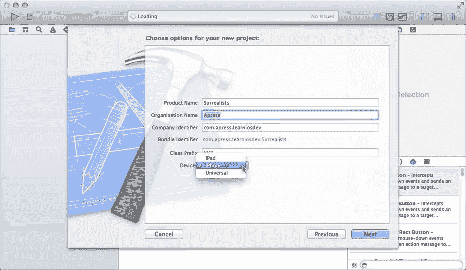

图 2-3. 设置项目详细信息

还有一个 `Class Prefix` 设置。此选项设置一个非常短的字符串，它将用于一致地命名你添加到项目中的所有新类。传统上是两个大写字母，但也可以是任何内容。你应该避免使用 iOS 已使用的两个字符前缀，特别是 `NS` 和 `UI`。对于这个项目，请将其留空——你不会创建任何类。

点击 `Next` 按钮。在你的硬盘上选择一个位置来保存新项目，然后点击 `Create`。

## 设置项目属性

你现在有了一个空的 Xcode 项目；是时候开始自定义它了。从项目设置开始，点击项目导航器中的项目名称（`Surrealists`），如图 2-4 左上角所示。编辑区域将显示此项目的所有设置。从编辑器左上角的弹出菜单中选择 `Surrealist` target（见图 2-4），然后选择中间的 `General` 选项卡。

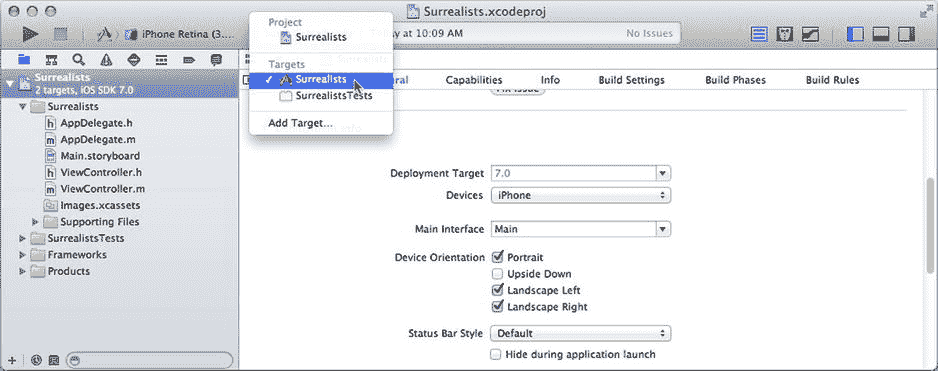

图 2-4. target 设置

向下滚动 target 设置，直到找到 `Deployment Info` 区域。取消选中 `Device Orientation` 中的 `Landscape Left` 和 `Landscape Right` 复选框，这样仅选中 `Portrait` 方向。

回顾一下，你已经创建了一个仅限 iPhone 的应用项目，并且它只能以竖屏方向运行。现在你已经准备好设计界面了。

## 构建界面

点击项目导航器中的 `Main.storyboard` 文件。Xcode 的 **Interface Builder** 编辑器会出现在编辑区域，如图 2-5 所示。

Interface Builder 是 Apple 应用厨房中的**秘密武器**。简而言之，它是一个用于在应用内添加、配置和互连对象的工具——无需编写任何代码。你可以在 Interface Builder 中定义应用的大部分视觉元素。Interface Builder 编辑 `storyboard`、`xib` 和（旧版）`nib` 文件。

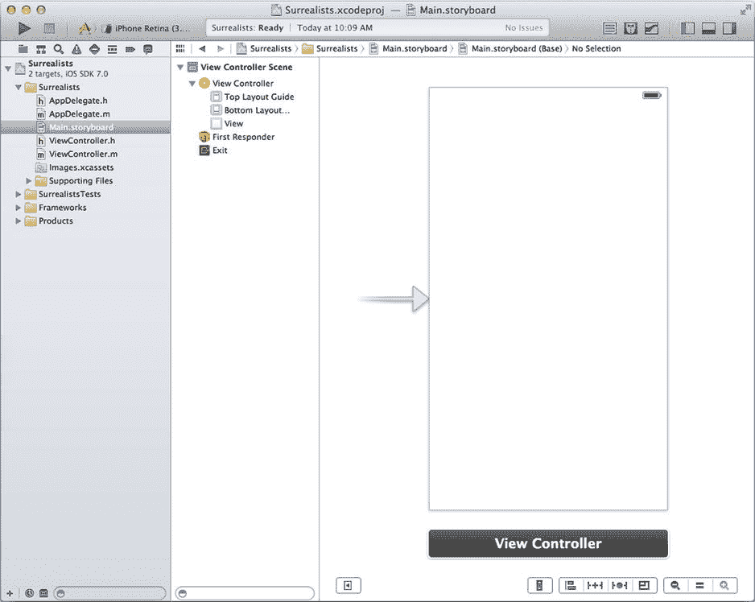

图 2-5. Interface Builder

> **注意**：现代 Interface Builder 文件的扩展名为 `xib` 或 `storyboard`。旧版 Interface Builder 文件的扩展名为 `nib`（读作“nib”），你仍然会听到程序员将它们统称为“nib”文件。Nib 这个缩写代表 **N**ext **I**nterface **B**uilder，因为 Xcode、Interface Builder 和 Cocoa Touch 框架的根源都可以追溯到 Steve Jobs 的“另一家”公司——NeXT。在本书后面，你会看到很多以 `NS` 开头的类名，这是 `NeXTStep` 的缩写，即 NeXT 操作系统的名称。

Interface Builder 在两种视图中显示文件中的对象。左侧（见图 2-5）是组织成层级列表的对象，称为**大纲**。一些对象可以包含其他对象，就像文件夹可以包含其他文件夹一样，大纲反映了这一点。使用展开三角形来显示包含的对象。

右侧的视图称为**画布**。在这里你可以找到 Interface Builder 文件中的可视化对象。只有可视化对象（如按钮、标签、图像等）才会出现在画布上。没有可视化方面的对象只会在大纲中列出。如果一个对象同时出现在两者中，你使用哪一个都没关系——它们是同一个对象。

> **注意**：如果你一直在学习面向对象编程语言，那么你就知道什么是“对象”。如果你不知道什么是“对象”，不要惊慌。现在，只需将对象视为乐高®积木；它是一个离散的模块，在你的应用中执行特定任务，并且可以与其他模块连接起来组成更大的部分。如果你想立即了解对象，可以跳到第 6 章。

### 添加对象

从库中获取新对象。选择 `View ➤ Utilities ➤ Show Object Library` 命令。这将会同时使右侧的工具区域变为可见，并切换到对象库（小立方体），如图 2-6 所示。

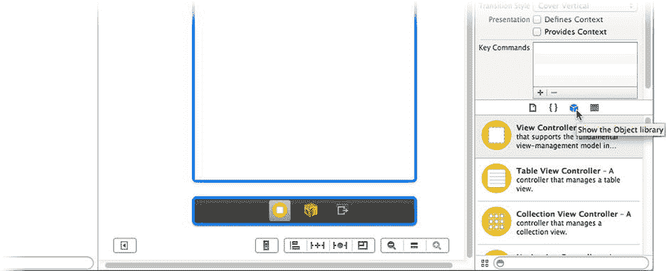

图 2-6. 对象库

要向你的应用添加对象，请将其从库中拖拽并放入 Interface Builder 编辑器中。你的应用需要一个导航控制器对象，因此向下滚动对象列表，直到找到`导航控制器`。你可以通过在库面板底部的搜索字段中输入关键字来简化搜索（见图 2-7）。

如图 2-7 所示，将导航控制器对象从库中拖拽到画布上，然后将其放到空白区域的任意位置。你刚刚为你的应用添加了一个对象——实际上，是几个对象。

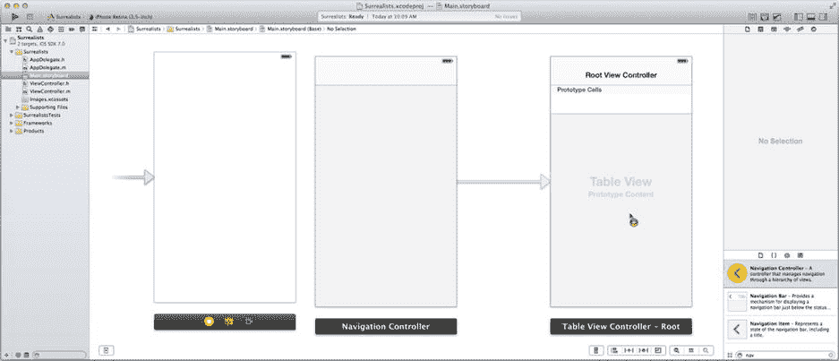

图 2-7. 添加导航控制器

### 删除和连接对象

库中的导航控制器对象实际上是一组对象的集合。顾名思义，导航控制器管理用户如何在多个屏幕之间移动，每个屏幕都由一个单独的视图控制器对象控制。导航控制器连接到将显示的第一个屏幕的视图控制器，这个屏幕被称为其根视图控制器。不必担心细节；你将在第 12 章中全面了解导航控制器。

为了方便起见，库中的导航控制器会同时创建一个导航控制器对象以及它初始化时附带的根视图控制器。这个根视图控制器恰好是一个表视图控制器。你不需要表视图控制器。相反，你希望这个导航控制器使用你已经拥有的、没有多余功能的普通视图控制器。

首先，丢弃多余的表格视图控制器。如图 2-8 所示，只选中连接到导航控制器的那个表视图控制器。按 `Delete` 键，或选择 `Edit ➤ Delete`。

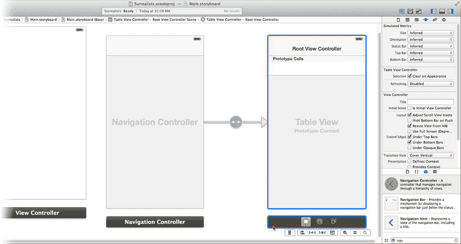

图 2-8. 删除表视图控制器

现在，你需要将新的导航控制器连接到你的项目自带的那个普通视图控制器。拖拽视图控制器并将其放置在导航控制器的右侧（见图 2-9）。

附加在视图控制器上的未连接箭头表示你应用的初始视图控制器。你想让导航控制器成为第一个控制器，因此，如图 2-9 所示，将该箭头从简单的视图控制器上拖离，并放到导航视图控制器上。

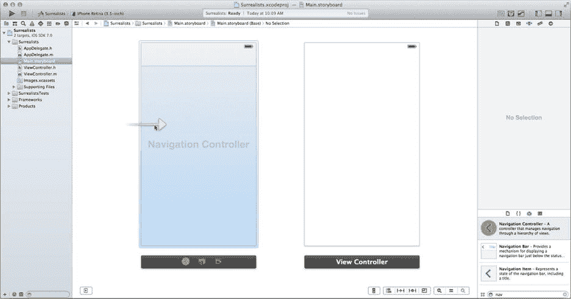

图 2-9. 指定初始视图控制器

最后一步是重新建立导航控制器与其根视图控制器的连接。在 Interface Builder 中有多种建立连接的方法。我将向你展示两种最常用的方法。按住 `control` 键，点击导航控制器，然后从它上面拖出一条线连接到视图控制器，如图 2-10 所示。

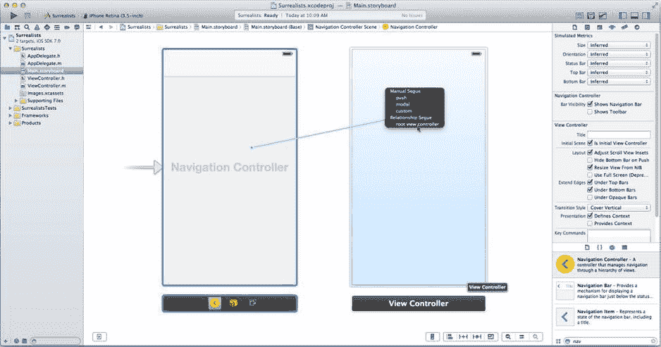

图 2-10. 设置根视图控制器连接

松开鼠标时，会弹出一个菜单，列出了这两个对象之间所有可能的连接。点击 `根视图控制器` 连接。现在，当你的应用启动时，导航控制器将把此视图控制器显示为第一个屏幕。

我确实答应过要教你两种连接对象的方法。第二种方法是使用工具区域中的连接检查器。选择 `View ➤ Utilities ➤ Show Connections Inspector`，或点击工具面板中的小箭头图标，如图 2-11 所示。

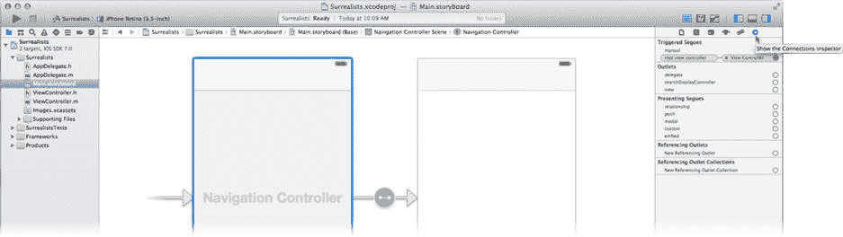

图 2-11. 使用连接检查器

要使用检查器，首先选择一个对象。在此例中，选择导航控制器。连接检查器将显示该对象的所有连接。找到标记为`根视图控制器`的连接。每个连接的右侧都有一个小圆圈。要设置连接，请点击并将该圆圈拖拽到你想连接的另一个对象上——在此例中，是视图控制器。要清除（或“断开”）连接，请点击连接字段中的小“x”。

到目前为止，你已经创建了一个新项目。项目模板包含了一个简单的视图控制器。你为你的应用添加了一个新的导航控制器对象（以及一个不需要的、被你丢弃的表视图控制器）。你已将导航控制器指定为应用启动时接管控制的那个控制器，并将该控制器连接到了那个空的视图控制器。现在，是时候往那个空的视图中放入一些内容了。

### 向视图中添加视图

现在进入这个项目最有趣的部分：创建应用的内容。首先，在启动画面中添加四个按钮，稍后你将对其进行个性化设置。为此，你需要在初始屏幕的视图对象中进行操作。

视图控制器对象并非单一对象，而是一个对象的集合。我之前提到过，有些对象可能包含其他对象；视图控制器和视图就是这样的两个对象。首先，选择视图对象。在 `Interface Builder` 中有两种方法可以做到这一点。你可以在左侧的大纲中找到该对象（见图 2-12），然后选中它。另一种方法是“深入”到你想要的对象。点击视图控制器对象的中心位置（见图 2-12 的中间部分）。这将选中视图控制器对象。再次点击，你就会选中该对象中包含的视图对象。如果那个视图中还包含另一个对象，再次点击就会选中它，以此类推。

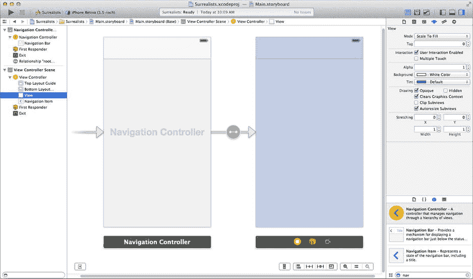

图 2-12. 选中视图对象

既然你已经知道如何查找和选中嵌入的视图对象，那么是时候向其中添加一些新的视图对象了。在对象库中，找到 `Button` 对象——在搜索栏中输入“button”可以更方便地找到它。抓取一个 `Button` 对象并将其拖入视图对象中，如图 2-13 所示。

**注意：**视图所包含的视图对象被称为它的子视图。包含某个视图的视图被称为它的父视图。

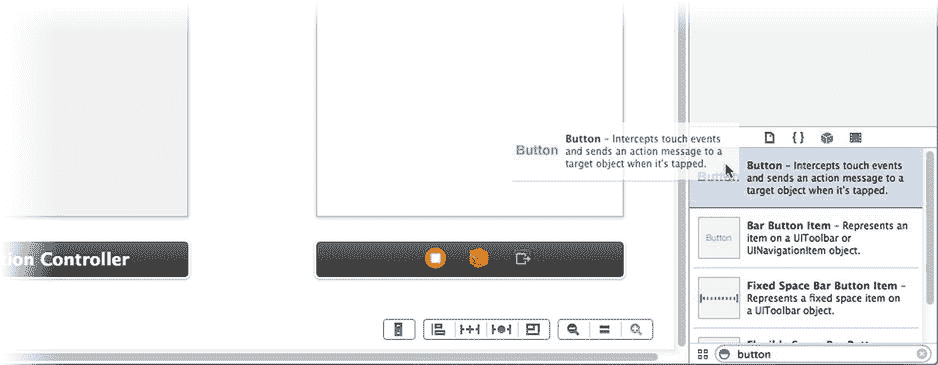

图 2-13. 添加按钮对象

重复此操作三次，这样视图中就有四个按钮对象，大致如图 2-14 所示。现在，你需要调整这些按钮的大小，使它们填满整个屏幕。为了帮助你均匀布局，可以添加一些参考线。点击父视图内部，确保没有选中任何按钮对象，然后选择 `Editor` ➤ `Add Vertical Guide`。默认情况下，会在视图中间创建一条新的参考线，这正是你所需要的。

使用参考线，调整每个按钮的位置和大小，使其占据视图的四分之一。首先，将按钮拖到一个象限的左下角。视图会自动“吸附”到最近的布局参考线上。抓住对角的大小调整手柄并将其拖出，以填满整个象限，如图 2-14 所示。在这个阶段不需要做到完美；稍后在本章中你会对其进行整理。

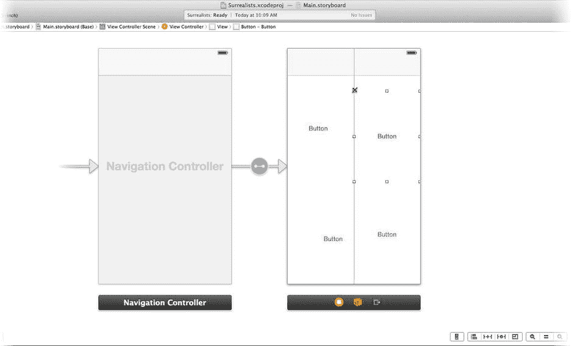

图 2-14. 定位按钮

全部完成后，你将得到四个填满屏幕的按钮（见图 2-15）。

### 编辑对象属性

现在是时候自定义你的按钮了。选中所有四个按钮——点击其中一个按钮，然后按住 shift 键，依次点击其他三个按钮。选择 `View` ➤ `Utilities` ➤ `Show Attributes Inspector`，或者点击检查器面板中的小控制图标，如图 2-15 所示。

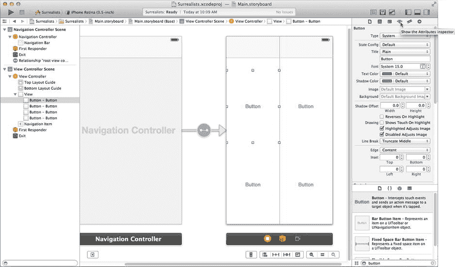

图 2-15. 自定义按钮对象

属性检查器用于修改一个或多个对象的各种属性。检查器中的属性会根据你选中的对象类型而变化。如果你选中了多个对象，检查器将只显示这些对象共有的属性。

选中四个按钮后，使用属性检查器进行以下更改：

*   将 Type 更改为 `Custom`
*   点击字体属性旁边的向上箭头，直到显示为 `System Bold 18.0`
*   点击 Text Color 下拉箭头，选择 `white`
*   找到 Control 组，并选择底部垂直对齐图标

全部完成后，你的视图应该看起来像图 2-16 中所示。下一步是分别为每个按钮添加图像和标签。为此，你需要向项目中添加一些资源。

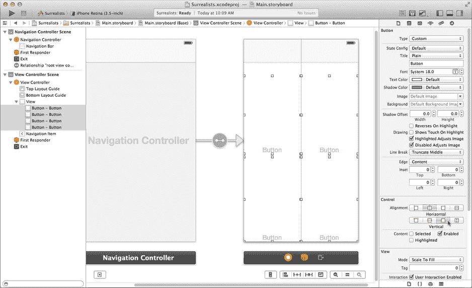

图 2-16. 自定义后的按钮

### 添加资源

应用运行所需的一切都必须是你所构建应用的一部分。如果你的应用需要一张图片，那么该图片必须包含在其资源中。图片文件、`Interface Builder` 文件、声音文件，以及其他任何非计算机代码的东西，统称为资源。

你几乎可以将任何文件作为资源添加到你的应用中。资源文件在构建时会被复制到应用的 bundle 中，并在应用运行时可供其使用。

`Xcode` 有一种特殊的方式来组织常用资源（如图片），将它们整合成一个称为资源目录的单一资源。要向资源目录添加新图片，请在项目导航器中选中该目录，如图 2-17 所示。在 `Finder` 中找到你想要添加的资源文件。找到你在第 1 章中下载的 `Learn iOS Development Projects` 文件夹。在 `Ch 2` 文件夹内，你会找到 `Surrealists (Resources)` 文件夹，其中包含八个图片文件。让你的文件和项目窗口都可见，然后将这些图片文件拖拽到资源目录的组列表（左侧）中，如图 2-17 所示。

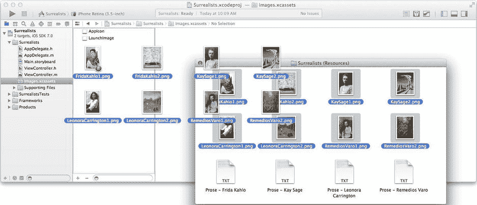

图 2-17. 将资源文件拖入资源目录

这些文件将被复制到你的项目文件夹中，添加到项目导航器，并作为资源添加到你的应用中。资源目录使你可以轻松组织同一张图片的多个分辨率版本，尽管在这个例子中只添加了低分辨率图片。像你刚才那样将图片拖入组列表，会在目录中创建新的分组。你稍后可以通过将图片拖入分组的预览窗格（图 2-18 右侧所示），来添加同张图片的其他版本（高分辨率或特定平台）。`Xcode` 无法编辑这些文件，但预览窗格（见图 2-18）允许你查看它们的缩略图。

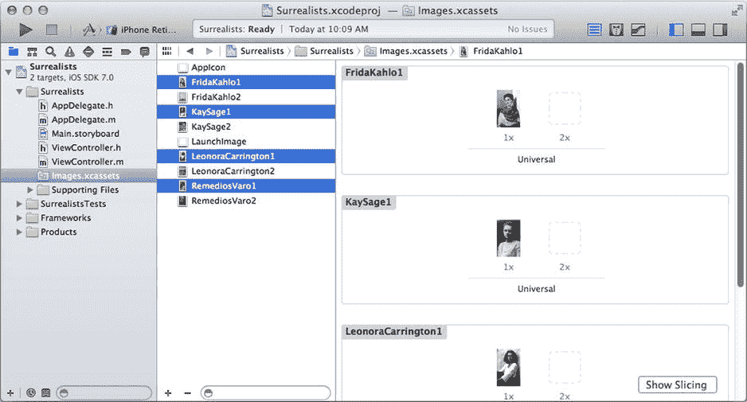

图 2-18. 预览图片文件

### 自定义按钮

在添加了必要的资源文件后，就可以开始自定义按钮了。再次选择 `Main.storyboard` 文件，然后选择左上角的按钮。打开属性检查器（视图 ➤ 工具 ➤ 显示属性检查器），将其标题属性更改为 `Remedios Varo`，背景属性更改为 `RemediosVaro1`，如图 2-19 所示。

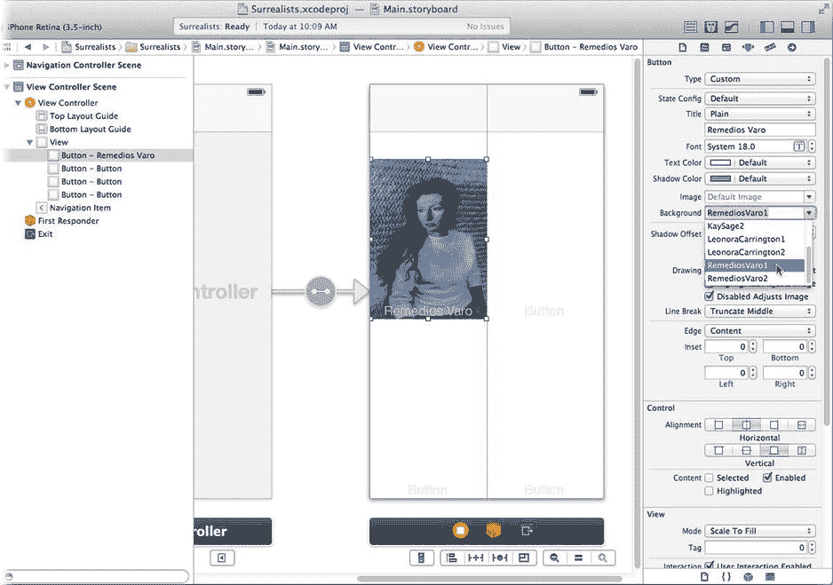

图 2-19. 自定义第一个按钮

背景属性是你希望按钮用作其背景的图片资源名称。你可以手动输入，但 Xcode 能识别常见的图片类型，并将你刚刚添加的图片资源包含在下拉列表中。只需从该列表中选择文件名即可。

自定义剩余的三个按钮（按顺时针方向操作），按照如下方式设置它们的标题和背景图片：

* `Kay Sage`，`KaySage1`
* `Leonora Carrington`，`LeonoraCarrington1`
* `Frida Kahlo`，`FridaKahlo1`

作为收尾工作，选择 Kay Sage 的按钮，并将其文本颜色改为 `black`（以便更易于阅读）。全部完成后，你的界面应该如图 2-20 所示。

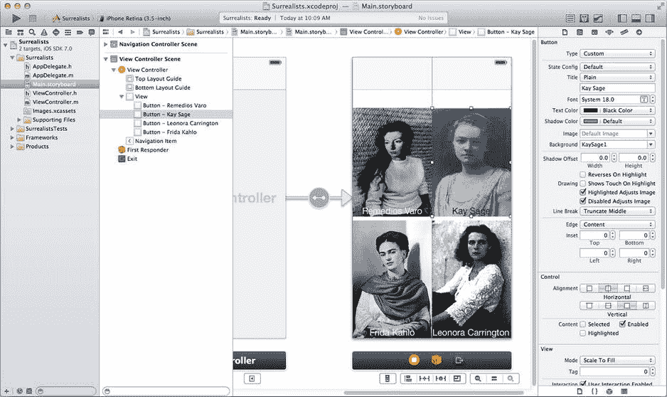

图 2-20. 完成后的按钮

## 使用故事板

故事板允许你在界面生成器中规划应用的各种屏幕，并定义用户如何在它们之间导航，从而简化了应用开发过程。在故事板出现之前，你可以布局每个屏幕，但必须编写代码来实现屏幕间的切换。这些代码量不大，也不复杂，但很繁琐。借助故事板，你可以在界面生成器中完成大部分工作——完全无需编写任何代码。

**顺畅开发的体验**

重复的代码会拖慢开发进度。将时间花费在反复编写相同代码上，就意味着你没有时间去开发炫酷的新功能。你需要的是一个顺畅无阻的开发环境，由它为你处理简单的任务，让你能专注于开发那些让你的应用与众不同的内容。

苹果公司致力于让 iOS 和 Xcode 尽可能流畅无阻。每个新版本都会添加新的类和开发工具，使开发高质量的应用变得更加容易。例如，在手势识别器引入之前，编写代码来检测多点触控手势（比如捏合或三指轻扫）是一项复杂的任务，通常需要一页或更多页的代码。而如今——你可能已经猜到了——你的应用只需将一个手势识别器对象拖放到设计中，并将其连接到一个操作，就能检测到这些手势。

接下来，让我们使用故事板来定义应用的其余屏幕，以及用户如何在这些屏幕之间导航。

### 添加新屏幕

在创建两个屏幕之间的过渡（称为 segue，发音为“seg-way”）之前，你必须先创建另一个屏幕（在故事板的术语中称为场景）。返回对象库，将一个全新的视图控制器对象拖入你的 `Main.storyboard` 文件中，如图 2-21 所示。

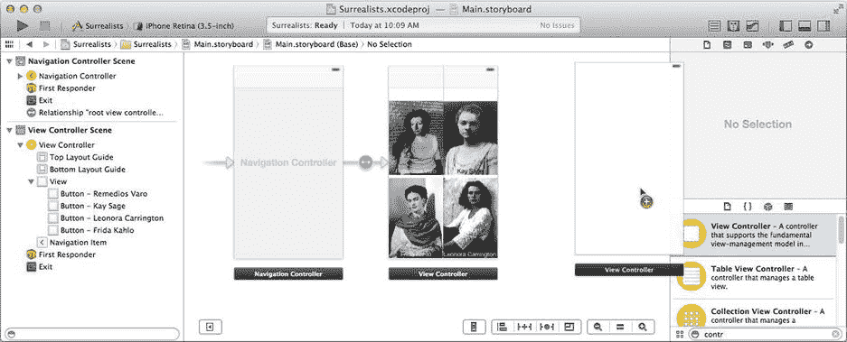

图 2-21. 添加一个新的视图控制器

在图 2-21 中，我进行了缩小操作（使用编辑器面板右下角的放大控件），以便看到整个故事板。然而，要编辑视图的内容，界面生成器需要放大到该视图。有几种方法可以实现这一点：

*   双击画布进行缩小/放大。
*   点击画布右下角的缩放切换按钮 (=) 或放大镜 (+)，然后滚动以居中视图。

在库中找到`图像视图`对象。将一个图像视图拖入空视图，如图 2-22 所示。

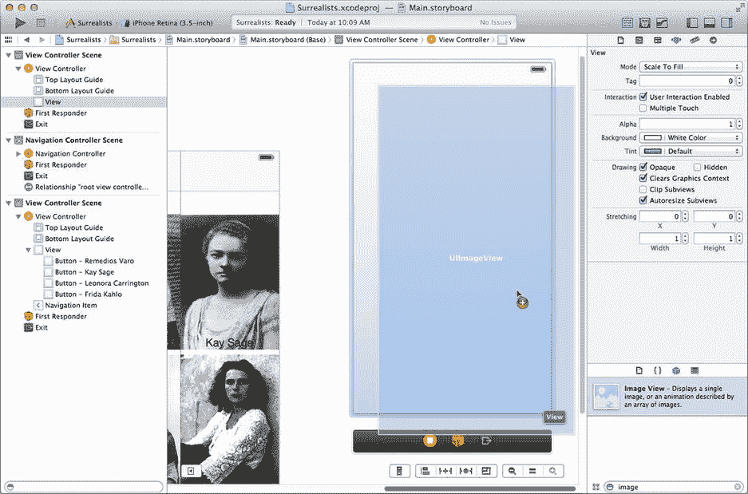

图 2-22. 添加一个图像视图对象

如果图像视图对象没有自动吸附填满整个视图，请拖动它直到填满。保持新图像视图对象的选中状态，切换到属性检查器。将图像属性更改为 `RemediosVaro2`，并将图像模式更改为 `Aspect Fill`，如图 2-23 所示。

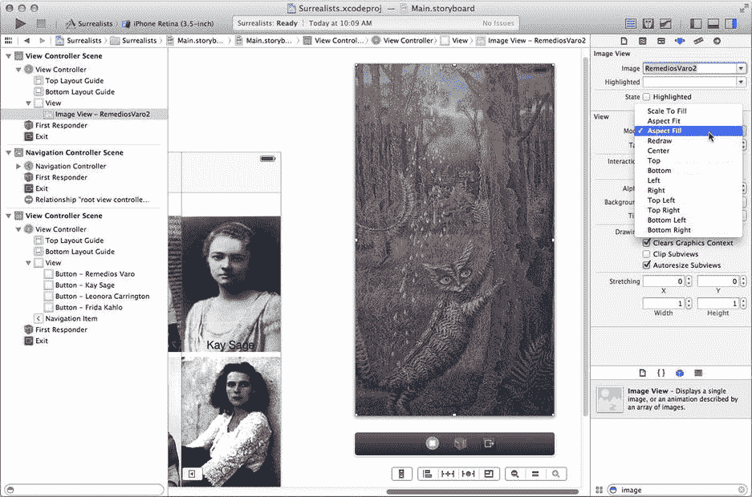

图 2-23. 自定义背景图像视图

现在，向此屏幕添加一个可滚动的文本字段。在库中找到`文本视图`（注意不是`文本字段`！）对象。将一个新的文本视图拖入窗口，并利用自动用户界面参考线将其定位在屏幕的右上角，如图 2-24 所示。

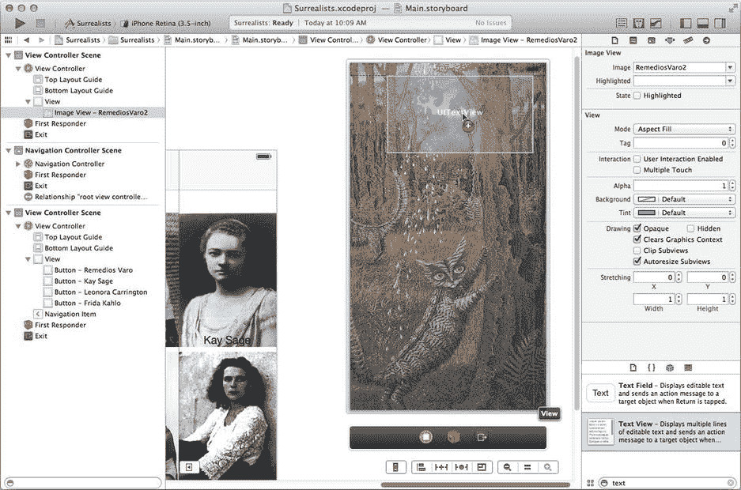

图 2-24. 添加一个文本视图

选中文本视图后，使用属性检查器更改以下属性：

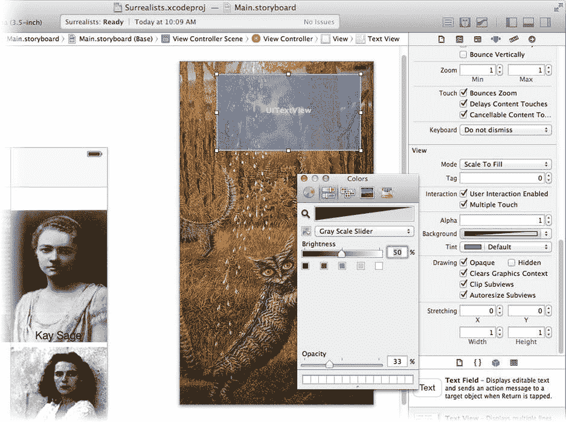

图 2-25. 设置半透明背景色

*   将文本颜色设置为 `white`
*   将字号减小到 `12.0`
*   取消勾选 `editable`（可编辑）选项
*   在下方，取消勾选 `Shows Horizontal Scrollers`（显示水平滚动条）
*   点击 `background`（背景）颜色，在颜色选择器中使用灰色滑块选择 50% 灰色，并设置 33% 的 Alpha 值或不透明度（参见图 2-25）

此对象的文本可以在你找到图片文件的 `Surrealists (Resources)`（超现实主义画家（资源））文件夹中找到。不过，你无需将这些文件添加到你的项目中。相反，请打开名为 `Prose - Remedios Varo` 的文件，复制其中的文本，切换回 Xcode，并将其粘贴到属性检查器的文本属性中，如图 2-26 所示。

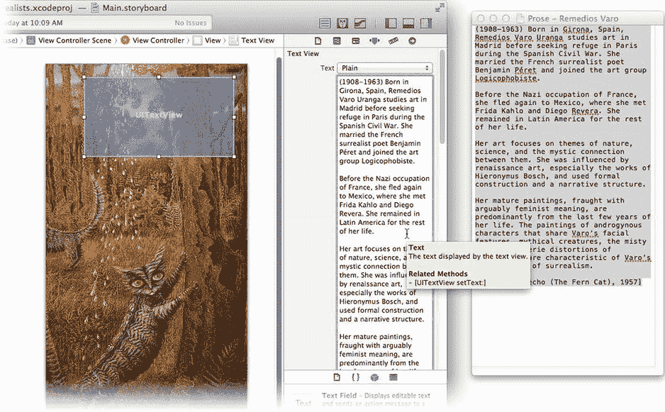

图 2-26. 将文本粘贴到文本字段对象中

### 创建 Segue

你的屏幕设置完成后，就可以定义主屏幕与此屏幕之间的 segue 了。你希望当用户点击 Remedios Varo 按钮时，此屏幕出现。要创建这个 segue，请按住 Control 键，点击 Remedios Varo 按钮，将连接线拖到这个新的视图控制器上，然后释放鼠标，如图 2-27 所示。

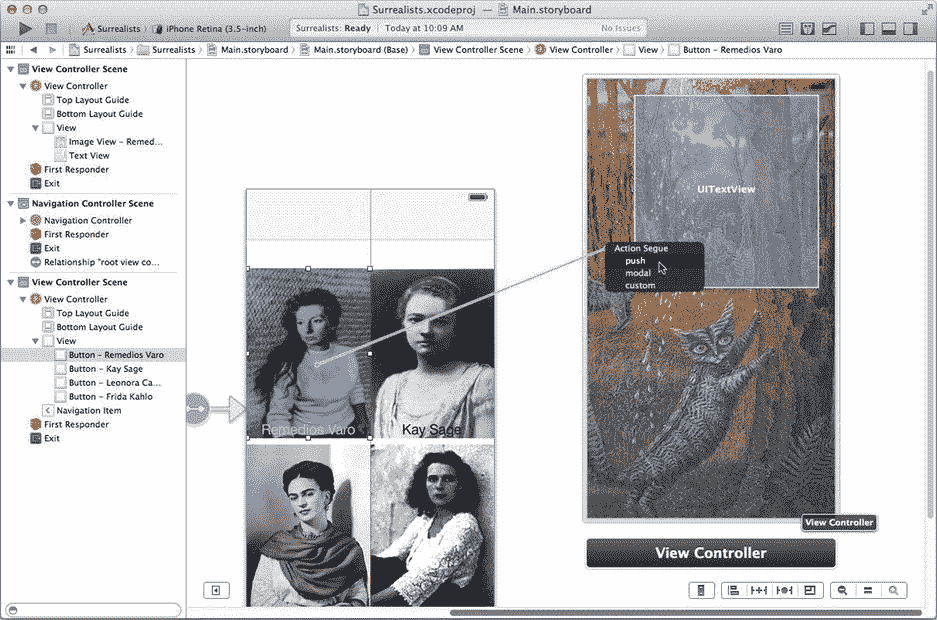

图 2-27. 创建 Segue

释放鼠标按钮时，会弹出一个菜单，显示可能的 segue 类型。选择 `push`（见图 2-27）。当用户点击 Remedios Varo 按钮时，你的应用将执行一个“推送”过渡（将新屏幕滑入视图），并呈现新的视图。

### 设置导航标题

初始视图控制器本身是由你一开始创建的导航控制器对象所管理的。导航控制器的工作是在导航栏下方呈现一系列视图。你已见过无数次的导航栏会显示当前屏幕的标题，并且可以选择性地提供一个返回按钮，让你能回到之前的屏幕。导航控制器负责处理所有这些细节。

当你向第二个屏幕添加一个推送（push）跳转时，第二个屏幕也归入了导航控制器的管理之下。顺便提一下，推送跳转——它只能与导航控制器配合使用——会将一个视图替换为另一个视图，并使原始视图成为新视图中返回按钮的目标。

为了让用户觉得有意义，你需要为每个屏幕设置标题。这会使导航栏清晰易懂。

在初始视图控制器中选中导航栏，并调出属性检查器。将导航栏的标题更改为 `Woman Surrealists`，并将返回按钮属性设置为 `Surrealists`。大多数在画布上带有标题的 Interface Builder 对象都可以通过双击标题直接进行编辑，如图 2-28 所示。或者，你也可以选中该对象，并在属性检查器中编辑其标题属性。设置可选的返回按钮属性，将为返回到此屏幕的屏幕上的返回按钮指定一个更简洁的标题。

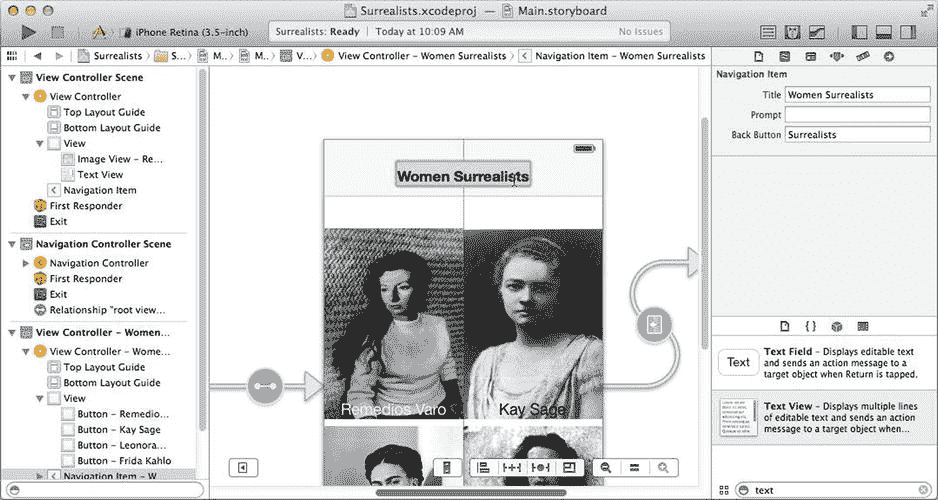

图 2-28. 编辑导航栏标题

最后，在你创建的第二个屏幕中选中导航栏，并将其标题更改为 `Remedios Varo`。你可能需要调整文本字段的大小或位置，以免被导航栏遮挡。

## 测试你的界面

现在，你的应用已经构建了足够多的部分，可以一睹其运行风采了！确保运行目标设置为其中一个 iPhone 模拟器，如图 2-29 所示。

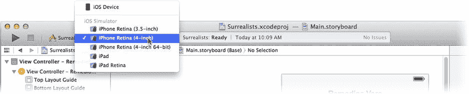

图 2-29. 选择运行目标

点击 `Run` 按钮。Xcode 将会构建你的应用，并在模拟器中启动它。如果由于某些意外原因，构建应用时出现问题，可以在问题导航器（`View` ➤ `Navigator` ➤ `Show Issue Navigator`）中找到描述这些问题的消息。

你的应用将出现在 iPhone 模拟器中，应该看起来像图 2-30 左侧所示。

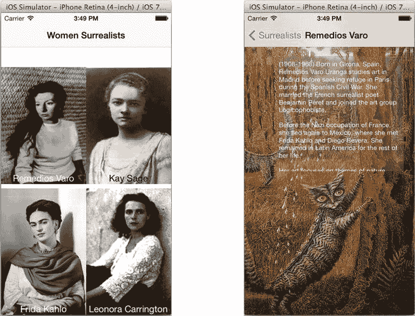

图 2-30. 你的应用的首次测试

点击左上角的按钮，第二个屏幕便会平滑地滑入视野。（如果按钮位置不理想，不用担心——你很快就会修复它。）通过鼠标拖动来滚动文本（请记住，鼠标相当于你模拟的手指）。点击返回按钮返回初始屏幕。你的应用具备了 iOS 应用的所有标准行为：触摸界面、标题栏、动画、导航，一切都如预期般完美运行。

## 完善你的应用

返回 Xcode 工作区窗口，并点击工具栏中的停止按钮来停止你的应用。通过重复（大部分）“添加新屏幕”部分中的步骤来完成你的应用。首先，添加另外三个视图控制器，如图 2-31 所示。

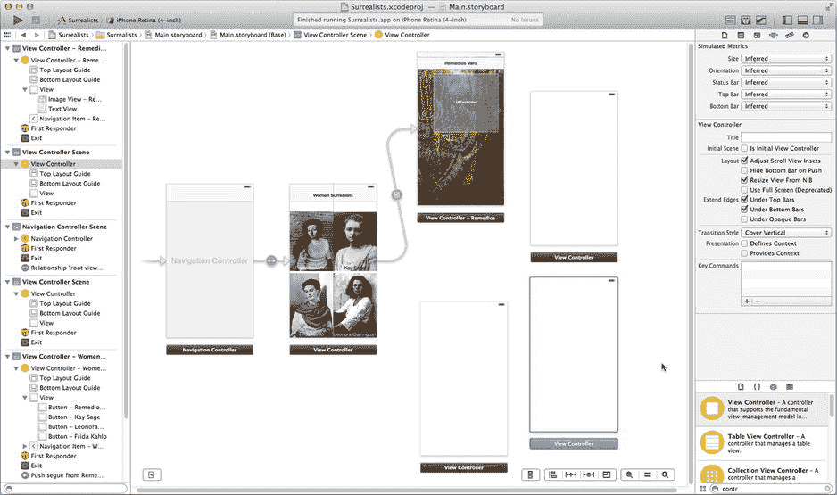

图 2-31. 添加剩余的视图控制器

在每个新的视图控制器中，添加一个图像视图对象，并将其图像资源名称设置为以下之一（按顺时针方向）：`KaySage2`、`LeonoraCarrington2` 和 `FridaKahlo2`。

你可以重复所有步骤来为三个新图像分别添加和自定义新的文本视图，或者你也可以复制已完成的工作来节省大量精力。按住 Option 键，将 `UITextView` 对象从 Remedios Varo 场景拖放到 Kay Sage 场景中，如图 2-32 所示。此操作可以复制一个对象。

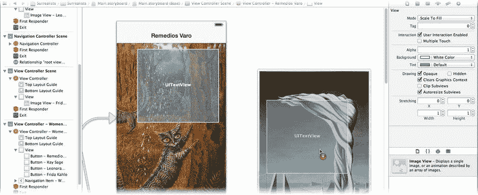

图 2-32. 复制文本视图对象

在 Interface Builder 中复制对象会创建一个具有原始对象所有属性的新对象。剩下唯一要做的就是将其定位到视图中并更改其文本。你可以在 `Surrealists (Resources)` 文件夹中找到其他三个屏幕的文本。当你处理 Frida Kahlo 的文本视图时，将文本颜色更改为 `black`，以便于阅读。

最后一步，是为每个按钮创建一个指向相应视图的推送跳转，并设置其导航栏的标题。完成后，你将得到一个看起来像图 2-33 那样的故事板。

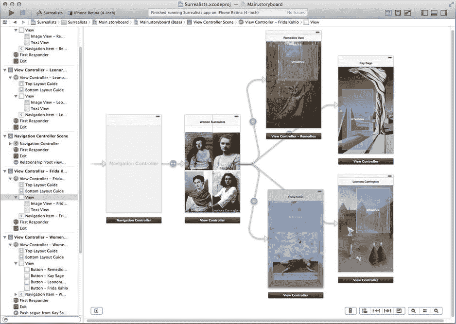

图 2-33. 完成的超现实主义应用故事板

## 调试你的应用

运行你的新应用。点击一个按钮来查看该艺术家的详细信息。浏览文本并使用导航栏返回初始屏幕。返回 Xcode。停止应用并将模拟器更改为 iPhone Retina（3.5 英寸），然后再次运行。是否感觉有些不对劲？

初始屏幕上的按钮存在奇怪的间隙，并且在 3.5 英寸的 iPhone 上会被截断。在其他场景中，图像和文本视图也会被裁剪，如图 2-34 所示。这是一个问题。程序员称之为 bug（缺陷）。

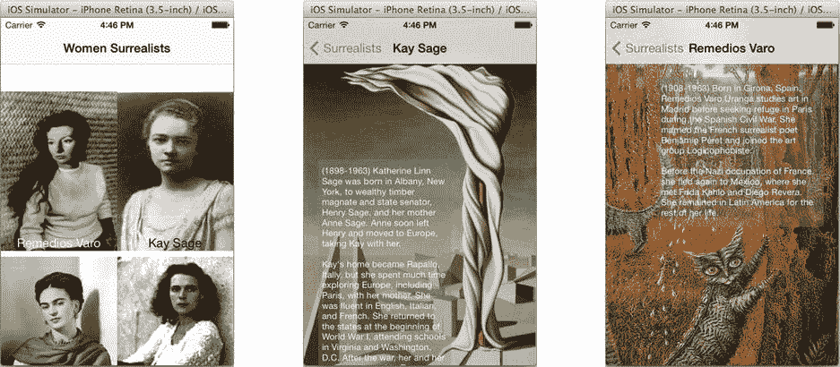

图 2-34. 超现实主义应用的初次测试

“Bug”通常用来描述计算机代码中的缺陷，但你的应用行为或操作中的任何缺陷都是 bug，你需要修复它。追踪和修复 bug 的过程称为调试。

> **注意**  
> “Bug”这个术语源于一只飞蛾在一台最早的数字计算机中死亡，导致其发生故障。我不是在开玩笑。格蕾丝·赫柏的维基百科页面上有一张那只飞蛾的照片（[`http://en.wikipedia.org/wiki/Grace_hopper`](http://en.wikipedia.org/wiki/Grace_hopper)）。

在这种情况下，问题涉及按钮如何针对不同设备进行大小调整或重新定位。不同型号的 iPhone 有不同的屏幕尺寸和分辨率。iOS 会调整屏幕视图的大小以适应其正在运行的型号，这可能会改变你在 Interface Builder 中看到的布局。

### 添加约束

当视图大小发生变化时，一个名为 `auto-layout` 的功能会重新定位其子视图。这些子视图根据一组约束进行重新定位。约束仅仅是关于某个对象的规则。以下是一些约束示例：

- 对象的高度必须至少为 40 像素
- 对象的底部边缘应距离其父视图底部边缘 20 像素
- 对象应水平居中

单个视图通常会有多个这样的约束。`iOS` 会评估所有约束，以确定应如何调整每个视图，从而满足所有约束。

您可以在 Interface Builder 中定义单个约束，或要求 `Xcode` 为您生成部分或全部约束。`Xcode` 根据您定位视图的方式以及视图与附近视图的关系来创建约束。通常，`Xcode` 的猜测正是您想要的。如果不是，您可以自行定义。

您的 `Surrealist` 应用需要约束，以便四位艺术家场景中的文本和图像能在不同设备上正确调整大小；并且您希望初始场景中的四个按钮能均匀地填满屏幕。先处理前者，因为这些是最简单的。

返回到 `Xcode` 和 `Main.storyboard` 文件。通过点击场景下方视图控制器对象停靠区来选择 `Kay Sage` 场景，如图 2-35 所示。在编辑器窗格的右下角，点击 `Resolve Auto Layout Issues` 按钮（中间带点的那个），并选择 `Reset to Suggested Constraints in View Controller` 项，如图 2-35 所示。

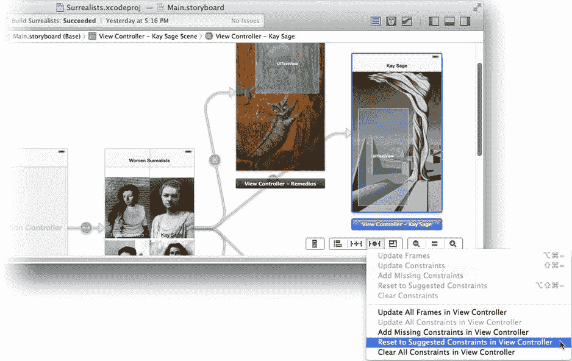

图 2-35. 使用建议的约束

`Xcode` 会分析场景中视图的布局，并向每个视图添加其推荐的约束。选择文本视图，Interface Builder 会显示现在附加到该视图的约束，如图 2-36 所示。`Xcode` 添加了垂直和水平约束，使文本视图与父视图的顶部、左侧和底部边缘保持一个合适的距离，以及一个决定其宽度的宽度约束。点击某个约束，即可在属性检查器中查看或编辑其属性，如图 2-36 右侧所示。

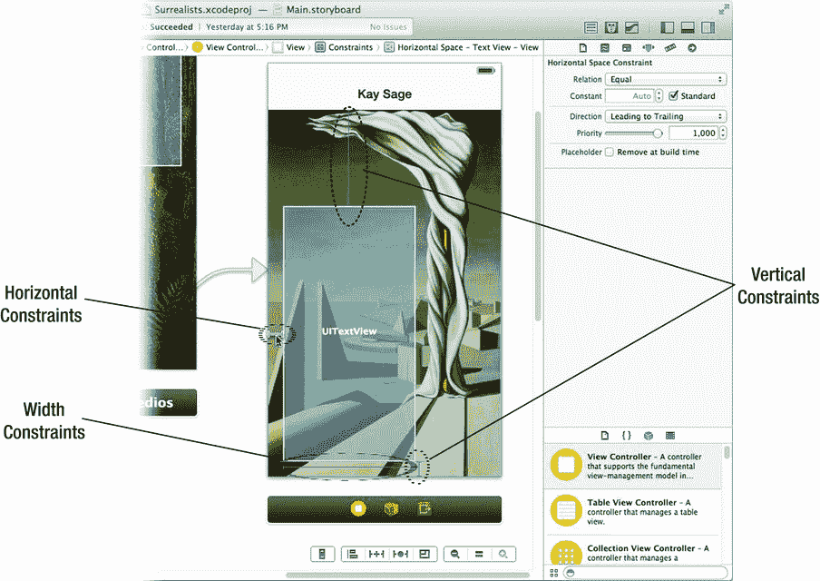

图 2-36. Xcode 的推荐约束

这组约束被称为“完整的”。总的来说，这四条规则明确地决定了文本视图的高度、宽度和位置。如果省略了其中一些约束，`iOS` 将使用视图的原始高度、宽度和/或位置。正如您所见，这可能导致视图重叠或超出其父视图边缘。

对其他三个场景重复此过程：选择场景的视图控制器，然后从 `Resolve Auto Layout Issues` 按钮中选择 `Reset to Suggested Constraints in View Controller` 项。

然而，初始场景中四个按钮的位置和大小并不符合 `iOS` 中按钮对象的典型尺寸或放置方式。因此，`Xcode` 的建议约束作用不大。您需要自行设计这些约束。思考您希望这些按钮具有怎样的尺寸和位置，然后制定出能够向 `iOS` 描述这一点的最简单规则集。以下是我想到的约束：

- 上面两个按钮的顶部边缘应位于导航栏的底部边缘。
- 下面两个按钮的底部边缘应位于父视图的底部边缘。
- 左边两个按钮的左侧边缘应位于父视图的左侧边缘。
- 右边两个按钮的右侧边缘应位于父视图的右侧边缘。
- 左侧按钮应与右侧按钮接触。
- 上方按钮应与下方按钮接触。
- 所有按钮应具有相同的高度和宽度。

> **注意：** 用约束描述视图的同一位置有多种方法，这些方法没有一个是错误的。例如，您可以为一个视图同时添加前缘和后缘约束。这将定义视图的水平位置和宽度。或者，您可以添加后缘约束和“水平居中”约束。这些也同样定义了视图的水平位置和宽度。请使用对您有意义的约束。

这组规则将定位并调整四个按钮的大小，使它们完全填满屏幕，形成四个大小相等的象限。您可以按照此处描述的方式将这些约束添加到 `Xcode` 中。从第一个约束开始。按住 Control 键并点击（或右键点击）`Remedios Varo` 按钮，然后向上拖拽到导航栏区域。松开鼠标按钮，选择 `Top Space to Top Layout Guide`，如图 2-37 所示。

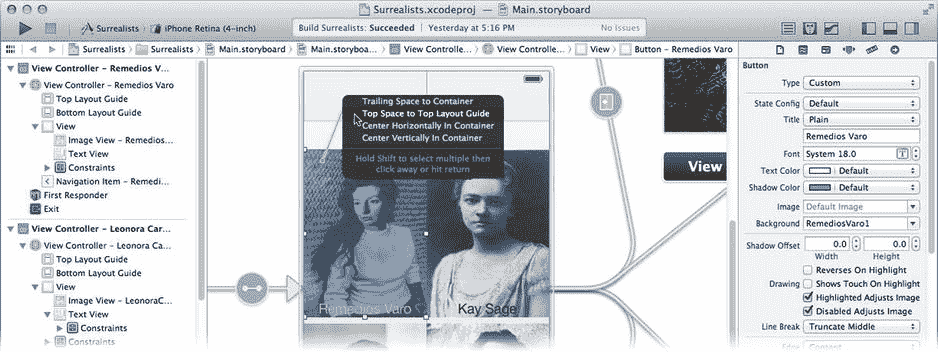

图 2-37. 为按钮添加垂直约束

现在您创建了一个约束，它告诉 `iOS` 将 `Remedios Varo` 按钮的顶部边缘放置在距离导航栏底部边缘一定距离的位置。但您不想要“一定距离”，而是希望它与导航栏接触。点击该约束以选中它，如图 2-38 所示，然后使用属性检查器将约束的值设置为 `0`。这个约束现在表示：按钮视图的顶部边缘与导航栏底部之间应没有距离。

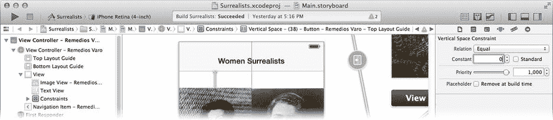

图 2-38. 编辑约束的属性

对 `Kay Sage` 按钮重复此操作。现在您已经建立了第一组约束。下一组约束的创建方式与第一组相同。按住 Control/右键点击 `Frida Kahlo` 按钮，向下拖拽，然后从菜单中选择 `Bottom Space To Bottom Layout` 项，如图 2-39 中间所示。这将设置视图底部边缘与其父视图底部边缘之间的间距。

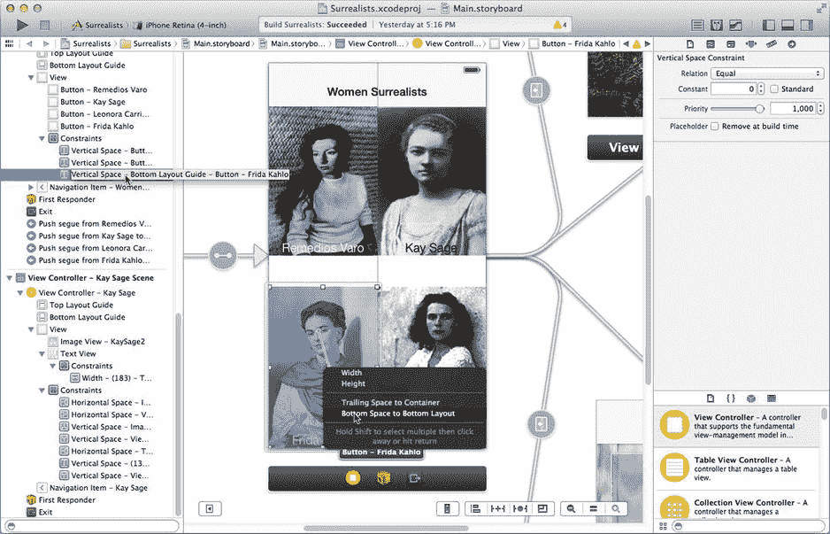

图 2-39. 设置底部边缘约束

对 `Leonora Carrington` 按钮重复此操作。零宽度约束很难选中，但您可以在对象大纲中选中它，如图 2-39 左侧所示。这些按钮已经位于父视图的底部，因此约束的值已经是 `0`（如图 2-39 右侧所示）。

继续添加约束，直到您定义了所有约束：

对两个左侧按钮：`control+click`/在按钮上右键，向左拖动，选择`Leading Space to Container`。对两个右侧按钮：`control+click`/在按钮上右键，向右拖动，选择`Trailing Space to Container`。对两个左侧按钮：`control+click`/在按钮上右键，拖动到其右侧的按钮上，选择`Horizontal Spacing`。确保约束的值为`0`，即左视图的右边缘应紧贴右视图的左边缘。对两个上方按钮：`control+click`/在按钮上右键，向下拖动到其下方的按钮上，选择`Horizontal Spacing`。两个按钮之间可能存在间隙，因此选中该约束，并在属性检查器中将其值设置为`0`。再次对两个上方按钮：`control+click`/在按钮上右键，向下拖动到其下方的按钮上，选择`Equal Height`。此约束表明上方按钮的高度应与下方按钮相同。

**提示**

你也可以只添加所需的约束，然后让 Xcode 使用 `Resolve Auto Layout Issues` 菜单中的 `Add Missing Constraints` 命令来填充其余约束。如果添加了足够多的约束，使得 Xcode 能推断出剩余部分，这将为你节省时间。

初始屏幕上的按钮约束现已完成。你刚创建的这组约束的唯一解必须将四个按钮定位，使它们大小相同并填满屏幕。然而，按钮当前的尺寸和位置并不符合这些约束，Xcode 会通过调整警告（那些橙色的小数字）来提示，如图 2-40 所示。

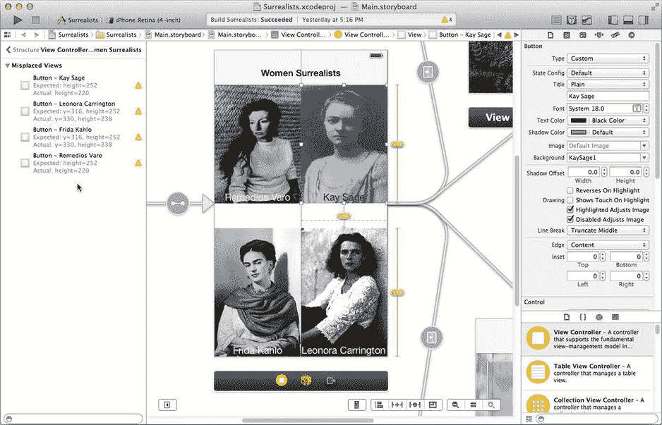

图 2-40. 带有调整警告的已完成按钮约束

这些警告提示你，当应用运行时，iOS 会按显示的量调整或移动视图。如果你愿意，可以忽略这些警告。但如果你希望 Interface Builder 中的布局看起来更接近应用运行时的界面，请调整视图的位置使其符合约束。

Xcode 可以帮你做到这一点。你可以点击大纲中视图控制器组旁边的警告箭头。它会滑开，显示该控制器中视图的警告（如图 2-40 左侧所示）。在这里，你可以逐一检查并解决每个问题。或者，从 `Resolve Auto Layout Issues` 按钮中选择 `Update All Frames in View Controller` 选项，如图 2-41 右下角所示。Xcode 会调整视图的尺寸和位置，使 Interface Builder 中的布局符合约束。

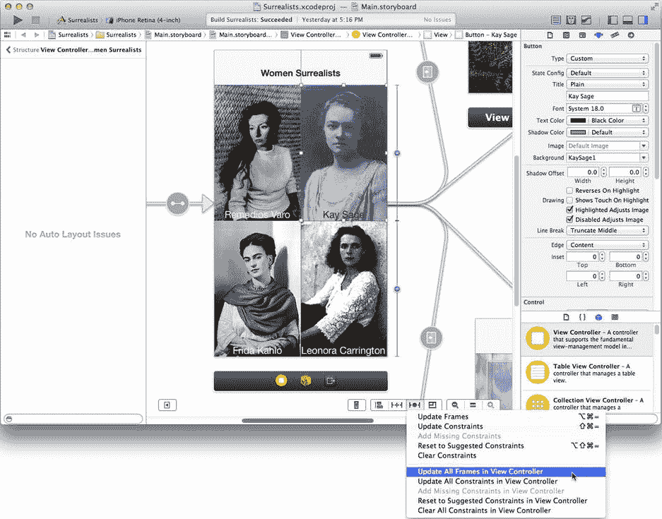

图 2-41. 调整视图使其符合约束

**注意**

如果存在缺失或冲突的约束，这些也会（以红色）显示在对象大纲中。

运行你的应用，如图 2-42 所示。将这些屏幕与图 2-34 中的屏幕进行比较。

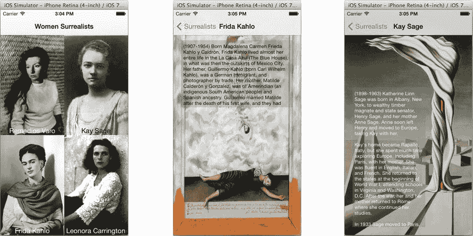

图 2-42. 正确定位的按钮

### 测试你的应用

你的约束方案能适用于所有设备吗？这是个非常好的问题。作为应用开发的一部分，你需要彻底测试你的应用，确保它在各种情况下都能按预期工作。应用开发的这一阶段与设计和工程阶段同等重要。

首先，在不同设备上测试你的应用。iOS 模拟器可以模拟所有可用的设备形态。选择不同的硬件，如图 2-43 所示，来测试你的应用在其他配置下的运行情况。某些测试必须在真实硬件上进行，你将在后续章节中探讨这一点。

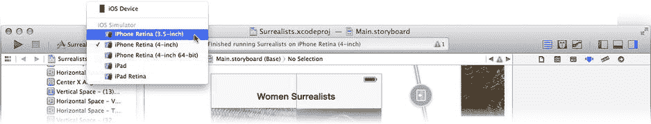

图 2-43. 测试不同的硬件配置

这是一个非常简单的应用，但在宣布完成之前，仍有许多事项需要测试：

*   确保所有屏幕的布局在不同设备上看起来美观
*   确认每个按钮都能正确跳转到相应屏幕
*   测试文本是否正确且可以滚动
*   检查所有标题

一切都检查通过了吗？那么你的第一个 iOS 应用就成功啦！

## 总结

给自己鼓掌吧；本章你已涉猎甚广。你学会了在 Xcode 中导航，向项目添加资源，并使用 Interface Builder 创建、配置和连接界面中的对象。而且，这一切都是在没有编写一行计算机代码的情况下完成的。

本章的重点并非避免编写 Objective-C 代码。毕竟，我们是计算机程序员。如果不写代码，我们凭什么拿薪水？重点在于展示通过使用 Interface Builder 和 iOS 对象，你能添加多少功能，又能避免多少繁琐的细节。

你的编码手指是不是已经痒了？在下一章中，你将编写一个更传统的应用——一个包含代码的应用。

