# 3. 转动网络

**摘要**

活动一下你的编码手指。本章将向你介绍 iOS 应用开发的一些核心技能，以及大量的 Objective-C 代码。你在本章创建的应用以及采取的步骤，非常典型地反映了 iOS 应用的构建方式。从这个角度看，这将是你第一个“真正的”iOS 应用。

你已经学会了使用 Interface Builder 向应用添加库对象、自定义它们以及连接它们。在本章中，你还将学习：

*   自定义 Objective-C 类
*   使用 Objective-C 为自定义类添加输出口和操作
*   使用 Interface Builder 将这些输出口连接到对象
*   使用 Interface Builder 将对象连接到自定义操作
*   通过将库对象连接到委托来改变其行为

你要构建的是一个 URL 缩短应用。该应用依赖于众多可用的 URL 缩短服务之一。这些服务会获取任意长度的 URL 并生成一个更短的 URL，后者在阅读、电话口述和推文中使用起来要方便得多。URL 缩短服务通过记住原始 URL 来工作。当世界上任何人尝试加载短 URL 的网页时，该服务会返回一个重定向响应，将浏览器导向原始 URL。

为了制作这个应用，你将学习如何在其中嵌入一个网页浏览器——这是一个有许多应用场景的技巧。它还将向你展示如何以编程方式从你的应用发送和接收 HTTP 请求，这是创建使用互联网服务的应用的有用工具。

**注意**

对计算机程序员来说，“以编程方式”一词意味着“通过编写计算机代码”。它表示你通过用某种计算机语言（如 Objective-C）编写指令来完成某事，而非通过其他方式。例如，Interface Builder 允许你通过在对象之间拖拽一条线来连接两个对象。你也可以编写 Objective-C 代码来连接同样的两个对象。如果你使用了后一种方法，就可以说你是“以编程方式设置连接”的。


### 设计

本应用需要一些基础元素。用户需要一个输入和编辑 URL 的字段。如果能内置一个网页浏览器，让用户能查看该 URL 对应的页面，并通过点击链接跳转到其他 URL，那就更好了。还需要一个按钮，用于将长 URL 转换为短 URL，以及一个显示缩短后 URL 的区域。

这个设计并不特别复杂，所有内容应该能轻松地放在一个屏幕上，如图 3-1 的草图所示。让我们再添加一个额外功能：一个用于将缩短后的 URL 复制到 iOS 剪贴板的按钮。这样用户就能方便地将缩短后的 URL 粘贴到其他应用中。

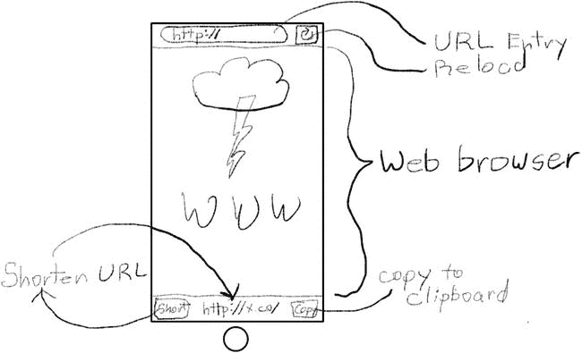

图 3-1. Shorty 应用草图

你的应用将在所有 iOS 设备上运行，并同时支持竖屏和横屏方向。既然已经有了基本设计，是时候启动 Xcode 开始动手了。

### 创建项目

与任何应用一样，首先在 Xcode 中创建一个新项目。这是一个单屏幕应用，因此最明显的选择是`Single View Application`模板。

填写项目详细信息，如图 3-2 所示。将项目命名为`Shorty`，将类前缀设置为`SU`（代表“Short URL”），并将设备设置为`Universal`。

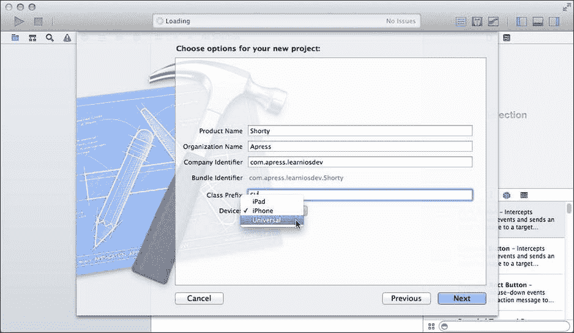

图 3-2. Shorty 项目详细信息

点击“Next”按钮。选择一个位置保存你的新项目，然后点击“Save”。

## 构建网页浏览器

首先构建应用的网页浏览器部分。这将包括一个文本字段（用户在此输入想要访问/转换的 URL）和一个用于显示该页面的网页视图。我们再添加一个刷新按钮，用于重新加载当前 URL 的页面。

在导航器中选中`Main_iPhone.storyboard`文件。首先为 iPhone 开发应用。稍后在本章中，你将创建 iPad 版本。

在对象库中，找到`Navigation Bar`对象并将其拖入视图中，靠近顶部，如图 3-3 所示。导航栏对象通常由导航控制器创建，用于显示标题、返回按钮等。你在 Surrealist 应用中已经见过。不过，在这里，你将单独使用它。

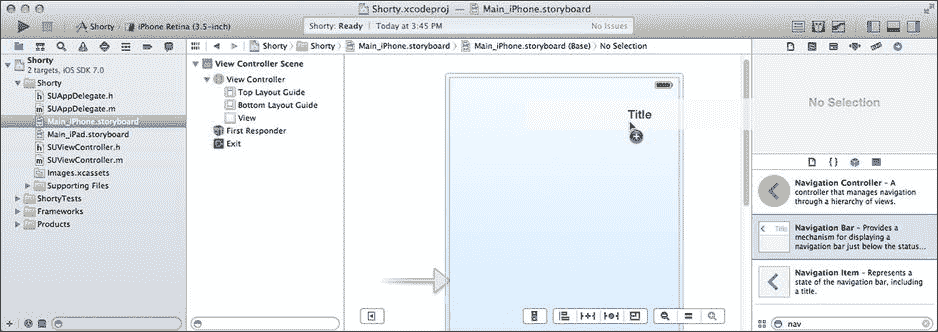

图 3-3. 添加导航栏

将导航栏定位为视图的完整宽度。按住 Control 键并点击/右键点击导航栏，然后向上拖动，直到出现`Top Layout Guide`，如图 3-4 所示。松开鼠标并选择“Vertical Space”约束。

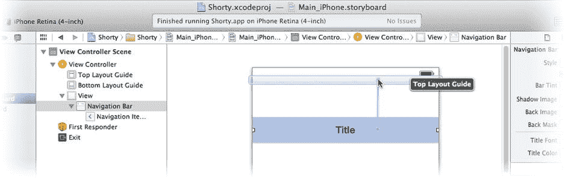

图 3-4. 为导航栏添加垂直约束

就像你在上一章中所做的那样，选中该约束并将其值设置为 0，如图 3-5 所示。这指示 iOS 将导航栏定位在屏幕顶部的推荐位置，即系统状态栏的正下方。

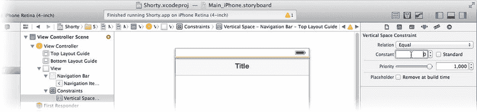

图 3-5. 将工具栏约束到顶部布局指南

在库中找到`Web View`对象，并将一个拖入屏幕的下半部分。移动并调整网页视图的大小，使其恰好填满视图的其余部分，从导航栏到屏幕底部，如图 3-6 所示。

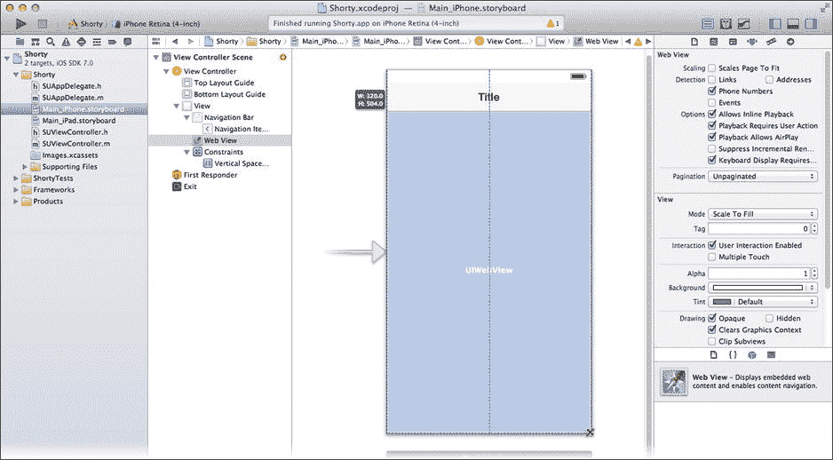

图 3-6. 添加网页视图

选择视图控制器（通过点击视图下方的对象停靠区或大纲中的`View Controller`对象），然后从“Resolve Auto Layout Issues”按钮中选择“Add Missing Constraints in View Controller”。Interface Builder 会使用你已建立的那一个约束，并填充所有设备上建立此布局所需的任何其他约束。

在库中找到`Bar Button Item`，并将一个拖入导航栏的右侧。栏按钮项是专门设计用于放置在导航栏或工具栏中的按钮对象。放置后，选中它。切换到属性检查器，并将新按钮的 Identifier 更改为`Refresh`（参见图 3-7）。按钮的图标将变为一个环形箭头。

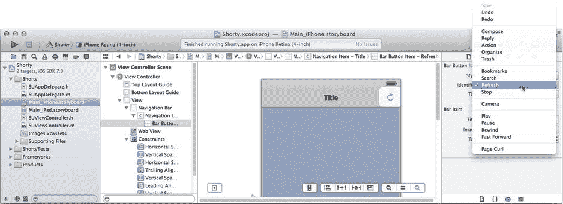

图 3-7. 在导航栏中创建刷新按钮

在库中找到`Text Field`（不是`Text View`！）对象，并将一个拖入导航栏的中间。此对象会替换掉通常显示的默认标题。抓住右侧或左侧的调整大小手柄，并拉伸该字段，使其填满导航栏中的大部分空闲空间，如图 3-8 所示。

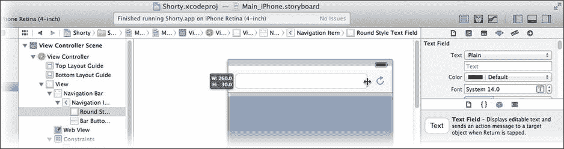

图 3-8. 调整 URL 字段大小

用户将在此字段中输入他们的 URL。对其进行配置，使其针对输入和编辑 URL 进行优化。选择文本字段对象，并使用属性检查器，更改以下属性：

*   将 Text 设置为 `http://`
*   将 Placeholder 设置为 `http://`
*   将 Clear Button 更改为 `Appears while editing`
*   将 Correction 更改为 `No`
*   将 Keyboard 更改为 `URL`
*   将 Return Key 更改为 `Go`

这些设置将字段的初始内容设为 `http://`（这样用户就不必输入了），并且如果他们清空字段，一个虚影般的 `http://` 将提示他们输入网页 URL。关闭拼写纠正是合适的（URL 不是口语语言）。当键盘出现时，它将针对 URL 输入进行优化，并且键盘上的回车键将显示“Go”字样，表示当他们点击时，将加载该 URL。

你已经创建并布局了网页浏览器的所有视觉元素。现在需要编写一点代码来连接这些部件，并使它们协同工作。

## 编写网页浏览器的代码

在项目导航器中选中`SUViewController.h`文件（参见图 3-9）。`SUViewController.h`和`SUViewController.m`文件共同定义了`SUViewController`类。这是一个你创建的定制类——嗯，严格来说，它是由项目模板为你创建的，但你可以把它归功于自己。我不会告诉别人的。你的`SUViewController`对象的任务是为它所连接的视图对象添加功能并管理它们的交互。你的应用只有一个视图，所以你只需要一个视图控制器。

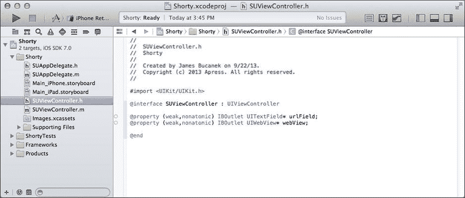

图 3-9. 向`SUViewController.h`添加属性

不同的对象在你的应用中扮演不同的角色。这些角色在第 8 章中有解释。当你向应用添加代码时，你需要决定将代码添加到哪个类中。这个应用非常简单；你将把所有定制内容添加到`SUViewController`类中。

**提示：** 对类（class）和对象（object）这两个术语感到困惑？请阅读第 6 章的第一部分以获得解释。

`SUViewController`类是`UIViewController`类的一个子类，后者由 Cocoa Touch 框架定义。这意味着你的`SUViewController`类继承了`UIViewController`的所有特性和行为——这很多，`UIViewController`相当复杂。即使你什么都不做，你的`SUViewController`对象的行为也会与任何其他`UIViewController`对象完全相同。

乐趣在于编辑`SUViewController.h`和`SUViewController.m`，以添加新功能或更改其继承的行为。


### 为 `SUViewController` 添加输出口

首先，为 `SUViewController` 添加两个新属性。属性定义了与对象关联的值。其最简单的形式仅仅是创建一个该对象能记住的新变量。请将这些属性添加到 `SUViewController.h` 中：

```
@property (weak,nonatomic) IBOutlet UITextField *urlField;
@property (weak,nonatomic) IBOutlet UIWebView *webView;
```

完成后，你的类定义应类似于图 3-9 所示。那么，这一切都意味着什么？让我们详细解析这些声明：

*   `@property` 是告诉 Objective-C 编译器这是一个属性声明的关键字。
*   `(weak,nonatomic)` 是可选的属性特性。它们会改变属性的某些特征。`weak` 表示该属性不会持有它连接的对象（参见第 21 章）。`nonatomic` 通过放宽与多任务相关的某些规则，使访问此属性更高效（参见第 24 章）。
*   `IBOutlet` 是一个非常重要的关键字，它使此属性在 Interface Builder 中显示为输出口。
*   `UITextField*` / `UIWebView*` 是属性的类型。在此例中，它表示该属性存储的对象的类。星号表示此属性是对对象的引用，而不是对象本身。在 Objective-C 中，你只能存储对对象的引用。
*   `urlField` / `webBrowser` 是属性的名称。

通过将这些属性添加到 `SUViewController`，你使一个 `SUViewController` 对象能够直接连接到一个文本字段对象（通过其 `urlField` 属性）和一个网页视图对象（通过其 `webBrowser` 属性）。

你已经定义了与另外两个对象连接的潜力，但尚未进行连接。为此，你将使用 Interface Builder。

### 连接自定义输出口

在项目导航器中点击 `Main_iPhone.storyboard` 文件。在大纲或视图下方的停靠区域中找到并选中 `View Controller` 对象，两者均在图 3-10 中显示。

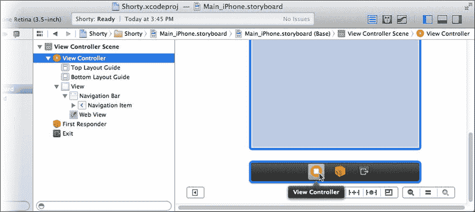

图 3-10. 为场景选择视图控制器对象

在大多数情况下，iOS 中的屏幕最初只是一个单一的视图控制器对象。当该视图需要在屏幕上显示时，视图控制器会从一个 Interface Builder 文件中加载其视图对象——该文件可以是 `.storyboard` 文件中的一个场景，也可以是一个 `.xib` 文件。在此应用中，你的 `SUViewController` 对象将从 `Main_iPhone.storyboard` 文件加载 `SUViewController` 场景，并创建其中的所有对象和连接。对象与视图控制器之间的连接将在新对象与现有控制器对象之间建立。一旦场景文件加载完毕，控制器中已连接的属性便会引用由 Interface Builder 文件创建的对象。

**注意：** 如果暂时不理解这个概念，不必担心。Interface Builder 非常优雅且简单，但大多数人需要一段时间才能完全理解其工作原理。请查阅第 15 章以深入了解 Interface Builder 如何施展其魔力。

你已经创建了对象，现在将把它们连接起来。显示连接检查器。在其中，你将看到刚刚添加到 `SUViewController.h` 的 `urlField` 和 `webView` 属性。这些属性之所以出现在 Interface Builder 中，是因为你在 `@property` 声明中包含了 `IBOutlet` 关键字。

拖动 `urlField` 右侧的连接圆点，并将其连接到导航栏中的文本字段对象，如图 3-11 所示。现在，当 `SUViewController` 场景被加载时，你的 `SUViewController` 对象的 `urlField` 属性将引用（指向）你界面中的文本字段对象。很酷，不是吗？

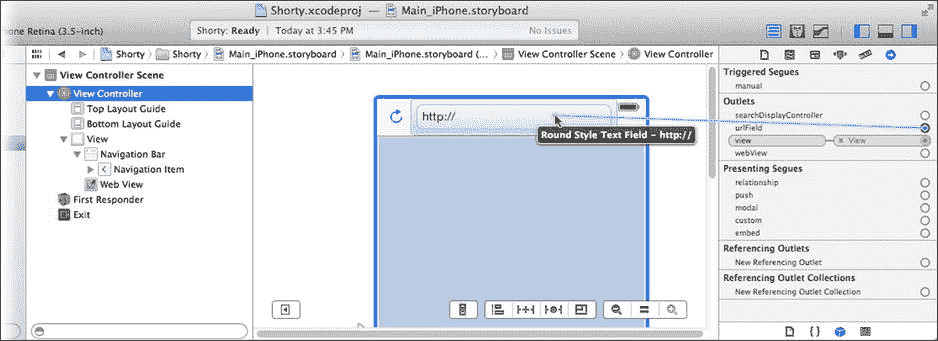

图 3-11. 连接所有者对象输出口

另一种设置连接的便捷方法是按住 Control 键并拖动，或按住右键并拖动，从具有连接的对象拖到你想要连接的对象。按住 Control 键，点击 `View Controller` 对象并将其连接到网页视图对象，如图 3-12 所示。

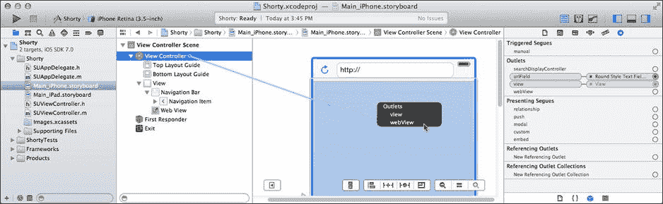

图 3-12. 连接网页视图输出口

松开鼠标按钮时，会弹出一个菜单，询问你要设置哪个输出口。选择 `webView`。


### 为 SUViewController 添加操作

那么，你为什么要做所有这些（创建出口属性并在 Interface Builder 中连接它们）？你的控制器对象需要获取用户输入的 URL 值，并将其传达给 Web 视图对象，以便 Web 视图知道要加载哪个 URL。你的 `SUViewController` 就像一个联络人或管理器，从一个对象（文本字段）获取数据，并将任务分配给另一个对象（Web 视图）。现在你明白为什么它被称为控制器了吧？

这是一个简单的任务，但必须有相应的代码来实现它。在项目导航器中选择 `SUViewController.m` 文件，并切换到助理编辑器视图，如图 3-13 所示。

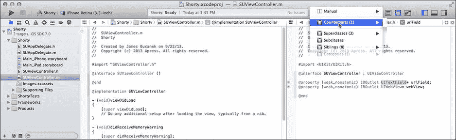

图 3-13. `SUViewController.m` 和 `SUViewController.h` 的助理视图

助理编辑器视图显示了你的 `SUViewController` 类的两个方面。左侧是它的 `@implementation`（在 `.m` 文件中），右侧是它的 `@interface`（在 `.h` 文件中）。类的接口描述了对象做什么，而其实现定义了它是如何做的。

**提示：** 如果助理编辑器的右侧没有显示 `SUViewController.h` 文件，请从编辑窗格上方的导航菜单中选择 **配对文件**，如图 3-13 所示。

你编写的用于实现功能的代码放在 `.m`（实现）文件中，你在这里为每个任务指定一个方法名称。然后在 `.h`（接口）文件中，你声明那些其他对象需要使用你的对象的方法和属性的名称。这就是对象封装或隐藏其内部实现细节的方式。这使得它们更易于使用，就像一个复杂的设备（如 iPod）将工作原理的细节隐藏在易用的界面背后一样。整个 iOS 都是这样编写的。事实上，Cocoa Touch 软件开发工具包（SDK）大部分是苹果为让 iOS 运行而编写的 `.h` 文件。苹果提供了 `.h` 文件，因此你知道如何使用 iOS 中的任何对象，而 `.m` 文件（包含实际代码的部分）则被锁藏在库比蒂诺。

在 `SUViewController.m` 文件中，你会看到已经存在两个方法（`-viewDidLoad` 和 `-didReceiveMemoryWarning`）。在这两个方法和 `@end` 语句之间，添加这个新方法：

```
- (IBAction)loadLocation:(id)sender

{

NSString *urlText = self.urlField.text;

if (![urlText hasPrefix:@"http:"] && ![urlText hasPrefix:@"https:"]) {

if (![urlText hasPrefix:@"//"])

urlText = [@"//" stringByAppendingString:urlText];

urlText = [@"http:" stringByAppendingString:urlText];

}

NSURL *url = [NSURL URLWithString:urlText];

[self.webView loadRequest:[NSURLRequest requestWithURL:url]];

}
```

这个方法完成一个简单的任务：加载用户输入的 URL 对应的网页。这需要三个基本步骤：

- 获取用户在文本字段中输入的字符串
- 将该字符串转换为一个 URL 对象
- 请求 Web 视图对象加载该 URL 的页面

以下是这段代码的分解说明。

```
NSString *urlText = self.urlField.text;
```

第一行声明了一个名为 `urlText` 的新字符串对象变量，并将其赋值为该对象的 `urlField` 属性的 `text` 属性值。`self` 关键字指的是这个对象（`SUViewController`）。`urlField` 属性是你刚刚添加到这个类中的。你的 `urlField` 引用了一个 `UITextField` 对象，而 `UITextField` 对象有一个 `text` 属性，其中包含了当前字段中的字符——可以是用户输入的，也可以是你在程序中设置的。（看，我又用了“程序中”这个词。）

**提示：** 要查看任何类或常量的文档，请按住 Option 键并单击（快速查看）或双击（完整文档）其名称。要查看 `UITextField` 类的属性和方法，请按住 Option 键并双击 `.h` 文件中的词 `UITextField`。

你任务的第一部分已经完成；你使用定义并连接的 `urlField` 属性检索了 URL 的文本。接下来的几行可能看起来有点奇怪。

```
if (![urlText hasPrefix:@"http:"] && ![urlText hasPrefix:@"https:"]) {

if (![urlText hasPrefix:@"//"])

urlText = [@"//" stringByAppendingString:urlText];

urlText = [@"http:" stringByAppendingString:urlText];

}
```

如果你熟悉 Objective-C，请仔细看看这段代码。它对你的应用来说并不关键；你可以省略它，你的应用仍然可以工作。不过，它确实为你的用户提供了一些便利。它检查用户输入的字符串是否以 `http://` 或 `https://` 开头（这是网页的标准协议）。如果这些标准 URL 元素缺失，这段代码会自动插入一个。

计算机往往非常刻板，但你想让你的应用更加宽容和友好。上述代码允许用户只输入 `www.apple.com`（例如），而不是正确的 `http://www.apple.com`，页面仍然可以加载。这有道理吗？我们继续。

面向对象编程的核心在于将事物的复杂性封装在对象中。虽然字符串对象可以表示 URL 的字符，但它仍然只是一个字符串（字符数组）。大多数处理 URL 的方法都期望一个 URL 对象。在 Cocoa Touch 中，URL 对象的类是 `NSURL`。你如何将从文本字段中得到的 `NSString` 对象转换为可以与 Web 视图一起使用的 `NSURL` 对象？我想你正想问这个问题。

```
NSURL *url = [NSURL URLWithString:urlText];
```

这行代码要求 `NSURL` 类根据一个字符串对象创建一个新的 URL 对象。你传递给 `+URLWithString` 方法的字符串对象是你第一行代码中得到的 `urlText` 引用。新 URL 对象的引用被返回并存储在新建的 `url` 变量中。正如你所看到的，将字符串对象转换为 URL 对象非常容易，也有方法可以实现反向转换，你将在本章后面用到它们。

完成第二步后，最后要做的就是在这个 URL 对应的网页显示在 Web 视图中。这可以通过你方法中的最后一行代码实现：

```
[self.webView loadRequest:[NSURLRequest requestWithURL:url]];
```

`self.webView` 是你之前创建的 `webView` 属性，它连接到屏幕上的 Web 视图对象。你向该对象发送一条 `-loadRequest:` 消息来加载页面。然而，事实证明，Web 视图需要一个 URL 请求（`NSURLRequest`）对象，而不仅仅是一个简单的 URL 对象。URL 请求不仅代表一个 URL，还描述了该 URL 应如何通过网络传输。对于你的目的来说，一个普通的 HTTP GET 请求就足够了，而表达式 `[NSURLRequest requestWithURL:url]` 要求 `NSURLRequest` 类根据给定的 URL 创建一个简单的 URL 请求，然后你将其传递给 `-loadRequest:`。剩下的工作就由 Web 视图来完成。


### 设置操作连接

让我们回顾一下到目前为止你所完成的工作。你已经：

*   创建了一个用户可输入 URL 的文本字段对象
*   创建了一个将显示该 URL 网页的 web 视图对象
*   向你的 `SUViewController` 类添加了两个输出口（属性）
*   将文本字段和 web 视图对象连接到这些属性
*   编写了一个 `-loadLocation:` 方法，该方法获取文本视图中的 URL 并将其加载到 web 视图中

还缺少什么？问题是“`-loadLocation:` 方法是如何被调用的？”这是一个非常重要的问题，目前答案是“从未被调用”。下一步，也是最后一步，是将 `-loadLocation:` 方法连接到某个事物上，使其能够运行并加载网页。

首先在 `SUViewController` 的接口中声明 `-loadLocation:` 方法。将下面这一行添加到你的 `SUViewController.h` 文件中，放在 `@end` 语句之前：

`- (IBAction)loadLocation:(id)sender;`

完成后，你的文件应该看起来像图 3-14 中那样。这个声明告诉外界——准确地说，是你的应用中的其他对象——`SUViewController` 有一个可以加载网页的方法。`IBAction` 关键字告诉 Interface Builder 这是一个可以连接到对象的方法，就像 `IBOutlet` 关键字告诉 Interface Builder 该属性是一个可连接的输出口一样。在你的界面中，可以连接到对象（如按钮和文本字段）的方法被称为操作。

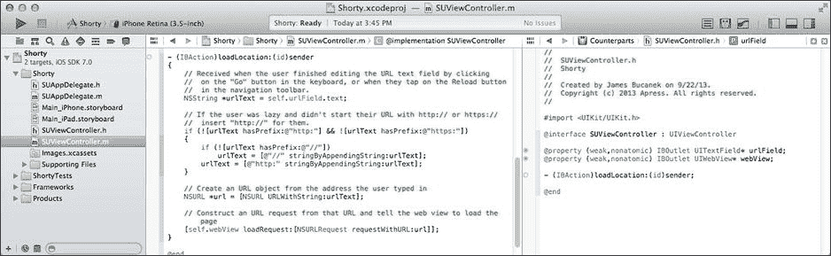

图 3-14. 完成的 `-loadLocation:` 操作

再次点击 `Main_iPhone.storyboard` 文件。选择文本字段对象并切换到连接检查器。向下滚动直到在“发送事件”部分找到 `Did End On Exit`。将连接圆圈拖到视图控制器对象并释放鼠标，如图 3-15 所示。将出现一个弹出菜单询问你希望将此事件连接到哪个操作；选择 `-loadLocation:`（目前是唯一的操作）。

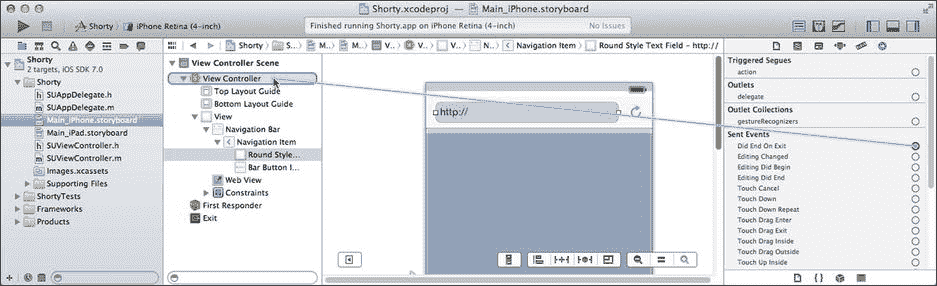

图 3-15. 设置 `Did End On Exit` 操作连接

你还希望在用户点击刷新按钮时加载网页，因此将刷新按钮连接到同一个操作。刷新按钮比文本字段简单，只发送一种事件（“我被点击了”）。使用 Interface Builder 的快捷方式进行连接。按住 Control 键，点击刷新按钮，将连接拖到视图控制器对象。松开鼠标按钮并选择 `-loadLocation:` 操作，如图 3-16 所示。

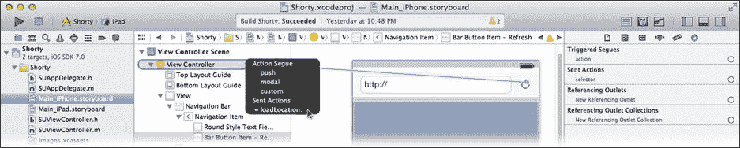

图 3-16. 设置刷新按钮的操作

### 测试网页浏览器

你兴奋吗？你应该感到兴奋。你刚刚为 iOS 编写了一个网页浏览器应用！确保构建目标设置为 iPhone 模拟器（见图 3-17），然后点击“运行”按钮。

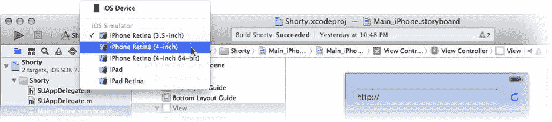

图 3-17. 设置 iPhone 模拟器目标

你的应用将在 iPhone 模拟器中构建并启动，如图 3-18 左侧所示。点击文本字段，会出现一个针对 URL 优化的键盘。输入一个 URL（在本例中我使用 `www.apple.com`），然后点击“前往”按钮。键盘收回，苹果公司的主页出现在 web 视图中。这真是太棒了。

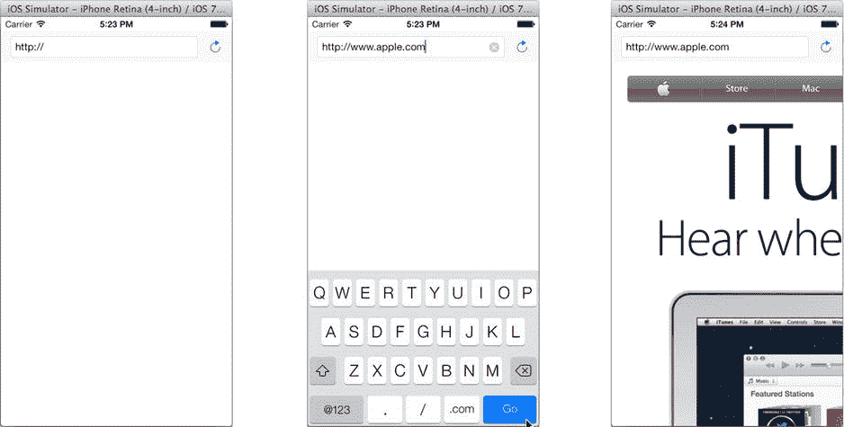

图 3-18. 测试你的网页浏览器

那么它是如何工作的呢？文本字段对象根据其发生的事件会触发各种事件。你将 `Did End On Exit` 事件连接到了你的 `-loadLocation:` 操作。当用户通过点击键盘中的操作按钮（前往）来“结束”编辑时，该事件会被发送。当你运行应用并点击“前往”时，文本字段触发了它的 `Did End On Exit` 事件，该事件向你的 `SUViewController` 对象发送了 `-loadLocation:` 消息。你的方法获取了用户输入的 URL，并告诉 web 视图加载它。瞧！网页出现了。

注意

iOS 模拟器使用你电脑的网络连接来模拟设备的 Wi-Fi 或蜂窝数据连接。如果你在荒岛上阅读本章，你的应用可能无法工作。

### 调试 Web 视图

到目前为止你所开发的内容相当令人印象深刻。继续，试试任何网页，我等你。只有两件事让我困扰。首先，当你点击页面中的链接时，文本字段中的 URL 不会改变。其次，网页内容大得离谱。

第二个问题很容易解决。退出模拟器，或者切换回 Xcode 并点击工具栏中的“停止”按钮。在 Interface Builder 中选择 web 视图对象并切换到属性检查器，如图 3-19 所示。找到并勾选“缩放页面以适配”选项。现在，当 web 视图加载页面时，它会缩放页面以便你能看到全部内容。

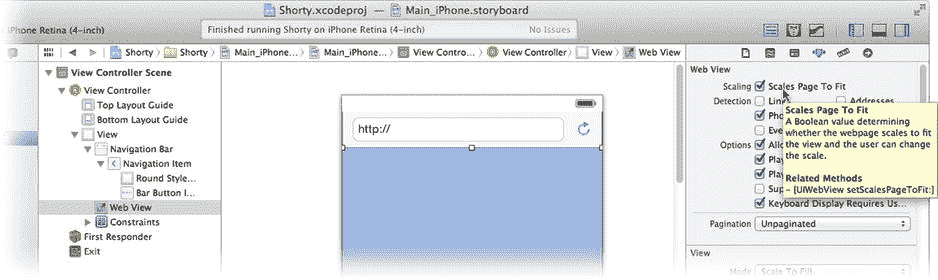

图 3-19. 设置“缩放页面以适配”属性

第一个问题解决起来有点棘手，需要编写更多代码。我们将在为你的应用添加其余功能时解决这个问题。


