# 添加 URL 缩短功能

现在，你已经拥有一个可以输入 URL 并在网页浏览器中浏览该 URL 的应用。下一步，也是这个应用的核心目的，是将该页面的长 URL 转换为短 URL。

为此，你需要在 Interface Builder 中创建并布局新的可视化对象，在你的控制器类中创建 Outlet 和 Action，并将这些 Outlet 和 Action 连接到可视化对象，就像你在本章第一部分所做的那样。如果你还没猜到，这就是应用开发的基本工作流程：设计界面，编写代码，然后将两者连接起来。

首先，填充剩余的界面部分。编辑 `Main_iPhone.storyboard`，选中网页视图对象，抓住其底部调整大小的手柄，向上拖动，为屏幕底部的一些新视图对象腾出空间，如图 3-20 所示。选中视图下方的垂直约束（同样如图 3-17 所示）并将其删除。你不再希望网页视图的底部边缘与父视图的底部边缘对齐；现在你希望它紧贴工具栏视图，你马上就会添加这个工具栏。

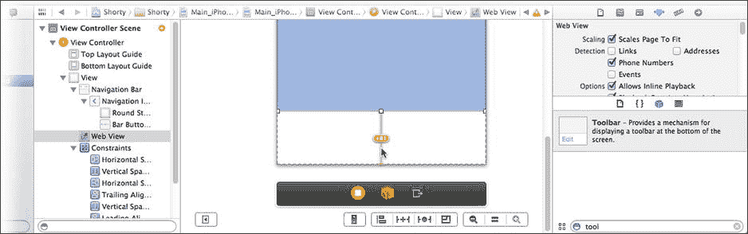

图 3-20. 为新视图腾出空间

在库中找到 `Toolbar` 对象（注意不是 `Navigation Bar` 对象，它们看起来很相似）并将其拖入视图中，如图 3-21 所示。把它放在视图底部，使其紧密贴合。

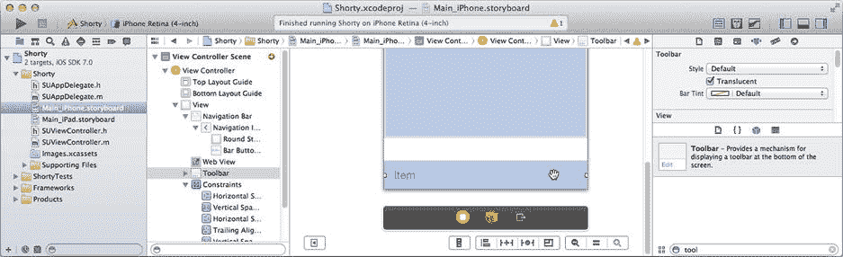

图 3-21. 添加一个工具栏

在库中找到 `Bar Button Item`，并向工具栏添加工具栏按钮对象，如图 3-22 所示，直到你有三个按钮。

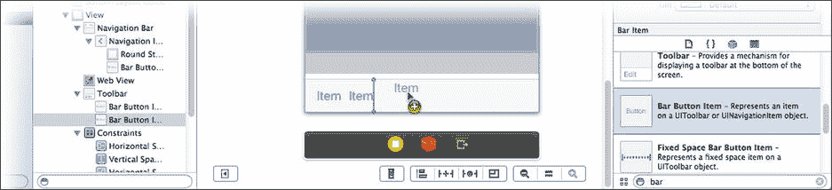

图 3-22. 向工具栏添加更多按钮对象

你将自定义这三个按钮的外观，为它们在应用中的角色做好准备。左侧按钮将变为“缩短 URL”操作，中间按钮用于显示缩短后的 URL，右侧按钮将变为“复制短 URL 到剪贴板”操作。切换到属性检查器并进行以下修改：

*   选中最左侧按钮
*   将标识符改为 `Play`
*   取消勾选 `Enabled`
*   选中中间按钮
*   将样式设置为 `Plain`
*   将标题改为“点击箭头缩短”
*   将色调改为 `Black Color`
*   选中右侧按钮
*   将标题改为“复制”
*   取消勾选 `Enabled`

现在，选中并调整网页视图的大小，使其接触到新的工具栏。从“解决自动布局问题”按钮中选择“在视图控制器中添加缺失的约束”来完成布局。最终的布局应如图 3-23 所示。

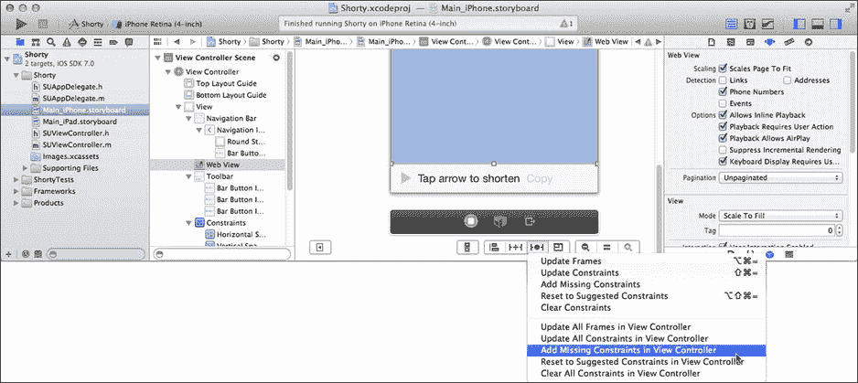

图 3-23. 完成的界面

和之前一样，你需要向 `SUViewController` 类添加三个 Outlet，以便你的对象能够访问这三个按钮。在项目导航器中选中 `SUViewController.h` 文件，并添加以下三个声明：

```
@property (weak,nonatomic) IBOutlet UIBarButtonItem *shortenButton;
@property (weak,nonatomic) IBOutlet UIBarButtonItem *shortLabel;
@property (weak,nonatomic) IBOutlet UIBarButtonItem *clipboardButton;
```

选中 `Main_iPhone.storyboard` Interface Builder 文件，选中视图控制器对象，并切换到连接检查器。三个新的 Outlet 将出现在检查器中。将 `shortenButton` Outlet 连接到左侧按钮，将 `shortLabel` Outlet 连接到中间按钮，将 `clipboardButton` Outlet 连接到右侧按钮，如图 3-24 所示。

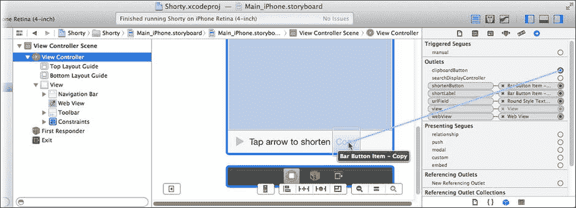

图 3-24. 将 Outlet 连接到工具栏按钮

## 设计 URL 缩短代码

界面完成后，是时候卷起袖子编写代码来实现这个功能了。以下是你的应用应有的行为方式：

*   用户在文本字段中输入一个 URL 并点击 `Go`。网页视图加载该 URL 对应的网页并进行显示。
*   当页面成功加载后，会发生两件事：
*   URL 字段会更新，以反映实际加载的 URL。
*   “缩短 URL”按钮变为可用，允许用户点击它。
*   当用户点击“缩短 URL”按钮时，会向 URL 缩短服务发送一个请求。
*   当 URL 缩短服务发送其响应后，会发生两件事：
*   缩短后的 URL 会显示在工具栏中。
*   “复制到剪贴板”按钮变为可用，允许用户点击它。
*   当用户点击“复制到剪贴板”按钮时，短 URL 会被复制到 iOS 剪贴板。

你已经可以大致看出大部分功能是如何工作的。“缩短 URL”和“复制到剪贴板”按钮对象将连接到执行这些功能的 Action。你刚才创建的 Outlet 将允许你的代码改变它们的状态，例如在它们准备就绪时启用这些按钮。

这些步骤之间的环节稍微有些神秘。“当页面成功加载后”这一点可以理解，但你的应用如何知道网页何时加载完毕，或者是否加载成功？同样的问题也适用于“当 URL 缩短服务发送其响应时”。这是什么时候发生的？这些问题的答案可以在多任务处理和委托中找到。

你可能会问“多什么”？多任务处理就是同时做多件事。通常，你编写的代码一次只做一件事，在第一件事完成之前不会执行下一件事。然而，有一些技术可以让你的应用触发一个代码块并行执行，从而使两个代码块或多或少地同时运行。这在第 24 章中有更详细的解释。在你的应用中已经用到了这一点，你可能没有意识到：

```
[self.webView loadRequest:[NSURLRequest requestWithURL:url]];
```

你发送给网页视图对象的 `-loadRequest:` 消息并没有加载 URL；它只是启动了加载 URL 的过程。这个方法的调用会立即返回，你的代码会继续执行其他操作。这被称为异步方法。你想要持续执行的操作之一就是响应用户的触摸事件——这在第 4 章中会介绍。这一点很重要，因为它能保持应用的响应性。

与此同时，属于 `UIWebView` 类的代码开始独立运行，悄悄地向网络服务器发送请求，收集并解释响应，最终在网页视图中显示渲染好的页面。这通常被称为后台线程或后台任务，因为它在你的主应用（称为前台线程）之外，安静且独立地完成工作。


### 成为 Web 视图委托

所有这些多任务处理理论都很有价值，但仍然没有回答你的应用如何知道网页是否加载完成的问题。任务之间有多种通信方式，其中之一便是使用委托。委托是一个对象，它同意为另一个对象承担某些决策或任务，或者在特定事件发生时希望收到通知。本应用将用到委托的最后一个特性——事件通知。

Web 视图类有一个 `delegate` 出口，你需要将其连接到将要成为其委托的对象上。委托是 iOS 中一种常用的编程模式。如果你翻阅 Cocoa Touch 库，会发现很多类都包含 `delegate` 出口。第 6 章 将详细讨论委托。

成为委托需要三个步骤：

- 在自定义类中，采用委托的协议（protocol）。
- 实现相应的协议方法。
- 将对象的 `delegate` 出口连接到你的委托对象上。

协议是一种契约或承诺，声明你的类将实现特定的方法。这可以让其他对象知道你的对象已同意承担某些责任。协议可以声明两种方法：必需（required）方法和可选（optional）方法。所有必需方法都必须包含在你的类实现中。如果遗漏了任何一个，你就违反了契约，项目将无法编译。

你可以自行决定实现哪些可选方法。如果实现了某个可选方法，你的对象就会收到该消息；如果没有实现，则不会收到。就是这么简单。大多数委托方法都是可选的。

**提示**

一些较旧的类依赖于所谓的非正式协议（informal protocol）。它实际上并不是真正的协议，而是一组文档化的方法，期望你的委托去实现。类的文档会说明你应该使用哪些方法。使用非正式协议的所有步骤与正式协议相同，只是没有正式的协议名称需要添加到你的类中。

第一步是决定哪个对象将充当委托，并采用相应的协议。选择你的 `SUViewController.h` 文件，修改声明类的代码行，使其如下所示：

`@interface SUViewController : UIViewController <UIWebViewDelegate>`

修改的内容是在类声明的末尾添加了 `<UIWebViewDelegate>`，放在小于号和大于号之间，有时也称为“尖括号”。将此内容添加到你的类定义中，意味着你的类同意处理 `UIWebViewDelegate` 协议中列出的消息，并准备连接到 `UIWebView` 的 `delegate` 出口。

查阅 `UIWebViewDelegate` 协议，你会发现它列出了四个方法，全部都是可选的：

```
- (BOOL)webView:(UIWebView *)webView shouldStartLoadWithRequest:(NSURLRequest *)request navigationType:(UIWebViewNavigationType)navigationType;
- (void)webViewDidStartLoad:(UIWebView *)webView;
- (void)webViewDidFinishLoad:(UIWebView *)webView;
- (void)webView:(UIWebView *)webView didFailLoadWithError:(NSError *)error;
```

第一个方法 `-webView:shouldStartLoadingWithRequest:navigationType:` 会在用户点击链接时发送给委托。它允许你的委托决定是否应该加载该链接。例如，你可以创建一个让用户始终停留在特定网站（如学校日历）的浏览器。你的委托可以阻止任何跳转到其他网站的链接，或者至少警告用户即将离开当前站点。本应用不需要做类似的事情，因此可以忽略这个方法。如果不实现此方法，Web 视图将允许用户点击并跟踪他们想要的任何链接。

接下来的三个方法才是你感兴趣的。`-webViewDidStartLoad:` 在网页开始加载时发送给委托。`-webViewDidFinishLoad:` 在加载完成时发送。最后，`-webView:didFailLoadWithError:` 在页面因某种原因无法加载时发送。

你需要实现这三个方法。先从第一个开始。选择你的 `SUViewController.m`（实现）文件，找一个位置添加此方法：

```
- (void)webViewDidStartLoad:(UIWebView *)webView
{
    self.shortenButton.enabled = NO;
}
```

当网页开始加载时，此方法会禁用（通过将 `enabled` 属性设置为 `NO`）缩短 URL 的按钮。这样做只是为了防止短 URL 按钮在页面切换过程中被触发，同时也是因为我们还不确定页面能否成功加载。你希望将 URL 缩短功能仅限于已知有效的 URL。

在该方法下方，添加此方法：

```
- (void)webViewDidFinishLoad:(UIWebView *)webView
{
    self.shortenButton.enabled = YES;
    self.urlField.text = webView.request.URL.absoluteString;
}
```

此方法在网页加载完成后被调用。第一行使用你之前创建的 `shortenButton` 出口来启用“缩短 URL”按钮。因此，一旦网页加载完成，将其转换为短 URL 的按钮就会变为可用状态。

第二行解决了我在前面“调试”部分提到的一个问题。你希望屏幕顶部文本字段中的 URL 能够反映用户在 Web 视图中查看的页面。这段代码使两者保持同步。网页加载完成后，此行代码深入 `webView` 对象，找到实际加载的 URL。`request` 属性（一个 `NSURLRequest` 对象）包含一个 `URL` 属性（一个 `NSURL` 对象），该属性又有一个名为 `absoluteString` 的属性。该属性返回一个描述完整 URL 的纯字符串对象（`NSString`）。简而言之，它将 URL 转换为字符串，这与你在 `-loadLocation:` 中所做的操作相反。剩下要做的就是将其赋值给 `urlField` 对象的 `text` 属性，于是新的 URL 就会出现在文本字段中。

最后一个方法仅在网页无法加载时被调用。讽刺的是，这是最复杂的方法，因为我们希望花时间告诉用户页面无法加载的原因，而不是让他们去猜测。代码如下：

```
- (void)webView:(UIWebView *)webView didFailLoadWithError:(NSError *)error
{
    NSString *message = [NSString stringWithFormat:
        @"尝试加载此页面时出现问题：%@",
        error.localizedDescription];
    UIAlertView *alert = [[UIAlertView alloc] initWithTitle:@"无法加载 URL"
        message:message
        delegate:nil
        cancelButtonTitle:@"真遗憾"
        otherButtonTitles:nil];
    [alert show];
}
```

第一条语句创建了一条消息，内容为“尝试加载此页面时出现问题：”，并包含了 Web 视图随此消息发送的 `error` 对象中的问题描述。接下来两条语句创建了一个警告视图（一个弹出对话框），向用户呈现该消息。

至此，你已经完成了将 `SUViewController` 对象变成 Web 视图委托所需的所有操作，但它还不是真正的委托。最后一步是将 Web 视图连接到它。选择 `Main_iPhone.storyboard` 文件。按住 Control 键，从 Web 视图对象拖拽到视图控制器。松开鼠标按钮时，选择 `delegate` 出口，如图 3-25 所示。

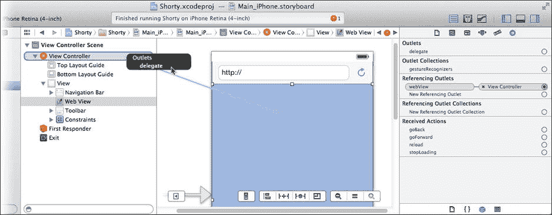

**图 3-25. 连接 Web 视图委托**


`SUViewController` 对象现在是 Web 视图的委托对象。当 Web 视图执行操作时，你的委托会收到关于其进度的消息。你可以在模拟器中看到这一运作过程。运行你的应用，访问一个 URL（图 3-26 中的示例使用了 `http://developer.apple.com`），然后在 Web 视图中点击一两个链接。每加载一个页面，文本字段中的 URL 都会更新。

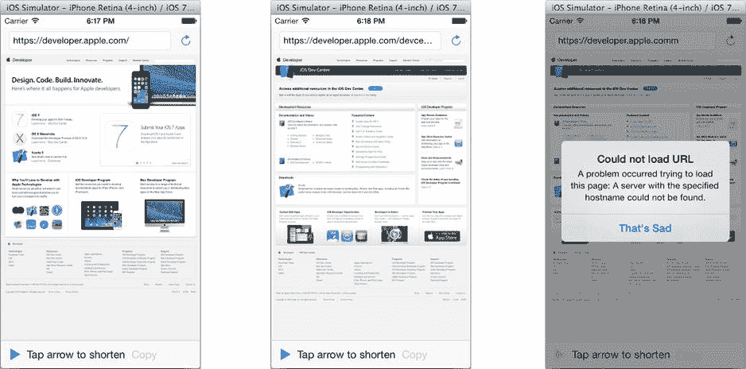

图 3-26. 跟随链接时的 URL 字段

**提示**

也可以尝试输入一个无效的域名或不存在的路径来加载无法加载的 URL，如图 3-26 所示。测试你的应用如何处理失败情况同样很重要。

### 缩短 URL

你终于来到了关键时刻：编写用于缩短 URL 的代码。但首先，让我们回顾一下到目前为止发生的事情：

*   用户输入了 URL 并将其加载到了 Web 视图中。
*   当 Web 视图加载完毕后，它向你的 `SUViewController` 对象发送了一条 `-webViewDidFinishLoad:` 消息，你的代码在该消息中启用了“缩短 URL”按钮。

接下来你希望用户点击“缩短 URL”按钮，并将长 URL 神奇地转换为短 URL。这听起来像是一个动作。再次选择你的 `SUViewController.m` 文件，并添加这个新方法：

```
- (IBAction)shortenURL:
(id)sender
{
    NSString *urlToShorten = self.webView.request.URL.absoluteString;
    NSString *urlString = [NSString
  stringWithFormat:@"http://api.x.co/Squeeze.svc/text/%@?url=%@",
                           kGoDaddyAccountKey,
                           [urlToShorten
  stringByAddingPercentEscapesUsingEncoding:NSUTF8StringEncoding]];
    shortURLData = [NSMutableData new];
    NSURLRequest *request = [NSURLRequest requestWithURL:[NSURL
URLWithString:urlString]];
    shortenURLConnection = [NSURLConnection connectionWithRequest:request
                                                         delegate:self];
    self.shortenButton.enabled = NO;
}
```

在 `SUViewController.h` 中，也添加这一行（紧跟在 `@end` 语句之前）：

```
- (IBAction)shortenURL:(id)sender;
```

这一行声明 `-shortURL:` 方法为一个动作，并让 Interface Builder 知道它可以连接对象到该方法。

`-shortenURL:` 方法向 X.co URL 缩短服务发送一个请求。iOS 包含许多类，它们使得复杂的事情——比如向 Web 服务器发送和接收 HTTP 请求——编写起来相对容易。

**X.CO URL 缩短服务**

我选择在这个项目中使用 X.co URL 缩短服务有几个原因。首先，该服务是免费的。其次，它拥有良好文档且直接的 API（应用程序接口），可以通过执行简单的 HTTP 请求来使用。最后，它还有一些调试和管理功能。该服务允许你登录并查看你的应用缩短了哪些 URL，这在调试时非常有用。

X.co 服务由 GoDaddy 提供。要使用 X.co，请访问 X.co 网页，并创建一个免费账户，或者使用你现有的 GoDaddy 账户登录（如果你已经是客户）。在你的 X.co 账户设置中，你会找到一个账户密钥——一个 32 字符的十六进制字符串——它用于向 X.co 服务唯一标识你。该密钥必须包含在你的请求中。获得密钥后，将以下行添加到你的 `SUViewController.m` 文件开头（紧跟在 `@implementation` 语句之前），将引号之间的示例密钥替换为你的账户密钥：

```
#define kGoDaddyAccountKey @"0123456789abcdef0123456789abcdef"
```

还有其他 URL 缩短服务存在，你可以轻松地调整此应用以使用几乎任何其中一种。有些服务，如 bitly，甚至提供 iOS SDK，你可以下载并包含到你的项目中！

X.co 服务将接受一个包含要缩短的 URL 的 HTTP GET 请求，并回复一个缩短后的 URL。就是这么简单。GET 请求特别容易构造，因为所有需要的信息都包含在 URL 中。


### 编写 `-shortenURL:`

首先构建 URL。你需要三部分信息：

* 服务请求 URL
* 你的 GoDaddy 账户密钥
* 需要缩短的长 URL

第一部分信息记录在 X.co 网站上。要将长 URL 转换为短 URL，并让服务以纯文本形式返回缩短后的 URL，请提交以下格式的 URL：

[`http://api.x.co/Squeeze.svc/text/<YourAccountKey>?url=<LongURL>`](http://api.x.co/Squeeze.svc/text/%3cYourAccountKey%3e?url=%3cLongURL%3e%0d)

要构建此 URL，你需要两个占位符 `<YourAccountKey>` 和 `<LongURL>` 的值。从 GoDaddy 获取账户密钥，并使用它来定义 `kGoDaddyAccountKey` 预处理器宏（请参阅 X.co URL 缩短服务边栏）。

你需要的最后一部分信息是要缩短的 URL。就像在 `-webViewDidFinishLoad:` 方法中所做的那样，从该 URL 开始，并将其赋值给 `urlToShorten` 变量：

```
NSString *urlToShorten = self.webView.request.URL.absoluteString;
```

第二行代码是应用程序中最复杂的语句。它使用 `NSString` 的 `+stringWithFormat:` 方法构建完整的 URL。第一个参数是最终字符串对象的格式字符串（即模板）。格式中的两个 `%@` 序列会被替换为接下来两个参数的值。第一个参数是你之前定义的 `kGoDaddyAccountKey` 常量，第二个参数是你想要缩短的 URL，当前存储在 `urlToShorten` 变量中。

注意，`urlToShorten` 的值并非直接使用。相反，它会被发送 `-stringByAddingPercentEscapesUsingEncoding:` 消息。该消息会将 URL 中具有特殊含义的任何字符替换为不会与重要内容混淆的字符序列。边栏“URL 字符串编码”解释了这样做的原因及工作原理。

### URL 字符串编码

计算机（以及计算机程序员）经常处理字符串。字符串是一系列字符。通常，字符串中的某些字符具有特殊含义。URL 可以表示为字符串。特殊字符分隔 URL 的各个部分。下面是一个通用 URL，特殊字符以粗体显示：

`scheme://some.domain.net/path?param1=value1&param2=value2#anchor`

冒号、正斜杠、问号、与号、等号和井号（哈希）字符在 URL 中都具有特殊含义：它们用于标识 URL 的各个部分。问号后面的所有字符都是 URL 的查询字符串部分。与号字符分隔多个名称/值对。片段标识符位于井号字符之后，以此类推。

那么，如何编写一个在路径中包含问号字符，或在某个查询字符串值中包含与号字符的 URL 呢？你不能像下面这样写，这样毫无意义：

[`http://server.net/what?artcl?param=red&white`](http://server.net/what?artcl?param=red&white)

这就是向 X.co 服务发送 URL 时遇到的问题。你的 URL 的查询字符串中包含另一个 URL——其中充满了特殊字符，所有这些字符都必须被忽略。你需要一种方法来编写通常具有特殊含义的字符，但又不让其发挥特殊含义。你需要的是一个转义序列。

转义序列是一种特殊的字符序列，用于表示单个字符，使其像其他普通字符一样被对待，而不是作为特殊字符。（请重新阅读这句话直到理解为止。）URL 使用百分号（`%`）后跟两个十六进制数字。当 URL 遇到百分号后跟两个十六进制数字（如 `%63`）时，它会将其视为由这两个数字的值确定的单个字符。将字符转换为转义序列以保留其值，称为编码字符串。

序列 `%63` 表示单个问号字符（`?`），而 `%38` 表示单个与号字符（`&`）。现在你可以对该麻烦的 URL 进行编码，接收方就能理解其含义了：

[`http://server.net/what%63artcl?param=red%38white`](http://server.net/what%2563artcl?param=red%2538white)

`-stringByAddingPercentEscapesUsingEncoding:` 方法会转换任何可能混淆 URL 的字符，并将其替换为表示相同字符但无特殊含义的转义序列。现在，你拥有一个可以安全追加到 URL 查询部分而不会造成混淆的字符串。

```
shortURLData = [NSMutableData new];
```

第三行代码可能看起来有点神秘。它将一个名为 `shortURLData` 的实例变量设置为一个新的、空的 `NSMutableData` 对象。现在无需担心，稍后你会明白其含义。

下一行代码与之前加载网页时使用的代码非常相似：

```
NSURLRequest *request = [NSURLRequest requestWithURL:
[NSURL URLWithString:urlString]];
```

就像网页视图一样，`NSURLConnection` 类（为我们发送 URL 的类）需要 `NSURLRequest`。而 `NSURLRequest` 需要 `NSURL`。逆向工作，这行代码从你刚构建的 URL 字符串创建一个 `NSURL`，并用它来创建一个新的 `NSURLRequest` 对象，将最终结果保存在 `request` 变量中。

下一条语句完成了（几乎）所有工作：

```
shortenURLConnection = [NSURLConnection connectionWithRequest:request
delegate:self];
```

`NSURLConnection` 的 `+connectionWithRequest:` 方法创建一个新的 `NSURLConnection` 对象，并立即开始发送请求的 URL 的过程。就像网页视图的 `-loadRequest:` 方法一样，这是一个异步消息——它只是启动一个后台任务并立即返回。同样，与网页视图类似，你需要提供一个委托对象，以便在发生进度事件时接收相关消息。

与网页视图不同的是，`NSURLConnection` 的委托是在发出请求时（通过编程方式）传递的。这就是消息中 `delegate:self` 部分的作用；它告诉 `NSURLConnection` 使用此对象（`self`）作为委托。

你刚才说什么？你还没有将 `SUViewController` 类设置为 URL 连接委托？完全正确，但这还不是你唯一的问题。Xcode 还会报错，指出变量 `shortURLData` 和 `shortenURLConnection` 也不存在，如图 3-27 所示。首先修复缺少的变量。

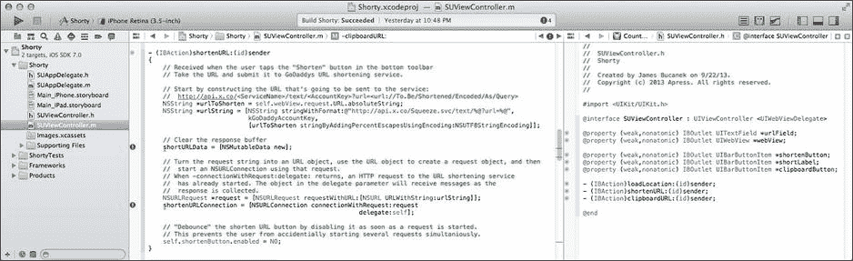

**图 3-27.** `-shortenURL:` 中的编译器错误

### 添加私有实例变量

需要将缺少的变量添加到 `SUViewController` 类中。当从远程服务接收信息时，必须维护一些信息片段。这些信息包括正在执行工作的 `NSURLConnection` 对象，以及一个用于收集 Web 服务器返回数据的 `NSMutableData` 对象。

然而，这些变量不供公共使用；它们不需要被其他对象访问，也无需在 Interface Builder 中连接。简单来说，这些是私有变量。通过在 `SUViewController` 的私有接口中声明它们来创建私有变量。滚动到 `SUViewController.m` 文件的开头，找到 `@interface SUViewController ()` 部分。将其修改为如下所示（新代码以粗体显示）：

```
@interface SUViewController ()
{
    NSURLConnection *shortenURLConnection;
    NSMutableData *shortURLData;
}
@end
```

添加完这些代码后，你在 `-shortenURL:` 中看到的警告就会消失。

> **提示**
> 
> 创建私有变量的另一种方法是将其添加到 `SUViewController.h` 的公共 `@interface SUViewController` 部分，但在其前面加上 `@private` 指令。有关 `@private` 和私有接口的详细介绍，请阅读第 20 章。


### 成为 `NSURLConnection` 的委托

现在，你可以按照之前让 `SUViewController` 成为 Web 视图委托的相同步骤，将其也转变为 `NSURLConnection` 的委托。你的对象可以成为多少个对象的委托，实际上没有限制。

第一步是采纳那些让你的类成为委托的协议。`NSURLConnection` 声明了几种不同的委托协议，你可以自由采纳那些对你的应用有意义的协议。在这种情况下，你需要采纳 `NSURLConnectionDelegate` 和 `NSURLConnectionDataDelegate` 协议。通过在 `SUViewController.h` 文件中，将这些协议名称添加到 `SUViewController` 类中来实现，如下所示：

```
@interface SUViewController : UIViewController <UIWebViewDelegate,
NSURLConnectionDelegate,
NSURLConnectionDataDelegate>
```

`NSURLConnectionDelegate` 定义了在关键事件发生时发送给你的委托的方法。有一系列消息涉及你的应用如何响应经过身份验证的内容（由账号和密码保护的 Web 服务器上的文件）。这些都不适用于本应用。你唯一感兴趣的消息是 `-connection:didFailWithError:`。如果请求因某种原因失败，就会发送该消息。打开你的 `SUViewController.m` 文件并添加这个新方法：

```
- (void)connection:(NSURLConnection *)connection
didFailWithError:(NSError *)error
{
    self.shortLabel.title = @"failed";
    self.clipboardButton.enabled = NO;
    self.shortenButton.enabled = YES;
}
```

URL 缩短请求失败的可能性不大。唯一可能的原因是你的 iPhone 暂时失去了互联网连接。尽管如此，你希望你的应用在任何情况下都能表现良好，并做出一些智能的处理。此方法通过执行以下三件事来处理失败情况：

- 将短 URL 标签设置为 “failed”，表示出现了问题
- 禁用“复制到剪贴板”按钮，因为没有什么可复制的
- 重新启用“缩短 URL”按钮，以便用户可以重试

处理完这些不太可能发生的情况后，让我们来看看发送请求时应该发生什么。`NSURLConnectionDataDelegate` 协议的方法主要关注你的应用如何获取从服务器返回的数据。它也定义了许多你并不关心的其他方法。你感兴趣的两个方法是 `-connection:didReceiveData:` 和 `-connectionDidFinishLoading:`。首先，将这个 `-connection:didReceiveData:` 方法添加到你的实现中：

```
- (void)connection:(NSURLConnection *)connection didReceiveData:(NSData *)data
{
    [shortURLData appendData:data];
}
```

X.co 服务将缩短后的 URL 作为 HTTP 响应体中的一部分返回，是一个简单的 ASCII 字符字符串。每当从服务器接收到新的响应体数据时，你的委托对象都会收到一条 `-connection:didReceiveData:` 消息。在这个应用中，这可能只会发生一次，因为你请求的数据量非常小。如果你的应用请求了大量数据（比如整个网页），这条消息会被发送多次。

这个方法唯一做的事情就是接收到的数据（在 `data` 参数中）追加到你保存在 `shortURLData` 中的缓冲区里。还记得之前 `-shortenURL:` 方法中的 `shortURLData = [NSMutableData new];` 语句吗？该语句在请求启动前建立了一个空缓冲区（`NSMutableData`）。当你收到该请求的答案时，它会累积在你的 `shortURLData` 变量中。这些都能理解吗？让我们继续看最后一个方法。

最后一个方法现在应该不言自明了。当事务完成时，会发送 `-connectionDidFinishLoading:` 消息：你已经发送了 URL 请求，接收了所有数据，并且整个过程成功完成。将这个方法添加到你的实现中：

```
- (void)connectionDidFinishLoading:(NSURLConnection *)connection
{
    NSString *shortURLString = [[NSString alloc] initWithData:shortURLData
                                                      encoding:NSUTF8StringEncoding];
    self.shortLabel.title = shortURLString;
    self.clipboardButton.enabled = YES;
}
```

第一条语句将你在 `-connection:didReceiveData:` 中收到的 ASCII 字节转换为字符串对象。字符串对象使用 Unicode 字符值，因此将字节字符串转换为字符串需要一点转换。

**提示：** 如果你需要将 `NSString` 对象与其他形式（如 C 字符串或字节数组）相互转换，学习一点 Unicode 字符相关知识会很有帮助。Joel Spolsky 在 [`http://joelonsoftware.com/articles/Unicode.html`](http://joelonsoftware.com/articles/Unicode.html) 上发表了一篇面向初学者的精彩文章，标题是 “每个软件开发人员绝对、绝对必须了解的关于 Unicode 和字符集的最低限度知识（毫无借口！）”。

第二行将 `shortLabel` 工具栏按钮的标题设置为你刚刚接收（并转换）的短 URL。这使得短 URL 显示在屏幕底部。

最后一步是启用“复制到剪贴板”按钮。既然你的应用有了一个有效的短 URL，它就有了可以复制的内容。

### 测试服务

你差不多准备好测试你的应用了，不过首先还有一个微小的细节需要注意。你已经编写了向 X.co 服务发送请求的代码，设置了用于收集返回数据的委托方法，并且编写了处理任何问题的代码。唯一剩下的事情就是将界面中的“缩短 URL”按钮连接到你的 `-shortenURL:` 操作，这样点击按钮时一切才会发生。

选择 `Main_iPhone.storyboard` 文件。按住 Control 键，点击“缩短 URL”按钮，并将其操作连接到 File’s Owner。松开鼠标按钮，选择 `-shortenURL:` 方法，如图 3-28 所示。

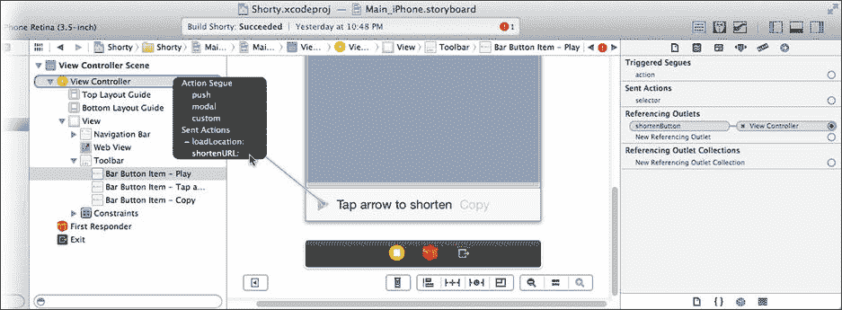

**图 3-28.** 连接“缩短 URL”按钮

运行你的应用并输入一个 URL。在图 3-25 所示的示例中，我输入了 [`http://www.apple.com`](http://www.apple.com/)。当页面加载完成后，“缩短 URL”按钮变为可用。点击它，一两秒钟之内，该页面的短 URL 就会出现在工具栏中（图 3-29 中的右侧）。

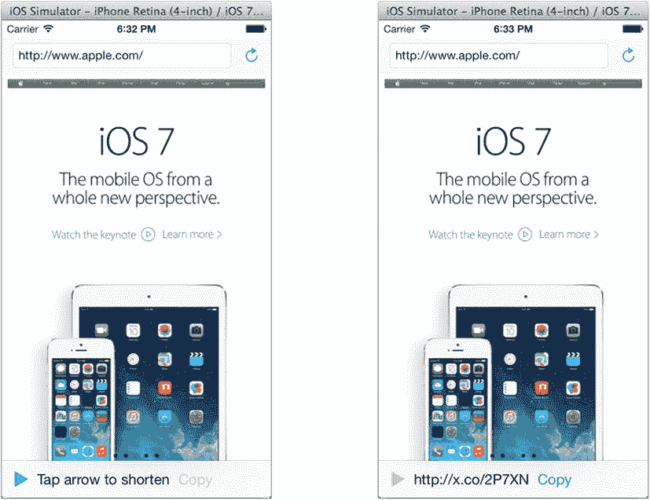

**图 3-29.** Shorty 应用正在运行

这值得庆祝一下！通过利用现有 iOS 类的强大功能，明智地将正确的对象连接在一起，并编写操作和委托方法来处理细节，你创建了一个相当复杂的应用。


### 收尾工作

你还没有完全完成。还需要编写一个操作，将短 URL 复制到系统剪贴板。幸运的是，代码实现也并不困难。在你的 `SUViewController.m` 文件中添加以下方法：

```
- (IBAction)clipboardURL:(id)sender
{
    NSString *shortURLString = self.shortLabel.title;
    NSURL *shortURL = [NSURL URLWithString:shortURLString];
    [[UIPasteboard generalPasteboard] setURL:shortURL];
}
```

第一行代码从 `shortLabel` 按钮获取 URL 的文本，该按钮由 `-connectionDidFinishLoading:` 方法设置。第二行代码将短 URL 的文本转换为一个 URL 对象，就像你在本章开头编写的 `-loadLocation:` 方法中所做的那样。最后，`[UIPasteboard generalPasteboard]` 方法返回用于“通用”数据的系统级粘贴板——也就是大多数人所认为的剪贴板。你向该粘贴板对象发送 `-setURL:` 消息，并传入刚刚创建的 URL 对象。几乎像变魔术一样，短 URL 现在就已经在剪贴板中了。

在你的 `SUViewController.h` 文件中添加以下行：

```
- (IBAction)clipboardURL:(id)sender;
```

现在你可以使用 Interface Builder 将“复制到剪贴板”按钮连接到 `-clipboardURL:` 方法。操作方式与你连接“缩短 URL”按钮相同（参见图 3-24）。

所有连接完成后，再次运行你的应用程序。你应该养成边编写边运行应用程序的习惯，在开发过程中测试每个新特性和功能。在模拟器中，访问一个 URL 并生成一个短链接，如图 3-30 左侧所示。生成短 URL 后，点击“复制”按钮。

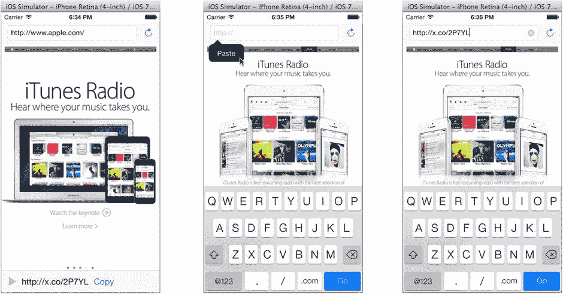

图 3-30. 测试剪贴板

再次点击文本字段，清空内容。按住鼠标（模拟手指）不放，直到出现“粘贴”弹出按钮（图 3-30 中间）。点击粘贴按钮，短 URL 将会被粘贴到字段中，如图 3-30 右侧所示。这在任何其他允许粘贴文本的应用中同样适用。

作为最终测试，点击“前往”按钮。短 URL 将被发送到 x.co 服务器，服务器会将你的浏览器重定向回原始 URL，你最初访问的网页将重新出现在浏览器中，同时文本字段中会显示原始 URL。

### 清理界面

你的应用功能已完备，但界面仍有一些小问题。保持模拟器运行，选择 `硬件` ➤ `向左旋转` 命令。这会模拟将设备逆时针旋转 90°，如图 3-31 所示。大部分内容看起来还好，但底部工具栏中的按钮被挤到左边，显得很粗糙。

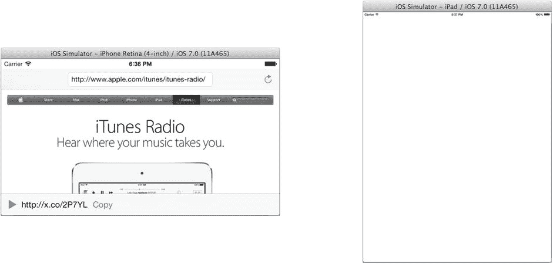

图 3-31. 测试设备旋转

退出模拟器，将工具栏中的项目目标更改为 iPad 模拟器，然后再次运行你的应用，这次在模拟的 iPad 上运行（图 3-31 右侧）。太糟糕了！iPad 版本完全不显示任何界面！

这是因为你还没有创建 iPad 的界面。所有的界面对象都是在 `Main_iPhone.storyboard` 文件中创建和连接的。你肯定已经意识到，这是你的应用在 iPhone 上运行时加载的 Interface Builder 文件。而 `Main_iPad.storyboard` 文件仍然是空的。你马上会解决这两个问题。

注意

iOS 资源加载器 (`NSBundle`) 会识别一些标准文件后缀（`∼ipad`、`∼iphone` 和 `@2x`）。你可以使用这些后缀为任何资源文件创建多个变体，这些变体针对特定平台（`∼ipad`/`∼iphone`）或视网膜屏幕（`@2x`）进行了优化。不过，`Main_iPhone.storyboard` 和 `Main_iPad.storyboard` 的情况并非如此。应用启动时加载的 storyboard 是由项目设置决定的。在导航器中选择项目，选择应用目标，切换到“通用”选项卡。在“部署信息”部分，你会找到 iPhone 或 iPad 在应用启动时加载的 storyboard 名称。这些可以是任何你选择的 storyboard 文件；甚至可以是同一个 storyboard 文件。

首先修复工具栏的布局。退出模拟器，或者点击 Xcode 中的停止按钮。选择 `Main_iPhone.storyboard` 文件。在库中找到`弹性间距栏按钮项`。这个对象名字长得离谱，但它充当一个“弹簧”，可以填充工具栏中的可用空间，从而将两侧的按钮对象推到屏幕边缘。

将一个弹性间距项对象拖放到“缩短 URL”按钮和短 URL 字段之间。再拖放第二个弹性间距项到 URL 字段和“复制到剪贴板”按钮之间，如图 3-32 所示。

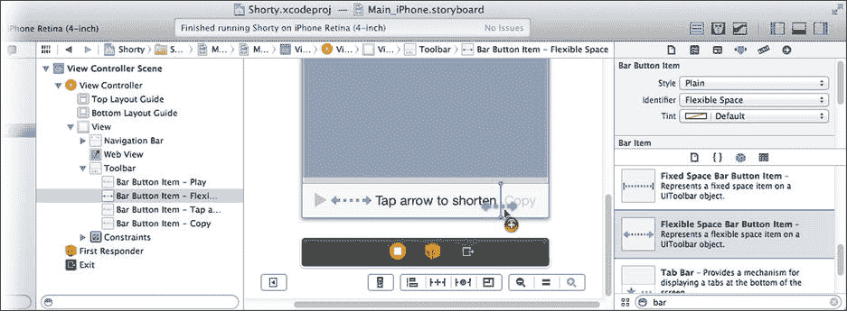

图 3-32. 添加弹性间距栏按钮项

使用两个弹性项后，“弹簧”会平分空白空间，使得中间的标签居中，而复制按钮则移至最右侧。在竖屏方向下效果不明显，但如果你将设备旋转到横屏，效果就完美了。切换回 iPhone 模拟器，运行你的应用（见图 3-33），并将设备向左（或向右）旋转。现在工具栏看起来好多了（图 3-33 右侧）。

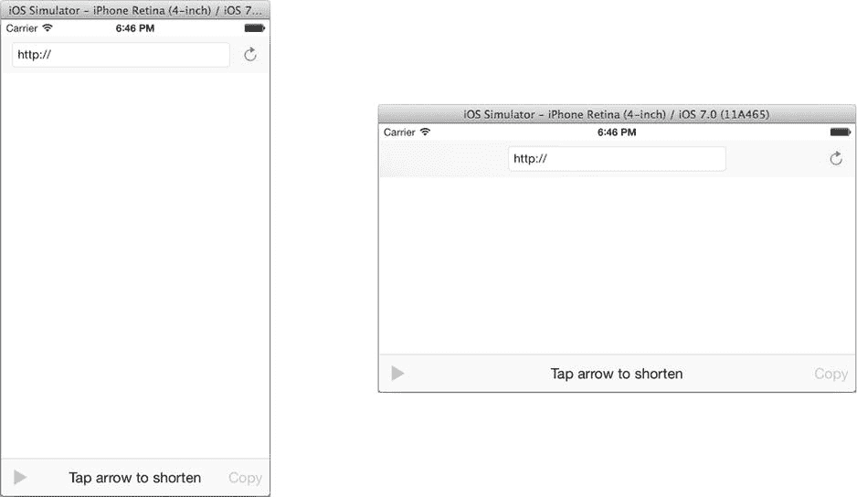

图 3-33. 测试 iPhone 旋转


### 创建 iPad 版本

最后一步是为你的 App 创建 iPad 版本。你可能会叹气，想着又要从头开始。别担心；其实离完成已经非常接近了。首先，这个 App 的大部分工作都是代码，而你已经写好了。其次，就像你在那个超现实主义 App 中做的一样，你可以复制粘贴已经创建好的对象。

选择 `Main_iPhone.storyboard` 文件。使用大纲视图，选中视图中的所有顶层对象并复制它们，如图 3-34 所示。

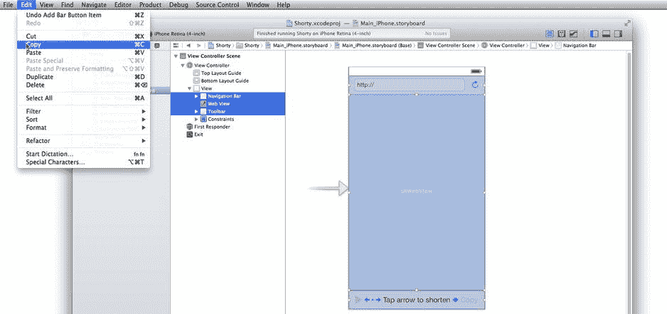

图 3-34. 复制 iPhone 界面

选择 `Main_iPad.storyboard` 文件。在大纲视图中选中视图对象，然后粘贴你刚刚复制的所有对象，如图 3-35 所示。

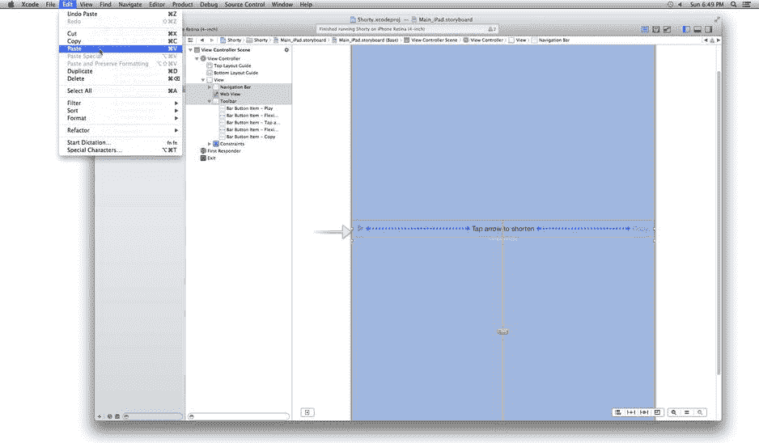

图 3-35. 将对象粘贴到 iPad 界面中

剪贴板会复制你为 iPhone 版本创建的所有对象及其属性。但它不会复制它们的位置、大多数约束，以及任何连接关系。

首先，从 **Resolve Auto Layout Issues** 按钮中选择 **Clear All Constraints in View Controller**。就像你为 iPhone 界面所做的那样（参考图 3-4），从工具栏和 `Top Layout Guide` 添加一个 **垂直间距** 约束，并将其值设置为 0。排列 iPad 界面中剩余的对象，使其看起来像 iPhone 界面一样。所有内容都会比 iPhone 版本更大，包括导航栏中更宽的文本字段。完成后，在 **Resolve Auto Layout Issues** 按钮中选择 **Add Missing Constraints** 项。

使用连接检查器，或通过 **Control + 拖拽**，建立你之前在 iPhone 上建立的相同连接。这包括：

- 将每个 File's Owner 的 `outlet` 连接到正确的界面对象
- 将 `urlField` 连接到文本字段
- 将 `webView` 连接到网页视图
- 将 `shortenButton` 连接到工具栏中的“缩短 URL”（左）按钮
- 将 `shortLabel` 连接到工具栏中的普通（中间）按钮
- 将 `clipboardButton` 连接到工具栏中的“复制到剪贴板”（右）按钮
- 将文本字段和每个按钮的发送事件连接到它们各自的操作：
  - 文本字段的 **Did End On Exit** 事件连接到 `-loadLocation:`
  - 刷新按钮连接到 `-loadLocation:`
  - “缩短 URL”（左）按钮连接到 `-shortenURL:`
  - “复制到剪贴板”（右）按钮连接到 `-clipboardURL:`
- 不要忘记设置网页视图的 `delegate` 出口

> **提示：** 在使用 **Control + 拖拽** 快捷方式在 Interface Builder 中建立连接时，方向很重要。要连接一个 `outlet`，请从具有该 `outlet` 的对象拖拽到你希望它连接到的对象。要连接一个 `action`，请从发送事件的对象拖拽到定义该操作的对象。

完成后，你将拥有一个完整的 iPad 版 App。切换到 iPad 模拟器并进行测试，如图 3-36 所示。

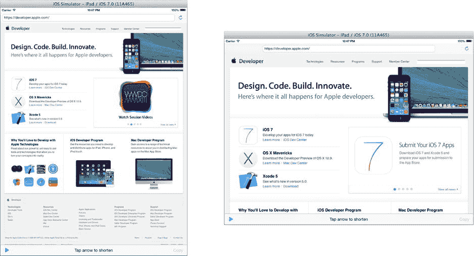

图 3-36. 测试 iPad 版本

## 总结

这是一个非常重要的章节，你成功地完成了它。你学到了很多关于 iOS App 开发的基础知识和 Xcode 的工作流程。这些技能几乎会在你开发的每一个 App 中用到。

你学会了如何快速搭建一个网页浏览器，这个功能用途广泛，不仅仅是显示网页。例如，你可以通过向 App 添加 `.html` 资源文件来创建静态网页内容，并让网页视图加载这些文件。网页视图类还允许你通过 JavaScript 与其内容进行交互，这开启了各种可能性。

学习创建和连接 `outlet` 是一项关键的 iOS 技能。正如你所发现的，一个 iOS App 是一个对象网络，而 `outlet` 就是连接这个网络的线索。

最重要的是，你学会了如何编写操作方法以及创建委托。这两种模式在 iOS 中反复出现。

在下一章中，我将解释事件如何将一次手指触摸转化为一个操作。

## 4. 即将发生的事件

**摘要**

既然你已目睹了一个 iOS App 的运行，你可能会好奇是什么让你的 App 保持“活力”。在 Shorty 这个 App 中，你创建了操作方法，当用户点击按钮或键盘上的 `Go` 键时，这些方法会被调用。你创建了委托对象，当达到某些里程碑时，例如网页加载出现问题或 URL 缩短服务响应时，它们会接收消息。你从未编写任何代码来检查用户是否触摸了某个东西，或检查网页是否已加载完成。换句话说，你并非主动去获取这些信息；你的 App 是在等待这些信息自己找上门来。

iOS App 是事件驱动的应用。事件驱动的应用不会（也不应该！）在一个循环中旋转以检查是否发生了什么事情。事件驱动的应用程序会设置它们想要响应的事件条件（例如用户的触摸、设备方向的改变、网络事务的完成）。然后 App 会静静地待着，什么都不做，直到其中一件事发生。所有这些事情统称为事件，这正是本章要讨论的全部内容。

在本章中，你将学习以下内容：

- 事件
- 运行循环
- 事件传递
- 事件处理
- 第一响应者和响应者链
- 在真实的 iOS 设备上运行你的 App

我将从一些基础理论开始，讲解事件是如何从设备硬件进入你的应用程序的。你将了解不同类型的事件以及它们在 App 对象中的传递方式。最后，你将创建两个 App：一个处理高级事件，另一个处理低级事件。


