# 响应者链

响应者链是一个代表用户界面"焦点"的对象序列。这里所说的"焦点"指的是那些控制当前可见界面的对象，以及那些与用户当前操作最相关的视图对象。通过一张图并结合 iOS 创建及使用响应者链的说明，一切将变得清晰。

响应者链始于初始响应者（见图 4-3）。在传递运动事件、按键事件和远程控制事件时，第一响应者就是初始响应者对象。对于触摸事件，初始响应者则是由命中测试确定的视图对象。

> **注：** 响应者链中的所有对象都是`UIResponder`的子类。因此，从技术上讲，响应者链由`UIResponder`对象组成。`UIApplication`、`UIWindow`、`UIView`和`UIViewController`都是`UIResponder`的子类。由此推论，初始响应者（第一响应者或命中测试结果）始终是一个`UIResponder`对象。

iOS 首先尝试将该事件传递给初始响应者。"尝试"是这里的关键词。如果该对象含有处理该事件的方法，它就会处理。如果没有，iOS 就会转向链中的下一个对象，直到找到一个愿意处理该事件的对象，或者放弃并将该事件丢弃。

图 4-3 展示了一个包含两个屏幕的应用中视图对象的概念性组织结构。当前向用户显示的是第二个屏幕。它由一个视图控制器对象、多个子视图（其中一些嵌套在其他子视图中）、甚至还有一个子视图控制器组成。在这个例子中，一个次级子视图被指定为初始响应者，这在命中测试确定用户触摸了该视图后是合适的。


*图 4-3. 第一响应者链*

iOS 会尝试将触摸事件传递给初始响应者（即那个次级子视图）。如果该对象不处理触摸事件，iOS 会检查该视图是否关联了视图控制器对象（本例中没有），并尝试将事件发送给其控制器。如果视图及其控制器都不处理触摸事件，iOS 会找到包含该视图的父视图，并重复整个过程，直到尝试完所有视图和视图控制器为止。

在所有视图和视图控制器对象都有机会处理事件之后，事件传递会转向该屏幕的窗口对象，最终到达唯一的应用对象。

响应者链之所以如此优雅，在于其动态特性和有序的事件处理机制。响应者链是自动创建的，因此你的对象无需做任何事就能成为响应者链的一部分，只需确保它自己或其附属视图是初始响应者即可。当你的界面部分处于活动状态时，你的对象会接收到事件消息；当它不活动时，则不会收到事件。

另一个方面是响应者链事件处理的"由特定到通用"特性。该链始终从与用户最相关的视图开始：他们触摸的按钮、活跃的文本输入框或列表中的某一行。该对象总是最先接收事件。如果事件对这些视图有特定含义，它就会被相应地处理。同时，你的视图控制器或`UIApplication`对象也可以响应这些事件，但如果某个子视图首先处理了它，那么这些对象就不会收到该事件。

如果用户切换到另一个屏幕，如图 4-4 所示，并按下耳机上的"暂停"按钮，则会建立一个新的响应者链。这个链从第一响应者开始，在本例中它是一个视图控制器。该链完全不包含任何视图对象，因为顶级视图控制器对象就是第一响应者。

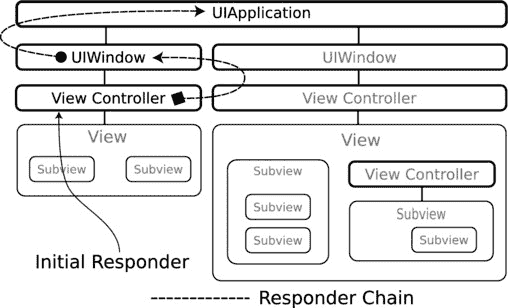

*图 4-4. 第二响应者链*

如果视图控制器处理了"暂停"事件，它就会处理。其他界面中的视图控制器永远不会看到这个事件。通过在不同控制器中实现不同的"暂停"事件处理代码，你的应用对"暂停"事件的响应将根据当前处于活动状态的屏幕而有所不同。

你的应用对象也可以处理"暂停"事件。如果没有视图控制器处理"暂停"事件，那么所有"暂停"事件都将向下传递到应用对象。如果你希望所有"暂停"事件都以相同方式处理，无论用户正在查看哪个屏幕，那么这就是你应该采用的安排。

最后，你可以混合使用这些方案。应用中的"暂停"事件处理器可以以通用方式处理事件，然后特定的视图控制器可以在按下"暂停"按钮对该屏幕有特殊含义时截获该事件。

> **提示：** 创建`UIApplication`的自定义子类很少见，而创建`UIWindow`的子类则更为罕见。在典型的应用中，你所有的 event 处理代码都将位于自定义视图和视图控制器对象中。

## 有条件地处理事件

实际操作中，你可以实现一个事件处理方法（例如`-touchesBegan:withEvent:`）来处理该事件类型，或者省略实现以忽略它。但实际上，情况要更微妙一些。

事件通过接收特定的 Objective-C 消息（如`-touchesBegan:withEvent:`）来处理。你的对象从`UIResponder`基类继承这些方法。因此，每个`UIResponder`对象都有一个`-touchesBegan:withEvent:`方法，并将通过此消息接收触摸事件对象。那么，对象是如何忽略事件的呢？

秘密在于`UIResponder`对这些消息的实现。所有事件处理消息的继承基类实现只是简单地将事件沿着响应者链向上传递。因此，更精确的描述是这样的：要处理事件，你需要重写`UIResponder`的事件处理方法并处理该事件。要忽略事件，你只需让事件进入`UIResponder`的方法，该方法会忽略事件并将其传递给响应者链中的下一个对象。

这就引出了一个有趣的功能：有条件地处理事件。你可以编写一个事件处理器，让它决定是否要处理某个事件。它可以任意选择自己处理事件，或者将其传递给响应者链中的下一个对象。将其传递下去是通过将事件转发给基类的实现来完成的，如下所示：

```
- (void)touchesBegan:(NSSet *)touches withEvent:(UIEvent *)event

{

if ( [self iWantToHandleTheseTouches:touches] )

    // 处理事件
    [self doSomethingWithTheseTouches:touches];

else

    // 忽略事件并将其沿响应者链向上传递
    [super touchesBegan:touches withEvent:event];

}
```

使用这种技术，你的对象可以动态地决定它想要处理哪些事件，以及哪些事件将传递给响应者链中的其他对象。

现在你已经了解了事件是如何传递和处理的，接下来就可以构建一个直接使用事件的应用了。为此，你需要考虑你想要处理什么样的事件以及为什么要处理它们。


## 高级事件与低级事件

程序员总是习惯给事物贴上“高级”或“低级”的标签。应用中的对象形成了一种金字塔结构：顶层的少数复杂对象由中层的更原始对象构建而成，而中层对象本身又由更底层的原始对象构成。顶层的复杂对象被称为“高级”对象（`UIApplication`、`UIWebView`），底层的简单对象则被称为“低级”对象（`NSNumber`、`NSString`）。类似地，程序员也会谈论高级与低级的框架、接口、通信路径等。

事件同样存在不同层级。低级事件是指那些细微的、实时发生的具体细节。触摸事件就是低级事件的例子。另一个例子是从加速计和陀螺仪硬件中请求的瞬时力向量值。

而在另一端的则是高级事件，例如摇动运动事件。另一个例子是 `UIGestureRecognizer` 对象，它能解读复杂的触摸事件模式，并将其转化为单个高级事件，比如“捏合”或“轻扫”。

在设计应用时，你必须决定要处理哪个层级的事件。在下一个应用中，你将使用摇动运动事件来触发应用内的操作。

为此，你可以请求并处理低级的加速计事件。你需要创建变量来跟踪三个运动轴（X、Y、Z）的力向量。当你检测到设备正在向某个特定方向加速时，你会记录该方向并启动一个计时器。如果在合理角度范围内、且在短时间内，运动方向发生反转，并再反转两三次，你就可以断定用户正在摇动设备。

或者，你也可以让 iOS 替你完成所有这些计算，只需处理 Cocoa Touch 框架生成的摇动运动事件即可。当用户开始摇动设备时，你的第一响应者会收到一条 `-motionBegan:withEvent:` 消息。当用户停止摇动时，你的对象会收到一条 `-motionEnded:withEvent:` 消息。就这么简单。

但这并不意味着你永远不需要低级事件。如果你正在编写一款游戏应用，用户通过左右倾斜设备来引导一只星鼻鼹鼠穿越魔法花园的土壤，那么解读低级的加速计事件将是正确的解决方案。你将在第 16 章中使用低级加速计事件。

决定你需要从事件中获取什么信息，然后处理能提供这些信息的最高层级的事件。现在，你已准备好开始设计你的应用了。

## 八球

你将创建的应用仿照了 20 世纪 50 年代著名的神奇八球玩具（ [`http://en.wikipedia.org/wiki/Magic_Eight_Ball`](http://en.wikipedia.org/wiki/Magic_Eight_Ball) ）。该应用的工作方式是：每当你摇动 iOS 设备时，它就会显示一条预言般精准的消息。首先，为你的应用勾勒出一个快速设计草图。

### 设计

这个应用的设计到目前为止是最简单的：一个包含消息的屏幕显示在“球”的中央，如图 4-5 所示。当你摇动设备时，当前消息会消失；当你停止摇动时，一条新消息会出现。

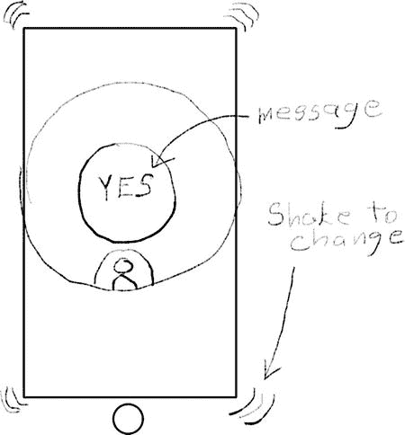

图 4-5. 八球应用设计

### 创建项目

启动 Xcode，选择“文件 ➤ 新建项目”。选择“单视图 iOS 应用”模板。在下一个表单中，将应用命名为 `EightBall`，设置类前缀为 `EB`，并为设备选择 `iPhone`，如图 4-6 所示。

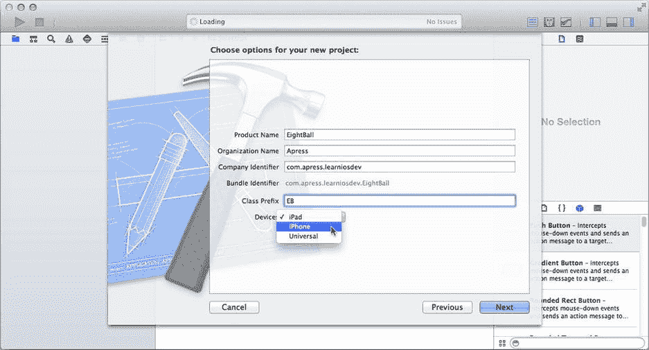

图 4-6. 创建 EightBall 项目

选择一个位置保存新项目并创建它。在项目导航器中，选择该项目，从弹出菜单中选择 EightBall 目标（如果需要），选择“通用”标签页，然后在“支持的界面方向”部分关闭两个横向方向，仅保留纵向方向。


### 创建界面

选择 `Main.storyboard` 界面构建器文件，并选中单个视图对象。使用属性检查器将背景颜色设置为 `Black`，如图 4-7 所示。

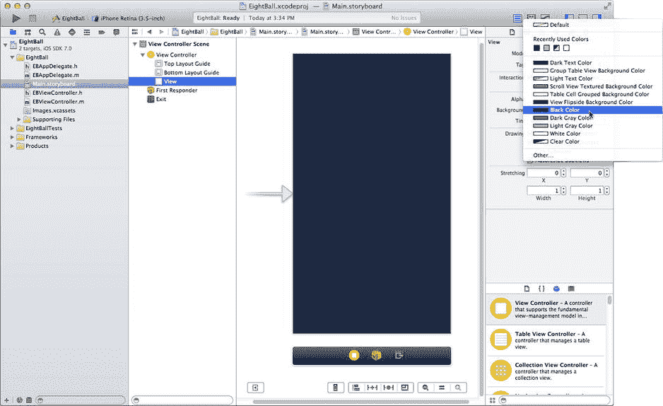

图 4-7.

设置主视图背景颜色

从库中拖拽一个图像视图对象到界面中。使用尺寸检查器将其高度和宽度设置为 `320` 像素。拖拽图像对象，使其吸附到垂直和水平居中参考线，如图 4-8 所示。

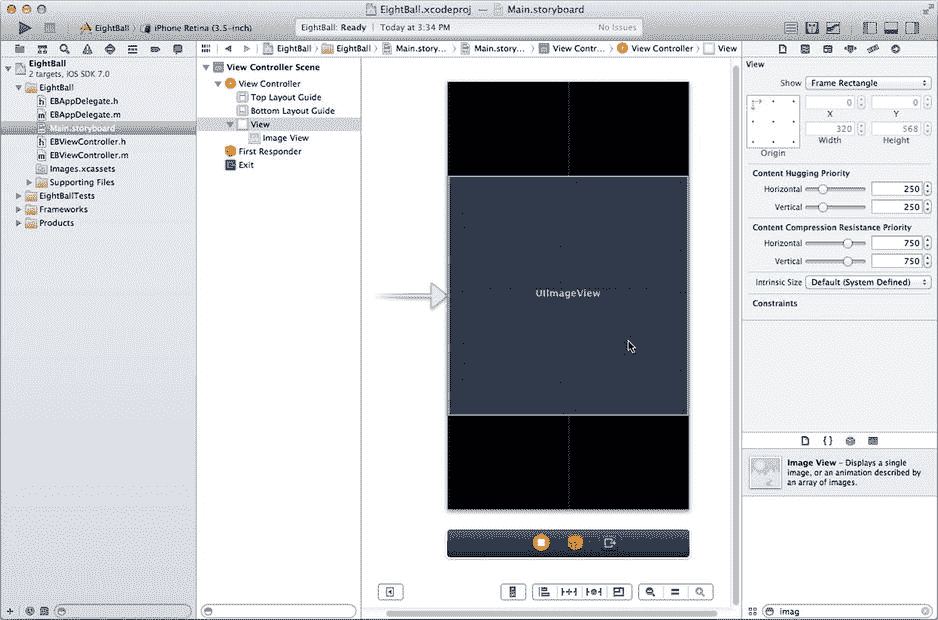

图 4-8.

将图像视图居中

通过 Control+单击/右键单击图像视图并向下拖动一点来设置第一个约束。松开鼠标并选择高度约束（Height constraint）。这将固定图像视图的高度。在解决自动布局问题（Resolve Auto Layout Issues）控件中，选择“在视图控制器中添加缺失的约束”（Add Missing Constraints in View Controller）。Xcode 将添加足够的约束以使其完备。由于视图已在屏幕中居中，Xcode 将添加约束以使其保持居中。

正如你在第 2 章中所做的那样，你将向项目中添加一些资源图像文件。在项目导航器中，选择 `Images.xcassets` 素材目录。在访达中，找到你在第 1 章中下载的 `Learn iOS Development Projects` 文件夹。在 `Ch 4` 文件夹内，你将找到 `EightBall (Resources)` 文件夹，其中包含五个图像文件。选择文件 `eight-ball.png` 和 `eight-ball@2x.png`。确保这些文件和你的工作区窗口可见，然后将这两个图像文件拖入素材目录，如图 4-9 所示。

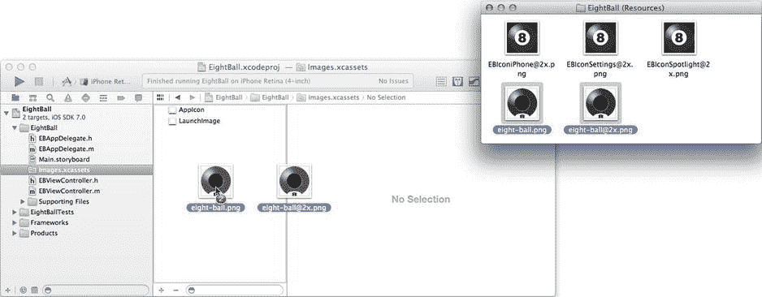

图 4-9.

将八号球图像添加到素材目录

返回你的项目，选择 `Main.storyboard`，然后选中图像视图对象。使用属性检查器将图像属性设置为 `eight-ball`，如图 4-10 所示。

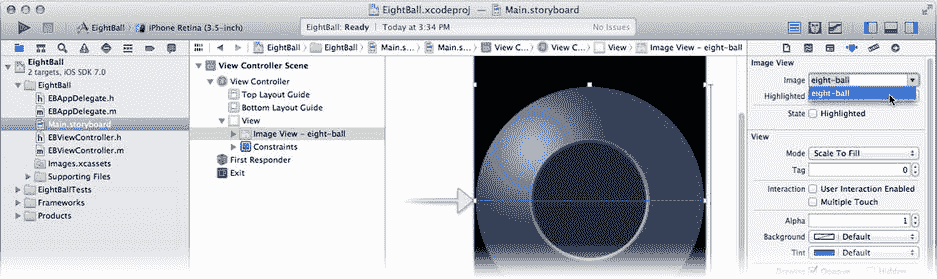

图 4-10.

设置图像

现在你需要添加一个文本视图来显示神奇消息。从对象库中拖入一个新的文本视图（不是文本字段）对象，将其放置在八号球中间的“窗口”上。使用尺寸检查器将文本视图的宽度设置为 `160` 像素，高度设置为 `112`。使用居中参考线将文本视图居中，如图 4-11 所示。

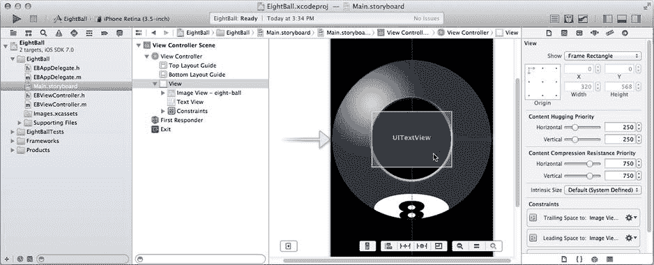

图 4-11.

将文本视图居中

再次使用 Control+单击/右键单击手势，添加以下约束：

*   在文本视图内部向上（或向下）拖动，松开，然后选择一个高度约束（Height constraint）。
*   在文本视图内部向右（或向左）拖动，松开，然后选择一个宽度约束（Width constraint）。
*   从文本视图向上（或向下）拖动到图像视图。选择中心 Y 轴约束（Center Y constraint）。
*   从文本视图向右（或向左）拖动到图像视图。选择中心 X 轴约束（Center X constraint）。

现在文本视图有了固定大小，并将始终在图像视图上居中。

选中文本视图。使用属性检查器设置以下属性：

*   将文本设置为 `SHAKE FOR ANSWER`，共三行（见图 4-12）。按住 Option 键的同时按回车键，可以在文本属性字段中插入字面意义的“回车”字符。
*   将文本视图颜色设为 `white`。
*   点击字体属性中的向上箭头，直到显示为 `System 24.0`。
*   选择居中对齐（中间的对齐方式）。
*   取消选中 `Editable` 行为属性。
*   再往下，找到背景属性并将其设置为 `default`（无背景）。

你的界面设计已完成，应该类似于图 4-12 所示。现在可以继续编写代码了。

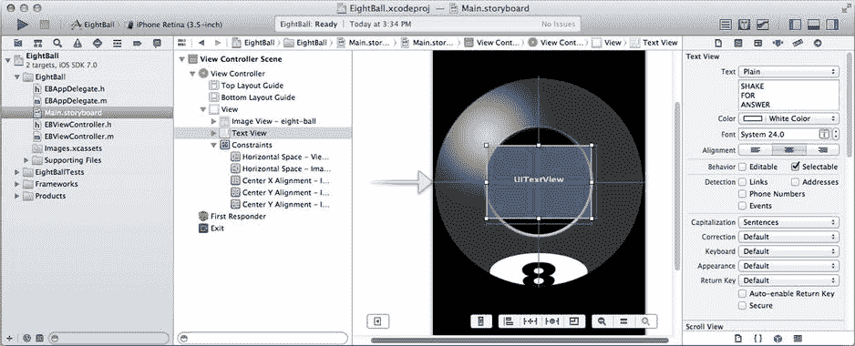

图 4-12.

完成的八号球界面


### 编写代码

你的 `EBViewController` 对象需要与文本视图对象建立连接。选择 `EBViewController.h` 文件，并添加以下属性：

`@property (weak,nonatomic) IBOutlet UITextView *answerView;`

现在，该编写显示消息的代码了。切换到你的实现文件（`EBViewController.m`）。在 `@implementation` 行上方，添加以下代码：

```
static NSString* gAnswers[] = {

@"\rYES",

@"\rNO",

@"\rMAYBE",

@"I\rDON'T\rKNOW",

@"TRY\rAGAIN\rSOON",

@"READ\rTHE\rMANUAL"

};

#define kNumberOfAnswers (sizeof(gAnswers)/sizeof(NSString*))

@interface EBViewController ()

- (void)fadeFortune;

- (void)newFortune;

@end
```

第一条语句创建了一个 `NSString` 字符串对象的静态数组。每个对象都是八球中可能出现的答案之一。`\r` 字符被称为转义序列。它们由一个反斜杠（左斜杠）字符后跟一个代码组成，该代码告诉编译器将序列替换为特殊字符。在本例中，`\r` 被替换为字面意义上的“回车”字符——这是你在源代码中无法通过直接换行输入的内容。

`#define` 创建了一个常量 `kNumberOfAnswers`，它会计算 `gAnswers` 数组中字符串对象的数量。这是通过将数组的总大小（`sizeof(gAnswers)`）除以数组中单个元素的大小（`sizeof(NSString*)`）来实现的。这样做是为了避免手动跟踪 `gAnswers` 数组中的字符串数量。如果你想添加更多答案，只需向数组中添加新元素即可。`kNumberOfAnswers` 宏会自动更新以反映实际数量。

`@interface EBViewController ()` 语句声明了用于更新消息显示的两个方法：`-fadeFortune` 和 `-newFortune`。它们在这里声明，而非在 `EBViewController.h` 中，因为这些是私有方法——不供 `EBViewController` 以外的对象使用。

通过将以下代码添加到你的实现中（即在 `@implementation` 和 `@end` 语句之间），创建你刚刚承诺的两个方法：

```
- (void)fadeFortune

{

[UIView animateWithDuration:0.75 animations:^{

self.answerView.alpha = 0.0;

}];

}

- (void)newFortune

{

self.answerView.text = gAnswers[arc4random_uniform(kNumberOfAnswers)];

[UIView animateWithDuration:2.0 animations:^{

self.answerView.alpha = 1.0;

}];

}
```

`-fadeFortune` 方法使用 iOS 动画将 `answerView` 文本视图对象的 alpha 属性更改为 `0`。视图的 alpha 属性指的是视图显示的不透明度。值为 `1` 表示完全不透明，`0.5` 使其 50% 透明，而值为 `0` 使其完全不可见。`-fadeFortune` 使文本视图对象在 ¾ 秒内逐渐淡出直至消失。

注意

动画的更多细节请参阅第 1 章 11。

`-newFortune` 方法是所有乐趣所在。第一条语句做了三件事：

- 调用 `arc4random_uniform()` 函数，随机选取一个介于 0 到小于 `kNumberOfAnswers` 之间的数字。因此，如果 `kNumberOfAnswers` 是 6，该函数将返回一个介于 0 到 5（含）之间的随机数。
- 使用该随机数作为索引，从 `gAnswers` 数组中选取一个常量 `NSString` 对象。
- 用随机选中的答案设置文本视图对象的文本属性。设置完成后，文本视图对象将在你的界面中显示该文本。

最后，再次使用 iOS 动画，将 alpha 属性在 2 秒内逐渐变回 `1`，从不可见变为不透明，使新消息逐渐显现。

还剩一个小细节：将 `answerView` 输出口连接到界面中的文本视图对象。切换到 `Main.storyboard` 界面构建器文件。选择视图控制器对象，使用连接检查器连接 `answerView` 输出口，如图 4-13 所示。

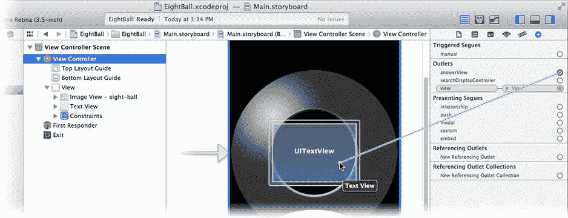

图 4-13. 连接 `answerView` 输出口

### 处理摇动事件

你的应用现在已具备运行所需的一切，唯独缺少触发运行的事件处理。在 Xcode 文档（帮助 ➤ 文档和 API 参考）中，查看 `UIResponder` 的文档。在其中，你将找到三个方法的文档：

```
- (void)motionBegan:(UIEventSubtype)motion withEvent:(UIEvent *)event

- (void)motionEnded:(UIEventSubtype)motion withEvent:(UIEvent *)event

- (void)motionCancelled:(UIEventSubtype)motion withEvent:(UIEvent *)event
```

每个消息会在运动事件的不同阶段发送。运动事件非常简单——请记住这些都是“高层”事件。运动事件开始，然后结束。如果运动被中断或从未完成，你的对象会收到一个运动取消消息。

要在你的视图控制器中处理运动事件，请将这三个事件处理方法添加到 `EBViewController` 的实现中：

```
- (void)motionBegan:(UIEventSubtype)motion withEvent:(UIEvent *)event

{

    if (motion==UIEventSubtypeMotionShake)

        [self fadeFortune];

}

- (void)motionEnded:(UIEventSubtype)motion withEvent:(UIEvent *)event

{

    if (motion==UIEventSubtypeMotionShake)

        [self newFortune];

}

- (void)motionCancelled:(UIEventSubtype)motion withEvent:(UIEvent *)event

{

    if (motion==UIEventSubtypeMotionShake)

        [self newFortune];

}
```

每个方法首先检查 motion 参数，判断收到的运动事件是否是你感兴趣的那个（摇动运动）。如果不是，就忽略该事件。这很重要。未来版本的 iOS 可能会添加新的运动事件；你的对象应该只关注它设计用来处理的事件。

`-motionBegan:withEvent:` 处理方法发送一条 `-fadeFortune` 消息。当用户开始摇动设备时，当前消息会淡出。

`-motionEnded:withEvent:` 处理方法发送 `-newFortune` 消息。当摇动停止时，一条新的命运消息会出现。

最后，`-motionCancelled:withEvent:` 处理方法确保如果运动被中断或被解释为其他手势，仍然有一条消息可见。


### 测试你的八球应用

请确保在方案中选择了 iPhone 模拟器，然后运行你的应用。它将会在模拟器中显示，如图 4-14 所示。

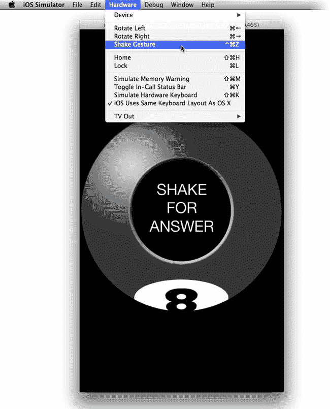

图 4-14. 测试八球应用

在模拟器中选择 `硬件` ➤ `摇动手势` 命令。该命令会模拟用户摇晃设备，从而向你的应用发送摇动动作事件。

恭喜，你已成功创建了一个摇动动作事件处理器！每当你摇动模拟设备时，都会出现一条新消息，如图 4-15 所示。

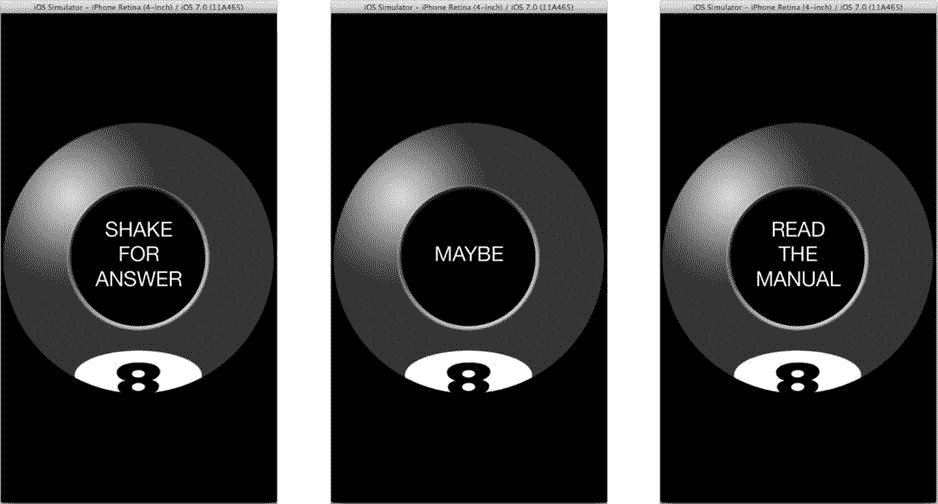

图 4-15. 运行中的八球应用

### 第一响应者与响应者链

从技术上讲，你的视图控制器并不需要成为第一响应者。真正需要的是你的视图控制器能够处于响应者链中。如果你界面中的某个视图或子视图是第一响应者，那么你的视图控制器就会出现在响应者链中，并接收动作事件——除非这些其他视图中的一个先截获并处理了该事件。

默认情况下，你的视图控制器不是第一响应者，也无法成为第一响应者。一个希望成为第一响应者的对象，在收到 `-canBecomeFirstResponder` 消息时必须返回 `YES`。`UIResponder` 的基类实现默认返回 `NO`。因此，任何 `UIResponder` 的子类，除非重写了 `-canBecomeFirstResponder` 方法，否则都没有资格成为第一响应者。

在让你的对象有资格成为第一响应者之后，下一步就是明确请求成为第一响应者。这通常在你的 `-viewDidAppear:` 方法中完成，使用的代码如下：

```
[self becomeFirstResponder];
```

特定的 Cocoa Touch 类——最值得注意的是文本视图和文本字段类——被设计为第一响应者，它们在收到 `-canBecomeFirstResponder` 消息时返回 `YES`。这些对象在触摸或激活时将自己设为第一响应者。作为第一响应者，它们处理键盘事件、复制和粘贴请求等。

此时你可能会疑惑，如果你的视图控制器不是第一响应者，也不在响应者链中，它为何能接收到动作事件？这要归功于 iOS 7。iOS 近期的一些改动使得当没有第一响应者或窗口本身就是第一响应者时，动作事件会被传递给活动的视图控制器。如果你希望你的应用也能在更早版本的 iOS 上运行，那么你需要确保你的视图控制器能够成为第一响应者（通过重写 `-canBecomeFirstResponder`），然后在视图加载时请求成为第一响应者（`[self becomeFirstResponder]`）。

以下是一个演示响应者链如何工作的实验。在 `Main.storyboard` 文件中，选择 `UITextView`，并使用属性检查器勾选“可编辑”行为。运行应用，点击并长按文本字段，待键盘弹出后编辑预言文本。现在选择模拟器的 `硬件` ➤ `摇动手势` 命令。会发生什么？字段中的文本会按照你的程序设定发生变化。

返回 `EBViewController.m` 文件，注释掉所有三个动作事件处理方法。为此，选中这三个方法的文本，然后选择 `编辑器` ➤ `结构` ➤ `注释所选内容`（`Command+/`）。现在再次运行你的应用，选中文本，修改它，然后摇动模拟器。会发生什么？这次你会看到一个“撤销”对话框，询问你是否要撤销对文本所做的修改。

动作事件最初会发送给第一响应者（文本字段），随后经过视图控制器，最终到达 `UIApplication` 对象。`UIApplication` 对象将摇动事件解释为“撤销输入”。通过在视图控制器中拦截这些动作事件，你覆盖了 `UIApplication` 对象提供的默认行为。

通过返回 `EBViewController.m` 并选择 `编辑` ➤ `撤销`，将你的应用恢复原样。对 `Main.storyboard` 也执行相同的操作。

### 最后的润色

用一个精美的图标为你的应用增添光彩。好吧，至少是用你在 `EightBall (资源)` 文件夹中找到的图标。在你的项目导航器中，选择 `images.xcassets` 文件，然后选择 `AppIcon` 组。在 `EightBall (资源)` 文件夹可见的情况下，将三个图标图片文件拖入 `AppIcon` 预览区域，如图 4-16 所示。Xcode 会根据大小自动将合适的图片文件分配给每个图标资源。

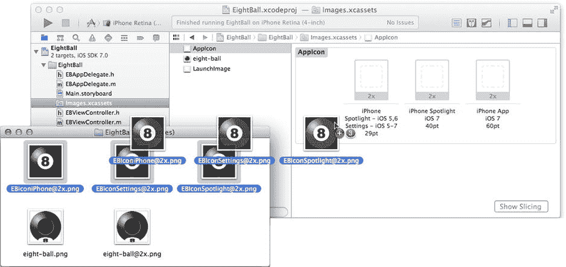

图 4-16. 导入应用图标

**注意：** iOS 7 引入了一套与之前版本 iOS 不同的图标尺寸。如果你打算让应用运行在更早版本的 iOS 上，请查阅 iOS 人机界面指南中的“应用图标”部分，以获取所需图标资源的完整列表及其尺寸。

处理好这个细节之后，让我们通过在实际的 iOS 设备上运行你的应用，来真正地“摇动”一下局面。


