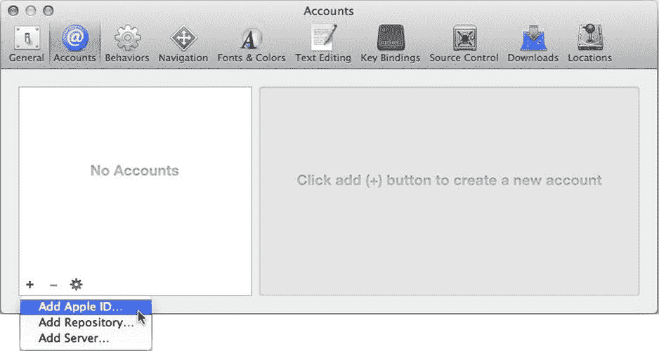
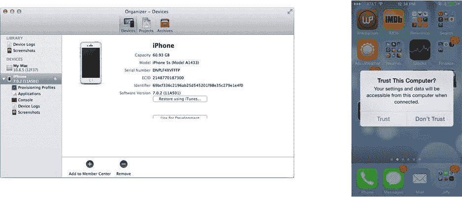
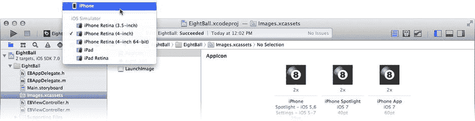

# 在实体 iOS 设备上测试

你可以使用 Xcode 的 iPhone 和 iPad 模拟器来测试应用程序的很多功能，但模拟器无法模拟某些特性。其中两项是多次触摸（超过两次）和真正的加速计事件。要测试这些，你需要一台拥有真实加速计硬件且可以用真实手指触摸的实体 iOS 设备。

第一步是将 Xcode 连接到你的 iOS 开发者账户。选择 Xcode ➤ 偏好设置...，然后切换到 `Accounts` 标签页。点击窗口底部的 + 按钮，选择添加 Apple ID...，如图 4-17 所示。

图 4-17. 向 Xcode 添加新的 Apple ID

输入你的 Apple ID 和密码，然后点击添加按钮。如果你还不是 iOS 开发者计划的成员，有一个方便的“加入计划...”按钮，点击后会跳转到苹果官网。

**注意：** 在设备上运行应用程序之前，你必须是 iOS 开发者计划的成员。请访问 [`http://developer.apple.com/programs/ios`](http://developer.apple.com/programs/ios) 了解如何成为成员。成为成员后，Xcode 将使用你的 Apple ID 下载并安装配置设备所需的安全证书。

将 iPhone、iPad 或 iPod Touch 连接到电脑的 USB 端口。打开 Xcode 组织者窗口（Window ➤ Organizer）。在工具栏中，切换到设备标签页。你连接的 iOS 设备会出现在左侧，如图 4-18 所示。如果设备上出现“信任”对话框，如图 4-18 右侧所示，你需要授予 Xcode 访问设备的权限。

图 4-18. 设备管理

选择你的 iOS 设备，然后点击“用于开发”按钮。Xcode 会为你的设备做好开发准备，这一过程称为配置。这允许你直接通过 Xcode 构建、安装和运行大多数 iOS 项目。

一旦设备配置完成，返回你的项目工作区窗口。将方案设置从某个模拟器更改为你的实际设备。我配置了一台 iPhone，因此 iPhone 会作为运行目标之一出现在图 4-19 中。

图 4-19. 选择用于测试的 iOS 设备

再次运行 EightBall 应用程序。这次，你的应用程序会被构建，复制到你的 iOS 设备上，并开始运行。很酷，不是吗？

神奇的是，Xcode 仍然处于控制之中——所以暂时不要拔掉 USB 连接！你可以设置断点、冻结应用、检查变量，以及执行在模拟器中可以做的任何事情。

当 EightBall 应用运行时，摇晃你的设备，看看会发生什么。完成后，点击 Xcode 工具栏中的停止按钮。你会注意到你的 EightBall 应用现在已经安装在了设备上。你可以自由拔掉 USB 连接并将其带走；毕竟，这是你的应用程序。

