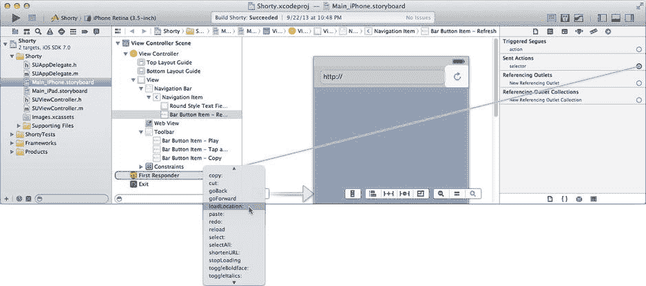

# 响应者链的其他用途

趁你对响应者链的概念还记忆犹新，在深入了解底层事件之前，我想提一下响应者链的其他几个用途。响应者链不仅用于处理事件，它还在动作、编辑和其他服务中扮演着重要角色。

在之前的项目中，你将按钮和文本字段的动作连接到了特定对象。在 Interface Builder 中连接一个动作会设置两部分信息：

- 将接收该动作的对象 (`SUViewController`)
- 要发送的动作消息 (`-shortenURL:`)

也可以将动作发送到响应者链，而不是特定对象。在 Interface Builder 中，你可以通过将动作连接到“第一响应者”占位对象来实现，如图 4-20 所示。

图 4-20. 将动作连接到响应者链

当按钮的动作被发送时，它首先会发送给第一响应者对象——无论该对象是什么。对于动作，iOS 会检查该对象是否实现了预期的消息（在此例中为 `-loadLocation:`）。如果实现了，该对象就会收到该消息。如果没有实现，iOS 就会沿着响应者链向上查找，直到找到一个实现了该消息的对象为止。

这在更复杂的应用中尤其有用，当动作消息的接收者超出了 Interface Builder 文件的范围时。你只能连接同一场景中的对象。如果你需要一个按钮向另一个视图控制器或应用对象本身发送动作，你无法在 Interface Builder 中直接建立连接。但你可以将你的按钮连接到第一响应者。只要当按钮触发其动作时，预期的接收者位于响应者链中，你的对象就能接收到它。

编辑功能也严重依赖于响应者链。当你在 iOS 中开始编辑文本时（比如 Shorty 应用中的 URL 字段），该对象会成为第一响应者。当用户在虚拟或实体键盘上输入时，这些按键事件会被发送给第一响应者。你可以在同一个屏幕上有多个文本字段，但只有一个会成为第一响应者。所有的按键事件、复制粘贴命令等，都会发送给当前激活的文本字段。

