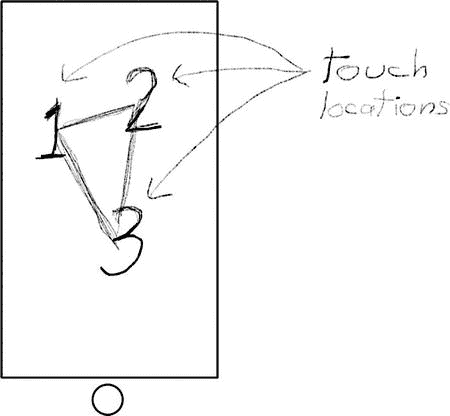
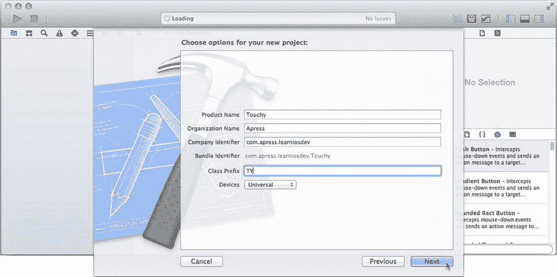
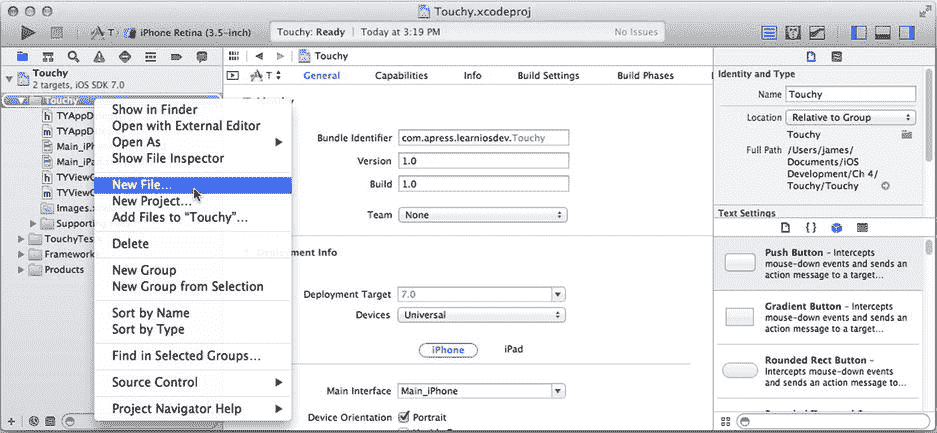
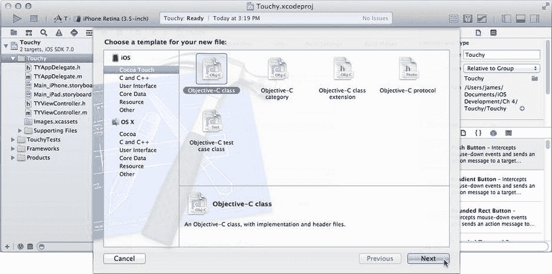
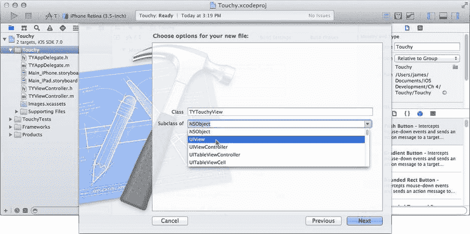
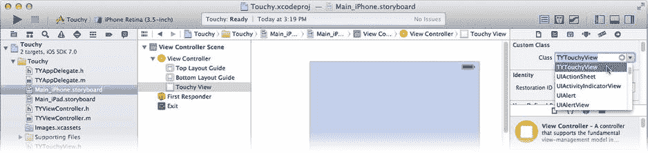
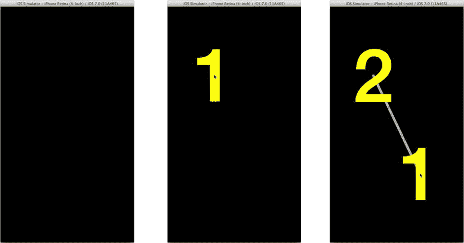

# Touchy

你已经学到了很多关于所谓的高层事件、初始响应者和响应者链的知识。现在是时候深入研究底层事件处理了，我们将从最常用的底层事件开始：触控事件。

Touchy 应用是一个演示应用。它的作用仅仅是向你展示你在屏幕上的触摸位置。通过实际操作观察这一点，并探索触控事件处理的一些细微之处，是非常有用的。你还会学到一项新的、非常重要的 Interface Builder 技能：在你的界面中创建自定义对象。

### 设计

Touchy 应用也有一个超级简单的界面，如图 4-21 所示。Touchy 会显示你触摸视图对象的一个或多个位置。为了不让应用过于乏味，我们会添加一些额外的图形来增色，但这并非本次任务的重点。



图 4-21. Touchy 应用的草图

该应用通过使用一个自定义视图对象来拦截触摸事件。这个自定义视图对象会提取每个活动触摸点的坐标，并用这些坐标来绘制它们的位置。

### 创建项目

像你之前做过多次的那样，首先创建一个基于“Single View iOS 应用模板”的新 Xcode 项目。将项目命名为 `Touchy`，设置类前缀为 `TY`，并选择设备为 `Universal`，如图 4-22 所示。



图 4-22. 创建 Touchy 项目

选择一个位置保存新项目并创建它。在项目导航器中，选择项目，选择 EightBall 目标，选择摘要标签页，然后在支持的界面方向部分关闭两个横向方向，这样只启用纵向方向。


### 创建自定义视图

你将脱离之前在应用中使用过的开发模式。你不会将代码添加到 `TYTouchViewController` 类中，而是创建一个 `UIView` 的新自定义子类。关于“为什么”这么做，已在第 1 章中解释。“如何做”现在就来讲解。

在项目导航器中选择 Touchy 组（而非项目）。从 `File` 菜单中，或者通过右键/Control+单击 Touchy 组，选择 `New File...` 命令，如图 4-23 所示。



图 4-23. 创建新源文件

与项目模板助手类似，Xcode 也为创建单个文件提供了模板。你将创建一个新的 Objective-C 类，因此在 iOS Cocoa Touch 分组中选择 `Objective-C Class` 模板，如图 4-24 所示。



图 4-24. 选择新文件模板

将新文件命名为 `TYTouchyView`，并将其子类更改为 `UIView`，如图 4-25 所示。点击 Next，Xcode 将询问你希望将文件保存在何处。确保勾选了 Touchy 目标。接受默认位置（项目文件夹内），然后点击 Create。这会将两个新文件添加到你的项目中：`TYTouchView.h` 和 `TYTouchyView.m`。



图 4-25. 命名新的 Objective-C 类

你已经成功创建了一个新的 Objective-C 类！该类是 `UIView` 的子类，因此它继承了 `UIView` 对象的所有行为和特性，并且可以在任何可以使用 `UIView` 对象的地方使用。

### 处理触摸事件

现在，你将自定义 `UIView` 对象以处理触摸事件。请记住，基类 `UIResponder` 和 `UIView` 本身并不处理触摸事件，它们只是将事件沿着响应链向上传递。通过实现你自己的触摸事件处理方法，你将改变这一行为，使你的视图直接响应触摸。

如你所知，触摸事件会被传递到它们所发生的视图对象。如果你还不知道这一点，请返回并阅读“命中测试”部分。你所要做的就是在你的类中添加适当的事件处理方法。将以下代码添加到 `TYTouchyView.m` 实现文件中，放在 `@end` 语句之前：

```
- (void)touchesBegan:(NSSet *)touches withEvent:(UIEvent *)event
{
    [self updateTouches:event.allTouches];
}

- (void)touchesMoved:(NSSet *)touches withEvent:(UIEvent *)event
{
    [self updateTouches:event.allTouches];
}

- (void)touchesEnded:(NSSet *)touches withEvent:(UIEvent *)event
{
    [self updateTouches:event.allTouches];
}

- (void)touchesCancelled:(NSSet *)touches withEvent:(UIEvent *)event
{
    [self updateTouches:event.allTouches];
}
```

**注意：** Xcode 会在你的源代码中显示一些错误。暂时忽略它们；当你添加 `-updateTouches:` 方法时，你会修复这些错误。

每个触摸事件消息都包含两个对象。一个 `NSSet` 对象，包含相关的触摸对象；以及一个 `UIEvent` 对象，它概括了导致该消息被发送的事件。

在典型的应用中，你的方法会关注 `touches` 集合。这个集合（或无序集合）中的对象包含一个 `UITouch` 对象，用于与该事件相关的每个触摸。每个 `UITouch` 对象描述一个触摸位置：其坐标、相位、发生时间、点击次数等。

对于“开始”事件，`touches` 集合将包含刚刚开始的触摸对应的 `UITouch` 对象。对于“移动”事件，它将仅包含那些发生移动的触摸点。对于“结束”事件，它将仅包含那些从屏幕上移除的触摸对象。从编程角度来看，这非常方便，因为大多数视图对象只关注与该事件相关的 `UITouch` 对象。

然而，Touchy 应用略有不同。Touchy 希望始终跟踪所有活动的触摸。你实际上并不关心刚刚发生了什么，而是想要“全局视图”：当前与屏幕接触的所有触摸点的列表。为此，转向使用 `event` 对象。

`UIEvent` 对象的主要目的是描述刚刚发生的单个事件；或者更准确地说，是刚刚从事件队列中取出的单个事件。但 `UIEvent` 还携带一些其他有趣的信息。其中之一是 `allTouches` 属性，它包含设备上所有触摸点的当前状态，无论它们与哪个视图相关联。

因此，现在我可以解释你所有的事件处理方法的作用了。它们在等待设备触摸状态的任何变化。它们忽略具体的更改，深入查看 `event` 对象以查找所有活动触摸对象的状态，并将其传递给你的 `-updateTouches:` 方法。该方法将记录所有活动触摸的位置，并利用这些信息在屏幕上绘制这些位置。

那么，我想你需要编写那个方法了！紧挨着你在 `TYTouchyView.m` 中刚添加的触摸事件处理方法的上方，将以下方法添加到你的实现中：

```
- (void)updateTouches:(NSSet*)set
{
    NSMutableArray *array = [NSMutableArray array];
    for ( UITouch *touch in set )
    {
        switch (touch.phase) {
            case UITouchPhaseBegan:
            case UITouchPhaseMoved:
            case UITouchPhaseStationary:
                [array addObject:[NSValue valueWithCGPoint:
                    [touch locationInView:self]]];
                break;
            default:
                break;
        }
    }
    touchPoints = array;
    [self setNeedsDisplay];
}
```

你还应在 `@implementation` 语句之前，在一个私有接口中声明该方法，并且还需要定义一个变量来存储活动的触摸点：

```
@interface TYTouchyView ()
{
    NSArray* touchPoints;
}
- (void)updateTouches:(NSSet*)set;
@end
```

现在，回到 `-updateTouches:` 方法。它首先创建一个空数组对象。这是你将存储所感兴趣信息的地方。`-updateTouches:` 然后遍历集合中的每个 `UITouch` 对象，并检查其相位。触摸的相位是其当前状态：“开始”、“移动”、“静止”、“结束”或“取消”。Touchy 只关心代表手指仍触摸屏幕的状态（“开始”、“移动”和“静止”）。`switch` 语句匹配这三个状态，获取相对于该视图对象的触摸坐标，并将其转换为 `NSValue` 对象（适合添加到集合中）。然后，该 `NSValue` 对象被添加到集合中。

当所有活动触摸坐标都收集完毕后，新的集合被保存在对象的私有 `touchPoints` 变量中。最后，你的视图对象向自身发送 `-setNeedsDisplay` 消息。该消息告诉你的视图对象，它需要重新绘制自身。


### 绘制你的视图

到目前为止，你还没有编写任何绘制内容的代码。你只是拦截了发送给视图的触摸事件，并提取了你想要获取的设备触摸状态信息。在 iOS 中，你并非在事件发生时立即进行绘制。你只是记下需要绘制的内容，然后等待 iOS 通知你的对象何时进行绘制。绘制操作由本章开头提到的用户界面更新事件触发。

关于绘制的工作原理，第 1 章中已有描述，因此这里不再赘述细节。你只需要知道，当 iOS 希望你的视图进行自我绘制时，你的对象会收到一个 `-drawRect:` 消息。将以下 `-drawRect:` 消息添加到你的实现中：

```objective-c
- (void)drawRect:(CGRect)rect
{
    CGContextRef context = UIGraphicsGetCurrentContext();
    [[UIColor blackColor] set];
    CGContextFillRect(context,rect);

    UIBezierPath *path = nil;
    if (touchPoints.count>1)
        {
        path = [UIBezierPath bezierPath];
        NSValue* firstLocation = nil;
        for ( NSValue *location in touchPoints )
            {
            if (firstLocation==nil)
                {
                firstLocation = location;
                [path moveToPoint:location.CGPointValue];
                }
            else
                {
                [path addLineToPoint:location.CGPointValue];
                }
            }
        if (touchPoints.count>2)
            [path addLineToPoint:firstLocation.CGPointValue];

        [[UIColor lightGrayColor] set];
        path.lineWidth = 6;
        path.lineCapStyle = kCGLineCapRound;
        path.lineJoinStyle = kCGLineJoinRound;
        [path stroke];
        }

    unsigned int touchNumber = 1;
    NSDictionary* fontAttrs = @{
        NSFontAttributeName: [UIFont boldSystemFontOfSize:180],
        NSForegroundColorAttributeName: [UIColor yellowColor]
        };

    for ( NSValue *location in touchPoints )
        {
        NSString *text = [NSString stringWithFormat:@"%u",touchNumber++];
        CGSize size = [text sizeWithAttributes:fontAttrs];
        CGPoint touchPoint = location.CGPointValue;
        CGPoint textCorner = CGPointMake(touchPoint.x-size.width/2,
                                         touchPoint.y-size.height/2);
        [text drawAtPoint:textCorner withAttributes:fontAttrs];
        }
}
```

哇，这代码量真不少。同样，细节并不重要，但你可以自由研究这段代码，感受一下它的作用。我仅对其功能进行简要总结。

第一部分用黑色填充了整个视图。

中间部分是一个大循环，用于创建一个贝塞尔路径（以法国工程师皮埃尔·贝塞尔命名）。贝塞尔路径几乎可以表示任何线条、多边形、曲线、椭圆或这些元素的任意组合。基本上，只要是形状，贝塞尔路径就能绘制出来。你将在第 11 章中全面学习贝塞尔路径的知识。在这里，它被用来在触摸点之间绘制浅灰色线条。这纯粹是一个视觉点缀，即使去掉 `-drawRect:` 方法中的这一部分，应用仍然可以正常工作。

最后一部分是重点所在。它遍历触摸坐标，并在屏幕上每个触控手指下方居中绘制一个黄色的巨大数字“1”、“2”或“3”。

现在，你已经拥有了一个自定义的视图类，它可以收集触摸事件、追踪这些事件，并在屏幕上绘制出来。这个难题的最后一块拼图是如何将你的自定义对象添加到界面中。

### 在 Interface Builder 中添加自定义对象

选择你的 `Main_iPhone.storyboard` 文件，然后选择视图控制器场景中唯一的那个视图对象。切换到身份检查器（Identity Inspector）。身份检查器会显示所选对象的类。在本例中，它是项目模板创建的普通 `UIView` 对象。

这里有一个很酷的技巧：你可以使用身份检查器将该对象的类更改为你创建的任何 `UIView` 子类。将视图对象的类从 `UIView` 更改为 `TYTouchyView`，如图 4-26 所示。你可以通过下拉菜单完成此操作，也可以直接输入类名。



图 4-26. 更改 Interface Builder 对象的类

现在，你的应用将不再创建 `UIView` 对象作为根视图，而是创建包含你定义的所有方法、属性、出口和操作的 `TYTouchyView` 对象。你可以在界面中对任何现有对象执行此操作。如果你想创建一个新的自定义对象，请从库中找到基类对象（例如 `NSObject`、`UIView` 等），添加该对象，然后将其类更改为你的自定义类。

你的新 `TYTouchyView` 对象仍有几个属性需要自定义才能正常工作。保持 `TYTouchyView` 对象处于选中状态，切换到属性检查器（Attributes Inspector），然后在“交互”（Interaction）部分勾选“多点触控”（Multiple Touch）选项。默认情况下，视图对象不会接收多点触控事件。换句话说，即使存在多个触摸点，`-touch:withEvent:` 消息也永远不会包含超过一个 `UITouch` 对象。为了让你的视图接收所有触摸事件，你必须启用多点触控选项。

选择 `Main_iPad.storyboard` 文件，并对它进行与 `Main_iPhone.storyboard` 相同的更改。现在，你的应用已经准备好进行测试了。

**注意：** 如果你愿意，也可以给 Touchy 应用添加一个图标。打开 `Touchy (Resources)` 文件夹，找到五个 `TYIcon....png` 文件，然后将它们拖入 `Images.xcassets` 资源目录中的 `AppIcon` 分组，就像你为 EightBall 应用所做的那样。

### 测试 Touchy

将方案设置为 iPhone 或 iPad 模拟器，然后运行你的项目。界面会像图 4-27 左侧所示，一片漆黑，令人感到一丝不安。



图 4-27. 在模拟器中运行 Touchy

点击界面，会出现数字“1”，如图 4-27 中间所示。试着拖动它。Touchy 会追踪触摸界面的所有变化，更新它，然后在每个触摸点的精确位置下方绘制一个数字。

按住 Option 键并再次点击。会出现两个位置，如图 4-27 右侧所示。当你在模拟器中按住 Option 键时，可以测试简单的双指手势。仅使用 Option 键，你可以测试捏合和缩放手势。同时按住 Option 键和 Shift 键，则可以测试双指滑动。

但模拟器的功能仅限于此。要测试其他任何触摸事件组合，你必须在真实的 iOS 设备上运行你的应用。回到 Xcode，停止你的应用，将方案更改为 iOS 设备（iPhone、iPad 或 iPod Touch——你连接的任意设备）。再次运行你的应用。

现在在你的 iOS 设备上试用 Touchy。尝试用两根、三根、四根甚至五根手指触摸。尝试移动它们、抬起一根手指、再放下去。这出奇地有趣。


