# 5. 餐桌礼仪

**摘要**

表格是 iOS 中功能强大且灵活的一种界面元素。它灵活到在许多应用中，表格视图本身就是整个界面。在本章中，你将学习表格视图，并在此过程中掌握一些类组织与对象间通信技巧。到本章结束时，你将了解以下内容：

-   表格视图
-   表格单元格
-   单元格缓存
-   表格编辑
-   通知

本章中你将创建的应用，其代码在 Objective‑C 上的依赖程度将远高于在 Interface Builder 上的依赖。这对表格视图界面来说是典型情况，因为表格视图类已经提供了表格的大部分外观，因此你无需过多设计。（这并不意味着你不能自行设计，我稍后也会讨论这一点。）首先，你需要了解表格视图的外观。

## 表格视图

表格视图是一个 `UITableView` 对象，它负责呈现、绘制、管理和滚动一个垂直的单列行列表。每一行都是表格中的一个元素。各行可以全部相似（同质），也可以彼此有显著差异（异质）。表格可以显示为连续的列表行，也可以将行组织成组。

如果你使用 iPhone、iPad 或 iPod 超过几分钟，你一定见过表格视图的实际应用。事实上，你可能尚未意识到，不少 iOS 应用的界面本身就是表格视图。完成本节学习后，你将能一眼识别出它们。

表格的整体外观由创建表格视图时选择的表格样式决定。其内容则可通过各行本身的样式和布局进一步细化。我先从描述整体表格样式开始。

### 纯表格

纯表格样式（`UITableViewStylePlain`）是你最可能一眼认出是表格视图或列表的样式。图 5-1 左侧的视图是我的“设置”应用快照。区域列表就是纯样式表格视图。每一行显示一个区域。右侧的箭头（称为辅助视图）表示点击该行将导航至另一个列表。

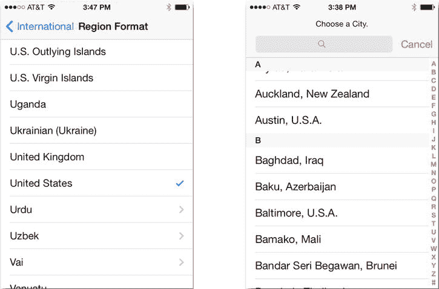

**图 5-1.** 纯表格样式

图 5-1 右侧是一个带有索引的纯样式表格，这是长列表的常见修饰。索引添加了用于对相似项进行分组的分节标签，并提供了一种利用右侧索引快速跳转到列表中特定分组的方法。

另一种较少见的纯表格样式是选择列表样式（未示出）。它看起来就像带分节标题的纯样式表格，但没有索引。它用于从（可能很长的）选项列表中选择一个或多个选项。

### 分组表格

分组表格样式（`UITableViewStyleGrouped`）是另一种表格样式。这种样式将成组的行聚集成组。每个组都有可选的页眉和页脚，允许你在组周围添加标题、描述甚至解释性文本。分组表格的示例见图 5-2。

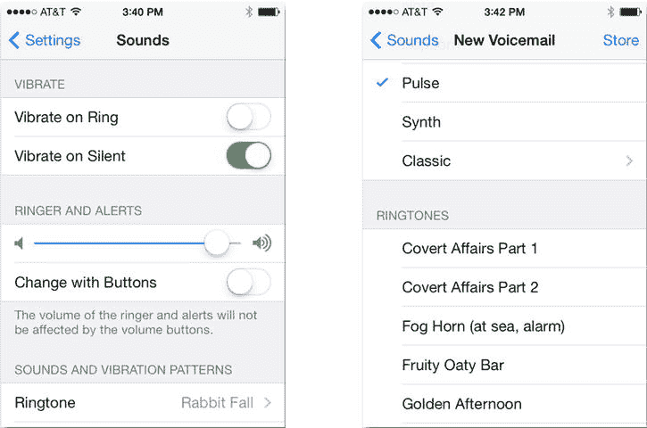

**图 5-2.** 分组表格样式

iPhone 的“设置”应用（见图 5-2）几乎完全由表格视图构建而成。每组上方的标题是组页眉。下方的文本是组页脚。各个设置控件各占表格的一行。它看起来几乎不像一个表格，但它使用的是与图 5-1 相同的 `UITableView` 对象。分组列表没有索引。

你为列表选择的样式设定了表格的整体基调。接下来，在每个单独行的外观方面，你还有众多选择。

### 单元格样式

表格视图单元格对象控制着每一行的外观和内容。iOS 提供了几种预设的表格单元格样式：

-   默认
-   副标题
-   值 1
-   值 2

默认样式（`UITableViewCellStyleDefault`）是基础样式，如图 5-3 所示。

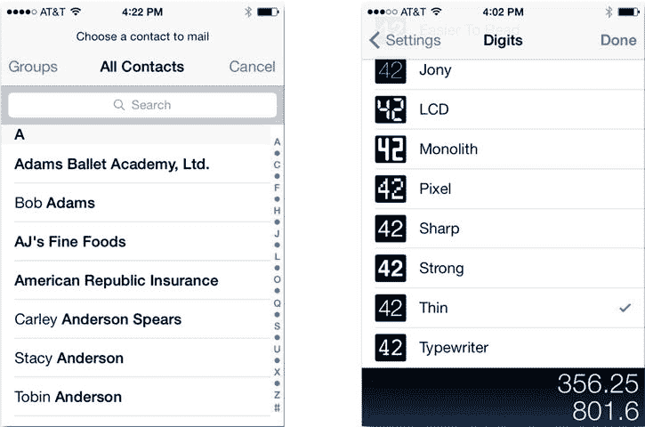

**图 5-3.** 默认单元格样式

默认样式拥有一个粗体标题。它可以选择性地包含一个位于左侧的小图像。右侧的箭头、勾选标记或控件称为辅助视图，稍后我将进行讨论。

第二种主要的单元格样式是副标题样式（`UITableViewCellStyleSubtitle`），如图 5-4 所示。它与默认样式几乎相同，但在每个标题下方还显示一行弱化的文本。副标题文本也是可选的。如果你省略副标题，它看起来就会像默认样式。

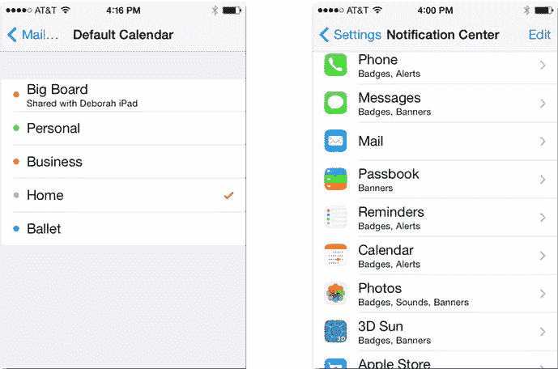

**图 5-4.** 副标题单元格样式

最后两种样式是值 1 和值 2 样式（`UITableViewCellStyleValue1` 和 `UITableViewCellStyleValue2`），如图 5-5 所示。值 1 样式（图 5-5 左侧）通常用于显示一系列值或设置；单元格的标题描述该值，右侧的字段显示当前值。

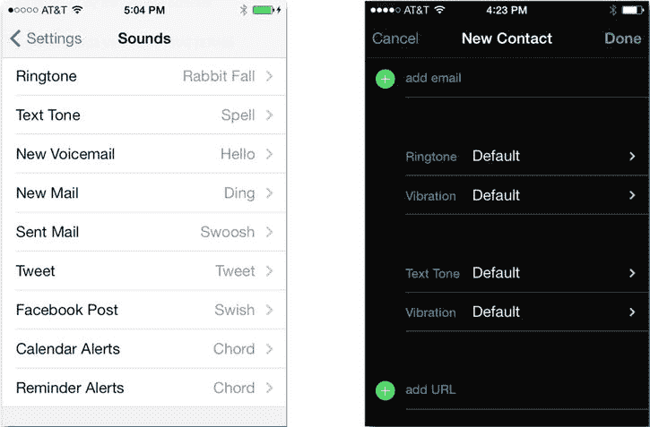

**图 5-5.** 值 1 和值 2 单元格样式

另一种样式值 2 更强调值本身，而弱化其标题，如图 5-5 右侧所示。你会在“通讯录”应用中看到这种单元格样式。值 1 和值 2 单元格样式都不允许显示图像。

### 单元格辅助视图

在所有标准单元格样式的右侧，是可选的辅助视图。iOS 提供了三种标准辅助视图，如图 5-6 所示。

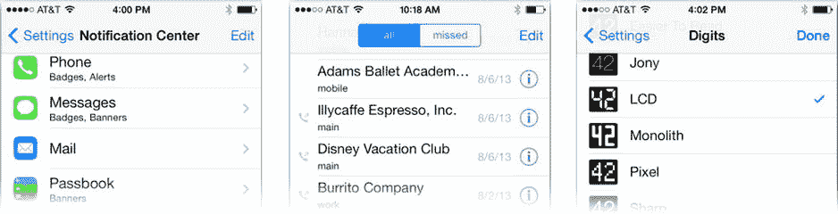

**图 5-6.** 标准辅助视图

标准辅助视图（按图 5-6 从左到右的顺序）分别是展开指示器、详细展开按钮和勾选标记。前两个用于表示点击行或按钮将会展开（即导航至）另一个显示该行详情的屏幕或视图。嵌套列表通常采用这种方式组织。例如，在一个国家表格中，每一行导航至另一个列出该国主要城市的表格。

展开指示器不是一个控件。它表示点击行内任意位置将导航至一些附加信息，就像国家/城市示例那样。然而，详细展开按钮是一个常规按钮。你必须点击辅助视图按钮才能导航至详情。这解放了行本身，使其可用于其他目的。电话应用的最近通话表格就是这种方式（见图 5-6 中部）；点击一行即向该人拨打电话，而点击详细展开按钮则导航至其联系人信息。

勾选标记正是其字面含义，用于指示某行已被选中或标记，具体用途不限。

单元格的辅助视图也可以设置为你选择的控件视图（例如开关切换控件）。这在显示设置的表格中非常常见（见图 5-2）。


好的，作为一名高级文档工程师和翻译员，我将严格遵守您提供的格式规范，完成以下翻译任务。


### 自定义单元格

两种表格视图样式、四种单元格样式以及各种辅助视图提供了极大的灵活性。如果你仔细浏览苹果的通讯录、设置和音乐应用，你会惊讶地发现，其界面（按我的计数，有几十种）仅仅是内置表格和单元格样式的不同组合，并巧妙地使用了可选的图像、副标题和辅助视图。

你还会注意到一些不符合我所描述的任何样式的单元格。在表格单元格的手牌中，有一张万能牌：你可以设计自己的单元格。`UITableCell` 对象是 `UIView` 的一个子类。因此，理论上，一个表格单元格可以包含你想要的任何视图对象，甚至是你使用 Objective-C 和 Interface Builder 自行设计的自定义对象。所以，如果标准样式不能完全满足你的需求，请不要担心，你随时可以创建自己的样式。

现在你已经了解了可能性，是时候更深入地研究表格的工作原理了。

## 表格视图的工作原理

到目前为止，你应用中的每个视觉元素都是一个视图对象。换句话说，你在设备上看到的内容与应用中的 `UIView` 对象之间存在着一一对应的关系。然而，表格视图对这种安排存在一些问题，而表格视图类提供了一个巧妙的解决方案。

一个为每一行都创建一个单元格对象的表格视图，在行数较多时会遇到许多问题。不难想象一个包含几百个名字的联系人列表，或一个包含几千首歌曲的音乐列表。如果表格视图必须为每一首歌曲创建一个单元格对象，它会压垮你的应用，消耗大量内存，需要很长的创建时间，并最终导致界面反应迟钝且笨重。为了避免所有这些问题，表格视图使用了一些巧妙的手法。

### 表格单元格与橡皮图章

如果你曾在县书记官处归档过文件，或者在通用产品代码（UPC）条形码出现之前逛过超市，你应该对橡皮图章的概念很熟悉。这种图章可以通过拨盘或可移动的部件来更改，以盖上特定的日期或价格。如果县书记官要为每个日期都准备一个不同的橡皮图章，那将是非常荒谬的。同样，表格视图并不会为每一行都创建单元格对象。它们只会创建一个单元格对象——或者至少是非常少的数量——然后重复使用这个单元格对象来绘制表格中的每一行，有点像橡皮图章。

图 5-7 展示了重复使用单元格对象的概念。此图中只有三个（主要的）视图对象：一个 `UITableView` 对象、一个 `UITableViewCell` 对象和一个数据源对象。表格视图重复使用这一个单元格对象来绘制每一行。

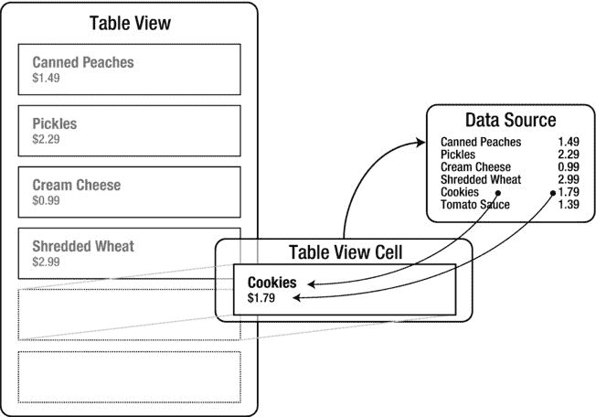

图 5-7. 可重用的单元格对象

表格视图通过使用委托对象来实现这一点，就像你在 Shorty 应用中使用过的委托对象一样。当你创建一个表格视图对象时，必须为其提供一个数据源对象。你的数据源对象实现了特定的委托方法，当表格视图想要获取一个配置好的、用于绘制特定行的单元格对象时，就会发送这些方法。

继续用橡皮图章来类比，假设你有一个表格视图想要打印一份产品及其价格的列表。它首先将橡皮图章（单元格对象）交给你的（数据源）对象，并说：“请为列表中的第一个产品配置这个图章。” 然后你的对象设置图章的属性（产品名称和价格），并将配置好的图章交还给表格视图。表格视图使用这个图章来打印第一行。接着，它转身为第二行重复此过程，依此类推，直到所有行都被打印出来。

使用这种技术，一个表格视图可以绘制出数千行高的表格，而只使用少数几个对象。它快速、灵活，且异常高效。

## MyStuff

你将创建一个名为 MyStuff 的个人物品清单应用。这是一个相对简单的应用，用于管理你拥有的物品列表，记录每件物品的名称以及存放位置（客厅、厨房等）。

### 设计

这个应用的设计比前两个稍微复杂一些。由于 iPhone 和 iPad 的差异，使得设计变得有些复杂。苹果的邮件应用在 iPhone 和 iPad 上的外观差异很大。这是因为 iPhone 只有足够的屏幕空间来舒适地一次显示一个内容——要么是消息列表，要么是消息内容。而在 iPad 上，则有足够的空间同时显示两者。底层应用逻辑非常相似，但视觉设计却大相径庭。你必须在视觉设计中，并在一定程度上在逻辑设计中考虑到这一点。先从 iPhone 设计开始，如图 5-8 所示。

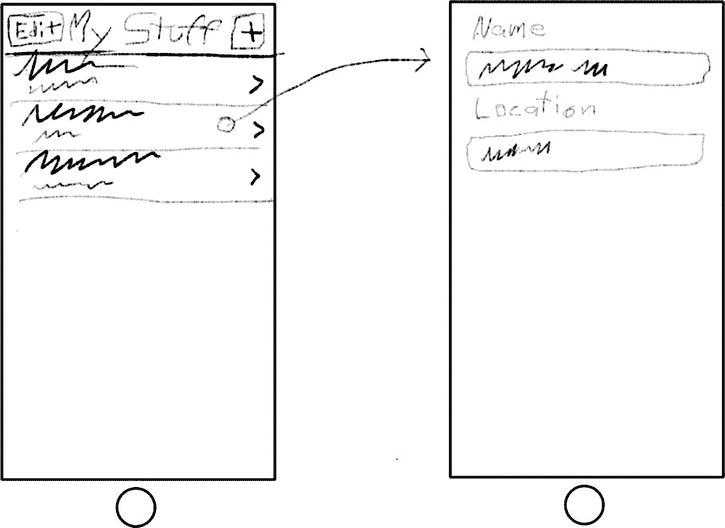

图 5-8. MyStuff for iPhone 的设计草图

iPhone 设计很简单，也是表格视图工作的典型方式。主屏幕是你的物品列表，列出了它们的描述和位置。点击一个物品会导航到第二个屏幕，你可以在那里编辑这些值。

iPad 设计则不那么结构化。在横屏方向，物品列表将显示在左侧，如图 5-9 所示。点击一个物品会使其详细信息显示在右侧，并可以在那里进行修改。在竖屏方向（未显示），物品详情会占据整个屏幕，而物品列表则变成一个弹出视图，用户可以通过屏幕左上角的按钮来访问。

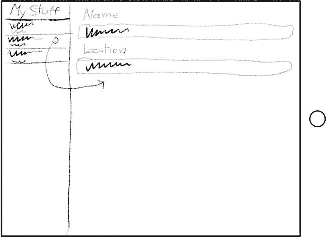

图 5-9. MyStuff for iPad 的设计草图

如果这个界面看起来很眼熟，那是因为苹果的邮件应用使用的就是同样的界面。这个界面的编程并不简单，但你很幸运；Xcode 有一个应用模板，其中包含实现此设计所需的所有代码。你只需要填充细节，而这正是你接下来要做的。

### 创建项目

与所有应用一样，首先在 Xcode 中创建一个新项目。这次，选择 Master Detail iOS 应用模板，如图 5-10 所示。

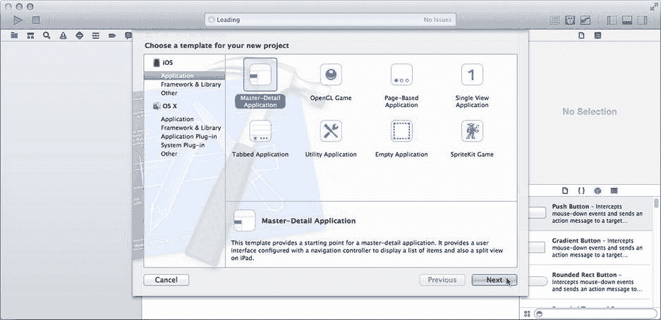

图 5-10. 创建一个 Master Detail 应用

Master Detail 模板之所以如此命名，是因为计算机开发者就是这样称呼这类界面的。列表是你的主视图，显示所有数据的摘要。主视图会跳转到一个辅助的详细视图，该视图可能显示该物品的更多详细信息，或提供编辑它的工具。

将项目命名为 `MyStuff`，给它一个类前缀 `MS`，并确保 `Use Core Data` 处于关闭状态。将设备选项设置为 `Universal`。点击 Next 并将你的新项目文件夹保存到某个位置。

你会注意到的第一件事是，这个项目中已经包含了很多代码。Master Detail 模板包含了显示物品列表、导航到详情界面、创建新物品、删除物品以及处理方向变化所需的所有代码。其表格的内容是简单的 `NSDate` 对象。你的任务就是将这些占位符对象替换为有实际意义的内容。

提示：你最好花点时间仔细阅读项目模板中包含的代码。在导航、方向变化、呈现弹出视图等方面，它“做对了所有事情”。你将在第 12 章中了解更多关于导航的内容。


### 创建你的数据模型

你知道自己想要展示一个“物品”列表——也就是你拥有的各个物品。而且你知道每个物品至少需要两个属性：`name`（名称）属性和 `location`（位置）属性，两者都是字符串。那么用什么对象来表示每个物品呢？这是一个非常重要的问题，因为这个神秘的对象（或对象集）就是所谓的数据模型。你的数据模型由这些对象组成，它们代表表视图所展示的任何概念。

> **注**：关于数据模型的理论与实践在第 8 章中有所描述。

显然，Cocoa Touch 框架并不包含这种对象，所以你必须自己创建一个！在项目导航器中，选择导航器顶部的 `MyStuff` 文件夹（而非项目）。从文件菜单中，或通过右键/Ctrl+单击该文件夹，选择 **New File...** 命令。

在模板助手中，选择 iOS Cocoa Touch 组，然后选择 Objective‑C 类模板。点击 **Next**。将类命名为 `MyWhatsit`，并将其设置为 `NSObject` 的子类，如图 5-11 所示。

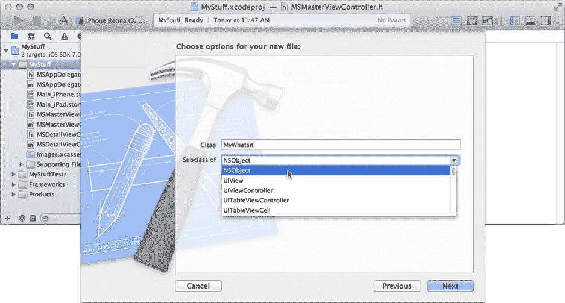

**图 5-11.** 创建 `MyWhatsit` 类

点击 **Next**，接受默认位置（`MyStuff` 项目文件夹），然后点击 **Create**。现在，你的应用中有了一个名为 `MyWhatsit` 的新类对象。在导航器中选择 `MyWhatsit.h` 接口文件。它看起来相当空旷。这个对象类将代表你拥有的每个物品。每个物品都需要一个 `name` 和一个 `location` 属性。通过向其接口添加以下内容来定义这些属性：

```objc
@property (strong,nonatomic) NSString *name;
@property (strong,nonatomic) NSString *location;
```

恭喜，你现在有了一个数据模型。你还希望创建 `MyWhatsit` 对象时，其名称和位置并非空白，因此定义一个 `init` 方法，该方法通过一条语句创建对象并设置这两个属性。（这不是强制要求，但能使部分代码编写更简便。）首先，将以下方法声明添加到你的接口文件中：

```objc
- (id)initWithName:(NSString*)name location:(NSString*)location;
```

切换到你的 `MyWhatsit` 实现文件（`MyWhatsit.m`）。初始化（或简称“init”）方法是对象的构造方法。它们负责正确实例化该类的新实例。每个类都继承了基本的 `-init` 方法，但许多类定义了更复杂的初始化方法，你也可以自由创建自己的初始化方法。

所有 init 方法都遵循一个明确的模式或约定。每个 `-init` 方法必须：

1. 首先向其父类发送适当的 `-init` 消息。
2. 将返回值赋给 `self`，并检查其是否为 `nil`。
3. 如果 `self` 不为 `nil`，则初始化任何特定于类的属性。
4. 向调用者返回 `self`。

Xcode 为常见编程任务提供了一个代码片段库，`-init` 方法模式也不例外。在实用工具面板中显示代码片段库（**视图** ➤ **实用工具** ➤ **显示代码片段库**）。找到 Objective‑C init 方法代码片段，如图 5-12 所示。

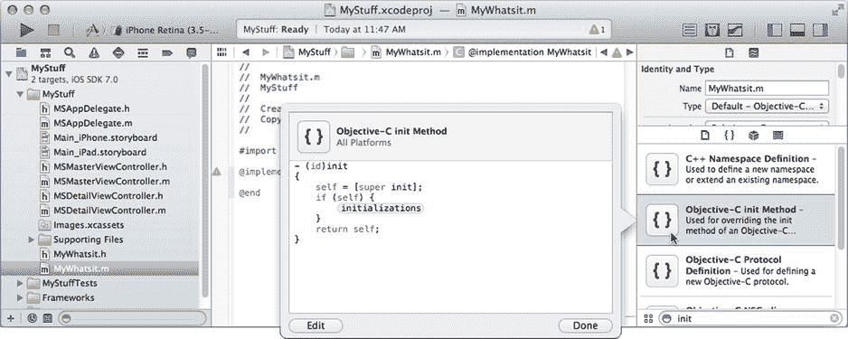

**图 5-12.** Objective‑C init 方法代码片段

将该片段拖入你的 `MyWhatsit.m` 文件的 `@implementation` 部分。将通用的 `- (id)init` 声明替换为你的声明：

```objc
- (id)initWithName:(NSString*)name location:(NSString*)location
```

按住 Control 键并按下 `/`（正斜杠）键。此编辑器快捷键会跳转到 `-init` 方法模板中的占位符。代码片段通常包含需要你用代码替换的占位符。此导航命令让你直接跳转到它们。将占位符替换为：

```objc
self.name = name;
self.location = location;
```

完成后，你的实现应如图 5-13 所示。

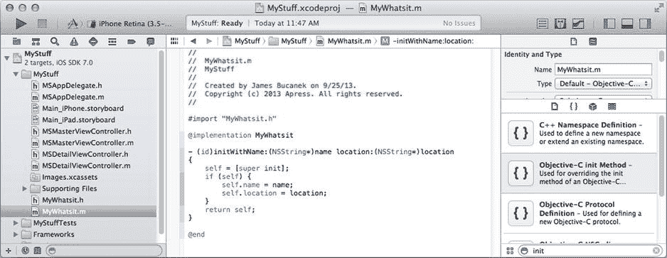

**图 5-13.** 完整的 `MyWhatsit` 实现

现在你已经有了数据模型，下一步任务是教表视图类如何使用它。


### 创建数据源

表格视图对象（`UITableView`）有两个代理属性。其 `delegate` 属性的工作方式与你之前章节中使用的代理类似。表格视图代理是可选的。如果你选择使用它，它必须连接到一个遵循 `UITableViewDelegate` 协议的对象。

表格视图的另一个代理是其数据源对象。为了让表格视图正常工作，你必须将其 `dataSource` 属性设置为一个遵循 `UITableViewDataSource` 协议的对象。这个代理不是可选的——没有它，你的表格将无法显示任何内容。

数据源的工作是为表格视图提供排列和显示表格内容所需的所有信息。至少，你的数据源必须：

*   报告表格中的行数
*   为每一行配置表格视图单元格（橡皮图章）对象

数据源还可以向表格视图提供许多可选信息。你这个应用的数据源不需要实现这些，但以下是一些你可以自定义的内容：

*   将行组织成组
*   显示分区标题
*   提供索引（用于索引列表）
*   为分组表格提供自定义的页眉和页脚视图
*   控制哪些行是可选的
*   控制哪些行是可编辑的
*   控制哪些行是可移动的

正如你在 Shorty 应用中看到的，一个类可以遵循多个协议，并且可以成为多个对象的代理。类似地，你的视图控制器对象可以同时遵循 `UITableViewDelegate` 和 `UITableViewDataSource` 协议，并充当表格视图的代理和数据源。这种安排在设计简单时很常见，并且正是 Master Details 项目模板为你设置好的。点击 `Main_iPhone/iPad.storyboard` 文件，找到 `Master View Controller` 场景，并选择表格视图对象。使用连接检查器，你会看到它的 `delegate` 和 `dataSource` 出口都已连接到 `Master View Controller`（即你的 `MSMasterViewController` 对象）。

选择 `MSMasterViewController.m` 实现文件，查看其中定义的方法。为了让表格视图正常工作，你的数据源对象必须实现以下两个必需的方法：

`- (NSInteger)tableView:(UITableView *)tableView numberOfRowsInSection:(NSInteger)section;`

`- (UITableViewCell *)tableView:(UITableView *)tableView cellForRowAtIndexPath:(NSIndexPath *)indexPath;`

每当表格视图想知道表格中特定分区有多少行时，就会向你的数据源对象发送第一条消息。记住，有些表格可以分组为多个分区，每个分区有不同数量的行。对于一个简单的表格（比如你的），只有一个分区（`0`），所以只需返回总行数即可。

你将把 `MyWhatsit` 对象存储在一个数组中。`MSMasterViewController` 中已经定义了一个，但让我们重命名它。在 `MSMasterViewController.m` 文件的顶部，找到 `@interface` 部分，选中 `_objects` 实例变量，右键/Control+单击它，然后从弹出菜单中选择 Refactor ➤ Rename ...，如图 5-14 所示。

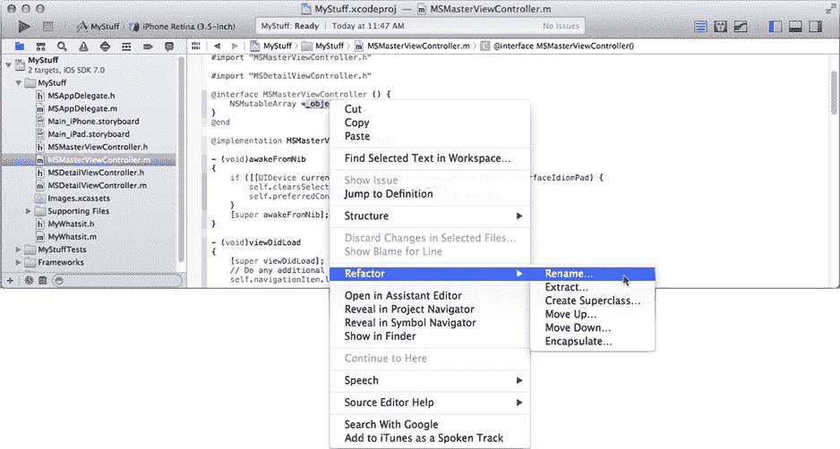

图 5-14.

重命名变量

Xcode 的重构系统使得重命名、提升和降级方法、拆分类等操作相对无痛。在重命名对话框中，将名称从 `_objects` 改为 `things`，然后点击 Preview 按钮。Xcode 会找到对该变量的所有引用，并显示一个对话框，展示源代码在提议更改前后的样子，如图 5-15 所示。点击 Save 按钮。（Xcode 可能会要求对你的项目进行快照；接受它，这是个好主意。）

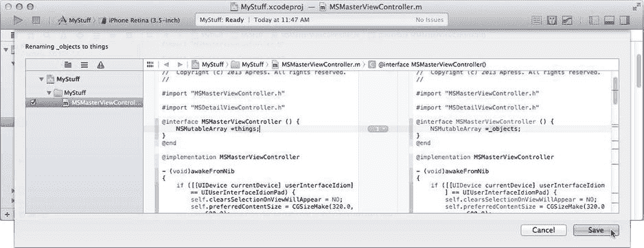

图 5-15.

预览变量名更改

那么，我为什么让你更改 `_objects` 的名字？有两个原因。首先，如果你为变量选择的名字具有特定含义，代码会更易于理解。变量 `_objects` 对我来说有点过于通用。其次，你不应该创建以下划线开头的变量名。我知道不是你命名的，但它仍然让我感到困扰。

**提示**

Apple 保留了所有以下划线开头的符号名称。Objective‑C 编译器保留了所有以两个下划线开头的符号名称。为避免名称冲突，不要以单个或双下划线开头命名你的变量、类或预处理器名称。Master Detail 模板之所以能这么做，是因为该模板是由 Apple（而不是你）开发的。

现在，是时候看看这两个必需的数据源方法了。

### 实现你的橡皮图章

找到 `-tableView:numberOfRowsInSection:` 方法。它看起来像这样：

```
- (NSInteger)tableView:(UITableView *)tableView numberOfRowsInSection:(NSInteger)section
{
    return things.count;
}
```

这里无需更改。这个方法已经准确完成了你需要它做的事：返回表格中的行数（`MyWhatsit` 对象）。

继续看 `-tableView:cellForRowAtIndexPath:` 方法。当前代码如下所示：

```
- (UITableViewCell *)tableView:(UITableView *)tableView
         cellForRowAtIndexPath:(NSIndexPath *)indexPath
{
    UITableViewCell *cell = ↪
                     [tableView dequeueReusableCellWithIdentifier:@"Cell"
                                                     forIndexPath:indexPath];
    NSDate *object = things[indexPath.row];
    cell.textLabel.text = [object description];
    return cell;
}
```

这就是你的橡皮图章。每当表格视图要绘制一行时，你的对象就会收到此消息。你的工作是准备一个 `UITableViewCell` 对象，用于绘制该行并将其返回给发送者。这分两步完成。第一步是获取要使用的 `UITableViewCell` 对象。暂时忽略这一步；我将在下一节（“表格单元缓存”）中描述这个过程。

第二步是配置单元格，使其正确绘制该行。最后三条语句就是完成这一步的地方。目前，它期望从数组中获取一个 `NSDate` 对象，并将单元格的标签设置为其 `description`。这就是你需要替换的代码。但首先，你的 `MSMasterViewController.m` 文件需要知道你的 `MyWhatsit` 对象。在文件顶部，紧接其他 `#import` 语句下方，添加以下代码行：

`#import "MyWhatsit.h"`

现在回到你的 `-tableView:cellForRowAtIndexPath:` 方法，并将方法中的最后三条语句替换为：

```
MyWhatsit *thing = things[indexPath.row];
cell.textLabel.text = thing.name;
cell.detailTextLabel.text = thing.location;
return cell;
```

现在，你的橡皮图章将获取要绘制的行对应的 `MyWhatsit` 对象（从 `indexPath` 对象中获取），并将其存储在 `thing` 变量中。然后，它使用 `name` 和 `location` 属性来设置单元格的 `textLabel`（标题）和 `detailTextLabel`（副标题）。

**注意**

表格视图使用 `NSIndexPath` 对象来识别表格中的行。`UITableView` 使用的 `NSIndexPath` 对象具有 `section` 和 `row` 属性，可以明确标识每一行。由于你的表格只有一个分区，你可以忽略 `section` 属性；它将始终为 `0`。

你返回的单元格将用于绘制该行。这是简单部分。现在回过头来，再看看该方法的第一部分。


### 表格单元格缓存

在橡皮图章的比喻中，我曾说过表格视图“递给你一个橡皮图章，并要求你配置它”。我撒谎了——至少是有点。表格视图并不会直接给你单元格对象供你使用，因为它不知道你需要哪种类型的单元格对象。相反，单元格对象是由故事板或你编写的代码创建的，表格视图会保留它以便你下次重复使用。这就是所谓的表格单元格缓存。

使用表格单元格缓存有三种方式：

*   让故事板创建单元格对象
*   根据需要，以编程方式懒加载创建单元格对象
*   完全忽略缓存

在本应用中，你将采用第一种方法。Master Detail 项目模板已经定义了一个单一的表格单元格对象，其标识符为`"Cell"`。选择`Main_iPhone.storyboard`文件，并在`Master View Controller`场景中选择表格视图对象，如图 5-16 所示。

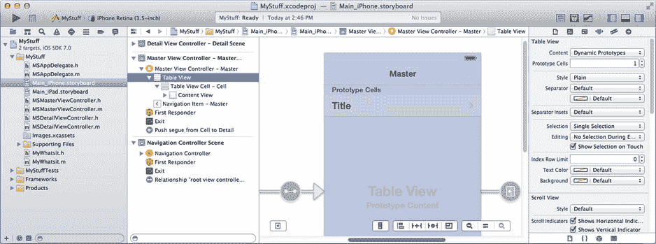

图 5-16.

包含原型表格单元格的表格视图

在表格视图的顶部，你会看到一个`Prototype Cells`区域。在这里，Interface Builder 可以让你设计表格视图将要使用的单元格对象。`Prototype Cells`的计数（如图 5-16 右侧的属性检查器中所示）声明了你的表格需要多少种不同的单元格对象。你只需要一种。

点击这唯一的一个原型单元格模板，如图 5-17 所示。现在你正在编辑一个单一的表格单元格对象。注意`Identifier`属性被设置为`Cell`；这用于在缓存中标识该单元格，并且必须与你传递给`-dequeueReusableCellWithIdentifier:forIndexPath:`消息的标识符完全一致。

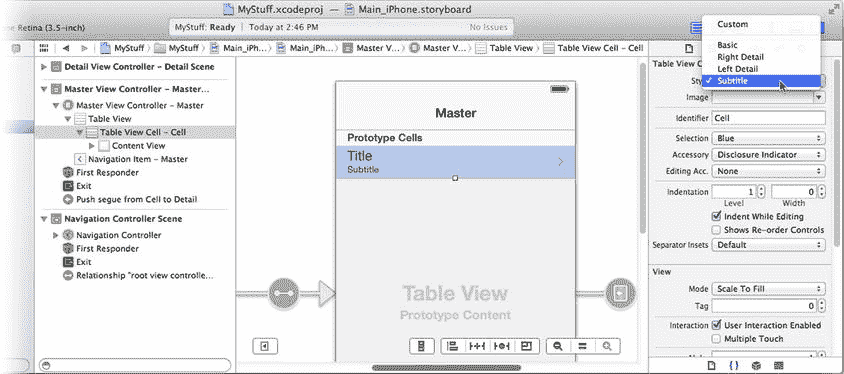

图 5-17.

编辑表格单元格原型

你的表格将显示对象的名称及其位置。符合这种描述的标准单元格类型是副标题样式（`UITableViewCellStyleSubtitle`）。将单元格的样式更改为`Subtitle`，如图 5-17 的右上角所示。

你的表格视图设计就完成了。你已经定义了一个标识符为“Cell”的单一单元格对象，它使用了副标题表格单元格样式。

#### 单元格对象标识符与重用

表格单元格缓存让你的`-tableView:cellForRowAtIndexPath:`方法能够高效地重用表格单元格视图对象，并且有多种不同的使用方式。

一种极端情况是，你根本不需要使用缓存。你的`-tableView:cellForRowAtIndexPath:`方法可以在每次被调用时都返回一个新的单元格对象。这对于行数非常少，且每行都完全不同的情况是合适的——例如你在“设置”应用中看到的界面类型。

另一种更传统的方式是，根据需要以编程方式创建你的表格单元格视图对象。这也被称为懒加载对象创建。实现方式是检查你需要的单元格对象是否已在缓存中，如果不在，则创建一个。实现此功能的代码如下所示：

```
id cellIdent = @"LazyCell"; // 在此选择合适的单元格

UITableViewCell *cell;

cell = [tableView dequeueReusableCellWithIdentifier:cellIdent];

if (cell==nil)

{

cell = [[UITableViewCell alloc] initWithStyle:UITableViewCellStyleSubtitle

reuseIdentifier:cellIdent];

// 在此进行一次性的单元格视图配置

cell.accessoryType = UITableViewCellAccessoryDisclosureIndicator;

}
```

这段代码向表格单元格缓存请求，查询具有该标识符的单元格是否已被添加。如果没有，消息将返回`nil`，表明缓存中不存在这样的对象。你的代码通过创建一个新的单元格对象并分配同一个单元格标识符来响应。当你将这个单元格对象返回给表格视图时，它会自动将其添加到缓存中。下次，该单元格视图对象就会存在于缓存中了。

第三种替代方案是，使用`-registerClass:forCellReuseIdentifier:`或`-registerNib:forCellReuseIdentifier:`消息，向表格注册一个单元格视图类或 Interface Builder 文件。完成此操作后，对于具有该标识符但不在缓存中的单元格的请求，将自动为你创建一个。（这本质上就是使用故事板设计原型单元格时发生的事情。）

通过使用单元格标识符，你还可以维护少量不同的单元格对象。在你的`MyStuff`应用中，也许有一天你会决定为《星球大战》纪念品设计一种行样式，而为你从祖母那里得到的东西设计另一种行样式。你需要为每个单元格对象分配其自己的标识符（例如`@"Cell"`、`@"Star Wars"`、`@"Me Ma"`）。然后，表格单元格缓存会保存所有这三种单元格对象，并在你发送`-dequeueReusableCellWithIdentifier:`消息时返回对应的那一个。要使用故事板实现这一点，请将`Prototype Cells`计数设置为 3，并为每个原型单元格分配一个唯一的标识符。

你可以自由地混合搭配使用这些技术。单个表格可以有一部分单元格视图对象定义在故事板中，另一部分注册为通过类名创建，而你的代码则可以懒加载创建其余部分。

趁现在，将导航栏中的名称从`Master`改为`My Stuff`。双击表格视图上方导航栏中的“Master”标题即可实现（见图 5-17）。现在，你已经实现了在表格视图中显示`MyWhatsit`对象所需的所有代码。但还缺一样东西……

### 数据在哪里？

你现在可以运行你的应用了，但它不会显示任何内容。这是因为你没有任何可显示的`MyWhatsit`对象。更糟糕的是，你还没有编写任何用于创建或编辑对象的代码，所以如果你尝试创建一个，你的应用将会崩溃。

我在这类情况下的解决方案是作弊：以编程方式创建几个测试对象，以便界面有内容可以显示。在`MSMasterViewController.m`中找到`-awakeFromNib`方法。这个消息会发送给任何由 Interface Builder 文件创建的对象。它让你有机会执行在 Interface Builder 中无法完成的任何额外设置。

该方法中的最后一条语句是`[super awakeFromNib]`。紧接在这条语句之前，添加以下代码（以粗体显示）：

```
things = [@[

            [[MyWhatsit alloc] initWithName:@"Gort"

                                   location:@"den"],

            [[MyWhatsit alloc] initWithName:@"Disappearing TARDIS mug"

                                   location:@"kitchen"],

            [[MyWhatsit alloc] initWithName:@"Robot USB drive"

                                   location:@"office"],

            [[MyWhatsit alloc] initWithName:@"Sad Robot USB hub"

                                   location:@"office"],

            [[MyWhatsit alloc] initWithName:@"Solar Powered Bunny"

                                   location:@"office"]

            ] mutableCopy];

[super awakeFromNib];
```

这段代码创建了五个新的`MyWhatsit`对象，并将它们组装成一个数组对象。然后，该数组的可变版本被赋值给`things`属性变量。现在，当你的控制器首次被创建时，它将拥有一组可显示的`MyWhatsit`对象。


### 测试 `MyStuff`

将方案设置为某个 iPhone 模拟器并运行您的 App。您的`MyWhatsit`对象表格视图将会显示出来，如图 5-18 左侧所示。

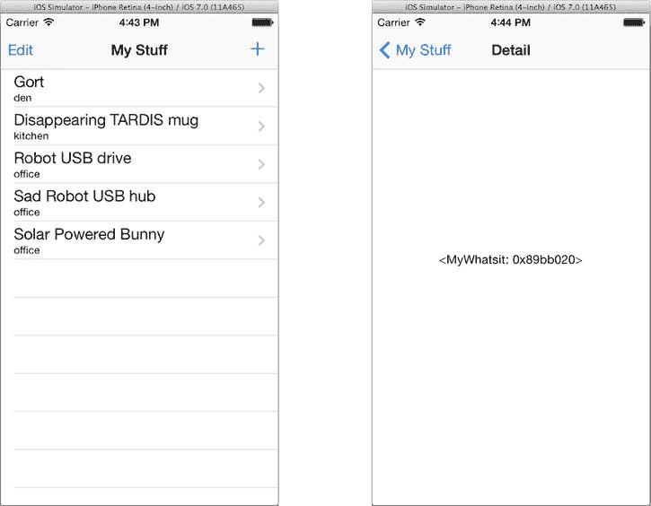

图 5-18 可正常工作的表格视图

这非常棒！您已经创建了自己的数据模型对象，并实现了在表格视图中显示自定义对象集所需的所有功能，还使用了您选择的单元格格式。

但很明显，这个 App 还没有完成。如果您点击其中一行，会看到一个意义不大的新屏幕（图 5-18 右侧），这显然不是您设计的一部分。

下一步是设计您的详情视图。之后，您将实现编辑列表和单个条目所需的代码。

## 添加详情视图

现在您已进入主从设计的后半部分。您的详情视图由`MSDetailViewController`对象控制。`MSDetailViewController`是一个普通的`UIViewController`，它加载`Detail View Controller`场景中的视图对象。您需要创建标签和文本字段对象来显示和编辑您的`MyWhatsit`属性。您还需要在`MSDetailViewController`中创建 Interface Builder 输出口，以便与这些文本字段连接，并在 Interface Builder 中将它们与对应的对象连接起来。这些操作现在应该已经驾轻就熟了，让我们开始吧。

### 创建详情视图

从 iPhone 界面开始。选择`Main_iPhone.storyboard`文件，然后选择 Detail View Controller 对象，如图 5-19 所示。选中并删除视图中的标签对象，您不需要它。

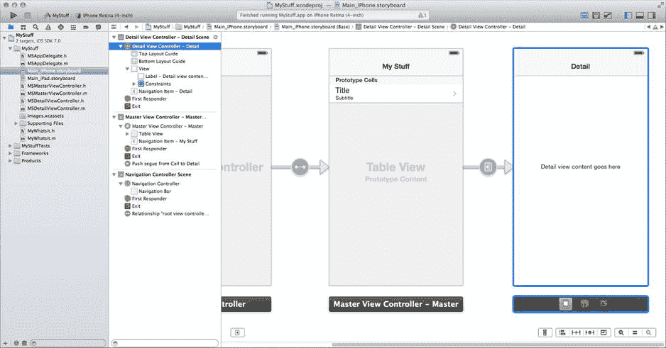

图 5-19 模板详情视图

在对象库中，找到标签对象并向您的视图中添加两个。找到文本字段对象并添加两个。将一个标签的文本设置为`Name`，另一个设置为`Location`。排列并调整它们的大小，使您的界面看起来像图 5-20 所示。选择“Editor” ➤ “Resolve Auto Layout Issues” ➤ “Reset to Suggested Constraints in Detail View Controller”命令。

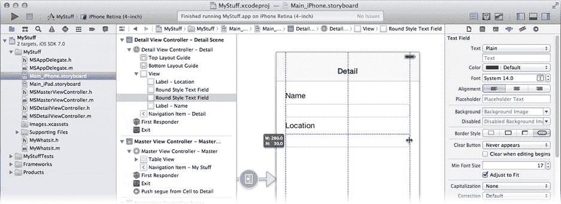

图 5-20 完成的详情视图

切换到`MSDetailViewController.h`接口文件。在`#import`语句下方，添加另一条（以便编译器知道您的`MyWhatsit`类）：

`#import "MyWhatsit.h"`

更改`detailItem`属性的类型，使其专门指向`MyWhatsit`对象：

`@property (strong,nonatomic) MyWhatsit *detailItem;`

删除现有的`detailDescriptionLabel`属性，并用两个新的输出口属性替换：

`@property (weak,nonatomic) IBOutlet UITextField *nameField;`

`@property (weak,nonatomic) IBOutlet UITextField *locationField;`

切换回`Main_iPhone.storyboard`文件。选择`Detail View Controller`对象，并使用连接检查器将两个新的输出口（`nameField`和`locationField`）连接到界面中对应的文本字段对象，如图 5-21 所示。

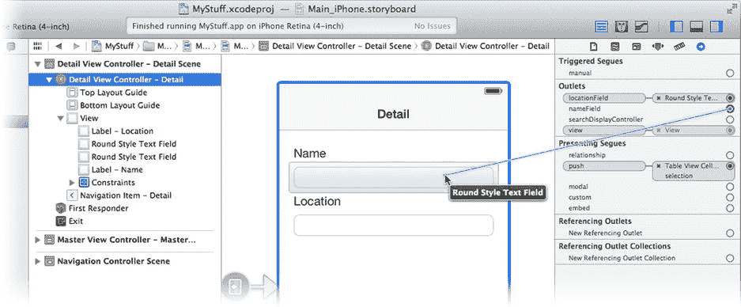

图 5-21 连接文本字段输出口

### 配置详情视图

您可能会问，`MyWhatsit`对象的值将如何传递到您刚刚创建的两个`UITextField`对象中。这是个极好的问题。这将在用户点击表格视图中的某一行时发生。从点击到显示详情视图的大部分代码已经为您编写好了（作为主从 Xcode 模板的一部分），但理解其工作原理非常重要。让我们梳理一下点击某一行时的过程。

在 iPhone 上，点击一行会触发一个“push”转场，将详情视图滑动到屏幕上。这个 push 转场——即图 5-19 中连接主视图和详情视图的箭头——是主从项目模板预定义的。您也可以从原型单元格按住 Control/右键拖拽到您希望该单元格导航到的场景，来创建自己的转场。

就在转场发生之前，您的视图控制器会收到一条`-prepareForSeque:sender:`消息。现在在您的`MSMasterViewController.m`文件中找到这个方法。从此视图到其他视图的所有转场都会发送同一条消息。通过检查`seque.identifier`属性，您可以判断哪个转场正在发生——前提是您为每个转场分配了唯一的标识符。在此例中，您需要关注的是`"showDetail"`转场。

下一步是准备要显示的新视图。现有代码从`things`数组中获取要编辑的对象。不幸的是，这是模板代码，它认为数组中包含的是`NSDate`对象。请将其更改为`MyWhatsit`对象，如下所示（修改后的代码以粗体显示）：

`MyWhatsit *object = things[indexPath.row];`

其余代码不需要任何修改。它获取`MyWhatsit`对象，并用它来设置目标视图控制器的`detailItem`，而您知道目标视图控制器就是`MSDetailViewController`。由于您已经将`detailItem`的类型改为`MyWhatsit`，两个对象类型一致，编译器警告会消失。

在 iPad 上，代码路径略有不同。iPad 上没有转场，因为主列表和详情视图同时可见。点击`Main_iPad.storyboard`文件，请注意原型单元格没有转场或展开指示器。相反，您的主视图控制器会拦截用户点击列表中单元格的操作，并更新已经可见的详情视图。

每当用户点击一个单元格，表格视图的委托对象会收到一条`-tableView:didSelectRowAtIndexPath:`消息。在您的`MSMasterViewController.m`文件中找到这个方法。现有代码首先判断当前是否为 iPad。如果是，它会执行与`-prepareForSeque:sender:`完全相同的任务，同样也是错误的。请对`-prepareForSeque:sender:`进行同样的修改，将`NSDate`改为`MyWhatsit`。

注意

`-tableView:didSelectRowAtIndexPath:`消息是发送给表格视图的委托对象的，而不是发送给其数据源对象的。实际上，这是您的`MSMasterViewController`类实现的唯一表格视图委托方法。如果您不需要这条消息，那么您根本不需要表格视图委托对象。

顺着事件链，在`MSDetailViewController.m`实现文件中找到`-setDetailItem:`方法。当您为`detailItem`属性赋值时（即执行`self.detailViewController.detailItem = object`时），`MSDetailViewController`就会收到这条消息。

提示

按住 Command 键并点击某个符号，可以跳转到该项目中该符号的定义位置。例如，在表达式`self.detailViewController.detailItem`中，按住 Command 键并点击符号`detailItem`，Xcode 会立即跳转到`-setDetailItem:`方法。


`-setDetailItem:`方法将其内部的`_detailItem`变量设置为要显示的新对象。然后它向自身发送`-configureView`消息。这就是您要找的消息（即使您尚未意识到）。`-setDetailItem:`消息的其余部分处理从 iPad 界面弹出列表中选择项目的情况。

每当您的详情视图控制器需要准备显示新的`MyWhatsit`对象时，就会接收到`-configureView`消息。这是您需要重写的方法，以便您的`MyWhatsit`属性值能够显示在界面中。将`-configureView`编辑为如下所示：

```
- (void)configureView
{
    if (self.detailItem != nil)
    {
        self.nameField.text = self.detailItem.name;
        self.locationField.text = self.detailItem.location;
    }
}
```

这个新方法检查`detailItem`对象是否已设置。如果已设置，它会使用`nameField`和`locationField`连接来将两个文本字段的内容设置为`MyWhatsit`对象的`name`和`location`属性值。

至此，(iPhone)详情视图完成！当用户点击一行时，代理会获取该行的`MyWhatsit`对象，将其传递给您的`MSDetailViewController`，然后`MSDetailViewController`会向自身发送`-configureView`消息，使这些值显示在视图中。接着`MSDetailViewController`成为活动视图，您的详情内容就会显示出来，如图 5-22 右侧所示。

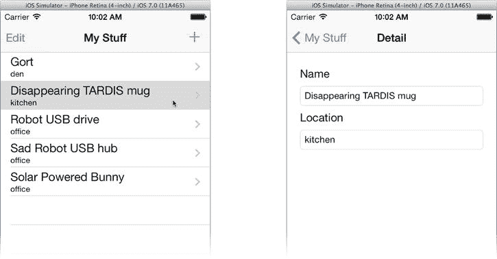

图 5-22. 正常工作的详情视图

剩下的唯一任务就是完善 iPad 详情视图。与之前的项目类似，大部分工作已经完成。在您的`Main_iPhone.storyboard`文件中，复制刚刚添加的四个视图对象；拖出一个矩形选中两个标签和两个文本字段，然后选择“编辑”➤“拷贝”。现在切换到您的`Main_iPad.storyboard`文件。删除现有的标签对象，在空白视图中点击一次，以便 Xcode 知道粘贴对象的位置，然后选择“编辑”➤“粘贴”。调整它们的位置和大小，使其适合 iPad 界面，如图 5-23 所示。从“解决自动布局问题”按钮中选择“在详情视图控制器中重置为建议的约束”。选中详情视图控制器，使用连接检查器连接`nameField`和`locationField`插座。

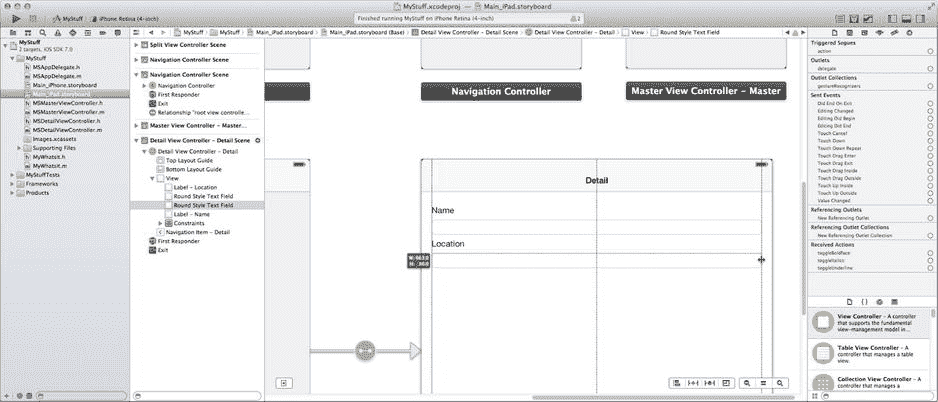

图 5-23. 完成的 iPad 详情视图

您还需要在 iPad 的表格视图中进行与 iPhone 表格视图中相同的修改。找到“主视图控制器”场景（带有表格视图的那个）。选择原型表格单元格视图对象，将其样式更改为`Subtitle`（见图 5-17）。将导航标题从“Master”更改为“My Stuff”。

现在在 iPad 模拟器中运行您的项目。iPad 界面有很大的不同。在竖屏模式下，您会看到详情视图而不是表格视图（见图 5-24 左侧）。通过“Master”按钮（见图 5-24 中间）可以访问表格视图。

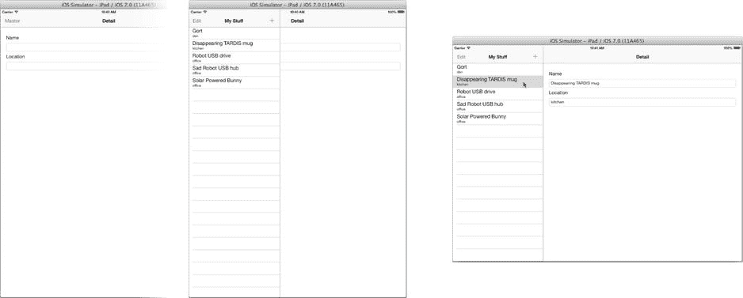

图 5-24. 在 iPad 上运行的 MyStuff

如果将 iPad 横过来（在模拟器中选择“硬件”➤“向左旋转”），您会得到一个分屏视图，左侧是表格视图，右侧是详情视图（见图 5-24 右侧）。

提示

如果您希望“Master”按钮显示为“My Stuff”（与导航栏标题一致），请在`MSDetailViewController.m`中找到分屏视图控制器的代理方法，并将`barButtonItem`的`title`改为`"My Stuff"`（即`barButtonItem.title = @"My Stuff"`）。模板代码使用本地化宏来分配标题，我将在第 22 章中解释。现在可以忽略它。

您可能会注意到，您可以编辑文本字段，但它们不会改变任何内容。应用开发的最后一步是设置对`MyWhatsit`对象的编辑功能，允许用户创建新对象、修改它们以及删除不需要的对象。

## 编辑

我不想撒谎；编辑功能很复杂。但这并不意味着您无法处理它，而且您即将为 MyStuff 添加编辑功能。不过别担心，您已经拥有了巨大的先发优势。表格视图和集合类承担了大部分繁重的工作，由于主从项目模板，支持表格编辑所需编写的大部分代码已经包含在您的应用中。您仍然需要编写一些代码，但主要是理解已经编写好的内容以及各个部分如何协同工作。

编辑表格可以归结为几个基本任务：

*   创建并在表格中插入新项目
*   从表格中移除项目
*   重新排列表格中的项目
*   编辑单个项目的详细信息

您的应用将允许添加新项目、移除现有项目以及编辑项目的详细信息。默认情况下，表格中的项目无法重新排序。您可以根据需要启用该功能，但这里不需要。

iOS 为标准表格中删除和重新排序项目提供了标准界面。您可以通过滑动行来单独删除项目，如图 5-25 左侧所示，或者点击“编辑”按钮进入编辑模式。在编辑模式下，点击行旁边的减号按钮将删除该行。点击“完成”按钮将使表格视图恢复正常查看模式。iOS 还提供了一个标准的“加号”按钮，供您触发添加新项目。

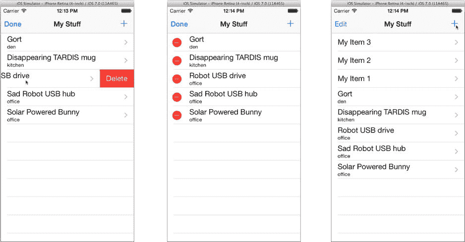

图 5-25. 表格编辑界面

这些界面是表格视图类的一部分。您唯一需要做的是设置界面对象来触发这些操作。您将首先提供添加新对象的代码，然后我将描述启用表格编辑的设置，最后您将编写代码来编辑单个`MyWhatsit`对象的属性。


### 插入和移除项目

向列表插入新项目分为两步：

1.  创建新对象并将其添加到集合中。
2.  通知表视图你添加了一个新对象及其添加位置。

“主从模板”包含一个名为 `-insertNewObject:` 的操作方法，用于完成上述步骤。但模板代码并不了解你的数据模型，因此你需要做一些小调整来创建正确类型的对象。

在 `MSMasterViewController.m` 实现文件中，找到 `-insertNewObject:` 方法。模板代码大致如下：

```
- (void)insertNewObject:(id)sender
{
    if (!things)
        things = [[NSMutableArray alloc] init];
    [things insertObject:[NSDate date] atIndex:0];
    NSIndexPath *indexPath = [NSIndexPath indexPathForRow:0 inSection:0];
    [self.tableView insertRowsAtIndexPaths:@[indexPath]
                          withRowAnimation:UITableViewRowAnimationAutomatic];
}
```

前两行代码懒加载创建了你的 `NSMutableArray` 集合。这处理了当前对象是集合中第一个添加对象的情况；在此之前，你可能还没有一个集合数组。

**注意：** 在你的应用中，以目前的状态来看，这段代码永远不会被执行，因为你在控制器初始化期间已经显式创建了一个充满测试数据的数组集合。在后续版本的应用中你会移除那段代码，因此保留这段代码是个好主意。

下一行代码满足了向表格添加新项目的第一步。它创建了一个新对象并将其添加到集合的开头（通过插入到索引 0 处）。唯一的问题是，它创建的对象类型不对。用以下代码替换该行：

```
static unsigned int itemNumber = 1;
NSString *newItemName = [NSString stringWithFormat:@"My Item %u",itemNumber++];
MyWhatsit *newItem = [[MyWhatsit alloc] initWithName:newItemName location:nil];
[things insertObject:newItem atIndex:0];
```

你的代码为新项目生成了一个唯一的名称（以“My Item 1”开头），使用该名称创建了一个新的 `MyWhatsit` 对象，并将该新对象插入到集合中。

**提示：** 如果你希望新项目出现在列表末尾而不是开头，可以将新对象插入到数组末尾（使用 `-addObject:`），然后告诉表视图它被添加到了末尾（使用 `[NSIndexPath indexPathForRow:things.count-1 inSection:0]`）。

其余代码保持不变。你仍然将对象插入到集合的开头，因此通知表视图的代码无需更改。

现在，你可能想知道 `-insertNewObject:` 消息是在何时、如何被发送的。毕竟，你没有在任何地方发送它，它也不是在任何 Interface Builder 文件中创建的对象。这个问题的答案可以在下一节中找到。

### 启用表格编辑

若要允许你表格中的任何行被删除（即通过标准的 iOS 编辑功能），你的数据源对象必须告知表视图允许这样做。如果不这样做，iOS 将不允许删除该行。你的数据源通过其可选的 `-tableView:canEditRowAtIndexPath:` 方法实现此功能。“主从模板”为你提供了该方法：

```
- (BOOL)tableView:(UITableView *)tableView canEditRowAtIndexPath:(NSIndexPath *)indexPath
{
    return YES;
}
```

模板提供的方法允许你表格中的所有行都可编辑。默认情况下，“可编辑”意味着它可以被删除。如果你不希望某行可以被编辑，则返回 `NO`。

**注意：** 从技术上讲，`-tableView:canEditRowAtIndexPath:` 消息仅决定某行是否可以被编辑。如果可以，那么表视图委托对象将通过其可选的 `-tableView:editingStyleForRowAtIndexPath:` 方法决定是否可以编辑以及如何编辑。你在此使用的默认编辑样式允许该行被删除（`UITableViewCellEditingStyleDelete`）。

如果 `-tableView:canEditRowAtIndexPath:` 对某行返回 `YES`，iOS 将允许通过滑动手势删除该行。如果你还想为整个列表启用“编辑模式”（每行显示减号），你可以在 `UITableViewController`（你的 `MSMasterViewController` 继承自它）提供的导航栏中进行连接。iOS 提供了所有必需的按钮对象以及大部分所需的行为。你只需要启用它们即可。在你的 `MSMasterViewController` 实现中，找到 `-viewDidLoad` 方法。该方法开头应如下所示：

```
- (void)viewDidLoad
{
    [super viewDidLoad];
    self.navigationItem.leftBarButtonItem = self.editButtonItem;
    UIBarButtonItem *addButton = [[UIBarButtonItem alloc]
        initWithBarButtonSystemItem:UIBarButtonSystemItemAdd
        target:self
        action:@selector(insertNewObject:)];
    self.navigationItem.rightBarButtonItem = addButton;
}
```

第一行代码调用了父类的 `-viewDidLoad:` 方法，以便父类可以在视图对象加载时执行其需要执行的操作。

下一行代码创建了你在导航栏左侧看到的“编辑”按钮（见图 5-23）。它将左侧按钮设置为视图控制器的 `editButtonItem`。`editButtonItem` 属性是一个预配置的 `UIBarButtonItem` 对象，已设置为启动和停止其表格的编辑操作。

用于创建和插入新项目的按钮需要稍微多一点设置，但也不算多。下一行代码创建了一个新的 `UIBarButtonItem`。它将具有标准的 iOS “+” 符号（`UIBarButtonSystemItemAdd`）。当用户点击它时，它将向此对象（`self`）发送一条 `-insertNewObject:` 消息。最后一行代码将新的工具栏按钮添加到导航栏的右侧。

就是这样！这些代码将编辑按钮和“+” 按钮添加到你的表格导航栏中。“编辑”按钮会自行处理，而你已将“+” 按钮配置为在点击时向控制器对象发送 `-insertNewObject:` 消息。在上一节中，你重写了 `-insertNewObject:` 来插入正确类型的对象。

现在是时候尝试一下了。将你的 scheme 设置回 iPhone 模拟器并运行你的应用。尝试滑动某行，或使用“编辑”按钮。通过点击“+” 按钮添加一些新项目。你的成果应该如图 5-23 所示。

还有最后一个你应该注意的细节。添加新对象时，你的代码创建了对象，将其添加到数据模型，然后告诉表视图你所做的操作。删除行时，表视图决定要删除哪些行。那么，实际的 `MyWhatsit` 对象是如何从 `things` 数组中移除的呢？这发生在这个已为你编写好的数据源委托方法中：

```
- (void)tableView:(UITableView *)tableView
commitEditingStyle:(UITableViewCellEditingStyle)editingStyle
forRowAtIndexPath:(NSIndexPath *)indexPath
{
    if (editingStyle == UITableViewCellEditingStyleDelete) {
        [things removeObjectAtIndex:indexPath.row];
        [tableView deleteRowsAtIndexPaths:@[indexPath]
                         withRowAnimation:UITableViewRowAnimationFade];
    } else if (editingStyle == UITableViewCellEditingStyleInsert) {
        // ... 在此处插入项目 ...
    }
}
```

当用户编辑表格并决定删除（或插入）某一行时，通过向你（数据源对象）发送此消息来传达该请求。你的数据源对象必须检查 `editingStyle` 参数以确定发生了什么（例如，某一行正在被删除），并采取相应的操作。删除行时应采取的操作是从数组中移除对应的 `MyWhatsit` 对象，并让表视图知道你所做的操作。

以上就是编辑表格所需的全部代码。现在是时候将拼图的最后一大块就位了：编辑单个项目的详细信息。


### 编辑详情

要编辑某个条目的详细信息，你需要执行以下步骤：

- 创建一个视图，让用户能看到所有详细信息。
- 使用表格中所选条目的属性来设置该视图的值。
- 记录对这些值的更改。
- 用新信息更新表格。

好消息是，其中一半的工作你已经完成了。你已经修改了 `MSDetailViewController` 来显示 `MyWhatsit` 对象的 `name` 和 `location` 属性，并且添加了代码，用所选条目的属性值来填充文本字段（`-configureView`）。现在你只需添加一些代码来完成接下来的两个步骤，你的应用就基本完成了。

先从 iPhone 界面开始——因为 iPad 界面的工作方式会稍有不同。创建一个动作（action），用于响应 `name` 和 `location` 文本字段的更改。首先，在 `MSDetailViewController.h` 中添加一个方法原型：

`- (IBAction)changedDetail:(id)sender;`

在 `MSDetailViewController.m` 实现文件中，添加具体的方法：

```
- (IBAction)changedDetail:(id)sender
{
    if (sender == self.nameField)
        self.detailItem.name = self.nameField.text;
    else if (sender == self.locationField)
        self.detailItem.location = self.locationField.text;
}
```

当 `name` 或 `location` 文本字段被编辑时，这个动作方法会被接收。由于无法直接判断是哪个字段触发了消息，所以代码中将 `sender` 参数（触发动作消息的对象）与你的两个文本字段连接进行对比。如果匹配其中一个，你就知道是哪个文本字段发送了消息，并用新值更新相应的 `MyWhatsit` 属性。

在 Interface Builder 中，将两个文本字段的 `Editing Did End` 消息连接到此动作。选择 `Main_iPhone.storyboard` 文件。选择名称属性文本字段。使用连接检查器，将其 `Editing Did End` 事件连接到“详情视图控制器”（即你的 `MSDetailViewController`）的 `-changedDetail:` 动作，如图 5-26 所示。对位置文本字段重复此操作。

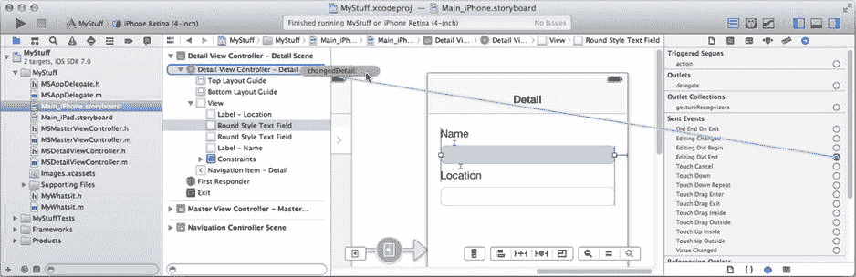

**图 5-26.** 将 `Editing Did End` 连接到 `-changedDetail:` 动作

现在，当你在详情视图中编辑其中一个文本字段时，它会更改原始对象的属性值，从而更新你的数据模型。试试看。

确保你的方案仍设置为 iPhone 模拟器，并运行你的应用。你的条目会显示在列表中，如图 5-27 左侧所示。

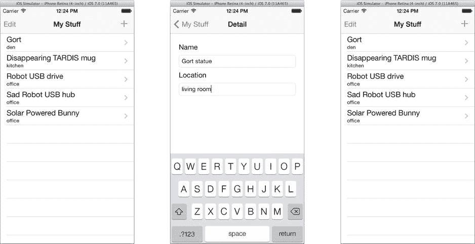

**图 5-27.** 测试详情编辑

点击 Gort 条目标会显示其详细信息。编辑第一行的详细信息。在图 5-27 的示例中，我将它的名称改为“Gort statue”，位置改为“living room”。点击导航栏中的 `My Stuff` 按钮返回列表。但是等等！Gort 的 `MyWhatsit` 对象并没有更新。

还是说它更新了？你可以通过在 `-changedDetail:` 中设置调试器断点来验证此理论，看看它是否被触发（确实触发了）。不，问题其实更隐蔽一些。用你的光标（或者手指，如果你在真实设备上测试的话）向上拖动列表，让 Gort 行短暂消失在导航工具栏下方，如图 5-28 左侧所示。

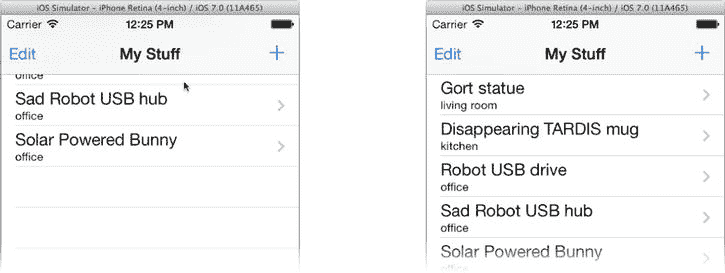

**图 5-28.** 重绘第一行

松开鼠标/手指，列表会弹回原位。注意，第一行现在显示了更新后的值。这是因为你的 `-changedDetail:` 方法修改了属性值，但你从未通知表格视图对象，所以它不知道需要重绘那一行。你需要修复这个问题。

### 观察 MyWhatsit 的变更

在第 8 章中，我会解释数据模型与视图对象之间通信的基本原理。现在，你只需要知道：当 `MyWhatsit` 对象的属性发生变更时，表格视图需要知晓此事，以便重绘相应的行。

理论上，解决这个问题很容易：当 `MyWhatsit` 属性被更新时，需要向表格视图发送一条消息来重绘表格，就像你添加或移除对象时做的那样。但实际上，这有点棘手。问题在于，无论是 `MyWhatsit` 对象还是 `MSDetailViewController`，都没有与 `MSMasterViewController` 视图中的表格视图对象建立直接连接。虽然你完全可以在 Interface Builder 中或以编程方式添加一个并建立连接，但在这个案例中，有一个更简洁的解决方案。

> **注意：** 在一个良好的模型-视图-控制器设计模式中，让数据模型对象（如 `MyWhatsit`）直接连接到视图对象（如表格视图）是完全不合适的。所以，这不仅仅是巧妙的解法，更是一种良好的软件设计。

有一种软件设计模式叫做观察者模式。它的工作原理如下：

- 任何对某个事件感兴趣的对象会注册成为观察者。
- 当事件发生时，负责该事件的对象会发布一个通知。
- iOS 通知中心会将该通知分发给所有感兴趣的观察者。

这种安排的真正巧妙之处在于，无论是观察者还是发布通知的对象，彼此之间都无需知道对方的存在。你将使用通知来将 `MyWhatsit` 对象的变更传达给 `MSMasterViewController`。第一步是设计一个通知，并让 `MyWhatsit` 在适当时机发布它。

#### 发布通知

在你的 `MyWhatsit.h` 接口文件中，添加此方法原型：

`- (void)postDidChangeNotification;`

在文件顶部附近，添加此常量定义：

`#define kWhatsitDidChangeNotification    @"MyWhatsitDidChange"`

切换到你的 `MyWhatsit.m` 实现文件，并添加该方法：

```
- (void)postDidChangeNotification
{
    [[NSNotificationCenter defaultCenter]
                        postNotificationName:kWhatsitDidChangeNotification
                                      object:self];
}
```

此方法被调用时，会发布一个名为 `kWhatsitDidChangeNotification` 的通知。通知的 `object` 参数为自身。通知的名称可以是任何你想用的名称，只需确保其唯一性，以免与其他对象使用的通知混淆。

回到你的 `-changedDetail:` 方法（`MSDetailViewController.m`），在方法末尾添加一行代码：

`[self.detailItem postDidChangeNotification];`

现在，每当你编辑 `MyWhatsit` 对象的详细信息时，它都会发布一条变更通知。任何对此感兴趣的对象都会收到该通知。最后一步是让 `MSMasterViewController` 监听此通知。


