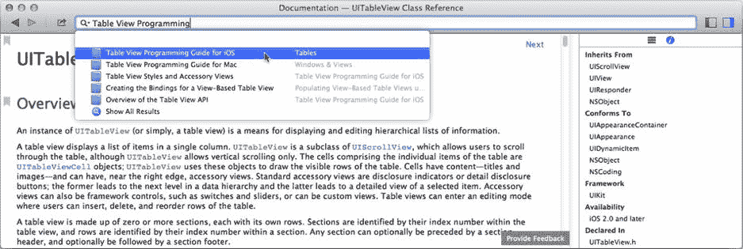

# 高级表格视图专题

你现在可以看到，表格视图的用途远不止列出联系人和歌曲标题。表格视图类功能强大且灵活，但这意味着它们有时会显得复杂且令人困惑。好消息是，它们拥有详尽的文档资料，并且苹果提供了大量可下载的示例项目，展示了各种表格视图技术。

入门应从《iOS 表格视图编程指南》开始。选择“帮助”➤“文档与 API 参考”，在搜索框中输入`Table View Programming`，然后从自动补全列表中选择《iOS 表格视图编程指南》，如图 5-29 所示。

图 5-29. 定位表格视图编程指南

本指南将解释表格视图的每个主要特性及其使用方法。内容虽不简短，但如果你需要了解如何实现特定功能——例如创建索引列表——这正是你应该开始的起点。

大多数主要的 iOS 类在其文档中都会提供相关链接，引导你阅读说明如何使用它及相关类的指南。例如，在`UITableView`类的概述部分，就包含多个指向表格专用编程指南的链接。

## 总结

给自己一个大大的“击掌”！你在 iOS 应用开发中又迈出了一大步。你已经学会了表格视图的工作原理以及如何使用单元格对象。你了解了用户点击行时应用会收到哪些消息，如何处理行的编辑，以及如何创建新行。你还创建了一个数据模型，并学会了如何在未关联的对象之间发布和观察通知。

不过，这个应用在几个方面仍有不足。特定项目的详细信息可以做得更详尽。但最烦人的问题可能是你的应用不会记住任何东西。如果你重启应用，之前所做的所有更改都会丢失。因此，对于一个本应记录你的物品的应用来说，它表现得并不理想。

别担心；我们将在后续章节解决这些缺点。在此之前，你可以从应用开发中好好休息一下，并短暂了解一下面向对象编程的理论。

