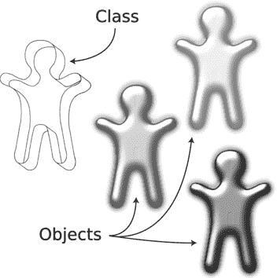
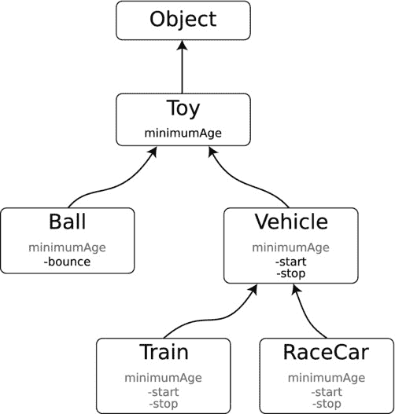

# 罗密欧遇见朱丽叶

20 世纪 60 年代末，发生了一件神奇的事情：结构与函数结合了，对象由此诞生。对象是将属性值（数据结构）和作用于这些值上的方法（函数）融合为一个同时拥有两者的单一实体。这看起来如此简单，但它却是计算机语言发展史上的一个戏剧性转折点。

在对象出现之前，程序员整天编写和调用函数（也称为过程），并将正确的数据结构传递给它们。以这种方式工作的计算机语言被称为过程式语言。当对象的概念被引入时，它彻底颠覆了程序员编写程序以及思考程序的方式。如今，程序员世界的中心是对象；你获取一个对象并调用它的方法。这些新的计算机语言被称为面向对象语言。

对象也创造出了感觉“鲜活”的程序。数据结构是值的静态集合，函数是抽象的指令序列，但对象两者皆是；它是一个既有特征，又能在被指示时执行操作的实体。从这个意义上说，对象与你现实世界中打交道的各种事物更为相似。

现在你已经知道对象是什么了，我将为你简单讲解一下对象是如何定义、创建的，以及在 Objective‑C 中是什么样子的。第 20 章会更详细地描述这些内容。

## 类与饼干

对象是类的具体化实体。对象的类定义了该对象可以拥有哪些属性以及可以执行哪些操作。对象是你实际处理的东西。这样理解吧：类是饼干模具。对象是饼干。见图 6-1。



图 6-1. 类与对象

在 Objective‑C 中，使用 `@interface` 指令定义一个类：

```
@interface MyClass

// 类定义写在这里

@end
```

类本身做不了太多事。类仅仅是用于创建新对象的“形状”。当你创建一个对象时，你需要指定你想要创建的对象的类，然后告诉这个类去创建它。在 Objective‑C 中，代码如下所示：

```
MyClass *object = [[MyClass alloc] init];
```

该表达式的结果是类的一个新实例，它与对象同义。该对象包含它自己的存储空间（数据结构），其中保存了它所有的属性值。每个对象都有自己的存储空间；改变一个对象的值不会改变系统中任何其他对象的值。

每个对象还关联着许多仅作用于该类对象的方法（函数）。类定义了这些方法，并且该类的每个对象都被赋予了这些操作。在 Objective‑C 中，方法的代码出现在该类的 `@implementation` 部分：

```
@implementation MyClass

// 方法写在这里

@end
```

对类的特定对象（实例）执行操作的方法称为实例方法。实例方法总是在单个对象的上下文中执行。当实例方法中的代码引用属性值或特殊的 `self` 变量时，它引用的是被调用方法的特定对象的属性。在 Objective‑C 中，实例方法以连字符（减号）开头：

```
- (void)doSomething;
```

还有一些特殊的类方法。类方法由类定义，但不能在任何特定对象上调用。类方法的上下文是类本身。类方法在某种意义上非常类似于传统样式的函数，因为它们不对特定对象执行操作。相反，它们通常为类执行一些实用功能，比如创建新对象或更改全局设置。在 Objective‑C 中，类方法以加号开头：

```
+ (id)makeSomething;
```

`+alloc` 方法是一个类方法。它被发送给类以创建（分配）一个新对象。`-init` 方法是一个实例方法。它的工作是准备（初始化）那个单一对象，使其能够被使用。

## 类、对象和方法，哦天哪！

新开发人员持续感到困惑的一个来源是面向对象编程中术语的繁多及其混乱之处。每种编程语言似乎都选择了一套略有不同的术语。计算机科学家又使用另一套词汇。术语经常被混淆，甚至经验丰富的程序员也会用错术语，说“对象”时实际指的是“类”。

表 6-1 将帮助你理解面向对象编程的术语体系。它列出了常见的 Objective‑C 编程术语、它们的含义以及你可能会遇到的一些同义词。我将在本章后面更详细地解释其中的大部分内容。

表 6-1. 常见 Objective‑C 术语

| 术语 | 含义 | 类似术语 |
| --- | --- | --- |
| 类 | 一类对象的定义。它定义了这些对象可以存储哪些属性值以及实现哪些方法。 | 接口、类型、定义、原型 |
| 对象 | 类的一个实例。 | 类实例、实例 |
| 属性 | 存储在对象中的一个值。 | 实例变量、属性（attribute） |
| 方法 | 在单个对象上下文中执行的函数。 | 实例方法、函数、过程、业务逻辑 |
| 类方法 | 在任何特定对象上下文之外执行的函数。 | 类函数、静态函数 |
| 覆盖 | 用不同的实现取代继承来的方法的实现。 |  |
| 消息 | 选择特定方法执行的值。 | 选择器 |
| 发送 | 使用消息来调用对象的方法。 | 调用方法、调用函数 |
| 发送者 | 向另一个对象发送消息的对象。 | 调用者 |
| 接收 | 接收到一条消息。 |  |
| 接收者 | 执行方法的对象。正在运行的方法的上下文。 | self |
| 响应 | 当发送特定消息时，拥有一个执行的方法。 | 实现 |
| 客户端代码 | 类的外部，正在使用该类或其对象的公共接口的代码。 | 用户、客户端 |
| 抽象类 | 已定义或声明，但没有实用功能的类、属性或方法。用于定义一个概念，子类将以有意义的方式实现它。 | 抽象层、占位符、桩 |
| 具体类 | 有实际功能并可用的类、属性或方法。 |  |

至此，你应该已经牢固掌握了类、它的对象以及它的属性和方法之间的关系。Objective‑C 通过消息的概念为这一切增添了一点特色。在大多数其他面向对象语言中，方法就是简单地被“调用”或“引用”。这等同于调用一个旧风格的过程式函数，并将它应该处理的对象的数据结构传递给它。

Objective‑C 的工作方式与大多数其他面向对象语言略有不同。调用一个方法涉及一个称为选择器的常量数值。整个系统中的每一个 Objective‑C 方法（例如 `-init` 或 `-setObject:forKey:`）都有一个唯一的选择器。这个选择器用于选择对象将执行哪个方法（如果有的话）。这个过程通常对你来说是透明的，但它催生了 Objective‑C 的语言习惯，程序员们会说“向对象发送消息”、“接收消息”，或询问“对象是否响应这条消息？”一个副作用是：“消息”和“方法”这两个术语经常被互换使用。


### 继承

我之前提到，程序员们发现，在很多时候，他们需要的某个类或结构与已有的另一个对象或结构非常相似，可能只差一些微小的补充。此外，他们为现有对象/结构编写的方法也全部适用于这个新对象。这种概念被称为继承，它是面向对象语言的基石。

其核心思想是，类可以组织成一棵树，更通用的类位于树的顶端，向下延伸至更具体的类。这种组织方式可能如图 6-2 所示。



图 6-2.

一个类层次结构

在图 6-2 中，通用的 `Object` 是所有其他对象的基类。在 Objective-C 中，基类是 `NSObject`。`Object` 的一个子类是 `Toy`。`Toy` 定义了一组所有 `Toy` 对象共有的属性和方法。`Toy` 的子类是 `Ball` 和 `Vehicle`。`Vehicle` 的子类是 `Train` 和 `RaceCar`。

`Toy` 类定义了一个 `minimumAge` 属性，描述该玩具适用的最低年龄。所有 `Toy` 的子类都继承了这个属性。因此，`Ball`、`Vehicle`、`Train` 和 `RaceCar` 都拥有 `minimumAge` 属性。

类似地，类也会继承方法。`Vehicle` 类定义了两个方法：`-start` 和 `-stop`。所有 `Vehicle` 的子类都继承了这两个方法，所以你可以向 `Train` 发送 `-start` 消息，向 `RaceCar` 发送 `-stop` 消息。而 `-bounce` 消息只能发送给 `Ball`。

这就是计算机科学家所说的子类型多态性。这意味着，如果你有一个特定类型（例如，`Vehicle`）的对象、参数或变量，你可以使用或替换任何 `Vehicle` 的子类对象。你可以将一个 `Train` 或 `RaceCar` 对象传递给一个参数类型为 `Vehicle` 的方法，该方法同样能有效地作用于这个更复杂的对象。一个类型为 `Toy` 的变量可以存储 `Toy`、`Ball` 或 `Train` 对象。然而，一个类型为 `Vehicle` 的变量不能被赋值为 `Ball`，因为 `Ball` 不是 `Vehicle` 的子类。

这一点你在自己编写的应用中已经见识过。`NSResponder` 是所有响应事件的对象的基类。`UIView` 是 `NSResponder` 的子类，因此所有视图对象都能响应事件。`UIButton` 是 `UIView` 的子类，所以它可以出现在视图中并响应事件。一个 `UIButton` 对象可以用于任何期望接收 `UIButton` 对象、`UIView` 对象或 `NSResponder` 对象的场景。

## 抽象类与具体类

程序员将 `Toy` 和 `Vehicle` 类称为抽象类。这些类并不定义可用的对象；它们定义了所有子类共有的属性和方法。在你的程序中永远不会找到 `Toy` 或 `Vehicle` 对象的实例。你在程序中找到的对象将是 `Ball` 和 `Train` 对象，它们从 `Toy` 和 `Vehicle` 类继承共有的属性和方法。这些可用对象的类被称为具体类。

## 方法重写

启动火车与启动汽车有很大不同。一个类可以为某个特定方法提供自己的代码，从而替换其继承来的实现。这被称为重写方法。

例如，所有 `NSObject` 的子类都继承了一个 `-description` 方法。该方法返回一个描述对象的 `NSString`。当然，由 `NSObject` 提供的 `-description` 版本是通用的，无法了解任何子类的具体信息。作为程序员，你可以在 `Ball` 中重写 `-description` 来描述它是什么样的球，并在 `Train` 中重写 `-description` 来描述它是什么样的火车。

有时，一个类——尤其是抽象类——会定义一个什么都不做的方法；它只是为了让子类重写而设置的占位符。`Vehicle` 类的 `-start` 和 `-stop` 方法就什么也不做。具体由哪个子类来决定启动和停止意味着什么。

例如，`UIViewController` 类定义了 `-viewWillAppear:` 方法。这个方法什么也不做。它只是一个占位符方法，会在控制器的视图出现在屏幕上前被调用。如果你的视图控制器子类需要在视图出现前做一些事情，你的类就需要重写 `-viewWillAppear:` 并执行你需要它完成的任务。

如果你的类的方法还需要调用其超类中定义的方法，Objective-C 为此提供了一种特殊的语法。`super` 关键字的含义与 `self` 相同，但发送给 `super` 的消息会传递给超类中定义的方法（忽略当前类中定义的方法），就如同该方法没有被重写过一样：

```
[super viewWillAppear:animated];
```

这是一种常见的模式，用于扩展（而不是替换）方法的行为。重写的方法先调用原始方法，然后再执行任何额外的任务。

### 设计模式与原则

随着对象和继承带来的新能力，程序员们发现他们可以构建比过去复杂数个数量级的计算机程序。他们也发现，如果类的设计不当，结果会是一团乱麻，比旧的编程方式更糟糕。他们开始思考一个问题：“什么才是一个好的类？”

为了定义什么构成一个好的类以及如何在程序中最优地使用对象，人们投入了大量的思考、理论和实验。这催生了一系列的概念和理念，统称为设计模式和设计原则。设计模式是针对常见问题的可重用解决方案——一种编程最佳实践。设计原则是关于什么构成良好设计的指导方针和深刻见解。这些模式和原则有几十种之多，你可能需要花费数年时间研究。我将介绍其中几个较为重要的。

### 封装

一个对象应该对其客户端——即使用并与之交互的其他类——隐藏或封装其多余的细节。一个设计良好的类有点像一辆食品卡车。卡车的外部是它的接口；它包含一个菜单和一个窗口。使用食品卡车很简单：你选择想要的东西，下单，然后通过窗口取餐。卡车内部发生的事情则要复杂得多。有炉灶、电力、冰箱、储物空间、库存、食谱、清洁流程等等。但所有这些细节都被封装在卡车内部。

类似地，一个好的类将其所做的细节隐藏在其 `@interface` 部分定义的简单接口之后。该对象的客户端需要的属性和方法应该在那里声明。其他所有内容都应该“隐藏”在 `@implementation` 或私有的 `@interface` 部分中。

这不仅仅是为了简单——尽管这是一个很大的好处。一个类向其客户端暴露的细节越多，它与使用它的代码之间的纠缠就越紧密。计算机工程师称之为依赖关系。依赖关系越少，就越容易在不影响该类使用方式的情况下更改其内部工作机制。例如，食品卡车可以从使用冷冻薯条切换到将新鲜土豆切片并烹制。这种改变会提高其薯条的质量，但它不需要修改菜单或改变客户下单的方式。


