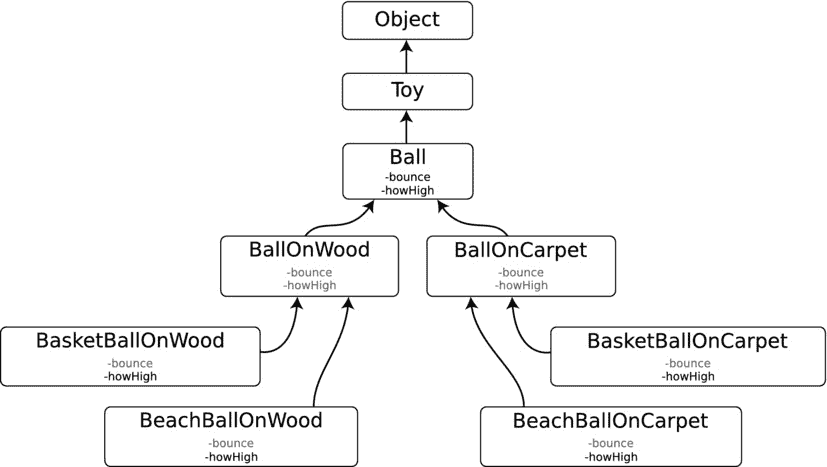
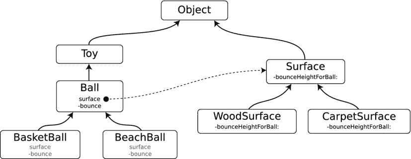

# 稳定性

一个球应该随时可用。如果你拿起一个球，你会期望它能弹跳。如果发现一个球需要先翻转两次或涂上颜色才能弹跳，那会显得很奇怪。

努力让你的对象无论以何种方式创建或设置了哪些属性，都能保持功能正常。在`Ball`示例中，无论`minimumAge`属性是否已设置，`-bounce`方法都应当正常工作。软件工程师将这些称为前置条件，你应该尽可能减少这类条件。

### 开闭原则

单一职责原则有两个推论。第一个是所谓的“开闭原则”：类应该对扩展开放，对修改关闭。这听起来有点费解，但基本意思是：如果一个类可以通过扩展现有类或方法而非修改它们，来复用于解决其他问题，那么它就是设计良好的。

程序员厌恶变更，但这是软件开发中永恒不变的主题。需要在应用中修改的内容越多，就越有可能对项目的其他部分产生负面影响。软件工程师称之为耦合。通俗地说，就是修改一处，就会在别处制造一个 bug。开闭原则试图通过设计类和方法来避免修改，使你在未来不必改动它们。这需要实践。

再次使用玩具类的例子，`Train`和`RaceCar`可能都是电动的。你可能会倾向于在`Vehicle`类中添加与电力驱动相关的属性和方法（如`voltage`、`-switchOn`等）。问题在于，当你想要定义一个发条驱动的`RaceCar`时会发生什么？你必须修改`Vehicle`，而这将影响应用中所有的`Train`和`RaceCar`对象。

未雨绸缪，你可以在`Vehicle`及其子类之间添加一层新的类，例如`ElectricVehicle`和`WindUpVehicle`。这样你就可以在不修改`ElectricVehicle`子类的情况下创建`WindUpVehicle`的子类。此时你是在扩展设计，而非修改设计。你不仅考虑今天写的代码，也在思考明天可能写的代码。

### 委托模式

单一职责原则的另一个启示是避免在对象中混入超出其职责范围的知识或逻辑。一个球有`-bounce`方法。要计算球能弹多高，该方法必须知道球撞击的是何种表面。由于这个计算必须在`-bounce`方法中完成，很容易让人把该逻辑直接放进`Ball`类。你可能会通过添加一个计算弹跳高度的`-howHigh`方法来实现。

不幸的是，这种设计决策会带你走上一条疯狂的道路。由于弹跳计算随环境变化，修改计算的唯一方法就是在子类中重写`-howHigh`方法。这迫使你创建诸如`BallOnWood`、`BallOnConcrete`、`BallOnCarpet`等子类。如果之后你想创建不同类型的球，比如篮球和沙滩球，你就会得到所有这些子类的子类（`BeachBallOnWood`、`BasketBallOnWood`、`BeachBallOnCarpet`……）。你的类将失控，如图 6-3 所示。

图 6-3. 子类的“解决方案”

避免这种混乱的设计模式是委托模式。如你所见，委托模式在 Cocoa Touch 框架中被广泛使用。委托模式将关键决策推迟（即委托）给另一个对象，这样逻辑就不会偏离类的单一目标。

使用委托模式，你可以为球创建一个`surface`属性。该`surface`属性会连接到一个实现了`-bounceHeightForBall:`方法的对象。当球想知道弹跳高度时，它会向它的表面委托发送一条`-bounceHeightForBall:`消息，并将自身作为球对象传递过去。`Surface`对象会执行计算并返回结果。`Surface`的子类（`ConcreteSurface`、`WoodSurface`、`CarpetSurface`、`GrassSurface`）可以重写`-bounceHeightForBall:`以调整其行为，如图 6-4 所示。

图 6-4. 委托解决方案

现在，你拥有一个简单而灵活的类层次结构。抽象类`Ball`有`BasketBall`和`BeachBall`两个子类。其中任何一个都可以连接到任意`Surface`子类（`ConcreteSurface`、`WoodSurface`、`CarpetSurface`、`GrassSurface`）以提供正确的物理行为。这种安排也符合开闭原则：你可以扩展`Ball`或`Surface`来创建新的球或新的表面，而无需修改任何现有类。

### 其他模式

设计模式与原则还有很多很多。我不期待你全部背下来——只需了解它们即可。当你了解设计模式后，观察 Cocoa Touch 框架和其他地方类的设计时，就会开始注意到它们的身影；iOS 是一个设计非常精良的系统。

以下是你将遇到的几种常见模式：

*   **单例模式**：一个类维护整个程序使用的单一对象实例。`[UIApplication sharedApplication]` 就是一个单例。
*   **工厂模式与类簇**：一种为你创建对象的方法（而不是由你自己创建和配置）。通常，你的代码并不知道需要创建哪个对象，甚至不知道需要创建哪类对象。工厂方法会为你处理（封装）这些细节。`+[NSURL URLWithString:]` 方法就是一个工厂方法。返回的 `NSURL` 对象的类会根据字符串描述的 URL 类型而有所不同。
*   **装饰器模式**：使用另一个对象来装扮一个对象。具有讽刺意味的是，`UIBarButtonItem` 并非一个按钮对象。它是一个装饰器，可以呈现一个按钮、一个特殊控件项，甚至可以改变工具栏中控件的定位。
*   **懒初始化模式**：等到需要某个对象（或其属性）时再创建它。懒初始化使某些操作更高效，并减少了前置条件。`UITableView` 会懒创建表格单元格对象；它会等到需要绘制某一行时，才向数据源委托请求提供该行的单元格。

当然，还有很多其他模式。

第一本关于设计模式的重要著作（《设计模式：可复用面向对象软件的基础》）于 1994 年由所谓的“四人帮”（Erich Gamma、Richard Helm、Ralph Johnson 和 John Vlissides）出版。这些模式至今仍然适用，设计模式已成为任何严肃程序员的“必修课”。原书并不针对任何特定的计算机语言；你可以将这些原则应用于任何语言，甚至非面向对象的语言。此后，许多作者针对特定语言重新应用和精炼了这些模式。因此，如果你主要对学习 Objective-C 的这些技能感兴趣，可以找一本专门针对 Objective-C 的设计模式书籍。

**注意**

设计模式的一个有趣分支是反模式的涌现：开发者反复陷入的编程陷阱。许多反模式都有有趣的名字，比如“上帝对象”（一个做了太多事情的对象）和“千层面代码”（层次过多的软件设计）。有关其历史和其他示例，请参见 [`en.wikipedia.org/wiki/Anti-patterns`](http://en.wikipedia.org/wiki/Anti-patterns)。

## 总结

理论部分不少，但学习这些基本概念很重要。理解设计模式和原则将帮助你成为更好的软件设计师，同时你也会更欣赏 iOS 类的设计。观察 iOS 和其他经验丰富的开发者如何解决问题，识别他们使用的原则，然后在自己开发中尝试模仿。

理论很有趣，但你知道什么更有趣吗？相机！

**脚注**

蒙太古家族和凯普莱特家族是戏剧《罗密欧与朱丽叶》中两个疏远的家族。如果你的阅读清单偏向儒勒·凡尔纳而非威廉·莎士比亚，我在此提一下。

