# 7. 笑一个！

**摘要**

图片和视频是移动应用的重要组成部分。大多数 iOS 设备内置的出色音视频硬件使之成为可能。你的应用可以利用这些硬件——而且这并不难。苹果极简地实现了让用户拍照、或从相册中选择现有图片，并在你的应用中使用该图像的界面。

在本章中，你将向 MyStuff 添加图片。你将允许用户为他们拥有的每个物品选择或拍摄一张图片，并在详情视图和主列表中显示该图像。为此，你将学习如何：

*   创建相机或图片选择器控制器并显示它
*   获取用户拍摄或选择的图片
*   使用 Core Graphics 裁剪和调整图像大小
*   将图像保存到用户的相机胶卷
*   在表格视图的行中显示图像

在此过程中，你还将学习其他几个有用技能：

*   向视图对象添加点击手势识别器
*   在弹出窗口中呈现视图控制器
*   关闭键盘

本章将扩展你在第 5 章（“餐桌礼仪”）中编写的 MyStuff 应用。你可以继续使用在第 5 章中编写的版本，或者在 `Learn iOS Developer Projects` 文件夹的 `Ch 7` 文件夹中找到完成版本。如果你要向第 5 章的项目添加内容——我强烈建议这样做——你将需要 `Ch 7` ➤ `MyStuff (Resources)` 文件夹中的资源文件。

### 设计

扩展你的 MyStuff 应用并不困难。你已经创建了主从界面，并且已经让表格视图和编辑功能在 iPhone 和 iPad 界面上都能工作。所有繁重的工作已经完成；你只需要稍加修饰。在详情视图中，你将添加一个 `UIImageView` 对象来显示物品的图片，在表格视图中，你将添加图标来显示列表中的较小版本，如图 7-1 所示。

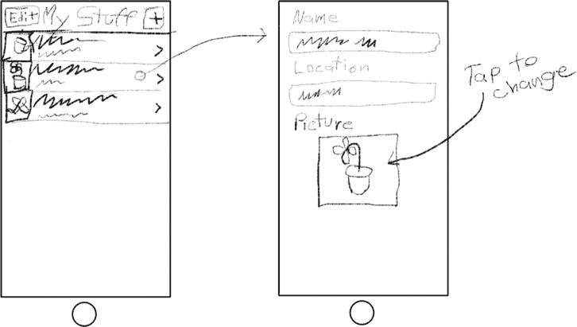

图 7-1. 更新后的 MyStuff 设计

当用户点击详情视图中的图片时，你的应用将呈现相机界面或图片选择器界面。相机界面允许他们使用设备内置相机拍照。图片选择器界面允许用户从他们的相册中选择现有图片。新图片将同时出现在详情视图和主列表中。让我们开始吧！

## 扩展你的设计

为了扩展你的设计，你需要对现有的一些类和界面文件进行小的修改。无论你意识到与否，你的 MyStuff 应用都使用了模型-视图-控制器设计模式。我将在下一章描述模型-视图-控制器设计，但目前只需知道你的应用中的一些对象是“数据模型”对象，一些是“视图”对象，另一些是“控制器”对象。向 MyStuff 添加图片需要：

*   扩展你的数据模型以包含图像对象
*   添加视图对象来显示这些图像
*   扩展你的控制器对象以拍摄图片并更新数据模型


### 修改数据模型

第一步是扩展你的数据模型。找到你的 `MyWhatsit.h` 接口文件，并添加两个新属性：

```
@property (strong,nonatomic) UIImage *image;
@property (readonly,nonatomic) UIImage *viewImage;
```

第一个属性为每个 `MyWhatsit` 对象添加了一个 `UIImage` 对象引用。现在每个 `MyWhatsit` 对象都拥有了一张图片。嘿，这太简单了！

第二个属性需要稍微多解释一下。在所有视图对象（包括详情视图和表格视图）中，你想要显示对应条目的图片。然而，如果没有图片，你想要显示一个占位图片——一张写着“没有图片”的图片。`viewImage` 属性将包含条目的图片，如果没有，则包含占位图片。它是一个 `readonly` 属性，这意味着该对象的客户端无法更改它；换句话说，语句 `myWhatsit.viewImage = newImage` 是不被允许的。

**VIEWIMAGE 的设计并不好**

将 `viewImage` 属性添加到 `MyWhatsit` 类实际上是一种糟糕的软件设计。问题在于 `MyWhatsit` 类是一个数据模型类，而 `viewImage` 属性属于视图类的领域。用大白话来说，它解决的是显示图片的问题，而不是存储图片的问题。你在一个数据模型对象中加入了视图相关的功能，这是你应该避免的。

在组织良好的模型-视图-控制器 (MVC) 设计中，每个类的领域应该是纯粹的：数据模型类应该只拥有与数据模型相关的属性和函数——此外别无他物。这里的问题在于，将 `viewImage` 属性添加到 `MyWhatsit` 类实在太方便了：它封装了为条目提供“显示图片”的逻辑，从而简化了其他地方的代码。封装逻辑并使用户更容易使用对象的代码，不可能是坏的，对吧？

它并不坏。实际上它挺好，但是有没有办法避免这种将 `viewImage` 直接添加到 `MyWhatsit` 类的架构“缺陷”呢？解决方案是使用类别（category）。类别是 Objective-C 的一个独特特性，它可以解决像这样棘手的领域问题，同时不会使你的对象更难使用。使用类别，你仍然可以为你的 `MyWhatsit` 对象添加 `viewImage` 属性，但在一个不同的模块中完成——一个视图模块，与你的 `MyWhatsit` 类分开。你既能获得将 `viewImage` 属性添加到 `MyWhatsit` 的好处，又能保持数据模型代码与视图代码的分离。我会在第 20 章 中解释类别。

在运行时（当你的应用运行时），你的 `MyWhatsit` 对象仍然拥有一个 `viewImage` 属性，就像你直接将它添加到 `MyWhatsit` 类中一样。所以这有什么关系呢？关系不大，并且对于像这样的小型项目来说，其影响可以忽略不计，这就是为什么我没有让你为 `viewImage` 创建一个类别。有时候，实用主义胜过对设计模式的狂热坚持。你只需知道，在一个更复杂的项目中，在 `MyWhatsit` 中定义 `viewImage` 可能会成为一个障碍，而解决方案就是将它移到类别中。

`viewImage` 属性并非传统意义上的属性。它是程序员所说的合成属性（synthetic property）；它的值由某些逻辑决定，而不是简单地返回一个实例变量的值。为了让其工作，你需要添加那段逻辑。点击 `MyWhatsit.m` 实现文件，并添加以下方法：

```
- (UIImage*)viewImage
{
    if (self.image!=nil)
        return self.image;
    return [UIImage imageNamed:@"camera"];
}
```

此方法为 `viewImage` 属性提供了值。每当客户端代码请求 `viewImage` 属性时（例如 `detailItem.viewImage`），此方法将被调用，其返回的值就是 `viewImage` 的值。这通常被称为该属性的 getter 方法。

> **注意**：在类中定义的每个 `@property` 都会自动创建一个同名的 getter 方法——即“获取”属性值的方法，如 `-viewImage`。如果该属性是可修改的（即不是 `readonly` 属性），则还会生成第二个 setter 方法，其名称以“set”为前缀，如 `-setViewImage:`。如果你想在客户端获取或更改属性时执行一些特殊操作，可以自由替换编译器对 getter 或 setter 方法的默认实现。

如果 `MyWhatsit` 对象的 `image` 属性有值，那么 `viewImage` 就返回同一个对象。如果没有值（`self.image == nil`），则返回 `camera.png` 资源文件中的图片。为了使其生效，你需要将那个占位图片文件添加到你的项目中。在 `MyStuff (Resources)` 文件夹中找到 `camera.png` 文件，并将其拖入 `Images.xcassets` 资源目录的组列表中，如图 7-2 所示。

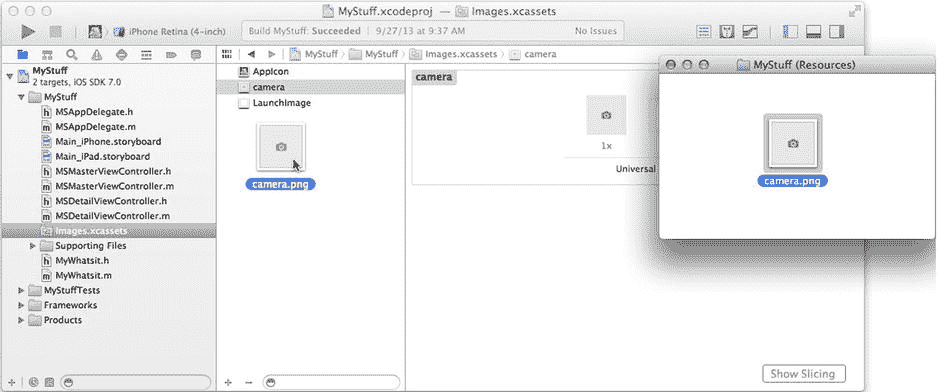

**图 7-2.** 添加 `camera.png` 资源

`MyWhatsit` 已经完成，现在是时候将新的视图对象添加到你的界面中了。


### 添加图像视图

下一步是在详情界面中添加视图对象。现在操作起来应该很熟悉了：

- 在 `MSDetailViewController` 类中添加一个 `imageView` 输出口
- 在 `MSDetailViewController` 界面文件中添加标签和图像视图对象
- 将 `imageView` 输出口连接到图像视图对象

从 `MSDetailViewController.h` 接口文件开始操作。添加如下属性：

```
@property (weak,nonatomic) IBOutlet UIImageView *imageView;
```

从 iPhone 界面开始：选择 `Main_iPhone.storyboard` 文件。从对象库中，添加一个新的标签对象。将其放置在位置文本字段下方，并调整其大小使其宽度与上方文本字段一致，如图 7-3 所示。将标签的标题改为“图片”。

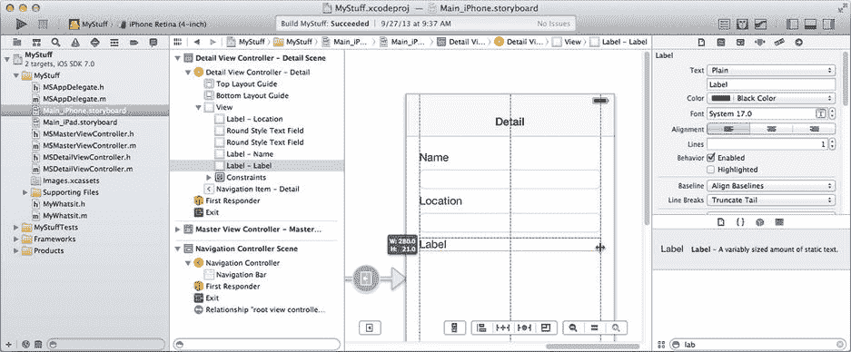

图 7-3. 添加图片标签

添加一个图像视图对象，并将其拖放到界面的下半部分任意位置。选中它，通过尺寸检查器将其宽度和高度设为 128，如图 7-4 所示。

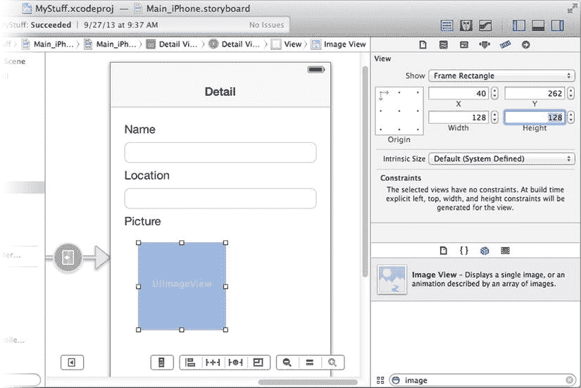

图 7-4. 固定图像视图的尺寸

现在可以拖动图像到合适位置。将其居中放置，并与下方的标签对象保持推荐的距离，如图 7-5 所示。

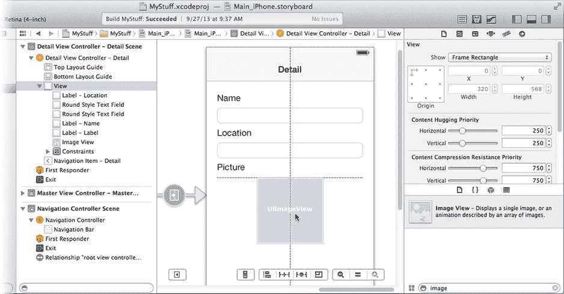

图 7-5. 定位图像视图

引导线会指示图像对象何时居中，以及与标签对象的距离是否合适。（你已将标签对象的宽度设为与界面同宽，这样图像对象会“碰撞”到它，从而获得推荐的间距。）现在将这些建议的位置转换为约束：

按住 Control 键/右键单击图像视图，向下拖动一小段距离，松开，并从约束菜单中选择高度。这将固定图像视图对象的高度。重复操作以固定宽度，水平拖动并选择宽度。选中图像视图和标签对象（即你刚添加的两个对象）。可以先选中一个，然后按住 Shift 键再选中另一个；或者拖出一个同时覆盖两个对象的选取框。选中两者后，从“解决自动布局问题”按钮中选择“添加缺失的约束”。

最后一步是选中“详情视图控制器”。切换到连接检查器，找到你添加到控制器中的 `imageView` 输出口。将其连接到图像视图对象，如图 7-6 所示。

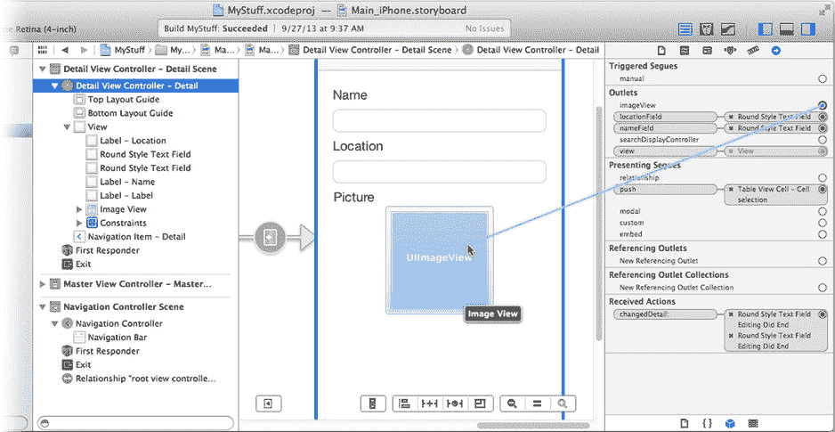

图 7-6. 连接 `imageView` 输出口

视图对象就位后，接下来需要添加代码，让物品图像显示出来。

### 更新视图控制器

你需要修改主视图控制器中的代码，以便将图像添加到表格单元格中；同时修改详情视图控制器中的代码，让图像显示在新的图像视图中。从 `MSMasterViewController.m` 开始操作。在 `-tableView:cellForRowAtIndexPath:` 中找到以下代码，并添加加粗的那一行：

```
cell.textLabel.text = thing.name;
cell.detailTextLabel.text = thing.location;
cell.imageView.image = thing.viewImage;
return cell;
```

新添加的行将单元格的图像（`cell.imageView.image`）设置为该行 `MyWhatsit` 对象的 `viewImage`。请记住，视图图像可能是物品的实际图像或占位符。设置单元格图像视图的操作会改变单元格的布局，使图像显示在左侧。（请参考第 5 章中的“单元格样式”部分。）

`MSMasterViewController` 的修改到此完成。点击 `MSDetailViewController.m`，找到 `-configureView` 方法。找到以下代码并添加加粗的那一行：

```
self.nameField.text = self.detailItem.name;
self.locationField.text = self.detailItem.location;
self.imageView.image = self.detailItem.viewImage;
```

这新的一行将 `UIImageView` 对象（已连接到 `imageView` 输出口）的图像设置为当前编辑的 `MyWhatsit` 对象的图像。

从数据模型和视图角度来看，一切准备就绪，可以尝试运行了。将方案设置为 iPhone 模拟器并运行项目。你会看到表格和详情视图中出现占位符图像，如图 7-7 所示。

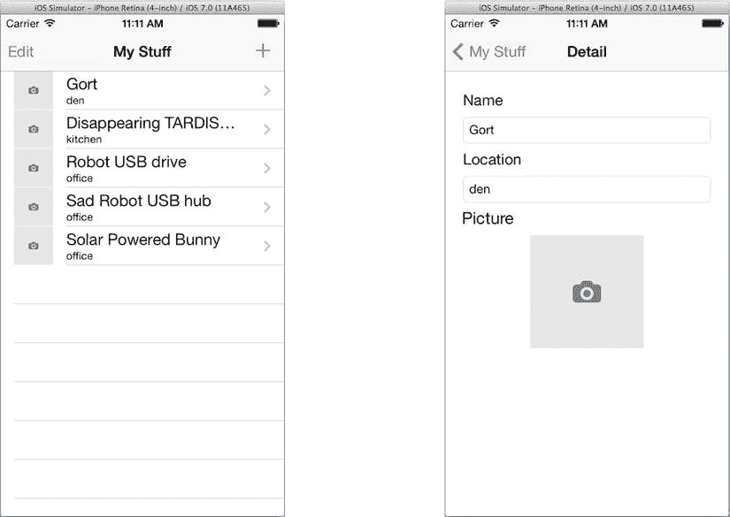

图 7-7. 占位符图像

到目前为止一切运行正常——只是还无法更改图片。要实现图片更换，你需要创建一个动作（Action）。


### 连接“选择图片”操作

当用户在详情视图中点击图片时，你希望显示相机或相册选择器的界面。这个连接操作很简单：创建一个操作方法并将图像视图连接到该方法。首先在`MSDetailViewController.h`中定义一个新的操作（你暂时不需要编写实现，只需声明即可）：

`- (IBAction)choosePicture:(id)sender;`

现在切换回`Main_iPhone.storyboard`界面，选中图像视图对象，并将其操作出口连接到“详情视图控制器”中的`-choosePicture:`操作。

哎呀，似乎遇到了问题。图像视图对象不是按钮，也不是其他类型的控件视图；它不发送操作消息。事实上，默认情况下它会忽略所有触摸事件（其`User Interaction Enabled`属性设为`NO`）。那么你该如何让图像视图对象向视图控制器发送操作呢？

有几种方法可以实现。一种解决方案是创建`UIImageView`的子类并重写其触摸事件方法，如第 4 章（“即将发生的事件”）所述。但有一种更简单的方法：给视图附加一个手势识别器对象。

在对象库中找到轻点手势识别器。将一个轻点手势识别器对象拖入界面，并放置到图像视图对象上，如图 7-8 所示。

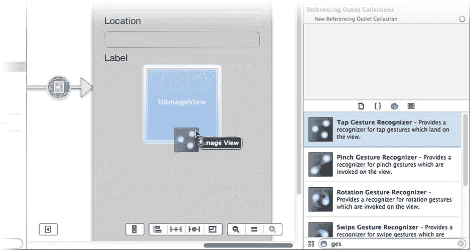

图 7-8. 将轻点手势识别器附加到图像视图

当你将手势识别器放入视图对象时，Interface Builder 会创建一个新的手势识别器对象，并将视图对象连接到它。这是一对多的关系：一个视图可以连接多个手势识别器，但一个识别器仅作用于单个视图对象。要查看这个关系，请选中视图对象，使用连接检查器查看其识别器，如图 7-9 右上角所示。将光标悬停在连接上，Interface Builder 会高亮显示它所连接的对象，如图 7-9 底部所示。

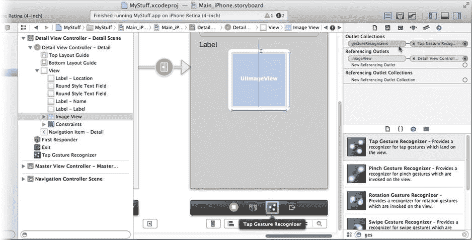

图 7-9. 检查图像视图对象的手势识别器连接

提示：你还可以在连接检查器中查看反向连接。选中一个对象，在检查器底部可以找到“引用连接的集合”部分。该部分显示了从其他对象到当前检查对象的连接。

默认情况下，新的轻点手势识别器被配置为识别单指轻点事件，这正是你需要的。不过，你还需要修改图像视图对象的属性。尽管已经将其连接到手势识别器，但视图对象仍然设置为忽略触摸事件，因此它永远不会接收任何需要识别的事件。要纠正这个问题，请选中图像视图对象，使用属性检查器勾选`User Interaction Enabled`属性，如图 7-10 所示。

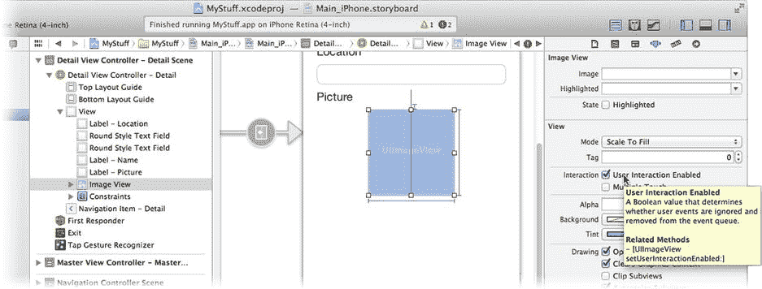

图 7-10. 为图像视图启用触摸事件

最后一步是将手势识别器连接到`-choosePicture:`操作。按住 Control 键，从场景停靠区域中的手势识别器（如图 7-11 所示）或从对象大纲中拖拽。两者都代表同一个对象。将连接拖至“详情视图控制器”，并连接到`-choosePicture:`操作，如图 7-11 所示。

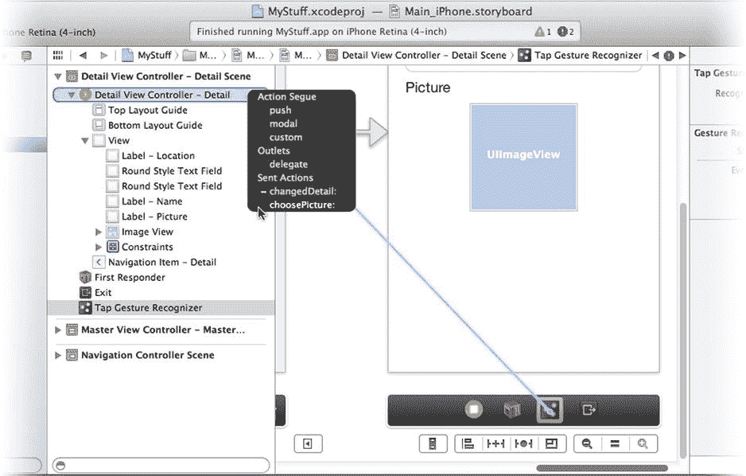

图 7-11. 连接`-choosePicture:`操作

当用户点击图像时，`-choosePicture:`消息现在将被发送到详情视图控制器。接下来你需要实现`-choosePicture:`方法，这就进入了有趣的部分：让用户拍照。

## 拍照

`UIImagePickerController`类提供了简单且自成一体的接口，用于拍照、录制视频或从用户的相册中选择现有图像。图像选择器控制器会完成所有复杂工作。在大多数情况下，你的应用只需创建一个`UIImagePickerController`对象，并像展示其他视图控制器一样展示它即可。该控制器的委托将收到包含用户所选图像、拍摄的照片或录制的视频的消息。

这并不意味着图像选择器控制器能处理所有事情。在图像选择器执行操作之前和之后，你的应用必须做出诸多决策和考量。这将是应用中主要的逻辑部分，我会在编写代码时逐一解释这些决策。首先将以下`-choosePicture:`方法添加到你的`MSDetailViewController.m`实现中：

```
- (IBAction)choosePicture:(id)sender
{
    if (self.detailItem==nil)
        return;

    BOOL hasPhotoLibrary = [UIImagePickerController isSourceTypeAvailable:UIImagePickerControllerSourceTypePhotoLibrary];
    BOOL hasCamera = [UIImagePickerController isSourceTypeAvailable:UIImagePickerControllerSourceTypeCamera];

    if (!hasPhotoLibrary && !hasCamera)
        return;

    if (hasPhotoLibrary && hasCamera)
        {
        UIActionSheet *actionSheet = [[UIActionSheet alloc]
                        initWithTitle:nil
                             delegate:self
                    cancelButtonTitle:@"Cancel"
               destructiveButtonTitle:nil
                    otherButtonTitles:@"Take a Picture",@"Choose a Photo",nil];
        [actionSheet showInView:self.view];
        return;
        }

    [self presentImagePickerUsingCamera:hasCamera];
}
```

第一个决策很简单：只有当详情视图当前正在编辑一个`MyWhatsit`对象时，此操作才会执行。如果不是（`self.detailItem==nil`），则直接返回并什么都不做。这种情况可能出现在 iPad 界面中，当详情视图可见但用户尚未选择要编辑的项目时。


### 鱼与熊掌不可兼得

接下来的代码用于判断你的应用可以使用哪些图像选取器界面。这是用户想做的事与应用能做的事之间的交集。`UIImagePickerController` 可能提供静态相机、摄像机、静态与摄像机二合一、照片库选取器或相机胶卷（已保存）照片选取器。但这并不意味着它能够实现所有功能。不同的 iOS 设备拥有不同的硬件。有些有摄像头，有些没有，有些有两个摄像头。部分摄像头能够拍摄视频，而另一些则不能。即使在拥有摄像头和照片库的设备上，安全限制或访问限制也可能禁止你的应用使用这些资源。

使用图像选取器的第一步是确定你想做什么，然后查明你能做什么。对于这个应用，你希望展示静态相机界面或展示一个选取器界面，让用户从照片库中选择现有图片。使用 `UIImagePickerController` 的 `-isSourceTypeAvailable:` 方法来判断你是否能做到其中任意一项。你向该方法传递一个常量，用于指示你希望展示的界面类型，该方法会告诉你该界面是否可用。

接下来的两行代码将询问照片库选取器界面是否可用的结果保存到 `hasPhotoLibrary` 变量中。`hasCamera` 变量将记住实时相机界面是否可用。

**注意**：还有第三种界面，即 `UIImagePickerControllerSourceTypeSavedPhotosAlbum`。它提供与照片库选取器相同的界面，但只允许用户从相机胶卷中选择图片——在没有摄像头的设备上，这个胶卷被称为“已保存照片”相册。

下一行代码考虑了两种界面都不可用的情况。在这种情况下，没有界面可以展示，该操作直接返回，不执行任何操作。

**提示**：在实际应用中，最好弹出一条提示消息告诉用户没有可用的图像来源，而不是忽略他们的点击——不过我把这作为一个练习，留给你自己探索。

接下来的代码块考虑了更常见的情况，即摄像头和照片库选取器都可用。那么你会展示哪个界面呢？这个问题需要用户来回答，所以询问他们。

`UIActionSheet` 是一个弹出式控制器，它会展示一系列按钮，并要求用户选择其中一个。你通过（可选的）标题、委托以及你想显示的按钮标题来创建该对象。在这个应用中，你询问用户是想“拍摄照片”还是“选择照片”。然后发送 `-showInView:` 来向用户展示这些选项。当用户点击某个按钮时，其委托对象会收到一条消息，因此该方法会返回并等待该事件发生。

最后一行代码处理了只有一种界面可用的情况（摄像头或照片库选取器只有一方可用，而非两者都可用）。在这种情况下，无需询问用户，直接启动他们能使用的那个界面即可。不过在此之前，请添加代码来响应操作表。

`UIActionSheet` 委托必须遵循 `UIActionSheetDelegate` 协议。在 `MSDetailViewController.h` 中的 `MSDetailViewController` 类定义中添加该协议：

```
@interface MSDetailViewController : UIViewController <UISplitViewControllerDelegate,

UIActionSheetDelegate>
```

回到 `MSDetailViewController.m` 中，添加你唯一关心的 `UIActionSheetDelegate` 方法：

```
- (void)actionSheet:(UIActionSheet *)actionSheet
clickedButtonAtIndex:(NSInteger)buttonIndex
{
    switch (buttonIndex) {
        case 0: // 相机按钮
        case 1: // 照片按钮
            [self presentImagePickerUsingCamera:(buttonIndex==0)];
            break;
    }
}
```

当用户选择操作表中的一个按钮时，你的委托会收到一条 `-actionSheet:clickedButtonAtIndex:` 消息。`buttonIndex` 参数告诉你用户点击了哪个按钮。据此决定要展示哪个界面。

回顾一下，你已经查询了 `UIImagePickerController`，以确定在你希望展示的界面子集中，哪些界面是可用的。如果没有可用界面，则什么都不做。如果只有一种界面可用，则立即展示该界面。如果有多种界面可用，则询问用户希望使用哪一种，等待他们的回答，然后展示该界面。接下来的一大任务就是展示这个界面。


### 展示图片选择器

现在向你的类中添加一个 `-presentImagePickerUsingCamera:` 方法。首先，在 `MSDetailViewController.m` 文件顶部的私有 `@interface MSDetailViewController ()` 部分中添加该方法的原型：

```
@interface MSDetailViewController ()

@property (strong, nonatomic) UIPopoverController *masterPopoverController;

- (void)configureView;

- (void)presentImagePickerUsingCamera:(BOOL)useCamera;

@end
```

现在，将 `-presentImagePickerUsingCamera:` 方法添加到其 `@implementation` 中：

```
- (void)presentImagePickerUsingCamera:(BOOL)useCamera

{

    UIImagePickerController *cameraUI = [UIImagePickerController new];

    cameraUI.sourceType = ( useCamera ? UIImagePickerControllerSourceTypeCamera

                                      : UIImagePickerControllerSourceTypePhotoLibrary );

    cameraUI.mediaTypes = @[(NSString*)kUTTypeImage];

    cameraUI.delegate = self;

    [self presentViewController:cameraUI animated:YES completion:nil];

}
```

该方法首先创建一个新的 `UIImagePickerController` 对象。

`sourceType` 属性决定了图片选择器将显示哪个界面。它只能设置为那些当发送 `-isSourceTypeAvailable:` 消息时返回 `YES` 的值。在这段代码中，它被设置为 `UIImagePickerControllerSourceTypeCamera` 或 `UIImagePickerControllerSourceTypePhotoLibrary`，你已确认这两个类型是可用的。

`mediaTypes` 属性是一个数组，包含你的应用准备接受的图像数据类型。你的选项包括 `kUTTypeImage`、`kUTTypeMovie`，或两者都选。该属性会修改界面（相机或选择器），使其只允许这些图像类型。当显示相机界面时，仅设置 `kUTTypeImage` 会限制控制选项，使用户只能拍摄静态图像。如果你包含了两种类型（`kUTTypeImage` 和 `kUTTypeMovie`），那么相机界面将允许用户随意在静态拍摄和视频拍摄之间切换（假设他们的设备支持视频拍摄）。

这段代码还有一个小问题：`kUTTypeImage` 和 `kUTTypeMovie` 这两个常量并非由标准 Cocoa Touch 框架定义。为了将这些常量引入本模块，请在你的源文件最顶部添加这个导入语句：

`#import <MobileCoreServices/UTCoreTypes.h>`

**注意**
在启动界面之前，你还可以设置许多其他 `UIImagePickerController` 属性。例如，如果你不希望用户能够裁剪（缩放）图片或修剪视频，可以将其 `allowsEditing` 属性设置为 `NO`。

`-presentImagePickerUsingCamera:` 方法的最后两行将你的控制器设置为选择器的委托，并启动其界面。控制器滑入视图，等待用户拍照、选取图片或取消操作。当其中任一操作发生时，你的控制器会收到相应的委托消息。但要成为图片选择器的委托，你的控制器必须同时遵循 `UIImagePickerControllerDelegate` 和 `UINavigationControllerDelegate` 这两个协议。现在将这些协议添加到你的 `MSDetailViewController` 类声明中：

```
@interface MSDetailViewController : UIViewController <UISplitViewControllerDelegate,

                                                      UIImagePickerControllerDelegate,

                                                      UINavigationControllerDelegate,

                                                      UIActionSheetDelegate>
```

**注意**
你的 `MSDetailViewController` 对任何 `UINavigationControllerDelegate` 消息既不感兴趣，也不实现。它遵循该协议只是为了避免不这样做时编译器产生的警告。

选择器启动并运行后，你现在就可以处理用户拍摄或选取的图像了。

### 导入图像

最终，用户会拍摄或选择一张图片。这会导致向你的控制器发送一条 `-imagePickerController:didFinishPickingMediaWithInfo:` 消息。在这个方法中，你将获取用户拍摄/选择的图像，并将其添加到 `MyWhatsit` 对象中。关于用户操作的所有信息都包含在一个字典中，并通过 `info` 参数传递给你的方法。将此方法添加到你的 `MSDetailViewController.m` 文件中。该方法开始时非常简单：

```
- (void)imagePickerController:(UIImagePickerController *)picker didFinishPickingMediaWithInfo:(NSDictionary *)info

{

    NSString *mediaType = info[UIImagePickerControllerMediaType];

    if ([mediaType isEqualToString:(NSString*)kUTTypeImage])

        {

        UIImage *whatsitImage = info[UIImagePickerControllerEditedImage];

        if (whatsitImage==nil)

            whatsitImage = info[UIImagePickerControllerOriginalImage];
```

第一个任务是获取图片选择器返回数据的媒体类型。你只指定了一种类型（`kUTTypeImage`），因此选择器应该只返回这一种，但进行检查仍然是个好习惯。一旦你确认从选择器收到的是静态图像，下一步就是获取图像对象。

这里可能存在两种图像：原始图像和编辑后的图像。如果用户进行了裁剪或任何其他相机内编辑，你需要的将是编辑后的版本。首先从 `info` 字典中请求那个版本（`UIImagePickerControllerEditedImage`）。如果该值为 `nil`，则返回的只有原始图像（`UIImagePickerControllerOriginalImage`）。

接下来的几行代码考虑了用户拍照的情况。当用户拍照时，尤其是使用标准的 iOS 相机界面，他们期望照片会出现在相机胶卷中。这不是强制要求，其他应用可能有不同的行为，但在这里你通过将用户刚刚拍摄的照片添加到相机胶卷，满足了用户的期望。

```
if (picker.sourceType==UIImagePickerControllerSourceTypeCamera)

    UIImageWriteToSavedPhotosAlbum(whatsitImage,nil,nil,nil);
```

如果用户是从照片库中选取现有图像，你不希望执行此操作，这就是为什么你首先要测试界面是否为 `UIImagePickerControllerSourceTypeCamera`。

**提示**
许多应用允许用户将图像保存到相机胶卷。你可以随时使用 `UIImageWriteToSavedPhotosAlbum()` 函数来实现。该函数不限于与图片选择器界面配合使用。


### 裁剪与缩放

现在你已经获取到了图片，接下来该怎么做？你可以直接将 `MyWhatsit` 对象的图片属性设置为返回的图片对象并返回。虽然这能工作，但略显粗糙。首先，现代 iOS 设备配备的高分辨率摄像头会生成体积庞大的图片，每张图片就会消耗数兆字节的内存。如果不加控制，应用很快就会因内存耗尽而崩溃。此外，图片通常是矩形的，而无论是详情界面还是表格视图，使用方形图片的视觉效果都会更好。

为了解决这两个问题，你需要对用户的图片进行缩小和裁剪。首先通过以下代码裁剪图片，这是你的 `-imagePickerController:didFinishPickingMediaWithInfo:` 方法的下一部分：

```
CGImageRef coreGraphicsImage = whatsitImage.CGImage;
CGFloat height = CGImageGetHeight(coreGraphicsImage);
CGFloat width = CGImageGetWidth(coreGraphicsImage);
CGRect crop;

if (height>width)
{
    crop.size.height = crop.size.width = width;
    crop.origin.x = 0;
    crop.origin.y = floorf((height-width)/2);
}
else
{
    crop.size.height = crop.size.width = height;
    crop.origin.y = 0;
    crop.origin.x = floorf((width-height)/2);
}

CGImageRef croppedImage = CGImageCreateWithImageInRect(coreGraphicsImage,crop);
```

第一步是从 `UIImage` 对象中获取一个 Core Graphics 图片引用。`UIImage` 是一个非常便捷易用的对象，它为你处理了各种复杂的图片存储、转换和绘制细节。然而，它并不能让你以任何实质性的方式操作或修改图片。要做到这一点，你需要“下探”到更底层的 Core Graphics 框架，那里才是真正的图片操作和绘图函数所在。`CGImageRef` 是一个引用（可以将其视为对象引用），它包含了最原始的图像数据。

下一步是获取图片的高度和宽度（以像素为单位）。这可以通过调用 `CGImageGetHeight()` 和 `CGImageGetWidth()` 函数来完成。

**C 语言与 OBJECTIVE‑C 编程之比较**

Cocoa Touch 对象的许多方法实际上是用 C 语言编写的，而不是 Objective‑C。C 语言是面向对象的 Objective‑C 语言所基于的流程式编程语言。在第 6 章中，我提到过完全通过定义结构体并将这些结构体传递给函数来编写程序。这正是你使用 C 语言以及名为 Core Foundation 的 C 函数框架进行编程的方式。

虽然 C 语言不是面向对象的语言，但你仍然可以编写面向对象的程序；只是工作量更大而已。在 Core Foundation 中，类被称为类型，对象被称为引用。你不再向对象发送消息，而是调用一个函数并将引用作为参数传递给它（通常作为第一个参数）。换句话说，要获取图片的高度，你不再编写 `myImage.height`，而是编写 `CGImageGetHeight(myImageRef)`。

虽然大多数 Core Foundation 类型只能与 Core Foundation 函数配合使用，但有一些基本类型可以与 Objective‑C 对象互换。这些类型包括 `NSString`/`CFStringRef`，`NSNumber`/`CFNumberRef`，`NSArray`/`CFArrayRef`，`NSDictionary`/`CFDictionaryRef`，`NSURL`/`CFURLRef` 等等。任何期望其中一种类型的函数或 Objective‑C 方法都可以直接接受另一种类型。这被称为“免桥接”，并且你已经在这个应用中用过了。`kUTTypeImage` 字符串实际上是一个 `CFStringRef`，而不是一个 `NSString` 对象。但由于两者可以互换，因此我们可以在期望 `NSString` 对象的参数中传递 Core Foundation 的 `kUTTypeImage` 字符串值。

`if` 代码块判断图片是横向（`width>height`）还是纵向（`height>width`）。根据判断结果，它设置一个 `CGRect` 来描述图片中心的一个正方形区域。如果是横向，则使矩形的高度等于图片的高度，并缩进左右边缘；如果是纵向，则使矩形的宽度等于图片的宽度，并裁剪掉顶部和底部。

`if`/`else` 代码块之后的函数完成了所有工作。`CGImageCreateWithImageInRect()` 函数接收一个已有的 Core Graphics 图片，仅提取矩形区域内的像素，并将其复制到一个新的 Core Graphics 图片中。最终的结果是一个只包含原图中间区域的方形 Core Graphics 图片。

下一步是将 `CGImageRef` 转换回 `UIImage` 对象，以便它可以存储在 `MyWhatsit` 对象中。同时，你还要对它进行缩放，使其不至于太大。

```
whatsitImage = [UIImage imageWithCGImage:croppedImage
                        scale:MAX(crop.size.height/512,1.0)
                        orientation:whatsitImage.imageOrientation];
```

`UIImage` 类的类方法 `-imageWithCGImage:scale:orientation:` 从现有的 `CGImageRef` 创建一个新的 `UIImage` 对象。同时，它可以缩放图片并改变其方向。`scale` 计算了原始图像尺寸与 512 像素尺寸之间的比率。这会将设备相机拍摄的（很可能）较大的图像尺寸缩小到 512x512 像素，这是一个易于管理的大小。使用 `MAX()` 宏是为了确保比率不低于 `1.0`（1:1）；这样可以防止已有尺寸小于 512 像素的图片被放大。

**注意**

`UIImage` 有一个 `orientation`（方向）属性。而 Core Graphics 图片没有。用相机拍摄的图片都是以横向格式存储的。当你拍摄一张纵向（竖屏）照片时，你会得到一个包含横向图片的 `UIImage`，并带有一个 `orientation` 属性，指示 `UIImage` 按纵向绘制图片。当你开始使用 `CGImageRef` 时，这个方向信息就丢失了。如果你使用 Xcode 调试器单步执行程序，你会发现，即使你拍摄的是纵向照片，代码裁剪的也是一张横向图片（`width>height`）。因此，为了使照片按照拍摄时的方向绘制，你必须在创建新的 `UIImage` 时提供原始的方向信息。

最后一个细节是释放由 `CGImageCreateWithImageInRect()` 函数创建的 Core Graphics 图片引用。这是内存管理，通常由 Objective‑C 为你处理。然而，在使用 Core Foundation 函数时，你需要自己负责这项工作。更多细节请参阅第 21 章。

```
CGImageRelease(croppedImage);
```


### 收尾工作

所有困难的部分已经完成。这个方法剩下的工作就是，将裁剪并调整大小后的图片存储到 `MyWhatsit` 对象中，并关闭图片选择器控制器：

```
_detailItem.image = whatsitImage;
self.imageView.image = whatsitImage;
[_detailItem postDidChangeNotification];
}
[self dismissImagePicker];
}
```

第一行代码将新图片存储到 `MyWhatsit` 对象的新图片属性中。第二行更新详情视图中的图片视图，使其反映同样的更改。最后，必须记得发送更改通知，以便主列表知晓需要重绘该项目行以显示新图片。

我将关闭图片选择器的代码封装在了一个独立的函数中。有两种情况需要关闭图片选择器：一是这里，成功导入新图片之后；二是当用户点击“取消”按钮时，表示他们最终不想更改图片。当后者发生时，你的控制器会收到一个 `-imagePickerControllerDidCancel:` 消息。通过添加相应的委托方法来处理它：

```
- (void)imagePickerControllerDidCancel:(UIImagePickerController *)picker
{
    [self dismissImagePicker];
}
```

该方法仅关闭控制器，不对你的 `MyWhatsit` 对象做任何更改。这个问题的最后一部分是关闭控制器的方法：

```
- (void)dismissImagePicker
{
    [self dismissViewControllerAnimated:YES completion:nil];
}
```

你还需要在文件开头的私有 `@interface MSDetailViewController ()` 部分为 `-dismissImagePicker` 方法添加一个原型声明。

### 测试相机

你已经准备好测试你的图片选择器界面——这次是真机测试。不幸的是，模拟器既不能模拟相机硬件，其照片库中也没有任何图片。要测试这个应用，你需要在真实的 iOS 设备上运行它。由于你只构建了 iPhone 界面，因此你需要一部 iPhone、iPod Touch 或类似设备。如果没有，你只能继续阅读，直到我们讲到 iPad 界面。

连接你的 iPhone，并将项目的方案设置为 iPhone。运行它。你的应用界面应该如图 7-12 所示。

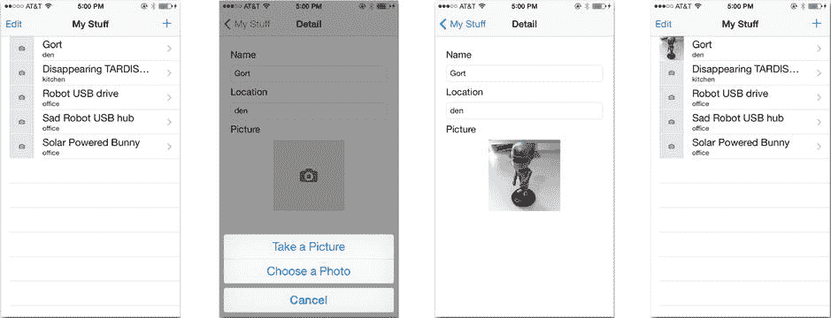

图 7-12. 测试 iPhone 界面

点击一个项目，点击详情视图中的占位图片，点击“拍照”，然后拍一张照片。裁剪后的图片应该会出现在详情视图中，并再次出现在主表格中，如图 7-12 所示。

恭喜，你已经为你的应用添加了拍照功能！虽然还没完全结束，但请享受这一刻，并尽情使用相机吧。

## 构建 iPad 界面

iPad 界面与 iPhone 界面几乎相同。请按照“添加图片视图”和“连接选择图片操作”两节中的步骤，添加视图对象和点击手势识别器，并将它们全部连接到对应的输出口和操作。（别忘了设置图片视图的用户交互已启用属性。）我建议的唯一更改是，将 iPad 图片视图放置在左侧——居中放置时离标签太远了——并将图片视图的大小从 128x128 更改为 256x256。你完成的 iPad 界面应如图 7-13 所示。

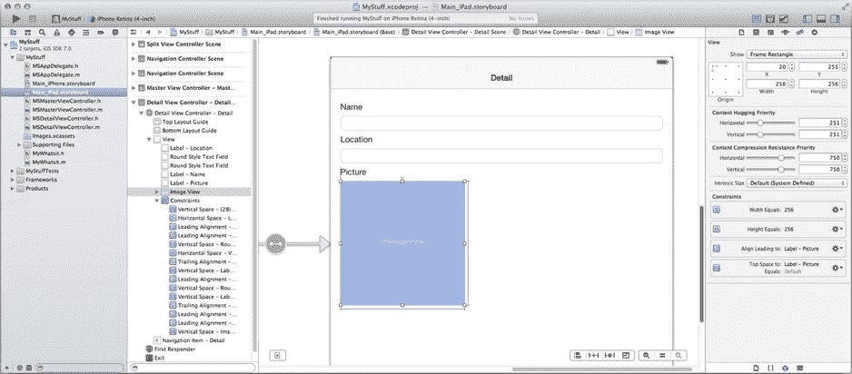

图 7-13. 完成的 iPad 界面

在 iPad 模拟器或你的 iPad 上运行 iPad 版本。如果你的 iPad 有相机，那将完美运行。从照片库中选择图片时，会呈现一个极其庞大的界面，且仅适用于竖屏方向，如图 7-14 所示。

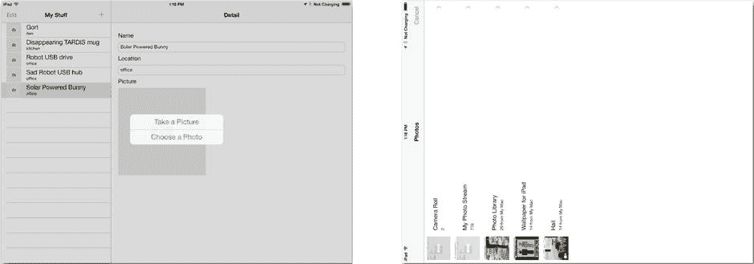

图 7-14. iPad 照片库选择器

显然，这不是理想的 iPad 界面。查阅 `UIImagePickerController` 的文档，你会发现如下声明：

> 在 iPad 上，呈现图片选择器的正确方式取决于其来源类型……如果你指定的来源类型是 `UIImagePickerControllerSourceTypePhotoLibrary` 或 `UIImagePickerControllerSourceTypeSavedPhotosAlbum`，则必须使用弹出控制器来呈现图片选择器……

因此，全屏相机界面在 iPad 上工作良好——并且是推荐的界面——而照片库选择器则应作为弹出窗口呈现。

**注意**

虽然在 iOS 7 中建议将照片库选择器显示在弹出窗口中，但在早期版本的 iOS 中是强制的。如果不这样做，你的应用将会崩溃。

在弹出窗口中呈现视图控制器是通过使用 `UIPopoverController` 对象完成的。要使用它，你必须：

- 为要显示的视图控制器创建一个弹出控制器
- 使用弹出控制器来呈现界面
- 在完成后关闭弹出控制器


### 添加弹出框

首先需要创建一个实例变量，用于保存弹出框控制器对象的引用。在完成弹出框控制器的使用之前，需要一直持有其引用。将以下三行加粗代码添加到`MSDetailViewController.m`实现文件开头的私有`@interface MSDetailViewController ()`部分：

```
@interface MSDetailViewController ()
{
    UIPopoverController *imagePopoverController;
}
@property (strong, nonatomic) UIPopoverController *masterPopoverController;
- (void)configureView;
- (void)presentImagePickerUsingCamera:(BOOL)useCamera;
- (void)dismissImagePicker;
@end
```

在`-presentImagePickerUsingCamera:`方法中，将最后一行代码（`[self presentViewController:cameraUI animated:YES completion:nil]`）替换为以下逻辑：

```
if (useCamera || UIDevice.currentDevice.userInterfaceIdiom==UIUserInterfaceIdiomPhone)
    {
    [self presentViewController:cameraUI animated:YES completion:nil];
    }
else
    {
    imagePopoverController = [[UIPopoverController alloc] initWithContentViewController:cameraUI];
    [imagePopoverController presentPopoverFromRect:self.imageView.frame
                                            inView:self.view
                          permittedArrowDirections:UIPopoverArrowDirectionAny
                                          animated:YES];
    }
```

新代码首先检查用户是否想要查看相机界面，或者用户是否正在使用 iPhone。如果其中任一条件为真，则像之前一样以全屏界面方式呈现`cameraUI`视图控制器。

如果这两个条件都为假，则用户想要在 iPad 上从照片库中选择图片。`else`块为`cameraUI`视图控制器创建了一个新的`UIPopoverController`，并将其保存在新的实例变量中。然后使用该弹出框控制器来呈现选择器界面。`FromRect:`和`inView:`参数将弹出框锚定到图片视图。

现在找到`-dismissImagePicker`方法，并将其代码替换为以下内容：

```
if (imagePopoverController!=nil)
        {
        [imagePopoverController dismissPopoverAnimated:YES];
        imagePopoverController = nil;
        }
    else
        {
        [self dismissViewControllerAnimated:YES completion:nil];
        }
```

新代码通过检查`imagePopoverController`变量来确定`-presentImagePickerUsingCamera:`是如何呈现选择器界面的，然后以相同的方式关闭图片选择器。

还有一项小小的维护工作要做。在`-presentImagePickerUsingCamera:`方法的最开始处，添加以下代码行：

`imagePopoverController = nil;`

这样做的原因是，`imagePopoverController`变量被用作一个标志，来指示使用了哪种技术来呈现图片选择器。如果用户选择了图片或取消了操作，你的委托方法会被调用，最终导致弹出框被关闭，并且`imagePopoverController`被重新设置为 nil。

不过，用户也可以通过点击弹出框外部来关闭 iPad 图片选择器。你可以通过实现弹出框委托并编写`-popoverControllerDidDismissPopover:`方法来捕获这一事件——但这似乎工作量较大。更简单的方法是在呈现下一个界面之前重置该变量，销毁可能遗留的任何多余弹出框控制器。

现在，你的 iPad 照片库选择器界面已准备好在 iPad 上使用，如图 7-15 所示。

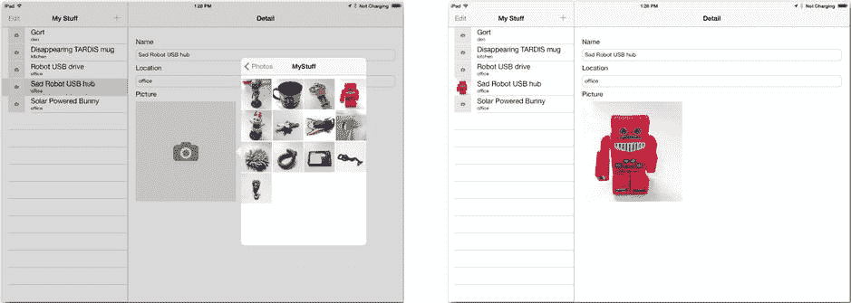

图 7-15. iPad 弹出框照片选择器

## 粘性键盘

如果你的应用还没注意到的话，有一个小怪癖就是粘性键盘。不，我指的不是边编程边吃巧克力造成的那种粘性。我指的是 iOS 中的虚拟键盘。图 7-16 显示了点击文本字段时出现的虚拟键盘。

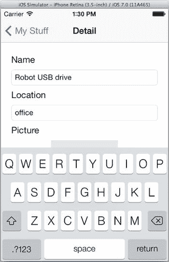

图 7-16. iOS 的虚拟键盘

问题在于，一旦唤出键盘，它就不会消失。它会一直停留在那里，遮挡住你的图片视图，通常还很烦人。这是 iOS 从一开始就有的“特性”，如果这对你的应用造成困扰，你就必须处理它。

我相信你一定注意到，你使用的许多其他应用并没有这个问题。点击文本字段外部就能让键盘消失。这些应用的开发者会拦截文本字段外部的点击事件并关闭键盘。针对这个问题，已有多种解决方案，你可以在互联网上找到很多。我将向你展示一个特别简单的方法，只需一分钟就能集成到你的应用中。

这个“技巧”是捕获任何文本字段对象外部的触摸事件，并将这些事件转换为收起键盘的操作。先从第二部分开始：创建一个收起键盘的操作。在你的`MSDetailViewController.m`文件中，将以下方法添加到实现部分：

```
- (IBAction)dismissKeyboard:(id)sender
{
[self.view endEditing:NO];
}
```

这个简单的方法向界面的根视图发送了`-endEditing:`消息。`-endEditing:`方法专门用于解决这个问题；它会搜索视图的子视图，寻找当前正在编辑的可编辑对象。如果找到，它会要求该对象放弃第一响应者状态，从而结束编辑会话并收起键盘。

提示

传递给`-endEditing:`消息的单个值是`force`参数。如果为`YES`，它会强制视图结束编辑，即使视图本身不愿意。传递`NO`则让视图自行决定，可能不会结束编辑会话。我选择礼貌地让视图自己决定。

现在，在`MSDetailViewController.h`文件的公共`@interface`部分为这个方法添加一个原型，以便 Interface Builder 能够看到它：

`- (IBAction)dismissKeyboard:(id)sender;`

现在，你要再添加一个点击手势识别器。在`Main_iPhone.storyboard`文件中，从对象库中找到点击手势识别器。将其拖拽到你的界面中，并放入根视图对象中——你可以将其放到界面的空白区域，或者直接放入大纲视图中的根视图对象，如图 7-17 所示。

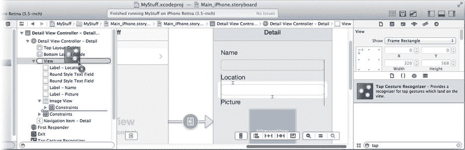

图 7-17. 向根视图添加点击手势识别器

按住 Control/右键点击新的手势识别器，将其拖拽到`Detail View Controller`，并连接到新的`-dismissKeyboard:`操作。（如果你不确定哪个手势识别器对象属于根视图，请使用“连接检查器”（参见图 7-9），位于“连接选择图片操作”部分。）现在，任何在特定子视图外部发生的点击都会将这些触摸事件传递给根视图，从而关闭键盘。如果你不清楚为什么会这样，请回顾第 4 章中的“命中测试”部分。

试试看。运行 iPhone 界面，点击文本字段内部，然后点击文本字段外部。你应该会看到键盘出现后又消失。

现在向 iPad 界面（`Main_iPad.storyboard`）的根视图添加一个点击手势识别器，并将其连接到相同的操作。

为了彻底起见，找到`-choosePicture:`方法中应用意图呈现界面的位置，并添加以下一行加粗代码：


`[self dismissKeyboard:self];`

```
if (hasPhotoLibrary && hasCamera)
{
```

这行代码会在用户点击图像视图进行更改时，使键盘收回。请记住，在命中测试中，最具体的视图对象会接收触摸事件。由于图像视图对象接收触摸事件，这些事件将不会传递到根视图。

## 高级相机技术

我相信你对于将相机和照片库功能添加到应用中感到兴奋。然而，如果你的目标是打造下一个 Hipstamatic 或 Instagram，那么 `UIImagePickerController` 并不是你想要的；你需要的是底层的相机控制。你可以在 `AVCaptureDevice` 类中找到这种控制。该对象代表单个图像采集设备（即相机），并让你能够极其精确地控制它的每一个方面，从打开闪光灯到控制曝光的白平衡。

这是更庞大的 `AV Foundation` 框架的一部分，该框架还涵盖了视频采集、视频播放、音频录制和音频播放。你将在本书后续章节中探索此框架的部分内容。它的一些特性是面向对象的，而另一些则是 C 函数。

使用 `UIImagePickerController` 这样的类的优势在于，许多拍照的细节都已为你处理妥当。但它也限制了应用的功能和设计。底层类和函数开辟了设计和界面可能性的新天地，但需要你自行处理这些细节。要了解更多，请从 Xcode 的文档和 API 参考中提供的 AV Foundation 编程指南开始。

## 总结

为你的 `MyStuff` 应用添加拍照功能使其大为增色，使用起来也更有趣。你还学到了一些关于呈现视图控制器和处理图像的知识。现在你知道如何将图像导出到用户的相机胶卷，如何向现有视图添加点击手势识别器，如何链接到其他框架，以及如何让那个烦人的键盘消失。你也在逐渐熟悉输出口、连接和委托；换句话说，你正在成为一名 iOS 开发者！

在过去的几章中，我一直不断提到“视图”、“控制器”和“数据模型”对象。下一章将再次暂停开发，来解释这些概念的含义，并探讨一个重要的设计模式。

