# 8. 模范公民

**摘要**

本章将全面介绍模型-视图-控制器设计模式。我在第 6 章中提到过，设计模式是针对常见编程问题的可复用解决方案。模型-视图-控制器（MVC）设计模式可以说是当今最重要且最具影响力的设计模式。在本章中，你将了解到：

- 什么是模型-视图-控制器设计模式
- 什么是好的数据模型
- 什么是好的视图对象
- 什么是好的控制器对象
- MVC 对象之间如何通信
- 何时可以“取巧”

你可能会认为所有这些 MVC 概念是一堆深奥的计算机科学理论，对于编写“死星光束炮控制”应用毫无帮助。恰恰相反，学习（哪怕是皮毛）MVC 设计模式不仅能让你的“死星光束炮控制”应用更可靠，还能让编写和维护工作变得更容易。良好的 MVC 设计可能需要前期多费些心思，但最终能节省大量工作——而且你的应用出现 bug 的可能性也会更小。

所以，你可以跳过本章，但当你按下应用中的“摧毁奥德兰”按钮却毫无反应时……你得向维德勋爵解释，而不是我。

### 模型-视图-控制器设计模式

在第 6 章中，我谈到了单一职责原则、封装和“开闭”原则。所有这些都可以归结为一个简单的概念：

> 一个对象应该只做一件事，并且把它做好。

为了做任何有用的事情，应用必须存储数据、在界面中显示数据，并允许用户与之交互。模型-视图-控制器设计模式将应用必须做的事情（存储、显示和交互）组织到只做一件事的对象（数据对象、视图对象和控制器对象）中，并描述了这些对象如何协同工作。让我们从三者中最简单的一个开始：数据模型对象。


### 数据模型对象

数据模型由存储应用信息的对象构成。数据模型对象应满足以下条件：

- 表示应用中的数据
- 封装数据的存储方式
- 避免对数据的展示或修改方式进行假设

应用的数据就是应用所使用的一切数值、信息或概念。在您的 `MyStuff` 应用中，数据模型仅包含您所拥有物品的名称、位置和图片。国际象棋应用的数据模型会稍显复杂：需包含代表棋盘的对象、每位玩家的对象、每个棋子的对象、记录下棋步骤的对象等。天文目录应用可能需要数十个类和数十万个对象来追踪可见恒星。

数据模型类的首要任务是表示应用的数据，同时隐藏（封装）数据的存储方式。它应为应用的其余部分提供简洁的接口，使其他类能获取所需信息，而无需了解数据的具体表示或存储细节。

即使是像 `MyStuff` 这样的"简单"应用，封装对应用的未来发展也至关重要。例如，`MyWhatsit` 的图片属性存储了一个包含物品照片的 `UIImage` 对象。听起来很简单对吧？但图片会占用大量内存，如果您的应用需要盘点数百件（而非数十件）物品，应用将无法将所有图片保留在内存中——最终会耗尽内存并崩溃。

您可以通过修改数据模型来解决此问题：将当前未显示的图片（毕竟无法同时展示所有图片）以独立图片文件的形式写入闪存。当下次有对象请求 `MyWhatsit` 对象的图片属性时，您的数据模型可以判断该图片是否在内存中，或是否需要从闪存中检索。

关键在于所有决策都封装在数据模型中。其他使用 `MyWhatsit` 对象的类只需请求图片属性；它们无需知道信息如何或在哪里存储，也不应关心这些细节。如果这点不清晰，请回顾第 6 章中"封装"部分的餐车类比。

数据模型另一个极其重要的方面是"它不是什么"。数据模型位于 MVC 设计的底层，不应包含与应用数据或其维护方式无直接关联的属性或逻辑。

具体来说，它不应了解或假设与之协作的视图或控制器对象的任何信息。它不应包含视图对象的引用、不应有在用户界面中展示数据的方法，也不应直接处理用户操作。从这个角度看，数据模型是 MVC 三种角色中最纯粹的：它只关注数据，别无其他。

### 视图对象

视图对象位于 MVC 设计的中间层。优秀的视图对象应具备以下特点：

- 向用户展示数据模型的某些方面
- 理解所显示的数据及其显示方式，但仅此而已
- 可能解释用户界面事件并向控制器对象发送操作

视图对象的主要目的是显示数据模型中的值。视图对象必须（出于必要性）至少理解数据模型的某些方面，但对控制器对象一无所知。

视图对象对数据模型了解多少？这取决于所显示内容的复杂程度。通常，它只需掌握完成工作所需的信息，不多也不少。显示字符串的视图只需知道要显示的字符串值。绘制夜空动态画面的视图则需要大量信息：可见恒星列表、星等和颜色、观测者坐标、当前时间、方位角、仰角、视角等。要寻找示例，只需查看 Cocoa Touch 框架即可——它充满了从最简单的字符串（`UILabel`）到整个文档（`UIWebView`）等各种显示内容的视图对象。

视图对象（尤其是复杂的视图对象）通常会维护对所显示数据模型对象的引用。这样的视图对象不仅理解如何显示数据，还知道要显示什么数据。

视图对象还可能解释用户界面事件（如"滑动"或"捏合"手势），并将其转换为操作消息（如 `-nextPage:` 或 `-zoomOut:`），然后发送给控制器对象。视图对象不应自行执行这些操作；它只需将它们传递给控制器即可。

> **注：** 解释事件并发送操作消息的视图对象称为控件——不要与控制器混淆。大多数控件视图（文本字段、按钮、滑块、开关等）都是 `UIControl` 的子类。

### 控制器对象

控制器位于 MVC 设计的顶层，是应用的"业务核心"。控制器对象是监督者，负责监督并经常协调数据模型和视图对象。控制器对象应具备以下特点：

- 理解并经常创建数据模型对象
- 配置并经常创建视图对象
- 执行从视图对象接收的操作
- 对数据模型进行修改
- 协调数据模型与视图对象之间的通信
- 可能负责保持视图对象的更新

解释控制器"不是"什么比解释"是"什么更容易。它不是数据模型；控制器对象不存储、管理或转换应用的数据。¹它不是视图对象；它不绘制界面或解释底层事件。本质上，它是其他所有内容的集合。

控制器可能参与数据模型和视图对象的初始化，通常负责创建数据模型对象并从 Interface Builder 文件中加载视图对象。

控制器对象包含应用的所有业务逻辑。它们执行用户发起的命令、响应高级事件、并促使数据模型发生变化。在复杂应用中，通常有多个控制器对象，每个负责特定的功能或界面。

您的控制器对象也是应用内大多数消息的接收者或发送者。它们如何参与取决于您的设计，这引出了对象间通信的话题。


### MVC 通信模式

在最简单的形式中，MVC 对象之间的通信形成了一个循环（见图 8-1）：

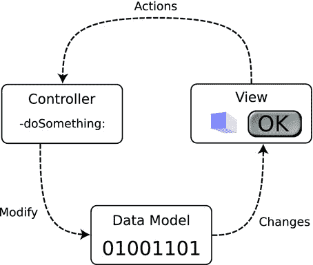

图 8-1. 简单的 MVC 通信模式

- 数据模型对象将变更通知给视图对象
- 视图对象将操作发送给控制器对象
- 控制器对象修改数据模型

在这种安排下，数据模型负责将变更通知给所有观察者。视图对象负责观察并显示这些变更，同时将操作发送给控制器对象。控制器对象执行这些操作，通常会对数据模型进行修改，于是整个循环再次启动。

与直觉相反，这种简化后的通信模式只在相当复杂的应用中才会出现。大多数情况下，数据模型并未配置为发送通知，视图对象也不会直接观察变更。相反，控制器对象会介入其中，负责在数据模型发生变更时通知视图对象，如图 8-2 所示。

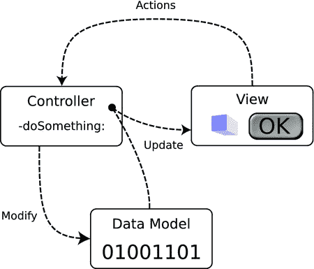

图 8-2. 典型的 MVC 通信模式

现在你已经了解了 MVC 设计模式的基础知识，让我们再开发一个 iOS 应用。这次我不想让你专注于某个特定的 iOS 技术，比如运动事件或摄像头，而是要你关注应用中各个对象扮演的角色、它们的设计方式，以及随着应用演进它们会如何变化。

## 颜色模型

你将开发一个名为 `ColorModel` 的新应用。这个应用允许你使用色调-饱和度-亮度颜色模型来选择颜色。其初始设计很简单，如图 8-3 所示。界面包含三个滑块，分别对应 HSB 的三个数值，以及一个用于显示所选颜色的视图。

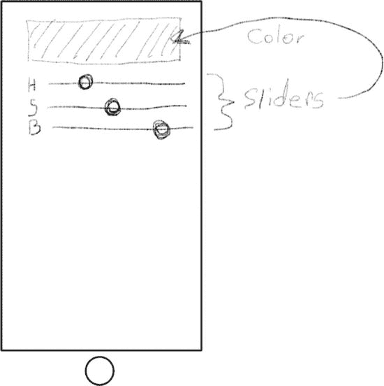

图 8-3. `ColorModel` 的初始设计

注意：颜色模型，或称色彩空间，是对可见颜色的一种数学表达。有几种常见的模型适用于不同的应用场景。计算机显示器和电视使用红绿蓝（RGB）模型，艺术家喜欢使用色调-饱和度-亮度（HSL）模型，而打印机则使用青-品红-黄-黑（CMYK）模型。详见 [`http://en.wikipedia.org/wiki/Color_model`](http://en.wikipedia.org/wiki/Color_model)。

首先启动 Xcode。创建并配置一个新项目：

- 使用“单视图应用”模板
- 将项目命名为 `ColorModel`
- 将类前缀设置为 `CM`
- 设备类型设置为 iPhone
- 创建项目
- 在 `ColorModel` 目标的 `General` 标签页中，取消勾选 `Landscape Left` 和 `Landscape Right` 方向，确保只勾选 `Portrait` 方向

### 创建数据模型

（设计阶段之后）几乎所有应用的第一步都是开发数据模型。这个应用的数据模型非常简单：它由一个单一对象组成，负责维护色调、饱和度和亮度的数值。此外，它还会将这些数值转换为适合显示和其他用途的颜色对象。首先，向你的项目添加一个新的 Objective‑C 源文件。在项目导航器中选择 `ColorModel` 组（是文件夹，不是项目），然后选择“文件”➤“新建”➤“文件...”命令（或者在组上右键/按住 Control 键点击，选择“新建文件...”）。在 iOS 分类下选择 Objective‑C 类模板，将其命名为 `CMColor`，并设为 `NSObject` 的子类。现在你将拥有一个空的数据模型类，如图 8-4 所示。

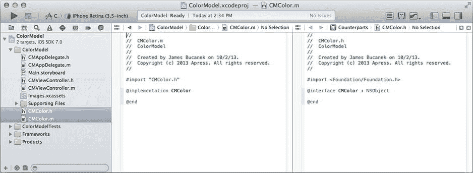

图 8-4. 空的 `CMColor` 类

通过向 `CMColor.h` 文件的 `@interface` 部分添加以下属性来创建你的数据模型公共接口：

```
@property (nonatomic) float hue;
@property (nonatomic) float saturation;
@property (nonatomic) float brightness;
@property (readonly,nonatomic) UIColor *color;
```

前三个属性是浮点数值，分别对应颜色的色调、饱和度和亮度。色调以度为单位，取值范围为 0° 到 360°。另外两个数值以百分比表示，取值范围为 0% 到 100%。

最后一个属性是 `readonly`——这意味着该对象的客户端无法修改它。它包含一个 `UIColor` 对象，用于表示当前“色调/饱和度/亮度”三元组对应的颜色。`color` 属性是一个合成属性：其值是根据另外三个属性的值计算得出的。通过在 `CMColor.m` 中用你自己的方法替换默认的 getter 方法来实现这一点：

```
- (UIColor*)color
{
    return [UIColor colorWithHue:self.hue/360
                      saturation:self.saturation/100
                      brightness:self.brightness/100
                           alpha:1];
}
```

从色调-饱和度-亮度值到 `UIColor` 对象（使用红绿蓝模型）的转换工作，已经由 `UIColor` 类贴心提供了。我很欣慰。虽然存在各种颜色模型之间的转换公式，但那需要用到比我想解释的多得多的数学知识。

注意：也可以让 `color` 属性变得可设置：你只需添加代码来相应地更新色调、饱和度和亮度值。数据模型应保持一致性；如果 `color` 属性始终代表当前 `hue`、`saturation` 和 `brightness` 属性所表示的颜色，那么更改颜色也应该更改色调、饱和度和亮度，使它们保持一致。

然而，`UIColor` 用来表示色调、饱和度和亮度的数值范围与你选择——好吧，是我选择——的数据模型不同。在你的数据模型中，色调是 0 到 360 之间的值。`UIColor` 期望的值范围是 0 到 1。同样，`UIColor` 的饱和度和亮度值也在 0 到 1 之间。为了在我们的模型和 `UIColor` 使用的模型之间进行转换，必须通过除以各自范围来缩放这些值。这正是数据模型向应用其他部分封装（隐藏）的细节。

完成数据模型后，接下来该处理视图对象了。


### 创建视图对象

选择你的 `Main.storyboard` 界面构建器文件。在对象库中找到普通的 `View` 对象，并将其拖入界面中。调整其大小和位置，使其占据显示区域的顶部，并使用定位参考线使其与左边距、上边距和右边距保持适当间距。使用调整柄或尺寸检查器，将其高度设置为 `80` 像素，如图 8-5 所示。此视图将用于显示用户所选的颜色。

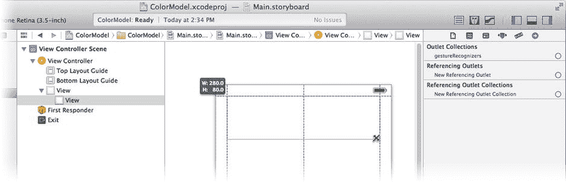

图 8-5.

添加一个简单的视图对象

按住 Control/右键点击新的视图对象，向下拖动，松开，并选择“高度”约束，将视图高度固定为 80 像素。

在库中找到 `Label` 对象，并将其拖入界面。将其放置在视图对象左下角的紧下方。将其标题设置为 `H`。接着在库中找到 `Slider` 对象，拖入界面，放置在颜色视图的正下方，并紧贴刚刚添加的标签右侧，如图 8-6 所示。

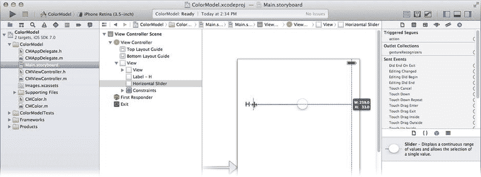

图 8-6.

添加第一个标签和滑块

选择滑块，并拖动右侧居中的调整柄。调整其大小，使其右边缘与视图对齐。你需要再添加两组标签/滑块对，因此快速复制刚刚创建的两个控件。同时选中标签和滑块视图（按住 Shift 键，或拖出一个选择矩形将它们框选）。然后按住 Option 键。在按住 Option 键的同时，点击并向下拖动这对控件。Option 键会将拖拽操作变为复制操作。将复制的控件放置在第一对的正下方，如图 8-7 所示，然后松开鼠标。

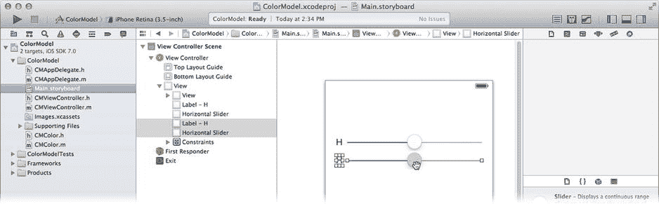

图 8-7.

复制标签和滑块

再次执行复制操作，这样你就有了三个标签和三个滑块控件。按住 Control/右键点击顶部的滑块，向下拖动到中间的滑块，松开，然后从约束菜单中选择“等宽”。重复此操作，向下拖动到底部滑块，如图 8-8 所示。这将添加约束，使三个滑块控件保持相同的宽度。

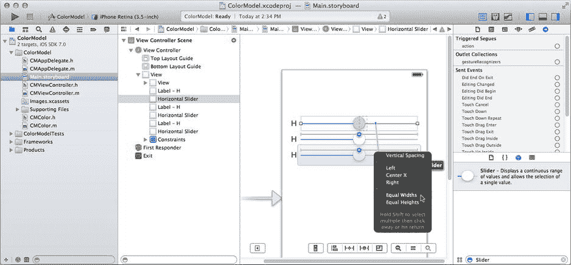

图 8-8.

约束滑块的宽度

将第二个和第三个标签的标题分别改为 `S` 和 `B`。现在你已经拥有了所有需要的视图对象。通过从“解决自动布局问题”控件中选择“在视图控制器中添加缺失的约束”，来完善约束。

在你的数据模型中，色相值范围为 0° 到 360°，饱和度和亮度值范围为 0% 到 100%。相应地更改三个滑块的值范围。选择顶部（色相）滑块，并使用属性检查器将其最大值从 `1` 改为 `360`，如图 8-9 所示。将另外两个滑块的最大值改为 `100`。

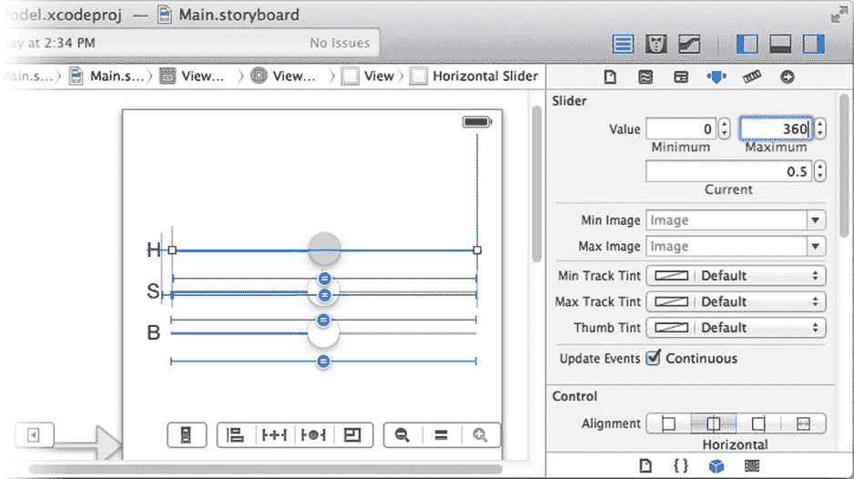

图 8-9.

设置滑块控件的值范围

### 编写控制器

Xcode 项目模板已经提供了一个控制器类；你只需将其补充完整。选择你的 `CMViewController.h` 接口文件。你的控制器需要引用数据模型对象，以及用于连接界面的输出口和动作方法。首先在 `@interface` 指令上方添加一条 `#import` 语句，以便你的控制器了解 `CMColor` 类：

```
#import "CMColor.h"
```

在 `@interface` 内部，添加两个属性：

```
@property (strong,nonatomic) CMColor *colorModel;
@property (weak,nonatomic) IBOutlet UIView *colorView;
```

第一个属性是你的控制器与数据模型的连接。第二个属性是一个输出口，你将把它连接到颜色视图。这将允许你的控制器更新视图中显示的颜色。

最后，你的控制器需要三个动作方法，每个滑块控件对应一个，用于调整数据模型中的一个值：

```
- (IBAction)changeHue:(UISlider*)sender;
- (IBAction)changeSaturation:(UISlider*)sender;
- (IBAction)changeBrightness:(UISlider*)sender;
```

切换到 `CMViewController.m` 实现文件，并添加这三个方法：

```
- (IBAction)changeHue:(UISlider*)sender
{
    self.colorModel.hue = sender.value;
    self.colorView.backgroundColor = self.colorModel.color;
}

- (IBAction)changeSaturation:(UISlider*)sender
{
    self.colorModel.saturation = sender.value;
    self.colorView.backgroundColor = self.colorModel.color;
}

- (IBAction)changeBrightness:(UISlider*)sender
{
    self.colorModel.brightness = sender.value;
    self.colorView.backgroundColor = self.colorModel.color;
}
```

每当滑块控件发生变化时，都会接收到相应的动作消息。每个方法都简单地使用滑块的新值修改数据模型中的对应值。然后更新颜色视图，以反映数据模型中的新 `color`。在此实现中，你的控制器负责在数据模型发生变化时更新视图（参见图 8-2）。

最后一步是在加载控制器时创建数据模型。找到 `-viewDidLoad` 方法，并添加加粗的一行代码：

```
- (void)viewDidLoad
{
    [super viewDidLoad];
    self.colorModel = [CMColor new];
}
```


### 连接你的界面

最后一步是将控制器的插座变量和动作连接到视图对象。再次选择 `Main.storyboard` 的 Interface Builder 文件。选中视图控制器对象，并使用连接检查器将控制器的 `colorView` 插座变量连接到 `UIView` 对象，如图 8-10 所示。

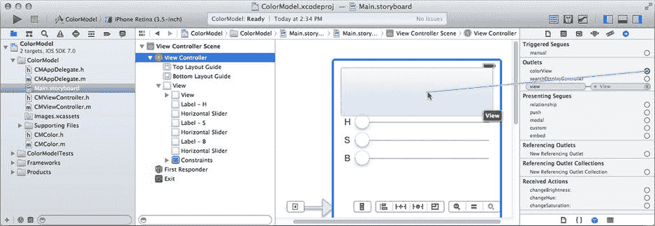

图 8-10. 连接 `colorView` 插座变量

现在，将三个滑块的动作连接到控制器的 `-changeHue:`、`-changeSaturation:` 和 `-changeBrightness:` 方法。选择顶部滑块。使用连接检查器，将 `Value Changed` 事件连接到控制器的 `-changedHue:` 动作。重复此操作，将中间滑块连接到 `-changeSaturation:` 方法，底部滑块连接到 `-changeBrightness:` 方法，如图 8-11 所示。

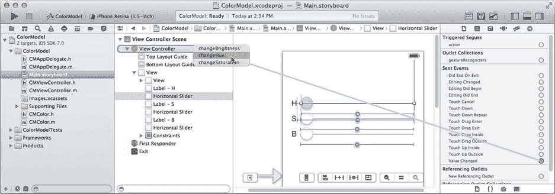

图 8-11. 连接滑块动作

**提示：** 你也可以通过右键/按住 Control 键并点击滑块，然后拖动到控制器来建立这些连接。之所以可行，是因为在连接动作消息时，`Value Changed` 事件是控制对象的默认事件。

还有一个最终的、外观上的细节需要处理。数据模型中的 `hue`、`saturation` 和 `brightness` 值都初始化为 `0.0`（黑色）。而颜色视图中的默认颜色并非黑色，滑块的初始位置也都是 `0.5`。为使视图对象从一开始就与数据模型保持一致，请选中滑块并使用属性检查器将 `Current` 属性设置为 `0.0`。选中颜色视图对象，并将其背景属性设置为 `Black Color`，如图 8-12 所示。

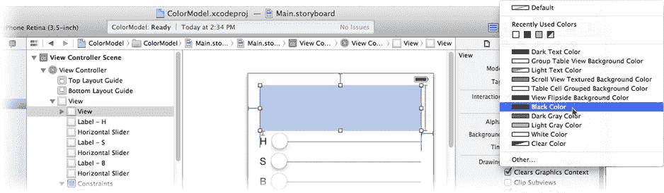

图 8-12. 完成后的 `ColorModel` 界面

在 iPhone 模拟器中运行你的应用。它会显示为黑色，三个滑块都设置在其最小值。通过改变滑块的值来探索色相、饱和度和亮度的不同组合，如图 8-13 右侧所示。

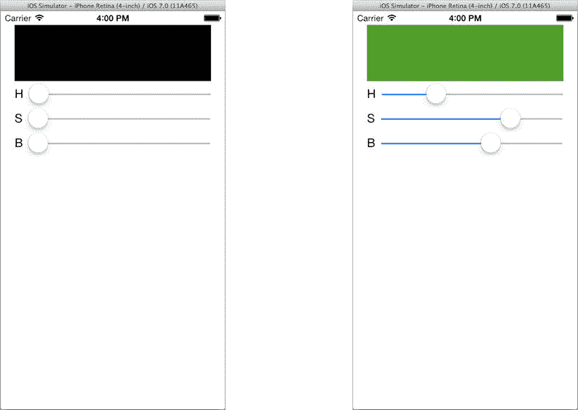

图 8-13. 第一个 `ColorModel` 应用

## 拥有多个视图

MVC 设计模式将数据模型与视图对象分离的一个原因是为了避免两者之间的一对一关系。使用 MVC，你可以在数据模型和视图对象之间创建一对多甚至是多对多的关系。通过创建更多以不同方式显示相同数据模型的视图对象来利用这一点。

首先选择你的 `Main.storyboard` Interface Builder 文件。使用右侧的调整大小手柄，将三个滑块的宽度显著缩短。你需要临时腾出一些空间，以便在它们右侧添加新的视图对象，如图 8-14 所示。

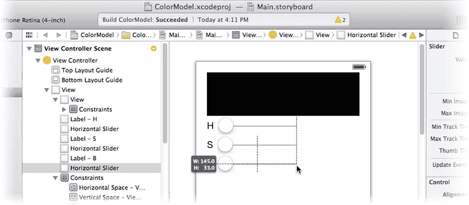

图 8-14. 为新视图对象腾出空间

在库中找到标签对象，并在每个滑块的右侧添加三个新标签，使其与颜色视图的右侧边缘对齐，如图 8-15 所示。

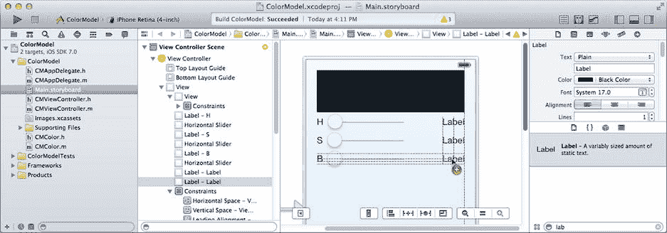

图 8-15. 添加 HSB 值标签

每个标签将显示一个属性的文本值。编辑三个标签的文本属性，可以使用属性检查器，也可以双击标签对象。将顶部标签更改为 `360°`（按住 shift+option+8 可输入度数符号），另外两个更改为 `100%`，如图 8-16 所示。如果编辑后标签位置发生偏移，请拖动它们，使其右侧边缘再次与颜色视图的右侧边缘对齐。

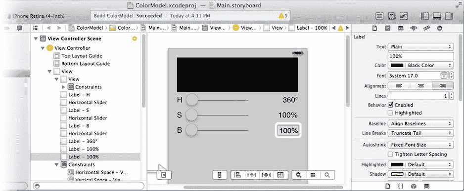

图 8-16. 设置占位符值

选中所有三个标签。使用属性检查器，将其 `Alignment` 属性更改为右对齐（三个对齐按钮中最右侧的一个）。这将使数值保持整齐排列。

选中顶部滑块。选中由 Xcode 创建的、恰好位于滑块右侧的右边缘约束，如图 8-17 所示。使用属性检查器，将其值设置为 `-60`。这将更改约束，使顶部滑块的右边缘现在从颜色视图的右侧边缘向内缩进 60 像素，为你刚刚添加的标签留出空间。

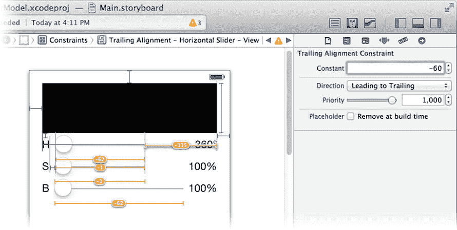

图 8-17. 调整滑块约束

如果你想查看此更改的效果，请选中所有三个滑块，然后从“解决自动布局问题”控件中选择“更新框架”。要完成布局，请从“解决自动布局问题”控件中选择“在视图控制器中添加缺失的约束”。

你需要为这三个视图添加插座变量，因此请将它们添加到你的 `CMViewController.h` 接口文件中：

```objc
@property (weak,nonatomic) IBOutlet UILabel *hueLabel;
@property (weak,nonatomic) IBOutlet UILabel *saturationLabel;
@property (weak,nonatomic) IBOutlet UILabel *brightnessLabel;
```

在 Interface Builder 中连接这三个插座变量。切换回 `Main.storyboard` 文件，选中视图控制器，并使用连接检查器将插座变量连接到它们各自的 `UILabel` 对象，如图 8-18 所示。

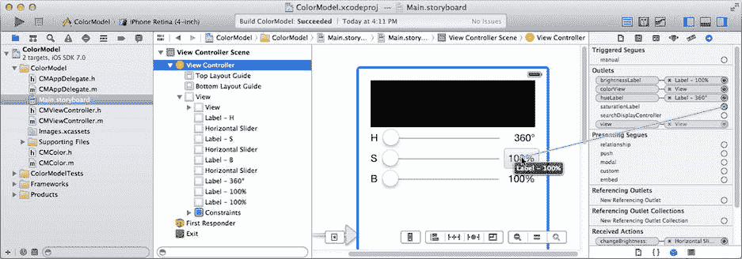

图 8-18. 连接标签插座变量

切换到你的实现文件（`CMViewController.m`），并通过添加以下代码修改三个动作，使每个动作也更新其相应的标签视图：

```objc
- (IBAction)changeHue:(UISlider*)sender
{
    self.colorModel.hue = sender.value;
    self.colorView.backgroundColor = self.colorModel.color;
    self.hueLabel.text = [NSString stringWithFormat:@"%.0f\u00b0",
                          self.colorModel.hue];
}

- (IBAction)changeSaturation:(UISlider*)sender
{
    self.colorModel.saturation = sender.value;
    self.colorView.backgroundColor = self.colorModel.color;
    self.saturationLabel.text = [NSString stringWithFormat:@"%.0f%%",
                                 self.colorModel.saturation];
}

- (IBAction)changeBrightness:(UISlider*)sender
{
    self.colorModel.brightness = sender.value;
    self.colorView.backgroundColor = self.colorModel.color;
    self.brightnessLabel.text = [NSString stringWithFormat:@"%.0f%%",
                                 self.colorModel.brightness];
}
```

这三个新语句会更改标签字段中的文本，以显示每个属性的文本值。格式说明符 `%.0f` 将数据模型的浮点值四舍五入到最接近的整数。字面意思是：“格式化（`%`）浮点值（`f`），使其小数点右侧为零（`.0`）位数字。”

**注意：** 转义序列 `\u00b0` 是度数符号（shift+option+8）。转义序列 `%%` 表示一个单独的 `%` 字符。格式字符串说明符以 `%` 开头（例如 `%u` 或 `%02x`）。要在格式字符串中包含单个百分号字符，请使用 `%%`。

现在再次运行你的应用。这一次，每当你调整其中一个滑块的值时，颜色和文本形式的 HSB 值都会同时更新，如图 8-19 所示。

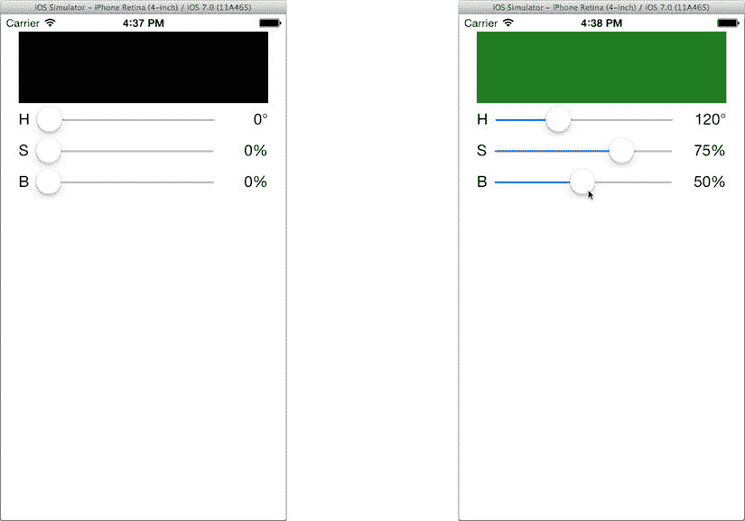

图 8-19. 带有 HSB 值的 `ColorModel`


