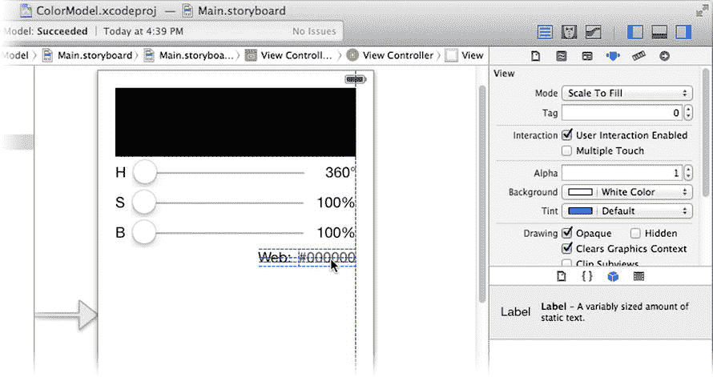
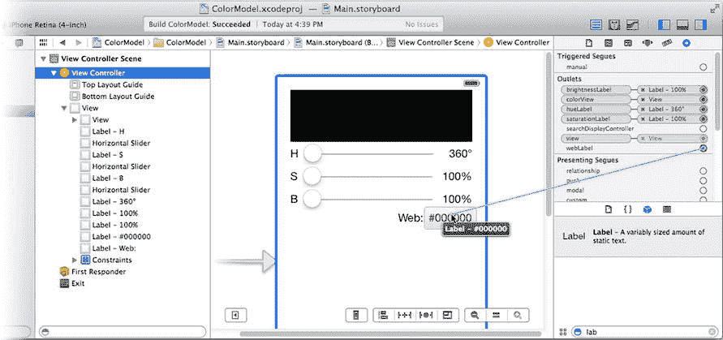
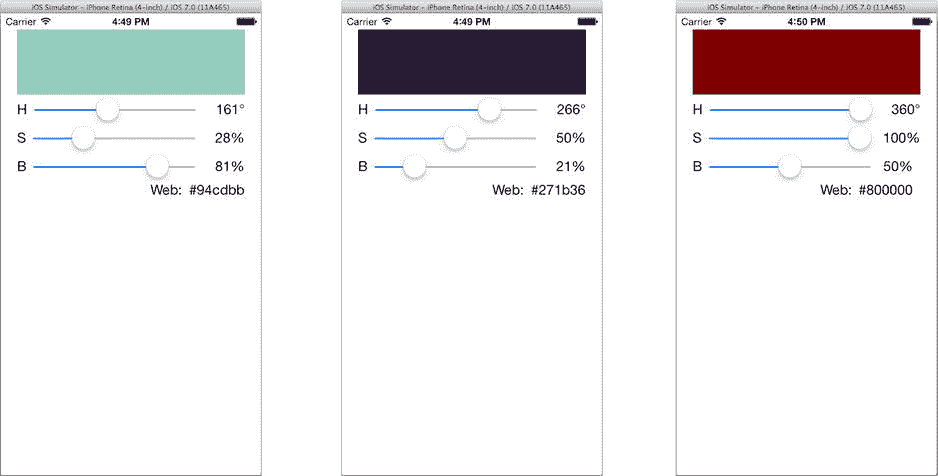

# 整合更新

现在，你的数据模型以不同形式出现在四个不同的视图中。但何必止步于此？在 `CMViewController.xib` 文件中，再添加两个标签。将其中一个的文本设置为 `#000000`，另一个设置为 `Web:`。按图 8-20 所示放置它们，并将右侧标签的对齐属性设置为右对齐。从“解决自动布局问题”控件中选择“在视图控制器中添加缺失的约束”。



图 8-20. 添加网页安全色视图

你将使用这个标签来显示所选的“网页”颜色。这是所选颜色的 RGB 值，以 HTML 短颜色常数的形式呈现。接下来的两步你应该能轻松完成：在 `CMViewController.h` 中添加以下输出口属性：

`@property (weak,nonatomic) IBOutlet UILabel *webLabel;`

切换回 `Main.storyboard`，并将 `webLabel` 输出口连接到 `#000000` 标签对象，如图 8-21 所示。



图 8-21. 连接 webLabel 输出口

现在切换到 `CMViewController.m` 实现文件，思考需要修改哪些内容。以下是设置 `webLabel` 视图以显示颜色十六进制值的代码：

```
CGFloat red, green, blue, alpha;
[self.colorModel.color getRed:&red green:&green blue:&blue alpha:&alpha];
self.webLabel.text = [NSString stringWithFormat:@"#%02lx%02lx%02lx",
                       lroundf(red*0xff),
                       lroundf(green*0xff),
                       lroundf(blue*0xff)];
```

这段代码从 `UIColor` 对象中提取出单独的红色、绿色和蓝色值。然后使用这些值（范围在 0.0 到 1.0 之间）创建一个由六个十六进制数字组成的字符串，每种颜色对应两个数字，范围从 00 到 ff，并四舍五入到最接近的整数。

虽然这段代码不多，但需要重复编写三次，因为每个操作方法（`-changeHue:`、`-changeSaturation:`、`-changeBrightness:`）都必须更新新的网页值视图。

有一条古老的编程格言说：

> 如果你在重复自己，那就重构。

它的意思是，如果你发现自己一遍又一遍地编写相同的代码，那么很可能到了重新组织和整合代码的时候了。一个不言而喻的事实是，编写的代码越多，引入错误的机会就越大。软件工程师的一个共同目标是尽量减少编写的代码量。这不仅仅是因为我们懒惰（至少，我们中的很多人确实如此），而是因为这样做能得出更简洁的解决方案。

将对各个视图对象的更新整合到一个名为 `-updateColor` 的方法中。首先，在 `CMViewController.m` 文件的开头为新方法添加一个原型：

```
@interface CMViewController ()
- (void)updateColor;
@end
```

将每个操作中的单独更新替换为一条更新所有视图对象的消息：

```
- (IBAction)changeHue:(UISlider*)sender
{
    self.colorModel.hue = sender.value;
    [self updateColor];
}

- (IBAction)changeSaturation:(UISlider*)sender
{
    self.colorModel.saturation = sender.value;
    [self updateColor];
}

- (IBAction)changeBrightness:(UISlider*)sender
{
    self.colorModel.brightness = sender.value;
    [self updateColor];
}
```

最后，编写 `-updateColor` 方法：

```
- (void)updateColor
{
    self.colorView.backgroundColor = self.colorModel.color;
    self.hueLabel.text = [NSString stringWithFormat:@"%.0f\u00b0",
                          self.colorModel.hue];
    self.saturationLabel.text = [NSString stringWithFormat:@"%.0f%%",
                                 self.colorModel.saturation];
    self.brightnessLabel.text = [NSString stringWithFormat:@"%.0f%%",
                                 self.colorModel.brightness];

    CGFloat red, green, blue, alpha;
    [self.colorModel.color getRed:&red green:&green blue:&blue alpha:&alpha];
    self.webLabel.text = [NSString stringWithFormat:@"#%02lx%02lx%02lx",
                          lroundf(red*255),
                          lroundf(green*255),
                          lroundf(blue*255)];
}
```

第一行更新了颜色视图对象的背景颜色，这项任务之前在每个操作中都重复出现。接下来的三条语句更新了三个 HSB 标签视图，最后的代码块计算了十六进制 RGB 值并更新了 `webLabel`。

再次运行你的应用，如图 8-22 所示。每次对数据模型的更改都会更新五个不同的视图对象，而且你的控制器代码可以说比以前更简单且更易于维护。你可以轻松添加更新数据模型的新操作；你所要做的就是在返回前发送 `-updateColor`。类似地，可以添加新的视图对象，你只需要添加一个输出口并修改 `-updateColor` 即可。



图 8-22. 带有网页值的 ColorModel

