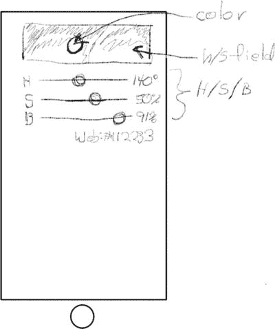
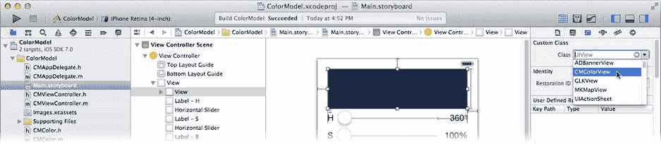
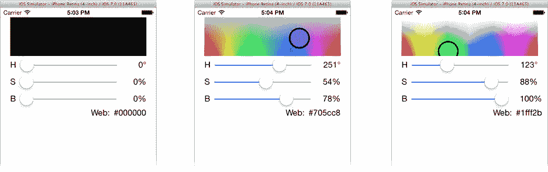

# 复杂视图对象

到目前为止，你在 ColorModel 中使用的视图对象显示的都是相对简单的（`NSString` 或 `UIColor`）值。有时视图对象会显示更复杂的数据类型。复杂的视图对象保持对数据模型的引用并不罕见。这使得它们能够直接访问所需的所有信息。

为了让 ColorModel 更有趣一点，你将用一个自定义视图对象替换简单的 `UIView` 对象，该对象除了显示色相/饱和度颜色图表外，还会标识出色相、饱和度和亮度滑块所选的具体颜色。修改你的设计后，新应用应该看起来像图 8-23 所示。



图 8-23. 更新后的 ColorModel 设计

## 用 CMColorView 替换 UIView

你的新设计将用你自定义的 `CMColorView` 对象替换当前设计中的 `UIView` 对象。首先，向项目中添加一个新的 Objective-C 类。在项目导航器中选择 `ColorModel` 组（文件夹），然后选择“文件” ➤ “新建” ➤ “文件...”命令（或右键/Control+单击该组，然后选择“新建文件...”）。选择 Objective-C 类模板，将其命名为 `CMColorView`，作为 `UIView` 的子类，并将其添加到项目中。

将界面中的普通视图从 `UIImage` 对象升级为新的 `CMColorView` 对象。在 `Main.storyboard` 中，选择 `UIImage` 视图对象。使用身份检查器将对象的类从 `UIView` 更改为 `CMColorView`，如图 8-24 所示。



图 8-24. 将 UIView 更改为 CMColorView

在你的 `CMViewController.h` 接口文件中，找到引用此对象的 `colorView` 属性。在文件顶部附近添加一条 `#include` 语句，以便 `CMViewController` 了解 `CMColorView` 对象：

```
#import "CMColorView.h"
```

现在将 `colorView` 属性的类型从 `UIView` 更改为 `CMColorView`（修改后的代码以粗体显示）。这样你的控制器就连接到了一个 `CMColorView` 对象：

`@property (weak,nonatomic) IBOutlet CMColorView *colorView;`

## 将视图连接到数据模型

与你迄今为止使用的视图对象不同，你的 `CMColorView` 对象将理解并引用你的 `CMColor` 数据模型。为了使其理解 `CMColor`，在新建的 `CMColorView.h` 接口文件顶部附近添加以下 `#include` 语句：

```
#include "CMColor.h"
```

现在在 `@interface` 中添加一个属性，以便 `CMColorView` 与 `CMColor` 对象建立连接：

`@property (strong,nonatomic) CMColor *colorModel;`

注意

`colorModel` 属性不是 Interface Builder 输出口（`IBOutlet`），因为你将通过编程方式（而非在 Interface Builder 中）设置此属性。这并不表示它不能作为输出口，只是在这个项目中不需要这样做。


### 绘制 `CMColorView`

现在切换到 `CMColorView.m` 实现文件。你需要添加一个 `-drawRect:` 方法，该方法会在当前亮度级别绘制一个二维的色相/饱和度色板。在色板中代表当前色相/饱和度的位置，视图会绘制一个填充了该颜色的圆形。

这段代码量不小，而且并非本章重点，因此我会简要掠过细节。你需要添加到 `CMColorView.m` 中的代码见代码清单 8-1 和 8-2。如果你正在边阅读本章边编写这个应用，我为你鼓掌。不过，我建议你省去大量打字时间，直接从 `Learn iOS Development Projects` ➤ `Ch 8` ➤ `ColorModel-4` ➤ `ColorModel` 文件夹中的 `CMColorView.m` 文件里复制 `-dealloc` 和 `-drawRect:` 方法的代码。

**代码清单 8-1.** `CMColorView.m` 私有 `@interface`

```objectivec
#define kCircleRadius 40.0f

@interface CMColorView ()
{
    CGImageRef hsImageRef;
    float brightness;
}
@end
```

**代码清单 8-2.** `CMColorView.m` 的 `-dealloc` 和 `-drawRect:` 方法

```objectivec
- (void)dealloc
{
    if (hsImageRef!=NULL)
        CGImageRelease(hsImageRef);
}

- (void)drawRect:(CGRect)rect
{
    CGRect bounds = self.bounds;
    CGContextRef context = UIGraphicsGetCurrentContext();
    if (hsImageRef!=NULL &&
        ( brightness!=_colorModel.brightness ||
          bounds.size.width!=CGImageGetWidth(hsImageRef) ||
          bounds.size.height!=CGImageGetHeight(hsImageRef) ) )
    {
        CGImageRelease(hsImageRef);
        hsImageRef = NULL;
    }
    if (hsImageRef==NULL)
    {
        brightness = _colorModel.brightness;
        NSUInteger width = bounds.size.width;
        NSUInteger height = bounds.size.height;
        typedef struct {
            uint8_t red;
            uint8_t green;
            uint8_t blue;
            uint8_t alpha;
        } Pixel;
        NSMutableData *bitmapData =
            [NSMutableData dataWithLength:sizeof(Pixel)*width*height];
        for ( NSUInteger y=0; y<height; y++ )
        {
            for ( NSUInteger x=0; x<width; x++ )
            {
                UIColor *color = [UIColor colorWithHue:(float)x/(float)width
                                             saturation:1.0f-(float)y/(float)height
                                             brightness:brightness/100
                                                  alpha:1];
                float red,green,blue,alpha;
                [color getRed:&red green:&green blue:&blue alpha:&alpha];
                Pixel *pixel = ((Pixel*)bitmapData.bytes)+x+y*width;
                pixel->red = red*255;
                pixel->green = green*255;
                pixel->blue = blue*255;
                pixel->alpha = 255;
            }
        }
        CGColorSpaceRef colorSpace = CGColorSpaceCreateDeviceRGB();
        CGDataProviderRef provider = CGDataProviderCreateWithCFData(
            (__bridge CFDataRef)bitmapData);
        hsImageRef = CGImageCreate(width,height,8,32,width*4,
                                   colorSpace,kCGBitmapByteOrderDefault,
                                    provider,NULL,false,
                                    kCGRenderingIntentDefault);
        CGColorSpaceRelease(colorSpace);
        CGDataProviderRelease(provider);
    }
    CGContextDrawImage(context,bounds,hsImageRef);
    CGRect circleRect = CGRectMake(
        bounds.origin.x+bounds.size.width*_colorModel.hue/360-kCircleRadius/2,
        bounds.origin.y+bounds.size.height*_colorModel.saturation/100-kCircleRadius/2,
        kCircleRadius,
        kCircleRadius);
    UIBezierPath *circle = [UIBezierPath bezierPathWithOvalInRect:circleRect];
    [_colorModel.color setFill];
    [circle fill];
    circle.lineWidth = 3;
    [[UIColor blackColor] setStroke];
    [circle stroke];
}
```

简而言之，`CMColorView` 会绘制一个二维图形，展示当前亮度级别下所有可能的色相/饱和度组合。（当 iOS 设备推出 3D 显示屏时，你可以修改这段代码来绘制 3D 图像！）我将在第 11 章中再次引用这段代码，届时会解释各种绘图技术。

（对于本章而言）重点是：`CMColorValue` 直接引用了 `CMColor` 数据模型对象，因此你的控制器不再需要显式地用新颜色值来更新它。控制器只需在需要重绘时通知 `CMColorView` 对象；`CMColorView` 会直接使用数据模型来获取绘制所需的一切信息。

**注意**

当你通过声明 `@property` 创建实例变量（例如 `colorModel`）时，Objective‑C 会生成一对 getter 和 setter 方法（`-colorModel` 和 `-setColorModel:`），你可以通过属性语法（`viewObject.colorModel`）发送或访问它们。同时，它还会创建一个以**下划线开头**的同名实例变量（`_colorModel`）。`CMColorView` 类中的代码可以直接访问这个实例变量（`_colorModel = nil`）。这比使用属性语法（`self.colorModel`）稍微快一些，也更高效。

为了实现这一点，你的控制器需要在创建数据模型和视图对象时建立这个连接。在你的 `CMViewController.m` 文件中，找到 `-viewDidLoad` 方法，并添加以下**粗体**代码行：

```objectivec
- (void)viewDidLoad
{
    [super viewDidLoad];
    self.colorModel = [CMColor new];
    self.colorView.colorModel = self.colorModel;
}
```

当视图对象被创建时（即界面生成器文件加载时），控制器会创建数据模型对象，并将其连接到 `colorView` 对象。

现在，将你之前用于设置绘制颜色（通过 `colorView` 的 `backgroundColor` 属性）的代码替换为仅通知 `colorView` 对象需要重绘自身的代码，如以下**粗体**所示：

```objectivec
- (void)updateColor
{
    [self.colorView setNeedsDisplay];
}
```

运行你的新应用并尝试一下。这将是一个更有趣的界面，如图 8-25 所示。



**图 8-25.** 带 `CMColorView` 的 `ColorModel`

这个版本的应用代表了 MVC 的更高层次。你不再向视图对象提供简单的值，而是拥有一个理解你数据模型并直接获取所需值的视图对象。但是，控制器在更改数据模型时仍然需要记得刷新所有视图。让我们采取另一种方法，让数据模型在发生变化时通知控制器。

## 成为 K-V 观察者

早在“MVC 通信”部分，我描述了一种简单的安排：数据模型向视图对象发送通知（见图 8-1），让它们知道何时需要更新显示。你在 `MyStuff` 应用中已经这样做了。你向 `MyWhatsit` 类添加了一个 `-postDidChangeNotification` 方法。该方法通知任何感兴趣的方，数据模型中的某个项目已发生变化。你的表视图观察这些通知，并在需要时重绘自身。

使用 `NSNotificationCenter` 将数据模型的变化传达给视图是 MVC 通信的完美示例。请将这个解决方案保存在你的“我知道的 iOS 解决方案”集合中。我在此不会再重复这个方案。相反，我将向你展示一种更高级的方法来观察数据模型的变化。


