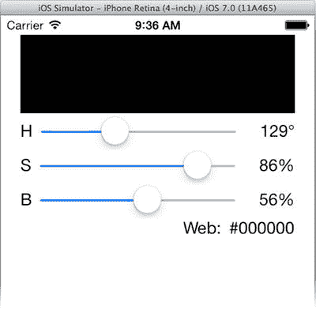

# 键值观察

我曾告诉过你，设计模式在 iOS 和 Objective-C 中根深蒂固。你即将发现它们到底有多深。MVC 通信机制部分基于观察者模式。观察者模式是一种设计模式：当另一个对象（主体）中发生某些事件时，一个对象（观察者）会收到一条消息。在 MVC 中，数据模型（主体）会在自身发生变化时通知视图或控制器对象（观察者）。这使控制器无需在每次更改数据模型时都记得去更新视图对象（`[self updateColor]`）。现在，控制器或任何其他对象都可以随意更改数据模型；任何变化都会向观察者发送通知。

在 MyStuff 中，你是通过 `NSNotifcation` 对象实现这一点的。而在 `ColorModel` 中，你将使用一种名为“键值观察”（简称 KVO）的 Objective-C 魔法。KVO 是一种在对象属性被设置时通知观察者的技术。KVO 的惊人之处在于，你通常无需对你的数据模型对象做任何修改；Objective-C 和 iOS 会为你完成所有工作。

## 观察键值变化

观察对象的属性变化是一个两步过程：

1.  成为属性（键值）的观察者。
2.  实现 `-observeValueForKeyPath:ofObject:change:context:` 方法。

第一步非常简单。在你的 `CMViewController.m` 实现文件中，找到 `-viewDidLoad` 方法，并在其末尾添加以下代码：

```
[_colorModel addObserver:self forKeyPath:@"hue" options:0 context:NULL];
[_colorModel addObserver:self forKeyPath:@"saturation" options:0 context:NULL];
[_colorModel addObserver:self forKeyPath:@"brightness" options:0 context:NULL];
[_colorModel addObserver:self forKeyPath:@"color" options:0 context:NULL];
```

每条语句都将你的 `CMViewController` 对象 (`self`) 注册为接收对象 (`_colorModel`) 的特定属性（键路径）变化的观察者。

此后，每当 `_colorModel` 的某个被观察属性发生变化时，你的控制器将收到一条 `-observeValueForKeyPath:ofObject:change:context:` 消息。`keyPath` 参数描述了 `object` 参数上发生变化的属性。利用这些参数来确定变化的内容并采取相应的操作。

你的新 `-observeValueForKeyPath:ofObject:change:context:` 方法将取代旧的 `-updateColor` 方法，因为它们目的相同。用代码清单 8-3 中的代码替换 `–updateColor`。加粗的代码显示了新增内容。

**代码清单 8-3.** `-observeValueForKeyPath:ofObject:change:context:`

```
- (void)observeValueForKeyPath:(NSString *)keyPath
                      ofObject:(id)object
                        change:(NSDictionary *)change
                       context:(void *)context
{
    if ([keyPath isEqualToString:@"hue"])
        {
        self.hueLabel.text = [NSString stringWithFormat:@"%.0f\u00b0",
                              self.colorModel.hue];
        }
    else if ([keyPath isEqualToString:@"saturation"])
        {
        self.saturationLabel.text = [NSString stringWithFormat:@"%.0f%%",
                                     self.colorModel.saturation];
        }
    else if ([keyPath isEqualToString:@"brightness"])
        {
        self.brightnessLabel.text = [NSString stringWithFormat:@"%.0f%%",
                                     self.colorModel.brightness];
        }
    else if ([keyPath isEqualToString:@"color"])
        {
        [self.colorView setNeedsDisplay];
        CGFloat red, green, blue, alpha;
        [self.colorModel.color getRed:&red green:&green blue:&blue alpha:&alpha];
        self.webLabel.text = [NSString stringWithFormat:@"#%02lx%02lx%02lx",
                              lroundf(red*255),
                              lroundf(green*255),
                              lroundf(blue*255)];
        }
}
```

代码简单直观。它检查 `keyPath` 参数是否匹配你预期会变化的某个属性名称。每个 `if` 块都会更新受该属性变化影响的视图对象。

现在，你可以移除所有对 `-updateColor` 的引用了。删除私有 `@interface` 部分中的方法原型，并移除所有操作方法中的 `[self updateColor];` 语句。现在，你的 `-changeHue:` 方法看起来像这样：

```
- (IBAction)changeHue:(UISlider*)sender
{
    self.colorModel.hue = sender.value;
}
```

所有修改数据模型属性的方法都不必再记得更新视图了，因为每当数据模型对象发生变化时，它会自动通知你的控制器。运行你的应用并试一试，如图 8-26 所示。



图 8-26. 有缺陷的 KVO

部分功能是正常的，但显然有些地方出了问题。让我们思考一下问题所在。


