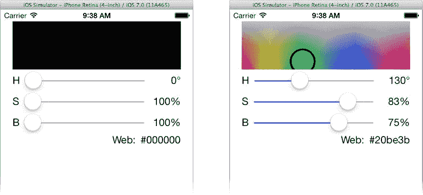
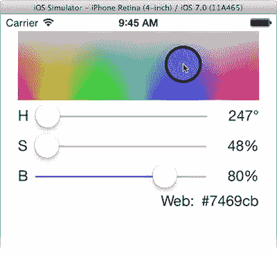

# 创建 KVO 依赖

由于三个标签对象正在更新，你的控制器会收到针对 `hue`、`saturation` 和 `brightness` 属性的变更通知。然而，`colorView` 和 `webLabel` 对象却从未改变。你的控制器并未收到针对 `color` 属性的变更通知。

这是因为没有任何代码更改过 `color` 属性（它甚至不允许被修改，因为它是一个 readonly 属性）。问题在于 `color` 是一个合成属性值：你编写的代码基于 `hue`、`saturation` 和 `brightness` 的值组合出 `color` 的值。Objective‑C 和 iOS 并不知道这一点。它们只知道没有人设置过 `color` 属性（例如 `colorModel.color = newColor`），因此它永远不会发送任何通知。

有两种直接的方法可以解决这个问题。第一种方法是在控制器中添加代码，使其在收到其他三个属性（`hue`、`saturation` 或 `brightness`）中任何一个的变更通知时，更新与 `color` 相关的视图。这是一种完全可以接受的解决方案，但还有另一种方法。

你可以告诉 KVO 系统，某个属性（派生键）会受到其他属性（其依赖键）变更的影响。打开你的 `CMColor.m` 数据模型实现文件，并添加这个特殊的类方法：

```
+ (NSSet*)keyPathsForValuesAffectingColor
{
    return [NSSet setWithObjects:@"hue",@"saturation",@"brightness",nil];
}
```

现在重新运行你的应用，看看这一个方法带来的差异（参见图 8-27）。



图 8-27. 正常工作的 KVO 更新

那么这是如何工作的呢？这个特殊的类方法 `+keyPathsForValuesAffectingColor` 告诉 KVO 系统，有三个属性（键路径）会影响 `color` 属性的值：`hue`、`saturation` 和 `brightness`。现在，每当 KVO 机制检测到前三个属性中任何一个发生变化时，它就会知道 `color` 也发生了变化，并针对 `color` 键路径发送第二个通知。

> **提示**：KVO 非常灵活，有几种描述依赖键的方法。你还可以编写代码，精确决定发送哪些属性变更通知、何时发送，以及这些通知包含哪些信息。要获得更深入的说明，请查看 Xcode 的“文档和 API 参考”中的《Key-Value Observing 编程指南》。

我相信你觉得这很酷，但你可能也认为这与你在上一节编写的 `-updateColor` 方法相比，并没有减少多少工作量。你说得对，确实没有。但这也是因为你的所有数据模型更改都来自同一个来源（滑块控件），并且修改数据模型的地方相对较少。然而，如果情况发生变化，那就会是一场全新的比赛了。

## 多向量数据模型变更

随着你的应用逐渐成熟，它很可能会变得更加复杂，数据模型的变更可能发生在更多地方。KVO 的优美之处在于，变更通知发生在变更发生的地方——也就是数据模型内部。

当初，当唯一改变颜色的地方是三个滑块操作时，调用 `-changeColor` 是没问题的。但如果你添加了第四个也能改变颜色的控件视图对象——甚至五个、九个呢？

这里有一个例子。你应用中的滑块是不错，但它们太……二十世纪了。我们生活在触摸界面的时代。直接触摸色相/饱和度图表并指向你想要的颜色，岂不是更棒？让我们开始吧。

### 处理触摸事件

你应该已经知道如何实现这一点——除非你跳过了第 4 章。如果你跳过了，现在回去阅读它。在你的自定义 `CMColorView` 类中添加触摸事件处理方法。这些处理程序将使用颜色图表内的坐标来选取新的 `hue` 和 `saturation`。既然你知道该怎么做，那就开始向 `CMColorView.m` 中添加三个触摸事件处理程序吧：

```
- (void)touchesBegan:(NSSet *)touches withEvent:(UIEvent *)event
{
    [self changeHSToPoint:[(UITouch*)[touches anyObject] locationInView:self]];
}

- (void)touchesMoved:(NSSet *)touches withEvent:(UIEvent *)event
{
    [self changeHSToPoint:[(UITouch*)[touches anyObject] locationInView:self]];
}

- (void)touchesEnded:(NSSet *)touches withEvent:(UIEvent *)event
{
    [self changeHSToPoint:[(UITouch*)[touches anyObject] locationInView:self]];
}
```

这三个处理程序捕获所有触摸开始、移动和结束事件，提取触摸对象，获取该触摸在此视图坐标中的位置（使用 `-locationInView:`），并将这些坐标传递给 `-changeHSToPoint:` 方法。

> **注意**：请记住，默认情况下，视图对象的 `multipleTouchEnabled` 属性是 `NO`，这意味着其触摸事件处理方法永远不会在 `touches` 中看到多于一个的触摸对象，即使你的用户用多根手指触摸视图也是如此。

现在添加 `-changeHSToPoint:` 方法。首先，在 `CMColorView.m` 文件顶部附近的私有 `@interface` 部分中添加一个方法原型：

```
- (void)changeHSToPoint:(CGPoint)point;
```

最后，在 `@implementation` 的末尾添加方法体：

```
- (void)changeHSToPoint:(CGPoint)point
{
    CGRect bounds = self.bounds;
    if (CGRectContainsPoint(bounds,point))
        {
        _colorModel.hue = (point.x-bounds.origin.x)/bounds.size.width*360;
        _colorModel.saturation = (point.y-bounds.origin.y)/bounds.size.height*100;
        }
}
```

你的 `-changeHSToPoint:` 方法接受触摸点，并反向计算以确定该位置所代表的色相和饱和度值。然后，它直接更改数据模型的 `hue` 和 `saturation` 属性。

请注意，它没有向控制器发送操作消息。它本可以这样做——这也是一种完全合理的实现方式。但由于你使用了 KVO，所以不需要这样做。任何对象都可以直接修改数据模型，所有观察者都会收到必要的通知。

试试看。运行你的应用。将亮度滑块从 0% 移开，然后用鼠标在颜色图标内拖动。当你拖拽（模拟的）手指时，色相和饱和度会发生变化，如图 8-28 所示。



图 8-28. 将 CMColorView 变为一个控件


### 绑定滑块

现在唯一的问题就是触控颜色视图时，色相和饱和度滑块不会跟着移动。这是因为它们仍然只作为输入控件。到目前为止，改变色相和饱和度的唯一途径就是移动滑块。既然现在有了其他改变这些属性的途径，你同样需要让滑块与数据模型保持同步。

你需要与三个滑块建立连接，因此在 `CMViewController.h` 文件中添加以下代码：

```
@property (weak,nonatomic) IBOutlet UISlider *hueSlider;
@property (weak,nonatomic) IBOutlet UISlider *saturationSlider;
@property (weak,nonatomic) IBOutlet UISlider *brightnessSlider;
```

切换到 `Main.storyboard` 的 Interface Builder 文件，将这些新的导出接口从视图控制器对象连接到三个 `UISlider` 控件上。

在 `CMViewController.m` 中找到 `-observeValueForKeyPath:ofObject:change:context:` 方法，并插入以下三行加粗的代码：

```
if ([keyPath isEqualToString:@"hue"])
{
    self.hueLabel.text = [NSString stringWithFormat:@"%.0f\u00b0", self.colorModel.hue];
    self.hueSlider.value = _colorModel.hue;
}
else if ([keyPath isEqualToString:@"saturation"])
{
    self.saturationLabel.text = [NSString stringWithFormat:@"%.0f%%", self.colorModel.saturation];
    self.saturationSlider.value = _colorModel.saturation;
}
else if ([keyPath isEqualToString:@"brightness"])
{
    self.brightnessLabel.text = [NSString stringWithFormat:@"%.0f%%", self.colorModel.brightness];
    self.brightnessSlider.value = _colorModel.brightness;
}
```

现在当色相值发生变化时，色相滑块也会随之改变，即使这个变化本就来自色相滑块本身。

**注意**

移动滑块不会造成消息无限循环：滑块向控制器发送动作，控制器改变数据模型，数据模型更新滑块，滑块再向控制器发送动作，如此往复。这是因为滑块控件仅在用户拖动时发送动作消息，而不是在通过代码设置其值时发送。不过，并非所有视图都如此智能，也可能会产生无限的 MVC 消息循环。解决方法是仅在值实际发生变化时才发送动作或通知。

现在，只要数据模型发生变化，颜色视图和滑块就会同步更新，而且颜色视图可以直接改变数据模型。软件工程师会称这些视图已绑定到数据模型的属性。绑定是数据模型与视图之间的一种直接、双向的链接关系。

### 最终润色

你现在还可以轻松修复应用中的一个恼人 bug。应用启动时，色相、饱和度和亮度的显示值是错误的（360°、100% 和 100%）。而数据模型中的值实际上是 0°、0% 和 0%。在 `-viewDidLoad` 方法的最末尾添加以下代码：

```
_colorModel.hue = 60;
_colorModel.saturation = 50;
_colorModel.brightness = 100;
```

由于这段代码在控制器开始观察数据模型变化之后执行，这些语句不仅能将数据模型初始化为非黑色的颜色，还会同步更新所有相关视图。试试看吧！

另外，在 `Learn iOS Development Projects` ➤ `Ch 8` ➤ `ColorModel (Icons)` 文件夹中有一些图标资源。将它们添加到 `Images.xcassets` 项目的 `AppIcon` 分组中，就像你之前项目所做的那样。

## 取巧做法

模型-视图-控制器（MVC）设计模式能提升代码质量，让应用更易于编写和维护，还能使你的代码变得优雅、健康且富有活力。但是，切勿沉迷于此而沦为它的奴隶。

虽然使用设计模式能让你在成为 iOS 开发高手的道路上占据优势，但我还是要提醒你，不要为了使用模式而使用模式。务实的程序员称之为过度设计。有时候简单的解决方案才是最好的。请看这个例子：

```
@interface MyScoreController : NSObject
@property NSUInteger score;
@property (weak,nonatomic) IBOutlet UILabel *scoreView;
- (IBAction)incrementScore:(id)sender;
@end

@implementation MyScoreController
- (IBAction)incrementScore:(id)sender
{
    _score += 1;
    self.scoreView.text = [NSString stringWithFormat:@"%lu",(unsigned long int)_score];
}
@end
```

那么这个控制器有什么问题呢？MVC 纯粹主义者会指出，这里没有独立的数据模型对象。控制器同时充当了数据模型的角色，存储并操作分数属性。这既违反了 MVC 设计模式，也违背了单一职责原则。

想听听我的看法吗？这个方案其实没什么问题；它不过就是 #@$%&* 的一个整数而已！为存储一个数字而专门创建一个新类毫无意义，而且会浪费大量时间。

如果有一天，你的数据模型增长到包含三个整数、一个字符串和一个本地化对象，那当然需要重构应用：将整数从控制器中抽离出来，放到一个真正的数据模型对象中。但在那一天到来之前，不必为此担心。

有一种称为敏捷开发的编程理念，它更看重完成并正常运行的软件，而不是完美的计划和设计。在这种情况下，我的建议是使用能完成工作的最简单方案。在 MVC 设计中要走捷径时，你要心中有数，并准备好一个计划，在（如果）问题出现时及时修正，但不要被设计哲学束缚住。设计模式应该让开发更轻松，而不是更困难。

## 总结

总而言之：MVC 是好的。

是不是这些计算机科学知识让你想休息一下，听听最喜欢的音乐？那么，下一章正适合你。

### 练习题

虽然你的 ColorModel 应用已非常接近理想的 MVC 通信模式，但它仍然依赖控制器来观察变化并转发更新事件给视图对象。根据你目前所做的工作，要让颜色视图直接观察数据模型的变化会有多难？

其实并不难，这就是本章的练习题：修改 `CMViewController` 和 `CMColorView`，使 `CMColorView` 成为 `CMColor` 对象中“color”变化的直接观察者。

这在拥有复杂数据模型和大量自定义视图对象的大型应用中是一种常见模式。其优势在于每个视图对象各自负责观察与自身相关的数据模型变化，从而减轻控制器对象的负担。

你可以在 `Learn iOS Development Projects` ➤ `Ch 8` ➤ `ColorModel E1` 文件夹中找到我对此练习的解决方案。

**脚注** 1

关于这条规则，有一个例外情况会在本章末尾说明。


