# 9. 美妙旋律

## 摘要

从 iPod 音乐库中选择并播放音乐，是为你的应用增添趣味性的一种绝佳方式。你还可以将自定义音乐和音效添加到动作和游戏中。这两件事做起来相对容易，我会立刻介绍。但请不要就此停止阅读本章。iOS 应用中的声音存在于一个由竞争性音频源、现实世界事件以及不断变化的硬件配置构成的更广阔世界中。让音频在这个要求严苛、有时甚至复杂的环境中良好运行，才是对你 iOS 开发技能真正的考验。本章内容包括：

*   从 iPod 音乐库中选择曲目
*   播放 iPod 音乐库中的音乐
*   获取曲目详细信息（标题、艺术家、专辑、封面）
*   播放声音文件
*   配置应用中音频的行为
*   将音乐与其他声音混合
*   响应中断
*   响应硬件变化

在此过程中，你将学到一些省时的 Xcode 技巧，以及一种无需使用插座变量就能使用视图对象的方法。准备好制造点动静了吗？

> **注：** 本章中的应用需要在已配置的 iOS 设备上运行。用于访问 iPod 音乐库的应用无法在模拟器中运行；模拟器不包含所需的 iPod 框架。如果你尝试在模拟器中运行此应用，它会直接崩溃。

## 制作你自己的 iPod

iOS 应用中预录音效的两个最常见来源是音频资源文件和用户 iPod 库中的音频文件。你在本章中开发的应用将同时播放这两种音频！这是一个配音应用，让你播放 iPod 音乐库中的曲目，然后即兴添加自己的打击乐器音效。所以，如果你曾觉得德利布的《花之二重唱》（拉克美，第一幕）配上铃鼓会好听得多，那么这就是你一直在等待的应用。

### 设计

你的应用设计是一个简单的单屏幕界面，我将其命名为 DrumDub。底部是用于从音乐库中选择曲目以及暂停/恢复播放的控制按钮。顶部会显示正在播放曲目的信息。中间是添加打击音效的按钮，所有这些都如图 9-1 所示。

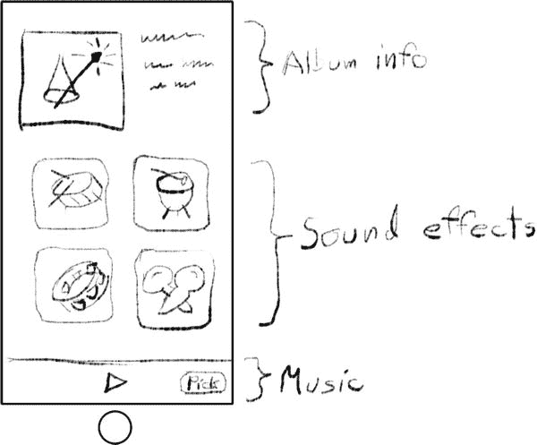

**图 9-1.** DrumDub 草稿

你将从构建 iPod 音乐播放功能开始。然后添加专辑封面，最后混入打击音效。和往常一样，先从创建一个新的 Xcode 项目开始：

*   使用 Single View Application Xcode 模板
*   将项目命名为 DrumDub
*   将类前缀设置为 `DD`
*   将设备设置为 `iPhone`（参见注释）
*   保存项目
*   在项目支持的界面方向中，关闭横向向左和横向向右

> **注：** 由于本应用需要 iOS 设备才能运行，你需要一台 iPhone 或 iPad 来测试。如果你只有 iPad，不妨稍微拓展一下开发能力，将支持的设备改为 iPad。在阅读本章时，调整 iPhone 界面布局以适应 iPad。逻辑和代码将保持不变。

### 添加音乐选择器

第一步是创建一个界面，让用户可以从他们的 iPod 音乐库中选择一首或多首歌曲。在学习了第 7 章（其中使用了照片库选择器）之后，你应该不会惊讶地发现 iOS 提供了一个现成的音乐选择器界面。你只需要配置它并将其呈现给用户即可。

当用户点击界面中的“歌曲”按钮时，你将显示音乐选择器界面。为此，你需要一个操作。首先在你的 `DDViewController.h` 文件的 `@interface` 部分声明此操作：

`- (IBAction)selectTrack:(id)sender;`

`MPMediaPickerController` 类提供了音乐选择器界面。你的 `-selectTrack:` 方法将创建一个新的 `MPMediaPickerController`，配置它，并将其呈现给用户。和照片库选择器一样，你的应用通过代理方法了解用户选择了什么。在继续编辑 `DDViewController.h` 时，让你的 `DDViewController` 遵循 `MPMediaPickerControllerDelegate` 协议：

`@interface DDViewController : UIViewController <MPMediaPickerControllerDelegate>`

你会注意到 Xcode 现在在这一行上标记了一个编译器错误。这是因为媒体选择器和播放器的头文件不属于标准的 UIKit 框架。通过在其他 `#import` 语句之后立即添加以下 `#import` 语句，来导入 `MPMediaPickerControllerDelegate` 的定义（以及所有其他音乐播放器和选择器的符号）：

`#import <MediaPlayer/MediaPlayer.h>`

切换到 `Main.storyboard` 的 Interface Builder 文件。在对象库中，找到 Toolbar 对象。将工具栏拖入你的界面，并将其定位在视图的底部。工具栏已经包含一个栏按钮项。选中它并将其标题属性更改为 `Song`。将其发送操作（按住 Control 键/右键拖拽）连接到视图控制器的 `-selectTrack:` 操作，如图 9-2 所示。

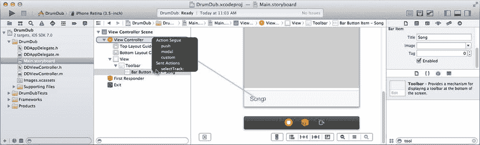

**图 9-2.** 添加工具栏和“歌曲”按钮

现在，你已准备好编写 `-selectTrack:` 操作。切换到 `DDViewController.m` 文件，并将此代码添加到你的 `@implementation` 部分：

```
- (IBAction)selectTrack:(id)sender
{
    MPMediaPickerController *picker = [[MPMediaPickerController alloc]
        initWithMediaTypes:MPMediaTypeAnyAudio];
    picker.delegate = self;
    picker.allowsPickingMultipleItems = NO;
    picker.prompt = @"选择一首歌曲";
    [self presentViewController:picker animated:YES completion:nil];
}
```

这段代码创建了一个新的 `MPMediaPickerController` 对象，允许用户选择任何音频类型。媒体选择器相当灵活，可以配置为显示设备上的各种音频和/或视频内容。音频内容的类别包括：

*   音乐（`MPMediaTypeMusic`）
*   播客（`MPMusicTypePodcast`）
*   有声书（`MPMediaTypeAudioBook`）
*   iTunes U（`MPMediaTypeITunesU`）

通过组合这些二进制值，你可以配置媒体选择器来显示你想要的任何类别组合。常量 `MPMediaTypeAnyAudio` 包含所有类别，允许用户选择其库中的任何音频项目。一组类似的标志用于视频内容。

> **提示：** 某些整数参数，例如 `-initWithMediaTypes:` 中的 `mediaTypes` 参数，并不是作为一个单一的整数值来解释，而是作为一组位或标志的集合。每个单独的 `MPMediaType` 常量都是 2 的幂次方——即整数中的一个 1 比特。你可以通过相加或逻辑 OR 运算将它们组合起来，形成任意组合，例如 `(MPMediaTypeMusic|MPMediaTypeAudioBook)`。结果值将允许选择任何音乐曲目或有声书，但不会让用户选择播客或 iTunes U 内容。方便的 `MPMediaTypeAnyAudio` 常量只是将所有可能的音频标志进行 OR 运算后的结果。


### 排版后的内容

接下来，将你的 `DDViewController` 对象设为选择器的委托。然后，禁用一次允许选取多个曲目的选项，用户将只能一次选择一首歌曲。设置提示或标题，以便用户了解你要求他们执行的操作。

最后，弹出控制器，让它接管界面并让用户选择歌曲。这段代码足以查看其效果，所以试一试。将项目的方案设置为你的 iOS 设备，然后点击“运行”按钮，如图 9-3 所示。工具栏出现后，你可以轻点“歌曲”按钮调出音乐选择器，浏览你的音频库并选择一首歌曲。

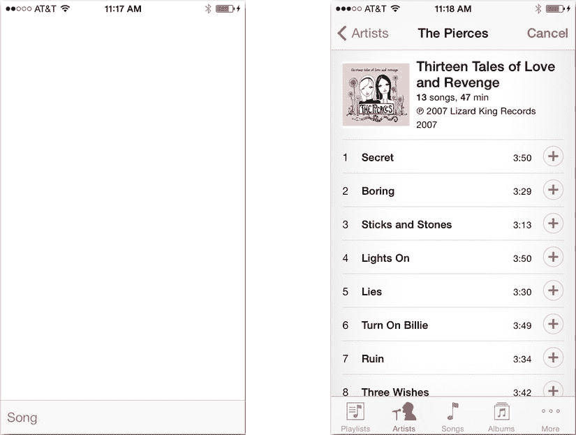

图 9-3. 测试音频选择器

## 查询 iPod 音乐库

你不必非得使用媒体选择器来从用户的 iPod 库中选择项目，它只是最便捷的方法。

你也可以创建自己的界面，或者根本不需要界面。iPod 框架提供了相关类，让你的应用能够像查询数据库一样浏览和搜索用户的媒体合集。（仔细想想，它确实是一个数据库，所以这个描述完全正确。）

具体做法是创建一个查询对象，定义你要搜索的内容。这可以简单到“所有 R&B 歌曲”，也可以更精细，例如“所有时长超过 2 分钟、属于‘舞曲’流派、BPM 标签在 110 到 120 之间的曲目”。结果是与该描述匹配的媒体项目列表，你可以以任何你喜欢的方式呈现（咳咳——表格——咳咳）。

你可以在 Xcode 的“文档和 API 参考”中找到的 *iPod 库访问编程指南*中了解更多信息。阅读其中的“以编程方式获取媒体项目”部分即可开始。

### 使用音乐播放器

接下来会发生什么？嗯，接下来什么都不会发生。当用户选取曲目或轻点“取消”按钮时，你的委托会收到以下消息之一：

`-mediaPicker:didPickMediaItems:`

`-mediaPickerDidCancel:`

之所以什么都没发生，是因为你还没有实现这两个方法。先从编写 `-mediaPicker:didPickMediaItems:` 开始。该方法将获取用户选取的音频曲目，并使用 `MPMusicPlayerController` 对象开始播放。

首先，定义一个私有实例变量和一个 `readonly` 属性，以便你可以保留对音乐播放器对象的引用并轻松请求它。将以下粗体代码添加到 `DDViewController.m` 文件开头的私有 `@interface` 部分：

```
@interface DDViewController ()
{
    MPMusicPlayerController *music; // (为 @property musicPlayer 存储)
}
@property (readonly,nonatomic) MPMusicPlayerController *musicPlayer;
@end
```

现在你已经准备好实现第一个委托方法：

```
- (void)mediaPicker:(MPMediaPickerController*)mediaPicker
didPickMediaItems:(MPMediaItemCollection*)mediaItemCollection
{
    if (mediaItemCollection.count!=0)
    {
        [self.musicPlayer setQueueWithItemCollection:mediaItemCollection];
        [self.musicPlayer play];
    }
    [self dismissViewControllerAnimated:YES completion:nil];
}
```

`mediaItemCollection` 参数包含用户选取的曲目列表。请记住，选择器可用于一次选择多个项目。由于你在之前将 `allowsPickingMultipleItems` 属性设置为 `NO`，因此你的选择器始终只会返回单个项目。

我们再次确认至少选择了一个曲目（只是为了保险），然后使用该集合设置音乐播放器的播放队列。播放队列是一个要播放的曲目列表，其工作原理与播放列表完全相同。在这里，它是一个只包含一个曲目的播放列表。下一条语句开始播放音乐。就是这么简单。

**注意**

虽然音乐播放器的播放队列的工作原理与播放列表相同，但它并不是 iPod 的播放列表。它不会作为播放列表出现在 iPod 界面中，iOS 也不会为你保存它。如果你的应用需要此功能，你可以自己实现。使用你在第 5 章中学到的内容，将媒体集合中的项目以表格形式呈现，允许用户根据自己的喜好重新排序、删除或添加新项目（再次使用媒体选择器）。然后，使用更新后的集合再次向音乐播放器发送 `-setQueueWithItemCollection:` 消息。

那么这段代码的问题是什么？问题在于还没有 `musicPlayer` 对象！为 `musicPlayer` 编写一个属性 getter 方法，以延迟创建该对象：

```
- (MPMusicPlayerController*)musicPlayer
{
    if (music==nil)
    {
        music = [MPMusicPlayerController applicationMusicPlayer];
        music.shuffleMode = NO;
        music.repeatMode = NO;
    }
    return music;
}
```

**提示**

此方法遵循两种常用的设计模式：单例模式和延迟初始化。该方法实现了 `musicPlayer` 属性的 getter 方法；任何请求该属性（`self.musicPlayer`）的代码都会调用此方法。该方法会检查是否已经创建了一个存储在 `music` 中的 `MPMusicPlayerController` 对象。如果没有，则创建一个，进行配置，并将其保存在 `music` 实例变量中。此过程只发生一次。之后所有对 `-musicPlayer` 的调用都会发现 `music` 变量已设置，并立即返回该（唯一）对象。

你通过 `+applicationMusicPlayer` 类方法获取 `MPMusicPlayerController` 对象。这会创建一个应用音乐播放器（请参阅“应用与 iPod 音乐播放器”侧边栏）。该音乐播放器会继承当前 iPod 的播放设置，例如随机播放和重复模式。你不需要这些设置，因此将它们关闭。

### 应用与 iPod 音乐播放器

你的应用可以访问两种不同的音乐播放器对象。应用音乐播放器属于你的应用。它的当前播放列表和设置仅存在于你的应用中，并且当你的应用停止运行时，它也会停止播放。


你可以使用 `[MPMusicPlayerController iPodMusicPlayer]` 请求 iPod 音乐播放器对象。iPod 音乐播放器对象是与设备中 iPod 播放器的直接连接。它会反映 iPod 应用中当前音乐播放的状态。你所做的任何更改（例如暂停播放或更改随机播放模式）都会改变 iPod 应用。音乐播放会在你的应用停止后继续进行。

只有一个细微的差别：iPod 音乐播放器对象不会报告关于流媒体播放（例如通过家庭共享）的媒体信息。但除此之外，iPod 音乐播放器对象是内置 iPod 应用的透明扩展，允许你的应用参与并整合用户当前的音乐活动。

一次只能有一个音乐播放器在播放。如果你的应用启动了一个应用音乐播放器，它将接管音乐播放服务，导致内置 iPod 播放器停止。同样，如果你的应用音乐播放器正在播放，而用户启动了 iPod 播放器，那么你的应用音乐播放器将停止。

现在加入一个委托方法来处理用户拒绝选择曲目的情况：

```
- (void)mediaPickerDidCancel:(MPMediaPickerController*)mediaPicker
{
    [self dismissViewControllerAnimated:YES completion:nil];
}
```

你的基本播放代码现在已完成。运行你的应用，选择一首曲目，享受音乐吧。

`MPMusicPlayerController` 对象是自包含的。它会为你处理所有标准的 iPod 行为。例如，如果被闹钟或来电中断，它会自动淡出；或者当用户拔掉耳机时停止播放。我将在本章后面详细讨论这些事件。

这并不是说你无法影响音乐播放器。实际上，你对它的控制相当强大。你可以启动和停止播放器、调整音量、在播放列表中向前或向后跳转、设置随机播放和重复模式、更改播放速率等等。播放器还会告诉你很多关于它正在做什么以及正在播放什么的信息。利用这些属性和方法，你可以创建自己的、功能完整的音乐播放器。

对于这个应用，你不需要一个功能完整的音乐播放器。但至少知道正在播放什么并能够暂停它，那就更好了。准备好接下来添加这些功能吧。

### 添加播放控制

首先添加一些按钮来暂停和播放当前歌曲。这些按钮需要动作方法，因此在你的 `DDViewController.h` 文件中添加以下两个方法声明：

```
- (IBAction)play:(id)sender;
- (IBAction)pause:(id)sender;
```

你还需要更新播放和暂停按钮的状态，因此添加一些连接：

```
@property (weak,nonatomic) IBOutlet UIBarButtonItem *playButton;
@property (weak,nonatomic) IBOutlet UIBarButtonItem *pauseButton;
```

切换到你的 `Main.storyboard` 文件，并向工具栏添加以下对象，按顺序插入到“Song”按钮的左侧，如图 9-4 所示：

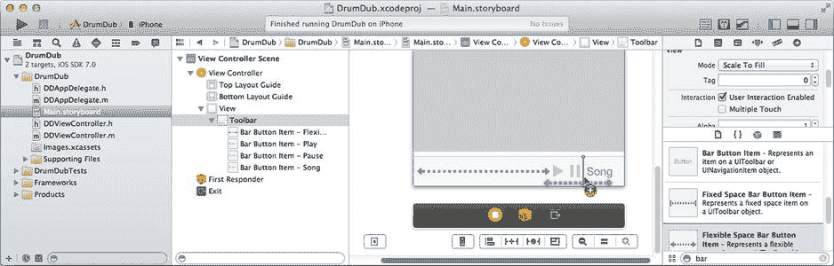

图 9-4. 向工具栏添加控件
- 一个灵活间距栏按钮项
- 一个栏按钮项，将其样式更改为 Plain，标识符更改为 Play，并取消选中 enabled
- 一个栏按钮项，将其样式更改为 Plain，标识符更改为 Pause，并取消选中 enabled
- 一个灵活间距栏按钮项

最后，设置所有的连接。右键/Control+单击播放按钮，将其动作连接到 `-play:` 动作（在 `View Controller` 中），将暂停按钮连接到 `-pause:` 动作。选择 `View Controller` 对象，并使用连接检查器将 `playButton` 插座变量连接到播放按钮，将 `pauseButton` 插座变量连接到暂停按钮。

创建并连接好界面对象后，考虑一下这些按钮应该如何工作。你想要：

*   当音乐播放器当前未播放时，播放按钮是活跃的（可点击）
*   播放按钮的动作开始播放音乐
*   当音乐播放器正在播放时，暂停按钮是活跃的
*   暂停按钮的动作暂停音乐播放器

按钮的动作将启动和停止音乐播放器。每当播放器开始或停止播放时，你需要更新按钮的启用状态。第一部分非常简单。在 `DDViewController.m` 中，为 `-play:` 和 `-pause:` 动作添加实现：

```
- (IBAction)play:(id)sender
{
    [self.musicPlayer play];
}

- (IBAction)pause:(id)sender
{
    [self.musicPlayer pause];
}
```

第二部分是在适当的时间更新按钮状态（启用或禁用它们）。


### 接收音乐播放器通知

音乐播放器在后台线程中运行。通常情况下，它会按顺序播放列表中的曲目，直到播放完毕并停止。播放器也可能响应外部事件而暂停：例如用户按下耳机线上的暂停按钮，或者将 iPod 从底座上拔下。你认为你的应用程序将如何获知这些事件？

如果你回答“通过接收代理消息或通知”，请为自己热烈鼓掌！查阅 `MPMusicPlayerController` 类的文档，你会发现音乐播放器会在发生重要变化时（正好包括播放开始或停止时）选择性地发送通知。要获知这些事件，你需要注册你的控制器对象来接收它们。正如你在第 5 章中所记得的，要接收通知，你必须：

- 创建一个通知方法
- 向通知中心注册，成为该通知的观察者

首先，将以下通知方法添加到你的 `DDViewController.m` 实现中：

```
- (void)playbackStateDidChangeNotification:(NSNotification*)notification
{
    BOOL playing = (music.playbackState == MPMoviePlaybackStatePlaying);
    _playButton.enabled = !playing;
    _pauseButton.enabled = playing;
}
```

同时，在源文件开头的私有 `@interface` 部分添加一个方法原型：

```
- (void)playbackStateDidChangeNotification:(NSNotification*)notification;
```

你的通知处理程序会检查音乐播放器的当前 `playbackState`。播放器的播放状态可能是 `stopped`（已停止）、`playing`（正在播放）、`paused`（已暂停）、`interrupted`（已中断）、`seeking forward`（向前快进）或 `seeking backwards`（向后快退）。在此实现中，可能出现的状态只有 `playing`、`stopped`、`interrupted` 和 `paused`。

**注意**：`-playbackStateDidChangeNotification:` 方法使用了实例变量（`music`）而不是属性值的获取方法（`self.musicPlayer`）。访问前者而非后者，可以避免在音乐播放器对象不存在时惰性创建一个新对象——结果却发现新创建的播放器并未播放。这既浪费时间又浪费代码。在这个特定的应用程序中，`music` 不可能为 `nil`，因为只有当音乐播放器状态改变时才会收到通知消息，而要实现这一点，音乐播放器对象必须已经创建。

如果播放器正在播放，则暂停按钮可用，播放按钮不可用。如果播放器未播放，则情况相反。这样，当播放器未播放时，播放按钮会显示为可用选项；播放时，暂停按钮会显示为可用选项。

你的控制器还需要完成两个额外步骤才能接收这些通知。首先，你必须注册以接收这些通知。在 `-musicPlayer` 获取方法中，在创建并配置播放器对象之后（即 `if { ... }` 块的末尾），立即添加以下新代码：

```
NSNotificationCenter *notificationCenter = [NSNotificationCenter defaultCenter];
[notificationCenter addObserver:self
                      selector:@selector(playbackStateDidChangeNotification:)
                          name:MPMusicPlayerControllerPlaybackStateDidChangeNotification
                        object:music];
```

第二步是启用音乐播放器的通知功能。`MPMusicPlayerController` 默认情况下不会发送这些通知。你必须明确请求它发送。紧接着上述代码之后，再添加一行：

```
[music beginGeneratingPlaybackNotifications];
```

现在，你的播放控制功能已经完成。运行你的应用程序，并观察它们是否正常工作，如图 9-5 所示。


图 9-5. 正常工作的播放控制按钮

两个按钮初始时都处于禁用状态。当你选择一首曲目播放时，暂停按钮变为可用（图 9-5 中间）。如果你暂停歌曲，或让歌曲播放完毕，播放按钮会变为可用（图 9-5 右侧）。

### MVC 的体现

你正在再次见证模型-视图-控制器（MVC）设计模式的实际应用。在这个场景中，你的音乐播放器（尽管它被称为“音乐控制器”）就是你的数据模型。它包含了音乐播放的状态。每当这个状态发生改变，你的控制器就会收到通知并更新相关的视图——在本例中，就是播放和暂停按钮。

你并没有编写任何代码来在启动或停止播放器时更新播放或暂停按钮。这些请求只是发送给了音乐播放器。如果某个请求导致状态变化，音乐播放器会发布相应的通知，然后受影响的视图就会被更新。

虽然功能齐全，但你的应用程序还缺少某种“说不出的韵味”。哦，我们究竟在掩饰什么？这个界面简直平淡如水！让我们来美化一下它。

### 添加媒体元数据

音乐播放器对象一个丰富多彩的方面是它的 `nowPlayingItem` 属性。该属性返回一个包含正在播放歌曲元数据的对象。该对象的工作方式类似于字典，揭示了当前歌曲各种有趣的信息。这包括其标题、艺术家、曲目编号、音乐流派、任何专辑封面等等。

**注意**：元数据是“关于数据的数据”。一个文件，如文档，包含数据。该文件的名称、创建时间等就是它的元数据——它是描述文件中数据的数据。存储在歌曲文件中的波形是数据。歌曲的名称、艺术家、流派等，都是元数据。

对于你的应用程序，你将添加一个图像视图来显示专辑封面，并添加文本字段来显示歌曲的标题、所属专辑以及艺术家。首先，向 `Main.storyboard` 中添加新的界面对象。


#### 创建元数据视图

选择 `Main.storyboard` 文件。使用对象库，找到 `Image View` 对象并将其添加到界面中。使用尺寸检查器，将其宽度和高度都设置为 140 像素，并（使用参考线）将其定位在视图的左上角，如图 9-6 所示。

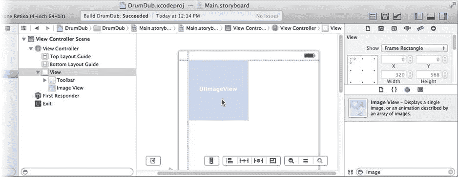

图 9-6. 定位相册视图

选中该视图对象，选择 **Editor** ➤ **Pin** ➤ **Width**。再次选中该视图，选择 **Editor** ➤ **Pin** ➤ **Height**。这将添加约束，防止视图被调整大小。这些命令是 Control/右键拖拽视图的替代方案。通过选择 **Editor** ➤ **Resolve Auto Layout Issues** ➤ **Add Missing Constraints in View Controller** 完成布局。

在图像视图的右侧添加一个标签对象（见图 9-7）。调整其宽度，使标签充满显示屏，如图 9-7 所示。使用属性检查器，将其颜色更改为 `White Color`，并将字号减小为 `System 12.0`。

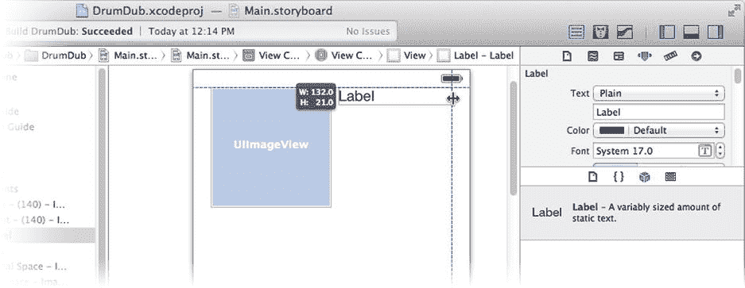

图 9-7. 添加元数据标签

再制作两个类似的标签，将它们放置在第一标签的下方。您可以复制并粘贴第一个标签对象，或者按住 **Option** 键并拖拽第一个标签的副本以创建另一个。选择 **Editor** ➤ **Resolve Auto Layout Issues** ➤ **Add Missing Constraints in View Controller**。作为最后的润色，选择根视图对象并将其背景更改为 `Black Color`。完成后，您的界面应类似于图 9-8 所示。

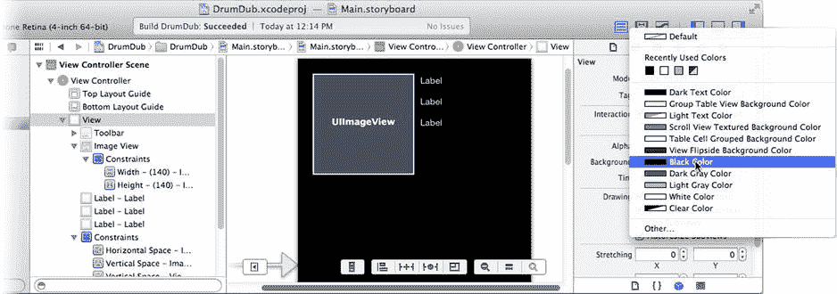

图 9-8. 完成的元数据界面

您知道接下来要做什么。我本来会要求您切换到 `DDViewController.h`，添加一些 outlet 属性，然后切换回 `Main.storyboard` 来连接它们。

好吧，我不这么做。当然，您需要创建并连接一些 outlet，但我要向您展示一个巧妙的 Xcode 技巧，这样您就不必在文件之间来回切换了。

在 `Main.storyboard` 文件仍处于打开状态时，切换到 assistant 编辑器视图（**View** ➤ **Assistant Editor** ➤ **Show Assistant Editor**），如图 9-9 所示。如果您的工作区窗口有点拥挤，可以隐藏实用工具区域（**View** ➤ **Utilities** ➤ **Hide Utilities**）或折叠 storyboard 的对象大纲，这些操作都显示在图 9-9 中。

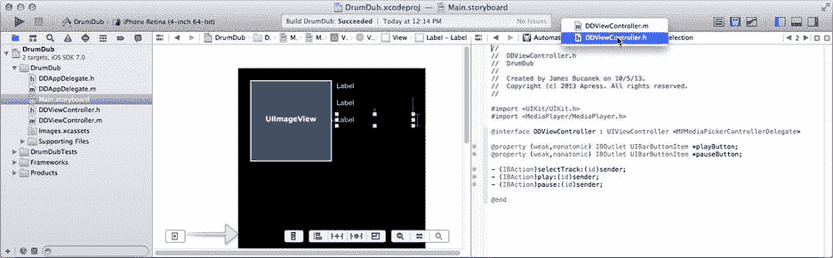

图 9-9. 在 assistant 编辑器中查看 `Main.storyboard`

当查看一个 Interface Builder 文件时，Xcode 的 assistant 编辑器会方便地将场景的接口文件放在右侧面板中。（如果没有，从导航菜单中选择 `DDViewController.h` 文件，该菜单位于右侧面板的正上方，如图 9-9 所示。）那些属性声明和操作声明旁边的小圆圈，其工作方式与连接检查器中的相同。如果您还没感到兴奋，那您应该感到兴奋。这意味着您可以声明一个 outlet 或操作，然后将其连接到界面对象，而无需在文件之间切换。这有多酷呢？

将以下四个新 outlet 添加到 `DDViewController.h`（现在位于编辑区域的右侧）：

```
@property (weak,nonatomic) IBOutlet UIImageView *albumView;
@property (weak,nonatomic) IBOutlet UILabel *songLabel;
@property (weak,nonatomic) IBOutlet UILabel *albumLabel;
@property (weak,nonatomic) IBOutlet UILabel *artistLabel;
```

现在，拖拽这些声明左侧出现的连接点，并直接将它们连接到界面对象，如图 9-10 所示。

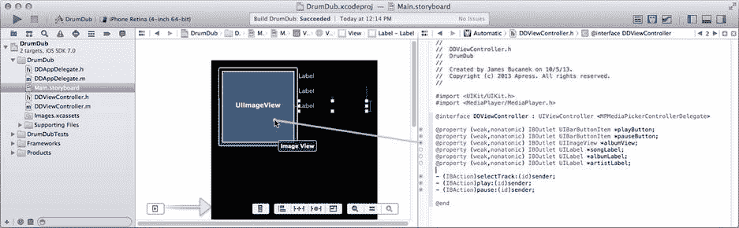

图 9-10. 直接从接口文件连接 outlet

您已创建了 outlet 属性，并将其连接到界面对象，而且全程使用了一个窗口。切换回标准编辑器（**View** ➤ **Standard Editor** ➤ **Show Standard Editor**）并选择 `DDViewController.m` 文件。现在是时候编写代码来更新这些新的界面对象了。


### 观察播放项目

当正在播放的项目发生变化时，音乐播放器对象也会发送通知。这发生在新歌曲开始播放或一首歌曲播放完毕时。该通知与你控制器当前正在观察的通知不同，因此你需要创建另一个通知处理器，并注册以观察额外的通知。首先，在`DDViewController.m`文件开头的私有`@interface DDViewController ()`部分中，为新函数添加一个原型：

`- (void)playingItemDidChangeNotification:(NSNotification*)notification;`

在`-playbackStateDidChangeNotification:`方法附近，添加你的新通知处理器：

```
- (void)playingItemDidChangeNotification:(NSNotification*)notification
{
    MPMediaItem *nowPlaying = music.nowPlayingItem;
    MPMediaItemArtwork *artwork = [nowPlaying valueForProperty:MPMediaItemPropertyArtwork];
    UIImage *albumImage = [artwork imageWithSize:_albumView.bounds.size];
    if (albumImage==nil)
        albumImage = [UIImage imageNamed:@"noartwork"];
    _albumView.image = albumImage;
    _songLabel.text = [nowPlaying valueForProperty:MPMediaItemPropertyTitle];
    _albumLabel.text = [nowPlaying valueForProperty:MPMediaItemPropertyAlbumTitle];
    _artistLabel.text = [nowPlaying valueForProperty:MPMediaItemPropertyArtist];
}
```

该方法获取`nowPlayingItem`属性对象。`MPMediaItem`对象并不包含一组固定属性（如典型对象），而是包含一个可变数量的属性值，你需要通过键（key）来请求这些值。键是一个固定值——通常是字符串对象——用于标识你感兴趣的值。

你首先请求的是`MPMediaItemPropertyArtwork`值。该值将是一个`MPMediaItemArtwork`对象，封装了歌曲的专辑封面。接着，你请求一个`UIImage`对象，并针对图像视图的尺寸进行了优化。

**提示**

`MPMediaItemArtwork`对象可能以不同尺寸和分辨率存储该项目的多个版本的艺术图稿。在请求艺术图稿的`UIImage`时，请指定一个尽可能接近你计划显示图像尺寸的大小，以便媒体项目对象能返回该尺寸下最佳质量的图像。

关于媒体元数据，需要记住的是，没有任何保证。iPod 库中的任何歌曲都可能包含标题、艺术家和封面信息，也可能不包含任何这些值。或者，它可能有标题和艺术家，但没有封面，或者有封面但没有标题。关键在于，要为你请求的内容可能不可用的情况做好准备。

在这个应用中，你测试了`MPMediaItemArtwork`是否拒绝返回可显示的图像（`albumImage==nil`）。在这种情况下，将其替换为名为`"noartwork"`的资源图像。

为了实现该语句，你需要将`noartwork.png`和`noartwork@2x.png`文件添加到你的项目中。在导航器中选择`Images.xcassets`项。找到`Learn iOS Development Projects` ➤ `Ch 9` ➤ `DrumDub (Resources)`文件夹，将`noartwork.png`和`noartwork@2x.png`文件拖入资源目录中。

最后三个语句重复此过程，获取项目的标题、专辑标题和艺术家名称。在这段代码中，你无需担心缺失的值。如果某个项目没有专辑名称——例如，请求`MPMediaItemPropertyAlbumTitle`——媒体项目将返回一个`nil`值。恰好，将`UILabel`的`text`属性设置为`nil`会清空视图——这正是没有专辑名称时你想要发生的情况。

最后一步是观察项目更改通知。找到`-musicPlayer`属性获取器方法。找到观察播放状态更改的代码，并插入这条新语句：

```
[notificationCenter addObserver:self
                      selector:@selector(playingItemDidChangeNotification:)
                          name:MPMusicPlayerControllerNowPlayingItemDidChangeNotification
                        object:music];
```

现在，每当新歌曲开始播放时，你的控制器将收到“播放项目已更改”的通知，并向用户显示该信息。试试看。

运行你的应用，选择一首歌曲，并开始播放。歌曲信息和封面将显示，如图 9-11 所示。如果你让歌曲播放到结束，信息将再次消失。

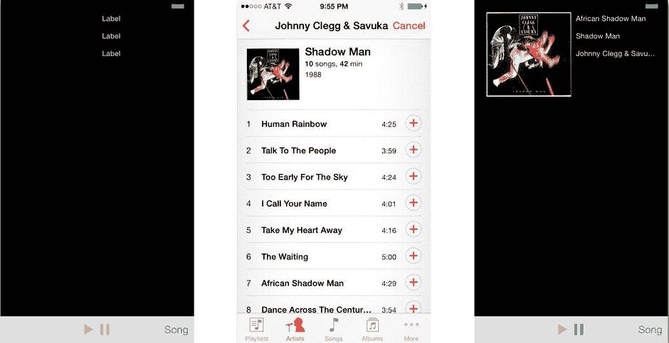

图 9-11. 专辑封面和歌曲元数据

对于这个界面，我唯一不喜欢的是在应用启动时，封面视图和三个标签视图都填充了占位信息。通过在`Main.storyboard`文件中清除三个元数据标签的`text`属性，并将图像视图的初始图像设置为`noartwork.png`来修复此问题。

## 制造一些声音

到目前为止，你实际上已经创建了一个（最小化的）iPod 应用。这是一项令人印象深刻的成就，但这不是为应用添加声音的唯一方法。你可能希望为动作添加音效，或播放已捆绑的音乐文件。或者你可能想播放来自网络数据源的实时音频流。这些都很容易实现，甚至比从 iPod 库中播放歌曲还要简单——而后者本身已经相当简单了。

我先讲简单的部分。要播放和控制应用可访问的几乎任何类型的音频数据：

创建一个`AVAudioPlayer`对象。  
用音频数据源（通常是资源文件的 URL）初始化播放器。  
向其发送一条`-play`消息。

就像`MPMusicPlayerController`一样，`AVAudioPlayer`对象会处理所有细节，包括在播放完成时通知你的委托。

所以你可能会认为，完成这个应用只需要十几行代码和一些按钮。遗憾的是，你错了。


### 置身于更广阔的世界

在应用中播放音频的复杂性并非源于播放声音的代码本身。其复杂性在于 iOS 设备的特性及其所处的环境。

以 iPhone 为例。它是一部电话和可视电话；音频用于提示来电和播放来电者的音频流。它是一个音乐播放器；你可以播放喜爱的音乐或有声书，甚至使用其他应用时也能在线收听网络广播。它是一个闹钟；定时器能在白天或夜晚的任何时间提醒你待办事项。它是一个游戏机；游戏中充满了声音、音效和环境音乐。它是一个寻呼机；消息、通知和提醒可能因无数原因随时响起，瞬间打断你的工作（或娱乐）。它还是一个视频播放器、电视机、答录机、GPS 导航仪、电影编辑器、录音笔和数字助理。

所有这些音频源共享一个输出通道。为了有效运作——为用户创造愉快的体验——所有这些相互竞争的音频源必须相互协作。当有电话呼入时，游戏声音和音乐播放必须停止。如果需要用户听到提醒或录音信息，背景音乐需要暂时降低音量。iOS 将这些情况称为中断。

更为复杂的是，iOS 设备有多种不同的音频输出方式。包括内置扬声器、耳机插孔、无线蓝牙设备、AirPlay 以及基座接口。iOS 将这些称为音频线路。音频可以定向到其中的任意一个，并且可以随时切换到另一个（称为线路切换）。音频播放必须感知这些变化，你的应用可能需要对这些变化做出响应。例如，苹果建议拔出耳机时应导致音乐播放暂停，但游戏音效应继续播放。

再增加一点复杂性，大多数 iOS 设备都有一个响铃/静音开关。旨在作为提醒、闹钟、装饰音或音效的音频，仅当响铃开关处于正常位置时才应播放。而更具针对性的音频，如电影和有声书，即使静音开关开启也应正常播放。

综合来看，你的应用需要：

-   确定应用中每个音频源的意图和用途
-   声明此用途，以便 iOS 调整其行为来适应你的音频
-   监听中断和音频线路变化，并采取适当措施

好消息是，并非你编写的每个包含音频功能的应用都需要执行所有这些操作。事实上，如果仅使用 iPod 音乐播放器或仅使用 `AVAudioPlayer` 对象播放附带声音，你可能根本不需要做任何事。这两个类都会“自动采取正确行为”。

然而，对于像 DrumDub 这样的应用，它希望在混入额外音效的同时管理自己的音乐播放，那么所有这些步骤都需要执行。因此，在向应用添加音效之前，先打下一些基础。

### 配置你的音频会话

你通过音频会话向 iOS 传达你的意图——描述你的应用将产生何种声音，以及这些声音将如何影响其他音频源。每个 iOS 应用都会获得一个通用的音频会话，并预配置了一套基本行为。这就是为什么如果仅通过音乐播放器控制器播放音乐，你无需做任何特殊处理；默认的音频会话就完全够用。

DrumDub 需要同时播放音频和混音。这并不常见，因此它需要重新配置其音频会话。仅播放音频的应用通常只需配置一次音频会话，之后便无需再动。

> **注意**  
> 录制音频或同时录制和播放音频的应用则更为复杂。当它们在录制、播放和处理之间切换时，必须反复重新配置其音频会话。

在你的 `DDAppDelegate.m` 文件中，你会找到应用委托对象的实现。发送给应用委托的消息之一是 `-application:didFinishLaunchingWithOptions:` 消息。顾名思义，它会在你的应用加载、初始化完毕并即将开始运行之后立即发送。这是放置那些只需运行一次、且在任何其他操作之前运行的代码的理想位置。将以下代码（粗体部分）添加到此方法的开头：

```
- (BOOL)application:(UIApplication *)application
didFinishLaunchingWithOptions:(NSDictionary *)launchOptions
{
    AVAudioSession *audioSession = [AVAudioSession sharedInstance];
    [audioSession setCategory:AVAudioSessionCategoryPlayback
                  withOptions:AVAudioSessionCategoryOptionMixWithOthers
                        error:NULL];
}
```

> **注意**  
> 编译器会标记此代码为错误。你很快就会修复它。

一个音频会话包含一个类别和一组选项。共有七种不同的类别可供选择，如表 9-1 所列。

**表 9-1. 音频会话类别**

| 会话类别 | 应用描述 |
| --- | --- |
| `AVAudioSessionCategoryAmbient` | 播放“背景”音频或非必要音效。没有这些声音应用也能正常工作。应用音频与同时播放的其他音频（如 iPod）混合。响铃/静音开关会使应用音频静音。 |
| `AVAudioSessionCategorySoloAmbient` | 播放不与其他音频混合的非必要音频；应用播放时，其他音频源会被静音。响铃/静音开关会使应用音频静音。 |
| `AVAudioSessionCategoryPlayback` | 播放音乐或其他必要声音。换句话说，音频是应用的主要目的，没有它应用就无法工作。响铃/静音开关不会使应用音频静音。 |
| `AVAudioSessionCategoryRecord` | 录制音频。 |
| `AVAudioSessionCategoryPlayAndRecord` | 播放并录制音频。 |
| `AVAudioSessionCategoryAudioProcessing` | 执行音频处理（使用硬件音频编解码器），同时既不播放也不录制。 |
| `AVAudioSessionCategoryMultiRoute` | 需要同时将音频输出到多条线路。例如，幻灯片应用可能通过基座接口播放音乐，同时通过耳机发送音频提示。 |

默认类别是 `AVAudioSessionCategorySoloAmbient`。对于 DrumDub 来说，你认定音频是其存在的根本理由。使用 `-setCategory:withOptions:error:` 消息将其类别更改为 `AVAudioSessionCategoryPlayback`。现在，你的应用音频将不会因响铃/静音开关而静音。

你还可以通过一些特定于类别的选项来微调类别。播放类别唯一的选项是 `AVAudioSessionCategoryOptionMixWithOthers`。如果设置此选项，它允许你的 `AVAudioPlayer` 对象播放的音频与同时播放的其他音频“混合”。这正是你希望 DrumDub 实现的效果。没有此选项，播放声音会停止其他音频源。

所有这些符号都在 `AVFoundation` 框架中定义，因此你需要 `#import` `AVFoundation.h` 头文件来获取它们。在 `DDAppDelegate.m` 文件中，将这条语句添加到所有其他 `#import` 语句之上：

```
#import <AVFoundation/AVFoundation.h>
```

看到了吧，这并不太难。实际上，解释说明比代码要多得多。正确配置好你的音频会话后，你现在就可以将音效（混入）到音乐中了。


### 播放音频文件

你终于来到了应用设计的核心：播放声音。你将创建四个按钮，每个按钮播放不同的声音。要实现这一功能，你需要：

- 四个按钮对象
- 四张图片
- 四个 `AVAudioPlayer` 对象
- 四个音频样本文件
- 一个播放声音的动作方法

在添加资源并定义好动作方法后，构建界面会更容易，因此请从这里开始。找到你的 `Learn iOS Development Projects` ➤ `Ch 9` ➤ `DrumDub (Resources)` 文件夹，并定位下表中的 12 个文件：

| 音频样本 | 按钮图片 | 视网膜显示图片 |
| --- | --- | --- |
| `snare.m4v` | `snare.png` | `snare@2x.png` |
| `bass.m4v` | `bass.png` | `bass@2x.png` |
| `tambourine.m4v` | `tambourine.png` | `tambourine@2x.png` |
| `maraca.m4v` | `maraca.png` | `maraca@2x.png` |

首先添加按钮图片文件。选择 `Images.xcassets` 素材目录项。在目录中，你会看到之前添加的 `noartwork` 资源。将八张乐器图片文件（军鼓、贝斯、铃鼓和沙锤各两张）拖入素材目录的组列表中，如图 9-12 所示。

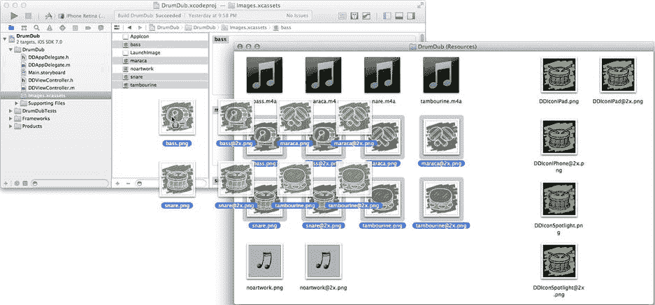

图 9-12. 添加图片资源

趁此机会，选择素材目录中的 `AppIcon` 组，并将相应的应用图标图片文件拖入其中，就像你在之前的项目中所做的那样。如果你正在构建该项目的 iPhone 版本，则需要添加 `DDIconIPhone@2x`、`DDIconSpotlight` 和 `DDIconSpotlight@2x` 文件。如果你正在构建 iPad 版本，则添加 `DDIconIPad`、`DDIconIPad@2x`、`DDIconSpotlight` 和 `DDIconSpotlight@2x` 文件。

四个声音文件（`bass.m4a`、`maraca.m4a`、`snare.m4a` 和 `tambourine.m4a`）也将成为资源文件，但它们不属于素材目录管理的资源类型。你可以直接将任何类型的文件添加到项目中，并将该文件作为资源包含在应用的包中。

为保持整洁，请先为这些资源文件创建一个新组。在导航器中按住 Control 键并单击/右键点击 `DrumDub` 组（而不是项目），然后选择“新建组”命令，如图 9-13 左侧所示。

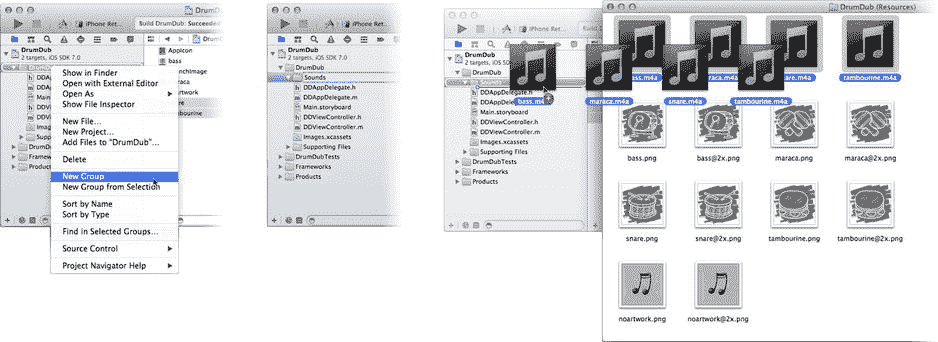

图 9-13. 添加非图片资源

将该组命名为 `Sounds`，如图 9-13 中间所示。在访达中找到四个音频样本文件，并将它们拖入组中，如图 9-13 右侧所示。如果不小心拖放到了 `DrumDub` 组，请在导航器中选中它们，再拖入 `Sounds` 组。你可以随时按需重新组织项目中的项目。

将项目拖入导航器后，Xcode 会提供一些选项，用于确定如何将这些项目添加到你的项目中，如图 9-14 所示。确保勾选**将项目复制到目标组的文件夹（如果需要）**选项。此选项会将新项目复制到应用的项目文件夹中。第二个选项（**为任何添加的文件夹创建组**）仅在你添加包含资源文件的文件夹时才适用。

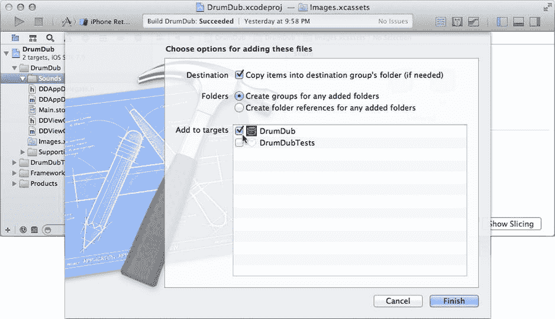

图 9-14. 添加项目文件选项

**警告**：如果你未勾选**将项目复制到目标组的文件夹（如果需要）**选项，Xcode 将仅添加对原始项目的引用，而原始文件仍在项目文件夹之外。这暂时可以正常工作，但当你重命名某个原始文件、移动项目或将项目复制到另一个系统时，项目就会突然无法构建。为了避免麻烦，请将所有项目资源保留在项目文件夹内。

最后，确保已勾选 `DrumDub` 目标，如图 9-14 所示。此选项使这些项目成为 `DrumDub` 应用目标的成员，这意味着它们将作为资源文件包含在最终的应用中。（如果忘记勾选，你稍后可以使用文件检查器更改任何项目的目标成员资格。）点击“完成”，Xcode 会将音频样本文件复制到你的项目文件夹中，将它们添加到项目导航器，并将它们包含在 `DrumDub` 应用目标中。这些文件现在已准备好用于你的应用。


### 创建 `AVAudioPlayer` 对象

你将使用 `AVAudioPlayer` 对象播放声音样本文件。需要四个这样的对象。与其创建四个 `AVAudioPlayer` 变量并编写四个播放动作，不如创建一个数组来存放所有对象，并创建一个方法来播放其中任何一个。从 `AVAudioPlayer` 对象开始。在 `DDViewController.m` 中找到私有的 `@interface DDViewController ()` 部分，并添加以下粗体代码：

```
#define kNumberOfPlayers 4
```

```
static NSString *SoundName[kNumberOfPlayers] = { @"snare", @"bass", @"tambourine", @"maraca" };
```

```
@interface DDViewController ()
{
    MPMusicPlayerController *music;
    AVAudioPlayer *players[kNumberOfPlayers];
}
@property (readonly,nonatomic) MPMusicPlayerController *musicPlayer;
- (void)playingItemDidChangeNotification:(NSNotification*)notification;
- (void)playbackStateDidChangeNotification:(NSNotification*)notification;
- (void)createAudioPlayers;
- (void)destroyAudioPlayers;
@end
```

`kNumberOfPlayers` 常量定义了本应用所使用的声音数量、声音播放器对象数量以及声音按钮数量。同时还定义了一个包含字符串常量对象的 `static` 数组，每个元素对应一个声音样本资源文件的名称。`players` 实例变量是一个 `AVAudioPlayer` 对象数组。

**提示**

将几乎所有常量定义为符号（如 `kNumberOfPlayers`）是一种良好的实践，原因有二。首先，它能让代码更具描述性。表达式 `(6*2)` 比 `(kDiceSides*kNumberOfDice)` 更令人费解。可参阅 [`http://en.wikipedia.org/wiki/Magic_number_(programming)`](http://en.wikipedia.org/wiki/Magic_number_(programming)) 中的“魔法数字”反模式。其次，它定义了代码中可修改该值的唯一位置。如果未来版本的 DrumDub 有六个声音按钮，只需修改一条语句即可更新所有不同的 `for` 循环和数组大小。

`-createAudioPlayers` 和 `-destroyAudioPlayers` 方法用于一次性创建和销毁全部四个音频播放器对象。将它们添加到 `@implementation` 部分的末尾：

```
- (void)createAudioPlayers
{
    for ( NSUInteger i=0; i<kNumberOfPlayers; i++)
    {
        NSURL *soundURL = [[NSBundle mainBundle] URLForResource:SoundName[i]
                withExtension:@"m4a"];
        players[i] = [[AVAudioPlayer alloc] initWithContentsOfURL:soundURL
                error:NULL];
        players[i].delegate = self;
        [players[i] prepareToPlay];
    }
}
```

```
- (void)destroyAudioPlayers
{
    for ( NSUInteger i=0; i<kNumberOfPlayers; i++)
        players[i] = nil;
}
```

`-createAudioPlayers` 方法遍历声音名称常量数组（`SoundName[i]`），并据此创建指向你之前添加的 `m4a` 声音资源文件的 URL。该 URL 用于创建和初始化一个新的 `AVAudioPlayer` 对象，用于播放该声音文件。

你的控制器对象被设置为声音播放器的委托（稍后将用到这一点）。最后，应用了一些优化。向声音播放器发送 `-prepareToPlay` 消息，用于预先准备播放器对象，使其能立即播放声音。

**注意**

通常情况下，播放器对象会进行惰性初始化，即等到请求播放时才实际读取声音样本数据文件、分配缓冲区、配置硬件编解码器等。所有这些操作都会耗费时间。当用户点击声音按钮时，他们不希望等待声音播放，而是期望声音立即响起。`-prepareToPlay` 消息消除了这种初始延迟。

`-destroyAudioPlayers` 方法不言自明，目前还不需要用到它。该方法稍后才会“登场”。

接下来是播放这些声音的按钮，以及实现播放的动作方法。首先处理动作声明和一些零散事项。切换到你的 `DDViewController.h` 文件。在 `#import` 语句下方，添加一条新的导入语句：

```
#import <AVFoundation/AVFoundation.h>
```

这将导入 `AVAudioPlayer` 及相关类的定义。接下来，让你的控制器成为 `AVAudioPlayerDelegate` 委托：

```
@interface DDViewController : UIViewController <MPMediaPickerControllerDelegate,
    AVAudioPlayerDelegate>
```

在 `@interface` 中添加一个新的动作方法：

```
- (IBAction)bang:(id)sender;
```

现在你可以开始设计界面了。


### 添加声音按钮

回到你的 `Main.storyboard` Interface Builder 文件。拖入一个新的 `UIButton` 对象。选中它并执行以下操作（见图 9-15）：

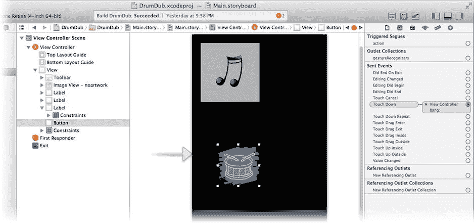

图 9-15. 创建第一个爆裂按钮

*   使用尺寸检查器将其宽度和高度均设置为 `100` 像素。
*   使用属性检查器：
    *   将其 `type` 属性设置为 `Custom`。
    *   清除其 `title` 文本属性（删除“Button”）。
    *   将其 `image` 属性设置为 `snare`。
    *   向下滚动到其 `tag` 属性，将其从 `0` 改为 `1`。
*   选择 **Editor** ➤ **Pin** ➤ **Width**。
*   再次选择该按钮，并选择 **Editor** ➤ **Pin** ➤ **Height**。
*   使用连接检查器将其 `Touch Down` 事件连接到 `View Controller` 对象的新 `-bang:` 操作。

该按钮的配置有几个值得注意的方面。首先，你连接的是 `Touch Down` 事件，而不是更常见的 `Touch Up Inside` 事件。这是因为你希望在用户触摸按钮的瞬间就收到 `-bang:` 操作消息。通常，按钮只有在用户触摸并松开手指，且手指仍在按钮内部时才会发送其操作消息。因此，该操作名为“Touch Up Inside”。

其次，你没有为此按钮创建出口。你将通过其 `tag` 属性来标识和访问该对象。所有 `UIView` 对象都有一个整数类型的 `tag` 属性。它的存在纯粹是为了让你在标识视图时使用；iOS 不会将其用于其他任何用途。你将使用 `tag` 来确定播放哪种声音，稍后还会用它来获取界面中的 `UIButton` 对象。

将新按钮复制三次，总共创建四个按钮。你可以使用剪贴板，也可以按住 **Option** 键并拖出新按钮副本。将它们排列成一组，如图 9-16 所示，然后将该组在界面中居中。选择 **Editor** ➤ **Resolve Auto Layout Issues** ➤ **Add Missing Constraints in View Controller**。

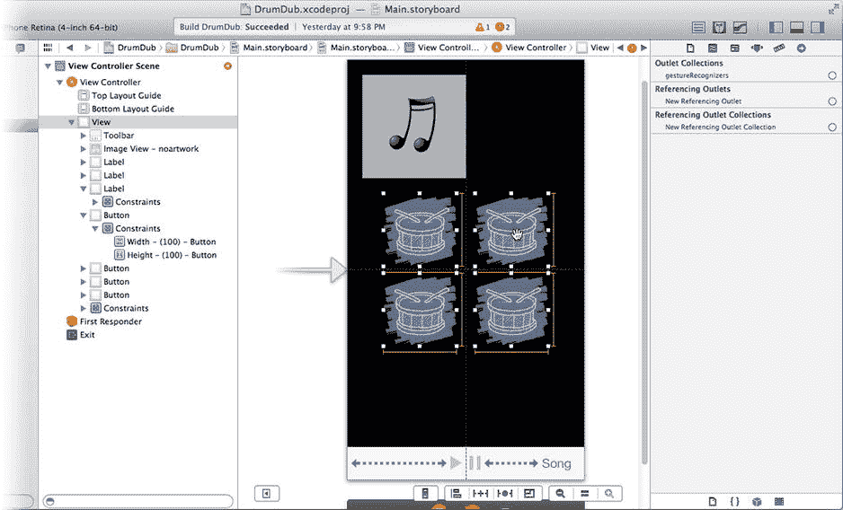

图 9-16. 复制爆裂按钮

所有按钮都具有相同的类型、图像、标签、约束和操作连接。使用属性检查器更改其他三个按钮的图像和标签属性，从右上角的按钮开始，按顺时针方向进行，使用下表：

| 按钮 | 图像 | 标签 |
| --- | --- | --- |
| 右上角 | `bass` | 2 |
| 右下角 | `maraca` | 4 |
| 左下角 | `tambourine` | 3 |

完成的界面应类似于图 9-17 中的界面。

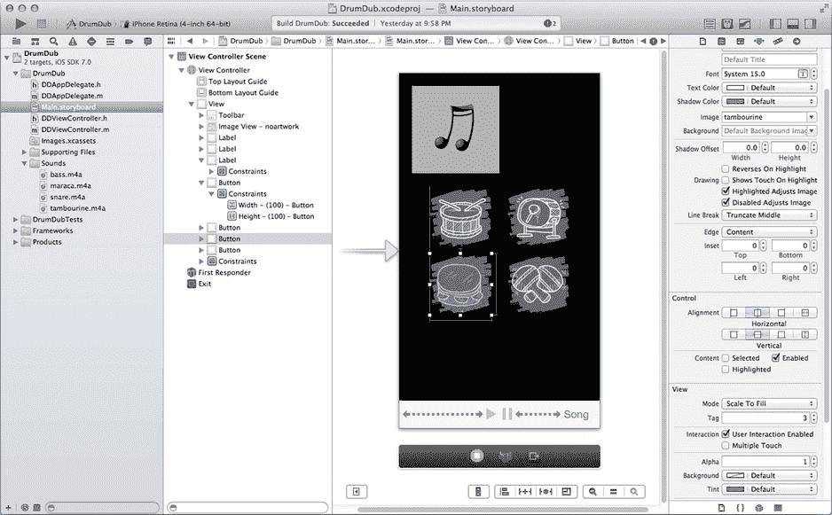

图 9-17. 完成的 DrumDub 界面

再次回到 `DDViewController.m`，将 `-bang:` 方法添加到你的实现中：

```
- (IBAction)bang:(id)sender
{
    NSInteger playerIndex = [sender tag]-1;
    if (playerIndex>=0 && playerIndex<kNumberOfPlayers)
    {
        AVAudioPlayer *player = players[playerIndex];
        [player pause];
        player.currentTime = 0;
        [player play];
    }
}
```

所有四个按钮都发送相同的操作。你通过其 `tag` 属性来确定是哪个按钮发送了消息。你的四个按钮的 `tag` 值介于 1 到 4 之间，你将使用它作为索引（0 到 3）来获取该按钮的 `AVAudioPlayer` 对象。

一旦你获取了按钮的 `AVAudioPlayer`，首先向其发送一条 `–pause` 消息。如果声音正在播放，这会暂停其播放。如果没有播放，则不执行任何操作。

然后将 `currentTime` 属性设置为 `0`。此属性是播放器的逻辑“播放头”，指示播放器当前正在播放或将要开始播放的位置（以秒为单位）。将其设置为 `0` 会“回退”声音，使其从头开始播放。

最后，`-play` 消息开始播放声音。`-play` 消息是异步的；它会启动一个后台任务来播放和管理声音，然后立即返回。

在声音能够播放之前，还有两处细节需要处理。

### 激活音频会话

虽然并非严格必需，但 `AVAudioSession` 类的文档建议你的应用在启动时激活音频会话，并在音频会话被中断时再次激活。你将借此机会同时准备音频播放器对象。在你的 `DDViewController.m` 实现中添加一个 `-activateAudioSession` 方法。首先在顶部的私有 `@interface` 部分添加一个原型：

```
- (void)activateAudioSession;
```

找到 `-viewDidLoad` 方法，并在控制器首次加载时发送此消息（新行以粗体显示）：

```
- (void)viewDidLoad
{
    [super viewDidLoad];
    [self activateAudioSession];
}
```

并将该方法添加到 `@implementation` 中：

```
- (void)activateAudioSession
{
    BOOL active = [[AVAudioSession sharedInstance] setActive:YES error:NULL];
    if (active && players[0]==nil)
        [self createAudioPlayers];
    if (!active)
        [self destroyAudioPlayers];
    for ( NSUInteger i=0; i<kNumberOfPlayers; i++)
        [(UIButton*)[self.view viewWithTag:i+1] setEnabled:active];
}
```

第一行获取你应用的音频会话对象（与之前在 `-application:didFinishLaunchingWithOptions:` 中配置的是同一个）。你向其发送一条 `-setActive:error:` 消息来激活或重新激活音频会话。

如果音频会话现在处于活动状态，`-setActive:error:` 消息将返回 `YES`。在某些较为罕见的情况下，此操作会失败（返回 `NO`），你的应用应优雅地处理这种情况。

在此应用中，你检查会话是否已激活，并发送 `-createAudioPlayers` 来准备用于播放的 `AVAudioPlayer` 对象。如果会话无法激活（这意味着你的应用无法使用任何音频），那么你将销毁之前创建的所有 `AVAudioPlayer` 对象，并禁用界面中的所有音效按钮。

由于你没有为这些按钮连接出口，你将通过它们的 `tag` 来获取它们。`-viewWithTag:` 消息会搜索视图对象的层次结构，并返回第一个与该标签匹配的子视图对象。你的爆裂按钮是唯一标签值分别为 1、2、3 和 4 的视图。循环会获取每个按钮视图并启用或禁用它。

**提示：** 标签是一种管理一组视图对象的便捷方式，无需为每个对象都创建出口。

你的应用的功能部分现已完成。所谓功能，是指你可以运行应用，播放音乐，并用俗气的打击乐噪音打扰房间里的其他人，如图 9-18 所示。

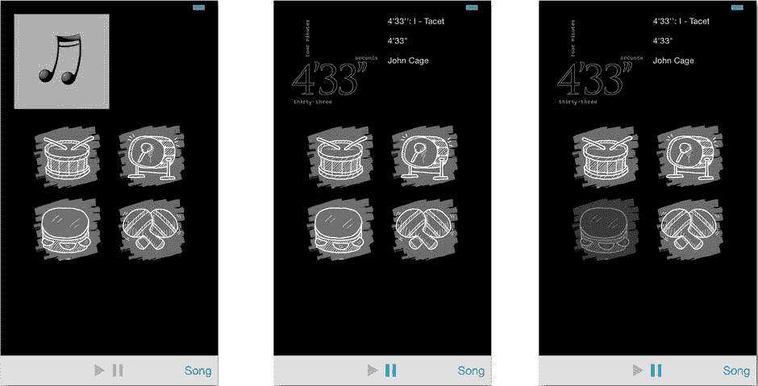

图 9-18. 正常工作的 DrumDub 应用

## 中断与旁路

在“生活在更大世界”部分，我描述了众多会干扰你应用音频使用的事件和情况。大多数人讨厌中断或被迫绕道，我猜想应用开发者也不例外。但优雅地处理这些事件是精心打造的 iOS 应用的标志。首先我们来处理中断问题。


### 处理中断

当其他应用或服务需要激活其音频会话时，就会发生`中断`。最常见的中断来源是来电和提醒（由闹钟、信息、通知和备忘录触发）。

中断处理的大部分工作已为你自动完成。当你的应用音频会话被中断时，iOS 会淡出你的音频并停用你的会话。随后，抢占会话会接管并开始播放用户的铃声或提醒音。你的应用、音频和音乐播放器代理会收到“中断开始”消息。

你的应用应采取适当措施来响应中断。通常，这不需要做太多操作。你可以更新界面，表明你已停止播放音乐。大多数情况下，你的应用只需记录自己正在做什么，以便中断结束后能恢复状态。

中断可能是短暂的：比如闹钟中断仅持续几秒。也可能非常（非常）长：如果你接听了爱唠叨的梅阿姨打来的电话，中断可能持续一小时以上。不要对中断时长做任何假设，只需等待 iOS 在中断结束时通知你的应用。

当中断结束时，你的应用将收到“中断结束”消息。真正的工作从这里开始。首先，你的应用应显式地重新激活其音频会话。这不是强制要求，但建议这样做。这能让你的应用有机会捕捉到（极为罕见的）音频会话无法重新激活的情况。

接下来，你需要恢复播放、重新加载音频对象、更新界面，或执行应用所需的其他操作，使其恢复到中断发生前的运行状态。在 DrumDub 应用中，需要做的工作出奇地少，因为大多数默认的音乐和音频播放器行为正是你所需要的。不过，你仍然需要添加一些基础的中断处理逻辑。

### 添加中断处理器

中断消息可以通过多种不同方式接收。你的应用只需观察那些你想要且方便处理的消息即可，无需观察所有消息。中断开始和结束消息会发送至：

-   音频会话代理 (`AVAudioSessionDelegate`)
-   所有音频播放器代理 (`AVAudioPlayerDelegate`)
-   音乐播放器状态变化通知的任何观察者 (`MPMusicPlayerControllerPlaybackStateDidChangeNotification`)

决定你希望应用如何响应中断，然后实现相应处理器来方便地完成这些操作。当 DrumDub 被某个事件中断时，你需要：

-   暂停音乐播放。
-   停止正在播放的所有打击乐器声音（这样中断结束后就不会继续播放）。

当中断结束时，你需要让 DrumDub 执行：

-   重新激活音频会话并检查问题。
-   恢复音乐播放。

暂停和恢复音乐播放无需编写代码。`MPMusicPlayerController` 类会在响应中断时自动执行这些操作。你甚至不需要添加任何代码来更新界面。当音乐播放器被中断时，其 `playbackState` 会变为 `MPMusicPlaybackStateInterrupted`，你的控制器会收到 `-playbackStateDidChangeNotification:` 消息，从而更新播放和暂停按钮。当中断结束时，音乐播放器会恢复播放并发送另一条状态变化通知。

因此，DrumDub 唯一需要处理的非标准行为是在中断发生时让所有正在播放的打击乐器声音静音。这样做的目的是防止中断结束后音效片段“尾部”再次开始播放。通过在 `DDViewController.m` 中添加以下音频播放器代理方法来处理：

```
- (void)audioPlayerBeginInterruption:(AVAudioPlayer *)player

{

    [player pause];

}
```

你的控制器对象已经是所有四个音频播放器的代理。你的控制器最多可以收到四次此消息（每个播放器一次）。

**注意**

`AVAudioPlayer` 代理对象在播放器完成声音播放时也会收到 `-audioPlayerDidFinishPlaying:successfully:` 消息，在中止结束时收到 `-audioPlayerEndInterruption:withOptions:` 消息。DrumDub 不需要这两条消息，但你的下一个应用可能会用到。

列表中的最后一项任务是在中断结束后重新激活音频会话。为此，请将你的 `DDViewController` 对象设为音频会话的代理，并处理 `-endInterruption` 代理消息。首先，修改 `DDViewController.h` 中的类声明：

```
@interface DDViewController : UIViewController <MPMediaPickerControllerDelegate,

                                                AVAudioSessionDelegate,

                                                AVAudioPlayerDelegate>
```

回到 `DDViewController.m`，找到 `-viewDidLoad` 方法并设置会话的代理属性：

```
- (void)viewDidLoad

{

    [super viewDidLoad];

    [[AVAudioSession sharedInstance] setDelegate:self];

    [self activateAudioSession];

}
```

最后，实现一个 `-endInterruption` 方法，使你的控制器能从音频会话接收此消息：

```
- (void)endInterruption

{

    [self activateAudioSession];

}
```

你已经编写了（重新）激活音频会话和更新界面的代码。`-endInterruption` 只需再次执行这些操作即可。

处理完棘手中断问题后，接下来该处理绕行（路由变化）了。


### 处理音频线路变化

音频线路是指数据到达听者耳膜所经过的路径。你的 iPhone 可能已与汽车扬声器配对。当你下车时，iPhone 会切换至内置扬声器。当你插入耳机时，它会停止通过扬声器播放，转而通过耳机播放。这些事件都属于音频线路变化。

处理音频线路变化的方式与处理中断完全相同：决定你的应用在每个场景下应做什么，然后编写处理程序来监听这些事件并执行相应策略。从 `DrumDub` 示例来看，你希望实现 Apple 推荐的行为：当用户拔下耳机或断开外部扬声器连接时，停止音乐播放。如果这些是游戏中的音效或类似内容，允许它们继续播放是合适的。但 `DrumDub` 的音乐会在耳机拔下时停止播放，因此乐器声也应随之停止。

音频线路通知由 `AVAudioSession` 对象发出，你只需监听它们即可。首先定义一个音频线路变化通知处理程序，将其原型添加到 `DDViewController.m` 中 `@interface DDViewController ()` 私有部分：

`- (void)audioRouteChangedNotification:(NSNotification*)notification;`

接下来，请求让 `DDViewController` 对象接收音频线路变化通知。在 `-viewDidLoad` 方法的末尾添加以下代码：

```
[[NSNotificationCenter defaultCenter] addObserver:self
                     selector:@selector(audioRouteChangedNotification:)
                         name:AVAudioSessionRouteChangeNotification
                       object:nil];
```

现在将方法添加到 `@implementation` 部分：

```
- (void)audioRouteChangedNotification:(NSNotification*)notification
{
    NSNumber *changeReason =
                notification.userInfo[AVAudioSessionRouteChangeReasonKey];
    if ([changeReason integerValue]==
                AVAudioSessionRouteChangeReasonOldDeviceUnavailable)
        {
        for (NSUInteger i=0; i<kNumberOfPlayers; i++)
            [players[i] pause];
        }
}
```

该方法首先检查音频线路变化的原因。它从通知的 `userInfo` 字典中获取此信息。如果 `AVAudioSessionRouteChangeReasonKey` 的值为 `AVAudioSessionRouteChangeReasonOldDeviceUnavailable`，则表示先前激活的音频线路不再可用。这种情况发生在耳机被拔下、设备从基座接口移除、无线扬声器系统断开连接等场景。如果真是如此，它会停止所有四个音频播放器的播放。

至此，这个应用就完成了！继续运行它以确认一切正常。你可以通过以下操作测试中断和音频线路变化逻辑：

- 设置闹钟中断播放
- 用另一部手机呼叫你的 iPhone
- 插入和拔下耳机

在你所能设计的尽可能多的场景下测试应用，是应用开发中的重要环节。

### 其他音频主题

本章甚至尚未涉及音频录制或信号处理的主题。要开始学习这些以及类似主题，请先从《多媒体编程指南》入手。它为在 iOS 中播放、录制和操作音频及视频提供了概览和路线图。

如果你需要执行高级或底层音频任务（例如分析或编码音频），请参考《Core Audio 概述》。所有这些文档都可以在 Xcode 的“文档和 API 参考”中找到。

这里还有另一个值得关注的内容：如果你需要在视图中呈现音频或视频，希望你的应用在后台播放音乐（即应用未运行时），或需要处理远程事件，请查看 `AVPlayer` 和 `AVPlayerLayer` 类。前者是一个近乎通用的音视频媒体播放器，类似于 `MPMusicPlayerController` 和 `AVAudioPlayer`。它稍微复杂一些，但功能也更强大。它可以与 `AVPlayerLayer` 对象配合，在视图中呈现视觉内容（电影），因此你可以创建自己的 YouTube 风格视频播放器。

## 总结

声音为你的应用增添了丰富的维度。你已经学会了如何从 iPod 库以及应用中捆绑的资源文件播放和控制音频。你理解了配置音频会话、智能处理中断和音频线路变化的重要性。与其他音频源“和谐共处”创造了用户喜爱的体验，并且会让用户愿意反复使用。

但 iOS 界面是否仅限于标签、按钮和图像视图？请与我一起进入下一章一探究竟。

**练习**

通过使用 iPod 音乐播放器而非应用内音乐播放器，将 `DrumDub` 进一步融入 iOS 体验。这将需要一些细微的改动：

- 获取 `+iPodMusicPlayer` 对象，而不是 `+applicationMusicPlayer` 对象。
- 在视图加载后立即创建并初始化音乐播放器，而不是等到用户选择歌曲时才懒加载。
- 不要随意更改播放器的设置（如随机播放或重复模式）。请记住，你正在更改用户的 iPod 设置；大多数人不会喜欢你的应用乱动他们的 iPod。

完成后，`DrumDub` 将“接入”用户的 iPod 应用。如果用户启动 `DrumDub` 时 iPod 音乐正在播放，那么歌曲会在你的应用启动时立即出现。如果用户开始播放一首歌并退出 `DrumDub`，音乐将继续播放。

你可以在 `Learn iOS Development Projects` ➤ `Ch 9` ➤ `DrumDub E1` 文件夹中找到我对这个练习的解决方案。

