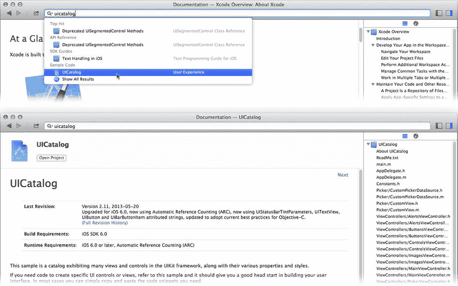
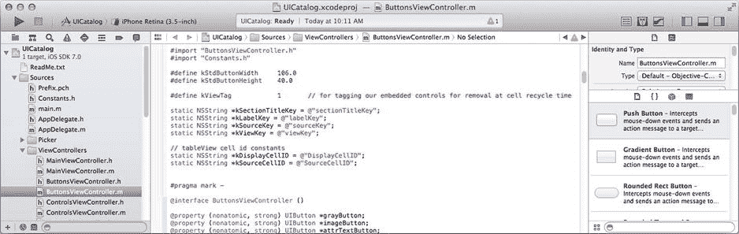
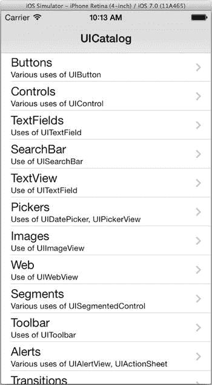
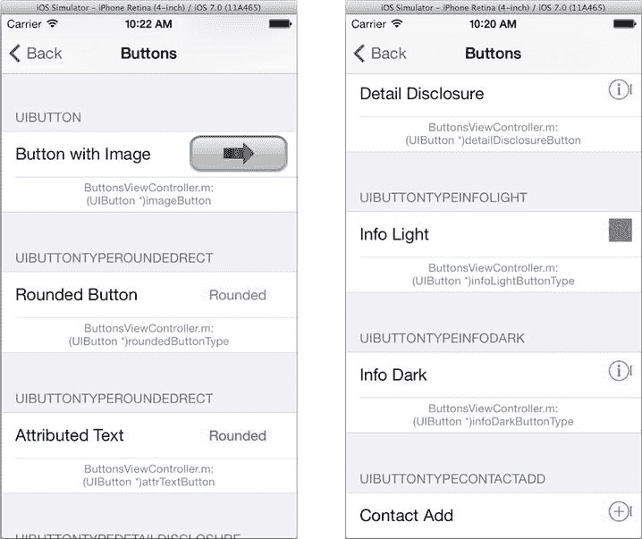
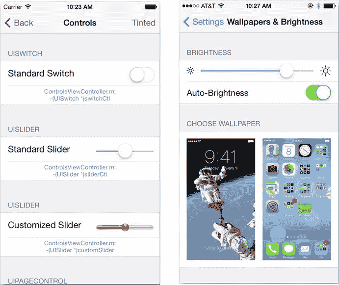

# 通过示例学习

软件开发很像烹饪。阅读菜谱、谈论烹饪过程、享受成果是一回事，实际动手操作则是另一回事。学习烹饪的最佳方法之一，就是观察一位经验丰富的厨师，并模仿他们的手法。

Apple 提供了许多示例项目——这些都是完整编写、可直接运行的应用程序——来演示 iOS 中各种技术的使用。你只需下载一个项目，构建、运行它，然后深入挖掘其中的所有奥秘。这些示例项目是开始使用或至少理解如何使用 iOS 中众多框架和功能的绝佳途径。

Apple 不仅免费提供这些示例项目，而且让下载过程变得异常简单。只需点击一个按钮，Xcode 就会搜索、下载并打开示例代码项目。从 Xcode 的文档管理器（`帮助 ➤ 文档和 API 参考`）窗口开始，如图 10-1 所示。



图 10-1. 搜索示例代码

搜索 `UICatalog` 项目，如图 10-1 所示。它将出现在“示例代码”类别下。点击它，项目的文档页面便会显示。页面顶部有一个“打开项目”按钮。点击它。Xcode 会下载该项目的 ZIP 文件，解压，并在一个新的工作区窗口中打开项目，如图 10-2 所示。是不是非常简单？



图 10-2. `UICatalog` 项目 注

示例项目并非 Xcode 安装包的一部分，需要连接互联网才能下载。

你会注意到，许多类的文档都包含指向示例项目的链接，这使得下载展示这些类实际用法的代码变得非常容易。

**提示**

尽管 Apple 所谓的“围墙花园”将大多数 iOS 应用项目限制在开发者社区内——毕竟，你必须是开发者才能在 iOS 设备上构建和运行应用——但这并未阻止开源社区的发展。外面存在各种各样的开源 iOS 项目，可供开发者（像你一样）以及那些“越狱”了设备的勇敢人士使用。快速搜索一下互联网，你就能找到开源应用，以及可以在自己项目中使用的框架和代码库。

`UICatalog` 项目尤其特别。它是一个 iPhone 应用，演示了 iOS 提供的所有主要视图对象。因此，它不仅是一个便捷的视觉参考，展示了 iOS 提供了哪些类型的视图对象，还能让你精确地看到这些对象在应用中是如何创建和使用的。

在 iPhone 模拟器（或者如果你愿意，也可以在你自己的设备上）运行 `UICatalog` 应用。列表中的第一项是按钮，如图 10-3 所示，这是一个极佳的起点。



图 10-3. `UICatalog` 应用

## 按钮

按钮是一个非常直接的视图对象；它的行为就像物理按钮。`UIButton` 类负责绘制按钮并观察触摸事件，以确定用户如何与其交互。它将用户的操作转化为动作事件，例如“用户在按钮内触摸”、“用户将手指移动到按钮外”、“用户将手指移回按钮内”以及“用户仍在按钮内时松开了手指”。它的功能大致如此。

我知道你在想什么。好吧，也许我不确定。但我希望你在想，“但按钮的功能远不止这些！它还会向其他对象发送动作消息，它能记住自己的状态，它可以被禁用，并且可以附加手势识别器。这可就多了！”

确实很多，但 `UIButton` 类本身并不做这些事情。`UIButton` 位于一个类链的末端，每个类负责一组紧密相关的行为。软件工程师称每个类都扮演着一个角色。`UIButton` 对象的角色就是像一个按钮一样工作。其他类则负责所有那些额外的工作。为了让你更清楚地了解发生了什么，我认为是时候剖析一下 `UIButton` 了。这不仅会帮助你理解 `UIButton` 是如何构建的，还能让你了解所有控件视图的构造方式。

**注**

在撰写本书的过程中，没有 `UIButton` 对象受到损害。

### 响应者与视图类

`UIButton` 是 `UIControl` 的子类，`UIControl` 是 `UIView` 的子类，而 `UIView` 又是 `UIResponder` 的子类。每个类都增加了一层功能，所有这些功能组合在一起，构成了一个按钮。

`UIResponder` 类定义了对象所有与事件相关的功能，其中最值得注意的是处理触摸事件的方法。你已经在第 4 章中了解到了关于 `UIResponder` 的所有内容，并且你创建了一个自定义的 `UIView` 对象，用自己的代码覆盖了触摸事件处理方法，因此我在此不再赘述。

`UIButton` 继承的下一层是 `UIView`。`UIView` 是一个庞大而复杂的类。它拥有数十个属性和一百多个方法。它之所以如此庞大，是因为它负责 iOS 世界中每个可见对象在屏幕上显示的所有方面。它处理视图的几何形状、坐标系、变换（如旋转、缩放和倾斜）、动画、屏幕尺寸变化时视图的重新定位，以及命中测试。它还负责绘制自身、绘制其子视图、决定何时需要重绘这些视图，等等。

`UIView` 一个看似不相关的属性是它的 `gestureRecognizers` 属性。`UIView` 类并不直接处理手势识别器。但由于 `UIView` 定义了屏幕上一个可视区域，而任何可视区域都可以附加一个手势识别器，因此这个属性存在于 `UIView` 中。

**手势识别器如何获取事件**

在触摸事件传递过程中，`UIWindow` 对象将事件提供给手势识别器。在第 4 章中，我解释了如何使用命中测试来确定将接收触摸事件的视图。该描述在某种程度上过于简化了流程。

从 iOS 3.2 开始，`UIWindow` 首先查看初始（命中测试）视图，看它是否附加了任何手势识别器对象。如果是，触摸事件会首先发送给这些手势识别器对象，而不是直接传递给视图对象。如果手势识别器不感兴趣，那么事件最终会到达视图对象。

如果需要，有多种方法可以改变这种行为，但这会有点复杂。所有详细信息，请阅读 iOS 事件处理指南中的“手势识别器”章节，你可以在 Xcode 的文档和 API 参考中找到它。

因此，关于按钮的所有视觉内容都是在 `UIView` 类中定义的。现在进入下一层，即 `UIControl` 类。


### 控件类

`UIControl` 是一个抽象类，它定义了所有控件对象共有的属性，包括按钮、滑块、开关、步进器等。一个控件对象：

*   向目标对象发送动作消息
*   可以启用或禁用
*   可以被选中
*   可以高亮显示
*   设定内容如何对齐

上述列表中的第一项最为重要。`UIControl` 类定义了向接收者（通常是控制器对象）传递动作消息的机制。每个 `UIControl` 对象都维护一个事件表，其中包含触发动作的事件、将接收该动作的对象以及它将发送的动作消息。当你在编辑 Interface Builder 文件并将一个事件连接到另一个对象中的动作方法时，你就是在向该对象的事件调度表中添加一个条目。

注意

回想一下第 4 章的内容，一个事件可以关联一个发送给第一响应者的动作消息。你通过指定要发送的消息并将 `nil` 作为该消息的目标对象来实现这一点。

其他属性（`enabled`、`selected` 和 `highlighted`）是控件外观和行为的通用指示器。`UIControl` 的子类会具体定义这些属性的含义（如果有的话）。

`enabled` 属性是最一致的。一个启用的控件对象可以与用户交互，而禁用的控件（`control.enabled=NO`）则会忽略触摸事件。大多数控件类通过使图像变暗或变灰来表明它们处于禁用状态，从而向用户显示该控件是无效的。

`highlighted` 属性用于指示用户当前正在触摸该控件。许多控件在被触摸时会“点亮”，此属性就反映了这一点。

`selected` 属性适用于可以“打开”或“关闭”的控件，例如 `UISwitch` 类。而那些不会切换状态的控件（如按钮）则会忽略此属性。

`UIControl` 类还通过 `contentVerticalAlignment` 和 `contentHorizontalAlignment` 属性引入了对齐（垂直和水平）的概念。大多数控件对象都有某种标题或图像，并使用这些属性将其定位在视图中。

### 按钮类型

现在你已经回到了 `UIButton` 类。正是这个类实现了控件+视图+响应者对象的按钮特定行为。`UIButton` 类提供了一些预定义的按钮外观，以及大量的自定义选项，因此你可以让它看起来几乎是你想要的任何样式。

按钮最重要的属性是其类型。一个按钮可以是以下类型之一：

*   圆角矩形
*   自定义
*   “披露详情”箭头
*   “信息”按钮（浅色或深色）
*   “添加联系人”加号符号

除了自定义类型外，所有这些按钮类型都在 UICatalog 应用中显示，如图 10-4 所示。要记住的重要一点是，按钮的类型是在创建时确定的。与所有其他属性不同，之后无法更改它。圆角矩形按钮终生都是圆角矩形按钮。



图 10-4.

按钮

圆角矩形按钮是 iOS 的主力。它是 iOS 界面中使用的标准、默认按钮样式。你还会注意到，圆角按钮（图 10-4 中左中位置）并没有什么“圆角”之处。iOS 7 引入了一种新的、精简的 UI 设计，摒弃了早期版本的拟物化按钮设计。然而，类和常量名称并未改变。当你希望为用户正在运行的 iOS 版本呈现标准按钮设计时，请选择“圆角”按钮。

自定义按钮样式则是一块空白画布。iOS（所有版本）不会对自定义按钮的外观做任何添加，让你完全控制其外观。你在第 2 章的超现实主义应用中使用了自定义按钮样式。

你可以通过调整按钮的颜色、文本、文本样式，甚至为按钮的标题和背景提供你自己的图像，来极大地改变按钮的基本外观。

注意

在撰写本书时，UICatalog 项目尚未完全针对 iOS 7 的新 UI 设计进行更新。我完全期望它会被修订，因此你应用中的控件可能会与这里看到的有所不同。

调整按钮外观的主要属性包括：

*   色调颜色
*   标题文本（纯文本或属性文本）及其颜色
*   前景图像
*   背景图像或颜色

`tintColor` 属性设置圆角矩形按钮的高亮和强调色。标准颜色是蓝色。其他按钮类型会忽略此属性。

按钮的标题可以是一个简单的字符串值（到目前为止你在项目中使用的），也可以是一个属性字符串。属性字符串是包含文本属性的字符串：字体、大小、斜体、粗体、下标偏移等。创建属性字符串有点复杂，但允许你创建具有系统能够支持的任何字体和样式的按钮。我将在第 20 章中描述属性字符串。

你也可以通过设置图像属性，使用图像而不是文本来作为按钮的标签。类似地，背景可以设置为图像或纯色。你还可以以任意组合方式混合使用它们：文本标题在图像背景之上，图像在纯色背景之上，图像没有背景（通过将背景色设置为 `UIColor` 的 `clearColor` 对象），等等。

那些具有圆角矩形外观的按钮（图 10-4 左上角）在此例中使用了它们自己的背景图像 `whiteButton.png`。用于按钮背景的图像可以利用内边距（`capInsets`）属性来定义图像边缘的边距，当图像被拉伸以适合按钮大小时，这些边缘不会被缩放。此功能允许你设计单个图形图像，它可以填充任何按钮大小，而不会使边缘变形。将 Xcode 中的 `whiteButton.png` 资源图像与应用运行时它在按钮中的显示效果进行比较。

提示

尽管我将教你自定义按钮、滑块等外观的主要方法，但我还是鼓励你三思而后行。不要仅仅因为你能改变按钮的外观就去改变它。用户之所以知道按钮是做什么的，是因为它看起来像一个按钮。仅仅为了与众不同而改变它，只会让你的应用更难使用。只有当控件的标准外观与设计的其他部分在美学上发生冲突时，我才会考虑自定义控件的外观。

其余按钮类型（详情披露、信息、添加联系人等）是预定义的按钮，自定义选项很少。当你的应用提供这些确切功能时，请使用这些类型，你的用户将会确切理解它们的含义。


### 控制状态

在创建和配置按钮的标题、图像、背景图像和背景颜色时，必须考虑按钮（控件）可能处于的各种状态。`UIControl` 的 `enabled`、`highlighted` 和 `selected` 属性组合起来，为该控件形成一个单一的 `state` 值（`UIControlState`）。状态始终为以下之一：正常、高亮、禁用或选中。

当按钮正常显示时，其状态为 `UIControlStateNormal`。当用户触摸它时，其状态变为 `UIControlStateHighlighted`。当它被禁用时，其状态变为 `UIControlStateDisabled`。

当你设置按钮的标题、图像、背景或颜色时，你是针对特定状态进行设置的。这允许你为按钮启用时设置一个按钮图像，并为禁用、高亮或选中时设置备用按钮图像。你可以在设置这些属性的方法中看到这一点：

`- (void)setTitle:(NSString *)title forState:(UIControlState)state`

`- (void)setTitleColor:(UIColor *)color forState:(UIControlState)state`

`- (void)setImage:(UIImage *)image forState:(UIControlState)state`

`- (void)setBackgroundImage:(UIImage *)image forState:(UIControlState)state`

你无需为每个状态都设置值。至少，你应该为正常（`UIControlStateNormal`）状态设置值。如果你只设置了这些，那么该值将用于所有其他状态。如果你随后希望它在其他某个状态下具有不同的标题、图像、背景或颜色，也请进行相应设置。

还有许多其他更微妙的属性可用于微调按钮的外观和感觉。例如，你可以控制标题文本投下的阴影，或更改标题、图像和背景图像的位置（内边距）。请通读 `UIButton` 的文档以了解所有可用的属性。

最后四种按钮类型——披露箭头、信息（浅色）、信息（深色）和添加联系人——是预定义用户界面按钮的便捷类型。这些按钮的外观或行为几乎没有任何可以自定义的部分。

### 按钮代码

现在你已经对按钮属性有了足够的了解，可以看一下 UICatalog 中的按钮构建代码了。到目前为止，你一直在使用 Interface Builder 创建按钮对象——这很好，没有任何问题。但你也可以像处理数组和图像等其他对象一样，以编程方式创建任何 iOS 对象。

UICatalog 应用程序以编程方式创建了其大部分对象，它甚至提供了这些创建发生位置的提示，以便你可以找到相关代码。在图 10-4 中，按钮下方的文字显示为“ButtonsViewController.m: (UIButton*)roundedButtonType”。切换回 Xcode，找到 `ButtonsViewController.m` 文件。点击它，找到 `-roundedButtonType` 方法。它应该看起来像这样：

```
- (UIButton *)roundedButtonType
{
    if (roundedButtonType == nil)
    {
        roundedButtonType = [[UIButton buttonWithType:UIButtonTypeRoundedRect] retain];
        roundedButtonType.frame = CGRectMake(182.0, 5.0,
                                             kStdButtonWidth, kStdButtonHeight);
        [roundedButtonType setTitle:@"Rounded" forState:UIControlStateNormal];
        roundedButtonType.backgroundColor = [UIColor clearColor];
        [roundedButtonType addTarget:self action:@selector(action:)
                    forControlEvents:UIControlEventTouchUpInside];
        roundedButtonType.tag = kViewTag;
    }
    return roundedButtonType;
}
```

这个方法延迟创建了在 UICatalog 应用程序中显示为“Rounded Button”的按钮。如果你想尝试不同的圆角矩形按钮属性以查看其效果，可以修改此代码并重新运行应用程序。

## 开关和滑块

接下来要介绍的是开关和滑块。两者都是输入设备。与按钮不同，开关和滑块会保留一个值。开关如图 10-5 所示。它呈现一个滑动按钮，可以通过点击或用手指滑动在“开”和“关”值之间切换。你在 iOS 中随处可见它们，如图 10-5 右侧所示。



图 10-5. 开关、滑块和“设置”应用

一个 `UISwitch` 对象具有一个名为 `on` 的布尔值属性，命名非常贴切。获取该属性会告诉你开关处于哪个位置。设置该属性会改变它。你可以通过向其发送 `-setOn:animated:` 消息并将 `animated` 参数设置为 `YES`，来请求 `UISwitch` 在以编程方式更改其值时执行一些动画特效。

有许多属性可以让你自定义开关的外观：

- `tintColor`、`onTintColor` 和 `thumbTintColor`：前两个设置开关关闭和打开时使用的颜色。`thumbTintColor` 使开关的“拇指”（你拖动的圆圈）的颜色与 `tintColor` 不同。
- `onImage` 和 `offImage`：通常，开关会在拇指旁边显示（本地化的）“开”或“关”文本标题。你可以用自己选择的图像替换它们。这里有重要的尺寸限制，因此请阅读文档。

与大多数具有值的控件一样，开关在用户更改其值时会发送一个“值已更改”事件（`UIControlEventValueChanged`）。将此事件连接到你的控制器，以便在开关被翻转时接收操作消息。

同样在图 10-5 中显示的滑块是另一种输入控件，允许用户通过将滑块拖动到预定范围内的某个位置来选择值。开关的值是布尔值，而滑块的值属性是一个浮点值，表示一个连续的数字范围。

滑块的值属性被限制在由 `minimumValue` 和 `maximumValue` 属性设置的范围内。这两个属性的默认值分别为 `0` 和 `1`。除非你更改它们，否则 `value` 将是介于 0 和 1 之间（含端点）的小数。

关键的视觉自定义属性包括：

- `minimumTrackTintColor`、`maximumTrackTintColor` 和 `thumbTintColor`：更改轨道（拇指左侧和右侧）以及拇指本身的颜色。有关示例以及实现代码，请参见 UICatalog 中的“Customized Slider”（图 10-4）。
- `minimumValueImage`、`maximumValueImage`、`thumbImage`（按 `state` 设置）：与滑块类似，你可以更改用于绘制滑块轨道以及拇指本身的图像。拇指图像的工作原理与 `UIButton` 的图像类似，你可以为不同的状态（正常、高亮和禁用）提供不同的图像。

当用户移动滑块时，滑块会发送一个单一的“值已更改”事件，除非你将 `continuous` 属性设置为 `YES`。如果设置了 `continuous`，则当用户拖动滑块时，控件会持续发送一系列“值已更改”消息。你在第 8 章的 ColorModel 应用程序中使用了此设置，以便在拖动滑块时颜色变化能够“实时”发生。


