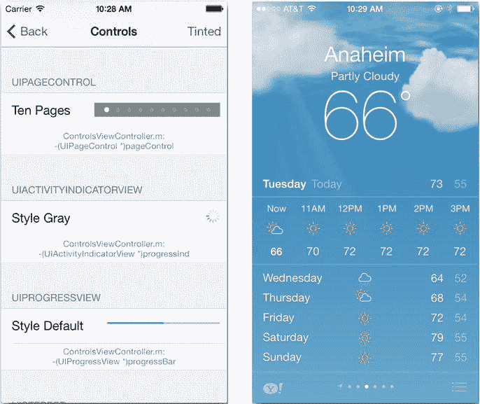

# 页面控件

页面控件（`UIPageControl`）对象，如图 10-6 所示，可视为一种离散的滑块控件。顾名思义，它用于指示用户在少量（最多 20 个）页面或项目中的当前位置。苹果的天气应用便使用它来指示用户当前正在查看的位置，如图 10-6 右侧所示。

**图 10-6.** 页面控件与天气应用

`UIPageControl`的整型属性`currentPage`表示其当前值，而`numberOfPages`属性则决定了前者的取值范围以及显示圆点的数量。其外观可通过以下属性进行微调：

-   `pageIndicatorTintColor`：设置页面指示器的颜色。
-   `hidesForSinglePage`：若设为`YES`，当只有一页时（即`numberOfPages <= 1`），该控件将不绘制任何内容。

在页面控件的当前页面左侧或右侧点击，会使`currentPage`属性值减一或加一（即向前或向后翻一页），并发送一个“值已更改”事件。

