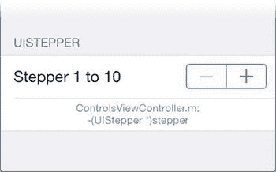

# 步进器

步进器（`UIStepper`）拥有`UIButton`的外观和`UIPageControl`的核心功能，如图 10-7 所示。它并排显示两个按钮。当用户需要逐步增加或减少某个值（具体增减什么由你决定，步进器本身不显示数值）时，可使用步进器。

**图 10-7.** 步进器

与滑块类似，步进器的`minimumValue`和`maximumValue`属性用于设定其`value`属性的范围。`stepValue`属性则定义了“一步”的具体含义。例如，表 10-1 展示了一个取值范围在`1.0`到`6.0`之间、共 11 个可能取值的步进器所需设置的属性值。

**表 10-1.** 具有 11 个可能取值（含 1.0 至 6.0）的步进器的属性值

| 属性 | 值 |
| --- | --- |
| `minimumValue` | `1.0` |
| `maximumValue` | `6.0` |
| `stepValue` | `0.5` |

步进器的视觉外观可通过设置递增、递减和背景图像进行自定义，其设置方式与按钮相同。此外，还有一个类似`UIButton`的`tintColor`属性。

每当用户点击递增或递减按钮时，步进器都会发送一个“值已更改”的操作事件。有以下三个属性可以改变这一行为：

-   `continuous`：`continuous`属性的工作方式与滑块中的完全相同。
-   `autorepeat`：将`autorepeat`设置为`YES`，允许用户通过长按其中一个按钮来持续改变（一次一步）数值。
-   `wraps`：此属性允许数值在范围内“循环”。以表 10-1 为例，当值已经是`6.0`时点击加号，数值会变回`1.0`。当`wraps`为`YES`时，数值达到范围起点或终点时，按钮不会失效。

