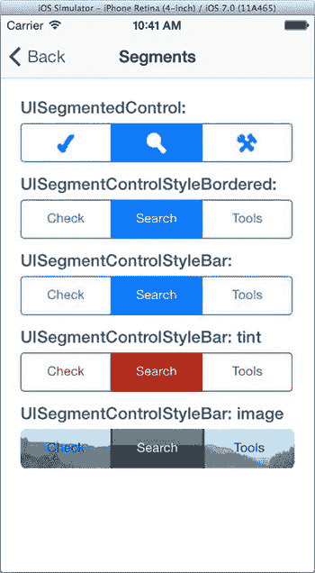

# 分段控件

`UISegmentedControl`类与步进器密切相关。分段控件显示多个分段，每个分段作为一个选择按钮，如图 10-8 所示。当希望用户在少量互斥选项中进行选择时，可使用分段控件。



**图 10-8.** 分段控件

分段控件有四种风格：普通、带边框、工具栏样式和带边框样式。`UICatalog`示例应用演示了前三种风格。工具栏样式和带边框样式可以通过设置`tintColor`属性来着色，这在`UICatalog`中也有演示。

要使用分段控件，首先需要通过设置`numberOfSegments`属性来告知其分段的个数。然后，你可以使用以下方法之一，将每个分段的标签设置为字符串标题或图像：

```
- (void)setTitle:(NSString *)title forSegmentAtIndex:(NSUInteger)segment
- (void)setImage:(UIImage *)image forSegmentAtIndex:(NSUInteger)segment
```

或者，你也可以选择逐个插入（或移除）分段。使用这些方法时，你可以选择让视图为更改添加动画效果，滑动并调整其他分段的大小以腾出空间：

```
- (void)insertSegmentWithTitle:(NSString *)title atIndex:(NSUInteger)segment animated:(BOOL)animated
- (void)insertSegmentWithImage:(UIImage *)image atIndex:(NSUInteger)segment animated:(BOOL)animated
```

当用户更改分段控件时，它会发送一个“值已更改”事件（`UIControlEventValueChanged`）。其`selectedSegmentIndex`属性用于告知哪个分段被选中，或可用于更改选中状态。特殊值`UISegmentedControlNoSegment`表示没有分段被选中。

通常情况下，分段控件中的按钮具有“粘滞”特性——它们会保持按下状态以指示当前选中的分段。如果你将`momentary`属性设置为`YES`，按钮将不会保持按下状态，并且当用户抬起手指时，`selectedSegmentIndex`会恢复为`UISegmentedControlNoSegment`。

