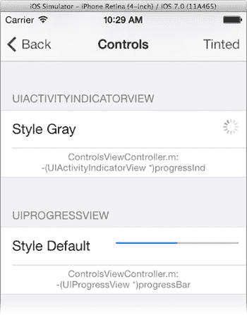

# 进度指示器

iOS 提供了两个进度指示器：`UIActivityIndicatorView`和`UIProgressView`。它们在耗时操作期间为用户提供反馈，或用于显示相对数量（例如已使用的存储空间），如图 10-9 所示。使用它们可以让用户知道你的应用正在努力工作；他们应该保持冷静，坐在座位上，并系好安全带。

**图 10-9.** 活动指示器与进度条

`UIActivityIndicatorView`通常被称为“旋转齿轮”或“菊花转”。当空间有限或操作持续时间不确定或未知时，可以使用它。有三种旋转风格可供选择：小灰色（`UIActivityIndicatorViewStyleGray`）、小白色（`UIActivityIndicatorViewStyleWhite`）和大白色（`UIActivityIndicatorViewStyleWhiteLarge`）。

使用旋转齿轮很简单。向其发送`-startAnimating`消息即可开始旋转，发送`-stopAnimating`消息即可停止。其`hidesWhenStopped`和`color`属性意义自明。

第二个指示器是进度条（`UIProgressView`）。它呈现一个进度指示器，任何曾耗费生命等待电脑完成某些任务的人都对它很熟悉。该视图有两种外观：

-   `UIProgressViewStyleDefault`：常规样式的进度条。
-   `UIProgressViewStyleBar`：专为工具栏设计的样式。

你通过定期将其`progress`属性设置为`0`（空）到`1`（满）之间的值来控制视图。设置`progress`属性会使指示器直接跳转到该位置。通过发送`-setProgress:animated:`消息，你可以让指示器平滑地动画过渡到新设置，这对于大幅度变化来说不那么突兀。

使用`trackImage`或`trackTintColor`属性自定义视图未完成部分的外观，使用`progressImage`和`progressTintColor`属性调整已完成部分。`UICatalog`示例应用的工具栏中有一个“Tint”按钮，演示了当`progressTintColor`和`trackTintColor`设置为蓝色时的效果。

