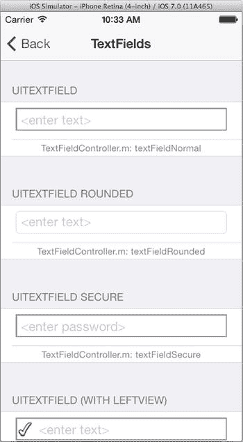

# 文本视图

文本视图有三种类型：标签、文本字段和文本视图。标签是最简单的，用于在界面中放置单行文本，通常位于其他字段或视图旁边以说明其用途，这也是其名称的由来。文本字段是一个通用输入字段，为单行文本提供功能全面的编辑能力。文本视图则可以显示和编辑多行文本。让我们从简单的开始讲起。

### 标签

你在 iOS 中随处可见标签（请参见本书中几乎所有图示），并且在你的项目中也多次使用过它们。无论出于何种目的，只要你只想显示一些文本，就该使用`UILabel`对象。通过在 Interface Builder 中设置标签的文本，并将标签对象作为标签使用，而无需建立连接。如果将标签连接到插座变量，你的控制器就能更新文本，就像你在 ColorModel 应用中所做的那样。

标签有一些可选属性，可以让你改变文本字符串的显示方式，如表 10-2 所示。

表 10-2. 标签显示属性

| 属性 | 描述 |
| --- | --- |
| `numberOfLines` | 标签将显示的最大行数，通常为`1`。设置为`0`可根据需要显示任意多行。 |
| `font` | 文本的字体（字型、大小和样式） |
| `textColor` | 用于绘制文本的颜色 |
| `textAlignment` | 可选值：左对齐、居中、右对齐、两端对齐或自然对齐。自然对齐采用字体的原生对齐方式。 |
| `attributedText` | 绘制属性字符串，而非简单的文本属性。用于显示混合了不同字体、大小、样式和颜色的文本。字符串中的文本属性会覆盖其他文本样式属性（`font`、`textColor`、`shadowOffset`等）。 |
| `lineBreakMode` | 决定如何让过长的字符串适应视图的可用空间。 |
| `adjustsFontSizeToFitWidth` | 作为缩短字符串的替代方案，它会使文本变小，以便整个字符串能够适应。 |
| `adjustLetterSpacingToFitWidth` | 让字符串适应给定空间的第三种选项。 |

如果你打算显示可变数量的文本，请注意那些控制字符串过大无法适应视图时如何处理文本的属性。首先是`numberOfLines`和`lineBreakMode`属性。换行模式控制字符串如何在多行中拆分。对于多行标签（`numberOfLines != 1`），可选择在最近字符处换行（`NSLineBreakByCharWrapping`）或在最近单词处换行（`NSLineBreakByWordWrapping`）。

对于单行标签（`numberOfLines == 1`），无法适应视图的文本要么被直接截断（`NSLineBreakByClipping`），要么将字符串开头（`NSLineBreakByTruncatingHead`）、中间（`NSLineBreakByTruncatingMiddle`）或末尾（`NSLineBreakByTruncatingTail`）的一部分替换为省略号（`...`）字符。

让文本适应视图的另一种方法是设置`adjustsFontSizeToFitWidth`或`adjustLetterSpacingToFitWidth`属性为`YES`。这些选项会导致词间距或字体大小——你也可以同时设置两者——被缩小，试图让字符串适应可用空间。词间距绝不会缩小为零，字体大小也绝不会低于`minimumScaleFactor`属性。如果文本仍然无法适应，则会应用`lineBreakMode`。

> **警告**  
> 请不要为多行（`numberOfLines != 1`）标签设置`adjustsFontSizeToFitWidth`或`adjustsLetterSpacingToFitWidth`，也不要与多行换行模式（字符或单词换行）结合使用。这样做属于编程错误，视图的行为将不可预测。

### 文本字段

当你希望用户输入或编辑一行文本时，请使用文本字段（`UITextField`）。Shorty 应用使用文本字段来获取用户输入的 URL。

UICatalog 应用展示了四个文本字段，如图 10-10 所示。

图 10-10. 文本字段

我们从字段的外观开始。有四种基本样式可供选择，由`borderStyle`属性控制：

*   `UITextBorderStyleBezel`：用凿刻边框环绕字段，营造出字段内凹的视觉效果。
*   `UITextBorderStyleRoundedRect`：在字段周围绘制一个简单的圆角矩形。
*   `UITextBorderStyleLine`：在字段周围绘制一个细灰色矩形。
*   `UITextBorderStyleNone`：不绘制边框。

UICatalog 应用仅演示了凿刻边框和圆角矩形样式，但另外两种不难想象。你可以通过将背景属性设置为你自己的`UIImage`来提供更引人注目的外观。背景属性会覆盖`borderStyle`属性。换句话说，你无法为凿刻边框提供背景图像；如果你想要那种外观，你的图像需要包含凿刻边框。

`placeholder`属性在字段为空时显示一个字符串（浅灰色）。使用此属性来提示用户（例如“在此输入您的姓名”），或者可能显示一个默认值。如果你希望在用户开始输入前自动清除字段中的文本，请将`clearsOnBeginEditing`设置为`YES`。

字段中文本的字体、大小、样式和颜色可以通过设置`font`和`textColor`属性来控制，或者使用属性文本字符串。后者要复杂得多，也要灵活得多。

你还可以在三个不同位置插入附属视图。使用这些可以添加额外的控件或指示器，例如弹出字段选项集的按钮，或进度指示器。附属视图属性包括：

*   `leftView` 和 `leftViewMode`
*   `rightView` 和 `rightViewMode`
*   `inputAccessoryView`

左视图和右视图可以是任何能放入文本字段的`UIView`对象。UICatalog 应用通过向文本字段添加`UIImageView`来演示这一点。右视图和左视图的显示由其对应的`rightViewMode`和`leftViewMode`属性控制。每个都可以设置为：从不显示视图、始终显示视图、仅在编辑时显示视图，或仅在不编辑时显示视图。

输入辅助视图并不附加到文本字段上。相反，它附加到用户开始编辑时出现的虚拟键盘顶部。你可以使用输入辅助视图来添加特殊控件、预设、选项等。

文本字段会发送各种事件。最有用的是“编辑结束时退出”事件（`UIControlEventEditingDidEndOnExit`），当用户停止编辑字段时发送；以及“值已更改”事件（`UIControlEventValueChanged`），每当字段中的文本被修改时发送。你在 MyStuff 应用中将操作连接到了这两个事件。要接收更多与编辑相关的消息，并对编辑施加一些控制，请为文本字段创建一个委托对象（`UITextFieldDelegate`）。委托会在编辑开始和结束时收到消息，并且还可以控制是否允许开始编辑、是否允许结束编辑，或是否允许进行特定的更改。

