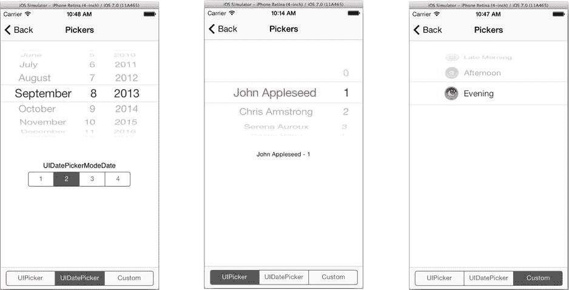
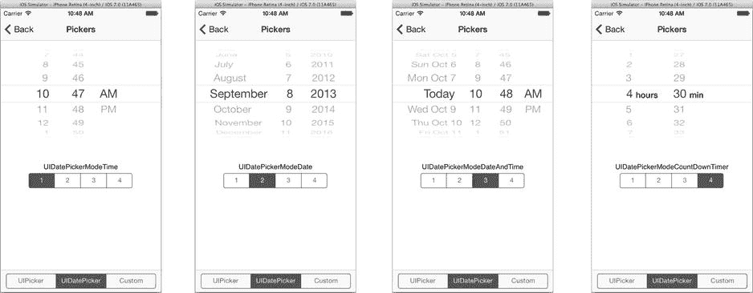

# 选择器

在 iOS 中，“选择器”是一种用户界面，让用户从预定义的集合中进行选择。你在 MyStuff 中使用了**图像选择器**从照片库中选取图片，在 DrumDub 中使用了**媒体选择器**从 iTunes 库中选取歌曲。这些都是占据整个用户体验的大型界面。

iOS 还提供了几个较小的选择器视图对象：有专门用于选择日期和时间的`UIDatePicker`，以及可自定义的`UIPickerView`，用于处理其他所有选择。两者都显示一个包含多个垂直“滚轮”的视图，用户通过旋转滚轮来选择所需的值或项目，如图 10-11 所示。



图 10-11. 选择器视图

## 日期选择器

当你希望用户选择日期、时间或时长时，请使用日期选择器。日期选择器有四种不同的界面，由其`datePickerMode`属性控制。该属性可设置为表 10-4 中列出的四个值之一。这四种不同的模式如图 10-12 所示。



图 10-12. 日期选择器模式

表 10-4. 日期选择器模式

| 模式 | 说明 |
| --- | --- |
| `UIDatePickerModeTime` | 选择一天中的某个时间 |
| `UIDatePickerModeDate` | 选择一个日历日期 |
| `UIDatePickerModeDateAndTime` | 选择日期和时间 |
| `UIDatePickerModeCountDownTimer` | 选择时长（小时和分钟） |

选择器的`date`属性报告用户已选定的值。设置该属性会改变视图中的日期/时间。如果你想设置`date`并让“滚轮”旋转到新位置，请发送`-setDate:animated:`消息。使用纯日期界面时，日期属性中的时间部分为`0:00`。同样，使用纯时间或时长界面时，日期属性中的日历日是无效的。

如果你想限制用户可选值的范围，请设置`minimumDate`和/或`maximumDate`属性。例如，要强制用户选择未来的某一天，可将`minimumDate`设置为明天。

你还可以通过`minuteInterval`属性减少时间选择的粒度。当设置为`1`时，用户能够以 1 分钟为增量选择任何时间或时长（2:30、2:31、2:32 等）。将`minuteInterval`设置为`5`会将用户的选择限制为 5 分钟间隔（2:30、2:35、2:40、2:45 等）。

> **注意：** `minuteInterval`的值必须能整除 60，且不能大于 30。

如果你计划使用日期选择器，并且界面会随时间推移让选择器保持可见，Apple 建议实时更新选择器。例如，如果你的界面使用时长选择器和开始按钮，按下开始按钮可能会触发应用中的某个计时器开始倒计时。在此期间，你的应用应定期更新选择器，使其随时间倒计时至零而缓慢（每分钟一次）变化。


### 任意选择器

如果你不需要选择日期或时间呢？如果你需要选择冰淇淋口味、汽车型号或宿敌呢？`UIPicker`对象就是一个通用的选择器视图。它的外观和功能与日期选择器类似，但区别在于你可以自定义滚轮及其内容（参见图 10-11）。

`UIPicker`使用委托和数据源机制，这与表视图（第 5 章）惊人地相似。`UIPicker`需要委托对象（`UIPickerDelegate`）和数据源对象（`UIPickerDataSource`）。选择器的数据源决定了滚轮的数量（称为组件）以及每个滚轮上的选项数量（称为行）。委托对象则提供每个选项的标签。至少，你必须实现以下`UIPickerDataSource`方法：

```objc
- (NSInteger)numberOfComponentsInPickerView:(UIPickerView *)pickerView

- (NSInteger)pickerView:(UIPickerView *)pickerView numberOfRowsInComponent:(NSInteger)component
```

以及以下任一`UIPickerDelegate`方法：

```objc
- (NSString *)pickerView:(UIPickerView *)pickerView titleForRow:(NSInteger)row forComponent:(NSInteger)component

- (NSAttributedString *)pickerView:(UIPickerView *)pickerView attributedTitleForRow:(NSInteger)row forComponent:(NSInteger)component

- (UIView *)pickerView:(UIPickerView *)pickerView viewForRow:(NSInteger)row forComponent:(NSInteger)component reusingView:(UIView *)view
```

> **提示**：大多数情况下，单个对象同时作为选择器的委托和数据源，因此两个协议之间的方法划分并不重要。

第一个数据源方法告诉选择器有多少个滚轮。第二个方法会针对每个滚轮调用一次，返回该滚轮中的行数。

最后（与表视图数据源非常类似），委托方法返回每个滚轮中每行的标签。根据你希望每行内容的复杂程度，你可以选择实现以下三种方法之一：

- 实现`-pickerView:titleForRow:forComponent:`以显示纯文本标签。该方法返回每行的简单字符串值，这是最常见的方式。参见图 10-11 中间部分。
- 实现`-pickerView:attributedTitleForRow:forComponent:`以显示包含特殊字体或样式的标签。该方法返回每行的属性字符串。UICatalog 中没有包含属性字符串的示例，但这意味着标签可以混合多种字体、大小和样式。
- 实现`-pickerView:viewForRow:forComponent:reusingView:`以在行中显示任意内容。该方法返回一个`UIView`对象，用于绘制该行。参见图 10-11 右侧部分。

最后一种方法最类似于表视图对单元格对象的使用。对于选择器，你可以为每一行提供不同的`UIView`对象，或者反复使用单个`UIView`对象。与表视图不同，这里没有行单元格对象缓存。相反，上一次返回的`UIView`对象会在下一次发送`-pickerView:viewForRow:forComponent:reusingView:`时传回给你的委托。如果你要重用单个`UIView`对象，则修改该视图并再次返回。如果不重用（或者`view`参数为`nil`），则返回一个新的视图对象。

如果你想控制每个滚轮的宽度或行高，可以分别实现可选的`-pickerView:widthForComponent:`或`-pickerView:rowHeightForComponent:`方法。

查看 UICatalog 应用程序中实现简单选择器的代码（图 10-11 中间部分），你可以在`PickerViewController.m`文件中找到它。使用自定义视图对象实现选择器的代码（图 10-11 右侧部分）位于`CustomPickerDataSource.m`文件中。用作每行橡皮图章的视图对象在`CustomView.m`中定义。

`UIPickerView`对象不是控件对象，它们不是`UIControl`的子类，也不会发送动作消息。相反，当用户更改某个滚轮时，选择器的委托会收到`-pickerView:didSelectRow:inComponent:`消息。

### 图像视图

你已经使用过足够多的图像视图，对其用法已相当熟悉。不过，仍有几个属性值得一提。第一个是`contentMode`。此属性控制图像（可能与视图大小不同）的排列方式。选项列于表 10-5 中。

**表 10-5. 视图内容模式**

| 模式 | 描述 |
| --- | --- |
| `UIViewContentModeScaleToFill` | 拉伸或压缩图像以完全填充视图。如果视图的宽高比与图像不同，可能会使图像变形。 |
| `UIViewContentModeScaleAspectFit` | 缩放图像（不使其变形）以恰好适配视图内部。视图的某些部分可能不包含任何图像（类似宽银幕模式）。 |
| `UIViewContentModeScaleAspectFill` | 缩放图像（不使其变形）以完全填充视图。图像的部分内容可能会被裁剪。 |
| `UIViewContentModeCenter` | 居中显示图像，不进行缩放。 |
| `UIViewContentModeTop`、`UIViewContentModeBottom`、`UIViewContentModeLeft` 或 `UIViewContentModeRight` | 图像一条边的中点与视图的对应边对齐。图像不缩放。在其他三个方向上，图像可能未填充或会被裁剪。 |
| `UIViewContentModeTopLeft`、`UIViewContentModeTopRight`、`UIViewContentModeBottomLeft` 或 `UIViewContentModeBottomRight` | 图像的一个角与视图的同一角对齐。图像不缩放。图像可能未完全填充视图，若超出则会被裁剪。 |

> **注意**：`contentMode`属性实际上是在`UIView`类中定义的，但它对`UIImageView`尤其重要。

`UIImageView`还有一个独特的功能：它可以快速（如同翻页动画或超短视频）或慢速（如同幻灯片）显示一系列图像。将你想要显示的图像放入数组（`NSArray`），并用该数组设置`animationImages`属性。设置`animationDuration`属性，并可选择设置`animationRepeatCount`来控制每帧的速度以及整个序列的播放次数（将`animationRepeatCount`设置为`0`可无限循环）。

设置完成后，向该视图发送`-startAnimation`消息开始播放，发送`-stopAnimation`消息停止播放。演示此功能的代码位于 UICatalog 项目的`ImagesViewController.m`文件中。

### 分组表格

第 5 章提到，你可以创建分组样式的表格视图，就像“设置”应用中使用的那些。不过，我并未实际演示如何实现。虽然你已经掌握了所有基础知识，但如果你想要一个具体的例子，不妨看看 UICatalog 项目。大多数示例视图（按钮、控件、文本字段和分段控件）都以分组表格视图的形式呈现。每个分组代表一个示例。

先以按钮示例为例。它的视图控制器是`ButtonsViewController`类，它是`UITableViewController`的子类。表格视图控制器是专门用于管理表格视图的`UIViewController`。`UITableViewController`同时充当`UITableViewDelegate`和`UITableViewDataSource`。找到定义表格内容的这些委托方法，看看它们的工作方式：

```objc
- (NSInteger)numberOfSectionsInTableView:(UITableView *)tableView

- (NSString *)tableView:(UITableView *)tableView titleForHeaderInSection:(NSInteger)section

- (NSInteger)tableView:(UITableView *)tableView numberOfRowsInSection:(NSInteger)section

- (UITableViewCell *)tableView:(UITableView *)tableView cellForRowAtIndexPath:(NSIndexPath *)indexPath
```


