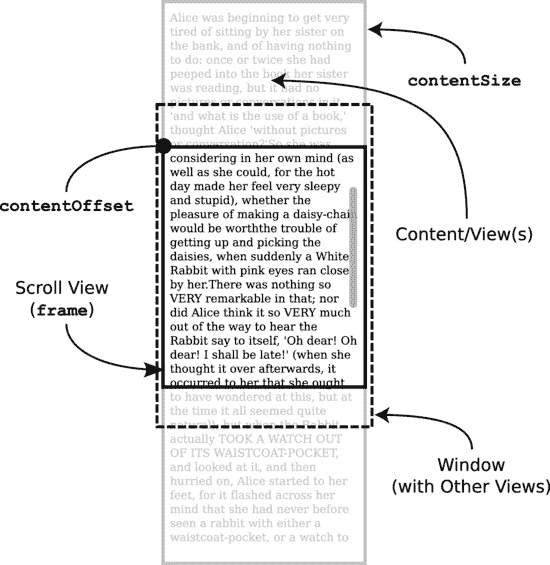
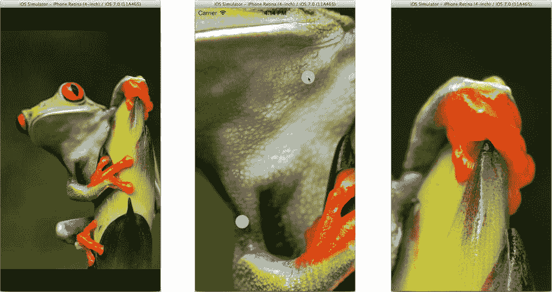

# 你从未见过的视图

以上内容涵盖了 iOS 中大部分重要的视图对象。我将在第 12 章中稍微介绍工具栏，并在第 11 章中更深入地讨论 `UIView`。但我还想提一个非常特殊的视图——它使用频繁，但你却从未亲眼见过。

它就是 `UIScrollView` 类。滚动视图为你的界面增添了动态滚动的能力。你永远看不到滚动视图本身，你看到的是它产生的效果。滚动视图的工作原理是在一个较小的视图中展示一个较大的视图。这种效果就像拥有一个通向那个较大视图的窗口。当你在窗口内拖动时，你实际上是在"滑动"窗口背后的视图，以便看到它的不同部分，如图 10-13 所示。

图 10-13. 滚动视图的概念布局

将滚动视图理解为"合二为一"的两个视图，是理解它最简单的方式。对于大多数视图对象来说，其内容的大小（称为 bounds）和它在界面中占据的大小（称为 frame）是相同的。因此，一个 30x100 像素的视图（例如按钮）会在界面中占据一个 30x100 像素的区域。

滚动视图打破了这种关系。滚动视图有一个特殊的 `contentSize` 属性，它与自身的 frame 大小是分离的。它的 frame 变成了你在界面中看到的"窗口"。而 `contentSize` 定义了视图的逻辑大小，只有其中的一部分通过窗口可见。

`contentOffset` 属性决定了具体哪一部分可见。这个属性表示内容区域中出现在 frame 左上角（即用户可见部分）的点。`contentOffset` 初始值为 `0,0`，这使得内容的左上角位于 frame 的左上角。随着 `contentOffset` 向下移动，内容看起来向上滚动，同时保持 `contentOffset` 点始终位于 frame 的左上角。

表格视图、网页视图和文本视图都提供了滚动功能，并且它们都是 `UIScrollView` 的子类。你可以自己创建 `UIScrollView` 的子类，以生成支持滚动的自定义视图，也可以通过简单地将你喜欢的任何子视图填充到其内容视图中，来独立使用一个 `UIScrollView` 对象。你甚至可以在一个滚动视图内部再放一个滚动视图；这听起来有点奇怪，但 iOS 的滚动视图编程指南中确实有关于如何实现这一点的说明。

要开始学习滚动视图，PhotoScroller 示例项目是个绝佳起点。在 Xcode 的文档和 API 参考中搜索 PhotoScroller 示例代码项目，然后点击"打开项目"按钮。PhotoScroller 项目定义了一个 `UIScrollView` 的子类，用于显示、平移和缩放图像。该项目演示了滚动视图三大主要能力中的两项：

- 在较小视图内滚动较大的内容视图
- 捏合与缩放内容视图
- 按"页面"滚动

第一种是其基本功能。滚动视图最常用于此能力，这包括表格视图、网页视图和文本视图。要以这种方式使用滚动视图，你无需创建子类或使用委托。只需将你想要显示的视图填充并设置好内容视图的大小，滚动视图就会让用户自由拖动它。

滚动视图的第二种能力是对其内容视图进行捏合与缩放，因此它不仅能滚动，还能放大和缩小内容，如图 10-14 所示。此功能需要使用滚动视图委托（`UIScrollViewDelegate`）对象。在 PhotoScroll 项目中，自定义的 `ImageScrollView` 是 `UIScrollView` 的子类，同时也是它自己的委托——这是一种完全合理（尽管有点不寻常）的设计。`UIScrollView` 会为你处理触摸事件，并负责大部分平移和缩放的细节。

图 10-14. PhotoScroller 应用

你还可以通过编程方式滚动视图，只需将其 `contentOffset` 属性设置到内容视图中的任意位置即可。如果你希望视图以动画方式跳转至新位置，可以发送 `-setContentOffset:animate:` 消息给它。

## 滚动视图与键盘

滚动视图可以包含文本字段——通常是间接实现的，例如在表格视图（如你所知，它本身也是一个滚动视图）中放置一个文本字段。当键盘出现时，它可能会遮挡住用户想要编辑的文本字段。解决方案是让滚动视图向上滚动，使得文本字段在键盘上方可见。

为此，你的控制器需要监听键盘通知（例如 `UIKeyboardDidShowNotification`）。这些通知包含了虚拟键盘在屏幕上的坐标信息。你可以利用这些信息来判断键盘是否遮挡了你的文本字段。如果是，则向滚动视图发送一条 `-setContentOffset:animate:` 消息，使文本字段滚动到虚拟键盘上方的位置。

关于此机制的具体描述，请参阅 iOS 的文本、网页与编辑编程指南，你可以在 Xcode 的文档中找到它。请查找"管理键盘"章节中那个恰如其分的标题："移动位于键盘下方的内容"。

PhotoScroller 项目还演示了一项名为"平铺"的高级技术。在第 5 章的开头，我解释过 iOS 设备没有足够的内存或 CPU 能力为表格创建数千个独立的行对象。相反，它只在用户滚动列表时，绘制表格中用户可见的部分。

一个异常大的内容视图也可能面临同样的问题。PhotoScroller 项目演示了如何动态地仅准备那些当前通过滚动视图"窗口"可见的视图对象。而表格视图（如你所记，它基于 `UIScrollView`）已经为你做了这件事，它只准备表格中那些可见行的视图对象。

滚动视图一个不太常见的用途是按"页面"浏览内容。这通过将 `pagingEnabled` 属性设置为 `YES` 来实现。当你这样做时，滚动视图会强制内容视图（确切地说是它的 `contentOffset` 属性）以离散的距离移动，这些距离是其 frame 大小的整数倍。从概念上讲，它将你的内容视图划分成一个网格（大小与窗口完全一致），任何滚动最终都会停留在其中一个分段上。有一个名为 PageControl 的示例项目演示了此功能。

> **注意**
> PhotoScroller 项目允许你通过滑动在图像间切换，但它并没有使用 `UIScrollView` 的分页功能。相反，它使用了 `UIPageViewController`。你将在第 12 章中使用 `UIPageViewController` 来创建类似的界面。

滚动视图的高级使用对胆小鬼来说并不合适。这确实可能非常复杂，但正是这些复杂功能造就了真正酷炫的应用。如今已成为 iOS 应用主流的"下拉刷新"手势，完全是借助滚动视图和滚动视图委托实现的。如果你在表格视图中需要此功能，大部分工作已经为你完成：创建一个 `UIRefreshControl` 对象，并将其连接到表格视图控制器的 `refreshControl` 属性。现在，用户就可以通过向下拖动来刷新表格了。要深入探究滚动视图的强大功能，请从 iOS 的滚动视图编程指南开始。

## 摘要

你对 iOS 这门“语言”的掌握正在日益精进。你从 iOS 的语法和句法起步，学习了如何创建对象、连接对象以及发送消息。在这一章中，你拓展了自己的词汇量，掌握了大量可添加并自定义的视图与控制对象。你还了解了分组表格的制作方式，并一窥滚动效果背后的魔法。在此过程中，你学会了如何下载示例代码并解锁其中的奥秘。

使用预制的视图和控制对象，你可以走得很远。但总有一些限制，到了某个时刻，你会想要一个尚未有人创建过的视图。创建自己的视图，正是你旅程的下一步，也是本书下一章的内容。

