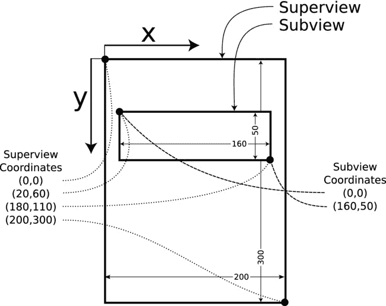

# 11. 为我画一幅画

## 摘要

你已经到达了掌握 iOS 开发的一个关键节点。你在应用中添加现有视图对象方面已经积累了相当丰富的经验。你已经让它们显示数据，将它们连接到你的自定义控制器逻辑，并自定义了它们的外观与感受。但你仍然受限于苹果为你撰写的视图类。没有什么能替代创建你自己的视图对象——一个能够绘制出他人未曾想象过的东西的对象。

好吧，这并不完全正确。你确实创建过自定义视图对象，但在这两次实践中，我都忽略了它们的工作原理，而是在旁边附上了一条小注释：“请忽略幕后的视图；一切将在第 11 章中解释。”欢迎来到第 11 章！在本章中，你将（更多地）了解到：

* 创建视图子类
* 视图几何
* 视图的绘制方式与时机
* Core Graphics
* 贝塞尔路径
* 动画
* 手势识别器
* 位图与图像

本章会涉及一些技术细节，但我认为你已经准备好了。

## 创建自定义视图类

你可以通过继承 `UIView` 或 `UIControl` 来创建自定义视图，这取决于你的目标是创建一个显示对象，还是类似控件（如一种新型开关）的东西。在本章中，你将只继承 `UIView`。

> **警告**  
> 不要为了“摆弄”具体视图类（如 `UIButton` 或 `UISwitch`）的功能而去继承它们。这是灾难的根源。它们的内部工作机制并非公开，并且经常随 iOS 版本而改变，这意味着你的类可能在不久的将来就无法工作。那些设计用于被继承的视图类（如 `UIControl`）都有清晰的文档说明，通常会在文档中包含“子类化说明”一节。

要创建你自己的视图类，你需要理解三件事：

* 视图坐标系
* 用户界面更新事件
* 如何在 Core Graphics 上下文中进行绘制

让我们从顶点开始——字面意义上的顶点。

### 视图坐标

设备的屏幕、窗口和视图都拥有一个图形坐标系。这个坐标系确立了你在设备上看到的一切（屏幕、窗口、视图、图像和形状）的位置和大小。每个视图对象都有其自己的坐标系。坐标系统的原点位于其左上角，坐标为 `(0,0)`，如图 11-1 所示。

**图 11-1.** 图形坐标系

X 坐标向右递增，Y 坐标向下递增。Y 轴与你上学时学到的笛卡尔坐标系，或者你可能在业余时间阅读几何书时了解到的坐标系是上下颠倒的。对于计算机程序而言，这种布局更为方便；大多数内容都从左上角开始“流动”，因此从左上角进行计算通常比从左下角更简单。

> **注意**  
> 如果你做过任何 OS X 编程，你会发现 iOS 和 OS X 的视图对象有很多相似之处。然而，从 OS X 的角度来看，iOS 中不存在“翻转坐标”——它们始终是翻转的。

iOS 中有四种用于描述坐标、位置、大小和区域的关键变量类型，均列于表 11-1 中。

**表 11-1.** 坐标值类型

| 类型 | 描述 |
| --- | --- |
| `CGFloat` | 基本的标量值。`CGFloat` 是浮点类型，用于表示单个坐标或距离。 |
| `CGPoint` | 一对 `CGFloat` 值，用于指定坐标系中的一个点 (`x`,`y`)。 |
| `CGSize` | 一对 `CGFloat` 值，用于描述某物体的尺寸 (`width`,`height`)。 |
| `CGRect` | 由一个点 (`CGPoint`) 和一个尺寸 (`CGSize`) 组合而成，共同描述一个矩形区域。 |

