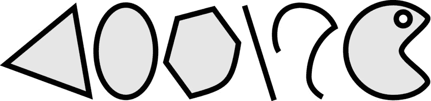

# Frame 与 Bounds

视图对象有两个矩形（`CGRect`）属性：`bounds` 和 `frame`。`bounds` 属性描述了对象自身的坐标系。视图的所有图形内容（包括任何子视图）都使用这个坐标系。需要理解的关键是，视图内容的所有绘制操作都由该视图本身执行，并且使用的是视图自身的坐标系——通常被称为其本地坐标。

在父视图中移动视图并不会改变视图自身的坐标系。视图内的所有图形相对于该视图对象的原点（左上角）保持不变。在图 11-1 中，子视图宽 160 像素，高 50 像素。因此，它的 bounds 矩形为 `((0,0),(160,50))`；其原点 (x,y) 为 `(0,0)`，尺寸 (width,height) 为 `(160,50)`。当子视图绘制自身时，它是在该矩形范围内进行绘制的。

`frame` 属性则在其父视图的坐标系中描述该视图。换句话说，frame 是子视图在另一个视图中的位置——通常被称为其父视图坐标。在图 11-1 中，子视图的原点是 `(20,60)`。该视图的尺寸为 `(160,50)`，因此其 frame 为 `((20,60),(160,50))`。如果视图向下移动 10 像素，其 frame 将变为 `((20,70),(160,50))`。视图绘制的一切内容都会向下移动 10 像素，但这不会改变视图的 `bounds` 或视图内部绘制内容的相对坐标。

`bounds` 和 `frame` 的尺寸是相互关联的。改变 `frame` 的尺寸会改变 `bounds` 的尺寸，反之亦然。如果将图 11-1 中子视图的 `frame` 宽度减少 60 像素，其 frame 将变为 `((20,60),(100,50))`。这一改变会改变其 `bounds`，使其变为 `((0,0),(100,50))`。类似地，如果将 `bounds` 从 `((0,0),(160,50))` 改为 `((0,0),(100,40))`，则 `frame` 会自动变为 `((20,60),(100,40))`。

注意

“frame 的尺寸始终等于 bounds 的尺寸”这条规则有几个例外。你已经遇到了其中一个例外：滚动视图。滚动视图内容（`bounds`）的尺寸由其独立于 frame 尺寸的 `contentSize` 属性控制，后者决定屏幕上显示的部分。其他例外情况发生在应用变换时，我稍后会讨论。

`UIView` 还提供了一个合成的 `center` 属性。该属性返回视图 `frame` 矩形的中心点。从技术上讲，`center` 始终等于 `(CGRectGetMidX(frame),CGRectGetMidY(frame))`。如果你更改 `center` 属性，视图的 `frame` 将会移动，使其中心对准该点。`center` 属性使得在无需调整子视图尺寸的情况下，既能移动又能居中子视图变得简单。

## 在坐标系之间转换

你可能需要一段时间——我也花了很长时间——才能掌握不同的坐标系，并学会何时使用 `bounds`、何时使用 `frame`，以及何时在它们之间进行转换。以下是一些需要记住的快速实用规则：

*   `bounds` 是视图的内部坐标：该视图内部所有内容的坐标。
*   `frame` 是视图的外部坐标：该视图在其父视图中的位置。

如果需要，有多种方法可以在视图的坐标系之间进行转换。表 11-2 列出了 `UIView` 方法中最常见的四种。举个例子，假设你在图 11-1 子视图的本地坐标系中拥有其右下角的坐标 `(160,50)`。如果你想知道同一点在父视图坐标系中的坐标，请发送消息 `[superview convertPoint:CGPointMake(160,50) fromView:subview]`。该语句将返回点 `(180,110)`，这是同一点，但位于父视图的坐标系中。

**表 11-2. UIView 中的坐标转换方法**

| UIView 方法 | 描述 |
| --- | --- |
| `-convertPoint:toView:` | 将接收器本地坐标系中的一个点转换到另一个视图的本地坐标系中对应的点。 |
| `-convertPoint:fromView:` | 将另一个视图坐标系中的一个点转换到接收器的本地坐标系中。 |
| `-convertRect:toView:` | 将接收器本地坐标系中的一个矩形转换到另一个视图的本地坐标系中对应的矩形。 |
| `-convertRect:fromView:` | 将另一个视图坐标系中的一个点转换到接收器的本地坐标系中。 |

此外，所有传递坐标的与事件相关的类，都会在特定视图的坐标系中报告这些坐标。例如，`UITouch` 类没有 `location` 属性。相反，它有一个 `-locationInView:` 方法，可以将触摸点转换为你正在操作的视图的本地坐标。

## 视图何时被绘制

在第四章中，你了解到 iOS 应用是事件驱动的程序。刷新用户界面（程序员术语，即在屏幕上绘制内容）也是由事件循环触发的。当视图有内容要绘制时，它并不会直接绘制。相反，它会记住要绘制的内容，然后请求一个绘制事件消息。当你的应用的事件循环决定更新显示时，它会向所有需要重绘的视图发送用户界面更新消息。因此，视图的绘制生命周期会重复以下模式：

更改要绘制的数据。  
向你的视图对象发送 `-setNeedsDisplay` 消息。这会将视图标记为需要重绘。  
当事件循环准备好更新显示时，你的视图将收到 `-drawRect:` 消息。

你很少需要向其他视图发送 `-setNeedsDisplay` 消息。大多数视图在发生需要重绘自身的变化时，都会自行发送该消息。例如，当你设置 `UILabel` 对象的 text 属性时，标签对象会向自身发送 `-setNeedsDisplay`，以便新标签能够显示出来。类似地，如果视图以需要重绘自身的方式发生改变（例如被添加到新的父视图），它会自动接收到 `-setNeedsDisplay`。

但这并不意味着对视图的每一次更改都会触发另一个 `-drawRect:` 消息。当视图绘制自身时，结果图像会被 iOS 保存或缓存——就像拍快照一样。不影响该图像的更改，例如在屏幕上移动视图（不调整其大小），不会导致另一个 `-drawRect:` 消息；iOS 会简单地重用已有的视图快照。

注意

传递给 `-drawRect:` 方法的 `rect` 参数是视图中需要重绘的部分。大多数情况下，它与 `bounds` 相同，这意味着你需要重绘所有内容。在极少数情况下，它可能是一个更小的部分。大多数 `-drawRect:` 方法不太关注它，只会绘制整个视图。绘制超出所需内容并无大碍，但绝不能绘制少于所需的内容。如果你的绘制代码非常复杂且耗时，你可以尝试只更新 `rect` 参数指定的区域来节省时间。

所以现在你知道了视图何时以及为何要绘制自身，接下来你只需要知道如何绘制了。


### 绘制一个 `View`

当视图对象收到 `-drawRect:` 消息时，它必须绘制自身。简单来说，iOS 会准备一块“画布”，你的视图对象需要在这块画布上“作画”。最终完成的杰作会被 iOS 用来在屏幕上呈现你的视图——直到需要重新绘制为止。

你的“画布”是一个**核心图形上下文**（Core Graphics Context），也称为当前上下文，或简称为上下文。它本身不是一个对象，而是一个绘图环境，在你的对象收到 `-drawRect:` 消息之前就已经准备好了。当你的 `-drawRect:` 方法执行时，你的代码可以使用任何核心图形绘图例程，在已准备好的上下文中“作画”。该上下文在 `-drawRect:` 方法返回之前一直有效，之后便会消失。

> **警告**
>
> 你的视图的核心图形上下文仅在 iOS 调用你的 `-drawRect:` 方法时才存在。因此，你永远不应该向你的视图发送 `-drawRect:` 消息，也永远不应在 `-drawRect:` 方法之外使用任何核心图形绘图函数（“离屏绘制”除外，我将在本章末尾介绍）。

对于大多数面向对象的绘图方法，当前上下文是隐含的。也就是说，你执行某项绘制操作（`[myShape fill]`），`-fill` 方法就会在当前的上下文中绘制。如果你使用任何 C 语言的绘图函数，则需要获取当前上下文的引用，并将其作为调用的第一个参数传递，如下所示：

```
CGContextRef currentContextRef = UIGraphicsGetCurrentContext();
CGContextSetAlpha(currentContextRef,0.5f);
```

绘图的许多细节都由当前上下文的状态隐含决定。图形上下文状态包含了在该上下文中绘图时将使用的所有设置和属性，包括填充形状的颜色、线条的颜色、线条宽度、混合模式等等。

你无需为每个操作（比如画一条线）都指定所有这些变量，而是先为每个单独的属性设置好状态。假设你想绘制一个形状（`myShape`），用红色填充，并用黑色绘制其轮廓：

```
[redColor setFill];
[blackColor setStroke];
[myShape fill];
[myShape stroke];
```

`-fill` 消息会使用上下文的当前填充颜色，而 `-stroke` 则使用当前的描边颜色。这种设计使得使用相同或相似的参数绘制多个形状或效果时非常高效。

现在唯一剩下的问题是，你有哪些绘图工具可用。你最基本的绘制工具有：

* 简单的填充和描边
* 贝塞尔曲线（填充和描边）
* 图片

听起来不多，但综合起来，它们具有非凡的灵活性。让我们从最简单的开始，即填充函数。

### 填充函数与描边函数

核心图形框架包含一些用于用颜色填充上下文区域的函数。两个主要的函数是 `CGContextFillRect` 和 `CGContextFillEllipseInRect`。前者用当前的填充颜色填充一个矩形。后者则填充一个正好适合给定矩形内部的椭圆（如果矩形是正方形，则椭圆会变成圆形）。

`CGContextFillRect` 通常用于在绘制视图细节之前，先填充整个视图的背景。`-drawRect:` 方法以类似下面的方式开头是很常见的：

```
- (void)drawRect:(CGRect)rect
{
    CGContextRef context = UIGraphicsGetCurrentContext();
    [self.backgroundColor setFill];
    CGContextFillRect(context,rect);
}
```

这段代码首先获取当前的图形上下文（`CGContextFillRect` 调用需要用到它）。然后获取此视图的背景颜色（`self.backgroundColor`），并将该颜色设置为当前的填充颜色。接着，用该颜色填充视图。之后绘制的所有内容都将覆盖在用 `backgroundColor` 绘制的背景之上。

> **提示**
>
> 在核心图形上下文中绘图，很像在真实的画布上作画。每当你绘制一些东西时，你都是在覆盖之前绘制的内容。因此，就像绘画一样，你通常先会用一种中性色覆盖整个表面——艺术家称之为底色。然后，你在此基础上绘制不同的颜色和形状，直到完成所有绘制。

函数 `CGContextStrokeRect` 和 `CGContextStrokeEllipseInRect` 执行类似的功能，但它们不是填充矩形或椭圆的内部，而是使用当前的线条颜色、线条宽度和线条连接样式，在矩形或椭圆的轮廓上绘制一条线。描边是用于描述绘制线条动作的术语。

### 贝塞尔曲线

你会注意到，核心图形框架中几乎没有用于绘制非常简单的形状（例如线条）的函数。那么，又该如何处理你在 iOS 中随处可见的圆角矩形、三角形或任何其他形状呢？iOS 之神没有为你提供无数种绘制各种形状的函数，而是提供了一个近乎神奇的工​​具，让你能够绘制所有这些形状甚至更多：那就是贝塞尔曲线。

贝塞尔曲线以法国工程师皮埃尔·贝塞尔命名，可以表示直线或曲线的任意组合，如图 11-2 所示。它可以简单得像一个正方形，也可以复杂得如加拿大的海岸线。贝塞尔曲线可以是封闭的（圆形、三角形、饼图），也可以是开放的（一条线、一段弧、字母“W”）。



*图 11-2.* 贝塞尔曲线

你通过首先创建一个 `UIBezierPath` 对象来定义一条贝塞尔曲线。然后通过添加直线和曲线线段来构建路径。完成后，你可以使用该路径对象通过填充其内部、绘制其轮廓（描边）或同时进行这两种操作，在图形上下文中进行绘制。你可以根据需要重复使用同一个路径。

> **提示**
>
> 对于常见的形状，如正方形、矩形、圆形、椭圆、圆角矩形和弧线，`UIBezierPath` 类提供了类方法，可以用单个语句生成相应形状的贝塞尔曲线。

为了向你展示创建路径是多么容易，你将编写一个在视图中绘制贝塞尔曲线的应用程序。但在那之前，让我们简要谈谈视图内容的最后一个主要来源。

### 图片

图片就是一幅图画，不需要过多解释。从第二章开始，你就一直在使用图片（`UIImage`）对象。到目前为止，你一直将它们分配给为你绘制图片的 `UIImageView` 对象（和其他控件）中。但是，`UIImage` 对象也很容易绘制到你自己的视图上下文中。两个最常用的 `UIImage` 绘图方法是 `-drawAtPoint:` 和 `-drawInRect:`。第一个方法以原始大小、原点（左上角）位于给定坐标的方式，将图片绘制到你的上下文中。第二个方法将图片绘制到给定的矩形中，并根据需要缩放和拉伸图片。

当我说图片被“绘制”到你的图形上下文中时，我真正意思是它被复制了。图片是一个二维像素数组，而你的图形上下文画布也是一个二维像素数组。所以实际上，“绘制”一幅图片只不过是用图片中的像素覆盖视图中部分像素。例外情况是包含透明像素的图片，或者你使用了非典型的混合模式，这两点我稍后会提到。

在本章后面，我将在你已编写的一个应用程序基础上进行改造，详细讲解如何在自定义视图中创建、转换和绘制图片。但在此之前，让我们先绘制一些贝塞尔曲线。


