# Shapely

你将创建一个应用程序，该应用使用贝塞尔路径在自定义视图中绘制简单图形。通过多次迭代，你将扩展其功能以支持移动和调整大小的手势，并学习变换与动画——同时掌握大量 `UIView` 和贝塞尔路径的精华。应用设计简洁，如图 11-3 所示。

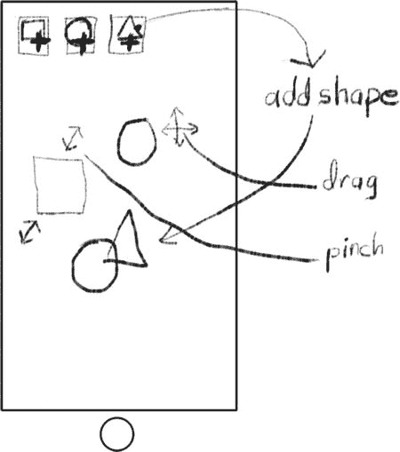

图 11-3. Shapely 应用设计

应用底部将有一行按钮，用于创建新图形。图形会出现在中间区域，你可以移动、调整大小和重新排列它们。首先创建一个新项目。在 Xcode 中：

- 基于**单视图应用**模板创建一个新项目。
- 将项目命名为 `Shapely`。
- 使用 `SY` 作为类前缀。
- 将设备设置为 `Universal`。

接下来需要创建自定义视图类。这一步你已操作多次。在项目导航器中选择 `Shapely` 组，然后选择 **New File...**（从文件菜单或右键/按住 Control 键点击该组）。然后：

- 从 iOS 组中选择 **Objective-C 类模板**。
- 将类命名为 `SYShapeView`。
- 使其继承自 `UIView`。
- 将其添加到项目中。

## 以编程方式创建视图

在本应用中，你将通过编程方式创建视图对象，而不是使用 Interface Builder。实际上，几乎所有内容都将以编程方式创建。到本章结束时，你应该能熟练掌握这一技能。

创建任何对象时，都必须先进行初始化。这是通过向新实例发送 `init` 消息来完成的。某些类（如 `NSString`）提供了多种 init 方法，以便以不同方式初始化：`-initWithString:`、`-initWithFormat:`、`-initWithData:`、`-initWithCharacters:length:` 等。

然而，`UIView` 类具有所谓的**指定初始化方法**。对于新的 `UIView` 对象，你只能发送一条 `init` 消息来使其准备好使用，即 `-initWithFrame:`。如果使用其他 init 消息进行初始化，它可能无法正常工作——因此请不要这样做。你的子类可以自由定义自己的 init 方法，但必须发送 `[super initWithFrame:]`，以确保 `UIView` 类正确初始化。

> **注意**  
> 在 Interface Builder 文件中定义的视图对象使用不同的初始化消息，第 15 章将对此进行说明。

你的 init 方法将创建一个新的 `SYShapeView` 对象，该对象以预定的 frame 大小绘制特定形状（正方形、圆形等）。因此，你需要一个自定义的 init 方法，告知新对象应绘制哪种形状。视图将以特定颜色绘制其形状，因此你还需要一个用于颜色的属性。首先编辑 `SYShapeView.h` 接口文件。将其修改为如下所示（新代码以粗体显示）：

```
typedef enum {

kSquareShape = 1,

kRectangleShape,

kCircleShape,

kOvalShape,

kTriangleShape,

kStarShape,

} ShapeSelector;

@interface SYShapeView : UIView

- (id)initWithShape:(ShapeSelector)theShape;

@property (strong,nonatomic) UIColor *color;

@end
```

`enum` 语句创建了一个枚举。枚举是一组分配给名称的常量整数值。你列出名称，编译器为每个名称分配一个数字。通常数字从零开始，但对于此应用，你希望它们从 1 开始（`kSquareShape` = `1`，`kRectangleShape` = `2`，`kCircleShape` = `3`，以此类推）。视图将使用这些值来确定绘制哪个形状。

`-initWithShape:` 方法将成为此类的初始化方法。它将创建对象并确定其将绘制的形状。最后，一个 `UIColor` 对象属性将决定形状的颜色。一切都很简单。接下来转到 `SYShapeView.m` 实现文件，编写 init 方法。

首先删除文件模板中自带的 `-initWithFrame:` 方法。你正在定义自己的 init 方法，因此不会使用默认方法。在 `@implementation SYShapeView` 部分之前，添加以下代码：

```
#define kInitialDimension       100.0f

#define kInitialAlternateHeight (kInitialDimension/2)

#define kStrokeWidth            8.0f

@interface SYShapeView ()

{

ShapeSelector   shape;

}

@property (readonly,nonatomic) UIBezierPath *path;

@end
```

`#define` 语句定义了三个常量：大多数新图形视图的初始尺寸（高度和宽度）、不适合正方形的图形的备用高度，以及用于绘制图形的线条厚度。

接下来，添加一个私有接口部分，在其中定义一个 `ShapeSelector` 实例变量。该变量将决定此视图绘制哪种形状。`readonly path` 属性将返回一个包含该形状的贝塞尔路径对象，随时可进行绘制。

第一个要编写的方法是 init 方法。在 `@implementation SYShapeView` 部分中，添加以下代码：

```
- (id)initWithShape:(ShapeSelector)theShape

{

CGRect initRect = CGRectMake(0,0,kInitialDimension,kInitialDimension);

if (theShape==kRectangleShape || theShape==kOvalShape)

initRect.size.height = kInitialAlternateHeight;

self = [super initWithFrame:initRect];

if (self!=nil)

{

shape = theShape;

self.opaque = NO;

self.backgroundColor = nil;

self.clearsContextBeforeDrawing = YES;

}

return self;

}
```

该方法首先定义一个默认的 frame，其原点为 `(0,0)`，宽度和高度均为 `kInitialDimension`。然后检查 `theShape` 参数。如果正在创建的图形是矩形或椭圆形，它将 frame 的高度更改为 `kInitialAlternateHeight`。正方形和矩形的唯一区别在于视图的宽高比。对于矩形和椭圆形，这会改变宽高比，使其不再为 1:1。

现在，你的方法有了足够的信息来调用父类的 `-initWithFrame:`。如果父类初始化成功，你的对象就可以进行自身初始化了。首要任务是记住此视图将绘制哪种图形。接下来，修改 `UIView` 的若干标准属性。

其中最重要的是重置 `opaque` 属性。如果视图对象包含透明区域，你必须声明该视图不是不透明的。稍后我将解释 `clearsContextBeforeDrawing` 属性。

> **警告**  
> 如果视图的任何部分保持透明或半透明，你必须将视图的 `opaque` 属性设置为 `NO`，否则它可能无法在屏幕上正确显示。


### `-drawRect:` 方法

我认为是时候编写你的 `-drawRect:` 方法了。这是任何自定义视图类的核心。将此方法添加到你的 `SYShapeView.m` 实现文件中（替换文件模板提供的任何 `-drawRect:` 方法）：

```
- (void)drawRect:(CGRect)rect
{
    UIBezierPath *path = self.path;
    [self.color setStroke];
    [path stroke];
}
```

哇！就这些？是的，这就是你的类绘制其形状所需的全部代码。它从 `path` 属性中获取贝塞尔路径对象。贝塞尔路径定义了该视图将要绘制的形状的轮廓。然后设置绘图颜色，并描边（绘制形状的轮廓）。线条绘制方式的细节——其宽度、连接点形状等——都是路径对象的属性。

你还会注意到，你不必先清除上下文（正如我在“填充与描边”部分所解释的那样）。这是因为你设置了视图的 `clearsContextBeforeDrawing` 属性。将其设置为 `YES`，iOS 在发送 `-drawRect:` 消息之前，会用（黑色）透明像素预填充你的上下文。对于那些需要以透明“画布”开始的视图（就像本视图一样），何不让 iOS 来替你完成这项工作呢？如果你的视图总是用图像或颜色填充其上下文，请将 `clearsContextBeforeDrawing` 设置为 `NO`；将其保留为 `YES` 会毫无意义地将上下文填充两次，从而降低应用速度并浪费 CPU 资源。

#### 创建贝塞尔路径

显然，繁重的工作在于创建那个贝塞尔路径对象。现在开始创建。在你的 `@implementation` 中添加这个方法：

```
- (UIBezierPath*)path
{
    CGRect bounds = self.bounds;
    CGRect rect = CGRectInset(bounds,kStrokeWidth/2+1,kStrokeWidth/2+1);
    UIBezierPath *path;

    switch (shape) {
        case kSquareShape:
        case kRectangleShape:
            path = [UIBezierPath bezierPathWithRect:rect];
            break;
        default:
            // TODO: 添加剩余形状的情况
            break;
    }

    path.lineWidth = kStrokeWidth;
    path.lineJoinStyle = kCGLineJoinRound;
    return path;
}
```

这个方法实现了对象 `path` 属性的 getter。它的任务是返回一个 `UIBezierPath` 对象，该对象描述了此视图绘制的形状（正方形、矩形、圆形等），并精确匹配其当前大小（`bounds`）。

前两行代码创建了一个 `CGRect` 变量，用于描述形状的外部尺寸。它比边框要小 `kStrokeWidth/2+1` 像素的原因在“避免像素炎”边栏中解释。

### 避免像素炎：坐标与像素

Core Graphics 中的所有坐标都是空间中的数学点；它们并不对应单个像素。这是一个需要理解的重要概念。将坐标视为显示或图像像素之间无限细的线条。这会产生三个影响：

*   点或坐标并非像素。
*   绘制发生在线条上及其内部，而非像素上或像素内部。
*   一个点可能不代表一个像素。

当你填充一个形状时，你填充的是定义该形状的无限细线条内部的像素。在下图中，一个矩形 `((2,1),(5,2))` 被填充了深色。较低分辨率的显示器每个坐标空间对应一个物理像素，如左图所示。右侧是“视网膜”显示器，每个坐标空间对应四个物理像素。

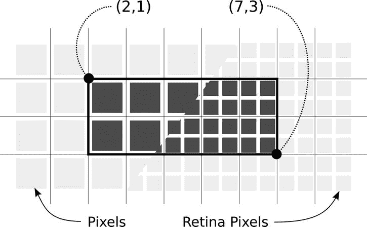

该矩形定义了一个数学上精确的区域，落在该区域内的像素被填充了颜色。这种精确性避免了程序员常见的一种病症——像素炎：即不确定特定绘图操作会影响哪些像素而产生的焦虑，这在许多其他图形库中很常见。

这种数学精确性可能会产生意想不到的副作用。一种常见的伪影出现在绘制奇数宽度线条时——“奇数”意味着“不能被 2 整除”。线条的描边以数学线条或曲线为中心。在下图中，在两个坐标之间绘制了一条水平线段，描边宽度为 `1.0`。下方图中的上一条线在较低分辨率的显示器上无法绘制成实线，因为描边只覆盖了线条两侧各 ½ 的像素。Core Graphics 使用抗锯齿技术绘制部分像素，这意味着这些像素的颜色会使用描边颜色值的一半进行调整。在视网膜显示器上，这种情况不会发生，因为每个像素是坐标值的 ½。

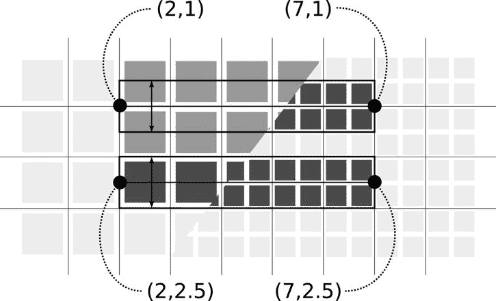

下图中较低的那条线通过将线条居中于两个坐标之间来避免“半像素”问题。现在，宽度为 `1.0` 的线条正好填满了坐标边界之间的空间，整齐地覆盖了像素，对用户来说显示为一条清晰、实心的线条。

如果像素完美对齐对你的应用很重要，你可能需要查阅 `UIView` 的 `contentScaleFactor` 属性。它揭示了两个整数值坐标之间的物理屏幕像素数量。在撰写本文时，它可以是两个值之一：`1.0`（用于较低分辨率显示器）和 `2.0`（用于视网膜显示器）。

接下来的代码块创建了一个 `UIBezierPath` 变量，然后根据 `shape` 变量进行切换以构建所需的形状。目前，case 语句仅为正方形和矩形形状创建路径，如图 11-4 所示。稍后你会补充其他情况。

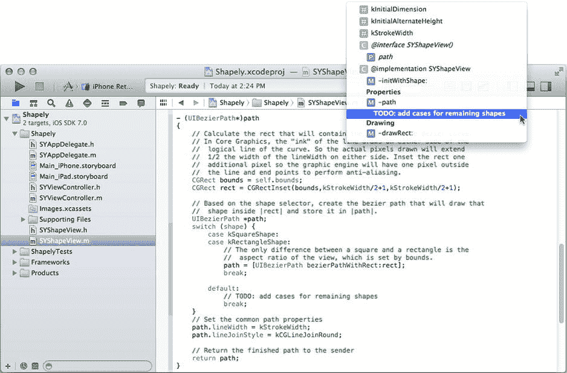

图 11-4. 未完成的 `-path` 方法

提示

如果以 `TODO:` 或 `!!!:` 开头编写 `//` 样式的注释，该注释将自动出现在编辑区顶部的文件导航菜单中，如图 11-4 所示。这是对需要稍后处理的事情做记录的非常方便的方法，因为它会突出显示在你的文件导航菜单中，直到你将其移除。

眼尖的读者会注意到，创建正方形形状和矩形形状的代码是相同的。这是因为这些形状之间的区别在于视图的宽高比，而这在创建对象时已经通过 `-initWithShape:` 确定了。如果你回头查看 `-initWithShape:`，你会看到这两行代码：

```
if (theShape==kRectangleShape || theShape==kOvalShape)
initRect.size.height = kInitialAlternateHeight;
```

当视图的 frame 被初始化时，如果形状是矩形或椭圆形，其高度会被设为一半。所有其他形状的视图在创建时都使用正方形 frame。

最后，形状的线宽被设置为 `kStrokeWidth`，连接点样式被设置为 `kCGLineJoinRound`。这最后一个属性决定了如何绘制连接点（一条线段结束、下一条线段开始的那个点）。将其设置为 `kCGLineJoinRound` 会绘制带有圆角“弯头”的形状。


### 测试方形

绘制一个方形视图的代码已经足够了，现在让我们将其连接到某个组件上进行测试。`Shapely` 应用会在用户点击按钮时创建新的形状，因此先定义一个按钮来测试它。这些按钮使用了自定义图像，所以首先要将这些图像资源添加到你的项目中。在导航器中选中 `Images.xcassets` 资源目录项。找到 `Learn iOS Development Projects` ➤ `Ch 11` ➤ `Shapely (Resources)` 文件夹，然后将全部 12 个图像文件（`addcircle.png`、`addcircle@2x.png`、`addoval.png`、`addoval@2x.png`、`addrect.png`、`addrect@2x.png`、`addsquare.png`、`addsquare@2x.png`、`addstar.png`、`addstar@2x.png`、`addtriangle.png` 和 `addtriangle@2x.png`）拖入资源目录中，如图 11-5 所示。`Shapely (Icons)` 文件夹中还包含一些应用图标，你可以随意将它们放入 `AppIcon` 组中。

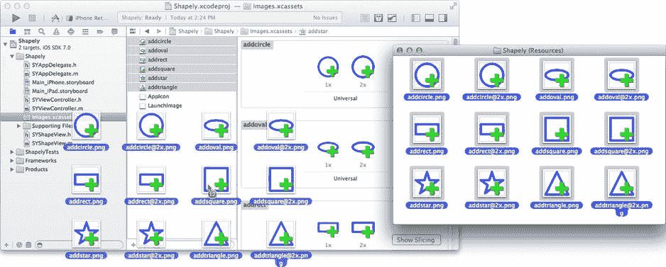

图 11-5. 添加按钮图像资源

这次我将从 iPad 界面开始，之后再将完成的工作复制到 iPhone 界面。如果你有一台 iPhone/iPod 并希望在开发时就在设备上运行此应用，也可以直接以 iPhone 界面开始——操作步骤是相同的。

选中 `Main_iPad.storyboard`（或 `_iPhone.xib`）文件。切换到辅助编辑器（View ➤ Assistant Editor ➤ Show Assistant Editor）。界面视图控制器（`SYViewController.h`）的界面应出现在右侧面板中。如果没有出现，请从右侧编辑器面板上方的导航栏中选中 `SYViewController.h` 文件。调出对象库（View ➤ Utilities ➤ Show Object Library），然后将一个新的 `Button` 对象拖入你的界面中，如图 11-6 所示。

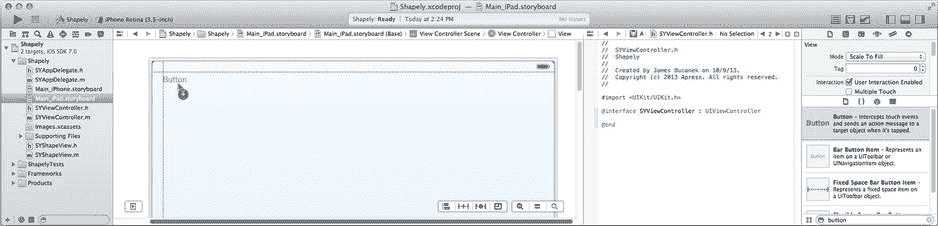

图 11-6. 添加第一个按钮

切换到属性检查器，选中根视图对象，并将其背景属性改为 `Black Color`。再次选中这个新按钮，并进行以下修改：

- 在属性检查器中
  - 将其类型改为 `Custom`
  - 清除其标题（将“Button”替换为空）
  - 将其图像改为 `addsquare`
- 使用尺寸检查器
  - 将其宽度和高度改为 `44` 像素

在 `SYViewController.h` 文件中（位于右侧编辑面板），添加一个新的操作：

`- (IBAction)addShape:(id)sender;`

通过将 `-addShape:` 声明旁边的连接插座拖拽到新按钮上，将按钮连接到该操作，如图 11-7 所示。

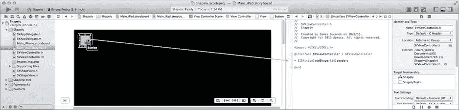

图 11-7. 连接第一个按钮

切换到 `SYViewController.m` 实现文件，并添加该操作方法。首先在其他导入语句之后立即添加一条导入语句，以便本模块了解 `SYShapeView` 类：

`#import "SYShapeView.h"`

在 `@implementation` 段落的末尾附近，添加新的操作方法：

```
- (IBAction)addShape:(id)sender
{
  SYShapeView *shapeView = [[SYShapeView alloc] initWithShape:kSquareShape];
  shapeView.color = [UIColor whiteColor];
  [self.view addSubview:shapeView];
  CGRect shapeFrame = shapeView.frame;
  CGRect safeRect = CGRectInset(self.view.bounds,
                                shapeFrame.size.width,
                                shapeFrame.size.height);
  CGPoint newLoc = CGPointMake(safeRect.origin.x
                               +arc4random_uniform(safeRect.size.width),
                               safeRect.origin.y
                               +arc4random_uniform(safeRect.size.height));
  shapeView.center = newLoc;
}
```

你的形状视图现在可以测试了。`-addShape:` 操作会创建一个绘制方形的新 `SYShapeView` 对象。它将其 `color` 属性设为白色，并将其添加为根视图的新子视图。

在本书中，到目前为止你一直使用 Interface Builder 来创建和添加视图对象。这段代码演示了如何通过编程方式实现。你在 Interface Builder 中添加到视图的任何内容都可以通过编程方式创建和添加，并且你可以用代码创建那些在 Interface Builder 中无法创建的内容。

注意

`-addSubview:` 方法会将一个视图作为接收者的子视图。该视图将以其框架的坐标出现在接收者（父视图）的局部坐标系中。你一次只能将一个视图添加到一个父视图中；一个视图不能同时出现在两个父视图中。若要移除该视图，需向该视图发送 `-removeFromSuperview` 消息。

`-addShape:` 中其余的代码只是为新视图随机选取一个位置，确保它不会太靠近显示边缘。请记住，`SYShapeView` 的 `-initWithShape:` 方法设置了视图的框架，但其原点仍然为 `(0,0)`。除非你更改这一点，否则所有新的形状视图都将出现在视图的左上角。

启动 iPad 模拟器并运行你的应用，如图 11-8 所示。多次点击按钮以创建一些形状视图对象，如图 11-8 右侧所示。

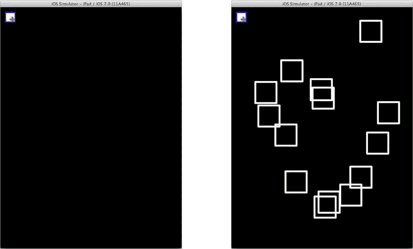

图 11-8. 可正常工作的方形形状视图

到目前为止，你已经设计了一个自定义的 `UIView` 对象，它使用贝塞尔路径绘制形状。你创建了一个操作，通过编程方式创建新的视图对象并将其添加到视图中。这是一个很好的开始，但你仍然希望绘制不同颜色、不同形状的图形，因此需要扩展应用来实现这一功能。


### 更多形状，更多色彩

回到 Xcode，停止运行应用，再次切换到 `Main_iPad.storyboard`（或 `_iPhone.xib`）文件。你的应用将绘制六种不同的形状，因此需要再创建五个按钮。我通过按住 Option 键并拖拽复制第一个 `UIButton` 对象来实现，如图 11-9 所示。当然，你也可以复制并粘贴第一个按钮。如果你是受虐狂，可以手动从库中拖入新的按钮对象，然后逐一修改使其与第一个按钮一致。这些选择权交给你。

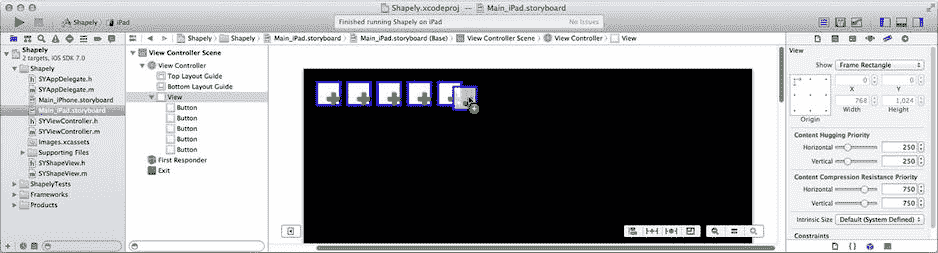  
*图 11-9. 复制第一个按钮*

就像在 DrumDub 中一样，你将使用按钮的 `tag` 属性来标识它将创建的形状。由于你复制了第一个按钮，所有按钮都连接到 `SYViewController` 中同一个 `-addShape:` 动作。（如果没有连接，请立即连接它们。）从左到右，使用属性检查器根据表 11-3 设置按钮的 `tag` 和 `image` 属性。

**表 11-3. 新形状按钮属性**

| Tag | Image |
| --- | --- |
| 1 | `addsquare` |
| 2 | `addrect` |
| 3 | `addcircle` |
| 4 | `addoval` |
| 5 | `addtriangle` |
| 6 | `addstar` |

> **注意:** 你注意到自己没添加任何约束了吗？这是因为这个界面并不需要约束。这些按钮永远不会调整大小，也无需根据其他元素（如导航栏）或不同屏幕尺寸重新定位。

你会注意到，这些 tag 值巧妙地与你之前在 `SYShapeView.h` 中定义的 `enum` 常量对应。为了让每个按钮创建其对应的形状，将 `-addShape:`（位于 `SYViewController.m` 中）的第一行改为使用按钮的 tag 值，而非 `kSquareShape` 常量：

`SYShapeView *shapeView = [[SYShapeView alloc] initWithShape:` `[sender tag]` `];`

当然，`SYShapeView` 中的 `path` 属性目前仍然只知道如何为正方形和矩形创建形状，所以你的工作尚未完成。但在离开 `SYViewController.m` 之前，让我们让界面更丰富多彩一些。在私有的 `@interface SYViewController ()` 部分，添加一个数组实例变量和一个 `readonly colors` 属性：

```objectivec
@interface SYViewController ()
{
    NSArray *colors;
}
@property (readonly,nonatomic) NSArray *colors;
@end
```

在 `@implementation` 部分，为 `colors` 数组添加一个（懒加载）属性获取方法：

```objectivec
- (NSArray*)colors
{
    if (colors==nil)
    {
        colors = @[ UIColor.redColor, UIColor.greenColor,
                    UIColor.blueColor, UIColor.yellowColor,
                    UIColor.purpleColor, UIColor.orangeColor,
                    UIColor.grayColor, UIColor.whiteColor ];
    }
    return colors;
}
```

该方法创建了一个 `UIColor` 对象数组，用于为图形分配不同的颜色。它仅在第一次被调用时创建一次该数组。现在再次修改 `-addShape:`，使其为每个新图形视图分配随机颜色：

```objectivec
- (IBAction)addShape:(id)sender
{
    SYShapeView *shapeView = [[SYShapeView alloc] initWithShape:[sender tag]];
    shapeView.color = [self.colors objectAtIndex:arc4random_uniform(self.colors.count)];
}
```

为了绘制这些形状，你的 `SYShapeView` 对象仍需完善。切换到 `SYShapeView.m` 文件，找到 `-path` 属性获取方法，并用清单 11-1 中加粗显示的代码完成它。哦，对了，顺便从未完成的版本中移除 `default:` 分支；不再需要它了。

**清单 11-1. 完成的路径属性获取方法**

```objectivec
- (UIBezierPath*)path
{
    CGRect bounds = self.bounds;
    CGRect rect = CGRectInset(bounds, kStrokeWidth/2+1, kStrokeWidth/2+1);
    UIBezierPath *path;
    switch (shape) {
        case kSquareShape:
        case kRectangleShape:
            path = [UIBezierPath bezierPathWithRect:rect];
            break;
        case kCircleShape:
        case kOvalShape:
            path = [UIBezierPath bezierPathWithOvalInRect:rect];
            break;
        case kTriangleShape:
            path = [UIBezierPath bezierPath];
            CGPoint point = CGPointMake(CGRectGetMidX(rect), CGRectGetMinY(rect));
            [path moveToPoint:point];
            point = CGPointMake(CGRectGetMaxX(rect), CGRectGetMaxY(rect));
            [path addLineToPoint:point];
            point = CGPointMake(CGRectGetMinX(rect), CGRectGetMaxY(rect));
            [path addLineToPoint:point];
            [path closePath];
            break;
        case kStarShape:
            path = [UIBezierPath bezierPath];
            point = CGPointMake(CGRectGetMidX(rect), CGRectGetMinY(rect));
            float angle = M_PI*2/5;
            float distance = rect.size.width*0.38f;
            [path moveToPoint:point];
            for ( NSUInteger arm=0; arm<5; arm++ )
            {
                point.x += cosf(angle)*distance;
                point.y += sinf(angle)*distance;
                [path addLineToPoint:point];
                angle -= M_PI*2/5;
                point.x += cosf(angle)*distance;
                point.y += sinf(angle)*distance;
                [path addLineToPoint:point];
                angle += M_PI*4/5;
            }
            [path closePath];
            break;
    }
    path.lineWidth = kStrokeWidth;
    path.lineJoinStyle = kCGLineJoinRound;
    return path;
}
```

`kCircleShape` 和 `kOvalShape` 分支使用了另一个 `UIBezierPath` 便捷方法，用于创建一个完整的路径对象，该路径描绘一个完全贴合在给定矩形内部的椭圆。

`kTriangleShape` 分支则变得有趣起来。它展示了贝塞尔路径如何逐线段创建。你通过向贝塞尔路径发送 `-moveToPoint:` 消息来设定形状的第一个点。之后，通过发送一系列 `-addLineToPoint:` 消息来添加线段。每条消息都为形状添加一条边，就像玩“连点成线”游戏。最后一条边通过 `-closePath:` 消息创建，该消息完成两件事：将最后一个点连接到第一个点，并使路径闭合——从而描述一个实心形状。

> **注意:** 此应用仅使用直线创建贝塞尔路径，但你也可以混合使用 `-addArcWithCenter:radius:startAngle:endAngle:clockwise:`、`-addCurveToPoint:controlPoint1:controlPoint2:` 和 `-addQuadCurveToPoint:controlPoint:` 等消息，以任意组合方式为路径添加曲线段。

`kStarCase` 创建了更复杂的形状。如果你对细节好奇，请阅读已完成的 Shapely 项目代码中的注释，你可以在 `Learn iOS Development Projects` ➤ `Ch 11` ➤ `Shapely` 文件夹中找到。简而言之，该代码创建了一个路径，从视图的顶部中心（星星的顶部顶点）开始，添加一条向下倾斜到星星内部顶点的线，然后再添加一条（水平）线回到星星的右侧顶点。接着旋转 72°，再重复这些步骤四次，从而形成一个五角星。

> **提示:** 三角函数使用弧度进行计算。如果你的三角学基础有点生疏了，弧度角表示为常数 π 的分数，π 等于 180°。iOS 数学库包含 π（`M_PI` 或 180°）、π/2（`M_PI_2` 或 90°）和 π/4（`M_PI_4` 或 45°）等常量，以及其他常用常量（e、2 的平方根等）。

再次运行你的应用（见图 11-10），然后创建一大堆图形吧！

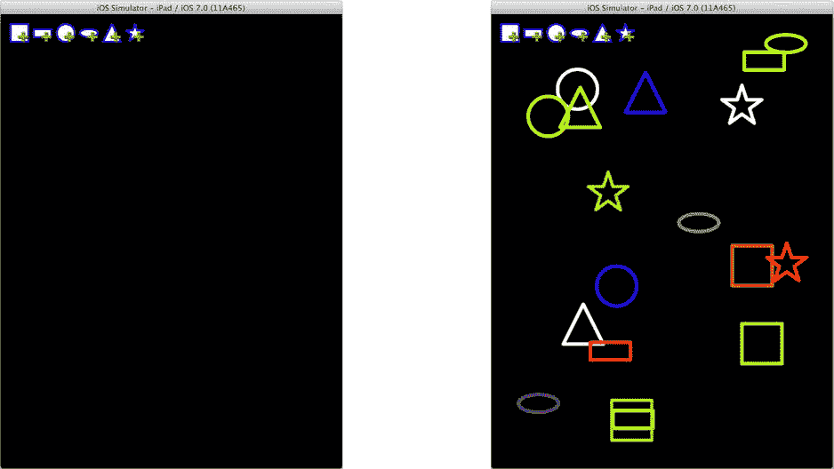  
*图 11-10. 多彩的图形*


### 变换

接下来，应用的下一个功能是拖动和调整形状大小。为此，你需要重新审视手势识别器，并学习一些全新的内容。先从手势识别器说起。

与视图对象类似，你可以通过编程方式创建、配置和连接手势识别器。iOS 提供的具体手势识别器类（如点击、捏合、旋转、滑动、平移和长按）包含了识别这些常见手势所需的所有逻辑。你只需实例化一个手势识别器，进行少量配置，然后将它们连接起来即可。

回到 `SYViewController.m` 文件中的 `-addShape:` 操作方法。在 `-addShape:` 方法的末尾，添加以下代码：

```
UIPanGestureRecognizer *panRecognizer;
panRecognizer = [[UIPanGestureRecognizer alloc] initWithTarget:self
                                                       action:@selector(moveShape:)];
panRecognizer.maximumNumberOfTouches = 1;
[shapeView addGestureRecognizer:panRecognizer];
```

前三个语句创建了一个新的平移（拖动）手势识别器对象。该识别器将把其操作消息（`-moveShape:`）发送给你的 `SYViewController` 对象（`self`）。`maximumNumberOfTouches` 属性被设置为 `1`，这配置了该对象仅识别单指拖动手势；它将忽略任何两指或三指的拖动。最后，识别器对象被附加到刚刚创建并添加到父视图的形状视图上。

**注意**：这段代码相当于在 Interface Builder 文件中，将一个“平移手势识别器”拖入 `SYShapeView` 对象中，选中它，将其“最大触摸数”属性改为 `1`，然后将识别器连接到控制器的 `-moveShape:` 操作。当我说“相当于”时，我的意思是“完全等同”。

现在你只需要一个 `-moveShape:` 操作。在 `SYViewController.m` 文件的开头，找到私有的 `@interface SYViewController ()` 部分，并添加这个方法声明：

```
- (IBAction)moveShape:(UIPanGestureRecognizer *)gesture
```

滚动到 `@implementation` 部分的末尾，并添加方法：

```
- (IBAction)moveShape:(UIPanGestureRecognizer *)gesture
{
    SYShapeView *shapeView = (SYShapeView*)gesture.view;
    CGPoint dragDelta = [gesture translationInView:shapeView.superview];
    CGAffineTransform move;
    switch (gesture.state) {
        case UIGestureRecognizerStateBegan:
        case UIGestureRecognizerStateChanged:
            move = CGAffineTransformMakeTranslation(dragDelta.x,dragDelta.y);
            shapeView.transform = move;
            break;
        case UIGestureRecognizerStateEnded:
            shapeView.transform = CGAffineTransformIdentity;
            shapeView.frame = CGRectOffset(shapeView.frame,dragDelta.x,dragDelta.y);
            break;
        default:
            shapeView.transform = CGAffineTransformIdentity;
            break;
    }
}
```

手势识别器会分析并吸收发送到视图对象的底层触摸事件，并将其转化为高级手势事件。与许多高级事件一样，它们具有不同的阶段。连续手势（如拖动）的阶段会按可预测的顺序进行：可能、开始、改变，最后是结束或取消。

你的 `-moveShape:` 方法首先获取触发手势动作的视图；这将是用户触摸的视图，也是你要移动的视图。然后，它获取用户拖动的距离以及手势状态的信息。只要手势处于“开始”或“改变”状态，就意味着用户触摸了视图并在屏幕上拖动手指。当用户松开手指时，状态将变为“结束”。在极少数情况下，状态可能会变为“取消”或“失败”，在这种情况下，你会忽略该手势。

当用户拖动手指时，你希望将形状视图的原点调整相同的屏幕距离，从而给用户一种正在物理拖动屏幕上视图的错觉。（我希望你没想过真能在 iPhone 里通过触摸移动实物。）实现这一点的方法利用了 `UIView` 类的一个显著特性：`transform` 属性。

### 应用平移变换

iOS 以多种不同的方式使用仿射变换。仿射变换是一个 3x3 矩阵，用于描述坐标系变换。通俗地说，它是一组（看似）神奇的数值数组，可以描述各种复杂的坐标转换。它能够移动、调整大小、倾斜、翻转和旋转任意点集。而且由于几乎所有东西（视图对象、图像和贝塞尔路径）都是“点集”，因此仿射变换可用于移动、翻转、缩放、缩小和旋转它们中的任何一个。更令人惊叹的是，单个仿射变换可以在一次操作中完成所有这些变换。

**仿射变换**  
iOS 提供了创建和组合三种常见变换的函数：平移（位移）、缩放和旋转。这些变换如下图所示。灰色形状表示原始形状，深色图形代表其变换结果：

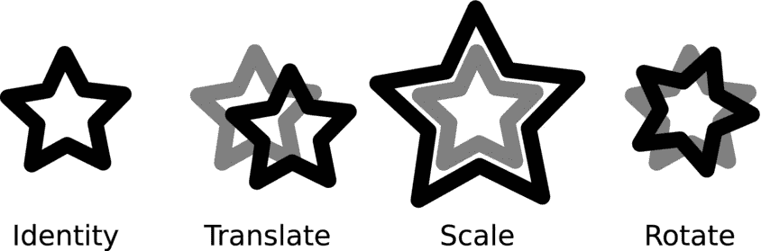

你可以使用函数 `CGAffineTransformMakeTranslation`、`CGAffineTransformMakeScale` 或 `CGAffineTransformMakeRotation` 创建基本变换。如果你是个数学高手，也可以使用 `CGAffineTransformMake` 创建任意变换。

特殊的单位变换（`CGAffineTransformIdentity`）不执行任何平移操作。这是 `transform` 属性的默认值，也是你不想进行任何变换时使用的常量。

变换可以组合。其效果如下图所示：

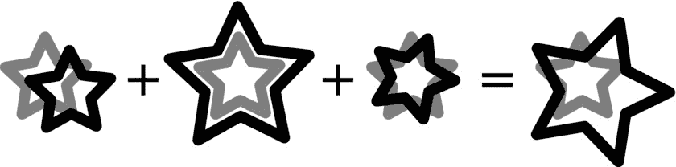

要将变换组合在一起，可以使用函数 `CGAffineTransformTranslate`、`CGAffineTransformScale`、`CGAffineTransformRotate` 和 `CGAffineTransformConcat`。这些函数接受一个变换（可能已经是其他变换的组合），应用额外的变换，并返回组合后的变换。然后，你可以使用这个组合变换值，在一次操作中执行所有单独的变换。

`-moveShape:` 方法中处理“开始”和“改变”状态的手势情况时，会获取用户拖动手指的距离，并据此创建一个平移变换。试着快速说三遍“平移变换”。`transform` 属性被设置为这个值，这样就完成了。但是，这个神奇的属性到底做了什么？

当你设置视图的 `transform` 属性时，该视图在其父视图中占据的所有坐标在显示到屏幕之前都会被变换。视图的内容和位置（即其 frame）并不会改变。改变的是视图图像在父视图中的显示位置。我喜欢把 `UIView transform` 想象成一个“投影”视图的透镜，让它显示在其他位置或以不同的方式显示。如果你应用了平移变换，就像你在 `-moveShape:` 中所做的那样，那么视图将出现在一组不同的坐标上。

**注意**：如果你将 `transform` 属性设置为除单位变换之外的任何值，`frame` 属性的值将变得没有意义。它并非完全无意义，但在大多数实际用途中已不可用。请记住这一点：在将 `transform` 设置为除单位变换之外的任何值后，不要使用 `frame`。

如果你将 `transform` 属性重置为单位变换（`CGAffineTransformIdentity`），视图将重新出现在其原始位置。程序员将 `transform` 属性称为非破坏性变换，因为设置它不会改变对象的任何其他属性。将其重置，一切就会恢复原状。在 `default:` 情况下，这正是所发生的事情。`default:` 情况通过将 `transform` 属性重置为单位变换来处理“取消”和“失败”状态。


