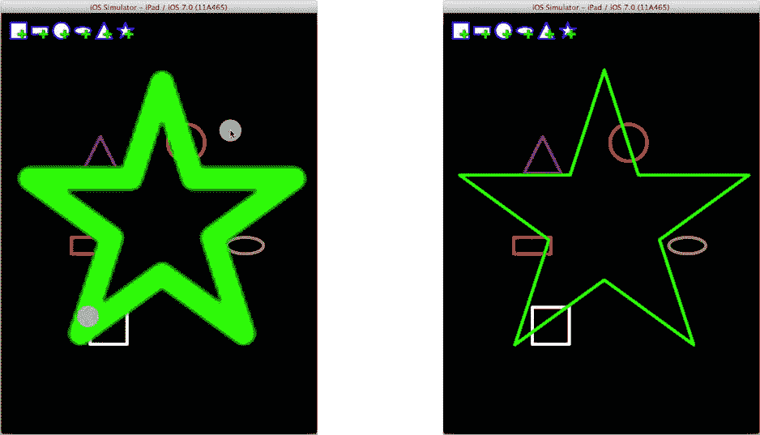

# 手势处理与变换

手势的“结束”状态是核心工作发生的时机。首先，视图的 `transform` 属性会被重置回单位矩阵。然后，根据用户拖动视图的总距离更新视图的 `frame` 原点。更新后的 `frame` 会将视图对象永久地重新定位到新位置。

> **注意**  
> 在使用 `frame` 属性更改视图位置之前，视图的 `transform` 属性会被设置为单位矩阵。

运行你的项目并尝试一下。我没有提供图示，因为（正如我的出版人向我解释的那样）书中的插图是不会动的。创建几个形状并拖拽它们，这非常有趣。玩够了之后，准备好为应用添加缩放和捏合功能吧。

不过在此之前，让我分享一些关于仿射变换的知识。变换可以在多种场景下使用，而不仅仅是扭曲视图的 frame。它可以在你绘制视图时，用来变换当前图形上下文的坐标系。本质上，这种用法是对视图的 bounds 应用变换，从而改变你在视图中绘制内容的效果，而不是对视图的最终结果进行平移。例如，你可能有一个复杂的绘图，希望将其在视图中上下移动，或者将其倒置绘制。与其重新计算所有想要绘制的坐标，不如使用 `CGContextTranslateCTM`、`CGContextRotateCTM` 或 `CGContextScaleCM` 函数来平移、旋转或缩放所有的绘图操作。你将在第 16 章中使用这些函数。

> **提示**  
> 你也可以通过更改 `bounds` 属性的 `origin` 来平移视图的绘图坐标。

变换还可以用来改变贝塞尔路径中的点。创建所需的变换，然后向路径发送 `-applyTransform:` 消息。路径中的所有点都将被该变换修改。这是一种破坏性的变换；曲线中的原始点将丢失。

## 应用缩放变换

如果一个手势识别器很有趣，那么两个就能开派对了。这次，你将添加一个捏合/缩放手势来调整你的形状视图的大小。和之前一样，首先在 `-addShape:` 方法（`CYViewController.m`）的末尾创建并添加第二个手势识别器对象：

```
UIPinchGestureRecognizer *pinchGesture;
pinchGesture = [[UIPinchGestureRecognizer alloc] initWithTarget:self
                                          action:@selector(resizeShape:)];
[shapeView addGestureRecognizer:pinchGesture];
```

捏合手势识别器对象不需要任何配置，因为捏合/缩放始终是双指手势。在文件顶部的私有 `@interface SYViewController ()` 部分中，为新的动作方法添加原型：

```
- (IBAction)resizeShape:(UIPinchGestureRecognizer*)gesture;
```

最后，将该方法添加到 `@implementation` 部分：

```
- (IBAction)resizeShape:(UIPinchGestureRecognizer*)gesture
{
    SYShapeView *shapeView = (SYShapeView*)gesture.view;
    CGFloat pinchScale = gesture.scale;
    CGAffineTransform zoom;
    switch (gesture.state) {
        case UIGestureRecognizerStateBegan:
        case UIGestureRecognizerStateChanged:
            zoom = CGAffineTransformMakeScale(pinchScale,pinchScale);
            shapeView.transform = zoom;
            break;
        case UIGestureRecognizerStateEnded:
            shapeView.transform = CGAffineTransformIdentity;
            CGRect frame = shapeView.frame;
            CGFloat xDelta = frame.size.width*pinchScale-frame.size.width;
            CGFloat yDelta = frame.size.height*pinchScale-frame.size.height;
            frame.size.width += xDelta;
            frame.size.height += yDelta;
            frame.origin.x -= xDelta/2;
            frame.origin.y -= yDelta/2;
            shapeView.frame = frame;
            [shapeView setNeedsDisplay];
            break;
        default:
            shapeView.transform = CGAffineTransformIdentity;
            break;
    }
}
```

此方法遵循与 `-moveShape:` 相同的模式。唯一显著的区别在于调整视图最终大小和位置的代码，这比拖动方法需要更多的数学计算。

运行项目并尝试一下。创建一个形状，然后用两根手指调整其大小，如图 11-11 左侧所示。



**图 11-11.** 使用变换进行缩放

> **提示**  
> 如果你在使用模拟器，请按住 Option 键来模拟双指捏合手势。你首先需要将形状放置在视图中央，因为模拟器中的第二个“手指”总是相对于显示屏中心点镜像，并且你需要在视图中同时拥有两个“手指”才能被识别为捏合手势。

你会注意到，当将形状放大很多时，其图像会出现“锯齿”：这是由于放大较小图像而产生的锯齿伪影。原因是在捏合手势期间，你并没有调整视图的大小，只是对原始视图的图像应用了变换。贝塞尔路径是分辨率无关的，在任何尺寸下都能平滑绘制。但变换只能处理视图当前图像的像素。在捏合手势结束时，形状视图的大小会被调整并重绘。这将在新尺寸下创建一个新的贝塞尔路径，一切再次变得平滑，如图 11-11 右侧所示。

你的应用看起来已经很生动了，但我认为它可以再增加一些活力。你觉得添加一些动画怎么样？

