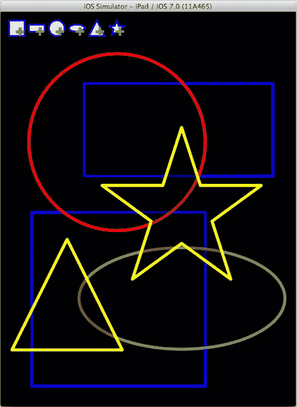
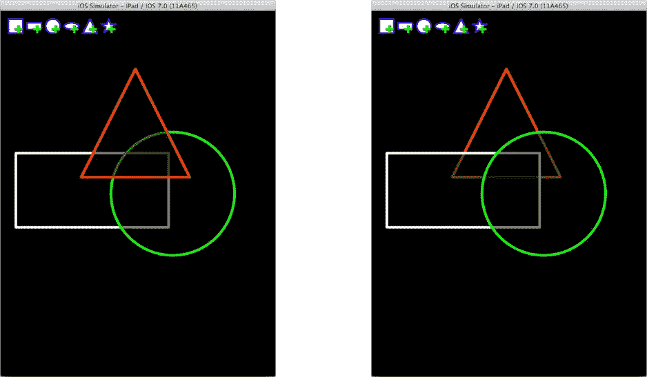

# 动画：不仅仅是漫画的专利

动画已经成为现代应用中不可或缺且备受期待的特性。没有动画，你的应用会显得枯燥乏味，即使它完成了一切你期望的功能。幸运的是，iOS 的设计者们深知这一点，他们为此做了大量令人惊叹的工作，让你可以轻松地为应用添加动画。有四种方法可以为你的应用增添动感：

*   内置功能
*   自己动手（DIY）
*   核心动画
*   OpenGL

“内置功能”是指 iOS API 中那些会自动为你完成动画的地方。从视图控制器到表格视图，无数方法都包含一个布尔类型的 `animated` 参数。如果你想让视图控制器滑入、页面翻起、工具栏按钮平滑调整大小、表格视图行灵动地跳到新位置，或者进度指示器平稳地变为新值，你只需为 `animated` 参数传递 `YES`，iOS 类就会完成所有工作。因此，请留意那些 `animated` 参数，并善用它们。

> **提示**  
> 某些视图属性有两个设置器：一个从不支持动画，另一个支持动画。例如，`UIProgressView` 类有 `-setProgress:` 方法（从不支持动画）和 `-setProgress:animated:` 方法（可选择动画）。如果你在使用不支持动画的属性设置器，请查阅文档，看看是否有支持动画的替代方案。

在“自己动手（DIY）”动画方案中，你的代码会逐帧执行更改，以实现界面动画。这通常包含以下步骤：

1. 创建一个每秒触发 30 次的计时器。
2. 当计时器触发时，更新视图的位置、外观、大小或内容。
3. 将视图标记为需要重绘。
4. 重复步骤 2 和 3，直到动画结束。

具有讽刺意味的是，DIY 方案恰恰是业余爱好者最常滥用的方法。它在少数情况下可能表现尚可，但大多数时候，它会遭遇许多不可避免的性能陷阱。最大的问题是时机。要平衡动画的速度，使其看起来流畅，但又不会运行过快以至于浪费 CPU 资源、消耗电池寿命，并拖累应用的其他部分以及 iOS 系统本身，这真的很难做到。


### 使用 Core Animation

聪明的 iOS 开发者——既然你在读这本书，那就是你——都会使用 Core Animation。Core Animation 已经为你解决了所有棘手的性能、负载均衡、后台线程和效率问题。你所要做的就是告诉它你想让什么动起来，然后让它施展魔法。

动画内容绘制在一个图层 (`CALayer`) 对象中。图层对象就像一个 `UIView`；它是你可以使用 Core Graphics 进行绘制的画布。一旦绘制完成，该图层就可以使用 Core Animation 进行动画处理。简而言之，你告诉 Core Animation 你想要图层如何变化（移动、缩小、旋转、卷曲、翻转等），在什么时间段内完成，以及速度多快。然后你就不用管了，让 Core Animation 来完成所有工作。Core Animation 甚至不会打扰你应用的事件循环；它在后台安静地工作，用可用的 CPU 资源来平衡动画工作，从而不会干扰你的应用需要执行的其他任何任务。这真是一个了不起的系统。

请记住，Core Animation 不会改变图层对象的内容。它只是临时对图层的一个副本进行动画处理，一旦动画结束，这个副本就会消失。我喜欢把 Core Animation 看作是“实时”变换；它临时投射出一个你图层的扭曲、动画版本，但从不改变图层本身。

哦，我说过“图层对象就像一个 `UIView` 吗？”我应该说“图层对象，就像 `UIView` 中的那个一样”，因为 `UIView` 就是基于 Core Animation 图层的。当你通过 `-drawRect:` 方法绘制视图时，你实际上是在一个 `CALayer` 对象上绘图。如果你需要直接操作图层对象，可以通过 `layer` 属性获取你的 `UIView` 的图层对象。这里要记住的重点是：所有 `UIView` 对象都可以使用 Core Animation 进行动画处理。现在，你已经真正入门了！

### 为 Shapely 添加动画

有三种方法可以让 Core Animation 为你工作。我已经描述了第一种：所有那些“内置”的动画参数都基于 Core Animation——这并不意外。第二种传统的 Core Animation 技术是创建一个动画 (`CAAnimation`) 对象。一个动画对象控制一个动画序列。它决定动画何时开始、何时停止、动画的速度（称为动画曲线）、动画做什么、是否重复、重复多少次等等。`CAAnimation` 还有一些子类，可以动画化视图的特定属性，或者动画化过渡效果（视图对象的添加、移除或交换）。甚至还有一个动画类 (`CAAnimationGroup`) 可以同步多个动画对象。

说实话，创建 `CAAnimation` 对象并不容易。因为它可能非常复杂，所以有大量的便利构造器和方法试图让这个过程尽可能无痛——但这仍然是一项艰巨的任务。你必须定义被动画化属性的起始值和结束值。你必须定义时间和动画曲线，然后你必须启动动画并在适当的时间更改实际的属性值。请记住，动画不会改变原始视图，所以如果你希望视图从左向右滑动，你必须创建一个从左侧开始并在右侧结束的动画，然后你必须将原始视图的位置设置为右侧，否则动画结束后视图会重新出现在左侧。这很繁琐。

幸运的是，iOS 之神感受到了你的痛苦，并创建了一种非常简单的方法来创建基本动画，称为基于块的动画方法。这些 `UIView` 方法让你只需编写几行代码，就能告诉 Core Animation 你想如何改变视图的属性。然后 Core Animation 会处理创建、配置和启动 `CAAnimation` 对象的工作。它甚至会更新你的视图属性，这样当动画结束时，你的属性将处于动画的结束值——这正是你想要的。

那么这些基于块的动画方法用起来有多简单呢？你来评判。在你的 `SYViewController.m` 文件中找到 `-addShape:` 方法。在该方法的末尾，添加以下代码：

```
shapeFrame = shapeView.frame;

CGRect buttonFrame = ((UIView*)sender).frame;

shapeView.frame = buttonFrame;

[UIView animateWithDuration:0.5

delay:0

options:UIViewAnimationOptionCurveEaseOut

animations:^{ shapeView.frame = shapeFrame; }

completion:nil];
```

这段新代码首先获取新形状视图更新后的 `frame`。请记住，当它的 `center` 属性被放置在屏幕上的随机位置时，它的 `frame` 已经被调整过了。这就是你希望该视图最终定位的位置。

第二行代码获取创建新形状的按钮的 frame，第三行代码重新定位你的新形状视图（再次），使其正好位于按钮的正上方，并且与按钮大小相同。如果你在此处停止，你的形状视图将正好出现在你点击的按钮之上，覆盖住它。

最后一个语句就是魔法。它启动一个动画，持续半秒钟（`duration:0.5`），立即开始（`delay:0`），并使用“缓出”动画曲线（`options:UIViewAnimationOptionCurveEaseOut`）。有四种预设曲线可供选择：缓出（想想飞机降落）、缓入（飞机起飞）、缓入-缓出（起飞和降落）和线性（飞机以恒定速度飞行）。

该方法有两个代码块参数。第一个是描述你想要动画化什么的块，这里说的“描述”是指你只需编写代码来设置那些你想平滑改变的属性。`UIView` 会自动动画化以下七个属性中的任何一个：

- `frame`
- `bounds`
- `center`
- `transform`
- `alpha`
- `backgroundColor`
- `contentStretch`

如果你希望一个视图移动或改变大小，那就动画化它的 `center` 或 `frame`。希望它淡出？将它的 `alpha` 属性从 `1.0` 动画化到 `0.0`。希望它平滑地向右旋转？将它的 `transform` 从恒等变换动画化为一个旋转变换。你可以执行其中任何一个操作，甚至可以同时执行多个操作（同时改变 `alpha` 和 `center`）。就这么简单。

**注意**

Objective‑C 块是包含一段可执行代码的值。你可以在 `^{` 和 `}` 之间编写一个代码块，就像它是一个值（比如数字）一样。该块可以保存在变量中，或者作为参数传递。之后，接收者可以像执行其方法的一部分一样执行该代码块。块非常强大。你可以在《块简短实用指南》中阅读所有相关内容，该指南位于 Xcode 的“文档和 API 参考”中。

完成参数是另一个代码块，它在动画结束时执行。在 Shapely 中，没有其他事情要做，因为你唯一的目标就是将视图从 `buttonFrame` 移动到 `shapeFrame`。如果有的话，只需传递一个执行动画后清理工作的代码块即可。你甚至还可以启动另一个动画！

再次运行你的应用并创建几个形状。相当酷，对吧？（同样，没有配图。）每当你点击每个添加形状按钮时，新的形状就会从你的手指下方飞入你的视野，就像某种疯狂的街机游戏。如果你手速够快，你可以让几个形状同时动起来。而这仅仅花费了你四行代码。

如果你想要对除这七个属性之外的其他属性进行动画化，创建循环运行的动画、沿弧线移动的动画或反向运行的动画，该怎么办？为此，你需要深入研究 Core Animation 并创建你自己的动画对象；我将在第 14 章中向你展示如何操作。你可以在 Xcode 的“文档和 API 参考”中找到的《Core Animation 编程指南》中阅读相关内容。


### OpenGL

哎呀，差点忘了最后一项动画技术：OpenGL。OpenGL 是开放图形库（Open Graphics Library）的缩写。它是一个跨语言、跨平台的 API，用于 2D 和 3D 动画。iOS 中包含的 OpenGL 版本是 OpenGL ES（嵌入式系统 OpenGL），它是 OpenGL 的精简版本，适用于在非常小型的计算机系统（如 iOS 设备）上运行。

坦白说，OpenGL 是另一个世界。OpenGL 视图使用一种名为 GLSL（OpenGL 着色语言）的特殊类 C 语言进行编程。要使用它，你需要编写顶点着色器和片段着色器程序。这些小程序在你的设备 GPU（图形处理单元）中运行，与你之前编写的在 CPU（中央处理单元）中运行的代码不同。GPU 是一种大规模并行处理器，可能同时运行着你的着色器程序的数百个副本，每个副本都在计算不同像素的值。

其效果绝对令人惊叹。如果你曾玩过 3D 飞行模拟器、射击游戏或冒险游戏，你看到的很可能就是一个 OpenGL 视图。即使是带有旋转云层、星星或各种特效的 2D 游戏，也是用 OpenGL 编写的。

如果你想充分发挥设备图形处理单元的全部性能，OpenGL 是必经之路——但你需要学习很多知识。你需要一本关于 OpenGL 的好书。是的，关于 OpenGL 的书籍整本都有，比这本书还厚。你的内容出现在一个特殊的 Core Animation 层（`CAEAGLLayer`）对象中，该对象专门设计用于显示 OpenGL 上下文。要将其添加到你的应用中，请在界面中创建一个`GLKView`（OpenGL 工具包视图）对象。`GLKView`是`UIView`的子类，它托管了一个`CAEAGLLayer`对象。如果你需要，还有一个方便的`GLKViewController`类。

不用说，我不会在这本书中展示任何 OpenGL 示例。（如果你迫不及待想一探究竟，Xcode 项目模板中有一个 OpenGL 游戏模板。）如果这正是你希望为应用驾驭的那种强大功能，至少你知道该往哪个方向努力。从你可以在 Xcode 的“文档与 API 参考”中找到的《iOS OpenGL ES 编程指南》开始吧。但请注意，你需要学习大量 OpenGL 基础知识，之后才能理解该文档的大部分内容。

## 层次顺序

趁你还打开着 Shapely 项目，我想让你稍微摆弄一下视图对象的顺序。子视图有一个特定的顺序，称为它们的 Z 轴顺序，它决定了重叠视图的绘制方式。这并不复杂。后视图先绘制，后续视图绘制在它之上（如果它们重叠）。如果重叠的视图是不透明的，它会遮挡住它后面的视图。如果它的一部分是透明的，那么它后面的视图就会从缝隙中“露出来”。

这说起来比演示更简单，所以给 Shapely 再添加两个手势识别器。再次回到`SYViewController.m`文件中的`-addShape:`操作方法。紧接着添加其他两个手势识别器的代码之后（在你刚刚添加的动画代码之前），插入以下内容：

```
UITapGestureRecognizer *dblTapGesture;
dblTapGesture = [[UITapGestureRecognizer alloc] initWithTarget:self
action:@selector(changeColor:)];
dblTapGesture.numberOfTapsRequired = 2;
[shapeView addGestureRecognizer:dblTapGesture];
UITapGestureRecognizer *trplTapGesture;
trplTapGesture = [[UITapGestureRecognizer alloc] initWithTarget:self
action:@selector(sendShapeToBack:)];
trplTapGesture.numberOfTapsRequired = 3;
[shapeView addGestureRecognizer:trplTapGesture];
```

这段代码添加了双击和三击手势识别器，它们分别发送`-changeColor:`和`-sendShapeToBack:`消息。向上滚动到`@interface SYViewController ()`私有接口部分，声明新方法：

```
- (IBAction)changeColor:(UITapGestureRecognizer*)gesture;
- (IBAction)sendShapeToBack:(UITapGestureRecognizer*)gesture;
```

现在将这两个新方法添加到`@implementation`部分：

```
- (IBAction)changeColor:(UITapGestureRecognizer*)gesture
{
SYShapeView *shapeView = (SYShapeView*)gesture.view;
UIColor *color = shapeView.color;
NSUInteger colorIndex = [self.colors indexOfObject:color];
NSUInteger newIndex;
do {
    newIndex = arc4random_uniform(self.colors.count);
} while (colorIndex==newIndex);
shapeView.color = [self.colors objectAtIndex:newIndex];
}

- (IBAction)sendShapeToBack:(UITapGestureRecognizer*)gesture
{
UIView *shapeView = gesture.view;
[self.view sendSubviewToBack:shapeView];
}
```

`-changeColor:`方法主要是为了好玩。它能识别形状当前的颜色，并为其随机选取一个新颜色。

`-sendShapeToBack:`操作则展示了视图如何重叠。当你向一个视图添加子视图时（使用`UIView`的`-addSubview:`消息），新视图会放在最上面。但这并非你唯一的选择。如果视图顺序很重要，有许多方法可以将子视图插入到特定索引处，或者紧贴另一个（已知）视图的下方或上方。你也可以使用`-bringSubviewToFront:`和`-sendSubviewToBack:`调整现有视图的顺序，你将在这里用到后者。你的三击手势会将该子视图“推”到最底层，位于所有其他形状之后。

为了使这个效果更明显，请对`SYShapeView.m`中的`-drawRect:`方法做一个小的修改，插入以下两行代码（以粗体标记）：

```
- (void)drawRect:(CGRect)rect
{
UIBezierPath *path = self.path;
[[[UIColor blackColor] colorWithAlphaComponent:0.3] setFill];
[path fill];
[self.color setStroke];
[path stroke];
}
```

新代码用 30%不透明（即 70%透明）的黑色填充形状。它会使得形状看起来有一个“烟雾状”的中心，从而加深绘制在其后面的任何形状的颜色。这将使形状是如何重叠的变得一目了然。

运行你的应用，创建几个形状，调整它们的大小，然后移动它们使其重叠，如图 11-12 所示。



图 11-12. 使用半透明填充的重叠形状

你最后添加的形状位于你最先添加的形状“之上”。现在尝试双击一个形状来改变它的颜色。我会等你。

我还在等。


### 排查双击颜色变化问题

遇到问题了？双击似乎没有改变形状的颜色？可能有两个原因：`-changeColor:`方法没有被接收到（你可以通过在 Xcode 中设置断点来测试），或者它被接收到了但颜色变化没有显示出来（你可以通过调整形状大小来测试）。如果你双击一个形状然后调整它的大小，就会看到颜色变化。好吧，是后者。花点时间修复这个问题。

问题是`SYShapeView`对象不知道在它的`color`属性发生变化时应该重新绘制自身。你可以在`-changeColor:`中添加`[shapeView setNeedsDisplay]`语句，但这有点取巧。我坚信，当任何改变视图外观的属性被修改时，视图对象应该触发自身的重绘。这样一来，客户端代码就不必担心是否要发送`-setNeedsDisplay`消息；视图会自动处理这一切。

### 修复方法

返回`SYShapeView.m`并添加以下方法：

```
- (void)setColor:(UIColor *)color
{
    _color = color;
    [self setNeedsDisplay];
}
```

这个方法替换了由`color`属性创建的默认设置方法。新方法更新了`_color`实例变量（这是旧设置方法所做的全部工作），同时也向自身发送`-setNeedsDisplay`消息。现在，每当你更改视图的颜色时，它会立即重新绘制自身。

运行应用并再次尝试双击。效果好多了！

### 处理手势识别器冲突

最后，你需要进入演示中重新排列视图的部分。重叠一些视图，然后三击其中一个顶层视图。你看到视图被推到底层时的区别了吗？

你说什么？三击时颜色也变了？

哦，天哪，这些手势识别器难道没有一个能正常工作吗？好吧，实际上它们能工作，但你造成了一个无解的局面。你将双击和三击手势识别器都附加到了同一个视图上。问题在于两者之间没有协调。实际情况是，双击识别器在第二次点击时就会触发，而三击识别器根本没有机会处理第三次点击。

有很多方法可以修复这个错误，但最常见的手势冲突问题只需一行代码就能解决。返回`SYViewController.m`文件，找到`-addShape:`方法，定位添加双击和三击识别器的代码。紧接着添加这一行：

`[dblTapGesture requireGestureRecognizerToFail:trplTapGesture];`

这条消息在两个识别器之间建立了依赖关系。现在，双击识别器只有在三击识别器失败时才会触发。当你点击两次时，三击识别器会失败（它看到了两次点击，但从未得到第三次）。这创建了双击识别器触发所需的所有条件。然而，如果你三击，三击识别器成功，这就会阻止双击识别器触发。简单吗？

现在最后一次运行你的应用。调整大小并重叠一些形状。三击一个顶层形状将其推到底层，惊叹于结果，如图 11-13 所示。



**图 11-13.** 正常工作的 Shapely 应用

### 重要提示

命中测试对视图的透明部分一无所知。所以，即使你能在顶层视图的中间或边缘附近看到某个视图的一部分，你也无法与它交互，因为触摸事件会传递给顶层视图。通过重写视图的`-hitTest:withEvent:`和`-pointInside:withEvent:`方法可以改变这一点，但这比我想演示的内容更复杂。

## 总结

现在你应该对视图对象如何、何时以及为什么被绘制有了扎实的理解。你了解了图形上下文、贝塞尔路径、坐标系、颜色、透明度相关基础、2D 变换，甚至如何创建简单动画。内容很多。

你还没有深入探索的一件事是图像。让我们通过回顾过去来开始这一部分。

### 图像与位图

当你在图形上下文中绘制时，你无法访问自己创建的单个像素。所以你可以用颜色填充视图，但你不能询问上下文某个特定像素被设置成了什么颜色。原因是封装——又是这个词。你的代码无法假设事物实际如何绘制，甚至何时绘制。很可能是你的视图由 GPU 绘制到你的程序甚至无法访问的显示内存中。

当你想处理图像的单个像素时，这可能会很棘手。如果你需要这样做，你必须为这些像素分配内存。然后你可以直接操作这些像素，或者使用图形绘制函数“绘制”到你的像素数组中。


### 从位图创建图像

你在第 8 章编写的`ColorModel`应用中，其实已经使用过第一种方法了。在该应用中，`CMColorView`类最终被重写为显示色相/饱和度颜色场。它通过使用一个公式为每个像素计算颜色值来构建图像对象。我已经提取了该代码的核心部分，你可以在代码清单 11-2 中找到它。

代码清单 11-2. 来自 ColorModel 的图像创建代码

```
@interface CMColorView ()
{
    CGImageRef hsImageRef;
    float brightness;
}
@end

...

- (void)drawRect:(CGRect)rect
{
    CGRect bounds = self.bounds;
    CGContextRef context = UIGraphicsGetCurrentContext();

    if (hsImageRef!=NULL &&
        ( brightness!=_colorModel.brightness ||
          bounds.size.width!=CGImageGetWidth(hsImageRef) ||
          bounds.size.height!=CGImageGetHeight(hsImageRef) ) )
    {
        CGImageRelease(hsImageRef);
        hsImageRef = NULL;
    }

    if (hsImageRef==NULL)
    {
        brightness = _colorModel.brightness;
        NSUInteger width = bounds.size.width;
        NSUInteger height = bounds.size.height;

        typedef struct {
            uint8_t red;
            uint8_t green;
            uint8_t blue;
            uint8_t alpha;
        } Pixel;

        NSMutableData *bitmapData = [NSMutableData dataWithLength:sizeof(Pixel)
                                                         *width*height];

        for ( NSUInteger y=0; y<height; y++ )
        {
            for ( NSUInteger x=0; x<width; x++ )
            {
                UIColor *color = [UIColor colorWithHue:(float)x/(float)width
                                           saturation:1.0f-(float)y/(float)height
                                           brightness:brightness
                                                alpha:1];
                float red,green,blue,alpha;
                [color getRed:&red green:&green blue:&blue alpha:&alpha];
                Pixel *pixel = ((Pixel*)bitmapData.bytes)+x+y*width;
                pixel->red = red*255;
                pixel->green = green*255;
                pixel->blue = blue*255;
                pixel->alpha = 255;
            }
        }

        CGColorSpaceRef colorSpace = CGColorSpaceCreateDeviceRGB();
        CGDataProviderRef provider = CGDataProviderCreateWithCFData(
            (__bridge CFDataRef)bitmapData);
        hsImageRef = CGImageCreate(width,height,
                                   8,32,width*4,colorSpace,
                                   kCGBitmapByteOrderDefault,provider,NULL,
                                   false,kCGRenderingIntentDefault);
        CGColorSpaceRelease(colorSpace);
        CGDataProviderRelease(provider);
    }

    CGContextDrawImage(context,bounds,hsImageRef);
    ...
}
```

`CMColorView`对象将最终生成的图像保存在其`hsImageRef`变量中（这是一个 Core Graphics 图像引用，相当于 Objective-C 中的图像对象引用）。它通过`CGContextDrawImage`函数（代码清单 11-2 中的最后一条语句）使用该图像来绘制视图的背景。之所以这样做，是因为创建图像需要大量计算。为了避免不必要的重复计算，生成的图像会存储在对象中，并在可能的情况下重复使用。这种技术被称为**缓存**。

只有在以下两种情况下，图像才无法被使用：(a) 视图首次被绘制时，以及 (b) 视图的任何属性发生变化，导致已保存的图像不再适用时。这正是第一个代码块要处理的问题。它判断视图是否已经存在图像，以及该图像是否仍然有效。如果任一条件不满足，则创建新的图像。

真正的工作从`if (hsImageRef==NULL)`语句开始。这个代码块从一系列单个像素值中创建新的图像。为此，你必须按照 Core Graphics 能够理解的格式在内存中排列像素。Core Graphics 支持多种格式，但最常见的是红-绿-蓝-透明度（RGBA）格式。

RGBA 图像是一个由像素值组成的二维数组。每个像素用四个（8 位）字节表示。每个字节是一个介于 0 到 255 之间的无符号整数值。第一个字节是像素的红色值（或分量），接下来是绿色值，然后是蓝色值，最后是透明度值。前三个分量共同定义了像素的颜色，最后一个分量决定了其透明度：0 表示完全透明，255 表示完全不透明。

一张 100 像素高、100 像素宽的图像，需要一个 40,000（100·100·4）字节的数组。这就是创建`NSMutableData`对象（`bitmapData`）之前那段代码所做的工作。它计算了图像所占用的像素数量，然后为每个像素分配四个字节（`sizeof(Pixel)*width*height`）。

接下来的代码块进入循环，计算每个像素的值。当数组中所有像素都设置完毕后，就需要将这个庞大的数值数组转换成图像。这需要三个步骤：

1. 获取一个颜色模型。
2. 创建一个图像数据提供器。
3. 使用颜色模型，从数据提供器创建图像。

这个过程之所以如此复杂，是因为图像数据的来源很多（内存、资源文件、网络连接等），并且 iOS 需要知道颜色模型是什么（RGB、HSL、CMYK 等）。对于你的应用，请使用默认的 RGB 颜色模型。图像数据的来源就是你刚刚填充好的数组中的字节。

执行这项工作的函数是`CGImageCreate`。其参数描述了图像中的像素数量、数组每行中的像素数量（可能不相同）、表示每个像素的字节数（`4`）、数据提供器、颜色模型，以及一个关于你希望如何渲染图像的提示。如果你对此没有特殊要求，可以传递`kCGRenderingIntentDefault`。

就是这样！现在你已经拥有了一个`CGImageRef`，它是由数组中的像素值堆叠而成的图像对象。

> **提示：** 如果你想将这个`CGImageRef`转换为`UIImage`对象，可以使用`[UIImage imageWithCGImage:myImageRef]`。


