# 12. 去而复返

## 摘要

除非你的应用完全适合一个屏幕，否则你的用户将需要导航的方式，这与人们穿梭于城市和城镇的方式并无不同。我们通过道路、人行道、小径和轨道出行。你需要铺设应用各屏幕之间的“道路”，这样你的用户也能轻松导航。本章将探讨为应用添加导航的工具和技术。在本章中，你将学习：

-   使用容器视图控制器
-   呈现和关闭模态视图控制器
-   设置标签视图控制器
-   使用故事板创建导航和表格视图控制器
-   使用页面视图控制器
-   了解分屏视图控制器

城市规划师有一套行之有效的解决方案（高速公路、单行道、环岛、交叉路口、立交桥），他们用这些方案为市民提供最佳的交通解决方案。作为一名 iOS 应用设计师，你同样拥有一套丰富的导航工具，iOS 用户对此已经非常熟悉。为你的应用添加优雅导航的第一步是评估这些工具，并理解它们如何协同工作。

## 三思而后行

就像那些城市规划师一样，你需要一个计划。与城市街道一样，iOS 导航一旦构建完成，很难拆除和替换。因此，在设计之初，就要仔细考虑你希望用户如何浏览你的应用。你需要接受你的决定，或者愿意在未来付出相当大的努力来改变它。

iOS 导航也可能变得复杂。这很讽刺，因为主角（`UIViewController`）是一个相当直接的类。复杂性不在于类本身，而在于它们如何组合起来形成更大的解决方案。我把它们想象成元素。解释元素周期表并不难——每个元素都有原子量、电子数等等。但要考虑这些元素组合成分子并相互作用的全部方式，则是另一回事了。在这一点上，iOS 导航有点像化学。

所以，削尖你的 2 号铅笔，准备好做笔记，因为你即将全面学习导航：它的含义、实现方式、涉及的类以及它们所扮演的角色。

### 什么是导航？

你应用中的每个屏幕都由一个视图控制器定义和控制。如果你的应用有三个屏幕，那么它就有（至少）三个视图控制器。所有视图控制器的基类是 `UIViewController`。

简单来说，导航就是从从一个视图控制器到另一个视图控制器的过渡。导航是视图控制器参与的一种活动，而视图控制器是它的载体。现在事情开始变得有趣了。导航本身并不是一个类，但存在提供特定导航风格的类。虽然视图控制器是导航的主体，但有些视图控制器也提供导航，有些只提供导航，还有一些非视图控制器类也提供导航。你现在感到困惑了吗？让我们来分解一下。


### 视图控制器的角色

视图控制器分为两种基本类型。仅包含视图对象的视图控制器称为内容视图控制器。这是视图控制器的基本形式，也是本书目前为止主要讨论的内容。导航的全部目的就是让内容视图控制器出现在屏幕上，以便用户查看并与之交互。

另一种类型是容器视图控制器。容器视图控制器用来呈现其他视图控制器。它本身可能有内容，也可能没有。其主要任务是呈现一组视图控制器，并在它们之间进行导航。

有趣的是，内容视图控制器和容器视图控制器都是 `UIViewController` 的子类，因此它们本质上都是“视图控制器”。内容视图控制器只显示视图，而容器视图控制器则可以展示一系列内容视图控制器和容器视图控制器，后者又可能继续呈现其他的内容视图控制器或容器视图控制器，如此层层嵌套，深入下去。

只要清楚理解容器视图控制器与内容视图控制器之间的区别和关系，就不会感到困惑。因此，我们来回顾一下。内容视图控制器仅显示具体的视图对象。内容视图控制器的例子包括：

*   `UITableViewController`
*   `UICollectionViewController`
*   `UIViewController`
*   你在本书中创建的所有 `UIViewController` 的自定义子类

注意，`UIViewController` 也在这个列表中。`UIViewController` 基类本身就是一个内容视图控制器。它具备显示视图所需的所有基本属性和功能，并且不会（隐式地）呈现其他视图控制器所拥有的视图。

容器视图控制器则负责呈现一个或多个其他视图控制器的视图，并提供它们之间的导航。容器视图控制器的例子包括：

*   `UINavigationController`
*   `UITabBarController`
*   `UIPageViewController`

这些视图控制器呈现其他视图控制器，提供在它们之间进行导航的某种机制，并可能用额外的视图对象来装饰屏幕，以实现该导航功能。

因此，可能会出现一个标签栏（容器）视图控制器包含三个其他视图控制器的情况：一个自定义（内容）视图控制器、一个导航（容器）视图控制器和一个页面（容器）视图控制器。导航控制器可以包含一个表格（内容）视图控制器。页面视图控制器可以包含一系列自定义（内容）视图控制器，每个控制器对应一个“页面”。这听起来是不是非常复杂？其实并不复杂。实际上，这正是中等规模应用程序的典型设计，也是你将要编写的应用的组织方式。本章结束时，你会觉得这简直是小菜一碟。

## 设计仙境

你将要编写的应用基于刘易斯·卡罗尔的著名作品《爱丽丝梦游仙境》。考虑到导航有时令人困惑且错综复杂的特性，这个主题似乎很合适。以下是你的应用中各个屏幕的概要：

*   一个标题页
*   书籍的全文
*   关于作者的一些补充信息
*   角色列表
*   每个角色的详细信息

关键在于以一种合理、直观、视觉上吸引人且易于使用的方式来组织应用的导航。在我回顾可用的基本导航风格时，请思考你会如何组织应用的内容。

### 权衡导航选项

要设计你的应用，你需要了解有哪些可用的导航风格，以及哪些类和方法能满足你的需求。表格 12-1 列出了主要的导航风格及其涉及的主要类。

**表格 12-1.** 导航风格

| 风格 | 类 | 描述 |
| --- | --- | --- |
| 模态 | `UIViewController` | 一个视图控制器呈现第二个视图控制器。当第二个视图控制器完成后，它会消失，第一个视图控制器重新出现。 |
| 栈或树 | `UINavigationController` | 视图控制器在栈中操作。视图控制器以模态方式呈现子视图控制器，将其添加到栈中，并向场景的“树”深处导航。顶部的导航栏带用户返回前一个视图控制器，从栈中移除该视图控制器，并沿“树”向上导航至根。 |
| 随机 | `UITabBarController` | 屏幕底部出现一个标签栏。用户可以通过点击标签栏中的任意按钮，立即跳转到任何视图控制器。 |
| 顺序 | `UIPageViewController` | 用户通过线性序列的视图控制器进行导航，一次向前或向后移动一个视图控制器。 |
| 并排 | `UISplitViewController` | 同时呈现两个视图控制器，无需在它们之间导航（仅限 iPad）。 |
| 自定义 | `UIViewController` 子类 | 由你决定。 |

模态导航是最简单的，也是本书中使用最多的方式。当 DrumDub 呈现`MPMediaPicker`控制器，或 MyStuff 呈现`UIImagePickerController`时，这些视图控制器都是以模态方式呈现的。新的视图控制器会接管设备的界面，直到其任务完成。完成后，它会通过委托消息将结果传回你的控制器，你的控制器则关闭模态控制器，并重新接管界面控制权。被呈现的视图控制器负责实现一个界面，在任务完成时发出信号。

*   当你需要“跳出”当前界面，呈现相关细节、控件或执行某些任务，然后立即将用户带回原位置时，请使用模态导航。

> **注意：** 在 iPad 上，模态呈现的视图控制器可以显示为弹出框或覆盖层。

第二种导航风格是栈或树风格，由 `UINavigationController` 对象管理。这种风格在 iOS 中随处可见。“设置”应用就是一个特别明显的例子。导航控制器的标志是其位于屏幕顶部的导航栏。它向用户显示当前所在位置，并提供一个按钮返回上一位置。当内容视图控制器（以模态方式）呈现一个新视图控制器时，导航控制器会将其添加到视图控制器栈中，用户可以逐步返回。在导航控制器的上下文中，视图不必提供返回呈现视图控制器的方法，因为导航栏中的返回按钮已提供了此功能。

你可以（在严格限制内）自定义导航栏，添加自己的标题、按钮甚至控件。导航控制器还可以在显示区域底部添加一个工具栏，你可以在其中放置按钮和指示器。这两个元素都归导航控制器所有并由其管理。

*   当存在多层模态视图时，请使用导航控制器，以使用户随时了解自己身处何处、来自何处，并提供一致性的返回方法。

`UITabBarController` 管理一组视图控制器，用户可以在其中随意切换。每个视图控制器由屏幕底部标签栏中的一个按钮表示。点击一个按钮，该视图控制器就会出现。iOS 的“时钟”应用就是一个完美的例子。


*   使用标签栏可以让用户快速直接地访问应用中功能不同的区域。

`UIPageViewController` 同样易于理解。它按顺序呈现一系列视图控制器，一次只显示一个。用户可以通过点击或滑动屏幕，像翻阅书籍页面一样，导航到序列中的下一个或上一个视图控制器。Apple 的天气应用就是页面视图控制器实际应用的典型例子。

*   当你的信息量超过一个屏幕所能展示的范围，或者拥有一组功能相似但内容不同的无边界屏幕时，可以使用页面视图控制器作为 `UIScrollView` 的替代方案。

`UISplitViewController` 是一种无需导航的导航控制器。这个特殊的容器视图控制器能在 iPad 上并排同时呈现两个视图控制器。借助 iPad 更大的屏幕空间，原本需要在一个屏幕上显示列表、另一个屏幕显示项目详情的界面，可以整合成一个统一的界面，从而带来更简单流畅的用户体验。你的 MyStuff 应用中就使用了分割视图控制器。

*   在 iPad 上使用分割视图控制器可以在单个屏幕上呈现更多内容，从而减少导航需求。

最后，你也可以创建自己的导航风格。你可以继承 `UIViewController` 并创建一个容器视图控制器，实现你所设计的任何新型导航方式。不过，我建议你对此保持谨慎。现有的导航风格之所以成功，很大程度上是因为用户熟悉它们。如果你开始设计螺旋形的人行道，或者每逢星期二就反向行驶的街道，你可能会创造出导航的噩梦，而非导航的理想境界。

### Wonderland 导航

综合考虑所有可用选项，Wonderland 应用的设计如图 12-1 所示。主屏幕（称为初始视图控制器）将是一个包含三个标签的标签视图。第一个标签包含一个内容视图，显示书名和一个信息按钮，该按钮会（模态地）展示一些关于作者的详细信息。

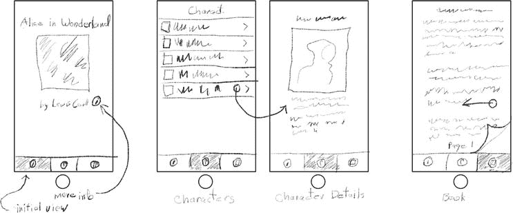

图 12-1. Wonderland 应用设计

中间的标签以表格视图列出书中的角色。点击某一行会转场到一个包含更多信息的详情视图。此界面受导航控制器控制，因此导航栏提供了返回列表的路径。

书籍内容出现在最后一个标签中，即一个页面视图控制器，用户可以在其中通过滑动和点击来翻阅文本。

## 创建 Wonderland

启动 Xcode 并创建一个新项目。（我敢肯定你早就料到这一步了。）这次，基于 `Tabbed Application` 模板创建项目。将应用命名为 `Wonderland`，使用类前缀 `WL`，并将其设为 `Universal`（通用），如图 12-2 所示。

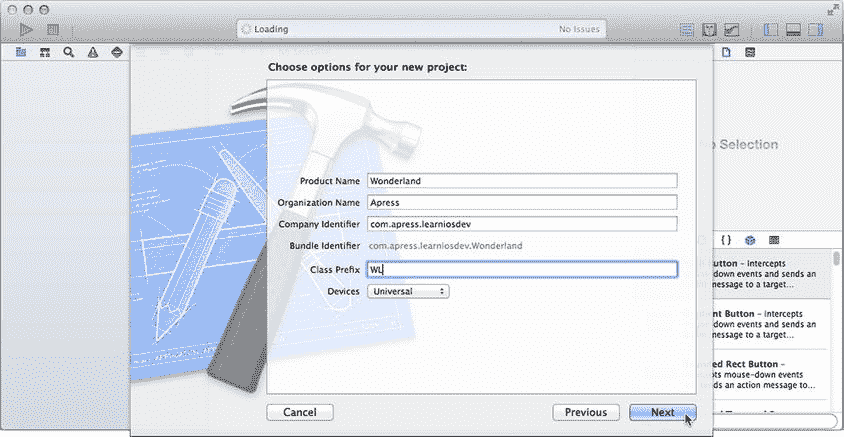

图 12-2. Wonderland 的项目选项

应用呈现的初始视图控制器将是一个标签栏控制器；`Tabbed Application` 模板创建的项目，其初始视图控制器就是一个标签栏控制器。通过巧妙地选择 `Tabbed Application` 模板，你的第一步已经完成。你创建了一个 `UITabBarController` 对象，并将其设置为应用的初始视图控制器。

**提示**

初始视图控制器是应用启动时呈现的视图控制器。你可以在应用委托对象的启动代码中以编程方式创建它，也可以让 iOS 替你呈现它。要实现后者，你需要设置其 `Is Initial View Controller` 属性（见图 12-3）。你可以在 Interface Builder 中通过属性检查器勾选 `Is Initial View Controller` 选项来设置，也可以通过拖动初始视图控制器箭头（在图 12-3 中标签栏控制器对象的左侧显示）并将其连接到你所选的视图控制器来设置。

请记住，标签栏控制器是一个容器视图控制器。它本身并不显示（太多）内容。选择 `Main_iPhone.storyboard` Interface Builder 文件，如图 12-3 所示。标签视图控制器中间的大片空白区域将被其他视图控制器的内容填充。它表明你的标签栏控制器预先配置了两个内容视图控制器：`WLFirstViewController` 和 `WLSecondViewController`。

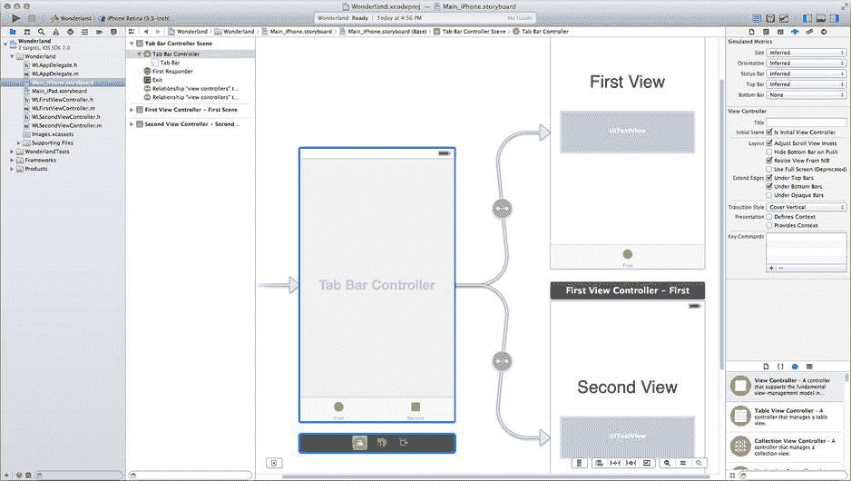

图 12-3. 起始标签栏配置

要使用标签栏，你必须为每个标签提供一对对象：一个要显示的视图控制器和一个标签栏项（`UITabBarItem`），后者用于配置屏幕底部该标签的按钮。每个标签栏项定义了一个标题和一个图标。图标听起来很像资源文件，所以我们就从这里开始。


好的，身为高级文档工程师和翻译员，我将严格遵循您提供的格式和注意事项，将以下英文文本翻译成中文。


### 添加仙境项目的资源

我将让你“稍微”偷个懒，一次性添加本项目所需的所有资源。这样可以避免在开发本章中的每个界面时重复执行这些步骤。现在先全部添加进来，后续用到时我再逐一解释。

在之前的项目中，我让你将单个资源文件添加到项目导航器中的主顶层组（文件夹图标）或`Images.xcasset`资源目录中。本项目的资源文件数量较多，我将让你创建子组，以便管理。组织项目源文件有三种方式：

*   创建一个子组，然后在该组中创建或添加新文件
*   导入源文件的文件夹，并让 Xcode 为每个文件夹创建组
*   等到导航器中文件过多、杂乱不堪时再决定整理它们

若要使用第一种或最后一种方法，请使用 **File** ➤ **New Group**（**文件** ➤ **新建组**）命令（或在项目导航器中右键/按住 Control 键点击）创建一个新的子组。命名新组，然后导入资源文件、创建新源文件或将现有文件拖入其中。开发人员通常按文件类型（所有数据文件放在一个组，类源文件放在另一个组）或按功能单元（一个表格的所有源文件和资源文件放在一个组）来组织组。这取决于个人风格和偏好。

> **提示：**  
> 如果你决定使用最后一种方法（这也是我个人最喜欢的方法），请使用 **File** ➤ **New Group from Selection**（**文件** ➤ **从所选内容新建组**）命令。选择要组织到一个组中的文件，然后选择 **New Group from Selection**（**从所选内容新建组**）。它会创建一个新的子组，并一步将所有选定项移入其中。

当你一次导入大量资源文件时，中间那种方法会很方便。找到 `Learn iOS Development Projects` ➤ `Ch 12` ➤ `Wonderland (Resources)` 文件夹。这些资源文件已被组织到子文件夹中：`Data Resources`、`Character Images`、`Info Images` 和 `Tab Images`。与其将单个文件拖入项目导航器，不如将文件夹拖入项目，一次性导入所有资源文件。先从 `Data Resources` 文件夹中的数据（非图像）文件开始。将该文件夹拖放到 `Wonderland` 组中，如图 12-4 所示。

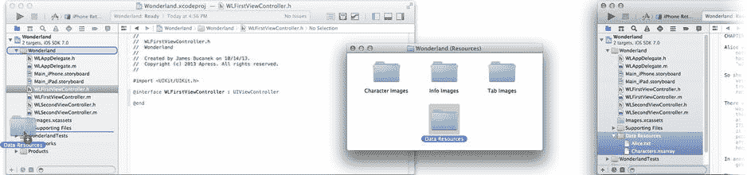

*图 12-4. 添加一个资源文件文件夹*

当导入对话框出现时，确保选中了 `Create groups for any added folders`（为添加的文件夹创建组）选项。这会将每个文件夹中的资源文件变成一个组，如图 12-4 右侧所示。

要对你的图像执行类似操作，请选择 `Images.xcassets` 资源目录项，然后将所有三个图像文件夹（`Character Images`、`Info Images` 和 `Tab Images`）拖入目录的组列中，如图 12-5 所示。这将自动创建三个图像组，如图 12-5 右侧所示。

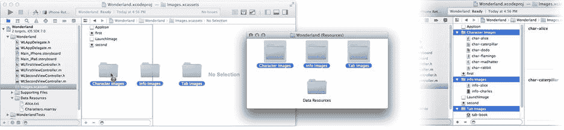

*图 12-5. 导入图像文件组*

为了保持整洁，让我们丢弃一些不需要的残留文件。在资源目录中选择 `first` 和 `second` 图像集。按住 Command 键的同时按下 Delete 键（或选择 **Edit** ➤ **Delete**（**编辑** ➤ **删除**））将这些项从项目中移除。

> **注意：**  
> 你还会在 `Wonderland (Icons)` 文件夹中找到一些应用图标。如果你愿意，可以将它们拖入 `AppIcon` 图像集。

### 配置标签栏项

现在你已拥有所有资源，可以为第一个标签配置标签栏了。标签栏中的每个标签按钮都是通过与其视图控制器关联的 `UITabBarItem` 对象来配置的。你可以在定义该视图控制器的场景中找到此对象。选择 `Main_iPad.storyboard`（或 `_iPhone`）文件。找到并展开第一个视图控制器组，如图 12-6 所示。选择 `Tab Bar Item - First` 对象，并使用属性检查器将其标题更改为“Welcome”，并将其图像设置为 `tab-info`。

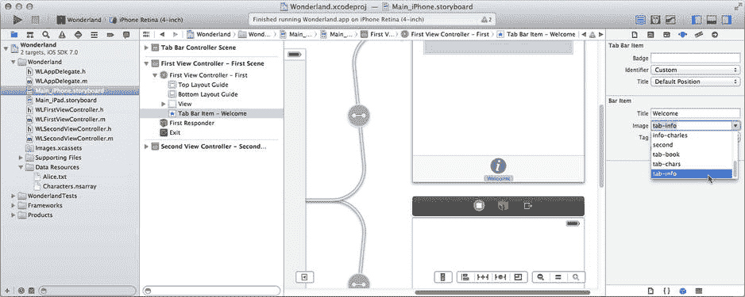

*图 12-6. 配置一个标签栏项*

> **注意：**  
> 标签栏按钮的图像不会“原样”显示。你提供的图像用作模板，从图像的不透明像素创建一个轮廓。因此，不必费心为标签栏按钮图像设计漂亮的颜色，只有透明度才重要。

对于添加到标签栏的每个内容视图，你都将重复这些步骤。现在继续处理第一个标签的内容。

## 第一个内容视图控制器

第一个标签展示了一个基于 `UIViewController` 的简单内容视图控制器。Xcode 模板已经创建了一个自定义视图控制器（`WLFirstViewController`）并将其附加为第一个标签的内容。这几乎完全符合你的要求，所以清空它并打造成你自己的。

选择 `Main_iPad.storyboard`（或 `_iPhone`）文件。双击画布中的第一个视图控制器（右上角）以使其成为焦点。视图中已经包含一些标签和文本视图对象。选择它们并删除。

> **注意：**  
> 你将先从编辑 iPad 版本的界面开始，主要是为了演示一些 iPad 独有的功能。稍后我将切换到 iPhone 版本，因为它更容易查看。开发两个界面的步骤是相同的。因此，除了少数 iPad 特有的部分外，请按照步骤使用 iPad 或 iPhone 界面进行开发。要开发另一个版本，请返回并再次执行相同的步骤。

使用对象库，添加两个标签和一个图像视图对象。使用属性检查器和尺寸检查器，按如下方式设置它们的属性：

- **第一个标签**  
  文本：`Alice’s Adventures in Wonderland`  
  字体：`System 30.0` (iPad), `System 16.0` (iPhone)
- **第二个标签**  
  文本：`by Lewis Carroll`  
  字体：`System 20.0` (iPad), `System 13.0` (iPhone)
- **图像视图**  
  图像：`info-alice`  
  模式：`Aspect Fit`  
  尺寸：`480` x `480` (iPad), `320` x `320` (iPhone)

> **提示：**  
> 更改对象的文本、字体或图像后，如果其内容不再完全适合其尺寸，请选中它，并使用 **Editor** ➤ **Size to Fit Contents**（**编辑器** ➤ **使内容适配尺寸**）命令。它会调整对象的大小，使其与其包含的图像或文本尺寸完全一致。

排列这些视图，使其看起来类似于图 12-7 中的样子。你将添加一个“信息”按钮，并让它呈现一个模态视图控制器。首先添加按钮。将一个 `Button` 对象拖入你的界面。使用属性检查器将类型更改为 `Info Dark`，并将其定位在“by Lewis Carroll”标签的右侧，如图 12-7 所示。

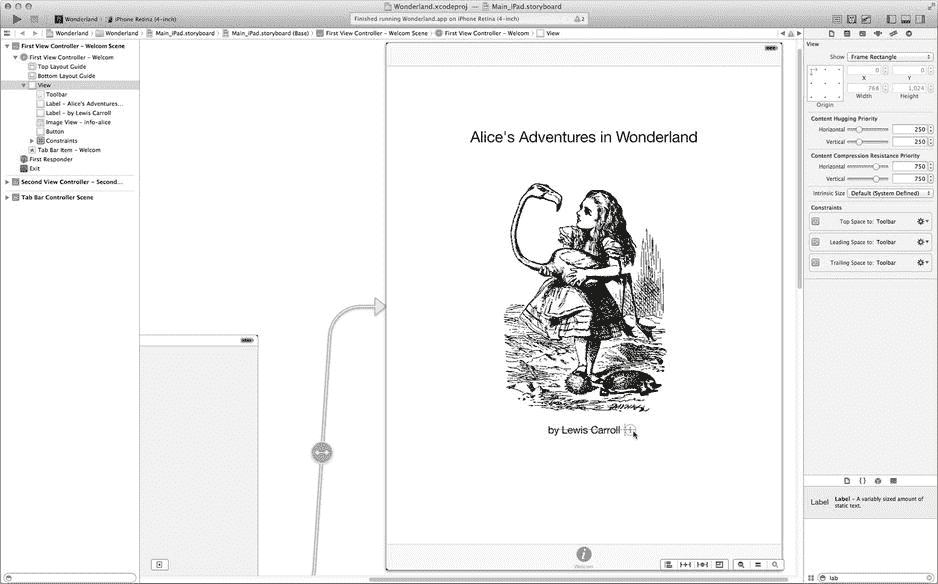

*图 12-7. 创建第一个视图控制器界面*


### 呈现模态视图控制器

要呈现一个视图控制器，你需要一个视图控制器来呈现它。从对象库中，拖拽一个普通视图控制器对象，将其放置在第一个视图控制器的右侧。

通过右键/按住 Control 键点击深灰色信息按钮，然后拖拽到你刚刚添加的视图控制器上，即可创建一个模态过渡，如图 12-8 所示。松开鼠标后，从样式列表中选择 `modal`。

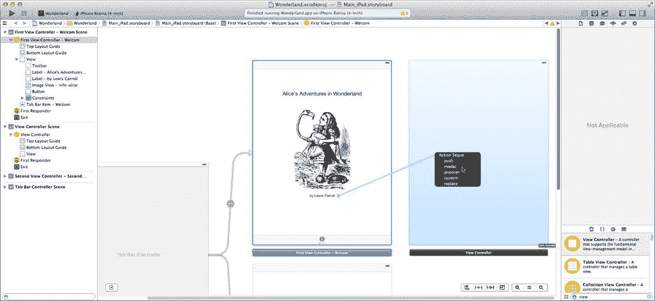

图 12-8. 创建模态转场

刚才发生的事情是这样的：Interface Builder 已将按钮连接到一个为此目的创建的 Storyboard 转场。该转场被配置为执行模态过渡。如果通过编程方式实现，你需要将按钮连接到自己的操作方法，该方法会向第一个视图控制器发送一条 `-presentViewController:animated:completed:` 消息。使用 Storyboard 转场可以省去创建操作和编写代码的步骤。

点击转场连线或连线中间的圆圈来选中该 Storyboard 转场，如图 12-9 所示。使用属性检查器，将呈现样式更改为 `Form Sheet`，过渡样式更改为 `Flip Horizontal`。

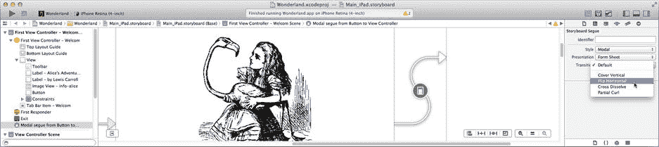

图 12-9. 编辑转场

现在，在新视图控制器中添加一些内容。从对象库中拖入一个图像视图和一个文本视图对象。将文本视图的文本（使用 Option+Return 插入回车符）设置为：

> 刘易斯·卡罗尔，又名查尔斯·路特维奇·道奇森，1832 年 1 月 27 日 – 1898 年 1 月 14 日

将字段的对齐方式设置为居中（中间按钮），并取消勾选 `Editable` 行为。然后选择图像视图，将其图片属性更改为 `info-charles`。选择文本字段对象，然后选择 编辑器 ➤ 适应内容大小。对图片对象重复此操作。（如果你正在开发 iPhone 版本，请选择图像视图并将其大小设置为 `164`x`244`。）将两者都放置在视图底部附近，如图 12-10 所示。

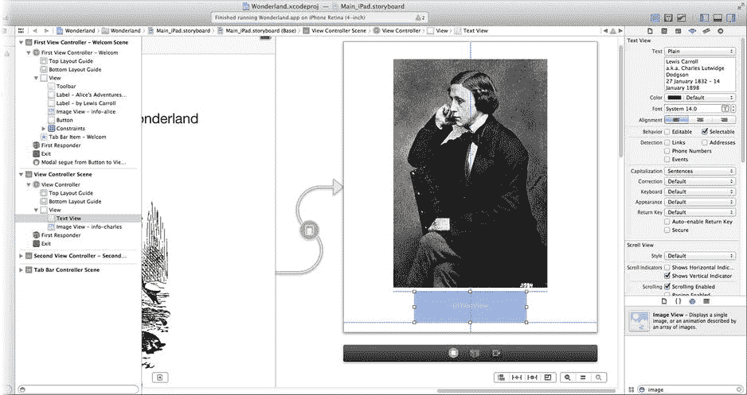

图 12-10. 创建作者信息视图

将项目的 Scheme 设置为使用 iPad 模拟器并运行项目。第一个视图控制器会在你应用的第一个标签页中显示。点击灰色信息按钮会触发到你刚刚创建的视图控制器的过渡，使其以悬浮在屏幕上的“表单页面”形式出现。是不是很酷？

如果应用现在不被卡住，那就更酷了。当模态呈现一个视图控制器时，你有责任提供能将用户返回到上一个视图控制器的界面。现在就添加这个功能。

### 关闭视图控制器

呈现视图控制器的控制器通常负责关闭它。你在 DrumDub 和 MyStuff 应用中已经做过这个操作。你呈现了一个模态选择器视图控制器，允许用户选择图片或歌曲。当操作完成后，它会通过代理消息将选择结果发送给你的视图控制器。该方法获取图片/歌曲后，向自身发送一条 `-dismissViewControllerAnimated:completion:` 消息，导致选择器界面收起。

如果你的模态视图控制器执行类似的操作（例如，让用户选择要入侵的行星，或保龄球的图案），你可以创建一个代理协议——我在第 20 章中解释了如何操作——并在模态视图控制器完成时发送一条完成消息。然后，呈现视图控制器会将其关闭。

然而，这听起来工作量很大，而我很喜欢少干活。在这种情况下，没有需要回传给呈现控制器的信息。你只希望模态视图控制器消失。对此，有一个简单的解决方案。

在项目导航器中，创建一个新的 Objective-C 源文件（文件 ➤ 新建文件...）。基于 Objective-C 类模板。将其命名为 `WLAuthorInfoViewController`。使其成为 `UIViewController` 的子类。确保未勾选`附带 XIB 用户界面`选项。创建新文件。

注意

你不需要为你的新类创建 XIB（Interface Builder）文件，因为你已经在 Storyboard 文件中为它创建了一个。

选择 `WLAuthorInfoViewController.h` 接口文件。在 `@interface` 部分，添加一个操作方法声明：

```
- (IBAction)done:(id)sender;
```

在 `WLAuthorInfoViewController.m` 实现文件中，将方法添加到 `@implementation` 部分：

```
- (IBAction)done:(id)sender
{
  [self.presentingViewController dismissViewControllerAnimated:YES
   completion:nil];
}
```

返回 `Main_iPad.storyboard` 文件。选择你刚创建的视图控制器场景中的视图控制器（通过点击大纲视图或场景底部 Dock 中的视图控制器对象），并使用身份检查器将其类从 `UIViewController` 更改为 `WLAuthorInfoViewController`。向界面添加一个按钮，并将其标题更改为“Done”。（对于 iPhone 界面，你可能需要稍微重新排列视图。）右键/按住 Control 键从按钮拖拽到视图控制器的占位符对象，如图 12-11 所示。将按钮连接到 `-done:` 操作。使用 Storyboard 时，每个场景的关键视图控制器对象方便地位于该场景下方以及大纲视图中。

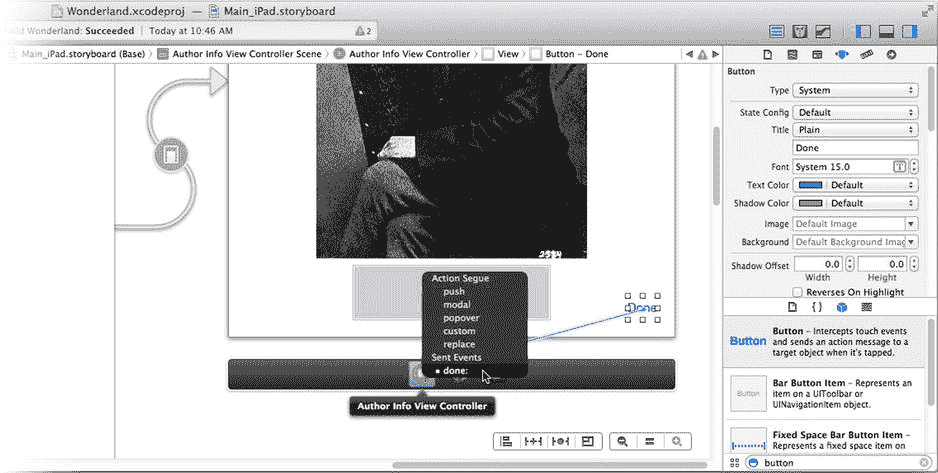

图 12-11. 连接“Done”按钮

再次运行项目。点击信息按钮，模态视图控制器出现。点击“done”按钮，它又会消失。它是如何工作的？很简单。

当一个视图控制器呈现另一个视图控制器时，会形成一种关系。初始视图控制器的 `presentedViewController` 属性被设置为其刚刚呈现的视图控制器。被呈现视图控制器的 `presentingViewController` 属性则被反射性地设置为其呈现视图控制器。`-done:` 方法只是从其 `presentingViewController` 属性中获取呈现它的视图控制器，并代表该对象发送一条 `-dismissViewControllerAnimated:completed:` 消息。

“表单页面”呈现样式仅适用于 iPad。iPhone 版本的转场甚至没有呈现属性。由于这是一个关于书籍的应用，并且你希望两个版本（iPhone 和 iPad）都能类似工作，请选择一种在两个设备上都有效且更具主题性的模态呈现样式。


返回`Main_iPad.storyboard`文件，并选择信息按钮与作者信息视图控制器之间的故事板转场。使用属性检查器，将呈现方式改为`Default`，转场方式改为`Partial Curl`。如果你在 iPhone 界面中，只需将转场设置为`Partial Curl`。

注意

当你更改转场的呈现样式时，Interface Builder 会调整视图控制器的布局大小，以匹配其对呈现时界面大小的最佳预估。你可能需要重新排列视图对象，使其仍位于视图底部。使用`Editor` ➤ `Pin` ➤ `Height/Width`命令固定图像视图的大小，使用`Editor` ➤ `Pin` ➤ `Height`命令固定文本视图的高度。添加这些约束后，在作者信息视图控制器中选择`Editor` ➤ `Resolve Auto Layout Issues` ➤ `Add Missing Constraints`，以建立其余的布局。

再次运行应用。现在点击信息按钮，观察效果，如图 12-12 所示。效果相当炫酷！这个效果同时适用于 iPad 和 iPhone，如图 12-12 右侧所示。

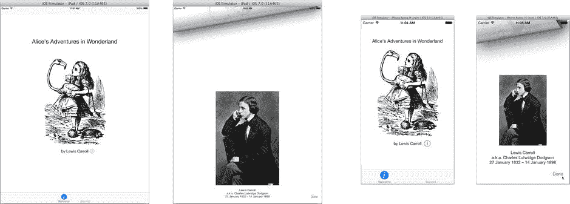

图 12-12. iPad 和 iPhone 的`Partial Curl`转场

恭喜！你的 Wonderland 应用的前三分之一已经完成。你创建了一个自定义视图控制器，用于模态呈现第二个视图控制器，并编写了必要的代码，在视图控制器完成时将其关闭。有许多不同的转场样式可供选择，但模态呈现和关闭视图控制器的基本公式保持不变。现在你可以继续处理第二个标签页了。

## 创建可导航的表格视图

Wonderland 应用的第二个标签页在表格视图中显示一个角色列表。点击某行会导航到一个包含角色详细信息的屏幕。这听起来熟悉吗？确实如此。你已经在第 5 章中构建过这个应用。好吧，你将再次构建它。但这次的重点是导航。

从第 5 章可知，你需要：

*   一个导航视图控制器
*   一个`UITableViewController`的自定义子类（用于表格视图）
*   一个数据模型
*   一个表格视图代理对象
*   一个数据源对象
*   一个表格视图单元格对象
*   一个`UIViewController`的自定义子类（用于详细视图）
*   用于显示详细视图的视图对象

从导航视图控制器开始。导航视图控制器是一个容器视图控制器。它初始显示的视图是其根视图控制器。这个视图是它的主基地；所有导航都从这里开始，并最终返回这里。为了让 Wonderland 应用的第二个标签页呈现一个可导航的表格视图，你需要在标签栏中安装一个导航控制器作为第二个视图控制器，然后在导航控制器中安装一个表格视图控制器作为根视图控制器。这比听起来要简单。

首先，清理一些空间。选择`Main_iPhone.storyboard`（或`_iPad`）文件。一个`WLSecondViewController`已经占据了第二个标签页。你不需要它。在 Interface Builder 画布中选择第二个视图控制器场景并删除它。然后删除`WLSecondViewController.h`和`WLSecondViewController.m`文件。

注意

此时我将切换到 iPhone 界面，以便插图更清晰。如果你想继续开发 iPad 界面，也可以。或者，你可以在 iPhone 故事板中重复 iPad 界面的更改并继续使用。由你决定。

从对象库中，拖入一个导航控制器，并将其放置在第一个视图控制器的下方，如图 12-13 所示。一个新的导航控制器已经预装了一个表格视图控制器，这正是你所需要的。（看，我告诉过你这不会太难。）你还需要一个详细视图，因此再往表格视图旁边拖入一个视图控制器对象。

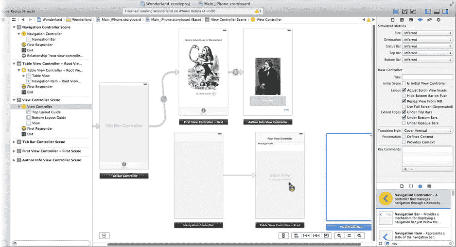

图 12-13. 添加导航控制器、表格视图控制器和视图控制器

要将导航控制器添加到标签栏，请右键/按住 Control 键从标签栏控制器拖动到导航控制器，如图 12-14 所示。当弹出菜单出现时，找到`Relationship Segue`类别并选择`view controllers`。这个特殊连接会将该视图控制器添加到容器视图控制器管理的控制器集合中。标签视图中会出现第二个标签页，并且一个配套的标签栏项对象会被添加到导航控制器的场景中。

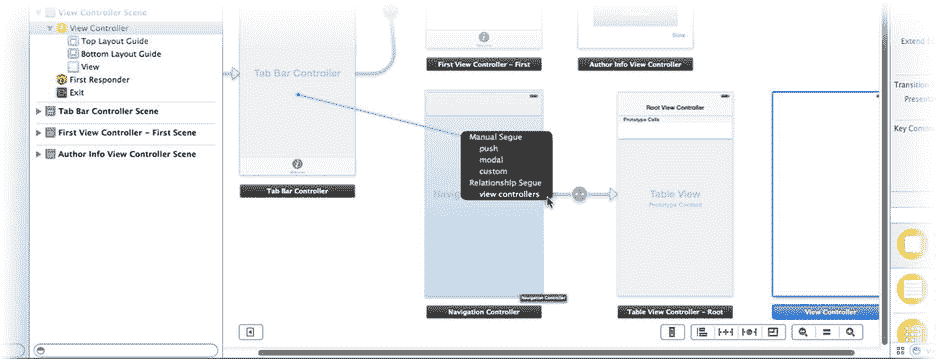

图 12-14. 将导航控制器设为第二个标签页

展开导航控制器大纲中的`Navigation Controller`组，选择标签栏项。使用属性检查器将标题设置为“Characters”，图像设置为`tab-chars`。

现在，你已向标签栏（容器视图）控制器添加了一个可导航的表格视图。它是第二个标签页，拥有标题和图标。点击它将呈现导航（容器视图）控制器内部的表格（内容）视图控制器。听起来很复杂，但故事板使组织变得简单易懂。

### 为表格视图注入数据

你现在可以运行应用，点击`Characters`标签页，然后惊叹于表格视图的空旷。从第 5 章可知，如果没有数据源和一些数据，表格视图将无内容可显示。现在我们来处理这个问题。

你将需要一个`UITableViewController`的自定义子类，因此创建一个。你也知道需要为详细视图创建一个`UIViewController`的自定义子类。既然在操作，不妨也创建它：

在项目的 Wonderland 组中，添加一个新文件。使用 iOS ➤ Cocoa Touch ➤ Objective-C 类模板。将类命名为`WLCharacterTableViewController`，设为`UITableViewController`的子类，不要为新控制器创建 XIB 文件。

再添加一个新文件：使用 Objective-C 类模板。将类命名为`WLCharacterDetailViewController`，设为`UIViewController`的子类，不要为新控制器创建 XIB 文件。

注意

视图控制器可以从单独的 XIB 文件或故事板文件中的场景加载其界面，但不能同时从两者加载。对于本项目，你使用的是故事板文件。

回顾一下让表格视图工作所需完成的任务列表，你现在有了导航控制器以及表格视图控制器和视图控制器的自定义子类。但界面中的对象还不是你的自定义子类。选择`Main_iPhone.storyboard`（或`_iPad`）文件，选择表格视图控制器，使用身份检查器将其类更改为`WLCharacterTableViewController`。对详细视图控制器执行相同操作，将其类更改为`WLCharacterDetailViewController`。


### 创建详情视图

由于您已经在角色详情视图控制器中，请继续创建其界面。使用对象库向角色详情视图控制器添加一个标签、一个图像视图和一个文本视图，操作如下：

**约束条件（iPad）**

-   选中所有三个视图
-   选择 `Editor ➤ Pin ➤ Height`
-   选中图像视图
-   选择 `Editor ➤ Align ➤ Vertically Center in Container`
-   `Control`/右键从顶部标签拖拽到图像视图，添加 `Vertical Spacing` 约束
-   `Control`/右键从底部标签拖拽到图像视图，添加 `Vertical Spacing` 约束

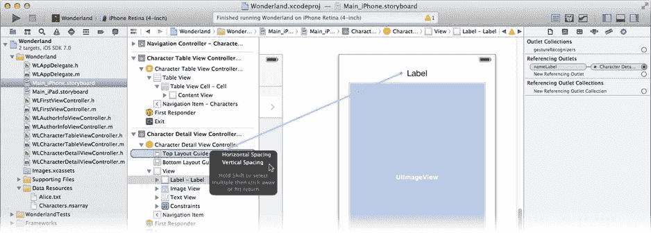

**图 12-16.** 向顶部布局指南添加约束

**约束条件（iPhone）**

-   仅选中标签和文本视图
-   选择 `Editor ➤ Pin ➤ Height`
-   `Control`/右键从标签拖拽到图像视图，选择 `Vertical Spacing`
-   `Control`/右键从图像视图拖拽到文本视图，选择 `Vertical Spacing`
-   `Control`/右键从标签拖拽到 `Top Layout Guide`，如图 12-16 所示，并选择 `Vertical Spacing`
-   `Control`/右键从文本视图拖拽到 `Bottom Layout Guide`，并选择 `Vertical Spacing`
-   选中标签上方的垂直约束，使用属性检查器勾选 `Standard` 选项
-   选中文本视图下方的垂直约束，使用属性检查器勾选 `Standard` 选项

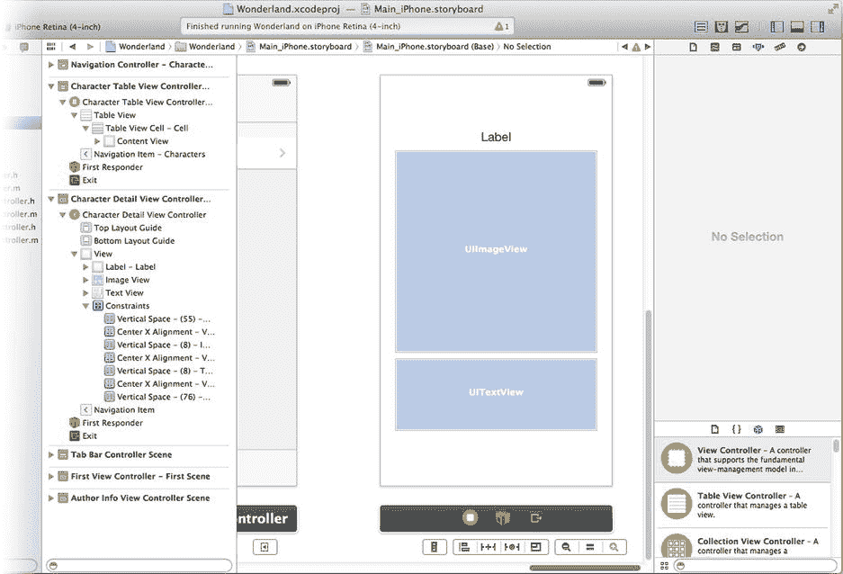

**图 12-15.** 详情视图的粗略位置

**标签**

-   将宽度设为 `420`（iPad）或 `280`（iPhone）
-   将对齐方式设为居中对齐（中间的按钮）
-   固定高度（`Editor ➤ Pin ➤ Height`）

**图像视图**

-   将尺寸设为 `420` x `420`（iPad）或 `280` x `280`（iPhone）
-   将模式设为 `Aspect Fit`
-   固定高度（`Editor ➤ Pin ➤ Height`）

**文本视图**

-   将尺寸设为 `420` x `100`（iPad）或 `280` x `100`（iPhone）

**约束条件（通用）**

-   将三个视图定位在视图中，使其居中且垂直堆叠，大致如图 12-15 所示。
-   使用 Shift 键或拖拽选择矩形选中所有三个视图对象（标签、图像视图和文本视图）
-   选择 `Editor ➤ Pin ➤ Width`
-   选中所有三个视图对象
-   选择 `Editor ➤ Align ➤ Horizontal Center in Container`（注意不是 `Horizontal Center`！）

在 iPhone 上，标签将位于容器顶部，文本视图位于底部，图像视图将调整大小以填充两者之间的空间。在 iPad 上，这三个视图会组合在一起，并在根视图中居中。

这看起来需要很多约束，但它精确描述了当容器视图大小改变时，视图应如何适应。影响该大小有两个因素：不同设备的尺寸，以及您即将引入（在下一节中）的导航栏和标签栏。

您需要为这些视图对象创建插口。切换到辅助编辑器；`WLCharacterDetailViewController.h` 接口文件将显示在右侧。（如果没有显示，请从导航栏中选择 `Automatic ➤ WLCharacterDetailViewController.h`。）

将以下插口声明添加到 `@interface` 部分：

```objectivec
@property (weak,nonatomic) IBOutlet UILabel *nameLabel;
@property (weak,nonatomic) IBOutlet UIImageView *imageView;
@property (weak,nonatomic) IBOutlet UITextView *descriptionView;
```

使用现在出现在属性声明旁边的插口连接器，将它们连接到界面中对应的对象，如图 12-17 所示。

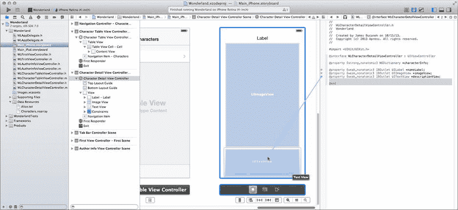

**图 12-17.** 连接角色详情视图插口

### 添加数据模型

还剩下什么？您仍需创建一个数据模型，并为表格视图提供数据源和表格视图单元格对象。从数据模型开始。

我有个惊喜给您。我为您创建了一个数据模型。我是不是很贴心？角色详情信息存储在一个对象数组（`NSArray`）中。数组的每个元素包含一个字典（`NSDictionary`）。每个字典包含角色名称、其图像的文件名以及一段简短描述。所有这些信息都存储在 `Characters.nsarray` 文件中，这是您在本章前面添加的资源文件之一。

**注意：** `Characters.nsarray` 文件是一个序列化的属性列表 XML 文件。您可以在几乎任何纯文本编辑器中打开查看它。我是通过编写一个 OS X 命令行程序来创建此文件的，该程序创建所有字典，将它们组装成一个数组，并将数组写入（序列化）到一个文件中。执行此操作的项目位于 `Learn iOS Development Projects ➤ Ch 12 ➤ WLCharacterMaker` 文件夹中。属性列表和序列化将在第 18 章中解释。

通过创建属性将数据模型添加到您的表格视图控制器，以将数组存储在 `WLCharacterTableViewController.h` 接口文件中：

```objectivec
@property (strong,nonatomic) NSArray *tableData;
```

切换到 `WLCharacterTableViewController.m`，并将以下代码添加到 `-viewDidLoad` 中：

```objectivec
NSURL *dataURL = [[NSBundle mainBundle] URLForResource:@"Characters"
                                         withExtension:@"nsarray"];
self.tableData = [NSArray arrayWithContentsOfURL:dataURL];
```

此代码定位应用资源中的 `Characters.nsdata` 文件，将其作为 `NSArray` 对象读取，并存储在您的 `tableData` 属性中。现在您有了一个数据模型！

### 实现数据源

现在，您需要通过数据源对象将这些信息提供给表格视图。表格视图控制器文件模板包含了所有关键数据源和委托方法的虚拟实现；只需稍作调整。

仍在 `WLCharacterTableViewController.m` 文件中，找到 `-numberOfSectionsInTableView:` 方法并将其删除。您不需要它。您的表格只有一个分区，这是默认设置。

找到 `-tableView:numberOfRowsInSection:` 方法，并将其代码替换为以下内容（以粗体显示）：

```objectivec
- (NSInteger)tableView:(UITableView*)table numberOfRowsInSection:(NSInteger)sec
{
    return self.tableData.count;
}
```

此方法向表格视图提供列表中的行数，即数组中的对象数量。

**注意：** 您可能已经注意到，您尚未将表格视图的 `delegate` 或 `dataSource` 插口连接到表格视图控制器。这是因为您的控制器是 `UITableViewController` 的子类，而该类专为管理表格视图而设计。如果您自己未连接 `delegate` 或 `dataSource` 插口，控制器会自动将自身设置为表格的委托和数据源。这难道不方便吗？


### 定义表格视图单元格对象

最后一块拼图是为表格视图的每一行提供一个表格单元格对象——这相当于表格视图的“橡皮图章”。找到`-tableView:cellForRowAtIndexPath:`方法并编辑它，使其看起来像下面这样（新代码以粗体显示）：

```
- (UITableViewCell *)tableView:(UITableView *)tableView
         cellForRowAtIndexPath:(NSIndexPath *)indexPath
{
    static NSString *CellId = @"Cell";
    UITableViewCell *cell = [tableView dequeueReusableCellWithIdentifier:CellId
                                                           forIndexPath:indexPath];
    NSDictionary *characterInfo = _tableData[indexPath.row];
    cell.textLabel.text = characterInfo[kNameKey];
    return cell;
}
```

这段代码应该看起来很眼熟——除非你跳过了第 5 章。单元格的外观由故事板中的单元格原型定义。切换回`Main_iPhone.storyboard`（或`_iPad`）文件，找到表格视图控制器。

在表格视图的顶部，你会看到一个标注为`Prototype Cells`的区域，如图 12-18 所示。选中第一个空白单元格，使用属性检查器将样式改为`Basic`，将其标识符设置为`Cell`，并将其附件改为`Disclosure Indicator`（见图 12-18）。

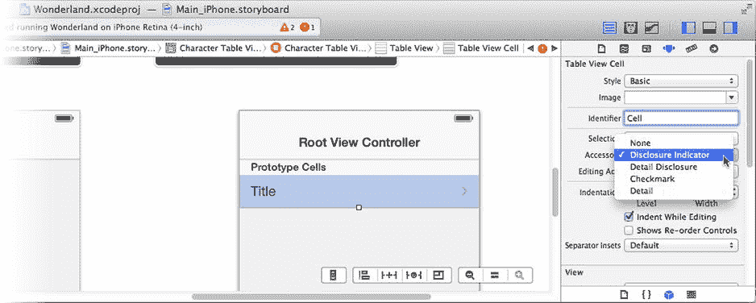

图 12-18. 定义表格单元格

现在，当你的`-tableView:cellForRowAtIndexPath:`方法请求“Cell”表格单元格对象时，它已经就绪。你的代码只需配置单元格的文本即可完成。

`-tableView:cellForRowAtIndexPath:`中的代码仍然显示错误，因为你尚未定义用于从字典中检索值的键。在`WLCharacterTableViewController.h`中，紧跟在`#import`语句之后添加以下代码：

```
#define kImageKey       @"image"
#define kNameKey        @"name"
#define kDescriptionKey @"description"
```

现在你的表格视图已经完成。在模拟器中运行应用，点击第二个标签页，这次你的表格将显示数据模型中的名称，如图 12-19 所示。

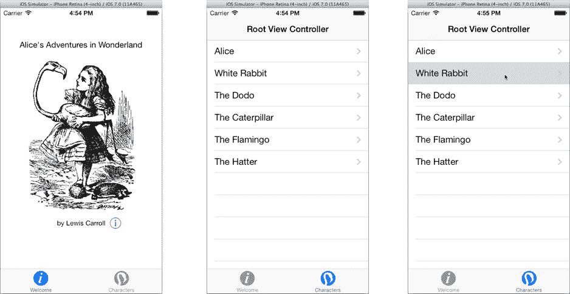

图 12-19. 工作中的表格视图

### 推送详细视图控制器

然而，点击表格中的某一行并没有产生什么效果（见图 12-19 右侧）。这是因为你还没有定义呈现详细视图的动作。另外，表格的标题是`Root View Controller`，这有点“过于直白”。解决第二个问题：选择`Main_iPhone.storyboard`（或`_iPad`）文件，找到角色表格视图控制器，双击导航栏中的标题，将其改为“Characters”，如图 12-20 所示。

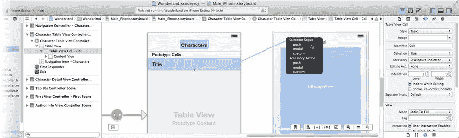

图 12-20. 为表格单元格创建跳转

从原型单元格对象右键/按住 Control 键拖动到角色详细视图控制器（也显示在图 12-20 中）。松开鼠标后，从`Selection Segue`组中选择`push`选项。这将配置所有使用此单元格对象的行，将角色详细视图控制器“推入”导航控制器的堆栈中，并将其作为活动视图控制器呈现。

就像你在第 5 章中所做的那样，你需要一些代码来根据用户点击的行准备详细视图。返回`WLCharacterTableViewController.m`文件。将以下方法添加到你的`@implementation`中：

```
- (void)prepareForSegue:(UIStoryboardSegue *)segue sender:(id)sender
{
WLCharacterDetailViewController *detailsController = segue.destinationViewController;
detailsController.characterInfo = _tableData[self.tableView.indexPathForSelectedRow.row];
}
```

跳转对象包含所涉及的视图控制器的信息（包括来源和目标）。利用它可以获取故事板刚刚创建并加载的详细视图控制器对象。然后，你使用`tableView`对象获取当前选中行的行号——即用户点击的那一行——并据此从数据模型中获取角色详细信息，并通过设置`characterInfo`来配置新的视图控制器。

仍然还有一些未完成事项。列表视图控制器对`WLCharacterDetailViewController`一无所知，并且该控制器还没有一个`characterInfo`属性。这些都是非常简单的任务。首先，紧跟在其他`#import`语句之后添加这个`#import`语句：

```
#import "WLCharacterDetailViewController.h"
```

切换到你的`WLCharacterDetailViewController.h`接口文件，添加一个属性声明来保存单个角色的详细信息：

```
@property (strong,nonatomic) NSDictionary *characterInfo;
```

选择`WLCharacterDetailViewController.m`实现文件。在现有的`#import`语句之后，添加一个新的语句来引入你之前编写的字典键常量（`kNameKey`等）：

```
#import "WLCharacterTableViewController.h"
```

最后，将以下方法添加到`@implementation`中：

```
- (void)viewWillAppear:(BOOL)animated
{
[super viewWillAppear:animated];
self.nameLabel.text = _characterInfo[kNameKey];
self.imageView.image = [UIImage imageNamed:_characterInfo[kImageKey]];
self.descriptionView.text = _characterInfo[kDescriptionKey];
}
```

当视图控制器即将在屏幕上显示时，此代码将用`characterInfo`中的详细信息填充视图对象。在模拟器中运行应用并尝试一下，如图 12-21 所示。

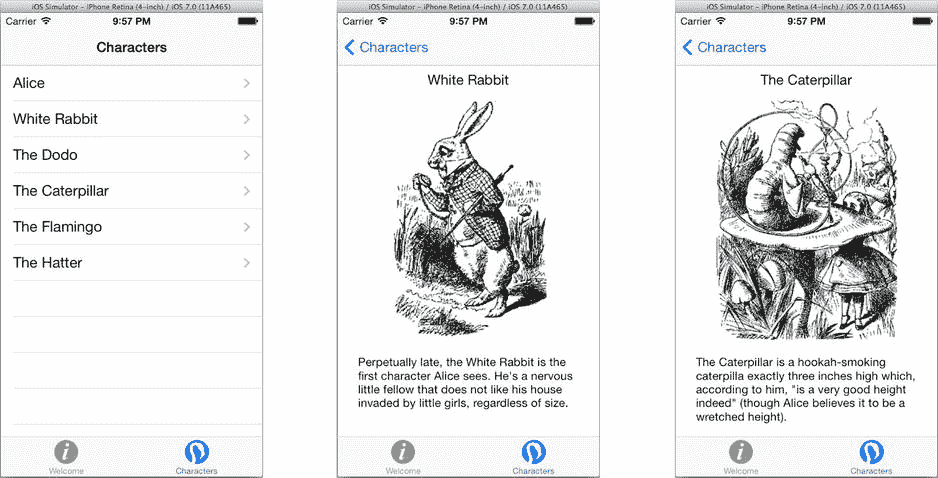

图 12-21. 完成后的角色表格

你的应用现在已完成三分之二。在本节中，你通过将一个表格（内容）视图控制器嵌套在导航（容器视图）控制器中，创建了一个可导航的表格视图。你使用故事板配置了表格的单元格对象，并为其创建了到详细视图控制器的跳转。

到现在为止，你应该对内容视图控制器和容器视图控制器、如何将它们连接在一起，以及如何创建跳转来定义应用的导航感到相当熟悉了。本章的最后部分将向你展示如何使用页面视图控制器。


