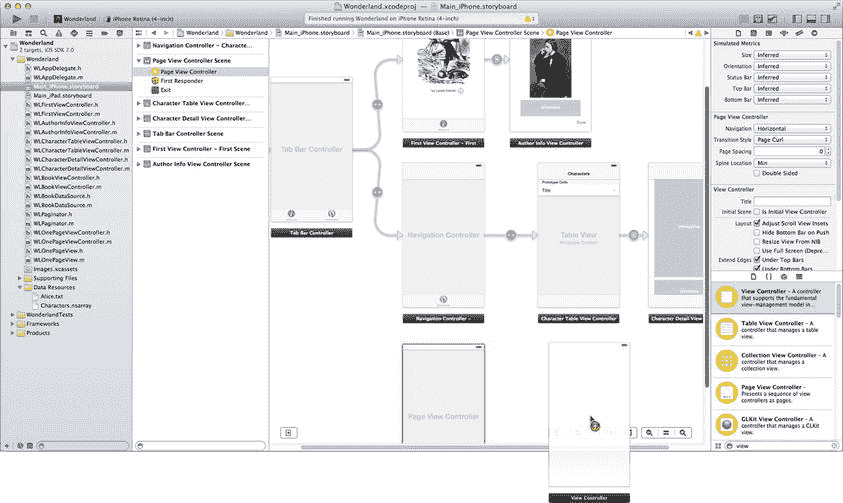
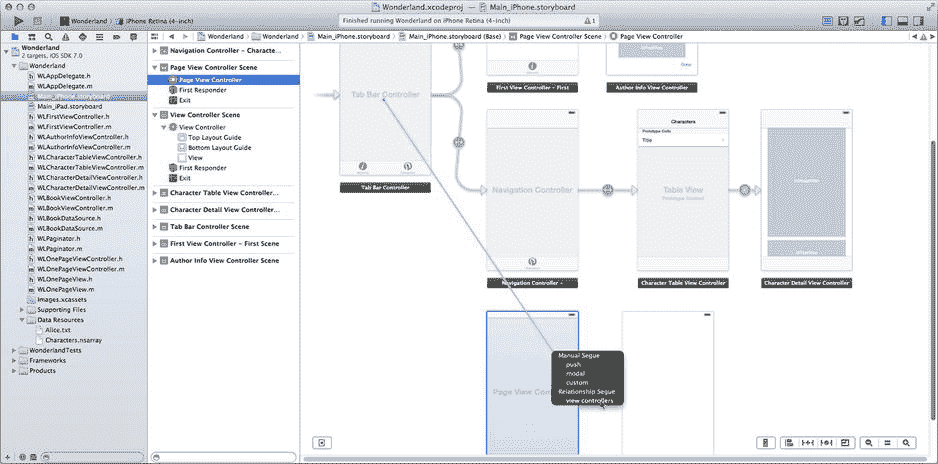
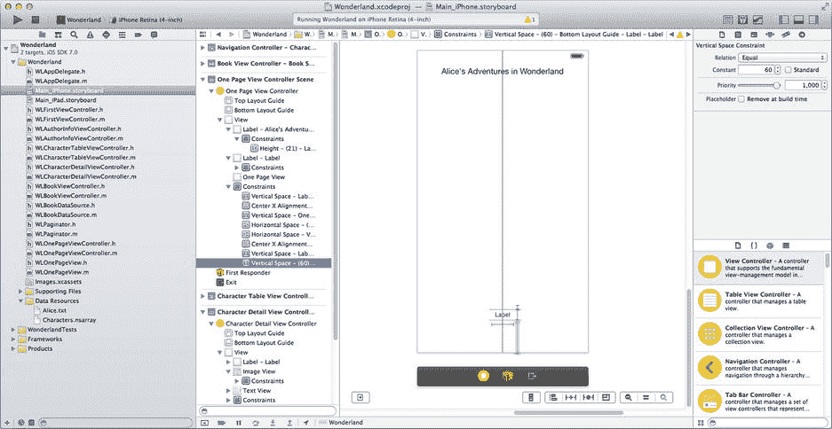
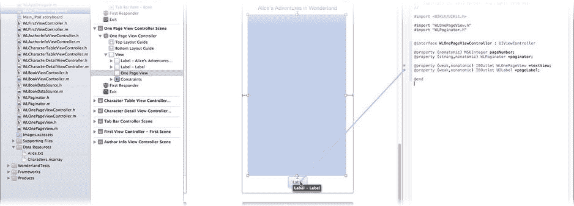
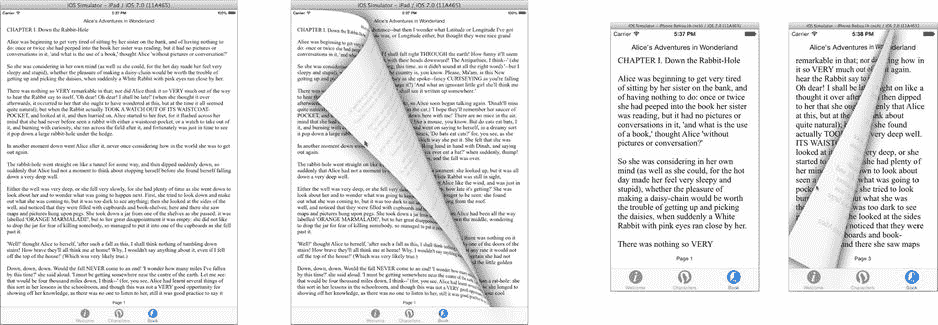

# 创建页面视图控制器

现在你已经进入了 Wonderland 应用的第三个也是最后一个标签页。该标签页将逐页显示书籍文本。这个标签页使用页面视图控制器（`UIPageViewController`）对象。它是一个容器视图控制器，管理着一组（可能非常庞大的）内容视图控制器。每个“页面”由一个或两个内容视图控制器组成。页面视图控制器提供手势识别器，用于执行并动画展示集合中页面之间的导航。

向设计中添加页面视图控制器相当简单。但让它正常工作则是另一回事。页面视图控制器通常需要大量的代码，这个应用也不例外。更刺激的是，你必须先让大部分代码正常工作，页面视图才会有所表现。所以请做好准备，这将是一段漫长的旅程。

你需要创建多个新类，现在就把它们全部创建好。使用“新建文件...”命令在项目的 Wonderland 组中创建新的 Objective-C 类文件。表 12-2 列出了你需要创建的新类、每个类的父类及其角色。创建新的视图控制器类时，请勿创建 XIB 文件。

**表 12-2.** 页面视图类

| 类 | 父类 | 描述 |
|---|---|---|
| `WLBookViewController` | `UIPageViewController` | 你的自定义页面视图控制器版本，负责管理页面视图 |
| `WLBookDataSource` | `NSObject` | 数据源对象，为页面视图控制器提供其所包含的内容视图控制器 |
| `WLPaginator` | `NSObject` | 一个工具对象，封装了确定一页能容纳多少文本的逻辑 |
| `WLOnePageViewController` | `UIViewController` | 内容视图控制器 |
| `WLOnePageView` | `UIView` | 用于显示文本的自定义视图对象 |

正如表格视图和选择器视图需要数据源对象一样，页面视图控制器也是如此。不过，页面视图控制器的数据源并非提供滚轮上的一个值或表格中的一行，而是按需提供它想要显示的视图控制器。

## 添加页面视图控制器

并非全是代码。使用 Interface Builder 创建这两个视图控制器。选择 `Main_Phone.storyboard`（或 `_iPad`）文件。从对象库中拖拽一个新的“页面视图控制器”并将其添加到你的设计中。同时添加一个新的“视图控制器”对象，如图 12-22 所示。将它们排列在其他场景下方。



**图 12-22.** 添加页面视图控制器和单页视图控制器

通过从标签栏控制器向右/按住 Control 键拖拽到新的页面视图控制器，将其添加到标签栏，如图 12-23 所示。选择 `view controllers` 关系。



**图 12-23.** 将页面视图控制器添加到标签栏

与其他标签页的操作一样，选择页面视图控制器场景中的标签栏项。使用属性检查器将其标题设置为“书籍”，标签图标设置为 `tab-book`。

现在配置页面视图控制器本身。选择页面视图控制器对象，使用标识检查器将其类更改为 `WLBookViewController`。切换到属性检查器，仔细检查以下属性是否已设置：

*   导航：`水平`
*   过渡样式：`翻页效果`
*   书脊位置：`最小值`

这些设置定义了一个类似“书籍”的界面，用户可以在视图控制器集合中水平移动，每页显示一个控制器。（如果将书脊位置设置为`中间`，则每页会显示两个视图控制器。）控制器之间的过渡模拟了纸质页面的翻动效果。

## 设计原型页面

现在转向你刚刚添加的普通视图控制器。使用标识检查器将其类更改为 `WLOnePageViewController`。同时，将其“故事板 ID”更改为“OnePage”。最后这一步很重要。此控制器不会在 Interface Builder 中建立连接；你将通过编程方式创建它的实例。为此，你需要一种引用它的方式，而你将使用其故事板 ID 来实现这一点。（这相当于 `UIView` 的 tag 属性。）

完成准备工作后，为单页视图控制器创建界面。从对象库中添加三个视图对象，具体如下：

*   **标签** 字体：`System 15.0` 文本：`爱丽丝梦游仙境` 将其放置在顶部居中（iPhone）或顶部右侧（iPad）
*   **标签** 字体：`System 11.0`（iPhone）或 `13.0`（iPad）对齐方式：居中（中间按钮）放置在底部居中
*   **视图** 放置在两个标签之间，以填充可用空间

**约束条件**

*   选择两个标签对象。固定其高度（编辑器 ➤ 固定 ➤ 高度）。
*   选择两个标签对象。将其居中（编辑器 ➤ 对齐 ➤ 容器中水平居中）。
*   为顶部标签添加一个到顶部布局指南的约束（参考图 12-16）。
*   选择新创建的约束，并使用属性检查器勾选`标准`选项。
*   为底部标签添加一个到底部布局指南的约束。
*   选择新添加的约束（见图 12-24），并将其`常量`设置为 `60`（为屏幕底部的标签栏留出空间）。
*   填充其余约束（编辑器 ➤ 解决自动布局问题 ➤ 在单页视图控制器中添加缺失的约束）。

选择 `UIView` 对象，使用标识检查器将其类更改为 `WLOnePageView`。完成的界面应如图 12-24 所示。



**图 12-24.** 单页视图控制器界面

切换到助理编辑器，在右侧窗格中显示 `WLOnePageViewController.h` 文件，添加两个 `#import` 语句：

```
#import "WLOnePageView.h"
#import "WLPaginator.h"
```

然后在 `@interface` 中添加四个属性：

```
@property (nonatomic) NSUInteger pageNumber;
@property (strong,nonatomic) WLPaginator *paginator;
@property (weak,nonatomic) IBOutlet WLOnePageView *textView;
@property (weak,nonatomic) IBOutlet UILabel *pageLabel;
```

将最后两个属性的输出口连接到屏幕中间的 `WLOnePageView` 对象和底部的小标签对象，如图 12-25 所示。后者将显示页码。



**图 12-25.** 连接页面视图中的输出口

另外两个属性让这个视图控制器知道它正在显示书籍的哪一页，以及一个指向“分页器”对象的引用，该对象决定了该页上的文本内容。综合起来，这就是该视图控制器确定要显示的文本和页码所需的全部信息。


### 编写单页视图

现在，你在 Interface Builder 中能做的几乎都做了。是时候撸起袖子开始编写代码了。这次，从设计的“尾部”开始，逐步向上回溯到页面视图控制器，并在此过程中填充细节。链条中的最后一个对象是 `WLOnePageView`，这个自定义视图负责显示一页的文本。选择 `WLOnePageView.h` 文件。在 `@interface` 中添加两个属性：

```
@property (strong,nonatomic) NSString *text;
@property (strong,nonatomic) NSDictionary *fontAttrs;
```

切换到 `WLOnePageView.m` 实现文件，并编写它的 `-drawRect:` 方法：

```
- (void)drawRect:(CGRect)rect
{
    [super drawRect:rect];
    [_text drawInRect:self.bounds withAttributes:_fontAttrs];
}
```

阅读过第 11 章后，你应该能理解这段代码。当需要绘制自身时，它会用背景色填充视图（`[super drawRect:rect]` 已为你完成了这一步），然后使用存储在 `fontAttrs` 属性中的属性来绘制其 `text` 文本。

这个类的工作就完成了。接下来，我们继续看视图控制器。你已经定义了 `WLOnePageViewController` 类的接口（在 `WLOnePageViewController.h` 中）。选择它的实现文件（`WLOnePageViewController.m`）并填补缺失的代码。

在文件顶部，找到私有的 `@interface WLOnePageViewController ()` 部分，并为 `-loadPageContent` 方法添加一个原型（新代码以粗体显示）：

```
@interface WLOnePageViewController ()
- (void)loadPageContent;
@end
```

`–loadPageContent` 方法负责准备 `WLOnePageView` 对象，以便显示当前控制器页面的文本。现在添加这个方法：

```
- (void)loadPageContent
{
    _paginator.viewSize = _textView.bounds.size;
    if (![_paginator availablePage:_pageNumber])
        _pageNumber = _paginator.lastKnownPage;
    _textView.fontAttrs = _paginator.fontAttrs;
    _textView.text = [_paginator textForPage:_pageNumber];
    [_textView setNeedsDisplay];
    _pageLabel.text = [NSString stringWithFormat:@"Page %u",
                                                    (unsigned int)_pageNumber];
}
```

此方法加载视图的内容。它使用文本视图对象的大小来配置分页器对象。它配置文本视图使用与分页器相同的字体属性，然后向分页器请求当前页面应显示的文本。它还会更新视图底部的页码标签。

其中还包含一点逻辑，用于处理待显示页面已不存在的情况。如果你旋转设备，就会发生这种情况；视图的尺寸会改变，每页的文本会发生变化，书的页数也会改变。在这种情况下，视图会切换到最后一个可用的页面并显示它。

那么，`-loadPageContent` 在什么时候被调用呢？在大多数情况下，这类首次视图设置的代码会从你的 `-viewDidLoad` 方法中调用。但是，每当文本视图的大小发生变化时，都需要调用 `-loadPageContent`，而这种情况随时都可能发生，尤其是在用户改变显示方向时。通过添加 `-viewDidLayoutSubviews` 方法并在控制器的视图布局调整时发送 `-loadPageContent` 消息来解决此问题：

```
- (void)viewDidLayoutSubviews
{
    [super viewDidLayoutSubviews];
    [self loadPageContent];
}
```

你会看到许多编译错误，因为你还没有实现分页器对象。现在来做这件事。

### 分页器

`WLPaginator.h` 的代码在代码清单 12-1 中，`WLPaginator.m` 的代码在代码清单 12-2 中。如果你想复制粘贴解决方案，可以在 `Learn iOS Development Projects` ➤ `Ch 12` ➤ `Wonderland` 项目文件夹中找到已完成代码的源文件。

#### 代码清单 12-1. WLPaginator.h

```
#import <Foundation/Foundation.h>

@interface WLPaginator : NSObject

@property (strong,nonatomic) NSString *bookText;
@property (strong,nonatomic) UIFont *font;
@property (readonly,nonatomic) NSDictionary *fontAttrs;
@property (nonatomic) CGSize viewSize;
@property (readonly,nonatomic) NSUInteger lastKnownPage;

- (BOOL)availablePage:(NSUInteger)page;
- (NSString*)textForPage:(NSUInteger)page;

@end
```

#### 代码清单 12-2. WLPaginator.m

```
#import "WLPaginator.h"

@interface WLPaginator ()
{
    NSMutableArray  *ranges;
    NSUInteger      lastPageWithContent;
    NSDictionary    *fontAttrs;
}

- (NSRange)rangeOfTextForPage:(NSUInteger)page;

@end

@implementation WLPaginator

- (void)resetPageData
{
    ranges = [NSMutableArray array];
    lastPageWithContent = 1;
}

- (void)setBookText:(NSString *)bookData
{
    _bookText = bookData;
    [self resetPageData];
}

- (void)setFont:(UIFont *)font
{
    if ([_font isEqual:font])
        return;
    _font = font;
    _fontAttrs = nil;
    [self resetPageData];
}

- (NSDictionary*)fontAttrs
{
    if (fontAttrs==nil)
    {
        NSMutableParagraphStyle *style = [NSMutableParagraphStyle new];
        style.lineBreakMode = NSLineBreakByWordWrapping;
        fontAttrs = @{
            NSFontAttributeName: self.font,
            NSParagraphStyleAttributeName: style
        };
    }
    return fontAttrs;
}

- (void)setViewSize:(CGSize)viewSize
{
    if (CGSizeEqualToSize(_viewSize,viewSize))
        return;
    _viewSize = viewSize;
    [self resetPageData];
}

- (NSUInteger)lastKnownPage
{
    return lastPageWithContent;
}

#define SpanRange(LOCATION,LENGTH) \
({ NSUInteger loc_=(LOCATION); NSMakeRange(loc_,(LENGTH)-loc_); })

- (NSRange)rangeOfTextForPage:(NSUInteger)page
{
    if (ranges.count>=page)
        return [ranges[page-1] rangeValue];

    CGSize constraintSize = _viewSize;
    CGFloat targetHeight = constraintSize.height;
    constraintSize.height = 32000;

    NSRange textRange = NSMakeRange(0,0);
    if (page!=1)
        textRange.location = NSMaxRange([self rangeOfTextForPage:page-1]);

    NSCharacterSet *wordBreakCharSet = [NSCharacterSet whitespaceAndNewlineCharacterSet];

    while (textRange.location<_bookText.length &&
        [wordBreakCharSet characterIsMember:[_bookText characterAtIndex:textRange.location]])
    {
        textRange.location += 1;
    }

    CGSize textSize = CGSizeMake(0,0);
    CGRect textBounds;
    NSCharacterSet *paraCharSet = [NSCharacterSet characterSetWithCharactersInString:@"\r"];

    while (textSize.height<targetHeight)
    {
        NSRange paraRange = [_bookText rangeOfCharacterFromSet:paraCharSet
            options:NSLiteralSearch
            range:SpanRange(NSMaxRange(textRange),_bookText.length)];
        if (paraRange.location==NSNotFound)
            break;
        textRange.length = NSMaxRange(paraRange)-textRange.location;

        NSString *testText = [_bookText substringWithRange:textRange];
        textBounds = [testText boundingRectWithSize:constraintSize
            options:NSStringDrawingUsesLineFragmentOrigin
            attributes:self.fontAttrs
            context:[NSStringDrawingContext new]];
        textSize = textBounds.size;
    }

    while (textSize.height>targetHeight)
    {
        NSRange wordRange = [_bookText rangeOfCharacterFromSet:wordBreakCharSet
            options:NSBackwardsSearch
            range:textRange];
        if (wordRange.location==NSNotFound)
            break;
        textRange.length = wordRange.location-textRange.location;

        NSString *testText = [_bookText substringWithRange:textRange];
        textBounds = [testText boundingRectWithSize:constraintSize
            options:NSStringDrawingUsesLineFragmentOrigin
            attributes:self.fontAttrs
            context:[NSStringDrawingContext new]];
        textSize = textBounds.size;
    }

    if (textRange.length!=0)
        lastPageWithContent = page;
    [ranges addObject:[NSValue valueWithRange:textRange]];
    return textRange;
}

- (BOOL)availablePage:(NSUInteger)page
{
    if (page==1)
        return YES;
    // （注：原文至此结束，但提供的源码中此方法不完整。）
}
```


`NSRange textRange = [self rangeOfTextForPage:page];`

`return (textRange.length!=0);`

`}`

`- (NSString*)textForPage:(NSUInteger)page`

`{`

`return [_bookText substringWithRange:[self rangeOfTextForPage:page]];`

`}`

`@end`

`WLPaginator` 的具体工作原理并非本章重点，但若你感兴趣，可阅读已完成项目中的注释。从概念上讲，它非常简单。分页器对象通过三部分信息进行配置：书籍的完整文本、绘制文本所用的字体以及显示页面的文本视图尺寸。然后，该对象将书籍文本分割成多个范围，每个范围填充一页。任何视图控制器对象都可以向分页器请求适合其页面显示的文本。

**注意**  
这并非实现分页器最复杂的方式，但足以满足此应用的需求。

### 编写页面视图数据源

你终于接触到了页面视图控制器的核心：页面视图数据源。一个页面视图控制器数据源必须遵循 `UIPageViewControllerDataSource` 协议，并实现以下两个必需方法：

- `pageViewController:viewControllerBeforeViewController:`  
- `pageViewController:viewControllerAfterViewController:`

页面视图最初会显示一个初始视图控制器。当用户向左或向右“翻页”时，页面视图控制器会根据翻页方向向数据源对象发送其中一条消息。数据源以当前视图控制器为参考，检索或创建用于显示下一页（或上一页）的视图控制器。如果没有页面，则返回 `nil`。

你的数据源必须实现这些方法。它还需要一个 `readonly` 属性，该属性返回所有单个视图控制器共用的分页器对象，以及一个用于为任意页面创建视图控制器的方法。因此，你的 `WLBookDataSource.h` 文件应如下所示：

```
#import "WLPaginator.h"
#import "WLOnePageViewController.h"

@interface WLBookDataSource : NSObject <UIPageViewControllerDataSource>

@property (readonly,nonatomic) WLPaginator *paginator;

- (WLOnePageViewController*)pageViewController:pageViewController loadPage:(NSUInteger)page;

@end
```

现在切换到 `WLBookDataSource.m` 实现文件。你需要一个实例变量来存储唯一的分页器对象，因此在 `@implementation` 部分之前添加如下代码：

```
@interface WLBookDataSource ()

{
    WLPaginator *paginator;
}

@end
```

在 `@implementation` 部分，为 `paginator` 属性编写一个 getter 方法，用于懒加载创建该对象：

```
- (WLPaginator*)paginator
{
    if (paginator==nil)
    {
        paginator = [WLPaginator new];
        paginator.font = [UIFont fontWithName:@"Times New Roman" size:18];
    }
    return paginator;
}
```

`pageViewController:loadPage:` 方法是该数据源的核心方法。现在添加它：

```
- (WLOnePageViewController*)pageViewController:(UIPageViewController*)pageViewController loadPage:(NSUInteger)page
{
    if (page<1 || ![paginator availablePage:page])
        return nil;
    
    WLOnePageViewController *controller;
    controller = [pageViewController.storyboard
                  instantiateViewControllerWithIdentifier:@"OnePage"];
    controller.paginator = self.paginator;
    controller.pageNumber = page;
    return controller;
}
```

该方法为书中的任意页面返回一个已配置好的 `WLOnePageViewController`。它首先检查请求的页码是否在书中，如果不在，则返回 `nil`。

然后，它请求故事板对象创建标识符为“OnePage”的场景中包含的控制器和视图。这样做的原因是，在页面视图中，视图控制器之间的导航不使用 Segue 和操作。数据源负责在收到请求时创建它们。

**注意**  
请记住，之前你在故事板中将视图控制器场景的标识符设置为“OnePage”。这就是原因。如果你需要以编程方式从故事板场景加载视图控制器及其视图对象，`instantiateViewControllerWithIdentifier:` 消息就是实现方式。

一旦获得了新的单页视图控制器对象，就将其连接到分页器，并设置它应显示的页码。

剩下要做的就是实现两个必需的数据源协议方法。这些方法也放在你的 `WLBookDataSource.m` 文件中：

```
- (UIViewController *)pageViewController:(UIPageViewController *)pageViewController viewControllerAfterViewController:(UIViewController *)viewController
{
    NSUInteger currentPageNumber = ((WLOnePageViewController*)viewController).pageNumber;
    return [self pageViewController:pageViewController loadPage:currentPageNumber+1];
}

- (UIViewController *)pageViewController:(UIPageViewController *)pageViewController viewControllerBeforeViewController:(UIViewController *)viewController
{
    NSUInteger currentPageNumber = ((WLOnePageViewController*)viewController).pageNumber;
    return [self pageViewController:pageViewController loadPage:currentPageNumber-1];
}
```

由于每个单页视图控制器都存储了它显示的页码，因此这两个方法只需请求当前页之后或之前的页面即可。


### 初始化页面视图控制器

你的书籍应用实现已接近完成。剩下的唯一工作是在页面视图控制器创建时，对其和数据模型进行一些初始设置。切换到 `WLBookViewController.m` 实现文件。首先，创建一个实例变量来存储数据源对象，在文件头部的私有 `@interface WLBookViewController ()` 部分添加以下 `#import` 语句和实例变量（新代码以粗体显示）：

```
#import "WLBookDataSource.h"

@interface WLBookViewController ()
{
    WLBookDataSource *bookSource;
}

@end
```

> **注意：** 之所以需要创建 `bookSource` 实例变量，与自动引用计数（ARC）内存管理系统的一个特殊行为有关。请阅读完成项目中的注释以及第 21 章来了解详细解释。

找到 `-viewDidLoad` 方法，并添加本章节剩余的代码，从以下内容开始：

```
self.dataSource = bookSource = [WLBookDataSource new];
```

此行代码创建并持有数据源对象，并将其设置为该页面视图控制器的数据源。

```
NSURL *bookURL = [[NSBundle mainBundle] URLForResource:@"Alice"
                                         withExtension:@"txt"];
NSString *text = [NSString stringWithContentsOfURL:bookURL
                                          encoding:NSUTF8StringEncoding
                                             error:NULL];
bookSource.paginator.bookText = text;
```

接下来这段代码读取书籍的文本，该文本存储在你在开始时添加的资源文件 `Alice.txt` 中。该文件是一个 UTF-8 编码的文本文件，每行由一个回车符（`U+000d`）分隔。这种格式正是分页器所期望的。整个文本被读入一个字符串并存储在分页器中，分页器将使用该字符串将文本分配到各个页面。

```
[self setViewControllers:@[[bookSource pageViewController:self loadPage:1]]
               direction:UIPageViewControllerNavigationDirectionForward
                animated:NO
              completion:nil];
```

最后一条语句可能是最重要的。它创建了页面视图控制器将要呈现的第一个视图控制器。必须在页面视图控制器出现之前，通过编程方式完成此操作。

> **警告：** 页面视图控制器的初始视图控制器是一个数组。视图控制器的数量必须与页面视图控制器一次性呈现的视图控制器数量完全匹配。如果你将页面视图控制器的书脊位置设置为 `Mid`，则必须提供两个初始视图控制器：一个用于左侧页面，另一个用于右侧页面。

代码量不少，但你已经完成了！运行你的应用并测试第三个标签页，如图 12-26 所示。



**图 12-26.** 正常工作的页面视图界面

你创建了一个真正复杂的应用。部分功劳得益于故事板，它让你能够在单个文件中规划和定义应用的导航结构。但你也学会了如何在需要时以编程方式加载故事板场景。

我建议你稍作停留，回顾一下故事板文件中的场景以及你为支持它们所创建的类。一旦你确信自己理解了视图控制器的组织结构、它们如何协同工作，以及你创建的各个类所扮演的角色，你就可以将自己视为一名一流的 iOS 导航工程师了。

### 使用弹出控制器

有一个特殊的导航类——弹出控制器（`UIPopoverController`）。弹出控制器本身不是一个视图控制器，而是一个工具类，用于在现有视图控制器之上，以浮动窗口的形式呈现另一个视图控制器。第一个视图控制器不会被移除，但在弹出控制器的视图控制器处于活跃状态时，它会被停用。从这个意义上说，它的工作方式与其他任何模态视图控制器类似。

编写弹出控制器并不困难。你在第 7 章中已经做过。既然你现在对视图控制器有了更多了解，你也许想回头复习一下添加的用于在 iPad 上呈现媒体选择器界面的代码。

你也可以使用故事板的 Segue 来创建弹出过渡。当你在 iPad 故事板中创建模态 Segue 时，会获得额外的 `popover` 选项。只需选择此 Segue 类型，故事板就会将你的视图控制器包裹在弹出控制器中进行呈现。

### 高级导航

你已经深入探索了 iOS 导航的海洋，但还没有涵盖所有内容。要更进一步，我建议从两个关键文档开始：Xcode 文档和 API 参考中的 *View Controller Programming Guide for iOS* 和 *View Controller Catalog for iOS*。前者详细解释了视图控制器和导航的基本细节，后者则描述了各个单独的视图控制器子类及其使用方法。

## 总结

你在掌握 iOS 应用开发的征途中已经走了很远。除了最简单的应用，导航都是设计中的重要组成部分，其重要性不亚于应用本身的功能。

在本章中，你获得了使用所有主要视图控制器类的经验：`UIViewController`、`UITableViewController`、`UINavigationController`、`UITabBarController` 和 `UIPageViewController`。更重要的是，你学会了内容视图控制器和容器视图控制器之间的区别，以及如何使用故事板组装和连接它们。你还学习了呈现模态视图控制器的基本原理。你为自己的表格视图技能增添了一些新技巧；你学会了如何使用故事板创建表格视图、配置其单元格对象、创建行选择 Segue，以及使用故事板方法来准备详情视图控制器。你以编程方式创建了存储在故事板文件中的视图控制器，并用它来创建页面视图控制器的数据源。

这是一个巨大的成就。它如此令人兴奋，你应该与朋友们分享。下一章将教你如何做到这一点。


