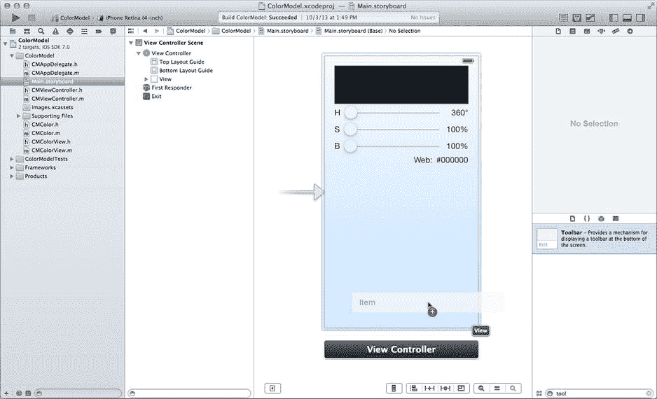

# 13. 网络社交

## 摘要

近年来，社交网络呈爆炸式发展，而移动应用在这场革命中扮演了重要角色。不久之前，在应用中加入社交网络功能还相当困难。如今，iOS 的最新更新让这一过程变得极为简单——基于你对视图控制器的了解，完全可以用"微不足道"来形容。在这本篇幅较短的章节中，你将学会如何：

- 通过 Facebook、Twitter、新浪微博、腾讯微博、Flickr、Vimeo、电子邮件、短信等平台分享内容
- 为不同服务定制内容
- 在屏幕外绘制图像
- 在 Xcode 中重构代码

选择修改哪个应用可能是本章最困难的决定。你认识的人想了解第 2 章中关于超现实主义者的趣闻吗？你当然会想分享第 3 章中的短链接。你的朋友想知道第 4 章中你的 Magic Eight Ball 预测结果吗？你在第 7 章中拍摄了酷炫物品的照片；如果有人想看看呢？为所有这些应用添加分享功能都很容易。最后，我选择扩展第 8 章中的 ColorModel 应用。你花费了大量时间和精力挑选最合适的颜色，我相信你的朋友会感激你与他们分享。

## 色彩（社交）世界

从第 8 章中最终的 ColorModel 应用开始。你将添加一个按钮，用于与外界分享所选颜色。iOS 为此提供了一个标准的"活动"工具栏项，因此直接使用它即可。在 `Main.storyboard` 界面文件中，向视图控制器界面的底部添加一个工具栏，如图 13-1 所示。工具栏自带一个预装的栏按钮项。选中新工具栏，然后选择 Editor ➤ Resolve Auto Layout Issues ➤ Add Missing Constraints。



图 13-1. 添加工具栏和工具栏按钮项

选中随附的栏按钮项，并将其标识符属性更改为 `Action`。


切换到助理编辑器视图（View ➤ Assistant Editor ➤ Show Assistant Editor）。切换到 `CMViewController.h` 文件（在右侧窗格中），并添加一个新操作：

`- (IBAction)share:(id)sender;`

通过将操作连接拖动到按钮上来将操作连接到按钮。我不会为此添加插图，因为如果你到现在还不知道该怎么做，那显然跳过了前面的大部分章节。

### 准备分享内容

首先分享颜色的红绿蓝代码。目前，生成颜色 HTML 值的代码位于 `-observeValueForKeyPath:ofObject:change:context:` 方法（`CMViewController.m`）中。现在你有了另一个需要进行相同转换的方法；考虑重新组织代码，使这个转换更容易访问。将当前颜色转换为其等效的 HTML 值感觉属于数据模型领域，因此将此方法声明添加到 `CMColor.h` 中：

`- (NSString*)rgbCodeWithPrefix:(NSString*)prefix;`

切换到 `CMColor.m` 实现文件，并将新方法添加到 `@implementation` 部分：

```
- (NSString*)rgbCodeWithPrefix:(NSString*)prefix

{

    if (prefix==nil)

        prefix = @"";

    CGFloat red, green, blue, alpha;

    [self.color getRed:&red green:&green blue:&blue alpha:&alpha];

    return [NSString stringWithFormat:@"%@%02lx%02lx%02lx",

            prefix,

            lroundf(red*255),

            lroundf(green*255),

            lroundf(blue*255)];

}
```

现在你的数据模型对象将返回颜色的 HTML 代码，替换 `CMViewController.m` 中的代码以使用新方法。编辑 `-observeValueForKeyPath:ofObject:change:context:` 的结尾，使其看起来如下所示（替换代码以粗体显示）：

```
    else if ([keyPath isEqualToString:@"color"])

        {

        [self.colorView setNeedsDisplay];

        self.webLabel.text = [self.colorModel rgbCodeWithPrefix:@"#"];

        }
```

> **注意：** 我已经提过一次，但值得重申。如果你在重复自己（在多个地方编写相同的代码），请停下来思考如何整合这段逻辑。


