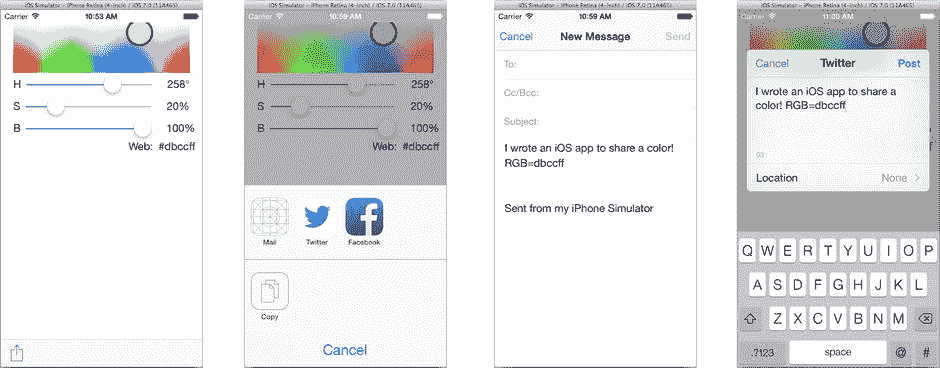
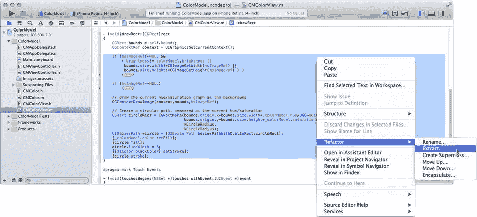
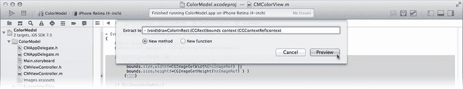
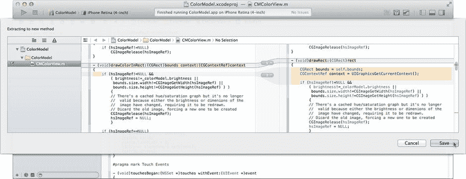
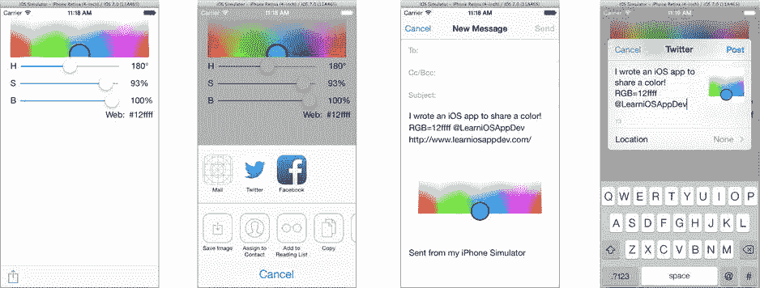
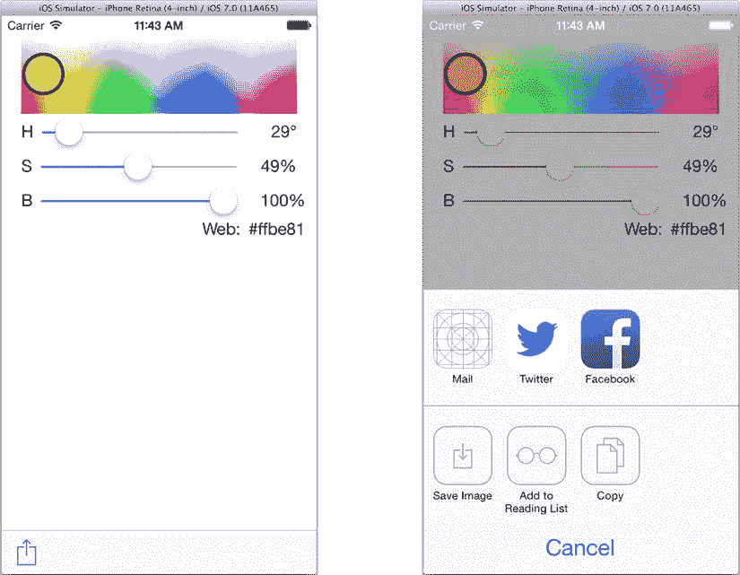
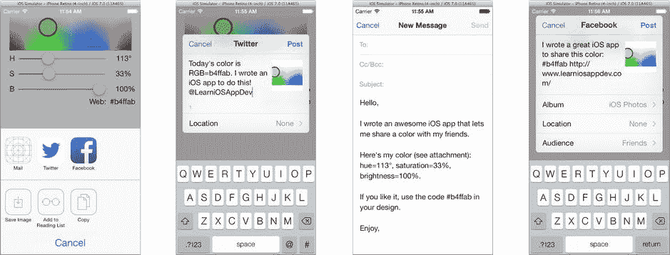

# 显示活动视图控制器

在`CMViewController.m`实现文件中，添加新的操作方法：

```
- (IBAction)share:(id)sender
{
    NSString *shareMessage = [NSString stringWithFormat:
        @"我写了个 iOS 应用来分享颜色！"
        @" RGB=%#",
        [self.colorModel rgbCodeWithPrefix:nil]];
    NSArray *itemsToShare = @[shareMessage];
    UIActivityViewController *activityViewController;
    activityViewController = [[UIActivityViewController alloc] initWithActivityItems:itemsToShare
        applicationActivities:nil];
    [self presentViewController:activityViewController
        animated:YES
        completion:nil];
}
```

该方法首先收集要分享的项目。项目可以是消息（字符串）、图片、视频、文档、URL 等。基本上，你可以包含任何有分享意义的消息、链接、媒体对象或附件。这些内容会被收集到一个单独的`NSArray`中。

接下来的部分同样简单。你创建一个`UIActivityViewController`，并用要分享的项目进行初始化。然后以模态方式呈现该视图控制器。

就这么简单！运行项目并点击分享按钮，如图 13-2 所示。



**图 13-2.** 分享一条消息

> **注意：** 你会看到哪些分享选项，取决于你订阅的服务、所在地区支持的服务，以及苹果本月新增的活动类型。

点击分享按钮会弹出一个选择器，让用户决定如何分享这条消息。虽然你的目标是给应用添加分享功能，但`UIActivityViewController`背后的设计理念是允许用户对你传入的数据项执行任意操作，所有这些操作都在你的应用外部进行。这包括诸如将消息复制到剪贴板之类的操作，这也是它被命名为`UIActivityViewController`而非`UIPokeMyFriendsViewController`的原因。

> **提示：** 你甚至可以创建并添加自己的活动到列表中。创建一个`UIActivity`的具体子类，并将你的活动对象（如果创建了多个，则传入对象数组）传递给`applicationActivities:`参数。

点击 Twitter 活动会显示推文编辑界面。点击 Mail 则会撰写新邮件。每个活动都有自己的界面和选项。有些活动（如复制到剪贴板）则完全没有用户界面；它们只是执行操作然后关闭控制器。

> **注意：** 这是少数模态控制器自行关闭的情况之一。`UIActivityViewController`不通过委托来报告操作结果，你也不需要在其完成后负责关闭它。事实上，要知道它是否执行了某个活动，唯一的方法是在呈现它之前，将一个代码块赋值给其`completionHandler`属性。该代码块会接收两个值：一个描述所选活动的`activityType`字符串（例如`UIActivityTypePostToFacebook`），以及一个布尔值`completed`参数，如果操作成功则为`YES`。

## UIACTIVITYVIEWCONTROLLER 与 IPAD

就像你在第 7 章中使用的照片选择器一样，在 iPad 上你必须以弹出窗口的方式呈现`UIActivityViewController`。这对本应用来说不是问题，因为 ColorModel 只在 iPhone 上运行。对于通用应用——即设计为同时在 iPhone 和 iPad 上运行的应用——你需要检查设备的类型以决定如何呈现视图控制器。你应该将`-share:`方法中的最后一条语句替换为如下代码：

```
if (UIDevice.currentDevice.userInterfaceIdiom==UIUserInterfaceIdiomPad)
{
    UIPopoverController *popover;
    popover = [[UIPopoverController alloc]
        initWithContentViewController:activityViewController];
    [popover presentPopoverFromBarButtonItem:sender
        permittedArrowDirections:UIPopoverArrowDirectionAny
        animated:YES];
}
else
{
    [self presentViewController:activityViewController
        animated:YES
        completion:nil];
}
```

当呈现由点击工具栏中的某个项目触发的弹出窗口时，请使用`-presentPopoverFromBarButton:permittedArrowDirection:animated:`方法。这段代码假设发送`-share:`消息的视图对象（`sender`）就是工具栏按钮项。对于此应用来说这是一个安全的假设，但如果`-share:`是由其他类型的视图对象发送的，你就需要根据情况分别判断并决定调用哪个`UIPopoverController`方法。

## 分享更多内容

我承认，在 Facebook 上分享一个十六进制颜色代码可能不会让你获得很多“点赞”。这实在有点无聊。当你分享颜色时，你真正想分享的是颜色本身。你可以通过为活动视图控制器准备尽可能多的内容来改善用户体验。不仅要包含纯文本消息，还要包含图片、视频、URL 等。多多益善。

遗憾的是，你不能附加`CMColorView`中显示的图像。你费了不少功夫创建了一个漂亮的色相/饱和度图表，并高亮显示了所选颜色。但所有`-drawRect:`代码都是在 Core Graphics 上下文中绘制的；它不是一个可以传递给`UIActivityViewController`的`UIImage`对象。

但真的不能吗？

如果你还记得第 11 章中“从绘图创建位图”一节，可以先创建一个离屏图形上下文，在其中绘制内容，然后将结果保存为图像对象，从而创建一个`UIImage`对象。这样就可以把绘图变成可分享的 UIImage 对象！那么你还等什么呢？


### 提取代码

现在你需要一种方法，用于在图形上下文中绘制色相/饱和度图像。我们将其命名为 `-drawColorInRect:context:`。然后你需要修改 `-drawRect:` 方法，使其调用 `-drawColorInRect:context:` 来绘制 `UIView`。接着，你需要第二个方法来创建屏幕外的图形上下文，调用 `-drawColorInRect:context:` 将色相/饱和度图表绘制到其中，并将结果保存为 `UIImage`。

那么，如何从现在的 `-drawRect:` 方法得到你需要的三个方法呢？Xcode 可以提供帮助！当你遇到类似这样的重构问题时，请查看 Xcode 的“重构”命令。有一个提取工具正是为此场景设计的。它会选取方法中的一段代码，并将其提取到另一个独立的方法（或函数）中。结果是生成一个具有相同逻辑的第二个方法，而原方法会转而调用它。一旦代码被提取出来，你就可以编写其他方法来调用它。

> **注意：**代码重构是一门在*不改变代码行为*的前提下重构代码的艺术（参见 [`refactoring.com/`](http://refactoring.com/)）。你进行重构是为了更好地组织类、简化接口、降低复杂度，或者——如此示例所示——整合并复用代码。

首先在 `CMColorView.m` 中找到 `-drawRect:` 方法。在编辑器中，选择以语句 `if (hsImageRef!=NULL &&` 开头、以方法中最后一条语句结尾的代码，但*不*包括方法的结束花括号 `}`，如图 13-3 所示。重要的是，前两行代码*不要*被选中——稍后你会明白原因。在图中，几个 `if` 语句块已被折叠，以便你看到选定代码的完整范围。



**图 13-3.** 选择要提取的代码。

从**编辑**菜单中选择 **Refactor > Extract...** 命令，或者右键/按住 Control 键单击选中的文本，如图 13-3 所示。提取工具会分析选中的代码，确定代码依赖哪些局部变量，并将这些局部变量转换为参数。然后它会要求你为新方法命名，如图 13-4 所示。



**图 13-4.** 将代码提取到新方法中。

编辑方法声明，使其变为 `- (void)drawColorInRect:(CGRect)bounds context:(CGContextRef)context`，确保选中 **New method** 选项，然后点击 **Preview** 按钮。重构工具会让你预览即将进行的更改，如图 13-5 所示。仔细检查所有更改以确保符合预期，然后点击 **Save** 按钮。



**图 13-5.** 预览重构更改。

提取工具创建了一个新的 `-drawColorInRect:context:` 方法，其中只包含在 `-drawRect:` 中被选中的代码。同时，它重写了 `-drawRect:`，使其变为：

```
- (void)drawRect:(CGRect)rect
{
    CGRect bounds = self.bounds;
    CGContextRef context = UIGraphicsGetCurrentContext();
    [self drawColorInRect:bounds context:context];
}
```

从重构的角度来看，重要的一点是 `-drawRect:` 仍然执行了与修改前完全相同的操作。唯一的区别是，其部分代码已被转移到一个可以被其他方法复用的新方法中。

而这正是你下一步要做的。在 `CMColorView.m` 中添加一个新的属性 getter 方法 `-image`，该方法返回一个 `UIImage` 对象，其中包含 `-drawRect:` 在界面中绘制的相同图像：

```
- (UIImage*)image
{
    CGRect bounds = self.bounds;
    CGSize imageSize = bounds.size;
    CGFloat margin = kCircleRadius/2+2;
    imageSize.width += margin*2;
    imageSize.height += margin*2;
    bounds = CGRectOffset(bounds,margin,margin);
    UIGraphicsBeginImageContext(imageSize);
    CGContextRef context = UIGraphicsGetCurrentContext();
    [[UIColor clearColor] set];
    CGContextFillRect(context,CGRectMake(0,0,imageSize.width,imageSize.height));
    [self drawColorInRect:bounds context:context];
    UIImage *image = UIGraphicsGetImageFromCurrentImageContext();
    UIGraphicsEndImageContext();
    return image;
}
```

新方法首先获取视图对象的现有尺寸。然后创建一个每边都大出 `kCircleRadius/2+2` 的矩形。这样做的目的是，当颜色“点”被绘制到图像中时，如果它靠近色相/饱和度图的边缘，不会被裁剪掉。（所有 `UIView` 的绘制都会被裁剪到视图的边界内。）接着，边界矩形被偏移，使其在图像中居中。

下一步是创建一个屏幕外的绘图上下文，尺寸与最终图像相同。然后你用透明像素（`[UIColor clearColor]`）填充该上下文。这样做是为了确保任何未绘制的像素最终在图像中成为透明像素。接着，你复用刚刚提取的 `-drawColorInRect:context:` 方法来绘制色相/饱和度图和选中的颜色。

最后一步是将绘制到图形上下文中的内容提取为一个 `UIImage`。然后可以丢弃该上下文，并将完成后的 `UIImage` 对象返回给调用者。

切换到 `CMColorView.h` 接口文件，并为新的图像 getter 添加一个 `readonly` 属性声明：

```
@property (readonly,nonatomic) UIImage *image;
```

### 提供更多可分享项目

现在，如果你想获取 `CMColorView` 对象在屏幕上绘制的内容作为图像，只需获取它的 `image` 属性即可。在 `-share:` 方法中使用它。打开 `CMColorViewController.m` 文件，将开头的几条语句修改为以下代码（更改处以**粗体**显示）：

```
- (IBAction)share:(id)sender
{
    NSString *shareMessage = [NSString stringWithFormat:
                              @"我写了一个 iOS 应用来分享颜色！"
                              @" RGB=%@"
                              @" @LearnAppDev",
                              [self.colorModel rgbCodeWithPrefix:nil]];
    UIImage *shareImage = self.colorView.image;
    NSURL *shareURL = [NSURL URLWithString:@"http://www.learniosappdev.com/"];
    NSArray *itemsToShare = @[shareMessage, **shareImage, shareURL**];
}
```

再次运行应用。这次，你向 `UIActivityViewController` 传递了三个项目（一个字符串、一个图像和一个 URL）。注意界面如何变化，如图 13-6 所示。



**图 13-6.** 提供更多可分享项目时的活动。

每个活动对不同类型的数据作出响应。现在你包含了一个图像对象，像**保存图像**和**分配给联系人**这样的活动就会出现。每个活动也可以自由地对你提供的数据类型做出它认为合理的操作。邮件活动会将图像和文档附加到消息中，Facebook 会将图像上传到用户的相册，而 Twitter 可能会将图片上传到图片分享服务，然后在推文中包含该图像的链接。这一切都是全自动的。

> **提示：**如果你好奇哪些活动能处理哪些类型的数据，请参考 `UIActivity` 类文档。其“常量”部分列出了所有内置活动以及每个活动响应的对象类。


### 排除活动

iOS 内置的活动虽然智能，但并非无所不知；它们不知道你数据的意图。活动只知道何时可以对特定类型的数据进行操作，但不知道是否应该操作。如果某些活动作为开发者的你认为不适合你的特定数据组合，你可以显式地排除它们。

你已决定将颜色示例打印出来或分配给联系人毫无意义。（你假设用户没有小红帽、红侠、青蜂侠或其他色彩鲜明人物的联系人。）回到 `CMColorViewController.m` 的 `-share:` 方法中。在创建 `activityViewController` 的语句后立即添加以下语句：

```
activityViewController.excludedActivityTypes = @[UIActivityTypeAssignToContact,
                                                  UIActivityTypePrint];
```

设置此属性会从选择中排除列出的内置活动。再次运行应用。这一次，被排除的活动果然被排除了（见图 13-7）。



图 13-7. 排除部分活动后的效果

## 最小公分母的诅咒

活动视图控制器是 iOS 的一个绝佳功能，而且很可能随着时间的推移变得更好。唯一能说的负面评价就是它太容易使用了。其最大问题在于，没有明显的方式根据用户想要对数据进行的操作来自定义数据项。

举个例证：在开发本章的应用时，我最初在 `CMColor` 类中添加了一个简单的 `-rgbCode` 方法，用于返回颜色的 HTML 代码（`#f16c14`）。问题出在 Twitter 上。在 Twitter 中，所谓的“话题标签”以井号/哈希符号开头，用于标记推文中的关键词。我的颜色（`#f16c14`）会被解释为“`f16c14`”标签，这毫无意义。为避免这种情况，我重写了该方法，以便可以获取带或不带哈希符号的 RGB 值，并特意在传递给 `UIActivityViewController` 的消息中将其省略。这样，如果用户决定通过 Twitter 分享，就不会推送令人困惑的消息。

> **注意：** 新浪微博也使用话题标签，但井号/哈希符号会括住标签（`#Tag#`）。因此，`#f16c14` 在微博上不会是话题标签。

但这只是冰山一角。邮件和 Facebook 的消息长度可能远超 Twitter。为什么你的文本消息或 Facebook 帖子要限制在 140 个字符以内？

### 提供活动特定数据

实际上，iOS 工程师并没有忽视这个问题。有几种方法可以根据用户选择的活动类型来自定义内容。iOS 提供的两种工具是：

* `UIActivityItemSource`
* `UIActivityItemProvider`

第一个是一个协议，你的类需要采用它。任何符合 `UIActivityItemSource` 协议的对象都可以传入要共享的数据项数组中。然后，`UIActivityViewController` 会向你的对象发送以下两条（必需）消息：

```
- (id)activityViewController:(UIActivityViewController *)activityViewController
itemForActivityType:(NSString *)activityType

- (id)activityViewControllerPlaceholderItem:(UIActivityViewController *)activityViewController
```

第一个方法负责将对象的内容转换为你要共享或操作的的实际数据。这条消息的重要性在于，它通过 `activityType` 参数包含了用户选择的活动。利用此参数可以根据用户正在进行的操作来修改你的内容。

对于 `ColorModel`，你将把 `CMViewController` 对象转换为共享消息代理对象。选择你的 `CMViewController.h` 文件。在 `CMViewController` 类中采用 `UIActivityItemSource` 协议（更改部分以粗体显示）：

```
@interface CMViewController : UIViewController <UIActivityItemSource>
```

> **提示：** 如果你有更复杂的转换或多种转换，我建议创建新的类（可能是 `UIActivityItemProvider` 的子类），专门执行转换操作。这将使你能够根据需要轻松开发多种不同类型的转换。

切换到 `CMViewController.m`。添加 `UIActivityItemSource` 的两个必需方法中的第一个：

```
- (id)activityViewController:(UIActivityViewController *)activityViewController
itemForActivityType:(NSString *)activityType
{
    CMColor *color = self.colorModel;
    NSString *message = nil;

    if ([activityType isEqualToString:UIActivityTypePostToTwitter] ||
        [activityType isEqualToString:UIActivityTypePostToWeibo])
    {
        message = [NSString stringWithFormat:
                   @"今天的颜色是 RGB=%@。"
                   @"我为此写了一个 iOS 应用！"
                   @"@LearniOSAppDev",
                   [color rgbCodeWithPrefix:nil]];
    }
    else if ([activityType isEqualToString:UIActivityTypeMail])
    {
        message = [NSString stringWithFormat:
                   @"你好，\n\n"
                   @"我写了一个很棒的 iOS 应用，可以让我与朋友分享颜色。\n\n"
                   @"这是我的颜色（见附件）：色相=%.0f\u00b0，"
                   @"饱和度=%.0f%%，"
                   @"亮度=%.0f%%.\n\n"
                   @"如果你喜欢，请在设计中使用代码 %@。\n\n"
                   @"祝好，\n\n",
                   color.hue,
                   color.saturation,
                   color.brightness,
                   [color rgbCodeWithPrefix:@"#"]];
    }
    else
    {
        message = [NSString stringWithFormat:
                   @"我写了一个很棒的 iOS 应用来分享这种颜色：%@",
                   [color rgbCodeWithPrefix:@"#"]];
    }

    return message;
}
```

此方法执行从对象到活动视图控制器将要共享或使用的实际数据对象的转换。对于此应用，你的控制器将提供要发布的消息（`NSString` 对象）。

你的方法检查 `activityType` 参数并将其与已知活动之一进行比较。（如果你提供了自己的自定义活动，则值将是您给活动起的名称。）对于 Twitter 和微博，它准备一条简短的公告，避免无意中创建任何话题标签，并包含一个类似 Twitter 的提及。如果用户选择发送电子邮件，则准备一条相当长的消息，但不包含提及。对于 Facebook、短信和任何其他活动，则创建一条不担心话题标签的中等长度消息。

找到 `-share:` 方法并更改其开头，使其如下所示（删除 `shareMessage` 并以粗体添加新代码）：

```
- (IBAction)share:(id)sender
{
    UIImage *shareImage = self.colorView.image;
    NSURL *shareURL = [NSURL URLWithString:@"http://www.learniosappdev.com/"];
    NSArray *itemsToShare = @[self, shareImage, shareURL];
```

现在，你不再需要在活动视图控制器显示前准备消息，而是传递你的 `CMViewController` 对象，并承诺提供消息。一旦用户决定要做什么（打印、发推、发消息等），你的视图控制器将收到一条 `-activityViewController:itemForActivityType:` 消息并生成数据。


### 承诺与约定

你可能已经注意到了这里的“先有鸡还是先有蛋”问题：可用的活动类型取决于你传递给活动视图控制器的数据类型。但使用`UIActivityItemSource`时，数据只有在用户选择活动后才会生成。那么，如果活动视图控制器还不知道你的方法计划生成什么样的数据，它又如何知道提供哪些活动呢？

答案是第二个必需的`UIActivityItemSource`方法，现在你需要添加它：

```
- (id)activityViewControllerPlaceholderItem:(UIActivityViewController *)activityViewController
{
    return @"我的颜色信息将在此处显示。";
}
```

该方法返回一个占位对象。虽然它可以是你要分享的实际数据，但并非必须如此。它的唯一要求是：必须与将来`-activityViewController:itemForActivityType:`返回的对象属于同一类。由于你的`-activityViewController:itemForActivityType:`返回的是`NSString`，因此此方法只需返回任意`NSString`对象即可。

**注意**：`-activityViewController:itemForActivityType:`返回的对象应与最终数据对象“功能等价”，即使它们不是同一数据。例如，如果你提供的是`NSURL`对象，那么占位 URL 的协议（如`http:`、`mailto:`、`file:`、`sms:`等）应当保持一致。

再次运行应用，尝试不同的活动，如图 13-8 所示。



**图 13-8.** 活动自定义内容

### 大数据

另一种提供活动数据的技术是创建`UIActivityItemProvider`的自定义子类。该类已经遵循了`UIActivityItemSource`协议，在后台生成应用的数据对象。当活动视图控制器需要应用的数据时，它会设置提供者对象的`activityType`属性，然后请求其`item`属性。你的子类必须重写`-item`方法以提供所需数据，并在需要时引用`activityType`。

`UIActivityItemProvider`适用于创建耗时的大型或复杂数据，例如视频或 PDF 文档。它会在辅助执行线程（而非本书迄今为止所有代码所在的应用主线程）上接收`-item`消息。这允许你的提供者对象在后台准备数据的同时，应用继续运行。这也要求理解多任务处理和线程安全操作，这些主题将在第 24 章中讨论。

简而言之，如果你要分享的数据不是特别庞大、复杂或耗时，或者你对多任务处理尚不熟悉，请坚持使用`UIActivityItemSource`。

## 与特定服务分享

我想用一些关于 iOS 中其他分享服务的说明作为本章结尾，并介绍哪些服务值得使用。

`UIActivityViewController`类相对较新，在很大程度上取代了多个旧的 API。如果你在 iOS 文档中搜索用于发送电子邮件、短信（SMS）或推文的类，很可能会找到`MFMailComposeViewController`、`MFMessageComposeViewController`和`TWTweetComposeViewController`。每个视图控制器都提供一个界面，分别允许用户编写和发送电子邮件、短文本消息或推文。后两者相比`UIActivityViewController`或`SLComposeViewController`（稍后将解释）并无显著优势，因此不建议在新应用中使用。

`MFMailComposeViewController`仍然有一两项特技。它最大的能力是创建 HTML 格式的邮件消息，以及通过填写收件人、抄送和密送字段来预先指定邮件地址。这使你能够创建预先指定地址、富格式的电子邮件，其中可包含 CSS 样式、动画、链接和其他 HTML 内容。

如果你想为用户提供一个发布到特定社交服务的界面（而不是让他们选择），请使用`SLComposeViewController`类。你通过`+composeViewControllerForServiceType:`消息为特定服务（Twitter、Facebook 或新浪微博）创建`SLComposeViewController`对象。然后按照与`UIActivityViewController`相同的方式，用要分享的数据配置该视图控制器，再将其呈现给用户。用户编辑消息后即可发布。

**注意**：要使用`SLComposeViewController`，请在实现文件中添加`#import <Social/Social.h>`导入语句。


