# 14. 网络，技术宅的那种

## 摘要

你可能曾通过（社交）网络众筹书架的最佳颜色，或是寻找下一次旅行的绝佳住处，但对于计算机工程师来说，“网络”的含义则完全不同。数据网络允许计算机系统和设备直接交换信息，这也是便携设备之所以有用的主要原因。（如果你的 `iPhone` 不能打电话、收短信、浏览网页、发送电子邮件或下载应用，那该多么无趣啊？）

本章的目标是向你介绍一些简单的点对点网络技术。“简单”和“点对点网络”这两个词通常不会同时出现。网络技术本身就颇具难度，而点对点网络更是棘手。因此，如果你想开发一款能与其他设备直接交换数据的应用，你有哪些选择呢？

**注意**

点对点意味着两个对等的计算机系统直接相互通信、交换数据，而无需经过消息服务器或网页服务器之类的中介计算机系统。

你的选择是要么花大量时间学习网络通信，要么使用 `GameKit`。`GameKit` 的设计者意识到，如果两个或更多 iOS 用户能坐下来一起玩同一款游戏，那将非常有趣。各个 iOS 应用可以聚集起来，形成一个临时网络。它们可以互相发送实时更新，让所有人都能参与。鉴于构建网络（Wi-Fi、蓝牙等）、协调发现其他玩家、维护玩家之间的连接以及向所有参与者分发消息是多么困难，他们帮了你一个大忙：他们为你编写好了这一切。`GameKit` 会自动完成所有工作。你的应用只需要准备数据即可。

额外的好处是，你将学会 `GameKit` 并创建一个支持 Game Center 的应用。单是这一点就值得阅读本章。一个支持 Game Center 的应用可以与其它玩家联网，在全球排行榜上提交分数，参与挑战等等。在本章中，你将：

*   开发一款单人及双人游戏
*   为你的应用分配一个 ID 并在 `iTunes Connect` 中注册
*   在 Game Center 中为你的应用创建排行榜
*   记录玩家的分数
*   使用 `GameKit` 建立与另一台 iOS 设备的点对点数据连接
*   在两个 iOS 应用之间交换实时数据
*   学习关于加载视图控制器、创建动画以及设定视图控制器支持的屏幕方向的新知识

本章与之前的章节有所不同。你的应用的大部分代码并未列在本章中。游戏的主体代码（实际上对本章的目标而言是次要的）位于 `Learn iOS Development Projects` ➤ `Ch 14` 文件夹中。你的应用将经历多次迭代，每次迭代都在一个子文件夹中。我将描述应用开发的重要元素和里程碑，但不会详细说明所有步骤。

**注意**

要测试 `GameKit`，你必须是一名注册的 iOS 开发者。要测试点对点通信，你必须拥有两台已配置好的 iOS 设备。`GameKit` 的点对点网络功能在 iOS 模拟器中无法工作。

## SunTouch

本章的应用是一款名为 `SunTouch` 的游戏。游戏开始时，画面是一片星域。触摸星域中的某一点，即可在太空中炸出一个洞，如图 14-1 所示。任何隐藏在该区域中的太阳都会被捕获。当你捕获了所有太阳时，游戏结束。这有点像“小行星”游戏与“扫雷”游戏的结合。

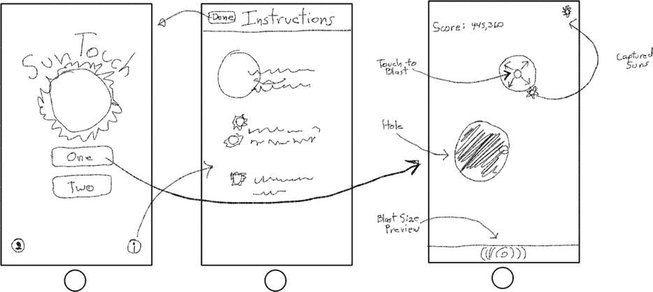

图 14-1. `SunTouch` 设计图

游戏还有两个额外的策略元素。两次爆炸之间等待的时间越长，爆炸的范围就越大。屏幕底部的一个指示器会提示用户爆炸半径将有多大。因此，等待可以获得更大的爆炸范围并提高捕获太阳的几率。与之相对的是，捕获太阳所获得的分数会随时间递减。也就是说，等待捕获太阳的时间越长，获得的分数就越低。这一切是否合理？让我们开始吧。

### 创建 SunTouch

`SunTouch` 的第一个迭代版本位于 `Learn iOS Development Projects` ➤ `Ch 14` ➤ `SunTouch-1` 文件夹中。你的游戏将需要一个开始界面、一个说明界面和一个游戏界面。该应用基于`实用应用`项目模板创建。这个模板包含一个初始视图控制器和一个备用视图控制器，当用户点击小的“信息”按钮时，备用视图控制器就会出现。在 iPad 上，它会以弹出视图的形式呈现。

该项目创建时使用的公司标识符为 `com.apress.learniosdev`，类前缀为 `ST`。到目前为止，公司标识符并不那么重要，但现在它变得重要了。要测试使用了 Game Center 的应用，你必须向 Apple 注册你的应用。要注册，你必须为你的应用分配一个唯一的应用 ID。如果你或你的组织拥有一个互联网域名，你可以将其用作你开发的所有应用的唯一前缀。

你现在还不用担心这个问题。你可以在项目创建后，在项目设置中更改应用的标识符。现在开始思考你想要使用的标识符即可；届时我会向你展示如何更改它。


### 设计初始屏幕

在第一次迭代中，我只完成了界面装饰工作。我在初始视图控制器（`STMainViewController`）中添加了一个背景图形和两个按钮，一个用于开始单人游戏，另一个用于开始双人游戏，如图 14-2 所示。在翻转视图控制器中，我添加了图像视图和文本视图对象，以提供一些基本的游戏玩法说明，也如图 14-2 所示。

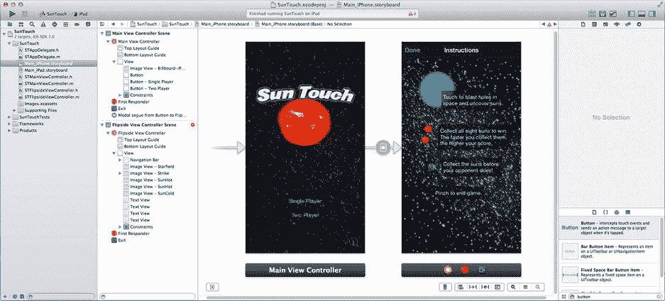

**图 14-2.** 初始界面与翻转界面设计

如果你自己开发这个项目，你需要：

- 基于 `Utility iOS app` 模板创建一个新项目。将类前缀设置为 `ST`。确保未勾选 `Use Core Data`。
- 将 `SunTouch (Resources)` 文件夹中的图像资源添加到你的 `Images.xcassets` 图像目录中。将 `SunTouch (Icons)` 文件夹中的图标资源拖放到目录的 `AppIcon` 组中。
- 在 `Main_iPhone.xib`（或 `_iPad`）文件中，找到翻转视图并按照以下步骤操作：
  - 如果你正在开发 iPad 版本，翻转视图会以弹出框形式呈现。首先选择 `Flipside View Controller`，然后使用属性检查器将其模拟度量大小设置为 `Freeform`。选择根视图，并使用尺寸检查器将其高度设置为 `500`。
  - 添加图像视图和文本视图对象，如图 14-2 所示。使用的图像资源文件是 `Strike.png`、`SunHot.png` 和 `SunCold.png`。文本颜色为 `white`，背景为透明度 50% 的 `black`。
  - 再添加一个图像视图对象，将其图像设置为 `Starfield.png`，模式设置为 `Aspect Fill`，并调整其大小以填充视图。选中该图像视图后，选择**编辑 ➤ 排列 ➤ 置于底层**。这将使星空图像位于其他视图对象之后。
  - 固定带有 `Strike` 图像的图像视图的高度和宽度。对于背景图像视图，添加约束，使其顶部、底部、左侧和右侧边缘分别与 `Top Layout Guide`、`Bottom Layout Guide`、前导容器和尾随容器齐平（距离为 0 像素）。如果你安排其他视图使其在 3.5 英寸的 iPhone 上清晰可见，则无需其他约束。
- 在主视图控制器中：
  - 添加两个按钮对象，分别标记为 `Single Player` 和 `Two Player`。将其阴影颜色设置为 `White Color`。（这使按钮文本在深色背景上更易阅读。）
  - 为下方的按钮添加一个到 `Bottom Layout Guide` 的 `Vertical Spacing` 约束，为上方按钮添加一个到下方按钮的约束，然后将两个按钮在容器视图中水平居中。
  - 添加一个图像视图对象，将其图像设置为 `Billboard-iPhone.png`，并调整其大小以填充视图。将其排列在其他视图之后。使用 **Editor ➤ Pin** 子菜单将其顶部、底部、前导和尾随空间固定到其父视图。
  - 选择 `Main View Controller`（仅限 iPhone 版本），并使用属性检查器将其状态栏选项设置为 `None`。这将隐藏通常显示在屏幕顶部的状态栏信息（电池、Wi-Fi 指示器等）。
  - 在 iPad 版本中，将“Info”导航栏按钮的标题更改为“Instructions”。

> **提示**
>
> 如果你的界面中有一个大的视图对象，请最后创建并放置它。如果你先尝试添加它，那么添加位于其前方的视图将会非常困难——甚至不可能——因为 Interface Builder 会假定前景对象应该是背景对象的子视图，而不是重叠的平级视图。

运行项目并测试翻转视图，如图 14-3 所示。实现此功能的代码由模板提供，可以在 `STMainViewController` 和 `STFlipsideViewController` 类中找到。

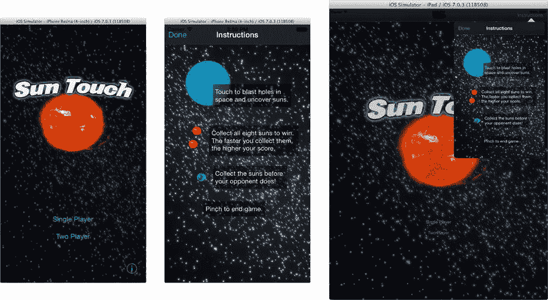

**图 14-3.** 测试游戏说明

到目前为止，游戏看起来相当炫酷。可惜还没有实际的游戏内容。下一步是创建游戏的单人版本。这将成为与 Game Center 集成并添加网络功能的基础。

## 创建单人版本

单人游戏的代码位于 `Learn iOS Development Projects` ➤ `Ch 14` ➤ `SunTouch-2` 文件夹中。此版本的项目添加了 12 个文件：

- `STGameDefs.h`
- `STGameViewController.h`、`STGameViewController.m`、`STGameViewController.xib`
- `STGameView.h`、`STGameView.m`
- `STStrike.h`、`STStrike.m`
- `STSun.h`、`STSun.m`
- `STGame.h`、`STGame.m`

`STGameDefs.h` 是一个头文件，包含大多数其他文件使用的常量、宏和内联函数。在较大的项目中，通常会将所有全局相关的定义收集到一个文件中，供需要它们的模块导入。

当用户点击主故事板中的“single player”按钮时，游戏开始。故事板中添加了一个新的视图控制器，其类更改为 `STGameViewController`，如图 14-4 所示。从单人按钮到新的视图控制器添加了一个模态转场。该转场的标识符被设置为 `singlePlayer`。当 `STGameViewController` 呈现时，游戏开始。

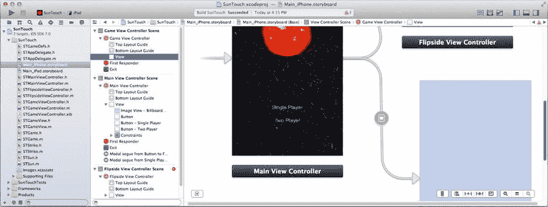

**图 14-4.** 故事板中的视图控制器


### `STGameViewController` 加载

本项目的界面构建器文件组织方式不同寻常。到目前为止，您开发的项目中，所有界面都是在单个故事板文件中设计的。本项目在故事板文件中定义了初始视图和翻转视图的界面。然而，`STGameViewController`的视图对象是在一个单独的`STGameViewController.xib`文件中定义的。视图控制器可以从故事板中的场景、其自身的`.xib`文件获取视图对象，或者以编程方式创建它们。其工作原理如下：

当从故事板加载视图控制器时，它及其视图对象（通常）会同时创建。在需要呈现界面时，视图控制器的视图对象已经存在，因此无需额外操作。这是使用故事板时的典型安排。如果视图控制器被要求呈现其界面，但没有任何视图对象，它会向自身发送`-loadView`消息。`-loadView`方法首先查找控制器初始化时关联的界面构建器资源文件。这适用于当您使用`-initWithNibName:bundle:`方法以编程方式创建视图控制器时。以这种方式创建视图控制器时，建议您明确告知视图控制器包含其界面的文件名。如果视图控制器没有明确的`.xib`文件名，它会尝试加载与其类名相同的界面文件，在本例中为`STGameViewController.xib`。这就是`STGameViewController`在`SunTouch`中加载其界面的方式。最后，如果故事板中没有视图，且无法加载任何`.xib`文件，`-loadView`方法会创建一个空的`UIView`对象作为其视图。

> **注意**：如果您的视图控制器有特殊的视图加载过程，您可以重写其`-loadView`方法，并按照自己的方式创建视图。

在`SunTouch`中，您通过删除故事板中`STGameViewController`的界面，使其从`STGameViewController.xib`文件加载界面。图 14-5 显示了在界面构建器中删除`STGameViewController`的根视图对象。删除后，视图控制器显示为空心，如图 14-5 右侧所示。

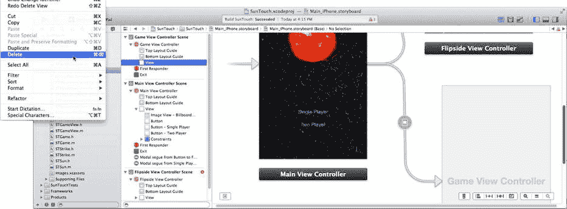

**图 14-5.** 删除`STGameViewController`的视图对象

那么我为什么要这样做？在为通用应用使用故事板时，您必须布局两次界面：一次针对 iPhone，另一次针对 iPad。对于像游戏说明这样的界面，这种方法很好，因为 iPhone 和 iPad 版本差异很大。然而，`STGameViewController`的界面在 iPhone 和 iPad 上效果相同。通过删除故事板文件中的界面，并提供`STGameViewController.xib`文件，iPhone 和 iPad 版本都会加载同一个界面构建器文件。这样您只需维护一个`STGameViewController.xib`文件。您将看到，在实现双人版本游戏时，这能减少您的工作量。

### `SunTouch` 的工作原理

我不会详细解释所有内容，但这里是游戏工作原理的概述。`STGameViewController`中的`-viewDidAppear:`方法通过向自身发送`-startGame`消息来启动一切。`-startGame`会创建一个`STGame`对象（游戏引擎），将其连接到`STGameView`对象，然后启动游戏引擎和打击预览动画。

游戏玩法通过发送给`STGame`对象的消息来实现。当用户触摸屏幕时，一个`-touchInGame:event:`动作会被发送给游戏视图控制器。控制器确定用户触摸的位置，并向游戏引擎发送一条`-strike:radius:inView:`消息。

游戏引擎维护着隐藏太阳的列表。它使用打击坐标和半径来判断一次打击是否会捕获一个太阳。这些打击和捕获事件通过通知（`kGameStrikeNotification`和`kGameSunCaptureNotification`）传递给游戏视图。游戏视图监听这些通知，并创建你在屏幕上看到的动画。

当分数发生变化时，游戏引擎还会发布`kGameScoreDidChangeNotification`通知，并在游戏结束时发布`kGameDidEndNotification`通知。游戏视图控制器和主视图控制器监听这些通知，以更新分数视图并在结束时关闭游戏视图控制器。游戏视图控制器还维持着另外两个动画：使用定时器（`NSTimer`）定期更新分数权重，以及在每次打击后重新启动打击预览动画。

游戏设计中有两个值得关注的方面。首先，是游戏空间坐标系。隐藏太阳的位置、打击的坐标、打击半径的大小等，都使用逻辑坐标系进行存储和计算，其值和距离范围在 0.0 到 1.0 之间。你可能会问“为什么这么做？”因为双人游戏需要在两台 iOS 设备之间转换坐标。两位玩家可能使用不同尺寸的设备，甚至可能处于不同的屏幕方向。通过将所有游戏计算在单位坐标系中进行，这些差异可以被忽略。一个位于单位坐标 (0.25, 0.25) 的太阳，无论屏幕是横向的 iPod Touch 还是纵向的 iPad，它都位于屏幕的左上象限。`STGameView`中的方法（`-pointFromUnitPoint:`等）负责在游戏单位坐标和视图坐标之间进行转换。


### 自定义核心动画

你可能还想关注的其他功能是动画。SunTouch 使用了多个核心动画序列。许多动画采用你在第 11 章中学到的基于块的方法，但有时你需要的动画不是沿直线运行，或者需要使用简单的动画曲线（缓入、缓出、缓入缓出或线性）。在这些情况下，你需要自己创建一个 `CAAnimation` 对象。

查看 `STGameViewController.m` 文件中的 `-startStrikeGrowAnimation` 方法代码。这段代码创建了一个随时间改变击球预览图像视图对象大小的动画：

```
NSMutableArray *times = [NSMutableArray new];
NSMutableArray *values = [NSMutableArray new];
CGRect rect;
for ( float time=0.0f; time<=1.0f; time+=0.1f )
    {
    CGFloat r = STFloor((maxRadius-kStrikePreviewMinRadius)
                        *STSquareRoot(time)
                        +kStrikePreviewMinRadius);
    rect = CGRectMake(0,0,r*2,r*2);
    [times addObject:@(time)];
    [values addObject:[NSValue valueWithCGRect:rect]];
    }
CAKeyframeAnimation* animation;
animation = [CAKeyframeAnimation animationWithKeyPath:@"bounds"];
animation.duration = kStrikePreviewGrowDuration;
animation.beginTime = 0;
animation.calculationMode = kCAAnimationCubic;
animation.keyTimes = times;
animation.values = values;
[previewView.layer addAnimation:animation forKey:@"grow"];
```

这段代码创建了一个关键帧动画（`CAKeyframeAnimation`）对象。`CAKeyframeAnimation` 是 `CAAnimation` 的子类，用于管理动画序列。关键帧动画在动画过程中的特定时间点定义了几个参考值。然后动画对象可以通过在关键帧值之间插值来计算出一个连续的数值曲线。一个 `CAKeyframeAnimation` 对象几乎可以对视图对象的任何属性进行动画处理：其框架、中心点、背景颜色、旋转、缩放、透明度、投影、Core Image 颜色滤镜等等。通过创建一系列关键帧值，你可以创建任何你想要的动画曲线。你可以让视图弹跳、闪烁、循环绕圈、脉冲或像钟摆一样摆动。

在此应用中，关键帧定义了一个对数式的大小变化。代码计算了 11 个等距时间点（从 0.0 到 1.0，步长 0.1）的关键帧值。每个关键帧的值是视图的 `bounds`，它基于经过的时间进行缩放，并取平方。中间值使用三次插值计算，这将非常接近实际的对数曲线；虽然不完美，但已经足够好了。

一旦动画对象配置了关键帧值和时间列表，它就会被附加到视图对象的 `layer` 属性上。请记住（从第 11 章中），`UIView` 对象是由 `CALayer` 对象构建而成的。实际显示在界面中的是 `CALayer` 对象，并且它是可以被动画化的对象。

### 开始游戏

运行应用并尝试一下，如图 14-6 所示。单人游戏将在模拟器或任何配置好的设备上运行。

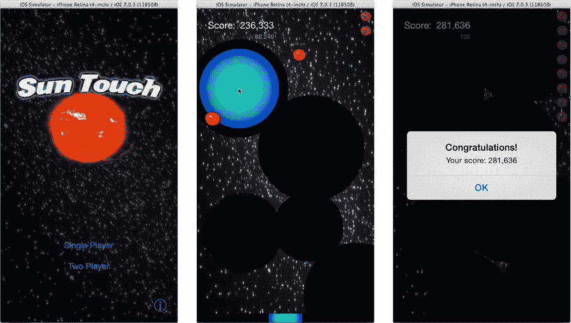

**图 14-6.** 单人游戏

注意：虽然在屏幕上使用核心动画来甩动 `UIImageView` 对象对于本项目来说已经足够，但我怀疑是否有人使用类似技术创建过任何杀手级的 iOS 游戏。如果你对创建游戏感兴趣，应该研究一下诸如 Sprite Kit（iOS 7 新增）、OpenGL 或许多为 iOS 开发的游戏引擎等技术。游戏引擎是第三方（理解为“非苹果公司编写”）框架，它们使得编写精彩游戏变得更加容易。Apress 出版了多本关于 iOS 游戏开发的书籍。

我建议你花一些时间探索这个项目。首先观察界面元素如何工作：击球动画、之后留下的洞、太阳捕获动画、更新的得分和重量标签，以及击球大小预览。然后追踪实现这些功能的消息传递，直到你对整个应用的工作原理感到满意为止。理解击球如何发送给游戏（`STGame`）以及游戏如何发送太阳捕获消息，对于你后续学习双人版本将非常重要。

下一步是将 GameKit 添加到你的应用中，并将其与 Game Center 集成。

## 接入 Game Center

Game Center 是苹果公司提供的一项服务，用于通过社交网络增强你的游戏。与 Game Center 配合使用的应用被称为支持 Game Center。Game Center 最显眼的部分是其排行榜，这是一个公开的记分牌，显示来自全球的最高分玩家。你已完成的游戏里程碑（称为成就）也会在此公布。

多人游戏可以使用 Game Center 来邀请和连接其他玩家。这个过程称为配对。配对可以通过互联网大范围进行，适用于可以在任意距离外进行的慢速游戏。或者，你的应用可以与附近的 iOS 设备（技术上，在同一 Wi-Fi 子网或蓝牙范围内）配对，创建用于实时动作游戏的直接数据连接。

你可以自行选择在游戏中支持哪些 Game Center 功能。你可以添加所有这些功能，或者只添加一个。对于 SunTouch，你将添加两项功能：排行榜得分和本地配对。为此，你必须让你的应用能够使用 Game Center，并为你的游戏配置 Game Center。


### 配置支持 Game Center 的应用

在应用中启用 Game Center 包含多个步骤：配置应用项目、配置 iTunes Store，以及在应用中添加特定代码。具体来说，你必须完成以下操作：

- 为应用分配唯一 ID
- 向 Apple 注册此唯一 ID
- 向 Apple 注册应用并为其分配此唯一 ID
- 在 Game Center 中配置应用将使用的排行榜和成就
- 添加应用使用 Game Center 服务器所需的数字证书
- 将应用链接到 GameKit 框架
- 将 `"gamekit"` 作为应用的一项能力
- 添加代码以登录当前玩家
- 添加按钮，使用户能在应用内访问 Game Center 排行榜
- 开启多人游戏时请求配对
- 向 Game Center 发送分数和成就
- 创建测试玩家账户，并在沙盒环境中测试游戏

这些步骤听起来很多，但并无特别难处，Xcode 会为你完成其中大部分工作。

从应用项目开始。在导航器中选中项目，切换到 `General` 标签页，找到 `Identity` 组，如图 14-7 所示。它应该位于顶部位置。

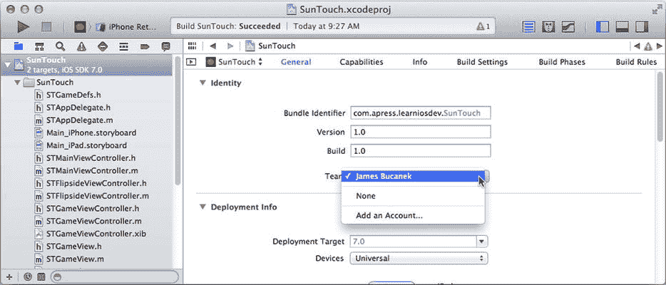

图 14-7.

编辑应用 ID

Bundle Identifier 在整个 iOS 应用世界中唯一标识你的应用。该标识符可以是任何（符合 RFC1034 规范的）名称。如果你（或你的公司）拥有互联网域名，建议基于该域名设置应用标识符，以减少他人尝试使用相同标识符的可能性。你还可以添加子域名，以便将应用分组管理。

> **注意**
>
> RFC1034 是详细描述域名书写规范的文档。RFC（Request For Comment，请求评论文档）由网络工作组管理。RFC 文档最初以提案形式出现（因此得名）。一旦获得批准并被采纳，它便成为互联网的“法律”。

无论你选择什么基础标识符，Xcode 都会追加应用的产品标识符来构成完整的 ID。因此，如果你将项目命名为 SunTouch，并输入基础 Bundle Identifier `com.mycompany.games`，则应用的 ID 将为 `com.mycompany.games.SunTouch`。

现在，修改你项目的 Bundle Identifier，使应用拥有唯一 ID。只有完成此操作，你才能注册应用。

你还需要从弹出菜单中选择一个团队，也如图 14-7 所示。应用的标识符将归属于与所选团队关联的 iOS 开发者账户，并指定允许安装和测试应用的团队成员。如果你尚未将 Xcode 连接到你的 iOS 开发者账户，请选择“添加账户...”命令，Xcode 将带你进入偏好设置的账户面板，你可以在那里完成连接。

### 启用 Game Center

仍在 SunTouch 目标的属性中时，切换到 `Capabilities` 标签页，如图 14-8 所示。找到 `Game Center` 组并将其开启。只需单击一下，Xcode 便会为你完成以下操作：

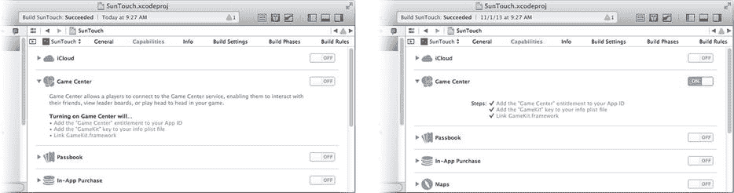

图 14-8.

启用 Game Center

- 根据应用的 Bundle Identifier 生成唯一的应用 ID
- 连接 iOS 开发者中心并向 Apple 注册新 ID
- 为新 ID 启用 Game Center 服务
- 下载必要的 Game Center 授权和数字证书，并将这些资源安装到应用项目中
- 将 `"gamekit"` 键添加到应用的必需设备功能中
- 将应用链接到 GameKit 框架

> **注意**
>
> 所有这些步骤都可以手动完成，无论是在项目设置中，还是通过 iOS 开发者中心。

看，我告诉过你很多步骤很简单。如果你想查看 Xcode 在开发者中心执行了哪些操作，请登录 [`http://developer.apple.com/devcenter/ios`](http://developer.apple.com/devcenter/ios)，点击 `Certificates, Identifiers & Profiles` 部分，再点击 `Identifiers`。开发者门户将列出你账户下注册的所有标识符。点击 Xcode 生成的标识符，如图 14-9 所示。

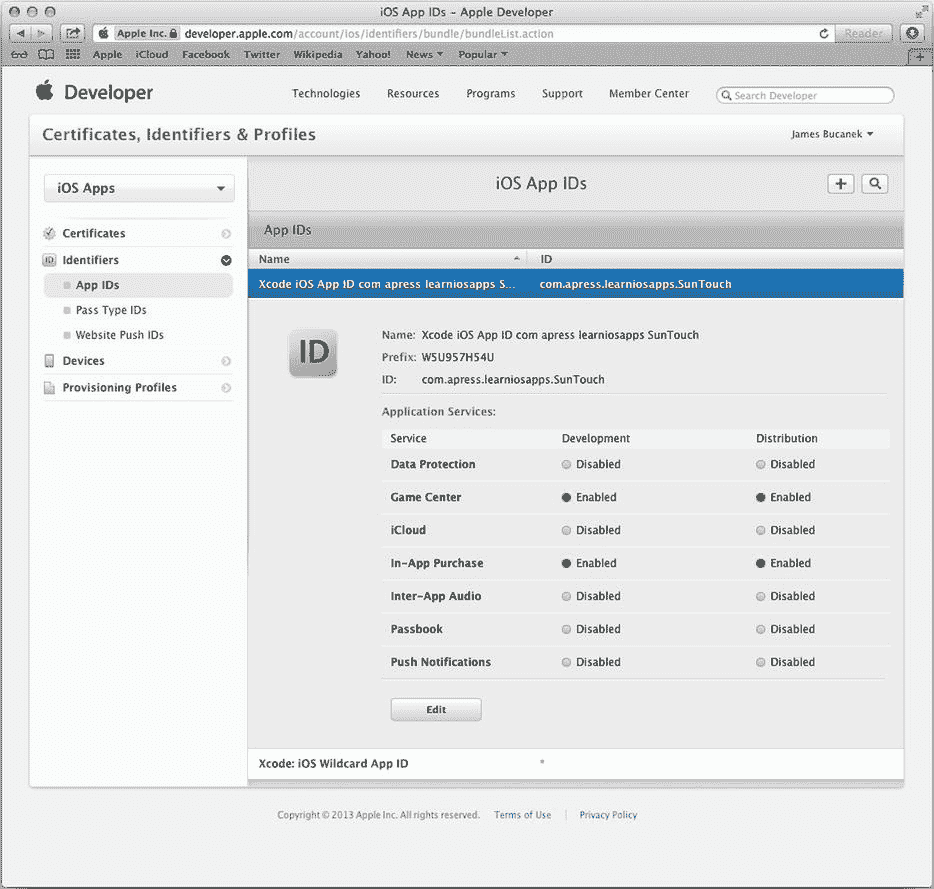

图 14-9.

已注册的应用 ID

应用的完整 ID 由唯一的 Prefix（由 Apple 生成）和应用 ID 拼接而成。请注意，Game Center 服务已启用并关联到此应用 ID。Xcode 生成的 ID 名称（`Xcode iOS App ID com apress learniosapps SunTouch`）虽然不太直观，但你随时可以点击 Edit 按钮进行修改。标识符的名称仅用于在 iOS 开发者中心管理 ID；它不会出现在你的应用或用户面前。在编辑 ID 页面中，你还可以手动禁用或启用与此 ID 关联的服务。

下一步是在 Game Center 中配置你想要的排行榜。排行榜用于发布游戏分数。但在那之前，你必须在 iTunes App Store 中创建一个应用。


### 在 iTunes Store 中创建应用

下一步是在 iTunes Store 中注册您的应用。如果您以为刚才已经完成了这一步，那您理解错了。刚才您做的只是注册了一个 ID。现在您需要将这个 ID 分配给一个应用。

登录您的 iOS 开发中心账户（`http://developer.apple.com/devcenter/ios`）页面，找到 `iTunes Connect` 链接。`iTunes Connect` 是您用于在 iTunes Store 中处理事务的门户。它也是您设置和配置其他在线支持服务的地方，例如 Game Center、应用内购买、广告和订阅应用（杂志）。

登录 `iTunes Connect` 后，找到并点击 `Manage Your Apps`（管理您的应用）链接。这将列出您已在 App Store 注册的所有应用。应用在出现在 App Store 之前，需要经历注册、配置、提交和批准的过程。要使用 Game Center 测试应用，您必须注册并配置您的应用。点击 `Add New App`（添加新应用）按钮并填写详细信息，如图 14-10 所示。

> **注意：** 如果您之前从未使用过 `iTunes Connect`，它可能会询问关于公司名称以及您希望其在 App Store 中如何显示的其他问题。基本上，如果门户要求提供本节未提及的额外信息，您如实提供即可，然后继续操作。

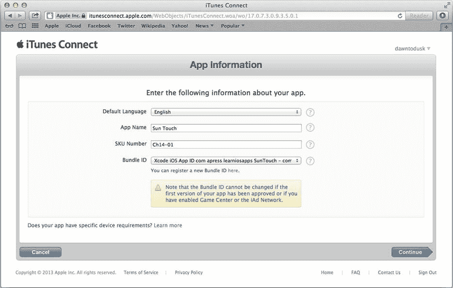  
*图 14-10. 在 App Store 添加新应用*

选择默认语言并为您的应用命名（“Sun Touch”）。这是您的应用在商店中显示的名称。您必须为应用分配一个 SKU 编号，当然它可以是你选择的任何标识符。它只需要在您开发的应用中是唯一的，并且苹果公司除了用于报告之外，不会将它用于其他任何用途。

最后，从弹出菜单中选择您在上一节创建的捆绑包 ID。如果您忘记创建唯一的 ID，这里有一个方便的链接，可以带您回到 `Certificates, Identifiers & Profiles`（证书、标识符与描述文件）页面，以便纠正这个疏忽。

接下来，系统会引导您进入一系列界面，让您设置应用的上市日期、价格、类别、内容警告信息、所需的 App Store 图标和屏幕截图、应用描述等等。除非您真的打算在 App Store 上发布某个版本的 `SunTouch`，否则无需过分关心这些答案。所需上传文件（图标和屏幕截图）可以在 `Learn iOS Development Projects` ➤ `Ch 14` ➤ `SunTouch (iTunes Connect)` 文件夹中找到。

> **警告：** 这是您为通过苹果 App Store 分发任何应用而需要执行的确切步骤。创建应用记录后，您有（截至撰写本文时）大约 180 天的时间来提交应用供批准。如果等待时间过长，苹果公司可能会自行决定从 `iTunes Connect` 删除您的应用，并禁止您将来使用该应用名称。

完成后，您的应用将出现在 `iTunes Connect` 中。找到您的新应用并点击其图标进行管理，如图 14-11 所示。

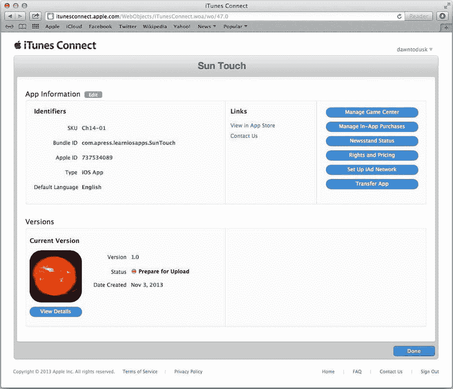  
*图 14-11. 在 iTunes Connect 中管理应用*

### 配置 Game Center

在 `iTunes Connect` 中创建应用后，点击 `Manage Game Center`（管理 Game Center）按钮（参见图 14-11）。Game Center 管理页面是您为应用启用 Game Center 功能的地方。您的应用已启用 Game Center 使用权限，如图 14-12 所示。如果未启用，现在将其打开即可。

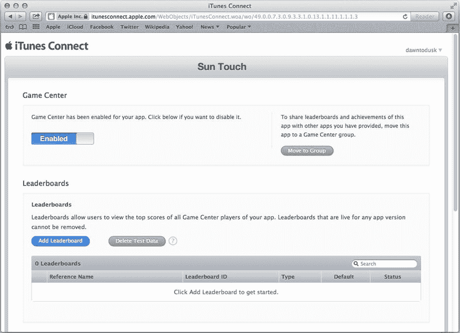  
*图 14-12. 配置 Game Center*

要在您的应用中使用排行榜功能，您必须在 Game Center 中创建一个或多个排行榜。您可以创建彼此独立的单排行榜，或聚合其他排行榜的合并排行榜。对于 SunTouch，通过点击图 14-12 所示的 `Add Leaderboard`（添加排行榜）按钮，创建两个独立的（单）排行榜。按如下方式配置排行榜：

| 引用名称 | 排行榜 ID | 名称 |
| --- | --- | --- |
| Single | single | 单人模式 |
| Multi | multiple | 多人模式 |

选择创建一个单排行榜：
- 填写排行榜引用名称和排行榜 ID（参见表格）
- 分数格式类型：整数
- 分数提交类型：最佳分数
- 排序顺序：从高到低
- 分数范围留空
- 在排行榜本地化列表中至少添加一种语言
- 为所选语言的排行榜指定一个名称（参见表格）
- 选择适当的分数格式选项（例如，美式英语在整数中使用逗号分隔符）

重复这些步骤以创建第二个排行榜。您完成后的排行榜应如图 14-13 所示。排行榜 ID 是您将在应用中提交分数时用于引用排行榜的关键字。引用名称供您自己使用。您将使用“Single”排行榜记录单人游戏分数，使用“Multi”排行榜记录双人游戏分数。

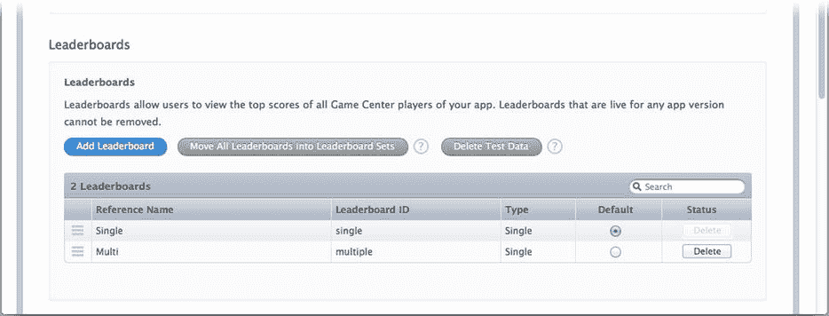  
*图 14-13. 完成后的排行榜*

点击 `Save`（保存）按钮保存您的工作，然后退出 `iTunes Connect`。您在那里的工作就完成了。现在，您可以向应用添加 GameKit 支持并创建测试用户。

### 向您的应用添加 GameKit

支持 Game Center 的 SunTouch 版本可以在 `Learn iOS Development Projects` ➤ `Ch 14` ➤ `SunTouch-3` 文件夹中找到。您可以打开该文件夹，或按照以下步骤为游戏的单人版本添加 Game Center 支持。

现在，您需要向应用添加代码以激活 Game Center 并与之交互。至少，您必须：

*   尽快获取本地玩家
*   如果本地玩家未登录，则显示登录视图控制器
*   如果本地玩家无法或拒绝登录，则禁用您的游戏
*   在界面中添加一个按钮，允许用户与 Game Center 交互

对于将分数记录到排行榜的游戏，您必须：

*   将每个分数报告到相应的排行榜

让我们开始吧。


### 获取本地玩家

你的应用启动后，首先要做的就是获取本地玩家（`GKLocalPlayer`）对象。将以下代码添加到 `STMainViewController.m` 中：

```
- (void)viewDidAppear:(BOOL)animated
{
    [super viewDidAppear:animated];
    __weak GKLocalPlayer *localPlayer = [GKLocalPlayer localPlayer];
    localPlayer.authenticateHandler = ^(UIViewController *viewController, NSError *error) {
        if (viewController != nil)
            [self showAuthenticationView:viewController];
        else if (localPlayer.authenticated)
            [self authenticatePlayer:localPlayer];
        else
            [self disableGameCenter];
    };
}
```

本地玩家对象代表用户在 Game Center 中的身份。通常情况下，用户已经登录到 Game Center，因此无需额外操作。如果用户尚未登录，你应立即显示 Game Center 身份验证视图，以便用户登录其 Game Center 账户。如果用户无法或不愿登录，则应禁用游戏，或使其在无需与 Game Center 交互的模式下运行。

所有这些情况都在你为 `authenticateHandler` 属性设置的代码块中处理。与大多数对象不同，登录 Game Center 的过程并非由你显式启动。这是一个持续的过程，因为玩家可以随时（通过 iOS 设备上的 Game Center 应用）退出登录或切换账户。每当玩家的 Game Center 状态发生变化时，你设置在 `authenticateHandler` 中的代码块就会被执行。

在 SunTouch 中，有三种情况需要处理。如果 `viewController` 不为 `nil`，Game Center 便会通知你的应用，要求它将此视图控制器展示给用户。这通常是因为玩家尚未登录；该视图控制器会呈现一个登录界面，供玩家向 Game Center 进行身份验证。

第二种情况是玩家当前已（或已经）通过身份验证，并准备开始游戏。此时，你的游戏应做好运行准备。在 SunTouch 中，`-authenticatePlayer:` 方法会显示两个“开始游戏”按钮来做好准备工作。

最后，Game Center 会通知你的应用：本地玩家未（或不再）获得授权。换言之，玩家已退出登录或从未登录。SunTouch 会发送一条 `-disableGameCenter` 消息来隐藏这两个“开始游戏”按钮。在玩家登录之前，他们将无法进行游戏。

要完成这段代码，你需要在 `STMainViewController.m` 文件中添加以下三个方法：

```
- (void)showAuthenticationView:(UIViewController*)viewController
{
    [self presentViewController:viewController animated:YES completion:NULL];
}

- (void)authenticatePlayer:(GKLocalPlayer*)player
{
    self.singlePlayButton.hidden = NO;
    self.multiPlayButton.hidden = NO;
}

- (void)disableGameCenter
{
    self.singlePlayButton.hidden = YES;
    self.multiPlayButton.hidden = YES;
}
```

### 添加 Game Center 按钮

你已经处理了前三个要求（获取本地玩家、让玩家登录、以及在玩家未登录时禁用游戏）。所有支持 Game Center 的应用还应该提供一个按钮，以便用户能从应用内部访问 Game Center 界面。用户可以在该界面中查看自己的排行榜、分数和成就。

在 SunTouch 中，在 `Main_iPhone.storyboard`（或 `_iPad`）文件的主视图控制器中添加一个小的（22x22 像素）自定义按钮。使用 `GameCenter.png` 图像，如图 14-14 所示。固定其高度和宽度，并为其添加与“底部布局参考线”以及最近的容器视图边缘的约束。

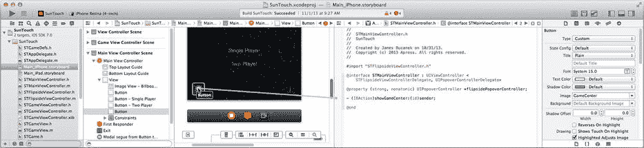

*图 14-14. 添加一个 Game Center 按钮*

切换到辅助编辑器，使 `STMainViewController.h` 显示在右侧窗格中。添加一个动作方法声明：

```
- (IBAction)showGameCenter;
```

将 Game Center 按钮连接到这个动作（见图 14-14）。当你在 `STMainViewController.h` 中时，还有一些收尾工作需要处理。之前的代码使用了两个按钮输出口。声明它们，并将它们连接到“单人游戏”和“双人游戏”按钮：

```
@property (weak,nonatomic) IBOutlet UIButton *singlePlayButton;
@property (weak,nonatomic) IBOutlet UIButton *multiPlayButton;
```

在故事板中选择这两个按钮，并使用属性检查器将其隐藏（通过选中 `hidden` 属性）。这样，按钮在应用启动时不会出现。如果玩家已登录 Game Center，`-authenticatePlayer:` 方法将立即显示（取消隐藏）它们，玩家可能甚至不会注意到。然而，这个预防措施可以防止一个手快的用户在本地玩家状态确定之前就开始游戏。

如果你正在构建应用的两个版本，请在另一个故事板（`_iPhone` 或 `_iPad`）中进行相同的更改（添加 Game Center 按钮，将其连接到 `-showGameCenter` 动作，将两个输出口连接到按钮，并隐藏按钮）。

出于稍后将要解释的原因，你的 `STMainViewController` 需要采纳 `GKGameCenterControllerDelegate` 协议，因此现在就添加：

```
@interface STMainViewController : UIViewController
<STFlipsideViewControllerDelegate,
UIPopoverControllerDelegate,
GKGameCenterControllerDelegate>
```

最后（或首先）导入 `GameKit.h` 头文件：

```
#import <GameKit/GameKit.h>
```

现在切换到 `STMainViewController.m`，并添加 `-showGameCenter` 动作方法以及 `GKGameCenterControllerDelegate` 协议的处理方法：

```
- (IBAction)showGameCenter
{
    GKGameCenterViewController *gameCenterController;
    gameCenterController = [GKGameCenterViewController new];
    if (gameCenterController != nil)
    {
        gameCenterController.gameCenterDelegate = self;
        [self presentViewController:gameCenterController
                           animated:YES
                         completion:nil];
    }
}

- (void)gameCenterViewControllerDidFinish:(GKGameCenterViewController*)controller
{
    [self dismissViewControllerAnimated:YES completion:nil];
}
```

你以前见过这种代码。`-showGameCenter` 方法创建一个 `GKGameCenterViewController`，将自身设置为 `delegate`，并以模态方式将视图控制器展示给用户。当视图控制器完成时，你的委托会收到一条 `-gameCenterViewControllerDidFinish:` 消息（这就是你的控制器必须采纳 `GKGameCenterControllerDelegate` 的原因），从而关闭游戏中心视图控制器。

至此，你已经满足了支持 Game Center 应用的最低要求。但 SunTouch 使用了排行榜，因此在下一节中，你将添加代码来记录玩家的分数。


### 记录排行榜分数

将玩家分数记录到排行榜可能是你应用中最简单的部分。你只需要两条信息：排行榜标识符和最终分数。选择`STGameViewController.m`文件，找到`-finishGame`方法。在`if`代码块的末尾，将代码修改为如下所示（新代码以粗体标注）：

```
self.strikePreview.hidden = YES;

GKScore *scoreReport;

scoreReport = [[GKScore alloc] initWithLeaderboardIdentifier:
                                        kSinglePlayerLeaderboardID];

scoreReport.value = score;

[GKScore reportScores:@[scoreReport] withCompletionHandler:^(NSError *error) {

    }];
```

`-initWithLeaderboardIdentifier:`初始化方法会为你想要提交分数的排行榜创建一个`GKScore`对象。然后设置要报告的`score`属性，并将其发送到 Game Center 服务器（`+reportScores:withCompletionHandler:`）。当分数成功提交或提交失败时，会执行完成处理程序块。你可以检查`error`参数来查看是否成功，并采取你认为合适的操作。SunTouch 对玩家分数是否未能提交并不特别在意。

**提示：**  
当分数成功报告且完成处理程序执行时，`GKScore`对象的几个属性会被更新以反映结果。其中最有意思的是`rank`属性。它会被设置为玩家在排行榜上的新排名（1 为最高分玩家，2 为第二高分，以此类推）。你的应用可以在完成代码块中获取该值，并向玩家报告这个好消息。

排行榜通过其标识符来寻址。切换到`STGameDefs.h`文件，添加以下两个常量：

```
#define kSinglePlayerLeaderboardID  @"single"
#define kTwoPlayerLeaderboardID     @"multiple"
```

现在，`-initWithLeaderboardIdentifier:`方法将为你在 iTunes Connect 中定义的“single”排行榜创建一个排行榜对象。

**警告：**  
排行榜标识符是区分大小写的。传递给`-initWithLeaderboardIdentifier:`的标识符必须与你输入到 iTunes Connect 中的标识符完全一致，否则你的分数将无法发布到排行榜上。

### 创建测试玩家

剩下唯一要做的事就是测试你的应用。为此，你必须在 Game Center 中拥有一个玩家账户。但这不能是任意一个玩家；它必须是一个沙盒玩家。在你的应用被提交并通过 App Store 分发审批之前，你的应用将使用 Game Center 沙盒。Game Center 沙盒是一组服务器，其工作方式与公共 Game Center 服务器完全相同，但其中的信息、玩家和分数都是私有的，仅用于开发和测试。

当你运行尚未获批的应用时，Apple 会自动将其置于沙盒中。你可以通过在你的（沙盒）应用内创建一个新的玩家账户来创建沙盒玩家。这可以通过 iOS 模拟器或已配置的设备完成。步骤如下：

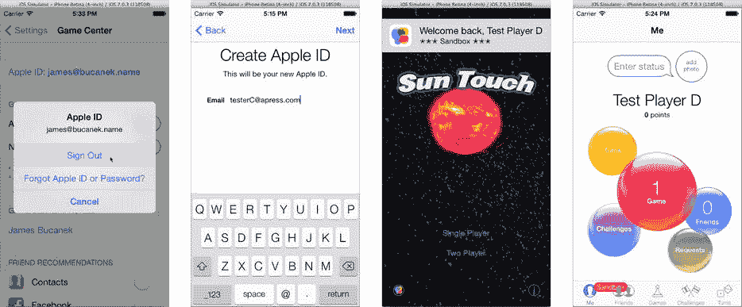

**图 14-15.** 创建沙盒玩家

如果你已有 Game Center 玩家账户，请启动“设置”应用，进入“Game Center”设置，然后注销（点击你的账户名称，选择“退出登录”）。见图 14-15。  
启动你的应用。  
由于没有玩家登录，你的应用会立即显示玩家登录视图控制器（见图 14-15）。  
创建一个新的玩家账户。

在沙盒应用中创建账户会生成一个沙盒玩家账户。你必须提供一个不与任何常规 Apple ID 关联的电子邮件地址，因此你可能需要为测试创建一个新的电子邮件账户。

**注意：**  
沙盒玩家账户只能用于在沙盒中运行的游戏。如果你在 iOS 设备上登录了沙盒账户，则必须注销并登录你的常规账户，才能玩任何从 App Store 下载的游戏。你可以通过查看玩家图标上的沙盒标志来区分，如图 14-15 右侧所示。

玩几局游戏。你会看到自己的分数出现在排行榜上，你可以通过添加到应用中的 Game Center 按钮访问排行榜，如图 14-16 所示。

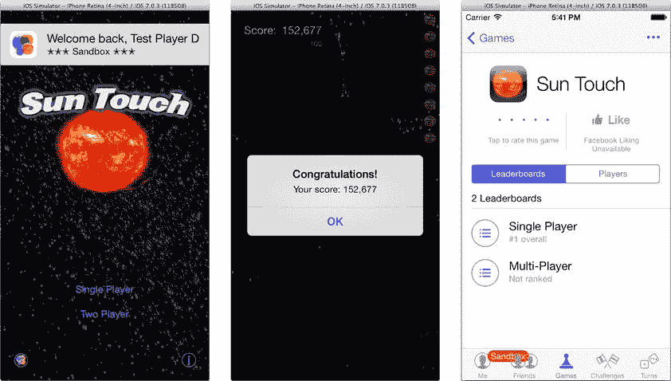

**图 14-16.** 玩你的 Game Center 感知型应用

恭喜你！你已经创建了一个 Game Center 感知型应用，配置了 Game Center 服务器，创建了沙盒玩家账户，并将分数发布到了你的排行榜上。这终于让你走到了可以为应用添加网络功能的地步。

### 对等网络

你期待已久的时刻到了：为你的应用添加对等网络功能。广义上讲，这需要对 SunTouch 进行三项修改：

* 将单人游戏变为双人游戏
* 发现并连接另一台 iOS 设备
* 发送和接收游戏数据

从第一项开始。在双人游戏中，两位玩家（一位本地，一位远程）将同时在太空中爆破空洞，试图在对方之前捕获太阳，进行一场成为宇宙主宰的皇家大战——或者类似的东西。界面需要更改为：

* 显示对手玩家的打击动画
* 显示对手玩家已爆破的空间区域
* 动画显示对手玩家捕获的太阳

你已经有代码来实现打击动画并显示已被爆破的空间区域。你还有代码来动画显示太阳被捕获的过程。你能重用这些代码来为对手玩家实现同样的效果吗？我认为你可以。


### 将 SunTouch 变成双人游戏

你将对 `STGameView` 做一个小改动，使其在被击穿的洞中“绘制”透明圆圈，而不是用黑色填充。然后，你将创建一个 `STGameView` 的子类，名为 `STOpponentGameView`，并在界面中 `STGameView` 对象的正后方放置一个该视图的实例。对手的游戏视图将动画显示打击效果，并为对手绘制被击穿的洞。这些动画和击打区域将仅通过前景（本地）游戏视图中绘制的透明孔洞可见。其效果就像透过一片瑞士奶酪看另一片瑞士奶酪一样。

> **注意：** 你可以在 `Learn iOS Development Projects` ➤ `Ch 14` ➤ `SunTouch-4` 文件夹中找到完成的双人游戏。

对于太阳捕获动画，你希望本地玩家能看到太阳被对手捕获。这增加了游戏的策略性；通过观察对手在何处捕获太阳，本地玩家可以推断对手已经击穿了哪些空间区域。为了在界面中可见，太阳捕获动画必须出现在本地玩家视图上方的视图中。这通过让本地游戏视图执行所有太阳捕获动画来解决。唯一改变的是太阳的颜色，用于指示哪个玩家捕获了它们。

这就是双人游戏改动的主要部分。除此之外，还有一些小细节需要处理，我很快会讲到。先从 `STGameView` 中的这些小改动开始。选择 `STGameView.h` 文件，并添加一个 `opponent` 属性：

```
@property (readonly,nonatomic) BOOL opponent;
```

现在切换到 `STGameView.m` 实现文件，添加这个属性的 getter 方法：

```
- (BOOL)opponent
{
    return NO;
}
```

`opponent` 属性将指示视图是为本地玩家还是远程玩家显示游戏。`STGameView` 始终返回 `NO`，因为它只为本地玩家显示视图。`STOpponentGameView` 将返回 `YES`，因为它始终为远程玩家显示视图。

游戏视图显示并动画化由玩家（现在是多个玩家）发起的攻击。它通过观察 `kGameStrikeNotification` 通知来实现这一点。在双人游戏中，现在这些通知有两个来源：本地玩家的攻击和远程玩家的攻击。发送这些通知的代码将改为指示攻击的来源。修改 `-strikeNotification:` 方法，使其开头如下（新代码以粗体显示）：

```
- (void)strikeNotification:(NSNotification*)notification
{
    NSDictionary *info = notification.userInfo;
    STStrike *strike = info[kGameInfoStrike];
    BOOL opponent = [info[kGameInfoOpponent] boolValue];
    if (opponent!=self.opponent)
        return;
```

新代码从通知中获取 `kGameInfoOpponent` 值。如果攻击通知来自远程玩家，则该值为 `YES`。它将此值与此视图的 `opponent` 属性进行比较。如果值不一致，则忽略该通知。最终结果？本地游戏视图仅动画化来自本地玩家的攻击，而对手游戏视图仅动画化来自远程玩家的攻击。

接下来需要修复太阳捕获动画。两个玩家的太阳捕获动画均由本地（前景）视图处理。唯一改变的是用于太阳的图像。`SunCold.png` 图像表示被对手捕获的太阳。找到 `-captureNotification:` 方法，并将最后一条语句改为以下内容（修改后的代码以粗体显示）：

```
sunView.image = [UIImage imageNamed:(sun.localPlayer? @"SunHot" : @"SunCold")];
```

如果太阳被对手捕获，此修改使用不同的太阳图像。（你尚未为 `STSun` 创建 `localPlayer` 属性，但很快就会完成。）

最后，将 `-setStrikeDrawColor` 方法修改为以下内容（新代码以粗体显示）：

```
- (void)setStrikeDrawColor
{
    if (self.opaque)
    {
        [[UIColor blackColor] set];
    }
    else
    {
        [[UIColor clearColor] set];
        CGContextSetBlendMode(UIGraphicsGetCurrentContext(),kCGBlendModeCopy);
    }
}
```

`-setStrikeDrawColor` 方法的功能如其名。当 `-drawRect:` 方法需要设置用于在空间中绘制孔洞的图形上下文颜色时，会调用它。在单人游戏中，本地游戏视图是不透明的，攻击以黑色圆圈绘制。在双人游戏中，本地游戏视图可以是部分透明的（`!opaque`），而孔洞真的是洞；上下文设置为用不可见像素“绘制”，使视图中被填充的部分变为透明。通常，混合模式不会绘制透明像素，这就是为什么混合模式被改为 `kCGBlendModeCopy`。`kCGBlendModeCopy` 模式完全不进行混合，用当前颜色替换上下文中的像素。


## 子类化 `STGameView`

本地与对手游戏视图之间的其余差异由`STOpponentGameView`类提供。现在创建该类。在导航器中选择`STGameView.m`文件，然后选择“新建文件...”命令。使用 Objective‑C 文件模板。将新类命名为`STOpponentGameView`，并使其成为`STGameView`的子类。

`STOpponentGameView`没有定义任何新的属性或方法。它通过重写`STGameView`中定义的方法来实现所有功能。以下是使`STOpponentGameView`正常工作的全部代码。

```
@implementation STOpponentGameView

- (void)observeNotificationsFromGame:(STGame*)game
{
    [super observeNotificationsFromGame:game];
    if (game!=nil)
        [[NSNotificationCenter defaultCenter] removeObserver:self
                                                      name:kGameSunCaptureNotification
                                                    object:game];
}

- (BOOL)opponent
{
    return YES;
}

- (UIImage*)strikeImage
{
    return [UIImage imageNamed:kOpponentStrikeImageName];
}

- (void)setStrikeDrawColor
{
    [[UIColor blackColor] set];
}

- (void)drawBackground
{
    [[UIColor darkGrayColor] set];
    CGContextFillRect(UIGraphicsGetCurrentContext(),self.bounds);
}

@end
```

`-observeNotificationsFromGame:`方法在游戏开始时被调用。游戏视图成为关键游戏引擎通知的观察者。这包括观察“击打”和“太阳被捕获”的通知，以便视图可以绘制并动画化这些事件。然而，在双人游戏中，所有“太阳被捕获”事件都由本地（前景）视图动画化，而对手（背景）视图不动画化任何这些事件。对手视图没有添加代码到`-captureNotification:`来忽略它们（就像你在`-strikeNotification:`中所做的那样），而是简单地从通知中心再次取消注册自身。它仍然会收到“击打”通知，但不会收到任何“太阳被捕获”通知。

其余方法重写了`STGameView`中的方法。当`STGameView`中的`-drawRect:`方法向自身发送`-setStrikeDrawColor`和`-drawBackground`消息时，对手游戏视图将执行此代码。

**提示**

定义可重写的行为是面向对象编程中的重要模式。在编写`STGameView`时，我就知道对手游戏视图的击打图像、弹孔颜色和背景需要不同。我提前规划并将这些方面编写为单独的方法。如果你没有提前规划，可以使用提取重构工具将特定行为移动到其自己的方法中，然后子类可以重写该方法。

完成的`STOpponentGameView`类使用`kOpponentStrikeImageName`图像绘制其击打动画，用黑色绘制击打弹孔，并将其视图的其余部分填充为深灰色。它仅从远程玩家绘制并动画化击打事件，并且不动画化任何太阳捕获事件。

现在，你只需将一个`STOpponentGameView`对象添加到你的界面中。

## 添加对手游戏视图

选择`STGameViewController.xib` Interface Builder 文件。从对象库中，将一个`View`对象拖入大纲视图。小心地插入新视图，使其成为根视图的子视图，并排序在现有游戏视图对象之前（后面）。通过将新视图拖入大纲视图来完成此操作，如图 14-17 所示。你不能像通常那样将新视图对象拖入画布，因为它会成为某个其他视图的子视图，这不是你想要的。

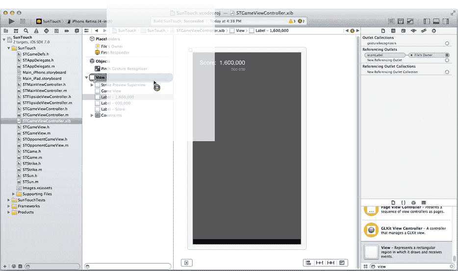

图 14-17. 插入对手游戏视图

使用调整手柄或大小检查器调整视图大小，使其与游戏视图具有相同的框架。添加与游戏视图完全相同的约束集；将顶部、前导和尾随边缘与父视图对齐，并从底部到击打预览视图顶部添加垂直间距约束。使用身份检查器，将其类更改为`STOpponentGameView`，如图 14-18 所示。

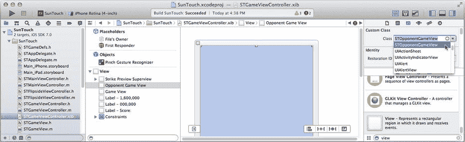

图 14-18. 完成的对手游戏视图

切换到助理编辑器。`STGameViewController.h`文件应显示在右侧窗格中。使用窗格上方的导航条切换到`STGameViewController.m`实现文件，如图 14-19 所示。游戏视图的 Interface Builder 插座是私有插座，仅由`STGameViewController`使用。

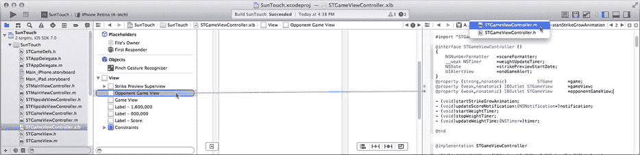

图 14-19. 添加一个`opponentGameView`插座

定义一个名为`opponentGameView`的第二个`STGameView`插座（见图 14-19），并将其连接到新的游戏视图对象，同样如图 14-19 所示。通过将大纲视图的连接插座拖到大纲视图中的“对手游戏视图”对象上来建立连接。（由于此视图位于所有其他视图的后面，因此在 Interface Builder 画布中建立连接很困难。）


