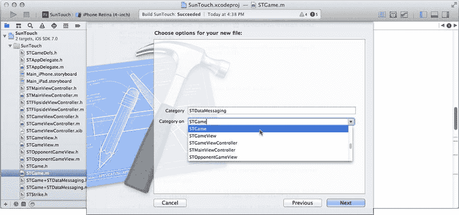
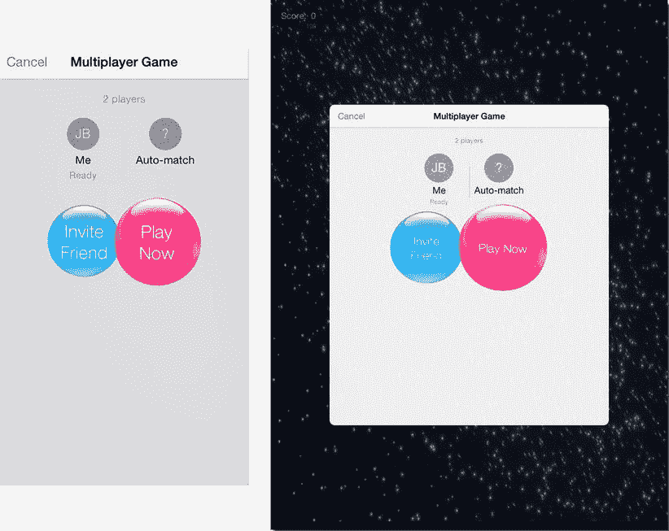
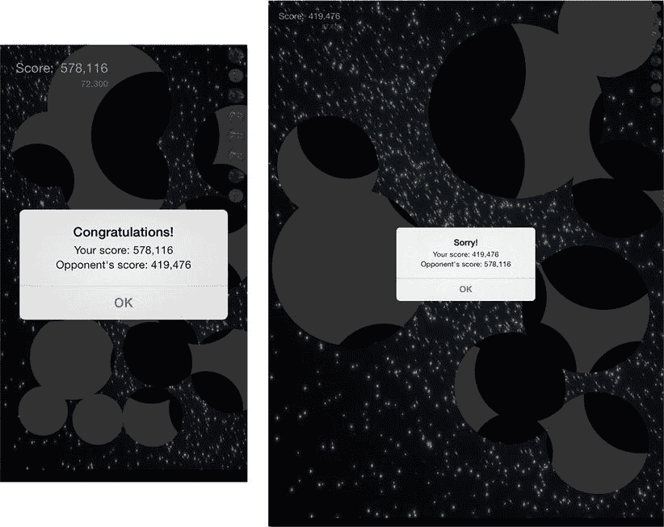
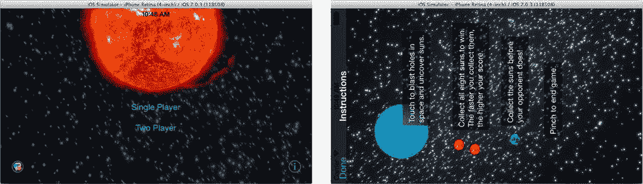

# 请求匹配

你的游戏通过请求与运行相同应用的其他用户匹配（连接）来开始。这是通过`GKMatchRequest`对象实现的。你可以请求三种类型的匹配：点对点、托管和回合制。

- **点对点**会与其他所有设备建立直接通信链路。所有参与者都是可以自由相互通信的"对等方"。SunTouch 将使用点对点通信。
- **托管匹配**要求你的应用提供自己的网络连接和通信。它适用于使用集中式服务器（如 MMORPG）的游戏，或你已经编写了自定义通信的游戏。
- **回合制游戏**不需要与其他玩家建立直接连接。不频繁的通信会通过 Game Center 服务器中继给其他玩家，使得在互联网可达范围内的任何距离都能进行休闲游戏。这意味着你甚至可以与正在国际空间站上的人进行回合制游戏，因为他们现在也有网络了。

游戏开始时，通过请求匹配来启动流程。选择`STGameViewController.m`文件，找到`-startGame`方法，并添加粗体所示的新代码：

```
- (void)startGame

{

    if (self.game==nil)

        {

        STGame *game = [STGame new];

        self.game = game;

        [self.gameView reset];

        [self.opponentGameView reset];

        if (self.twoPlayer)

            {

            GKMatchRequest *request = [GKMatchRequest new];

            request.minPlayers = 2;

            request.maxPlayers = 2;

            request.defaultNumberOfPlayers = 2;

            GKMatchmakerViewController *mmvc;

            mmvc = [[GKMatchmakerViewController alloc] initWithMatchRequest:request];

            mmvc.matchmakerDelegate = self;

            [self presentViewController:mmvc animated:YES completion:nil];

            }

        else

            {

            [self.gameView observeNotificationsFromGame:game];

            [game startSinglePlayer];

            [self startStrikeGrowAnimation];

            }

        }

}
```

修改后的`-startGame`方法会立即启动单人游戏。当`twoPlayer`为`YES`时，它会启动匹配流程。匹配请求被配置为限制最小、最大和默认的参与者数量。由于 SunTouch 严格来说是一款一对一游戏，因此唯一的选择是 2 名玩家。

使用`GKMatchmakerViewController`来建立点对点匹配。其代码很简单：创建视图控制器，将你的对象设置为其委托，并将其呈现给用户。

**注意**：你没有指定匹配类型（点对点、托管或回合制）。这是因为所使用的匹配视图控制器隐含了类型。`GKMatchmakerViewController`创建点对点匹配。使用`GKTurnBasedMatchmakerViewController`来创建回合制匹配。对于托管游戏，或提供自定义界面，请使用`GKMatchmaker`或`GKTurnBasedMatch`类。

要使此功能生效，你的匹配委托对象必须遵循`GKMatchmakerViewControllerDelegate`协议，因此请跳转到`STGameViewController.h`并添加该协议（粗体所示的新代码）：

```
@interface STGameViewController : UIViewController <UIAlertViewDelegate ,

                                      GKMatchmakerViewControllerDelegate >
```

## 完成匹配

你的应用通过实现`GKMatchmakerViewControllerDelegate`方法来处理匹配的成功或失败。首先在`STGameViewController.m`中添加成功方法：

```
- (void)matchmakerViewController:(GKMatchmakerViewController *)viewController
                    didFindMatch:(GKMatch *)match

{
    [self dismissViewControllerAnimated:YES completion:nil];

    if (match.expectedPlayerCount==0)

        {

        [self.game startMultiPlayerWithMatch:match started:^{

            [self.gameView observeNotificationsFromGame:self.game];

            [self.opponentGameView observeNotificationsFromGame:self.game];

            [self startStrikeGrowAnimation];

            }];

        }

}
```

当匹配建立时，匹配视图控制器会创建一个`GKMatch`对象，你的委托会收到一条`-matchmakerViewController:didFindMatch:`消息。匹配对象是你将与远程玩家通信所使用的对象。

所有玩家连接可能需要一段时间，并且你可能会多次收到此消息。你应该检查匹配对象的`expectedPlayerCount`属性。它会报告你仍在等待（期望）连接的玩家数量。一旦该值为`0`，所有玩家都已连接。此时 SunTouch 会启动游戏引擎。

但游戏尚未开始！在 SunTouch 比赛开始之前，游戏引擎必须首先与另一位玩家通信，以确立游戏参数（太阳隐藏的位置）。这部分稍后再处理。现在，只需知道`-startMultiplayerWithMatch:`方法启动了一个与远程应用交换变量并同步游戏开始的进程。这被称为握手。当握手完成时，游戏启动，并且你在`started:`参数中传入的代码块会被执行，使得`STGameViewController`能够同时执行其游戏启动时的内务处理。

最后，添加两个失败委托方法：

```
- (void)matchmakerViewControllerWasCancelled:(GKMatchmakerViewController *)controller

{
    [[NSNotificationCenter defaultCenter] postNotificationName:kGameDidEndNotifcation
                                                        object:self];
}

- (void)matchmakerViewController:(GKMatchmakerViewController *)controller
                didFailWithError:(NSError *)error

{
    [self matchmakerViewControllerWasCancelled:controller];
}
```

如果玩家决定不想与另一位玩家连接，则会收到`-matchmakerViewControllerWasCancelled:`消息。如果出现错误，则会收到`-matchmakerViewController:didFailWithError:`消息。两者都会结束游戏，关闭游戏视图控制器，并返回初始屏幕。


### 与另一台设备交换数据

可以说，这是关键所在。配对器返回的 `GKMatch` 对象是你与其他 iOS 设备通信的通道。其核心用法非常简单。它有一个 delegate 属性和一些 `-sendData...` 方法。`-sendData...` 方法用于向其他设备发送数据。当其他设备向你的应用发送数据时，你的 delegate 对象会收到一条 `-match:didReceiveData:fromPlayer:` 消息。听起来很简单，对吧？细节之处才是魔鬼。

作为应用设计者，你必须决定要发送哪些信息、信息的格式如何、接收方如何解读这些信息、要将数据发送给哪些玩家、何时发送数据，以及确保数据被接收的重要性。

在设计通信时，有多种组织方式。有些方法可以向所有其他参与者发送数据，也可以只向其中一位发送。这让你可以选择向所有其他玩家发送更新，或向特定玩家发送特定更新。你的游戏可能需要将某个设备指定为主机或主控（例如《龙与地下城》这类游戏结构）。`GKMatch` 类有一个 `-chooseBestHostPlayerWithCompletionHandler:` 方法，用于协助设备选择一个“领头羊”。

在这方面，`SunTouch` 很简单。因为对手永远不会多于一个，所以通信拓扑不是问题。唯一棘手的部分是决定哪个应用来随机生成太阳的位置。两个玩家必须使用同一组太阳位置，否则游戏将毫无意义——至少比现在更没意义。（你怎么在太空中挖个洞，又为什么要这么做？）

请记住，你在两台不同的设备上同时运行着两个完全相同的程序版本。除非你指定一个，否则没有“领导者”。对于 `SunTouch`，解决方案是两个应用各自生成一组随机太阳位置。然后它们“抛硬币”——或电子等价物——并选出一个胜者。两个应用都将使用胜者选定的那组太阳。之后，你的应用会向远程应用发送描述打击和捕获太阳的数据。同时，远程应用也会向你的应用发送对手玩家的打击和捕获太阳信息。`SunTouch` 的通信可以总结如下：

*   向远程应用发送“游戏开始”数据，其中包含一组随机太阳位置以及一个随机数（即“硬币”）。
*   收到“游戏开始”数据后，将远程应用的随机数与我们的进行比较。这决定了谁赢得抛硬币，以及使用哪组太阳位置。
*   当用户发起一次打击时，向远程应用发送“打击”数据，其中包含打击的位置和半径。
*   当从远程应用收到“打击”数据时，在对手的游戏视图中动画显示一次打击。
*   当本地玩家捕获一个太阳时，向远程应用发送“太阳已捕获”数据，其中包含太阳将被捕获的时间。
*   当从远程应用收到“太阳已捕获”数据时，动画显示被捕获的太阳，并为对手玩家加分。如果两个玩家同时发现同一个太阳，则最早捕获者获胜。

所有通信代码都将放在 `STGame` 中。是两个游戏引擎对象之间相互通信。你的控制器对象只关心与本地玩家的交互，而视图对象仅响应通知。你将通过充实 `-startMultiPlayerWithMatch:started:` 方法开始实现，然后构建各个发送/接收数据的方法。

### 开始游戏

点击 `STGame.h` 接口文件。你将添加一些变量和一个多人游戏开始方法。从变量开始。编辑 `@interface` 的实例变量部分，使其如下所示（新代码以粗体显示）：

```
@interface STGame : NSObject
{
    NSArray*            suns;
    NSTimeInterval      startTime;
    GKMatch             *multiPlayerMatch;
    void                (^multiPlayStarted)(void);
    uint32_t            coinToss;
}
```

`multiPlayerMatch` 变量保存了对 `GKMatch` 对象的引用，你需要用它来与其他应用通信。其后那个看起来奇怪的声明定义了 `multiPlayerStarted` 变量。它是一个代码块变量；保存了对一段代码块的引用，`STGame` 稍后可以执行这段代码。这是 `-startMultiPlayerWithMatch:started:` 方法的一个参数。说到这个，在 `-startSinglePlayer` 之后为其添加一个方法声明：

```
- (void)startSinglePlayer;
- (void)startMultiPlayerWithMatch:(GKMatch*)match
                          started:(void(^)(void))started;
```

切换到 `STGame.m` 并编写新方法：

```
- (void)startMultiPlayerWithMatch:(GKMatch*)match started:(void(^)(void))started
{
    multiPlayerMatch = match;
    multiPlayStarted = started;
    suns = [STGame randomSuns];
    coinToss = arc4random();
    match.delegate = self;
    [self sendGameStart];
}
```

用于与其他应用通信的 `GKMatch` 对象被保存下来，同时保存的还有在游戏实际开始时执行的代码块引用。接着，生成一组随机太阳位置和一个用作抛硬币结果的随机数。选取最大随机数的应用将决定太阳位置。

`STGame` 对象被设置为 `GKMatch` 对象的 `delegate`。匹配对象接收到的数据现在将发送给 `STGame`。最后，“游戏开始”数据被发送到远程应用。可以推测，远程应用也在几乎同一时间执行着完全相同的代码，选择一组太阳、一个随机数，并向此应用发送其“游戏开始”数据。

**注意**

你可能已经注意到 `STGame` 并不遵循 `GKMatchDelegate` 协议。这将在接下来的一个分类中处理。

### 创建数据消息传递分类

你将把所有的远程通信逻辑整合到 `STGame` 的一个名为 `STDataMessaging` 的分类中。在项目导航器中选中 `STGame.m` 文件，然后从 File 菜单或通过右键单击 `STGame.m` 文件选择 New File . . . 命令。

**注意**

分类会为类添加额外的方法。这些方法在一个单独的模块中声明和实现，但在其他方面与类的其他方法无法区分。我将在第 20 章中详细解释分类。

选择 Objective‑C 分类模板。将分类命名为 `STDataMessaging`，并使其成为 `STGame` 的分类，如图 14-20 所示。



**图 14-20.** 创建 `STDataMessaging` 分类

该分类将实现三个向其他玩家发送游戏信息的方法：`-sendGameStart`、`-sendStrike:` 和 `-sendCaptureForSunIndex:`。该分类还实现了 `GKMatchDelegate` 方法，用于接收来自其他玩家的数据。在新的 `STGame+STDataMessaging.h` 接口文件中，编辑分类声明，使其如下所示（新代码以粗体显示）：

```
@interface STGame (STDataMessaging) <GKMatchDelegate>
- (void)sendGameStart;
- (void)sendStrike:(STStrike*)strike;
- (void)sendCaptureForSunIndex:(NSUInteger)index;;
@end
```

分类声明需要 `STStrike` 类的定义以及一些常量，因此请在文件开头添加以下内容：

```
#import "STGameDefs.h"
@class STStrike;
```

**注意**

`@class` 指令用于声明一个类，而不向编译器透露该类的任何信息。换句话说，它告知编译器存在这样一个类，但仅此而已。它主要用在接口文件中，当声明引用一个类名（`-(void)sendStrike:( STStrike* )strike;`）时，但不需要或希望包含该类的完整定义（`#import "STStrike.h"`）。


#### 定义数据格式

我先前概述的设计任务之一，是决定“你的数据格式如何”。这是通信设计的关键部分。`GKMatch` 对象会将一个字节数组从你的应用传输到另一台设备（可能位于半个地球之外），但这个字节数组的内容完全由你决定。它必须包含你想要与另一应用通信的信息，并且必须以接收方能够理解的方式组织。边栏“序列化与跨平台通信”描述了其中涉及的一些挑战。

> **注意**  
> 在计算机工程中，“序列化”（serialization）一词通常用于描述将对象和值编码为可传输格式的过程。不幸的是，在 Cocoa 中，“序列化”有非常特定的含义，详见第 18 章。在 Cocoa 中，“归档”（archiving）更接近通用的“序列化”概念。归档将在第 19 章中解释。

### 序列化与跨平台通信

将信息（数字、对象、属性等）转换为可传输的格式，通常被称为序列化、编组或压缩。当你与另一个计算机系统或进程交换信息时（包括将信息存储在文件中），都必须进行此操作。Cocoa 和 Objective‑C 提供了多种工具来帮助你序列化数据，然后将序列化后的数据恢复为应用可以使用的对象和属性——这个过程称为反序列化、解组或解压缩。

你的应用中的信息在与其他应用或设备交换时，可能面临三个障碍：内存地址、字长和字节顺序。

最大的问题是内存地址。Objective‑C 中的对象是动态 RAM 的一小块区域，用于存储该实例的属性。在你的应用中，你通过对象的地址来引用它。对象的内存地址对于另一个进程或计算机系统来说毫无意义。另一台设备无法访问你应用的内存——至少我希望它不能。将对象的地址交给另一个进程，就像把你的电话号码给平行宇宙中的某个人一样；他们根本无法使用。

解决办法是将对象属性转换为一串字节，接收方可用这些字节组装出等效的对象。假设你有一个 `Person` 对象，包含 `name`（字符串）和 `age`（整数）属性。你不能将 `Person` 或字符串对象的地址传递给另一个进程。相反，你可以通过创建一个字节数组，并将人的 `name` 字符和 `age` 的二进制值填充到这些字节中，来实现对象的序列化。接收这些字节的计算机可以利用这些数据构造一个新的字符串对象和具有相同属性的新 `Person` 对象。

在交换这个人的 `age` 时，还需要处理两个额外问题。不同的计算机系统，甚至不同的编译器，使用不同的字长。计算机体系结构中的“字”是用于存储单个数字（如 `int`）的字节序列。一个 `int` 在某个计算机系统上可能是 16 位（2 字节），在另一个系统上可能是 64 位（8 字节）。因此，你不能简单地编写代码将一个 `int` 复制到字节数组中，再在另一个系统上提取出来，因为在一台计算机上这意味着 2 字节，而在另一台上则意味着 8 字节。

字长不匹配通常通过使用 C 和 Objective‑C 中的固定大小变量类型来解决。例如，`int32_t` 是一个变量类型（就像 `int` 和 `char` 一样），它定义了一个始终为 32 位（4 字节）长的整数。无论你在何种计算机系统上编译，或者运行何种 CPU，`int32_t` 变量始终是 32 位长。

最后一个问题是字节顺序。不同的 CPU 架构以不同的顺序存储单个整数的字节。将整数的最低有效位存储在内存的第一个（最低）字节中的 CPU 称为小端序（little-endian）机器。如果第一个字节包含整数的最高有效位，则称为大端序（big-endian）机器。如果你将整数值的最低有效字节先发送给一个期望第一个字节为最高有效位的系统，整数值将因顺序错乱而无法正确解析。

对于 SunTouch 而言，字节顺序目前不是问题。截至本文写作时，所有 iOS 设备都采用类似的 CPU 架构，且都使用相同的小端序字节顺序。但需注意，这将来可能会发生变化。

然而，字长并非在所有 iOS 设备上都相同。随着 A7 处理器的引入，部分 iOS 设备采用 32 位 CPU，而另一些则采用 64 位 CPU。这意味着 `NSInteger` 变量在 iPhone 4S 上运行时占用 4 字节（32 位），但在 iPhone 5S 上运行时则占用 8 字节（64 位）。（这一陈述假设你已将应用编译为同时支持 32 位和 64 位架构，这是 Xcode 的默认构建设置。）所有指针和 `CGFloat` 变量的长度也会不同。你在 iOS 设备之间交换的任何整数或浮点数值，必须就一致的字节长度达成一致。

如果你的应用想要与运行不同操作系统的其他类型计算机系统通信，就需要同时考虑字长和字节顺序的差异。

第 18 章和第 19 章解释了用于序列化对象的内置 Objective‑C 工具。这些工具会为你处理所有字长、字节顺序和对象解压的问题。

当 SunTouch 应用接收数据时，它必须能够确定数据块包含何种信息。最直接的做法（如果自行实现）是让每个数据块以一个整数开头，描述剩余数据块所包含的信息类型。在 `STGame+STDataMessaging.h` 中，添加以下声明：

```objc
typedef uint32_t STMessage;

enum {
    kSTStartGameMessage,
    kSTStrikeMessage,
    kSTCaptureMessage
};
```

这段代码定义了一个新的整数变量类型（`STMessage`），该类型保证始终为 32 位长，无论编译时针对何种计算机系统。然后，它定义了三个常量，分别对应 SunTouch 发送的每种数据消息类型。

`STGame+STDataMessaging.h` 中的其余声明定义了用于在游戏之间交换数据的结构体：

```objc
typedef float STFloat;

typedef struct {
    STFloat x;
    STFloat y;
} __attribute__((aligned(4), packed)) STMessagePoint;

struct STStartGameMessage {
    STMessage       message;
    uint32_t        coinToss;
    STMessagePoint  sun[kSunCount];
} __attribute__((aligned(4), packed));

struct STStrikeMessage {
    STMessage       message;
    STMessagePoint  location;
    STFloat         radius;
} __attribute__((aligned(4), packed));

struct STCaptureMessage {
    STMessage       message;
    uint32_t        sunIndex;
    STFloat         gameTime;
} __attribute__((aligned(4), packed));
```

前两个声明创建了两个新的变量类型：`STFloat` 和 `STMessagePoint`。`STFloat` 定义单个坐标或距离变量，`STMessagePoint` 定义了一对用于描述坐标的 `STFloat` 值。

> **注意**  
> 为什么不直接使用 `CGFloat` 和 `CGPoint`？因为 `CGFloat` 的长度在 32 位和 64 位 CPU 架构中不同，且 `CGPoint` 结构的默认对齐方式将来可能改变。通过定义你自己且可传输的变量类型，可以确保这些结构中的变量在 SunTouch 可能运行的任何 iOS 设备上都具有相同的大小、顺序和位置。


以下三个结构体（`STStartGameMessage`、`STStrikeMessage`和`STCaptureMessage`）定义了将要交换的数据块的组织方式。请注意，每个结构体都以一个`STMessage`整数字段开头，该字段包含相应的消息类型常量。当你的应用从其他玩家处接收数据块时，你已知消息的前 32 位将包含一个数字。你将检查该数字以确定数据内容。

其余字段的含义应显而易见。`__attribute__((aligned(4),packed))`这一“乱码”是一条特殊指令，用于告知编译器如何精确地对齐和打包结构体中的字段。正如字长和字节顺序在不同计算机上有所变化，结构体中字段的字节对齐方式亦会不同。通过明确指定对齐方式，`SunTouch`确保——即使未来编译器的结构体对齐规则发生改变——所有版本的`SunTouch`仍能相互通信。

以上就是你需要的所有声明。现在你可以编写用于从远程应用发送和接收数据的方法了。

## 向玩家发送数据

切换到`STGame+STDataMessaging.m`实现文件。首先`#import` `STStrike`和`STSun`类的定义，稍后将用到它们。

```objective-c
#import "STStrike.h"
#import "STSun.h"
```

实现`-sendGameStart`方法：

```objective-c
- (void)sendGameStart
{
    struct STStartGameMessage message;
    message.message = kSTStartGameMessage;
    message.coinToss = coinToss;
    for ( NSUInteger i=0; i<kSunCount; i++ )
        {
        STSun *sun = suns[i];
        message.sun[i].x = sun.location.x;
        message.sun[i].y = sun.location.y;
        }
    NSData *data = [NSData dataWithBytes:&message length:sizeof(message)];
    [multiPlayerMatch sendDataToAllPlayers:data
                              withDataMode:GKMatchSendDataReliable
                                     error:NULL];
}
```

所有向其他玩家发送数据的方法都将遵循相同的模式。方法首先分配适当的数据结构（此处为`STStartGameMessage`），然后将`message`字段设置为标识其包含数据类型的常量（`kSTStartGameMessage`），接着填充结构体的其余值。

> **注意**：传统上，所有整数值在网络传输中均采用大端序。由于目前所有 iOS 设备均使用小端序整数，此处省略了字节序转换步骤。若需要翻转整数的字节序，请使用 Core Foundation 字节交换函数。在 Xcode 文档中搜索“byte swapping”即可。

最后一步是将填充完成的结构体发送给其他玩家。`NSData`类将结构体的字节转换为`NSData`对象——该对象本质上只是一个包含字节数组的对象。然后你向`GKMatch`对象发送`-sendDataToAllPlayers:withDataMode:error:`消息。该方法将这些字节传输给所有其他参与的玩家。由于`SunTouch`仅是一款双人游戏，唯一接收方是对手的应用。

`GKMatchSendDataReliable`模式告知`GKMatch`确保这些数据必须到达。这听起来似乎是理所当然的要求——难道你不希望所有数据都到达吗？但并非所有游戏数据都重要到需要担心其是否安全抵达。无线通信可能不稳定且不可靠，数据可能因干扰而丢失。如果消息的到达并非关键，可传递`GKMatchSendDataUnreliable`。这样发送速度快，但不保证送达。这适用于连续发生的状态更新。丢失少数几条消息不会造成太大影响；下一条更新会将游戏状态拉回正轨。传递关键信息（例如象棋走法）的消息应使用`GKMatchSendDataReliable`发送。如果发送消息时出现问题，`GKMatch`会重试直至成功。这会增加开销，且消息可能需要一段时间才能送达，但最终一定会到达。

至此，你已实现了向其他玩家发送“游戏开始”数据的代码。现在编写从其他玩家接收“游戏开始”数据的代码。

## 从玩家处接收数据

当从远程玩家处接收到数据块时，你的`STGame`对象会收到`-match:didReceiveData:fromPlayer:`消息。这将是处理所有接收数据的中心位置：

```objective-c
- (void) match:(GKMatch*)match
didReceiveData:(NSData*)data
    fromPlayer:(NSString*)playerID
{
    STMessage message = *((STMessage*)data.bytes);
    switch (message) {
        case kSTStartGameMessage: {
            const struct STStartGameMessage *message = data.bytes;
            if (message->coinToss>coinToss)
                {
                STSun *otherSuns[kSunCount];
                for ( NSUInteger i=0; i<kSunCount; i++ )
                    otherSuns[i] = [STSun sunAt:message->sun[i].x
                                               :message->sun[i].y];
                suns = [NSArray arrayWithObjects:otherSuns count:kSunCount];
                }
            else if (message->coinToss==coinToss)
                {
                coinToss = arc4random();
                [self sendGameStart];
                return;
                }
            startTime = [NSDate timeIntervalSinceReferenceDate];
            multiPlayStarted();
            }
            break;
    }
}
```

第一步是检查接收数据块前四个字节中的 32 位整数值。C 语法`*((STMessage*)`将接收数据的前四个字节视为一个`STMessage`整数，然后获取该值并存入`message`变量。现在方法已知刚刚接收的是何种数据。其余工作只是针对每种类型进行处理。

`kSTStartGameMessage`分支将接收的数据字节视为（强制转换）`STStartGameMessages`结构体——而它确实正是该结构体。

当你的游戏收到“游戏开始”数据时，它会将其他玩家选择的`coinToss`值与你的游戏引擎在`-startMultiplayerWithMatch:started:`中选择的值进行比较。如果对手的`coinToss`更大，则对手赢得了抛硬币。丢弃我们选择的太阳位置，替换为对手选择的位置。这样，两个游戏便拥有了相同的太阳位置。

如果你的游戏选择了更大的`coinToss`值，则无需执行任何操作，因为你已拥有正确的太阳位置。然而，存在十亿分之一的可能性两个应用选择了相同的`coinToss`值。若发生这种情况，两个应用都选择一个新的随机数并重试。

一旦抛硬币结束且两个游戏使用相同的太阳位置，游戏即开始。

如果你在寻找名为`multiPlayStarted`的函数，可以不用找了。它并非函数，而是`STGameViewController`在最初发送`-startMultiplayerWithMatch:started:`消息时传给`STGame`的代码块变量的名称。它看起来像 C 函数调用，但实际上是在执行保存在`multiPlayStarted`实例变量中的代码块。

执行“游戏已开始”代码块是启动游戏的最后一步。至此游戏已运行，且双方玩家使用相同的隐藏太阳位置列表。接下来发生的事将是：其中一名（很可能双方）玩家触摸界面，从而引发一次击打。


#### 发送打击数据

当玩家触摸游戏视图时，会发起一次打击。但这一信息必须传达给另一位玩家，以便其对手的游戏视图能呈现动画效果。将发送打击数据的方法添加到 `STGame+STDataMessaging.m` 实现文件中：

```
- (void)sendStrike:(STStrike*)strike
{
    if (multiPlayerMatch==nil)
        return;
    struct STStrikeMessage message;
    message.message = kSTStrikeMessage;
    message.location.x = strike.location.x;
    message.location.y = strike.location.y;
    message.radius = strike.radius;
    NSData *data = [NSData dataWithBytes:&message length:sizeof(message)];
    [multiPlayerMatch sendDataToAllPlayers:data
                              withDataMode:GKMatchSendDataReliable
                                     error:NULL];
}
```

第一个语句在 `multiPlayerMatch` 属性为 `nil` 时不执行任何操作，这表明当前是单人游戏，没有远程玩家需要发送数据。该方法的其余部分与 `-sendGameStart` 类似，区别在于数据包含打击的位置和半径。

每当本地用户进行打击时，都必须调用此方法。切换到 `STGame.m` 实现文件，找到 `-strike:radius:inView:` 方法，并将其开头修改为如下所示（新代码以粗体显示）：

```
- (void)strike:(CGPoint)viewLocation
        radius:(CGFloat)viewRadius
        inView:(STGameView*)gameView
{
    STStrike* strike = [STStrike new];
    strike.location = [gameView unitPointFromPoint:viewLocation];
    strike.radius = [gameView unitRadiusFromRadius:viewRadius];
    [self sendStrike:strike];
}
```

现在，每当游戏引擎收到 `-strike:radius:inView:` 消息时，它都会将此次打击报告给对手玩家（假设是双人游戏）。`-sendStrike:` 方法是 `STDataMessaging` 类别的一部分。在文件开头添加以下 `#import`，以便 `STGame.m` 能识别新方法：

```
#import "STGame+STDataMessaging.h"
```

你发送给对手玩家的任何信息，都必须做好接收的准备。

#### 接收打击数据

返回 `STGame+STDataMessaging.m`，找到 `-match:didReceiveData:fromPlayer:` 方法，并在 switch 语句中添加一个新的 case：

```
case kSTStrikeMessage: {
    const struct STStrikeMessage *message = data.bytes;
    STStrike *strike = [STStrike new];
    strike.location = CGPointMake(message->location.x,message->location.y);
    strike.radius = message->radius;
    NSDictionary *strikeInfo = @{ kGameInfoStrike: strike,
                                  kGameInfoOpponent: @YES };
    [[NSNotificationCenter defaultCenter] postNotificationName:kGameStrikeNotification
                                                        object:self
                                                      userInfo:strikeInfo];
    }
    break;
```

当接收到一个标识自身为 `kSTStrikeMessage` 值的数据块时，会根据数据中的位置和半径信息构造一个 `STStrike` 对象。然后将其作为打击通知发布，并将 `kGameInfoOpponent` 属性设置为 `YES`。游戏视图会监听此通知，从而让对手游戏视图在后台视图中播放打击动画。

游戏引擎对对手的打击不感兴趣；由对手捕获的太阳会另行通知。而且，现在正是编写这部分代码的最佳时机。

#### 发送太阳捕获数据

这开始变得有些单调，但你已经快完成了。仍在 `STGame+STDataMessaging.m` 中，添加 `-sendCaptureForSunIndex:` 方法：

```
- (void)sendCaptureForSunIndex:(NSUInteger)index
{
    if (multiPlayerMatch==nil)
        return;
    struct STCaptureMessage message;
    STSun *sun = suns[index];
    message.message = kSTCaptureMessage;
    message.sunIndex = (uint32_t)index;
    message.gameTime = sun.time;
    NSData *data = [NSData dataWithBytes:&message length:sizeof(message)];
    [multiPlayerMatch sendDataToAllPlayers:data
                              withDataMode:GKMatchSendDataReliable
                                     error:NULL];
}
```

这个流程你已经掌握了：检查 `multiPlayerMatch`，填充 `STCaptureMessage` 结构体，将其转换为 `NSData`，然后将数据发送给其他玩家。完成。

这会在什么时候发生？当 `-strike:radius:inView:` 方法判定一次打击将捕获一个太阳时。切换到 `STGame.m`，找到 `-strike:radius:inView:`，找到判定太阳被捕获的 `if` 块，并将其修改为如下所示（新代码以粗体显示）：

```
if (sunDistance<=viewRadius)
    {
    NSTimeInterval strikeTime = self.gameTime+kStrikeAnimationDuration/2
                                               *(sunDistance/viewRadius);
    [self willCaptureSunAtIndex:i gameTime:strikeTime localPlayer:YES];
    [self sendCaptureForSunIndex:i];
    }
```

#### 接收太阳捕获数据

回到 `STGame+STDataMessaging.m` 文件，在 `-match:didReceiveData:fromPlayer:` 方法的 switch 语句中添加最后一个 case：

```
case kSTCaptureMessage: {
    const struct STCaptureMessage *message = data.bytes;
    [self willCaptureSunAtIndex:message->sunIndex
                       gameTime:message->gameTime
                    localPlayer:NO];
    }
    break;
```

这是目前最简单的部分。从对手处捕获的太阳信息被传递给游戏引擎。请记住，你已经向 `-willCaptureSunAtIndex:gameTime:localPlayer:` 方法添加了一个额外参数，以便该方法能够区分本地玩家捕获的太阳和对手捕获的太阳。当从远程游戏接收到太阳捕获数据时，你发送相同的消息，但这次将 `localPlayer` 参数设为 `NO`。

注意

网络通信需要时间。虽然时间不长，但足以让双方玩家在收到对方捕获数据之前，都认为自己是捕获同一个太阳。这被称为竞态条件，是实时编程中一个臭名昭著的问题。请仔细阅读 `-willCaptureSunAtIndex:gameTime:localPlayer:` 和 `STGameView` 的 `-captureNotification:` 方法中的逻辑和注释，了解 SunTouch 是如何处理这一问题的。


#### 处理比赛中断

你的所有通信逻辑已经完成，但还需要实现一些额外的 `GKMatchDelegate` 方法。将它们添加到你的 `STGame+STDataMessaging.m` 文件中：

```
- (void) match:(GKMatch*)match
        player:(NSString*)playerID
didChangeState:(GKPlayerConnectionState)state
{
}

- (void)match:(GKMatch*)match didFailWithError:(NSError*)error
{
    [[NSNotificationCenter defaultCenter] postNotificationName:kGameDidEndNotifcation
                                                        object:self];
}

- (BOOL)match:(GKMatch *)match shouldReinvitePlayer:(NSString*)playerID
{
    return YES;
}
```

如前所述，无线通信的服务质量会有所波动（用技术术语来说就是“不稳定”）。当 iOS 与另一玩家失去或重新建立连接时，你的委托方法会收到一条 `-match:player:didChangeState:` 消息。具体如何处理取决于游戏类型。SunTouch 对此不采取任何操作（虽然遗憾地导致对方无法采集你的太阳，但也就仅此而已）。如果这是一款双人对战的机器人游戏，则可能需要暂停游戏，直到连接恢复。

当严重的网络问题导致游戏无法维持或重新建立与一个或多个玩家的连接时，会收到更严重的 `-match:didFailWithError:` 消息。在这种情况下，与其他玩家的连接很可能已经中断。SunTouch 的做法是结束游戏。

最后，当双人游戏与另一玩家失去连接时，会收到 `-match:shouldReinvitePlayer:` 方法。如果此方法返回 `YES`，则 `GKMatch` 对象会自动尝试与另一玩家重新建立连接。如果返回 `NO`，或玩家数量超过两人，则需要你在自己的 `-match:player:didChangeState:` 方法中自行重新连接断开的玩家。

#### 测试双人游戏

如果我说在测试双人版 SunTouch 之前还有一个步骤，请别把这本书扔到房间另一头，但确实在测试双人版 SunTouch 之前还有一个步骤。

**注意**

请记住，你必须拥有两台已配置好的 iOS 设备，才能测试使用点对点网络的、支持 Game Center 的双人应用。iOS 模拟器无法连接到真实的 iOS 设备，反之亦然。

你首先需要让 SunTouch 在两台 iOS 设备上运行。将两台 iOS 设备都插入 Mac。在 Xcode 中，将方案的运行目标设置为第一台设备，然后点击“运行”按钮，就像本书中你做过无数次的那样。在第一个应用仍在运行时，将方案的目标更改为第二台 iOS 设备，并再次点击“运行”按钮。现在，Xcode 同时在两台 iOS 设备上运行同一个应用。

**提示**

有些游戏在设备通过 USB 端口连接时操作起来不太方便。如果你没有使用 Xcode 调试其中一个或两个应用，可以先运行项目将应用复制到设备，然后停止应用，拔掉设备，再从桌面重新启动应用。

最后一步是创建第二个沙盒玩家。要玩双人游戏，你必须拥有两个 Game Center 玩家账户，并且由于这两个应用都使用沙盒服务器，因此两个玩家都必须是沙盒玩家。在你的第二台 iOS 设备上，按照你在单人版本中“创建测试玩家”部分的相同步骤操作。一旦你拥有两个沙盒玩家账户，就可以开始双人游戏了。

在两个应用都运行的情况下，在两台设备上都点击“双人游戏”按钮。两台设备都会显示比赛匹配视图控制器，如图 14-21 所示。在两台设备上都点击“立即游戏”按钮。这会使用 Game Center 的“自动匹配”功能，该功能会连接到它能找到的第一个本地玩家。



图 14-21. 与第二个 SunTouch 玩家连接

一旦两台设备连接成功，SunTouch 就会开始运行，如图 14-22 所示。



图 14-22. 双人 SunTouch 通过本地 Wi-Fi 通信

游戏结束后，你可以在 Xcode 中停止应用。如果需要，可以拔掉设备，然后从桌面重新启动 SunTouch。

**提示**

当 Xcode 运行你的应用的多个实例时，“停止”按钮会变成一个下拉菜单。点击它并选择要停止的应用。

## 高级网络

GameKit 是用于点对点网络的绝佳资源，但它并非唯一的网络通信解决方案——只是最容易使用的而已。

如果你想创建更通用的网络解决方案，比如连接并与几乎任何类型的计算机上运行的自定义应用进行通信，那么有很多资源和可能的方案可供选择。最佳起点是在 Xcode 的“文档与 API 参考”窗口中找到的《网络概述》文档。你最可能想探索的三个网络通信领域是：

*   用于与互联网服务器通信的高级 HTTP/URL 服务，就像你在 Shorty 中使用的一样。这些包括 `NSURLRequest` 和 `NSURLConnection` 类。
*   用于与几乎所有联网设备或服务直接连接的低级 TCP/IP 套接字 API。请从《使用套接字和套接字流》文档开始。
*   用于广告和发现本地服务的 Bonjour 服务。如果你想自行进行比赛匹配，让你的用户能轻松连接到另一台本地计算机，Bonjour 是首选工具（GameKit 就使用了 Bonjour）。在 iOS 上，Bonjour 服务还支持蓝牙，用于无线点对点蓝牙发现。请从《Bonjour 概述》文档开始。


## 最后一点细节

关于 `SunTouch` 还有一个方面（并非双关语）让我困扰。项目设置允许 `SunTouch` 在 iPhone 和 iPad 上以竖屏或横屏模式运行。虽然在我宣布这个应用准备好发布之前，有很多界面问题需要处理，但有一个相当明显的问题：如果玩家以一种方向开始玩游戏，然后转向另一个方向，游戏就会变得有些混乱。这是游戏引擎使用的单位空间坐标系的副作用。它会导致异常行为，例如隐藏的太阳出现在已经被摧毁的屏幕区域。

项目设置决定了整个应用允许的方向。各个视图控制器也可以动态地规定它们支持哪些方向。你将利用后一个特性来阻止用户在游戏中途翻转设备。

视图控制器愿意支持的方向集通过其 `-supportedInterfaceOrientations` 方法返回的位来声明。iOS 在呈现视图控制器时会查询此信息。如果视图控制器不支持当前方向，界面方向就会更改为支持的方向。你的 `STFlipsideViewController` 可以受益于此功能。游戏说明是垂直布局的，在横屏模式下显得很难看。

修改 `STFlipsideViewController`，使其视图仅以竖屏方向出现。找到 `STFlipsideViewController.m` 实现文件并添加此方法（或在 `Learn iOS Development Projects` ➤ `Ch 14` ➤ `SunTouch-5` 文件夹中查看完成的项目）：

```
- (NSUInteger)supportedInterfaceOrientations

{

return UIInterfaceOrientationMaskPortrait;

}
```

这会覆盖继承的 `-supportedInterfaceOrientations` 方法，后者在 iPad 上返回 `UIInterfaceOrientationMaskAll`，在 iPhone 上返回 `UIInterfaceOrientationMaskAllButUpsideDown`。如果你运行应用，旋转设备，并呈现翻转视图控制器，它仍然会以竖屏方向显示，如图 14-23 所示，因为这是它现在唯一支持的方向。



图 14-23. 将视图控制器限制为竖屏方向

如果你的视图控制器支持多种方向的组合，要么返回一个组合常量（例如 `UIInterfaceOrientationMaskAll`），要么通过按位或运算将单个方向组合起来（例如 `UIInterfaceOrientationMaskPortrait|UIInterfaceOrientationMaskPortraitUpsideDown`）。

**注意：** 许多容器视图控制器会聚合其子视图控制器所支持的方向。例如，标签栏控制器只有在其所有子视图控制器都支持横屏方向时，才会从竖屏旋转到横屏方向。

对于 `STGameViewController`，问题略有不同。你希望允许横屏甚至倒置方向，但又不希望游戏开始后方向改变。解决方案是创建一个“智能”的 `-supportedInterfaceOrientations` 方法，该方法仅支持它启动时的方向。

在 `STGameViewController.h` 接口文件中，向类添加一个 `lockedOrientation` 属性：

`@property (nonatomic) UIInterfaceOrientation lockedOrientation;`

切换到 `STMainViewController.m` 实现文件，找到 `-prepareForSegue:sender:` 方法。在转到 `STGameViewController` 的 `if` 代码块中，添加一行用于捕获设备当前方向的代码（新代码以粗体显示）：

```
gameViewController.twoPlayer = [segue.identifier isEqualToString:@"twoPlayer"];
gameViewController.lockedOrientation = self.interfaceOrientation;
}
```

最后，切换到 `STGameViewController.m` 文件并覆盖 `-supportedInterfaceOrientation` 方法：

```
- (NSUInteger)supportedInterfaceOrientations

{

switch (self.lockedOrientation)

{

case UIInterfaceOrientationPortrait:

return UIInterfaceOrientationMaskPortrait;

case UIInterfaceOrientationPortraitUpsideDown:

return UIInterfaceOrientationMaskPortraitUpsideDown;

case UIInterfaceOrientationLandscapeLeft:

return UIInterfaceOrientationMaskLandscapeLeft;

case UIInterfaceOrientationLandscapeRight:

return UIInterfaceOrientationMaskLandscapeRight;

}

return UIInterfaceOrientationMaskAll;

}
```

这个新方法只允许与 `lockedOrientation` 中设置的方向相匹配的方向。现在，你可以以任何方向开始 SunTouch 游戏，但一旦开始，在游戏结束前，它不会响应设备方向的改变。这很简单，不是吗？


好的，作为一名高级文档工程师和翻译员，我将严格遵守您的注意事项和示例格式，将给定的英文文本翻译成中文。


## 总结

在本章中，你涉猎了众多不同的领域。你创建了一个支持 Game Center 的应用，为其分配了唯一的 App ID，向 Apple 注册了该 ID 和应用，使用 iTunes Connect 为应用启用和配置了 Game Center，实现了各种 GameKit 要求，创建了一个沙盒玩家，在应用中获取了本地玩家，并向全球排行榜提交了分数。

而所有这些工作，仅仅是为你应用添加实时网络通信功能所做的前奏！你使用了 Game Center 的匹配功能来连接另一台 iOS 设备，向其他玩家发送实时状态更新，并处理从其他玩家接收到的远程消息——所有这一切都是实时完成的。你还学习了一些关于序列化信息，以及构建和解释进程间数据的基础知识。

这值得庆祝，也值得祝贺。到目前为止，这是本书中最复杂、最困难的项目，而你出色地完成了它。凭借你积累的势头，诚实地说，你可以轻松地完成本书剩余的部分。后续章节将向你介绍更多的 iOS 服务，例如地图，并且包含大量关于 Objective‑C 和多任务的实用信息，但与你迄今为止所取得的成就相比，这一切都会显得简单。

说到实用信息，下一章将重点介绍 Interface Builder。重点不在于如何使用它，而在于它是如何工作的；如果你想成为一名 iOS 开发大师，理解这一点非常重要。

