# 编译界面构建器文件

你需要通过创建界面构建器文件并将其添加到项目中来使用它。然后对其进行编辑并构建你的应用。

但你在 Xcode 中编辑的 `.xib` 或 `.storyboard` 文件并不会最终出现在应用的 bundle 中。与你的源代码（`.m` 和 `.h`）文件一样，界面构建器文件也会被编译。nib 编译器会将你在 `.storyboard` 或 `.xib` 文件中设计的内容转换为序列化数据。当这些数据被解档时，会根据你描述的属性和连接创建相应的对象。这个编译后的 nib 文件会作为资源文件添加到应用的 bundle 中。

**注意**

有些界面编辑器会将你的设计转换成源代码（与你绘制的内容等效），然后你将其作为应用的一部分进行编译。这类工具被称为代码生成器。界面构建器不是代码生成器。界面构建器是一个对象编译器。

## 加载场景

当你的应用需要界面构建器文件中存储的对象时，它会加载该界面。图 15-1 展示了 `Main_iPhone.storyboard` 文件（来自第 7 章的 MyStuff）的“详细视图”场景。图 15-2 展示了该场景中包含的（简化版）对象图。

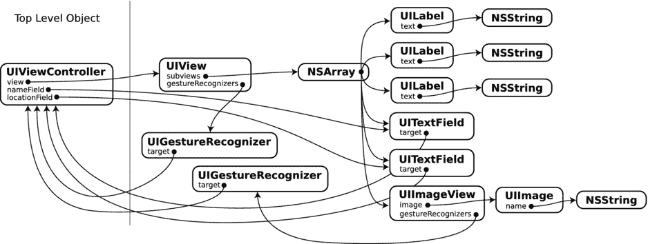

图 15-2. 详细视图场景中的对象图

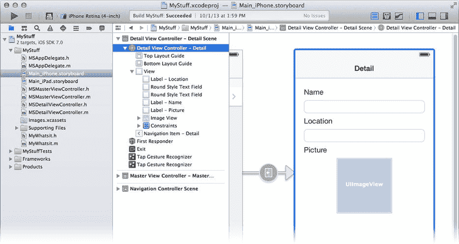

图 15-1. 界面构建器中的详细视图

一个故事板场景至少包含一个顶层对象，即视图控制器。视图控制器的 `view` 属性指向其唯一的根视图对象（`UIView`）。这个根视图又包含一个子视图集合（由 `NSArray` 管理）。其中一些视图对象会引用其他对象，例如 `NSString`、`UIImage` 和 `UIGestureRecognizer` 对象。

`-instantiateViewControllerWithIdentifer:` 方法会触发存储在故事板场景中的视图控制器及其所有相关对象的重新创建（解档）。当由转场触发时，此方法会自动调用；或者，就像你在 Wonderland 应用（第 12 章）中所做的那样，你可以在需要时通过编程方式发送该方法来创建视图控制器。

在反序列化（解档）过程中，序列化数据中的属性值和连接会被用来实例化新对象、设置其属性并将它们连接起来。

## 加载 `.xib` 文件

在 SunTouch 项目中，你将游戏界面设计在一个单独的 `.xib` 文件中。当你自行加载界面构建器文件，或者让 `UIViewController` 为你加载时，对象关系会稍有不同。

请再次参考图 15-2。在故事板场景中，只有一个顶层对象（视图控制器），并且整个对象图是通过解档这一个对象来重建的。请仔细观察图 15-3 中展示的 `STGameViewController.xib` 文件，以及图 15-4 中展示的其简化对象图。

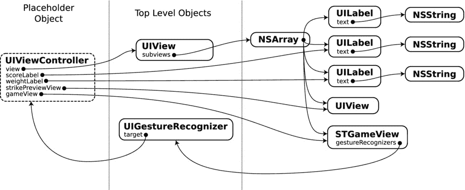

图 15-4. `STGameViewController.xib` 中的对象图

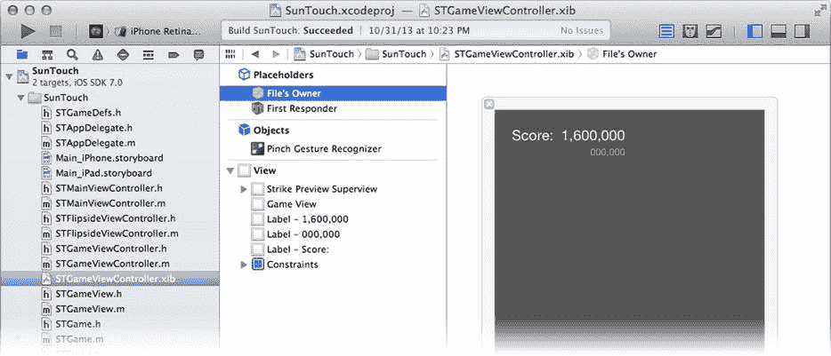

图 15-3. 界面构建器中的 `STGameViewController.xib`

不同之处在于占位对象。占位对象——其中最重要的是文件所有者——是在加载界面构建器文件时已经存在的对象。在解档过程中，现有对象会替换这些占位对象。现有对象会成为对象图的一部分，但并非由界面构建器文件创建。占位对象中的输出口可以设置为在加载过程中创建的对象，并且对象图中的对象可以连接到占位对象。在图 15-4 中，文件所有者（视图控制器）中的 `scoreLabel` 和 `weightLabel` 属性被设置为两个新的 `UILabel` 对象。

到目前为止，在本书中，你使用界面构建器文件的方式在很大程度上是透明的。你要么在故事板场景中创建界面，要么在独立的 `.xib` 文件中创建界面，并由其视图控制器自动加载。现在，你将学习如何自行加载它们，以及如何指定占位对象。

## 占位对象与文件所有者

当加载一个界面构建器文件时，发送方会提供用于替换文件中占位对象的现有对象。最常见的场景是使用一个占位对象，它被称为文件所有者。这通常是加载该文件的对象；当视图控制器加载其界面构建器文件时，它会将自己声明为文件所有者。你可以提供任意你选择的对象，也可以不提供任何对象（这种情况下零个占位对象）。你也可以选择提供任意数量的其他占位对象。（在本章后面，你将加载一个包含多个占位对象的界面构建器文件。）将文件所有者视为“指定占位符”，其目的是尽可能简化加载包含一个占位对象的界面构建器文件这一常见任务。

需要记住的重要规则是：界面构建器文件中文件所有者的类，必须与文件加载时所有者对象的类一致。你可以在界面构建器中使用身份检查器设置文件所有者的类。当你进行此设置时，相当于做出了一个承诺：文件加载时，实际对象将是该类（或其子类）。

将文件所有者的类从 `UIViewController` 更改为 `UIApplication` 并不会神奇地让你的界面构建器文件访问应用中的 `UIApplication` 对象。它仅仅意味着 `UIViewController` 对象（文件的真正所有者）将被当作一个 `UIApplication` 对象来处理，这很可能会导致不良后果。

**警告**

在界面构建器中更改任何占位对象的类时，请确保将其设置为文件加载时提供的实际对象的类或其父类。

文件所有者的主要用途是获取对界面构建器文件中创建的对象的访问权。要访问这些对象中的任何一个，你必须获得对它们的引用。虽然可以获取对顶层对象的引用，但所有其他对象必须间接访问，要么通过顶层对象中的属性，要么通过文件所有者对象中设置的连接。在图 15-4 所示的例子中，`STGameView` 对象可以通过所有者对象的 `gameView` 属性访问。如果没有占位对象，访问你刚刚创建的对象将变得困难（有时甚至不可能）。

当加载一个界面构建器文件时，只有占位对象中在文件里连接的输出口才会被设置。所有其他属性和输出口保持不变。

界面构建器文件内的对象只能与对象图中的其他对象或占位对象建立连接。例如，由视图控制器加载的对象不能直接连接到应用委托对象。该对象不在对象图中。第一响应者是个例外。第一响应者是一个隐含的对象，它可以是响应者链中的任何对象。正如你在第 4 章中所学的，响应者链一直延伸到 `UIApplication` 对象。

现在你已了解界面构建器文件中的对象是如何创建的，是时候深入探讨对象是如何被定义、如何相互连接，以及这对你的应用意味着什么了。


### 创建对象

向 Interface Builder 文件中添加对象，等同于以编程方式创建该对象。这是一个需要掌握的关键概念。从 Interface Builder 文件创建的对象并没有什么“特别”之处。你总是可以编写出实现完全相同结果的代码；只是这样做极其繁琐，而这正是 Interface Builder 最初被发明的原因。

在图 15-5 中，一个对象正在被添加到 Interface Builder 文件中。此图摘自第 8 章的 `ColorModel` 项目。

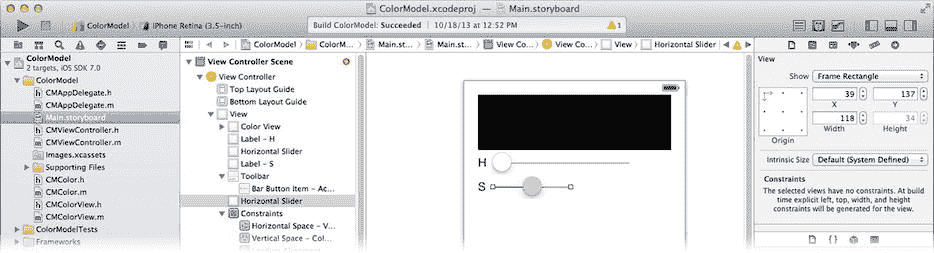

图 15-5.

向 Interface Builder 文件添加对象

正在被添加的对象是一个 `UISlider` 对象。它以一个 `((39,137),(118,34))` 的框架被创建，并且是根 `UIView` 的一个子视图。等效的代码（在视图控制器中）如下：

```
UISlider *newSlider = [[UISlider alloc] initWithFrame:CGRectMake(39,137,118,34)];
```

```
[self.view addSubview:newSlider];
```

这段代码创建了一个具有所需尺寸的新 `UISlider` 对象，并将其添加到视图控制器的根视图对象中。两种方法（Interface Builder 和编程方式）的最终结果是一样的。

**注**

Interface Builder 了解一些特殊的对象关系，并自动为你创建这些关系。例如，当你添加一个视图对象作为子视图时，这等同于向父视图发送一条 `-addSubview:` 消息。如果你向工具栏添加栏按钮项，等效的消息将是 `-setItems:animated:`。将一个新的手势识别器拖放到视图中，等同于向其发送一条 `-addGestureRecognizer:` 消息。添加约束则等同于发送 `-addConstraint:` 或 `-addConstraints:` 消息，依此类推。

`UISlider` 对象在 Interface Builder 文件中被创建的方式与你通过编程方式创建它的方式之间，只有一个技术上的区别。当你编写代码创建视图对象时，你会使用 `-initWithFrame:` 初始化消息。而当一个对象被解档时（这是 Interface Builder 文件中对象被创建的方式），对象是通过 `-initWithCoder:` 消息创建的。编码器参数包含一个对象，该对象拥有新对象所需的所有属性，包括其框架。你将在第 19 章中了解关于 `-initwithCoder:` 的全部内容。

### 任意对象及其属性

到目前为止，你只使用 Interface Builder 从对象库中添加对象，或添加这些库对象的自定义子类（最常见的是 `UIView`）。使用身份检查器，你可以编辑对象的类，将其转换为你创建的任何自定义子类。但你并不能将对象的类更改为任意类。或者可以吗？

如果你在对象库中摸索一下，会发现一个有趣的对象：`Object`（参见图示）。它是一个 `NSObject` 对象。就其本身而言，它几乎毫无用处。但由于你将创建的所有对象都是 `NSObject` 的子类，因此你可以使用身份检查器将该对象的类更改为你想要的任何对象类。

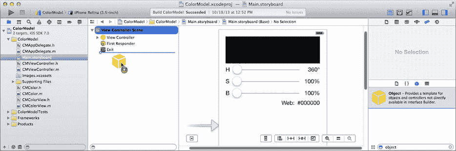

此外，身份检查器设置自定义对象属性的能力有限。在 `ColorModel` 应用中，你以编程方式创建了 `CMColor` 对象，该对象是应用的数据模型对象，然后设置了其初始属性值。你也可以在 Interface Builder 中创建该对象。在你的 `CMViewController.h` 接口中，修改 `colorModel` 属性，使其成为一个 Interface Builder 出口（outlet），如下所示（新代码以粗体显示）：

`@property (strong,nonatomic) IBOutlet CMColor *colorModel;`

要创建实际的 `CMColor` 对象，请将一个 `Object` 对象拖拽到对象轮廓的顶层（如上所示）。使用身份检查器将其类更改为 `CMColor`，然后将 `colorModel` 出口连接到新对象，如下一张图所示。（将 `CMColorView` 类的 `colorModel` 属性也设为出口并进行连接。）

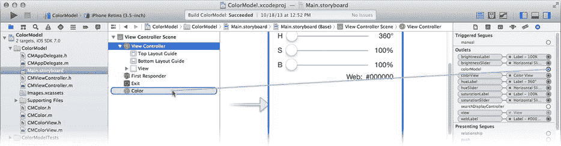

要编辑自定义对象的属性，请将它们添加到“用户定义的运行时属性”部分，如下一张图所示。你可以设置以下任意类型的对象属性：`BOOL`、任意类型的数字（整数或浮点数）、`NSString`、`CGPoint`、`CGSize`、`CGRect`、`NSRange` 或 `UIColor`。只需点击 + 按钮，然后描述属性的名称、类型以及你想要设定的值即可（参见下一张图）。

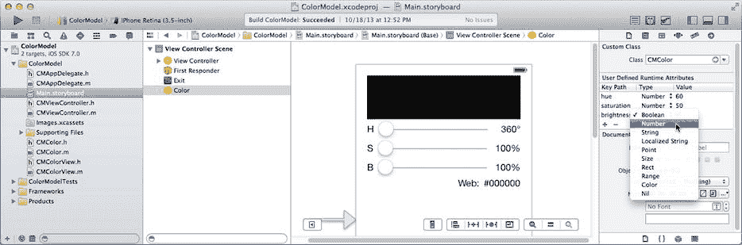

位于 `Learn iOS Development Projects` ➤ `Ch 15` ➤ `ColorModel` 文件夹中的项目已按照这里描述的方式进行了修改，完全在 Interface Builder 中创建、配置并连接了 `CMColor` 对象。看看在 `-viewDidLoad:` 中显示的代码。

你可以将此技术与其它标准库对象的自定义子类结合使用。如果你创建了一个 `UIView` 的子类，你可以在属性检查器中设置所有标准的 `UIView` 属性，然后使用身份检查器设置你的类定义的任何其他属性。

### 编辑属性

但是框架并不是 `UISlider` 对象的唯一属性。当你在 `ColorModel` 中创建滑块对象时，你使用了属性检查器来更改其几个属性。你将其最大值范围更改为 360，并选中了“更新事件：连续”。这等同于编写以下代码：

```
newSlider.maximumValue = 360;
```

```
newSlider.continuous = YES;
```

同样，尽管在设置这些属性值的方式上存在细微差别，但最终得到的对象与 Interface Builder 文件创建的对象是无法区分的。


### 连接

你已经了解了 Interface Builder 文件中的对象及其属性是如何创建的，但连接呢？图 15-6 展示了 `hueSlider` 插座变量正连接到一个滑块对象。

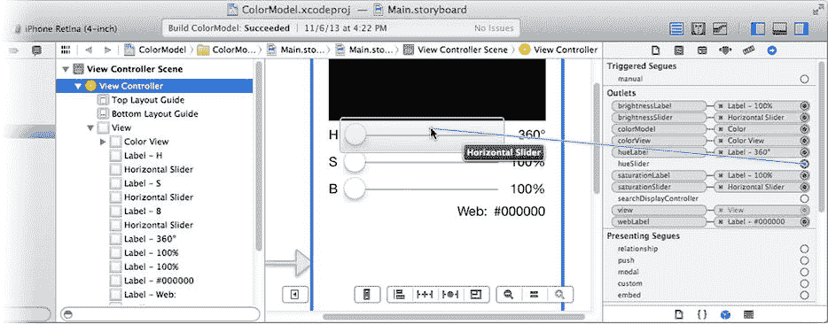

图 15-6. 在 Interface Builder 中连接一个插座变量

以下是等效的代码：

`self.hueSlider = newSlider;`

而这一次，当我说“等效”时，我的意思是“完全相同”。Interface Builder 文件中的对象是分阶段创建的。第一阶段，所有对象都被创建并设置了属性。下一阶段，所有的连接被建立。这些连接使用的是与你通过编程方式设置插座属性相同的方法。

操作（Action）连接稍微复杂一些。一个操作连接包含两个，可能三个信息片段。

发送单个操作的对象（如 `UIGestureRecognizer`、`UIBarButtonItem` 等）通过设置两个属性来连接：`target` 和 `action`。`target` 属性是接收消息的对象（通常是控制器）。`action` 是选择器（如 `-play:`、`-pause:`、`-someoneMashedAButton:`），它决定了目标对象接收哪条消息。某些对象（例如 `UIGestureRecognizer`）可以配置为向多个目标发送消息。你可以像这样通过编程方式连接这些对象：

`[gestureRecognizer addTarget:viewController action:@selector(changeColor:)];`

> **注意：** 在 Shapely 应用中，你通过编程方式创建了手势识别器对象，但在创建对象时设置了 `target` 和 `action`。这种方式同样有效。

要连接额外的操作，发送更多的 `-addTarget:action:` 消息并包含这些额外操作。要断开连接，使用 `-removeTarget:action:`。

其他单一事件对象（例如 `UIBarButtonItem`）只有一个目标属性。这些对象只能向单个目标发送单条消息。你可以通过分别设置 `target` 和 `action` 属性来以编程方式建立操作连接，像这样：

`barButtonItem.target = viewController;`
`barButtonItem.action = @selector(refresh:);`

更复杂的控件对象拥有众多事件，它们中的任何一个都可以配置为在事件发生时发送操作消息。一个 `UISlider` 对象可以在以下情况发送操作消息：用户触摸控件（`UIControlEventTouchDown`）、拖动到其边框外（`UIControlEventTouchDragOutside`）、在其边框外松开手指（`UIControlEventTouchUpOutside`）、在其边框内松开手指（`UIControlEventTouchUpInside`），或滑块的值发生变化（`UIControlEventValueChanged`）。每个事件都由一个事件常量标识（参见 `UIControlEvents`）。任何事件都可以配置为向多个目标发送操作消息。在图 15-7 中，`Value Changed` 事件正被配置为向视图控制器发送一条 `-changeHue:` 消息。

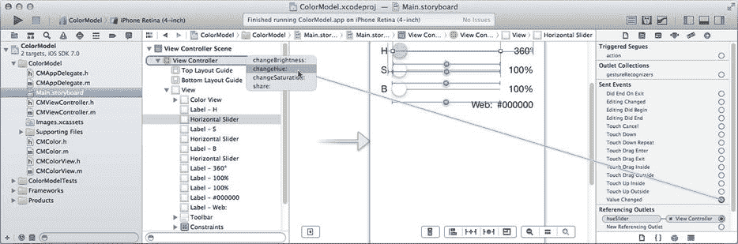

图 15-7. 为 Value Changed 事件创建一个操作连接

创建相同连接的代码如下所示：

```
[newSlider addTarget:viewController
              action:@selector(changeHue:)
    forControlEvents:UIControlEventValueChanged];
```

> **提示：** `UIControlEvents` 是一组位掩码。将多个常量进行“或”运算组合在一起，可以一次性将操作消息附加到多个事件上。

### 发送操作消息

至此，你应该不会惊讶于操作消息也可以通过编程方式发送。如果你想发送一条操作消息，你所需要做的只是向应用程序对象（`[UIApplication sharedApplication]`）发送一条 `-sendAction:to:from:forEvent:` 消息。

`UIControl` 的子类通过向自身发送 `-sendAction:to:forEvent:` 消息来触发事件。顺带一提，这只会转而向你的应用程序对象发送 `-sendAction:to:from:forEvent:` 消息，并将自身作为 `from:` 参数传入。

> **提示：** 如果你是在响应一个 iOS 事件（第 4 章）时发送操作事件，礼貌的做法是在 `forEvent:` 参数中包含 `UIEvent` 对象。否则，请传入 `nil`。

你可以通过向其发送 `-sendActionsForControlEvents:` 消息，以编程方式使任何 `UIControl` 对象发送与其一个或多个事件相关联的操作。

在所有情况下——无论是通过编程方式发送操作消息还是在配置控件对象时——目标对象都可以是 `nil`。当它为 `nil` 时，操作消息将被发送到响应者链，从第一响应者开始，而不是任何特定对象（参见第 4 章）。要向响应者链发送任意消息，使用类似这样的代码：

```
[[UIApplication sharedApplication] sendAction:@selector(orderIceCream:)
                                           to:nil /* 响应者链 */
                                         from:self
                                     forEvent:nil];
```

现在你已经很好地理解了 Interface Builder 的工作原理，以及对象如何被创建、配置和连接。你也学习了 Interface Builder 所做工作的大部分等效代码，因此你能像在 Shapely 应用中那样，以编程方式创建、配置和连接对象。

把这些都忘掉吧。嗯，也不是忘掉——也许将来某天你会用到——只是暂时先放在一边。了解 Interface Builder 文件的工作原理以及完成相同工作需要编写的代码固然很好。但拥有 Interface Builder 的意义恰恰在于你不需要亲自做这些工作！现在是时候让 Interface Builder 为你工作，而不是编写代码去替代它。

## 掌控 Interface Builder 文件

既然你已经理解了 Interface Builder 文件是什么以及它们如何工作，你就可以轻松地为你应用添加新的 Interface Builder 文件，并在需要时加载它们。这是介于视图控制器对 Interface Builder 文件的完全自动使用，与完全用代码创建视图对象之间的中间地带。在本节中，你将学习：

* 向项目添加一个独立的 Interface Builder 文件
* 以编程方式加载 Interface Builder 文件
* 指定多个占位对象，以供 Interface Builder 对象连接

回顾第 11 章，你编写了 Shapely 应用。每次点击按钮，你都会创建一个新的形状（`SYShapeView`）对象、配置它，并附加一连串的手势识别器，整个过程只使用了 Objective‑C。这些代码中有多少可以用 Interface Builder 来实现？让我们来一探究竟。


### 声明占位对象

从第 11 章完成的 Shapely 项目开始，添加一个新的 Objective-C 类文件，将其命名为 `SYShapeFactory`，并使其成为 `NSObject` 的子类。再添加另一个文件，但这次从 `iOS` ➤ `User Interface` 组中选择 `View` 文件模板，如图 15-8 所示。如果 Xcode 询问设备系列，请任意选择一个；这不会有影响。将文件命名为 `SquareShape`。这将向你的项目添加一个独立的 Interface Builder 文件（`SquareShape.xib`），该文件会创建一个单独的 `UIView` 对象。

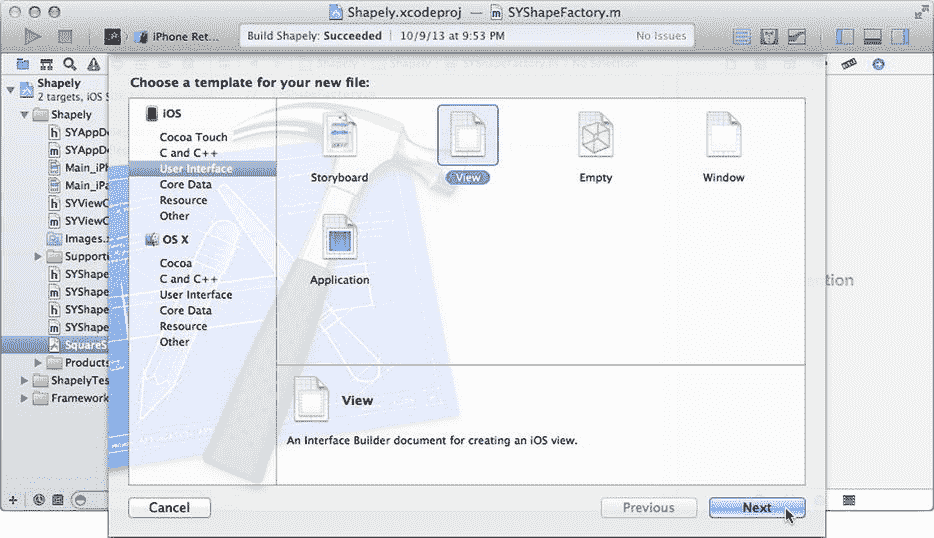

图 15-8. 添加新的 Interface Builder 文件

`SYShapeFactory` 类将成为该文件的所有者。这是你的第一个占位对象。要使用所有者对象，请在导航器中选择新的 `SquareShape.xib` 文件，在占位对象组中选择 `File's Owner`，然后使用身份检查器将其类更改为 `SYShapeFactory`。现在，你可以将对象连接到稍后将要提供的 `SYShapeFactory` 对象。

你还需要将对象（特别是手势识别器）连接到视图控制器。为此，你需要第二个占位对象。从对象库中找到 `External Object` 对象，并将其拖入大纲视图，如图 15-9 左侧所示。选中它并将其类更改为 `SYViewController`。在占位对象仍处于选中状态时，使用属性检查器为其分配一个标识符 `viewController`，如图 15-9 右侧所示。现在，新 Interface Builder 文件中的对象可以连接到 `SYShapeFactory` 或你的 `SYViewController` 对象。接下来是设计你的对象的时候了。

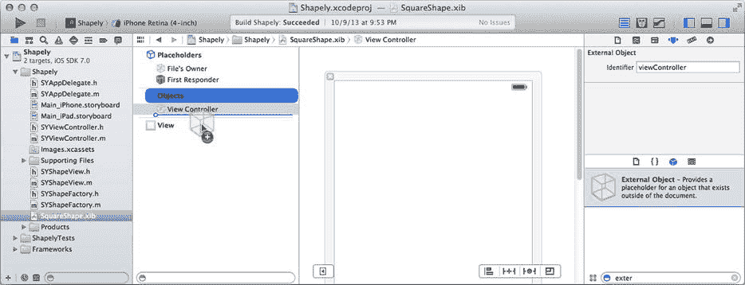

图 15-9. 定义第二个占位对象

### 设计 `SYShapeView`

在 `SquareShape.xib` 文件中选中单个视图对象，然后使用身份检查器将其类更改为 `SYShapeView`。

切换到属性检查器。Xcode 其实并不知道你打算将 Interface Builder 文件中的对象用于何种目的。默认情况下，它假定顶级视图对象将成为界面的根视图，因此它会将视图大小调整为 iPhone 或 iPad 屏幕尺寸，并添加一个模拟状态栏。对于 `SYShapeView` 而言并非如此，因此请关闭所有这些默认假设。将模拟大小更改为 `Freeform`，并将状态栏更改为 `None`，如图 15-10 所示。现在使用属性和尺寸检查器设置以下属性：

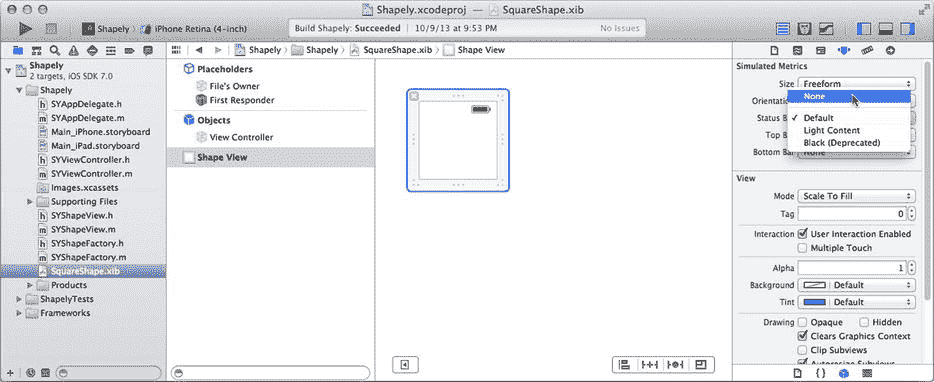

图 15-10. 设计顶级视图对象

*   将背景设置为 `Default`（无）
*   取消选中 `Opaque` 属性
*   确保 `Clears Graphics Context` 已选中
*   将其尺寸设置为 `100` 乘 `100`

现在，你已经复制了通过 `-initWithShape:` 方法生成的新 `SYShapeView` 对象的尺寸和属性——除了 `shape` 属性，这一点稍后解决。

选择 `SYShapeView.h` 文件，删除 `-initWithShape:` 方法原型，并用一个新属性替换它：

```
@property (nonatomic) ShapeSelector shape;
```

这使得 `shape` 属性可设置。稍后我们将需要这个，因为我们不能再使用 `-initWithShape:` 来创建对象（Interface Builder 将使用 `-initWithCoder:` 来创建对象）。

切换到 `SYShapeView.m` 文件并进行以下更改：

*   丢弃 `kInitialDimension` 和 `kInitialAlternateHeight` 的定义
*   从私有 `@interface SYShapeView ()` 指令中移除 `shape` 实例变量
*   删除整个 `-initWithShape:` 方法
*   将对 `shape` 变量的唯一引用替换为 `_shape`（在 `-path` 方法中，只需遵循编译器警告即可）。

看看你已经删除了多少代码？`-initWithShape:` 构造方法的全部目的就是创建并配置一个新的 `SYShapeView` 对象。现在，这项工作的大部分正在你新的 Interface Builder 文件中完成。

### 连接手势识别器

回到 `SquareShape.xib` 文件中，现在是时候添加手势识别器了。从对象库中拖出一个 `Pan Gesture Recognizer` 并将其放到 `SYShapeView` 对象上。选择该识别器对象，并使用属性检查器将其最小和最大触摸次数设置为 `1`，如图 15-11 所示。

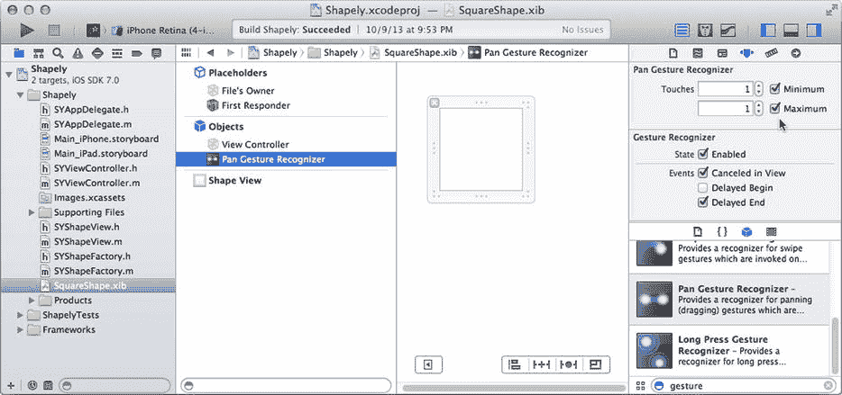

图 15-11. 创建并配置平移手势识别器

切换到连接检查器，并将其发送动作连接到视图控制器占位对象中的 `-moveShape:` 方法，如图 15-12 所示。

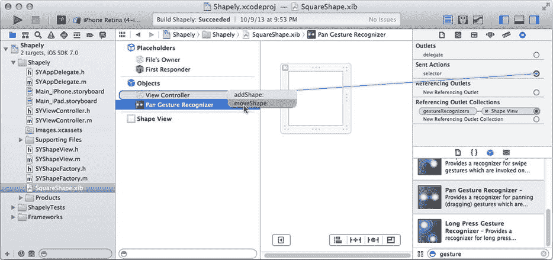

图 15-12. 连接平移手势识别器动作

你现在已经创建了一个仅识别单指拖拽手势的平移手势识别器。它已附加到形状视图对象上，并在触发时向视图控制器发送 `-moveShape:` 消息。生成的手势识别器对象与你之前在 `SYViewController` 的 `-addShape:` 方法中创建、配置和连接的对象完全相同。

添加其他三个手势识别器：

*   将一个 `Pinch Gesture Recognizer` 拖入形状视图。将其发送动作连接到视图控制器的 `-resizeShape:` 方法。
*   将一个 `Tap Gesture Recognizer` 拖入形状视图。将其点击次数设置为 `2`，触摸次数设置为 `1`。将其发送动作连接到 `-changeColor:` 方法。
*   将一个 `Tap Gesture Recognizer` 拖入形状视图。将其点击次数设置为 `3`，触摸次数设置为 `1`。将其发送动作连接到 `-sendShapeToBack:` 方法。

你在 `-addShape:` 方法中编写的许多代码现在已通过 Interface Builder 复制实现。有两个步骤无法在 Interface Builder 中完成；稍后你将在代码中处理它们。


### 构建你的形状工厂

选择 `SYShapeFactory.h` 文件。添加以下 `#include`、`@property` 和方法原型（新代码以粗体显示）：

```
#import "SYShapeView.h"
#import "SYViewController.h"

@interface SYShapeFactory : NSObject

@property (strong,nonatomic) IBOutlet SYShapeView            *shapeView;
@property (strong,nonatomic) IBOutlet UITapGestureRecognizer *dblTapGesture;
@property (strong,nonatomic) IBOutlet UITapGestureRecognizer *trplTapGesture;

- (SYShapeView*)loadShape:(ShapeSelector)shape
        forViewController:(SYViewController*)controller;

@end
```

你的形状工厂对象定义了一些出口（outlet），这些出口将连接到形状视图和选定的手势识别器。你还声明了一个 `-loadShape:forViewController:` 方法，该方法将完成所有工作。

这些代码足以完成必要的连接。选择 `SquareShape.xib` 文件，选择“文件的所有者”（File's Owner），然后使用连接检查器（connections inspector）将 `shapeView`、`dblTapGesture` 和 `trplTapGesture` 出口连接到各自对应的对象，如图 15-13 所示。保存文件。（严肃地说，通过选择 **文件 ➤ 保存** 来保存文件；这很重要。）

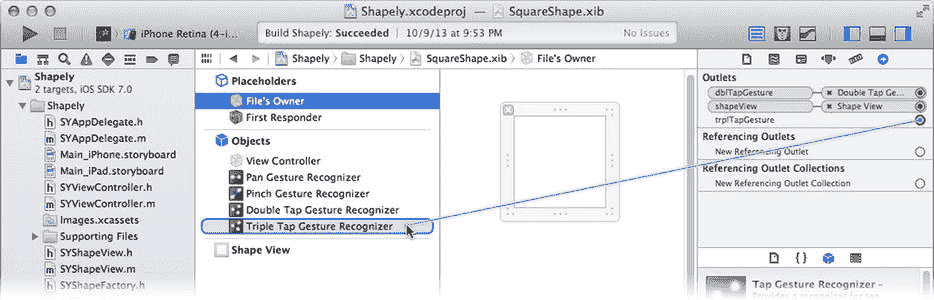

**图 15-13.** 连接工厂出口

**提示：** 确保将正确的手势识别器出口连接到正确的对象，因为这两个对象在大纲中都显示为“点击手势识别器”（`Tap Gesture Recognizer`）。如果你有容易混淆的 Interface Builder 对象，请使用标识检查器（identity inspector）将对象的标签更改为更具描述性的名称。在图 15-13 中，我将它们的标签更改为“双击...”和“三击...”，以便区分它们。标签只是外观上的改变，不会以任何方式改变你 Interface Builder 设计的功能。

还有一个方面——抱歉使用了双关语——尚未解决，那就是正方形、矩形、圆形和椭圆形之间的差异。如果你还记得，`-initWithShape:` 方法对于矩形和椭圆形会生成一个 100×50 像素的视图，而对于其他形状则生成 100×100 像素的视图。在这个版本中，你将使用两个 Interface Builder 文件来复现这一逻辑。`SYShapeFactory` 将选择加载哪一个。

首先创建第二个 Interface Builder 文件。选择 `SquareShape.xib` 文件，然后选择 **编辑 ➤ 复制...** 命令，如图 15-14 所示。

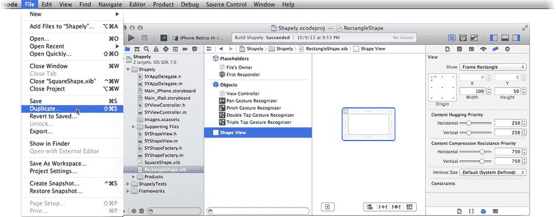

**图 15-14.** 创建 `RectangleShape.xib` 文件

将文件命名为 `RectangleShape`。选择新文件，选择形状视图对象，然后使用尺寸检查器（size inspector）将形状视图的高度更改为 `50`，如图 15-14 所示。现在你有了两个 Interface Builder 文件，一个生成 100×100 的视图，另一个生成 100×50 的视图。

现在切换到 `SYShapeFactory.m` 文件。添加一个类方法，该方法将为给定的形状选择加载哪个 Interface Builder 文件（`SquareShape` 或 `RectangleShape`）（新代码以粗体显示）：

```
#import "SYShapeFactory.h"

@interface SYShapeFactory ()

+ (NSString*)nibNameForShape:(ShapeSelector)shape;

@end

@implementation SYShapeFactory

+ (NSString*)nibNameForShape:(ShapeSelector)shape
{
    switch (shape) {
        case kRectangleShape:
        case kOvalShape:
            return @"RectangleShape";
        default:
            return @"SquareShape";
        }
}
```

### 加载 Interface Builder 文件

你现在可以通过加载 Interface Builder 文件来创建形状视图和手势识别器对象了。现在编写 `-loadShape:forViewController:` 方法：

```
- (SYShapeView*)loadShape:(ShapeSelector)shape
        forViewController:(SYViewController*)controller;
{
    NSDictionary *placeholders = @{ @"viewController": controller };
    NSDictionary *options = @{ UINibExternalObjects: placeholders };
    
    [[NSBundle mainBundle] loadNibNamed:[SYShapeFactory nibNameForShape:shape]
                                  owner:self
                                options:options];
    
    self.shapeView.shape = shape;
    [_dblTapGesture requireGestureRecognizerToFail:_trplTapGesture];
    
    return _shapeView;
}
```

前两个语句准备好视图控制器，使其在加载 Interface Builder 文件时作为占位符对象。你可以传递任意数量的占位符对象，只需确保它们的类和标识符与你之前在 Interface Builder 文件中定义的外部对象一致即可。

第三个语句是魔法发生的地方。`-loadNibNamed:owner:options:` 方法在你的应用包中搜索具有该名称的 Interface Builder 文件。名称（`SquareShape` 或 `RectangleShape`）由你之前添加的 `+nibNameForShape:` 方法决定。`owner` 参数成为文件的所有者占位符对象。`options` 参数是一个包含特殊选项的字典。在本例中，唯一的特殊选项是额外的占位符对象（`UINibExternalObjects`）。

当发送 `-loadNibNamed:owner:options:` 消息时，所有者以及任何额外的占位符对象会取代“文件的所有者”（File's Owner）以及 Interface Builder 文件中定义的相应外部对象。文件中的对象被创建，对象的属性根据你编辑的属性进行设置，最后建立所有出口和操作连接。

**提示：** 如果你的代码需要在对象由 Interface Builder 文件创建时执行，请重写你的对象的 `-awakeFromNib` 方法。当 Interface Builder 文件或场景被加载时，它创建的每个对象都会收到一个 `-awakeFromNib` 消息。这发生在所有属性和连接设置完成之后。

该方法返回一个 `NSArray`，其中包含文件中创建的所有顶层对象。你可以通过这个数组，或者通过你连接到占位符的出口来访问文件创建的对象。在本应用中，你使用了后一种技术。

**注意：** 你创建 `SYShapeFactory` 类的主要原因是为了提供一个所有者对象，该对象具有能方便地提供对形状视图和识别器对象引用的出口。另一种解决方案是让视图控制器成为文件的所有者，然后在返回的顶层对象 `NSArray` 中寻找形状视图和识别器对象。

最后两个语句处理了 Interface Builder 无法完成的两个步骤。视图的 `shape` 属性被设置，并且双击/三击的依赖关系被建立。


### 替换代码

切换到 `SYViewController.m` 文件。在其他 `#import` 语句后添加一条 `#import "SYShapeFactory.h"` 语句。现在找到 `-addShape:` 方法，并用以下代码替换以编程方式创建新 `SYShapeView` 对象的代码（修改部分以粗体显示）：

`- (IBAction)addShape:(id)sender`

`{`

    `SYShapeView *shapeView = [[SYShapeFactory new] loadShape:[sender tag]`

                                           `forViewController:self];`

现在，进入有趣的部分：找到 `-addShape:` 中用于创建、配置和连接四个手势识别器的代码并全部删除。你现在不再需要这些代码了。所有四个手势识别器都已由 Interface Builder 文件创建、配置并连接。

运行完成后的应用并观察结果。你应该无法分辨这个版本的 Shapely 与第 11 章中的版本有任何区别，而这正是关键所在。本练习强调了在 Interface Builder 中创建对象的的主要优点和缺点：

-   在 Interface Builder 中，对象易于创建、配置和连接。这减少了需要编写的代码量，节省了时间，并有可能减少错误。（优点）
-   某些属性和对象关系（例如双击/三击依赖关系）无法在 Interface Builder 中设置，必须以编程方式实现。（缺点）
-   可以轻松地在多个 Interface Builder 文件之间切换。无需编写大量的 `if`/`else` 或 `switch` 语句，只需选择不同的 Interface Builder 文件，即可创建完全不同的对象集。（优点）
-   受限于 Interface Builder 支持的配置和初始化方法。在 Shapely 中，你必须提供一个可设置的 `shape` 属性，以便在对象创建后对其进行“修复”，因为你无法再使用 `-initWithShape:` 方法。（缺点）
-   Interface Builder 使得创建复杂的对象集变得容易，尤其是在处理手势识别器和布局约束时。要重现许多界面所需的布局约束，通常需要编写数页密集且难以阅读的代码。（巨大优点）
-   要获取对 Interface Builder 文件中创建的对象引用，有时可能需要付出相当大的努力。你可能需要创建特殊的占位对象，或者费力地遍历 `-loadNibNamed:owner:options:` 返回的顶级对象。在本节中，你创建了一个类（`SYShapeFactory`），其唯一目的是为形状视图和手势识别器的引用提供出口。（缺点）

Interface Builder 文件并非所有界面的最佳解决方案；有时，你只需要几行编写良好的代码。但在大多数情况下，Interface Builder 可以让你免于编写、维护和调试（字面意义上的）数千行代码。它是一个极其灵活且高效的工具，可以让你从数小时的工作中解放出来，并提高应用的质量。你只需要了解它是如何工作的以及如何使用它。

## 总结

Interface Builder 是 Xcode 的基石之一，也是 iOS 应用开发如此顺畅的原因。理解其工作原理能让你获得优势。了解它能做什么以及如何做，你就可以将其发挥到极致，或者用自己的代码接管控制权；这是你的选择。

直接加载 Interface Builder 文件才能真正体现出其灵活性。现在你知道如何在实际上的任何界面、界面的一个片段、或者仅仅是 Interface Builder 文件中的一些任意对象中进行定义，并在需要的时候和位置加载它们。你知道如何创建任何你喜欢的对象，设置其自定义属性，并将其与应用中现有的对象连接起来。这是一个触手可及的、极其有用的工具。

