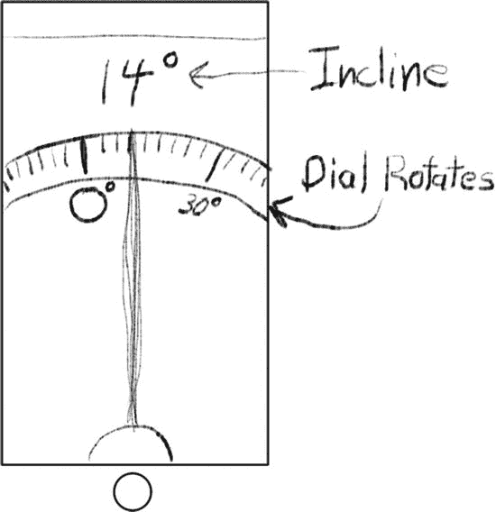

# 16. 有态度的应用

**摘要**

凭借着足以让韦恩·萨林斯基¹感到自豪的小型化成就，大多数 iOS 设备都配备了一系列传感器，用于检测加速度、旋转和磁力方向——这包含了诸多“动态”。这些传感器的综合输出，再加上一点数学运算，能以惊人的精度告知你的应用设备当前的姿态（倾斜方式）、是否正在移动或旋转（以及移动/旋转速度）、重力方向以及磁北极方向。你可以将这些功能整合到应用中，使其具有一种超乎寻常的即时感。你可以根据用户握持设备的方向呈现信息，通过物理手势控制游戏，告知用户即将拍摄的照片是否水平，以及更多应用场景。

凭借着足以让韦恩·萨林斯基¹感到自豪的小型化成就，大多数 iOS 设备都配备了一系列传感器，用于检测加速度、旋转和磁力方向——这包含了诸多“动态”。这些传感器的综合输出，再加上一点数学运算，能以惊人的精度告知你的应用设备当前的姿态（倾斜方式）、是否正在移动或旋转（以及移动/旋转速度）、重力方向以及磁北极方向。你可以将这些功能整合到应用中，使其具有一种超乎寻常的即时感。你可以根据用户握持设备的方向呈现信息，通过物理手势控制游戏，告知用户即将拍摄的照片是否水平，以及更多应用场景。

在第 4 章中，你使用了高级的“设备摇晃”和“方向改变”事件来触发 EightBall 应用中的动画。在本章中，你将直接连接到低层级的加速度计信息，并对设备位置的瞬时变化做出反应。在本章中，你将学习：

-   收集加速度计和其他设备运动数据
-   使用计时器

你还将获得更多在自定义视图对象中使用仿射变换的练习，并使用 iOS 7 中新增的一些炫酷动画功能。让我们开始吧。

**注意**

你需要一台配置了开发者证书的 iOS 设备来测试本章中的代码。iOS 模拟器不会模拟加速度计数据。

### 水平仪

你要创建的应用是一个简单的数字水平仪，名为 Leveler。² 它是一个单屏应用，显示一个刻度盘，指示设备的倾斜角度（相对于假想铅垂线的角度），如图 16-1 所示。

图 16-1. Leveler 设计

### 创建 Leveler

创建一个新的 Xcode 项目，步骤如下：

-   使用 `Single View Application` 模板
-   产品名称：`Leveler`
-   类前缀：`LR`
-   设备：`Universal`
-   创建项目后，编辑支持的界面方向以支持所有设备方向

Leveler 需要一些图片和源代码资源。你可以在 `Learn iOS Development Projects` ➤ `Ch 16` ➤ `Leveler (Resources)` 文件夹中找到这些图片文件。将 `hand.png` 和 `hand@2x.png` 文件添加到 `Images.xcassets` 图片目录中。在完成后的 `Leveler-1` 项目文件夹中，找到 `LRDialView.h` 和 `LRDialView.m` 文件。将它们也添加到你的项目中，放在其他源文件旁边。记得在导入对话框中勾选 `Copy items into destination group's folder` 选项。你还可以在 `Leveler (Icons)` 文件夹中找到一组应用图标，可以将其拖入图片目录的 `AppIcon` 组中。

在编写收集加速度计数据的代码之前，你将首先布局并连接显示倾斜角度的视图。

