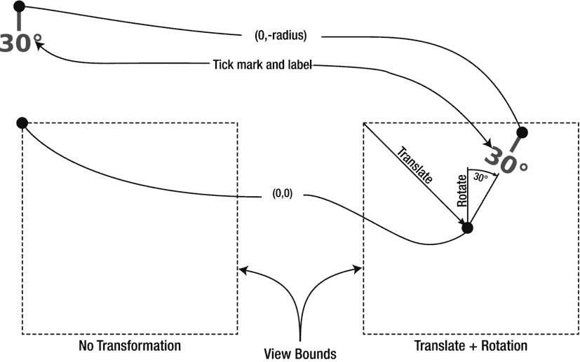

# 深入探究 LRDialView

你刚刚添加的源文件中包含一个自定义 `UIView` 对象的代码，该对象用于绘制一个圆形“刻度盘”。阅读完第 11 章后，你应该能轻松理解其工作原理。其中最有趣的部分是在图形上下文中使用了仿射变换。在第 11 章中，你将仿射变换应用于视图对象，使其看起来偏离实际框架或缩放。而在 `LRDialView` 中，仿射变换是在绘制前应用于图形上下文的。此后绘制的所有内容都会使用该变换进行平移。

在 `LRDialView` 中，这项技术用于在“刻度盘”内侧绘制刻度线和角度标签。如果你感兴趣，可以找到 `LRDialView.m` 文件中的 `-drawRect:` 方法。关键代码以粗体显示，无关代码已用省略号替换：

```
#define kCircleDegrees      360
#define kMinorTickDegrees   3
...
- (void)drawRect:(CGRect)rect
{
    CGContextRef context = UIGraphicsGetCurrentContext();
    CGRect bounds = self.bounds;
    CGFloat radius = bounds.size.height/2;
    ...
    CGContextTranslateCTM(context,radius,radius);
    for ( NSUInteger angle=0; angle<kCircleDegrees; angle+=kMinorTickDegrees )
        {
        ... 绘制一条垂直刻度线和水平标签 ...
        CGContextConcatCTM(context, ↩︎
                    CGAffineTransformMakeRotation(kMinorTickDegrees*M_PI/180));
        }
}
```

`-drawRect:` 方法首先对上下文应用平移变换。这会偏移绘制坐标，实际上是将视图本地坐标系的原点移动到视图的中心。（如你稍后所见，该视图始终为正方形。）应用此变换后，如果你在 `(0,0)` 处绘制图形，它现在会绘制在视图中心，而不是左上角。

循环绘制一条垂直刻度线及其下方的可选文本标签。在循环结束时，上下文的绘制坐标会旋转 3°。第二次循环时，刻度线和标签将旋转 3°。第三次循环时，所有绘制内容将旋转 6°，依此类推，直到整个刻度盘绘制完成。上下文变换是累加的。

需要理解的关键概念是，应用于绘制上下文的变换会影响正在绘制到视图中的内容坐标系，如图 16-2 所示。上下文变换不会改变视图的框架、边界或其在其父视图中的位置。



*图 16-2. 图形上下文变换*

要改变视图在其父视图中的显示方式，你需要像在 Shapely 应用中那样设置视图的 `transform` 属性。这正是视图控制器（稍后）将在屏幕上旋转刻度盘时所做的工作。这凸显了在绘制过程中使用仿射变换与使用变换来改变最终视图外观之间的区别。

另请注意，该视图只绘制一次。`-drawRect:` 中所有这些复杂的代码仅在视图首次绘制或调整大小时执行。视图绘制完成后，刻度盘的缓存图像会显示在屏幕上，并通过视图的 `transform` 属性进行旋转。这第二次使用变换只是转录缓存图像中的像素；它不会导致视图以新角度重新绘制自身。从这个角度来说，绘制效率非常高。这一点很重要，因为你稍后还要对它进行动画处理。

